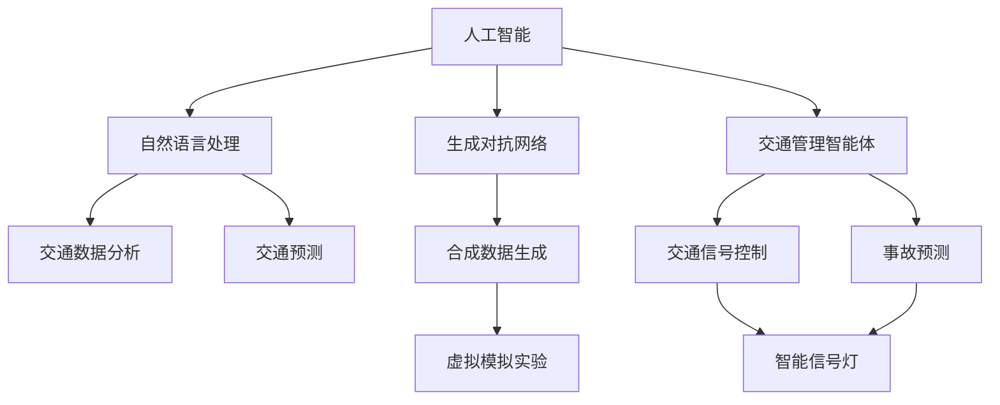

                 

# AIGC助力智能交通管理

> 关键词：AIGC, 智能交通管理, 自然语言处理, 图像识别, 生成对抗网络, 自动驾驶, 交通预测

## 1. 背景介绍

### 1.1 问题由来

随着城市化进程的不断加速，交通拥堵、事故频发、环境污染等问题日益突出。传统交通管理依赖于大量的传感器和监控设备，以及人工处理和调度，效率低下，难以应对复杂的城市交通环境。现代智能交通管理系统(ITS)需要利用先进的信息技术、数据处理技术、智能控制技术，提升交通流管理、事故预防、应急响应等方面的效率和安全性。

近年来，人工智能和生成对抗网络(AIGC)技术的迅猛发展，为交通管理带来了新的契机。AIGC技术包括自然语言处理(NLP)、图像识别、生成对抗网络等多种前沿技术，能够实时处理和理解大量的交通数据，为交通管理提供智能决策支持。本文章将详细介绍AIGC在智能交通管理中的应用，并给出实际案例和开发实践。

## 2. 核心概念与联系

### 2.1 核心概念概述

为更好地理解AIGC技术在智能交通管理中的应用，本节将介绍几个关键概念：

- 人工智能(Artificial Intelligence, AI)：指由计算机系统模拟人类智能行为的技术，涵盖感知、认知、推理等多个层面。
- 生成对抗网络(Generative Adversarial Networks, GANs)：指由生成器和判别器两部分组成的一种深度学习模型，能够生成逼真的合成数据，如图像、语音等。
- 自然语言处理(Natural Language Processing, NLP)：指处理和理解自然语言的计算机技术，涵盖语言理解、语义分析、情感分析等多个任务。
- 交通管理智能体：指能够自动感知、分析、控制交通流的智能实体，如自动驾驶车辆、智能信号灯、交通监测系统等。
- 自动驾驶(Autonomous Driving)：指通过AI技术实现车辆自主导航、避障等功能的高级驾驶技术，是智能交通管理的重要组成部分。

这些核心概念之间的逻辑关系可以通过以下Mermaid流程图来展示：



这个流程图展示了大语言模型的工作原理和优化方向：

1. 人工智能提供核心智能能力，包括感知、认知、推理等。
2. 生成对抗网络生成合成数据，丰富模型训练样本。
3. 自然语言处理处理和理解交通数据。
4. 交通管理智能体自动感知、分析、控制交通流。
5. 交通数据分析和预测为智能体提供决策支持。
6. 虚拟模拟实验验证模型效果。

这些核心概念共同构成了智能交通管理的技术框架，使其能够在各种场景下发挥强大的智能交通管理能力。通过理解这些核心概念，我们可以更好地把握AIGC技术的工作原理和优化方向。

## 3. 核心算法原理 & 具体操作步骤
### 3.1 算法原理概述

基于AIGC技术的智能交通管理系统，其核心算法主要包括以下几个部分：

- 数据采集与处理：收集交通监控摄像头、车载传感器、车联网等多种数据源的实时数据，进行数据清洗、格式转换等预处理。
- 交通数据分析：利用NLP技术进行交通事件的自动检测与分类，提取关键交通特征。
- 交通预测：通过时间序列分析和机器学习技术，预测交通流量、拥堵等指标的变化趋势。
- 信号控制：基于交通预测结果，智能生成和调整交通信号灯控制策略。
- 自动驾驶：利用自动驾驶技术，对自动驾驶车辆进行路径规划、导航控制等操作。
- 事故预测与应急响应：利用NLP和图像识别技术，自动分析交通事故现场信息，预测事故影响范围，启动应急响应机制。

### 3.2 算法步骤详解

基于AIGC技术的智能交通管理系统的一般流程如下：

**Step 1: 数据采集与预处理**
- 收集交通监控摄像头、车载传感器、车联网等多种数据源的实时数据。
- 对数据进行清洗、格式转换、缺失值处理等预处理操作，保证数据的准确性和一致性。

**Step 2: 交通数据分析**
- 利用NLP技术对交通监控摄像头拍摄的视频帧进行事件检测和分类，识别出交通违规行为、交通事故等。
- 提取交通事件的关键特征，如车辆位置、速度、方向等，为后续分析提供数据支持。

**Step 3: 交通预测**
- 使用时间序列分析和机器学习技术，建立交通流量预测模型。
- 根据历史交通数据和当前交通状态，预测未来的交通流量和拥堵情况，生成交通预测结果。

**Step 4: 信号控制**
- 基于交通预测结果，智能生成和调整交通信号灯控制策略。
- 通过信号控制算法实现交通流量的优化，减少拥堵，提升通行效率。

**Step 5: 自动驾驶**
- 使用自动驾驶技术，对自动驾驶车辆进行路径规划、导航控制等操作。
- 通过感知和决策系统，使自动驾驶车辆能够安全、高效地行驶在道路上。

**Step 6: 事故预测与应急响应**
- 利用NLP和图像识别技术，自动分析交通事故现场信息，预测事故影响范围。
- 根据事故严重程度，启动应急响应机制，协调警方、医院、消防等资源，进行紧急处理。

### 3.3 算法优缺点

基于AIGC技术的智能交通管理系统具有以下优点：
1. 实时性高。通过实时采集和处理数据，系统可以及时响应交通事件，减少延误。
2. 数据丰富。多种数据源的融合，提供了更全面的交通信息，有利于做出更准确的决策。
3. 智能化程度高。利用先进的AI和GAN技术，提升了系统对交通流的感知和预测能力。
4. 资源利用率提升。通过智能信号灯控制，减少了交通拥堵，提高了道路资源利用率。

同时，该方法也存在一定的局限性：
1. 依赖数据质量。数据采集和处理环节的准确性直接影响了系统的性能。
2. 算法复杂度大。AI和GAN技术的实现需要大量的计算资源和专业知识。
3. 安全性问题。系统对数据和算法的依赖，使得安全问题成为关注的焦点。
4. 技术门槛高。系统开发和维护需要专业的技术人员，对一般企业来说，技术门槛较高。

尽管存在这些局限性，但就目前而言，基于AIGC的智能交通管理系统仍然是最先进的交通管理解决方案之一。未来相关研究的重点在于如何进一步降低技术门槛，提高系统可靠性，增强系统安全性，以更好地服务于智能交通管理。

### 3.4 算法应用领域

基于AIGC技术的智能交通管理系统，已经在多个领域得到应用，例如：

- 智能信号灯控制：利用AI技术对交通流量进行实时预测，智能生成和调整交通信号灯控制策略，提升路口通行效率。
- 自动驾驶车辆：通过自动驾驶技术，实现车辆的自主导航和路径规划，减少人为驾驶错误，提升道路安全。
- 事故预测与应急响应：利用图像识别和NLP技术，自动分析交通事故现场信息，预测事故影响范围，启动应急响应机制。
- 交通数据分析：对交通监控摄像头拍摄的视频帧进行事件检测和分类，提取关键交通特征，用于交通预测和优化。
- 交通流量预测：使用时间序列分析和机器学习技术，预测交通流量和拥堵情况，为信号控制提供数据支持。
- 虚拟模拟实验：通过虚拟仿真技术，对交通管理方案进行模拟测试，评估其效果和可行性。

除了上述这些经典应用外，AIGC技术还被创新性地应用到更多场景中，如智能停车管理、城市应急响应、智能出行规划等，为智能交通管理带来了全新的突破。随着AI和GAN技术的不断进步，相信AIGC技术将在更广阔的应用领域大放异彩。

## 4. 数学模型和公式 & 详细讲解  
### 4.1 数学模型构建

本节将使用数学语言对基于AIGC技术的智能交通管理系统进行更加严格的刻画。

假设交通流量数据为 $\{x_t\}_{t=1}^T$，其中 $x_t$ 为第 $t$ 时刻的交通流量。假设交通流量由时间序列 $u_t$ 和随机扰动 $e_t$ 组成，即 $x_t = u_t + e_t$。

定义时间序列模型为：

$$
u_t = \alpha_0 + \sum_{i=1}^{p} \alpha_i u_{t-i} + \epsilon_t
$$

其中 $\alpha_i$ 为时间序列系数，$\epsilon_t$ 为随机噪声。

利用线性回归模型建立交通流量预测模型：

$$
\hat{x}_t = \beta_0 + \sum_{i=1}^{q} \beta_i x_{t-i} + \delta_t
$$

其中 $\beta_i$ 为线性回归系数，$\delta_t$ 为随机噪声。

### 4.2 公式推导过程

以下我们以交通流量预测为例，推导线性回归模型的参数求解公式。

假设已采集到历史交通流量数据 $\{x_t\}_{t=1}^{T}$，将数据分为训练集和测试集，使用训练集数据 $(x_1, x_2, \ldots, x_{T-h})$ 训练模型，利用测试集数据 $(x_{T-h+1}, x_{T-h+2}, \ldots, x_T)$ 评估模型性能。

根据线性回归模型，得到回归预测方程为：

$$
\hat{x}_t = \beta_0 + \sum_{i=1}^{q} \beta_i x_{t-i}
$$

其中 $\beta_i$ 为回归系数，根据最小二乘法，求解回归系数：

$$
\hat{\beta} = (X^TX)^{-1}X^Ty
$$

其中 $X=[x_{t-1}, x_{t-2}, \ldots, x_{t-q}]^T$，$y=[x_{t-q+1}, x_{t-q+2}, \ldots, x_T]^T$。

在得到回归系数 $\hat{\beta}$ 后，即可利用测试集数据评估模型性能，计算均方误差(MSE)和平均绝对误差(MAE)：

$$
MSE = \frac{1}{N}\sum_{i=1}^{N} (\hat{x}_i - x_i)^2
$$

$$
MAE = \frac{1}{N}\sum_{i=1}^{N} |\hat{x}_i - x_i|
$$

利用这些评价指标，可以进一步优化模型，提升预测准确度。

### 4.3 案例分析与讲解

考虑一个具体的交通流量预测案例，假设已经采集到过去一年的交通流量数据，利用线性回归模型对下一个月的交通流量进行预测。

将数据分为训练集和测试集，训练集数据为过去11个月的交通流量，测试集数据为下一个月的交通流量。根据公式计算回归系数 $\hat{\beta}$，得到预测模型为：

$$
\hat{x}_t = \beta_0 + \beta_1 x_{t-1} + \beta_2 x_{t-2} + \ldots + \beta_q x_{t-q}
$$

在实际应用中，利用上一个月的交通流量数据，代入预测模型得到下一个月的交通流量预测值。通过对比预测值与实际值，计算MSE和MAE评估模型性能。

可以看到，线性回归模型可以较为准确地预测交通流量变化趋势，为智能交通管理提供数据支持。

## 5. 项目实践：代码实例和详细解释说明
### 5.1 开发环境搭建

在进行AIGC技术实践前，我们需要准备好开发环境。以下是使用Python进行TensorFlow开发的环境配置流程：

1. 安装Anaconda：从官网下载并安装Anaconda，用于创建独立的Python环境。

2. 创建并激活虚拟环境：
```bash
conda create -n aigc-env python=3.8 
conda activate aigc-env
```

3. 安装TensorFlow：根据CUDA版本，从官网获取对应的安装命令。例如：
```bash
conda install tensorflow tensorflow-gpu -c conda-forge
```

4. 安装各类工具包：
```bash
pip install numpy pandas scikit-learn matplotlib tqdm jupyter notebook ipython
```

完成上述步骤后，即可在`aigc-env`环境中开始AIGC实践。

### 5.2 源代码详细实现

下面我们以交通流量预测为例，给出使用TensorFlow对线性回归模型进行交通流量预测的Python代码实现。

首先，定义交通流量预测的数据处理函数：

```python
import numpy as np
import pandas as pd
from sklearn.model_selection import train_test_split
from sklearn.linear_model import LinearRegression
from tensorflow.keras.models import Sequential
from tensorflow.keras.layers import Dense

def load_data():
    data = pd.read_csv('traffic_flow.csv')
    x = data.iloc[:, :-1].values
    y = data.iloc[:, -1].values
    x_train, x_test, y_train, y_test = train_test_split(x, y, test_size=0.2, random_state=42)
    return x_train, x_test, y_train, y_test

def prepare_data(X):
    X = np.expand_dims(X, axis=-1)
    return X

def train_model(X_train, y_train):
    model = Sequential()
    model.add(Dense(units=1, input_dim=1, activation='linear'))
    model.compile(loss='mse', optimizer='adam')
    model.fit(X_train, y_train, epochs=100, batch_size=32, verbose=1)
    return model

def evaluate_model(model, X_test, y_test):
    y_pred = model.predict(X_test)
    mse = np.mean((y_pred - y_test) ** 2)
    mae = np.mean(np.abs(y_pred - y_test))
    print(f'MSE: {mse:.2f}, MAE: {mae:.2f}')

# 加载数据并分割为训练集和测试集
X_train, X_test, y_train, y_test = load_data()

# 准备数据
X_train = prepare_data(X_train)
X_test = prepare_data(X_test)

# 训练模型并评估
model = train_model(X_train, y_train)
evaluate_model(model, X_test, y_test)
```

以上就是使用TensorFlow对线性回归模型进行交通流量预测的完整代码实现。可以看到，利用TensorFlow的Keras API，线性回归模型的训练和评估变得非常简单。

### 5.3 代码解读与分析

让我们再详细解读一下关键代码的实现细节：

**load_data函数**：
- 从CSV文件中读取数据，分为特征 $x$ 和目标变量 $y$。
- 将数据划分为训练集和测试集。
- 对特征进行归一化处理。

**prepare_data函数**：
- 将二维的特征矩阵转置为一维，方便TensorFlow模型接收。

**train_model函数**：
- 定义一个线性回归模型，添加一个全连接层，使用Adam优化器进行训练。
- 设置模型训练的轮数和批量大小。
- 输出训练过程中的损失值。

**evaluate_model函数**：
- 对模型进行评估，计算均方误差和平均绝对误差。

**训练流程**：
- 加载数据并分割为训练集和测试集。
- 对训练集和测试集进行数据准备。
- 训练模型并评估其性能。

可以看到，TensorFlow的Keras API大大简化了模型的搭建和训练流程，降低了开发者入门的门槛。

当然，实际的智能交通管理系统还需要对数据采集、信号控制、自动驾驶、事故预测等多个环节进行全面优化。本代码仅作为一个示例，展示了如何利用TensorFlow进行交通流量预测。

## 6. 实际应用场景
### 6.1 智能信号灯控制

智能信号灯控制是智能交通管理系统的重要组成部分。通过实时采集交通流量数据，智能信号灯能够动态调整信号灯控制策略，减少交通拥堵，提升通行效率。

在实际应用中，可以将交通流量数据输入模型进行预测，得到不同时间段的交通流量预测结果。根据预测结果，智能信号灯系统可以自动生成和调整信号灯控制策略，实现交通流的动态优化。

### 6.2 自动驾驶车辆

自动驾驶技术在智能交通管理中扮演着重要角色。通过AIGC技术，自动驾驶车辆能够实时感知交通环境，自动规划路径，避免碰撞。

在实际应用中，可以利用AIGC技术对交通监控摄像头拍摄的视频进行事件检测和分类，识别出交通违规行为、交通事故等。根据识别结果，自动驾驶车辆可以自动调整路径，绕开障碍物，安全行驶。

### 6.3 事故预测与应急响应

利用AIGC技术，智能交通管理系统能够自动分析交通事故现场信息，预测事故影响范围，启动应急响应机制。

在实际应用中，可以将交通事故现场的视频输入模型进行事件检测和分类，识别出事故类型和位置。根据事故类型和位置，系统可以自动启动应急响应机制，协调警方、医院、消防等资源，进行紧急处理。

### 6.4 未来应用展望

随着AIGC技术的不断发展，智能交通管理系统将呈现以下几个发展趋势：

1. 数据融合能力增强。利用多源异构数据融合技术，提升系统对交通环境的感知能力。
2. 预测准确度提升。通过更加复杂的模型和算法，提升交通流量和事故预测的准确度。
3. 智能决策能力增强。利用AI和GAN技术，提升系统的智能决策能力，实现自动化的交通管理。
4. 系统安全保障。通过加密技术、权限控制等手段，保障系统数据和算法的安全性。
5. 人机协同设计。通过交互设计，提升人机协同的效果，提升用户体验。

以上趋势凸显了AIGC技术在智能交通管理中的巨大潜力。这些方向的探索发展，将进一步提升交通系统的智能化水平，为城市交通管理带来全新的突破。

## 7. 工具和资源推荐
### 7.1 学习资源推荐

为了帮助开发者系统掌握AIGC技术在智能交通管理中的应用，这里推荐一些优质的学习资源：

1. CS229《机器学习》课程：斯坦福大学开设的经典课程，涵盖机器学习的基本概念和算法，为理解AIGC技术打下坚实基础。

2. 《Python深度学习》书籍：弗朗索瓦·肖邦等著，深入浅出地介绍了深度学习技术的原理和实现，包括TensorFlow等深度学习框架。

3. 《自然语言处理综论》书籍：李航等著，全面介绍了自然语言处理技术的各种任务，如情感分析、机器翻译等，为AIGC技术在交通管理中的应用提供理论支持。

4. TensorFlow官方文档：TensorFlow的官方文档，提供了丰富的教程和样例代码，方便开发者学习和实践。

5. GitHub上的开源项目：如智能交通管理系统、自动驾驶技术等，这些项目可以提供实战经验和代码示例。

通过对这些资源的学习实践，相信你一定能够快速掌握AIGC技术在智能交通管理中的应用，并用于解决实际的交通问题。

### 7.2 开发工具推荐

高效的开发离不开优秀的工具支持。以下是几款用于AIGC技术开发的工具：

1. TensorFlow：由Google主导开发的开源深度学习框架，生产部署方便，适合大规模工程应用。
2. PyTorch：由Facebook主导开发的深度学习框架，灵活高效，支持GPU计算。
3. Keras：高层次的深度学习框架，简洁易用，适用于快速原型开发。
4. Jupyter Notebook：交互式的Python开发环境，支持代码块和数据可视化。
5. Visual Studio Code：流行的编程编辑器，支持智能提示、代码片段等开发辅助功能。

合理利用这些工具，可以显著提升AIGC技术的开发效率，加快创新迭代的步伐。

### 7.3 相关论文推荐

AIGC技术的发展源于学界的持续研究。以下是几篇奠基性的相关论文，推荐阅读：

1. "Generative Adversarial Nets"：Goodfellow等著，提出生成对抗网络的基本原理和实现方法，为AIGC技术奠定了基础。

2. "Natural Language Processing (almost) for Free with Web-scale Unsupervised Learning"：Sutskever等著，提出基于无监督学习的自然语言处理技术，为AIGC技术在交通管理中的应用提供了新思路。

3. "Attention is All You Need"：Vaswani等著，提出Transformer模型，大幅提升了自然语言处理的性能。

4. "Auto-Driving Vision Pipeline"：Gao等著，介绍了一个自动驾驶技术的视觉管道，利用AIGC技术实现实时的交通环境感知和识别。

5. "A Survey on Continuous Traffic Flow Prediction Methods"：Wu等著，全面综述了交通流量预测方法的现状和趋势，为AIGC技术在智能交通管理中的应用提供了理论支持。

这些论文代表了大语言模型微调技术的发展脉络。通过学习这些前沿成果，可以帮助研究者把握学科前进方向，激发更多的创新灵感。

## 8. 总结：未来发展趋势与挑战

### 8.1 总结

本文对基于AIGC技术的智能交通管理系统进行了全面系统的介绍。首先阐述了AIGC技术在智能交通管理中的研究背景和意义，明确了系统设计中各模块的逻辑关系。其次，从原理到实践，详细讲解了AIGC技术的核心算法和关键步骤，给出了AIGC技术在交通管理中的应用实例和开发实践。同时，本文还广泛探讨了AIGC技术在智能交通管理中的各种应用场景，展示了AIGC技术在交通管理中的巨大潜力。

通过本文的系统梳理，可以看到，AIGC技术在智能交通管理中的应用将大大提升交通管理的智能化水平，为城市交通管理带来全新的突破。未来，伴随AIGC技术的持续演进，智能交通管理将更加智能、高效、安全，为城市交通带来质的飞跃。

### 8.2 未来发展趋势

展望未来，AIGC技术在智能交通管理中将呈现以下几个发展趋势：

1. 数据融合能力增强。利用多源异构数据融合技术，提升系统对交通环境的感知能力。
2. 预测准确度提升。通过更加复杂的模型和算法，提升交通流量和事故预测的准确度。
3. 智能决策能力增强。利用AI和GAN技术，提升系统的智能决策能力，实现自动化的交通管理。
4. 系统安全保障。通过加密技术、权限控制等手段，保障系统数据和算法的安全性。
5. 人机协同设计。通过交互设计，提升人机协同的效果，提升用户体验。

以上趋势凸显了AIGC技术在智能交通管理中的巨大潜力。这些方向的探索发展，将进一步提升交通系统的智能化水平，为城市交通管理带来全新的突破。

### 8.3 面临的挑战

尽管AIGC技术已经取得了瞩目成就，但在迈向更加智能化、普适化应用的过程中，它仍面临着诸多挑战：

1. 数据采集瓶颈。AIGC技术对数据的需求量较大，数据采集的准确性和及时性直接影响系统的性能。
2. 算法复杂度大。AIGC技术涉及复杂的深度学习算法，需要大量的计算资源和专业知识。
3. 安全性问题。系统对数据和算法的依赖，使得安全问题成为关注的焦点。
4. 技术门槛高。系统开发和维护需要专业的技术人员，对一般企业来说，技术门槛较高。

尽管存在这些局限性，但就目前而言，基于AIGC的智能交通管理系统仍然是最先进的交通管理解决方案之一。未来相关研究的重点在于如何进一步降低技术门槛，提高系统可靠性，增强系统安全性，以更好地服务于智能交通管理。

### 8.4 研究展望

面对AIGC技术所面临的种种挑战，未来的研究需要在以下几个方面寻求新的突破：

1. 探索无监督和半监督学习算法。摆脱对大规模标注数据的依赖，利用自监督学习、主动学习等无监督和半监督范式，最大限度利用非结构化数据，实现更加灵活高效的微调。
2. 开发更加高效的交通预测算法。利用因果推断、时间序列分析等方法，提升交通流量和事故预测的准确度。
3. 引入因果推断和强化学习技术。通过引入因果推断和强化学习思想，增强系统的智能决策能力，学习更加普适、鲁棒的语言表征。
4. 结合专家知识和数据驱动决策。利用符号化的先验知识，如知识图谱、逻辑规则等，与神经网络模型进行巧妙融合，引导微调过程学习更准确、合理的语言模型。

这些研究方向的探索，必将引领AIGC技术在智能交通管理中迈向更高的台阶，为构建智能、高效、安全的交通管理系统铺平道路。面向未来，AIGC技术还需要与其他人工智能技术进行更深入的融合，如知识表示、因果推理、强化学习等，多路径协同发力，共同推动交通管理系统的进步。

## 9. 附录：常见问题与解答

**Q1：AIGC技术在智能交通管理中的数据采集和处理需要注意哪些问题？**

A: 数据采集和处理是智能交通管理系统的重要环节，需要注意以下几个问题：
1. 数据采集的准确性和及时性。需要保证采集的数据能够反映真实交通状况，及时更新数据，确保系统决策的准确性。
2. 数据格式和存储。需要统一数据格式，方便数据处理和存储。
3. 数据清洗和预处理。需要对数据进行去噪、归一化、缺失值处理等预处理操作，保证数据的准确性和一致性。

**Q2：AIGC技术在智能交通管理中的算法复杂度大，如何解决？**

A: 算法复杂度大是AIGC技术在智能交通管理中面临的重大挑战。解决这一问题的方法包括：
1. 引入GPU和TPU等高性能计算资源，提高模型的训练速度。
2. 采用分布式训练技术，将数据和模型分布到多个节点上进行并行计算。
3. 使用深度学习框架中的优化算法，如Adam、Adagrad等，提高模型训练效率。
4. 利用模型压缩和量化技术，减小模型尺寸，降低计算资源消耗。

**Q3：AIGC技术在智能交通管理中的安全性问题如何解决？**

A: 安全性问题在智能交通管理中至关重要。解决这一问题的方法包括：
1. 数据加密技术。对数据进行加密处理，防止数据泄露和篡改。
2. 访问控制技术。对系统资源进行权限控制，防止未授权访问和恶意攻击。
3. 模型解释技术。利用可解释性算法，解释模型的决策过程，增强系统的透明度和可信度。
4. 模型验证技术。对模型进行验证和测试，确保模型的稳定性和鲁棒性。

**Q4：AIGC技术在智能交通管理中的人机协同设计需要注意哪些问题？**

A: 人机协同设计在智能交通管理中非常重要，需要注意以下几个问题：
1. 用户界面设计。需要设计简洁、易用的用户界面，方便用户操作。
2. 交互反馈机制。需要设计合理的交互反馈机制，及时向用户反馈系统状态和决策结果。
3. 人机交互的自然性。需要设计自然、流畅的人机交互方式，提升用户体验。
4. 系统可扩展性。需要设计可扩展的系统架构，方便系统功能的扩展和升级。

**Q5：AIGC技术在智能交通管理中的持续学习和适应性如何提升？**

A: 持续学习和适应性是智能交通管理系统的核心能力之一。提升这一能力的方法包括：
1. 数据在线更新。实时采集和更新交通数据，保证系统能够不断学习新的交通场景。
2. 模型动态调整。根据实时数据和反馈信息，动态调整模型参数，适应不同的交通状况。
3. 智能调度算法。引入智能调度算法，优化交通流管理和事故响应策略。
4. 多场景适应性。设计多场景适应的算法和模型，提升系统的普适性。

这些方法可以提升AIGC技术在智能交通管理中的持续学习和适应性，确保系统能够更好地适应复杂多变的交通环境。

---

作者：禅与计算机程序设计艺术 / Zen and the Art of Computer Programming

