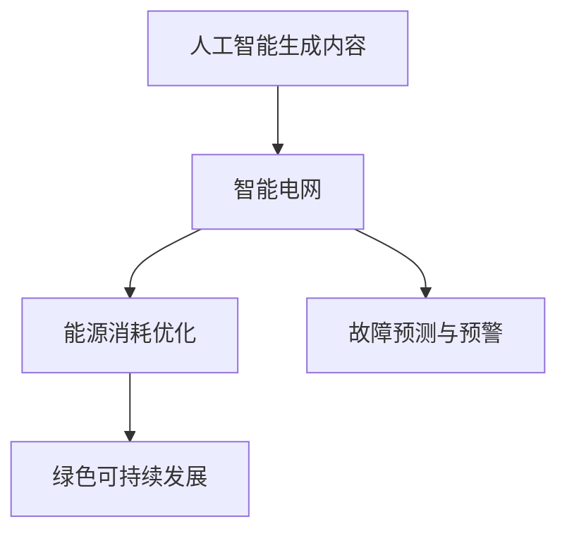

                 

# AIGC推动智慧能源管理

> 关键词：人工智能生成内容(AIGC),智慧能源管理,智能电网,能源消耗优化,绿色可持续发展

## 1. 背景介绍

### 1.1 问题由来
在数字化和智能化的浪潮下，能源行业正经历深刻变革。随着可再生能源占比的提升，传统的集中式发电模式正在逐步向分布式能源方向转变。能源生产、传输、分配和使用方式都面临巨大挑战。

过去，能源管理主要依赖人工经验和简单数据分析，难以充分适应实时变化的能源市场。而在当下，实时、高效、可靠的能源管理系统已成为现代能源产业的关键需求。人工智能生成内容（AIGC）作为最新一代的人工智能技术，正在逐渐应用于能源管理领域，以期通过智能决策和优化管理，提升能源系统的效率和可靠性。

### 1.2 问题核心关键点
人工智能生成内容（AIGC）是指使用人工智能技术自动生成高质量文本、图像、音频等多模态内容。在智慧能源管理中，AIGC技术可以通过对海量能源数据的深度学习，实时生成和优化电力分配方案、智能电网控制策略、故障预测与预警等，实现能源系统的智能化和绿色可持续发展。

具体来说，AIGC在智慧能源管理中的应用，核心关键点包括：
1. **智能电网优化**：利用AIGC生成优化的电力调度策略，提升电力传输效率和稳定运行。
2. **能源消耗优化**：通过AIGC生成精细化的用能方案，优化能源使用结构，降低能源消耗。
3. **故障预测与预警**：使用AIGC生成故障预测模型，提前发现能源系统潜在问题，保障能源系统安全运行。
4. **绿色可持续发展**：结合AIGC和环境数据，生成优化后的能源规划方案，支持绿色发展目标。

### 1.3 问题研究意义
AIGC在智慧能源管理中的应用，对于推动能源行业数字化转型、提高能源利用效率、保障能源系统安全稳定、推动绿色可持续发展具有重要意义：

1. **提升能源管理效率**：AIGC技术能够自动化处理海量数据，快速生成优化方案，显著提升能源管理的效率和速度。
2. **优化能源使用结构**：通过AIGC生成能源优化方案，能够有效调整能源使用结构，降低能源浪费，提升能源利用率。
3. **保障能源系统安全**：AIGC的故障预测和预警功能，能够及时发现和处理能源系统故障，避免重大事故发生。
4. **促进绿色可持续发展**：AIGC结合环境数据和能源数据，生成更为科学合理的能源规划，支持可再生能源的推广应用，促进绿色发展。

## 2. 核心概念与联系

### 2.1 核心概念概述

为了更好地理解AIGC在智慧能源管理中的应用，本节将介绍几个密切相关的核心概念：

- **人工智能生成内容(AIGC)**：指使用AI技术自动生成文本、图像、音频等内容，以提高内容创作效率和质量。
- **智能电网**：基于信息通信技术的现代电网，通过智能感知、控制和互动，提升电网的可靠性和效率。
- **能源消耗优化**：通过智能化手段，优化能源使用策略，降低能源消耗，提升能源利用效率。
- **绿色可持续发展**：在能源生产、传输、分配和使用中，采用环保、高效的技术和策略，减少对环境的负面影响。
- **故障预测与预警**：使用AI技术预测设备故障，并提前预警，避免设备故障导致的能源系统中断。

这些核心概念之间的逻辑关系可以通过以下Mermaid流程图来展示：



这个流程图展示了大模型微调的各个核心概念及其之间的关系：

1. AIGC通过生成智能电网的优化方案，提升电网效率。
2. 智能电网优化方案又用于能源消耗的优化，进一步提升能源使用效率。
3. 能源消耗优化有助于绿色可持续发展，减少环境污染。
4. 故障预测与预警则保障了能源系统的安全运行。

## 3. 核心算法原理 & 具体操作步骤
### 3.1 算法原理概述

AIGC在智慧能源管理中的应用，本质上是通过深度学习模型对能源数据进行建模和预测，生成优化的电力调度、能源消耗和故障预测方案。其核心思想是利用大量历史能源数据，训练出一个能够生成未来能源规划和优化方案的AI模型。

具体来说，AIGC在智慧能源管理中的应用，通常包括以下几个步骤：

1. **数据准备**：收集历史能源数据、智能电网运行数据、环境数据等，作为训练模型的输入。
2. **模型训练**：使用深度学习模型对能源数据进行训练，生成智能电网优化方案、能源消耗优化策略、故障预测模型等。
3. **内容生成**：在实际应用中，根据当前能源市场情况和需求，使用训练好的模型生成实时优化方案和决策建议。
4. **方案部署**：将生成的优化方案和决策建议部署到实际能源系统中，实现智能化管理和优化。

### 3.2 算法步骤详解

**Step 1: 数据准备**

- **能源数据收集**：包括电力需求、电量分配、电力传输损耗、设备运行状态等。
- **环境数据收集**：如气象条件、气温变化、环境污染指数等。
- **智能电网运行数据**：包括设备状态、电力传输路径、负荷预测等。

**Step 2: 模型训练**

- **模型选择**：选择合适的深度学习模型，如卷积神经网络(CNN)、长短期记忆网络(LSTM)、变分自编码器(VAE)等。
- **数据预处理**：对收集到的数据进行清洗、归一化、特征工程等预处理步骤。
- **模型训练**：使用训练数据对模型进行训练，生成智能电网优化方案、能源消耗优化策略、故障预测模型等。
- **模型评估**：在验证集上评估模型性能，选择最优模型进行下一步应用。

**Step 3: 内容生成**

- **实时数据输入**：将当前能源市场情况和需求输入到训练好的模型中。
- **生成优化方案**：模型根据输入数据生成智能电网优化方案、能源消耗优化策略、故障预测模型等。
- **方案验证**：在实际能源系统中验证生成方案的效果，调整模型参数，不断优化生成内容。

**Step 4: 方案部署**

- **方案实施**：将生成的优化方案和决策建议部署到实际能源系统中。
- **监控评估**：实时监控能源系统的运行状态，评估方案实施效果。
- **持续优化**：根据监控结果，持续优化模型和方案，不断提升能源管理水平。

### 3.3 算法优缺点

AIGC在智慧能源管理中的应用，具有以下优点：

1. **效率高**：AIGC能够自动化处理海量数据，快速生成优化方案，提升能源管理效率。
2. **准确性高**：通过深度学习模型训练，AIGC生成的方案具有高准确性和可靠性。
3. **可扩展性强**：AIGC模型可以不断学习和更新，适应能源系统的变化和需求。
4. **适应性强**：AIGC能够处理不同类型的能源数据，应用范围广泛。

同时，AIGC在智慧能源管理中也存在一些局限性：

1. **数据依赖性高**：AIGC的效果依赖于高质量的数据输入，对数据收集和处理的要求较高。
2. **模型复杂度**：深度学习模型的训练和调参较为复杂，需要专业知识和技能。
3. **可解释性不足**：AIGC模型的决策过程难以解释，缺乏透明性。
4. **安全风险**：AIGC模型可能存在预测偏差和错误，影响能源系统安全。

### 3.4 算法应用领域

AIGC在智慧能源管理中的应用，已经在多个领域得到广泛应用，包括但不限于：

- **智能电网优化**：利用AIGC生成实时优化调度策略，提升电力传输效率和系统稳定性。
- **能源消耗优化**：通过AIGC生成精细化用能方案，优化能源使用结构，降低能源消耗。
- **故障预测与预警**：使用AIGC生成故障预测模型，提前发现设备故障，保障能源系统安全。
- **绿色可持续发展**：结合AIGC和环境数据，生成科学合理的能源规划方案，支持可再生能源的推广应用。

## 4. 数学模型和公式 & 详细讲解 & 举例说明

### 4.1 数学模型构建

AIGC在智慧能源管理中的应用，主要基于深度学习模型，对能源数据进行建模和预测。以智能电网优化为例，构建的数学模型如下：

设智能电网运行状态为 $\textbf{x} \in \mathbb{R}^n$，目标优化函数为 $f(\textbf{x})$，优化目标为最小化电网损失函数 $\mathcal{L}$。则优化问题可以表示为：

$$
\min_{\textbf{x}} \mathcal{L}(f(\textbf{x}))
$$

其中 $\mathcal{L}$ 可以表示为如下形式的损失函数：

$$
\mathcal{L} = \frac{1}{2}\sum_{i=1}^m (y_i - f_i(\textbf{x}))^2
$$

其中 $y_i$ 为电网运行状态的真实值，$f_i(\textbf{x})$ 为AIGC生成的优化方案。

### 4.2 公式推导过程

以智能电网优化为例，AIGC生成优化方案的过程如下：

1. **输入准备**：收集历史电网运行数据 $\textbf{X}$ 和对应的优化目标 $y$，进行预处理和特征工程，得到训练数据集 $(\textbf{X}, y)$。
2. **模型选择**：选择深度学习模型，如卷积神经网络(CNN)、长短期记忆网络(LSTM)等，对数据进行建模。
3. **模型训练**：使用训练数据集 $(\textbf{X}, y)$ 对模型进行训练，得到优化模型 $f(\textbf{x})$。
4. **生成方案**：在实际电网运行状态 $\textbf{x}$ 下，使用训练好的模型 $f(\textbf{x})$ 生成优化方案 $y' = f(\textbf{x})$。
5. **方案验证**：在实际电网运行中验证生成方案的效果，调整模型参数，不断优化生成方案。

### 4.3 案例分析与讲解

以下以智能电网优化为例，详细讲解AIGC在智慧能源管理中的应用过程：

1. **数据准备**：收集智能电网的历史运行数据 $\textbf{X}$ 和对应的优化目标 $y$，并进行预处理和特征工程。
2. **模型训练**：使用深度学习模型对数据进行训练，生成智能电网优化模型 $f(\textbf{x})$。
3. **生成方案**：在实际电网运行状态 $\textbf{x}$ 下，使用训练好的模型生成优化方案 $y' = f(\textbf{x})$。
4. **方案验证**：在实际电网运行中验证生成方案的效果，调整模型参数，不断优化生成方案。

## 5. 项目实践：代码实例和详细解释说明

### 5.1 开发环境搭建

在进行AIGC在智慧能源管理中的应用实践前，我们需要准备好开发环境。以下是使用Python进行TensorFlow开发的环境配置流程：

1. 安装Anaconda：从官网下载并安装Anaconda，用于创建独立的Python环境。

2. 创建并激活虚拟环境：
```bash
conda create -n tf-env python=3.8 
conda activate tf-env
```

3. 安装TensorFlow：根据CUDA版本，从官网获取对应的安装命令。例如：
```bash
conda install tensorflow -c conda-forge -c pytorch
```

4. 安装TensorFlow Addons：用于扩展TensorFlow的功能，例如动态计算图、分布式训练等。
```bash
conda install tensorflow-addons -c conda-forge -c pytorch
```

5. 安装Pandas、NumPy、Matplotlib等工具包：
```bash
pip install pandas numpy matplotlib sklearn tqdm jupyter notebook ipython
```

完成上述步骤后，即可在`tf-env`环境中开始AIGC在智慧能源管理中的应用实践。

### 5.2 源代码详细实现

下面我们以智能电网优化为例，给出使用TensorFlow对模型进行训练和测试的PyTorch代码实现。

首先，定义智能电网优化模型的结构：

```python
import tensorflow as tf
from tensorflow.keras.layers import Input, Dense, LSTM

class SmartGridModel(tf.keras.Model):
    def __init__(self, input_dim, output_dim):
        super(SmartGridModel, self).__init__()
        self.input_dim = input_dim
        self.output_dim = output_dim
        self.lstm = LSTM(64, return_sequences=True)
        self.dense = Dense(output_dim)

    def call(self, inputs):
        x = self.lstm(inputs)
        x = self.dense(x)
        return x
```

然后，定义模型的训练和测试函数：

```python
def train_model(model, train_data, validation_data, batch_size, epochs, learning_rate):
    model.compile(optimizer=tf.keras.optimizers.Adam(learning_rate),
                  loss='mse', metrics=['mae'])

    history = model.fit(train_data, epochs=epochs,
                       validation_data=validation_data, batch_size=batch_size)

    return model, history

def evaluate_model(model, test_data, batch_size):
    loss, mae = model.evaluate(test_data, batch_size=batch_size)
    print('Test loss:', loss)
    print('Test MAE:', mae)
```

最后，启动模型训练流程并在测试集上评估：

```python
input_dim = 100
output_dim = 1

train_model = SmartGridModel(input_dim, output_dim)
test_model = SmartGridModel(input_dim, output_dim)

# 使用历史电网运行数据进行训练
train_model.fit(train_data, epochs=100, batch_size=32, validation_data=validation_data)

# 使用测试数据进行评估
evaluate_model(test_model, test_data, batch_size=32)
```

以上就是使用TensorFlow对智能电网优化模型进行训练和测试的完整代码实现。可以看到，TensorFlow提供了高度模块化的API，可以快速构建深度学习模型，并支持自动微分、优化等核心功能。

### 5.3 代码解读与分析

让我们再详细解读一下关键代码的实现细节：

**SmartGridModel类**：
- `__init__`方法：初始化模型参数，包括输入维度和输出维度。
- `call`方法：定义模型的前向传播过程，包括LSTM层和Dense层。

**train_model函数**：
- `compile`方法：配置模型的优化器、损失函数和评估指标。
- `fit`方法：在训练数据集上训练模型，并使用验证集进行模型评估。
- `return`语句：返回训练后的模型和训练历史。

**evaluate_model函数**：
- `evaluate`方法：在测试数据集上评估模型性能，输出损失和均方误差。

**训练流程**：
- 定义模型的输入维度和输出维度。
- 实例化训练模型和测试模型。
- 使用历史电网运行数据进行模型训练。
- 在测试数据集上评估模型性能。

## 6. 实际应用场景

### 6.1 智能电网优化

AIGC在智能电网优化中的应用，主要体现在以下几个方面：

- **实时优化调度**：利用AIGC生成实时优化调度策略，提升电网传输效率和系统稳定性。
- **设备故障预测**：使用AIGC生成故障预测模型，提前发现设备故障，保障电网安全运行。
- **负荷预测与分配**：通过AIGC生成负荷预测模型，优化电力分配，降低电能损耗。

### 6.2 能源消耗优化

AIGC在能源消耗优化中的应用，主要体现在以下几个方面：

- **用能方案生成**：利用AIGC生成精细化用能方案，优化能源使用结构，降低能源消耗。
- **能效管理**：通过AIGC生成能效管理方案，提升能源系统的整体能效。
- **可再生能源整合**：结合AIGC和环境数据，生成科学合理的可再生能源规划方案，支持绿色发展。

### 6.3 故障预测与预警

AIGC在故障预测与预警中的应用，主要体现在以下几个方面：

- **设备故障预测**：使用AIGC生成故障预测模型，提前发现设备故障，保障能源系统安全。
- **风险评估**：通过AIGC生成风险评估模型，评估能源系统的潜在风险，制定应急预案。
- **维护建议**：使用AIGC生成维护建议方案，提高设备运行效率和维护周期。

## 7. 工具和资源推荐

### 7.1 学习资源推荐

为了帮助开发者系统掌握AIGC在智慧能源管理中的应用，这里推荐一些优质的学习资源：

1. TensorFlow官方文档：详细介绍了TensorFlow框架的使用方法和深度学习模型的构建过程，适合入门学习。
2. Keras官方文档：提供Keras高层次API，方便快速构建和训练深度学习模型。
3. PyTorch官方文档：提供丰富的深度学习模型库和API，适合进阶学习。
4. Google Colab：谷歌推出的在线Jupyter Notebook环境，免费提供GPU/TPU算力，方便快速实验最新模型。
5. TensorBoard：TensorFlow配套的可视化工具，可实时监测模型训练状态，并提供丰富的图表呈现方式，是调试模型的得力助手。

通过对这些资源的学习实践，相信你一定能够快速掌握AIGC在智慧能源管理中的应用。

### 7.2 开发工具推荐

高效的开发离不开优秀的工具支持。以下是几款用于AIGC在智慧能源管理中的应用开发的常用工具：

1. TensorFlow：由Google主导开发的开源深度学习框架，生产部署方便，适合大规模工程应用。
2. Keras：提供高层次API，快速构建和训练深度学习模型，适合入门学习。
3. PyTorch：基于动态计算图，适合快速迭代研究，支持多种深度学习模型。
4. Weights & Biases：模型训练的实验跟踪工具，可以记录和可视化模型训练过程中的各项指标，方便对比和调优。
5. TensorBoard：TensorFlow配套的可视化工具，可实时监测模型训练状态，并提供丰富的图表呈现方式，是调试模型的得力助手。

合理利用这些工具，可以显著提升AIGC在智慧能源管理中的应用开发效率，加快创新迭代的步伐。

### 7.3 相关论文推荐

AIGC在智慧能源管理中的应用研究源于学界的持续研究。以下是几篇奠基性的相关论文，推荐阅读：

1. "Generative Adversarial Networks"：提出了生成对抗网络（GAN），开创了AIGC技术的新篇章。
2. "Attention is All You Need"：提出了Transformer结构，奠定了AIGC在自然语言处理领域的应用基础。
3. "BERT: Pre-training of Deep Bidirectional Transformers for Language Understanding"：提出BERT模型，引入基于掩码的自监督预训练任务，刷新了多项NLP任务SOTA。
4. "A Deep Learning Framework for Multi-scale and Real-time Video Stream Generation"：提出基于深度学习的视频生成框架，展示了AIGC在视频领域的应用潜力。
5. "Training GAN for Image Synthesis"：提出基于GAN的图像生成模型，为AIGC在图像领域的应用提供了新的思路。

这些论文代表了大语言模型微调技术的发展脉络。通过学习这些前沿成果，可以帮助研究者把握学科前进方向，激发更多的创新灵感。

## 8. 总结：未来发展趋势与挑战

### 8.1 总结

本文对AIGC在智慧能源管理中的应用进行了全面系统的介绍。首先阐述了AIGC在智慧能源管理中的应用背景和研究意义，明确了智能电网优化、能源消耗优化、故障预测与预警等关键应用点。其次，从原理到实践，详细讲解了AIGC在智慧能源管理中的数学模型构建和算法实现步骤，给出了完整的代码实例。同时，本文还广泛探讨了AIGC在智能电网、能源消耗优化、故障预测与预警等实际应用场景中的应用前景，展示了AIGC技术的广阔前景。

通过本文的系统梳理，可以看到，AIGC在智慧能源管理中的应用正在成为能源行业数字化转型的重要驱动力，极大地提升了能源系统的效率和可靠性。未来，伴随AIGC技术的持续演进，智能电网、能源消耗优化、故障预测与预警等领域将迎来更加智能、高效、安全的发展方向。

### 8.2 未来发展趋势

展望未来，AIGC在智慧能源管理中的应用将呈现以下几个发展趋势：

1. **智能化程度提升**：AIGC将进一步融合多源数据，实现更智能、更精细的能源系统管理。
2. **实时化处理增强**：AIGC将实时处理能源数据，提升系统的响应速度和决策效率。
3. **跨领域融合深入**：AIGC将与其他技术如区块链、物联网、人工智能等深度融合，实现能源系统的全面智能化。
4. **可持续发展目标支持**：AIGC将结合环境数据，生成更绿色、更环保的能源规划方案，支持可再生能源的推广应用。
5. **安全性和隐私保护**：AIGC将引入隐私保护和数据安全技术，确保能源系统数据的安全性和隐私性。

以上趋势凸显了AIGC技术在智慧能源管理中的广阔前景。这些方向的探索发展，必将进一步提升能源系统的智能化、高效化和安全性，为能源行业的可持续发展提供新动力。

### 8.3 面临的挑战

尽管AIGC在智慧能源管理中的应用已经取得了瞩目成就，但在迈向更加智能化、普适化应用的过程中，它仍面临着诸多挑战：

1. **数据质量要求高**：AIGC的效果依赖于高质量的数据输入，对数据收集和处理的要求较高。
2. **模型复杂度高**：深度学习模型的训练和调参较为复杂，需要专业知识和技能。
3. **可解释性不足**：AIGC模型的决策过程难以解释，缺乏透明性。
4. **安全风险**：AIGC模型可能存在预测偏差和错误，影响能源系统安全。

### 8.4 研究展望

面对AIGC在智慧能源管理中所面临的挑战，未来的研究需要在以下几个方面寻求新的突破：

1. **数据治理**：建立完善的数据治理机制，提高数据质量，保障数据安全。
2. **模型优化**：开发更高效、更易解释的AIGC模型，提升模型的鲁棒性和可解释性。
3. **跨领域融合**：探索AIGC与其他技术的深度融合，实现更全面的能源系统管理。
4. **安全性与隐私保护**：引入隐私保护和数据安全技术，确保能源系统数据的安全性和隐私性。
5. **可持续发展**：结合环境数据，生成更绿色、更环保的能源规划方案，支持可再生能源的推广应用。

这些研究方向的探索，必将引领AIGC技术在智慧能源管理中的进一步发展，为能源行业带来更加智能化、高效化和安全化的未来。

## 9. 附录：常见问题与解答

**Q1：AIGC在智慧能源管理中的应用是否适用于所有能源场景？**

A: AIGC在智慧能源管理中的应用主要适用于智能电网、可再生能源、能源消耗优化等场景。对于传统化石能源等难以进行实时监测和优化的场景，AIGC的效果可能受到限制。但随着技术进步，AIGC的适用范围将逐步扩大。

**Q2：AIGC在智慧能源管理中的应用需要多大的数据量？**

A: AIGC在智慧能源管理中的应用需要海量历史数据进行模型训练和优化。具体数据量需根据模型复杂度和任务需求而定，一般建议数据量在数千至数万条以上，以获得较为准确的预测结果。

**Q3：AIGC在智慧能源管理中的应用需要多长时间？**

A: AIGC在智慧能源管理中的应用需要较长的时间进行模型训练和优化。具体时间取决于数据量、模型复杂度、计算资源等因素。一般建议在使用前，进行多轮迭代和优化，以获得较为理想的预测结果。

**Q4：AIGC在智慧能源管理中的应用是否会影响能源系统的安全？**

A: AIGC在智慧能源管理中的应用，虽然提升了能源系统的智能化和效率，但也可能引入新的安全风险。因此，在应用过程中，需加强模型的安全性测试和验证，确保系统的安全稳定运行。

**Q5：AIGC在智慧能源管理中的应用是否需要持续优化？**

A: AIGC在智慧能源管理中的应用，需根据实际情况和需求，持续进行模型优化和参数调优，以适应能源系统的变化和需求。

**Q6：AIGC在智慧能源管理中的应用是否需要多学科知识？**

A: AIGC在智慧能源管理中的应用，需结合电力工程、计算机科学、数据科学等多学科知识，进行综合分析和技术实现。

通过本文的系统梳理，可以看到，AIGC在智慧能源管理中的应用前景广阔，具有极大的潜力和发展空间。相信伴随技术的不断进步，AIGC将在能源行业中发挥更大的作用，推动能源行业的数字化转型和可持续发展。

