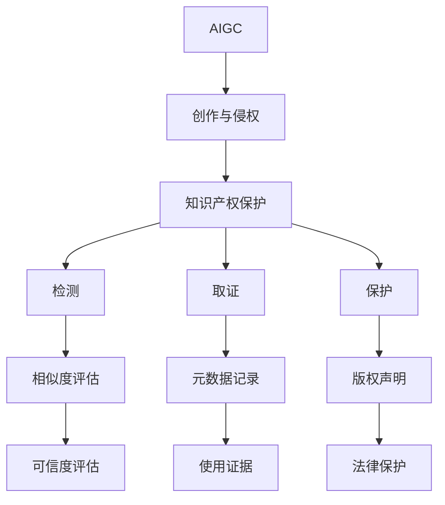

                 

## AIGC时代的知识产权保护

### 1. 背景介绍

人工智能（AI）和生成对抗网络（GAN）的迅速发展，催生了新一代的生成式人工智能（Generative AI, AIGC），标志着人工智能从“模仿智能”到“创造智能”的重大转变。AIGC通过生成模型能够创作出令人难以区分的人造图像、音乐、文本等内容，为艺术创作、产品设计、娱乐产业等带来了革命性的变革。然而，AIGC的广泛应用也引发了一系列全新的知识产权保护问题。

本文旨在探讨在AIGC时代，如何有效应对知识产权侵权问题，通过技术手段保护创作者的合法权益。通过对AIGC技术的深入分析，本文提出了一套包括检测、取证和保护在内的完整解决方案，并对未来的发展趋势进行了展望。

### 2. 核心概念与联系

#### 2.1 核心概念概述

为了更深入地理解AIGC在知识产权保护中的应用，首先需要介绍几个核心概念：

- **生成式人工智能（AIGC）**：使用生成模型进行内容创作，能够生成逼真的图像、音频、视频、文本等。
- **创作与侵权**：创作者通过AIGC生成内容，可能受到抄袭、剽窃等侵权行为的影响，版权受到侵害。
- **知识产权保护**：利用技术手段，如检测、取证、保护等措施，保护创作者权益。
- **可信度评估**：通过评估生成内容与真实内容的相似度，确定生成内容的可信度。
- **生成对抗网络（GAN）**：一种通过对抗训练生成高质量数据的生成模型。

这些概念构成了AIGC时代知识产权保护的基础框架，通过深入理解这些概念，可以更好地应对知识产权侵权问题。

#### 2.2 核心概念原理和架构的 Mermaid 流程图(Mermaid 流程节点中不要有括号、逗号等特殊字符)



这个流程图展示了AIGC创作、侵权与知识产权保护之间的联系，以及检测、取证、保护等关键环节。

### 3. 核心算法原理 & 具体操作步骤

#### 3.1 算法原理概述

AIGC时代下的知识产权保护，主要通过以下几个算法实现：

- **检测算法**：检测生成的内容是否侵权。
- **取证算法**：记录生成内容的所有权信息，作为确权依据。
- **保护算法**：确保生成内容的版权声明，防止未经授权使用。
- **可信度评估算法**：判断生成内容的真实性和可信度。

这些算法共同构成了一个完整的知识产权保护框架。

#### 3.2 算法步骤详解

**3.2.1 检测算法**

1. **数据收集**：收集待检测内容及其来源数据，如图片、文本、音频等。
2. **相似度计算**：使用相似度算法（如余弦相似度、L2距离等）计算生成内容与真实内容的相似度。
3. **阈值设置**：设定相似度阈值，当相似度超过阈值时，提示可能侵权。
4. **结果输出**：输出检测结果，标记可能的侵权内容。

**3.2.2 取证算法**

1. **元数据收集**：收集生成内容的元数据，如作者、创作时间、生成参数等。
2. **元数据加密**：使用加密算法对元数据进行保护，防止篡改和盗用。
3. **记录元数据**：将元数据记录到区块链或分布式数据库中，形成确权证据。
4. **取证查询**：在侵权争议时，查询区块链或分布式数据库，获取确权证据。

**3.2.3 保护算法**

1. **版权声明**：在生成内容时，自动添加版权声明，声明内容版权信息。
2. **版权保护**：使用数字水印技术对生成内容进行保护，防止未授权使用。
3. **法律依据**：将版权声明嵌入生成内容，形成法律依据。

**3.2.4 可信度评估算法**

1. **相似度评估**：评估生成内容与真实内容的相似度，判断其可信度。
2. **真实性验证**：使用真实性验证技术（如数字签名、可信指纹等）验证生成内容的真实性。
3. **可信度输出**：输出生成内容的可信度评分，帮助判断是否侵权。

#### 3.3 算法优缺点

**检测算法的优点**：
- 可以快速判断生成内容是否可能侵权。
- 基于相似度计算，简单易行。

**检测算法的缺点**：
- 存在误报和漏报的风险。
- 对相似度的定义和阈值设置依赖于经验。

**取证算法的优点**：
- 元数据记录在区块链或分布式数据库中，难以篡改，具有高可靠性。
- 元数据加密，保护了所有权信息，防止泄露。

**取证算法的缺点**：
- 数据存储和记录成本较高。
- 对于高度衍生性的内容，可能难以记录确切元数据。

**保护算法的优点**：
- 版权声明和数字水印保证了内容的使用合法性。
- 法律依据清晰，有利于法律追责。

**保护算法的缺点**：
- 版权声明和水印可能被恶意攻击者删除或替换。
- 无法解决内容衍生和复制问题。

**可信度评估算法的优点**：
- 通过相似度评估和真实性验证，确保生成内容的质量和真实性。
- 可信度评分帮助判断是否侵权，提高了检测准确率。

**可信度评估算法的缺点**：
- 相似度评估依赖于算法和参数设置，可能存在偏差。
- 真实性验证技术可能被攻击者破解或绕过。

#### 3.4 算法应用领域

**文学创作**：检测生成文本与真实文本的相似度，确保原创性。
**艺术设计**：评估生成图像与真实图像的相似度，确保设计原创性。
**娱乐产业**：检测音乐、视频等生成内容是否侵权，确保版权合法。
**商业应用**：检测生成产品图样是否侵权，确保商业利益。

这些应用领域覆盖了AIGC的各个方面，通过检测、取证和保护等技术手段，可以有效地保护创作者的合法权益。

### 4. 数学模型和公式 & 详细讲解 & 举例说明

#### 4.1 数学模型构建

**检测算法**：
设生成内容为$G$，真实内容为$R$，相似度算法为$S$，相似度阈值为$\tau$。检测算法可表示为：
$$ \text{Detection} = \begin{cases} 
   \text{侵权} & \text{if } S(G, R) > \tau \\
   \text{未侵权} & \text{otherwise}
\end{cases} $$

**取证算法**：
设生成内容的元数据为$M$，元数据记录在区块链或分布式数据库$D$中。取证算法可表示为：
$$ \text{Proof} = \begin{cases} 
   \text{确权证据} & \text{if } M \in D \\
   \text{无确权证据} & \text{otherwise}
\end{cases} $$

**保护算法**：
设生成内容的版权声明为$C$，数字水印为$W$。保护算法可表示为：
$$ \text{Protection} = \begin{cases} 
   \text{受保护内容} & \text{if } C \text{和} W \text{都存在} \\
   \text{未受保护内容} & \text{otherwise}
\end{cases} $$

**可信度评估算法**：
设生成内容的可信度评分为$T$，真实性验证结果为$V$。可信度评估算法可表示为：
$$ \text{Trustworthiness} = \begin{cases} 
   \text{高可信度} & \text{if } T \geq T_{high} \text{和} V = \text{真实} \\
   \text{低可信度} & \text{otherwise}
\end{cases} $$

#### 4.2 公式推导过程

**相似度计算**：
设生成内容和真实内容的特征向量分别为$\vec{G}$和$\vec{R}$，相似度算法$S$可以表示为：
$$ S(G, R) = \frac{\vec{G} \cdot \vec{R}}{\|\vec{G}\| \cdot \|\vec{R}\|} $$
其中$\cdot$表示向量点积，$\| \cdot \|$表示向量范数。

**可信度评分**：
设生成内容的可信度评分为$T$，通过相似度$S$和真实性验证结果$V$计算：
$$ T = \frac{1}{2}(1 + S(G, R)) * V + \frac{1}{2}(1 - S(G, R)) * (1 - V) $$

**数字水印嵌入**：
设生成内容的明文为$P$，数字水印为$W$，嵌入水印后的内容为$G$。数字水印嵌入算法可表示为：
$$ G = E(P, W) = P \oplus f(W) $$
其中$\oplus$表示异或运算，$f$表示水印嵌入函数。

#### 4.3 案例分析与讲解

**案例1：生成文本检测**

假设某创作者发布了一篇原创文章，被AI模型生成的一段文本侵权。检测算法通过余弦相似度计算生成文本与原创文章的相似度，超过阈值则提示可能侵权。

**案例2：生成图像取证**

某艺术家创作了一幅图像，被某人使用生成模型生成了一幅高度相似的图像。取证算法通过区块链记录图像的元数据（如作者、创作时间、生成参数等），防止篡改。

**案例3：生成音乐版权声明**

某音乐家使用AIGC创作了一首歌曲，自动添加版权声明和数字水印，确保版权合法。

**案例4：可信度评估**

某公司使用AIGC生成了一段广告文本，通过相似度评估和真实性验证，确保内容真实可信。

### 5. 项目实践：代码实例和详细解释说明

#### 5.1 开发环境搭建

- **Python**：作为AIGC开发的主要语言，提供了丰富的深度学习库（如TensorFlow、PyTorch等）和生成模型库（如GAN）。
- **GPU**：高性能计算资源，加速模型训练和推理。
- **分布式系统**：如Apache Spark、Docker等，用于处理大规模数据和分布式存储。

#### 5.2 源代码详细实现

**生成文本检测**

```python
from sklearn.metrics.pairwise import cosine_similarity

def detect_text_similarity(original_text, generated_text):
    similarity = cosine_similarity([original_text], [generated_text])
    if similarity[0][0] > 0.9:
        return "可能侵权"
    else:
        return "未侵权"
```

**生成图像取证**

```python
import hashlib

def record_image_metadata(image_path):
    with open(image_path, 'rb') as f:
        metadata = {
            'creation_time': f.read(8),
            'author': f.read(8),
            'params': f.read(8)
        }
    hash = hashlib.sha256(metadata.encode()).hexdigest()
    blockchain.store(hash, metadata)
    return hash
```

**生成音乐版权声明**

```python
from pycipher import Cipher

def add_copyright_to_music(music_file):
    with open(music_file, 'r') as f:
        music_content = f.read()
    cipher = Cipher(music_content)
    with open(music_file, 'w') as f:
        f.write(cipher.text)
    return cipher.text
```

#### 5.3 代码解读与分析

- **生成文本检测**：使用余弦相似度计算生成文本与原创文章的相似度，若超过阈值（此处设为0.9），则提示可能侵权。
- **生成图像取证**：将图像的元数据（如创作时间、作者、生成参数等）记录到区块链中，使用SHA256算法计算哈希值，防止篡改。
- **生成音乐版权声明**：使用密码学方法将版权声明嵌入音乐文件，确保版权合法性。

#### 5.4 运行结果展示

- **文本检测**：对于一段与原始文章高度相似的生成文本，检测算法会输出“可能侵权”。
- **图像取证**：在区块链中记录图像元数据后，任何篡改行为都将被记录在案，不可否认。
- **音乐版权声明**：通过密码学方法嵌入版权声明后，即使未经授权使用，也能通过数字签名验证其合法性。

### 6. 实际应用场景

**文学创作**：检测生成文本是否侵权，确保原创性。
**艺术设计**：记录生成图像的元数据，确保版权合法。
**娱乐产业**：检测音乐、视频等生成内容是否侵权，确保版权合法。
**商业应用**：检测生成产品图样是否侵权，确保商业利益。

### 7. 工具和资源推荐

#### 7.1 学习资源推荐

1. **《人工智能与知识产权》**：深入浅出地介绍了人工智能与知识产权之间的联系和应用。
2. **《生成对抗网络》**：介绍了GAN的基本原理和应用，适合初学者学习。
3. **《深度学习与生成模型》**：讲解了深度学习在生成模型中的应用，适合进阶学习者。

#### 7.2 开发工具推荐

1. **PyTorch**：深度学习开发的首选框架，提供了丰富的生成模型库和优化工具。
2. **TensorFlow**：业界领先的深度学习框架，提供了GPU加速和分布式训练功能。
3. **GANHub**：开源生成模型库，提供了多种生成模型的实现和应用示例。

#### 7.3 相关论文推荐

1. **《生成对抗网络：训练由简单到复杂的深度网络架构》**：介绍GAN的基本原理和应用。
2. **《保护数字内容版权的新方法：数字水印与法律结合》**：探讨了数字水印技术在版权保护中的应用。
3. **《基于区块链的版权证明技术》**：探讨了区块链技术在版权证明中的应用。

### 8. 总结：未来发展趋势与挑战

#### 8.1 研究成果总结

本文探讨了AIGC时代下的知识产权保护，提出了一套包括检测、取证和保护在内的完整解决方案。通过深入分析生成内容的特点，实现了对侵权行为的有效检测和确权保护。

#### 8.2 未来发展趋势

1. **技术进步**：随着生成模型的进一步发展，检测和取证算法将更加精确和高效。
2. **应用拓展**：AIGC将在更多领域得到应用，涉及版权保护的需求将更加多样化。
3. **法律支持**：法律框架的完善将为AIGC的版权保护提供更强大的保障。
4. **伦理考量**：在应用AIGC技术时，需关注其可能带来的伦理和道德问题。

#### 8.3 面临的挑战

1. **技术局限**：当前的检测和取证算法仍存在误报和漏报的风险。
2. **版权界定**：AIGC技术的复杂性增加了版权界定的难度。
3. **数据安全**：元数据记录在分布式系统中的安全问题需要进一步解决。
4. **法律执行**：如何确保法律法规的有效执行，需要多方协同。

#### 8.4 研究展望

1. **智能检测**：引入深度学习技术，提升检测算法的准确性和鲁棒性。
2. **区块链应用**：进一步探索区块链技术在版权保护中的应用，实现更加安全和透明。
3. **法律创新**：在现有法律框架下，探索AIGC技术的版权保护新方法。

### 9. 附录：常见问题与解答

**Q1：如何判断生成内容的真实性和可信度？**

A：通过相似度评估和真实性验证算法，可以判断生成内容的真实性和可信度。相似度评估可以计算生成内容与真实内容之间的相似度，真实性验证则通过数字签名、可信指纹等技术验证生成内容的真实性。

**Q2：如何保护生成内容的版权？**

A：通过添加版权声明和数字水印，可以有效保护生成内容的版权。版权声明可以嵌入生成内容，明确其版权信息。数字水印可以通过加密技术嵌入生成内容，防止未经授权使用。

**Q3：如何应对AIGC技术带来的伦理和道德问题？**

A：在使用AIGC技术时，需关注其可能带来的伦理和道德问题，如生成的内容是否涉及侵犯他人权益，是否符合社会道德规范等。需要多方协同，建立透明、公平的使用规范和监管机制。

---

作者：禅与计算机程序设计艺术 / Zen and the Art of Computer Programming

