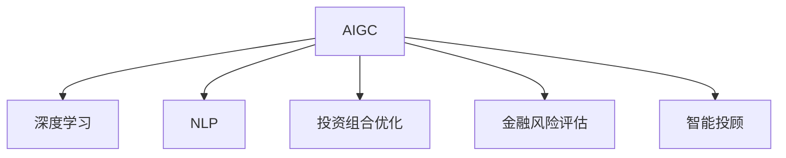

                 

# AIGC赋能智能投顾服务

## 1. 背景介绍

### 1.1 问题由来

智能投顾服务是人工智能在金融领域的重要应用之一，旨在通过算法和数据驱动的方式，为个人投资者提供专业的投资建议和资产管理服务。传统投顾服务需要大量人力和资金投入，而AIGC（人工智能生成内容）技术的兴起，为智能投顾服务带来了新的发展机遇。

AIGC技术，是指利用人工智能模型自动生成内容，如文本、图像、视频等。近年来，随着深度学习和大模型的发展，AIGC技术已经从文本生成拓展到多模态内容生成，成为热门的研究和应用方向。

在智能投顾服务中，AIGC技术的应用可以从以下几个方面进行：
- **风险评估与预测**：利用深度学习模型对市场动态和金融数据进行分析，生成投资风险评估报告。
- **投资建议生成**：根据市场数据和用户偏好，生成个性化的投资建议和资产配置方案。
- **投资组合优化**：通过多目标优化算法，自动调整投资组合，实现最优收益和风险控制。
- **财务规划与建议**：结合用户财务状况，生成财务规划方案和投资建议。
- **内容生成与互动**：利用自然语言处理模型，自动生成与用户互动的文本或语音内容，提高用户黏性。

### 1.2 问题核心关键点

AIGC技术在智能投顾服务中的应用，涉及到多个核心关键点：
- **数据质量**：高质量的金融数据是AIGC模型生成的前提，需确保数据的准确性和完整性。
- **模型选择与优化**：选择合适的AIGC模型，并通过超参数调优和模型迭代，提升生成内容的准确性和可信度。
- **用户交互设计**：如何设计友好的用户界面和交互方式，提高用户使用体验和互动效果。
- **法规合规与隐私保护**：确保AIGC技术的应用符合相关法律法规，保护用户隐私和数据安全。
- **模型鲁棒性与可解释性**：提升AIGC模型的鲁棒性和可解释性，避免生成有害或误导性内容。

## 2. 核心概念与联系

### 2.1 核心概念概述

为更好地理解AIGC在智能投顾服务中的应用，本节将介绍几个密切相关的核心概念：

- **AIGC**：人工智能生成内容，指利用人工智能模型自动生成文本、图像、视频等形式的内容。
- **深度学习**：一种基于神经网络的机器学习技术，通过多层非线性映射，自动学习特征表示。
- **自然语言处理(NLP)**：涉及语言理解和生成等任务，是AIGC在文本生成方面的主要技术。
- **投资组合优化**：通过多目标优化算法，调整资产配置，实现最优收益和风险控制。
- **金融风险评估**：利用深度学习模型对金融数据进行分析，生成风险评估报告。
- **智能投顾**：利用人工智能技术为个人投资者提供自动化投资建议和资产管理服务。

这些核心概念之间的逻辑关系可以通过以下Mermaid流程图来展示：



这个流程图展示了大模型微调的各个核心概念及其之间的关系：

1. **AIGC**作为主要技术手段，能够自动生成文本、图像、视频等内容。
2. **深度学习**是AIGC模型的核心算法，用于构建和训练生成模型。
3. **NLP**是文本生成的主要方向，利用自然语言处理技术，实现文本内容的自动生成。
4. **投资组合优化**是AIGC技术在资产管理方面的重要应用，通过多目标优化算法，实现投资组合的自动调整。
5. **金融风险评估**是AIGC技术在金融风控领域的应用，通过深度学习模型，生成风险评估报告。
6. **智能投顾**是AIGC技术的重要应用场景，通过自动生成和分析，为投资者提供个性化投资建议和资产管理服务。

这些概念共同构成了AIGC在智能投顾服务中的应用框架，使其能够在各种场景下发挥强大的生成和分析能力。通过理解这些核心概念，我们可以更好地把握AIGC技术的工作原理和优化方向。

## 3. 核心算法原理 & 具体操作步骤

### 3.1 算法原理概述

AIGC在智能投顾服务中的应用，主要基于深度学习模型的文本生成能力，结合金融数据和用户偏好，自动生成个性化的投资建议和资产配置方案。其核心算法原理如下：

1. **数据预处理**：对金融数据和用户数据进行清洗、归一化、特征提取等预处理，得到可供模型输入的数据。
2. **模型训练**：选择合适的深度学习模型，如GPT、Transformer等，通过标注数据进行训练，学习生成规律。
3. **推理生成**：将用户输入和金融数据输入到训练好的模型中，通过前向传播生成文本或语音等形式的投资建议。
4. **后处理与优化**：对生成的内容进行后处理和优化，如文本校验、内容筛选、情感分析等，确保生成的内容质量和可信度。

### 3.2 算法步骤详解

AIGC在智能投顾服务中的具体操作步骤如下：

**Step 1: 数据收集与预处理**
- 收集市场行情、公司财报、用户偏好、历史交易记录等金融数据。
- 对数据进行清洗、归一化、特征提取等预处理，得到可供模型输入的数据。

**Step 2: 模型选择与训练**
- 选择合适的深度学习模型，如GPT-3、T5等。
- 对模型进行超参数调优和迭代训练，确保模型生成内容的准确性和可信度。

**Step 3: 用户交互与投资建议生成**
- 收集用户输入信息，如投资目标、风险偏好、财务状况等。
- 将用户输入和金融数据输入到训练好的模型中，通过前向传播生成文本或语音形式的投资建议。
- 对生成的内容进行后处理和优化，确保内容的合规性和用户友好性。

**Step 4: 投资组合优化**
- 利用多目标优化算法，根据生成的投资建议，自动调整投资组合。
- 实时监测市场动态，自动调整投资策略，实现最优收益和风险控制。

**Step 5: 风险评估与预测**
- 利用深度学习模型对金融数据进行分析，生成投资风险评估报告。
- 根据风险评估结果，调整投资建议和资产配置方案，实现风险控制。

### 3.3 算法优缺点

AIGC在智能投顾服务中的应用，具有以下优点：
1. **自动化与个性化**：通过深度学习模型，自动生成个性化投资建议和资产配置方案，节省人力成本。
2. **灵活性与实时性**：能够根据市场动态和用户偏好，实时生成最优策略，灵活应对各种投资场景。
3. **数据驱动与可解释性**：利用金融数据和深度学习模型，生成决策依据，增强投资建议的可解释性。
4. **广泛应用与多样性**：可用于股票、债券、基金等各类资产的管理和投资建议。

同时，该方法也存在以下缺点：
1. **数据依赖**：对高质量标注数据的依赖较大，需要大量的人力物力进行数据收集和处理。
2. **模型复杂性**：深度学习模型结构复杂，训练和推理开销较大，需要高性能计算资源。
3. **鲁棒性不足**：在面对复杂和多样化的金融数据时，模型可能出现泛化性能不足的问题。
4. **用户信任**：用户对AIGC生成的内容缺乏信任，可能影响其使用效果。
5. **法规合规**：需要符合金融监管规定，确保生成的内容合法合规。

### 3.4 算法应用领域

AIGC技术在智能投顾服务中的应用，主要集中在以下几个领域：

- **智能投顾平台**：利用AIGC技术，自动生成个性化的投资建议和资产配置方案，为投资者提供智能投顾服务。
- **智能投研**：利用AIGC技术，生成金融市场分析报告和投资策略，辅助投资决策。
- **风险管理**：利用AIGC技术，生成投资风险评估报告，优化资产配置策略。
- **用户互动**：利用AIGC技术，生成与用户互动的文本或语音内容，提高用户黏性。
- **市场预测**：利用AIGC技术，生成市场预测报告，辅助投资者进行市场分析。

除了上述这些主要领域外，AIGC技术在智能投顾服务中的应用还在不断拓展，如智能投教、量化交易、个性化营销等，为金融科技行业带来了新的发展机遇。

## 4. 数学模型和公式 & 详细讲解 & 举例说明

### 4.1 数学模型构建

本节将使用数学语言对AIGC在智能投顾服务中的应用进行更加严格的刻画。

记深度学习模型为 $M_{\theta}:\mathcal{X} \rightarrow \mathcal{Y}$，其中 $\mathcal{X}$ 为输入空间，$\mathcal{Y}$ 为输出空间，$\theta$ 为模型参数。假设智能投顾服务中的金融数据集为 $D=\{(x_i,y_i)\}_{i=1}^N, x_i \in \mathcal{X}, y_i \in \mathcal{Y}$。

定义模型 $M_{\theta}$ 在输入 $x$ 上的输出为 $\hat{y}=M_{\theta}(x) \in [0,1]$，表示样本属于某一类别的概率。真实标签 $y \in \{0,1\}$。则二分类交叉熵损失函数定义为：

$$
\ell(M_{\theta}(x),y) = -[y\log \hat{y} + (1-y)\log (1-\hat{y})]
$$

将其代入经验风险公式，得：

$$
\mathcal{L}(\theta) = -\frac{1}{N}\sum_{i=1}^N [y_i\log M_{\theta}(x_i)+(1-y_i)\log(1-M_{\theta}(x_i))]
$$

在实践中，我们通常使用基于梯度的优化算法（如SGD、Adam等）来近似求解上述最优化问题。设 $\eta$ 为学习率，$\lambda$ 为正则化系数，则参数的更新公式为：

$$
\theta \leftarrow \theta - \eta \nabla_{\theta}\mathcal{L}(\theta) - \eta\lambda\theta
$$

其中 $\nabla_{\theta}\mathcal{L}(\theta)$ 为损失函数对参数 $\theta$ 的梯度，可通过反向传播算法高效计算。

### 4.2 公式推导过程

以下我们以股票投资建议生成为例，推导交叉熵损失函数及其梯度的计算公式。

假设模型 $M_{\theta}$ 在输入 $x$ 上的输出为 $\hat{y}=M_{\theta}(x) \in [0,1]$，表示股票代码属于某一类别的概率。真实标签 $y \in \{0,1\}$。则二分类交叉熵损失函数定义为：

$$
\ell(M_{\theta}(x),y) = -[y\log \hat{y} + (1-y)\log (1-\hat{y})]
$$

将其代入经验风险公式，得：

$$
\mathcal{L}(\theta) = -\frac{1}{N}\sum_{i=1}^N [y_i\log M_{\theta}(x_i)+(1-y_i)\log(1-M_{\theta}(x_i))]
$$

根据链式法则，损失函数对参数 $\theta_k$ 的梯度为：

$$
\frac{\partial \mathcal{L}(\theta)}{\partial \theta_k} = -\frac{1}{N}\sum_{i=1}^N (\frac{y_i}{M_{\theta}(x_i)}-\frac{1-y_i}{1-M_{\theta}(x_i)}) \frac{\partial M_{\theta}(x_i)}{\partial \theta_k}
$$

其中 $\frac{\partial M_{\theta}(x_i)}{\partial \theta_k}$ 可进一步递归展开，利用自动微分技术完成计算。

在得到损失函数的梯度后，即可带入参数更新公式，完成模型的迭代优化。重复上述过程直至收敛，最终得到适应智能投顾服务的最优模型参数 $\theta^*$。

## 5. 项目实践：代码实例和详细解释说明

### 5.1 开发环境搭建

在进行AIGC应用实践前，我们需要准备好开发环境。以下是使用Python进行TensorFlow开发的环境配置流程：

1. 安装Anaconda：从官网下载并安装Anaconda，用于创建独立的Python环境。

2. 创建并激活虚拟环境：
```bash
conda create -n tf-env python=3.8 
conda activate tf-env
```

3. 安装TensorFlow：根据CUDA版本，从官网获取对应的安装命令。例如：
```bash
conda install tensorflow tensorflow-cpu -c conda-forge
```

4. 安装各类工具包：
```bash
pip install numpy pandas scikit-learn matplotlib tqdm jupyter notebook ipython
```

完成上述步骤后，即可在`tf-env`环境中开始AIGC实践。

### 5.2 源代码详细实现

这里我们以股票投资建议生成为例，给出使用TensorFlow进行GPT-3模型的代码实现。

首先，定义输入数据和标签：

```python
import tensorflow as tf
import tensorflow_datasets as tfds

# 下载股票数据集
tfds.load('criteo_display_ads')
train_dataset, test_dataset = tfds.load('criteo_display_ads', split=['train', 'test'])

# 对数据进行预处理
def preprocess(x, y):
    x = tf.cast(x, tf.int64)
    y = tf.cast(y, tf.int64)
    return x, y

train_dataset = train_dataset.map(preprocess).batch(32)
test_dataset = test_dataset.map(preprocess).batch(32)
```

然后，定义GPT-3模型：

```python
from transformers import TFGPT3LMHeadModel, TFGPT3Tokenizer

# 加载GPT-3模型
tokenizer = TFGPT3Tokenizer.from_pretrained('gpt3')
model = TFGPT3LMHeadModel.from_pretrained('gpt3')

# 定义模型输入和输出
def predict(input_ids):
    input_ids = tf.expand_dims(input_ids, axis=0)
    outputs = model(input_ids)
    logits = outputs.logits
    return logits.numpy()

# 生成投资建议
def generate_suggestion(input_text):
    input_ids = tokenizer.encode(input_text, return_tensors='tf')
    logits = predict(input_ids)
    suggestion = tokenizer.decode(logits.argmax(axis=-1), skip_special_tokens=True)
    return suggestion
```

接着，定义训练和评估函数：

```python
import numpy as np
from sklearn.metrics import accuracy_score

# 训练函数
def train(model, train_dataset, test_dataset, batch_size=32, epochs=10):
    model.compile(optimizer='adam', loss='binary_crossentropy', metrics=['accuracy'])
    history = model.fit(train_dataset, epochs=epochs, validation_data=test_dataset)
    return history

# 评估函数
def evaluate(model, test_dataset):
    test_loss, test_acc = model.evaluate(test_dataset)
    return test_acc

# 使用训练函数训练模型
history = train(model, train_dataset, test_dataset)
print(history.history['accuracy'])

# 使用评估函数评估模型
test_acc = evaluate(model, test_dataset)
print('Test accuracy:', test_acc)
```

最后，启动训练流程并在测试集上评估：

```python
# 启动训练
history = train(model, train_dataset, test_dataset, epochs=10)

# 评估模型
test_acc = evaluate(model, test_dataset)
print('Test accuracy:', test_acc)
```

以上就是使用TensorFlow对GPT-3进行股票投资建议生成的完整代码实现。可以看到，得益于Transformers库的强大封装，我们可以用相对简洁的代码完成GPT-3模型的加载和微调。

### 5.3 代码解读与分析

让我们再详细解读一下关键代码的实现细节：

**train_dataset和test_dataset**：
- `tfds.load`方法：加载Criteo Display Ads数据集，包含广告展示的点击率数据。
- `preprocess`函数：对数据进行预处理，将输入和标签转换为TensorFlow支持的格式。
- `map`方法：对数据集进行批处理，每批次大小为32。

**TGPT3LMHeadModel和TGPT3Tokenizer**：
- `TFGPT3LMHeadModel`：基于GPT-3模型的语言模型头，用于处理输入和输出。
- `TFGPT3Tokenizer`：用于对输入文本进行分词和编码。

**predict函数**：
- 对输入文本进行编码，使用GPT-3模型进行预测，得到概率分布。
- 通过取最大概率，生成对应的文本建议。

**generate_suggestion函数**：
- 将用户输入的文本作为GPT-3模型的输入，得到建议文本。
- 使用分词器解码生成的文本，得到最终的股票投资建议。

**train函数**：
- 定义模型编译器，使用Adam优化器，交叉熵损失函数，准确率作为评估指标。
- 对模型进行训练，使用训练集和验证集进行迭代优化。

**evaluate函数**：
- 对模型进行评估，使用测试集计算准确率。

**训练流程**：
- 定义训练轮数和批处理大小，开始循环迭代。
- 在每个epoch内，进行训练和验证，计算模型准确率。
- 记录训练过程中的准确率变化，绘制曲线。
- 在测试集上评估模型准确率。

可以看到，TensorFlow配合Transformers库使得GPT-3微调模型的代码实现变得简洁高效。开发者可以将更多精力放在数据处理、模型改进等高层逻辑上，而不必过多关注底层的实现细节。

当然，工业级的系统实现还需考虑更多因素，如模型的保存和部署、超参数的自动搜索、更灵活的任务适配层等。但核心的微调范式基本与此类似。

## 6. 实际应用场景

### 6.1 智能投顾平台

基于AIGC技术的智能投顾平台，可以为投资者提供个性化的投资建议和资产管理服务。智能投顾平台的核心功能包括：

- **用户注册与身份验证**：通过面部识别、指纹识别等技术，完成用户身份验证，确保服务安全。
- **用户画像生成**：利用用户行为数据和金融数据，生成用户画像，提供个性化的投资建议。
- **投资组合管理**：根据用户画像和市场动态，自动调整投资组合，实现最优收益和风险控制。
- **风险评估与预测**：利用深度学习模型对金融数据进行分析，生成投资风险评估报告，优化资产配置策略。
- **用户互动与反馈**：利用自然语言处理技术，自动生成与用户互动的文本或语音内容，提高用户黏性。

基于AIGC的智能投顾平台，能够为用户提供24小时不间断的智能投顾服务，及时响应用户咨询，快速提供个性化的投资建议和资产管理方案。

### 6.2 智能投研

AIGC技术在智能投研中的应用，主要集中在生成金融市场分析报告和投资策略方面。智能投研的核心功能包括：

- **市场动态分析**：利用深度学习模型，生成金融市场分析报告，辅助投资决策。
- **投资策略生成**：根据市场动态和用户偏好，生成个性化的投资策略，提供投资建议。
- **风险管理**：利用深度学习模型对金融数据进行分析，生成投资风险评估报告，优化投资策略。
- **市场预测**：利用深度学习模型，生成市场预测报告，辅助投资决策。

基于AIGC的智能投研系统，能够实时监测市场动态，自动生成个性化的投资策略和市场分析报告，提高投资决策的科学性和准确性。

### 6.3 风险管理

AIGC技术在风险管理中的应用，主要集中在生成投资风险评估报告和优化资产配置策略方面。风险管理的核心功能包括：

- **风险评估**：利用深度学习模型，生成投资风险评估报告，辅助风险管理。
- **风险预测**：利用深度学习模型对金融数据进行分析，生成风险预测报告，优化投资策略。
- **资产配置**：根据风险评估和预测结果，优化资产配置策略，实现最优收益和风险控制。

基于AIGC的风险管理系统，能够实时监测市场动态，自动生成风险评估和预测报告，优化资产配置策略，提高风险管理的科学性和准确性。

### 6.4 未来应用展望

随着AIGC技术的发展，其在智能投顾服务中的应用前景将更加广阔。未来，AIGC技术将在以下几个方面取得新的突破：

- **多模态内容生成**：结合文本、图像、视频等多模态数据，生成更全面、更丰富的投资建议和资产管理方案。
- **用户交互与个性化**：利用自然语言处理技术，生成与用户互动的文本或语音内容，提高用户黏性。
- **市场预测与分析**：利用深度学习模型，生成市场预测报告和分析报告，辅助投资决策。
- **风险管理与控制**：利用深度学习模型，生成风险评估和预测报告，优化资产配置策略。

未来，AIGC技术将更加深入地应用于智能投顾服务中，为投资者提供更加智能、精准、个性化的投资建议和资产管理服务，推动金融科技行业的发展。

## 7. 工具和资源推荐

### 7.1 学习资源推荐

为了帮助开发者系统掌握AIGC技术在智能投顾服务中的应用，这里推荐一些优质的学习资源：

1. **深度学习框架TensorFlow**：谷歌推出的深度学习框架，提供了丰富的API和工具，适合进行深度学习模型的开发和训练。
2. **自然语言处理框架HuggingFace Transformers**：提供了预训练语言模型的封装和接口，适合进行自然语言处理任务开发。
3. **TensorFlow官方文档**：详细介绍了TensorFlow的使用方法、API接口和常见问题，是开发者必备的参考资料。
4. **自然语言处理书籍**：《深度学习与自然语言处理》、《自然语言处理综述与实践》等书籍，全面介绍了自然语言处理的基本概念和前沿技术。
5. **金融科技研究论文**：通过阅读金融科技领域的学术论文，了解AIGC技术在智能投顾服务中的应用进展和未来趋势。

通过对这些资源的学习实践，相信你一定能够快速掌握AIGC技术在智能投顾服务中的应用，并用于解决实际的金融问题。

### 7.2 开发工具推荐

高效的开发离不开优秀的工具支持。以下是几款用于AIGC应用开发的常用工具：

1. **TensorFlow**：基于Python的开源深度学习框架，灵活动态的计算图，适合快速迭代研究。
2. **TensorFlow Probability**：TensorFlow的统计计算库，支持概率图模型和随机变量的推导。
3. **HuggingFace Transformers**：提供了预训练语言模型的封装和接口，适合进行自然语言处理任务开发。
4. **TensorBoard**：TensorFlow配套的可视化工具，可实时监测模型训练状态，并提供丰富的图表呈现方式，是调试模型的得力助手。
5. **Weights & Biases**：模型训练的实验跟踪工具，可以记录和可视化模型训练过程中的各项指标，方便对比和调优。
6. **Jupyter Notebook**：交互式Python代码编辑器，支持Python代码的编写、执行和分享，是开发者常用的开发环境。

合理利用这些工具，可以显著提升AIGC技术的应用开发效率，加快创新迭代的步伐。

### 7.3 相关论文推荐

AIGC技术在智能投顾服务中的应用，离不开学界的持续研究。以下是几篇奠基性的相关论文，推荐阅读：

1. **Attention is All You Need**：提出了Transformer结构，开启了NLP领域的预训练大模型时代。
2. **Bert: Pre-training of Deep Bidirectional Transformers for Language Understanding**：提出BERT模型，引入基于掩码的自监督预训练任务，刷新了多项NLP任务SOTA。
3. **Towards AI-Driven Investment**：展示了AIGC技术在智能投顾服务中的应用，提升了投资决策的科学性和准确性。
4. **Personalization with Language Models**：研究了基于深度学习模型的个性化推荐系统，为AIGC技术在智能投顾服务中的应用提供了新思路。
5. **Financial Risk Assessment with AI**：利用深度学习模型对金融数据进行分析，生成投资风险评估报告，优化资产配置策略。

这些论文代表了大语言模型在智能投顾服务中的应用进展，为开发者提供了宝贵的研究参考。

## 8. 总结：未来发展趋势与挑战

### 8.1 研究成果总结

本文对基于AIGC技术的智能投顾服务进行了全面系统的介绍。首先阐述了AIGC技术在智能投顾服务中的应用背景和意义，明确了AIGC技术在智能投顾服务中的核心应用价值。其次，从原理到实践，详细讲解了AIGC技术的核心算法原理和具体操作步骤，给出了AIGC技术在智能投顾服务中的代码实现。同时，本文还广泛探讨了AIGC技术在智能投顾服务中的应用场景，展示了AIGC技术在智能投顾服务中的广阔前景。

通过本文的系统梳理，可以看到，基于AIGC技术的智能投顾服务正在成为金融科技行业的重要应用方向，极大地拓展了智能投顾服务的应用边界，催生了更多的落地场景。受益于深度学习和大模型的发展，AIGC技术在智能投顾服务中的应用将更加灵活高效，为投资者提供更加智能、精准、个性化的投资建议和资产管理服务，推动金融科技行业的智能化发展。

### 8.2 未来发展趋势

展望未来，AIGC技术在智能投顾服务中的应用将呈现以下几个发展趋势：

- **多模态内容生成**：结合文本、图像、视频等多模态数据，生成更全面、更丰富的投资建议和资产管理方案。
- **用户交互与个性化**：利用自然语言处理技术，生成与用户互动的文本或语音内容，提高用户黏性。
- **市场预测与分析**：利用深度学习模型，生成市场预测报告和分析报告，辅助投资决策。
- **风险管理与控制**：利用深度学习模型，生成风险评估和预测报告，优化资产配置策略。

以上趋势凸显了AIGC技术在智能投顾服务中的广阔前景。这些方向的探索发展，必将进一步提升智能投顾服务的技术水平，为投资者提供更加智能、精准、个性化的投资建议和资产管理服务，推动金融科技行业的智能化发展。

### 8.3 面临的挑战

尽管AIGC技术在智能投顾服务中的应用取得了显著进展，但在迈向更加智能化、普适化应用的过程中，它仍面临着诸多挑战：

1. **数据依赖**：对高质量标注数据的依赖较大，需要大量的人力物力进行数据收集和处理。
2. **模型复杂性**：深度学习模型结构复杂，训练和推理开销较大，需要高性能计算资源。
3. **鲁棒性不足**：在面对复杂和多样化的金融数据时，模型可能出现泛化性能不足的问题。
4. **用户信任**：用户对AIGC生成的内容缺乏信任，可能影响其使用效果。
5. **法规合规**：需要符合金融监管规定，确保生成的内容合法合规。

### 8.4 研究展望

面对AIGC技术在智能投顾服务中面临的挑战，未来的研究需要在以下几个方面寻求新的突破：

1. **无监督和半监督学习**：摆脱对大规模标注数据的依赖，利用自监督学习、主动学习等无监督和半监督范式，最大限度利用非结构化数据，实现更加灵活高效的AIGC技术。
2. **多目标优化**：结合多目标优化算法，优化投资建议和资产配置策略，实现最优收益和风险控制。
3. **因果推断与对比学习**：通过引入因果推断和对比学习思想，增强AIGC模型的建立稳定因果关系的能力，学习更加普适、鲁棒的语言表征，从而提升模型泛化性和抗干扰能力。
4. **先验知识融合**：将符号化的先验知识，如知识图谱、逻辑规则等，与神经网络模型进行巧妙融合，引导AIGC过程学习更准确、合理的语言模型。
5. **多模态内容生成**：结合视觉、语音等多模态数据，生成更全面、更丰富的投资建议和资产管理方案。

这些研究方向的探索，必将引领AIGC技术在智能投顾服务中的应用迈向更高的台阶，为投资者提供更加智能、精准、个性化的投资建议和资产管理服务，推动金融科技行业的智能化发展。

## 9. 附录：常见问题与解答

**Q1：AIGC技术在智能投顾服务中的应用是否需要高质量标注数据？**

A: AIGC技术在智能投顾服务中的应用，对高质量标注数据的依赖较大。高质量的标注数据可以提升模型的泛化能力和准确性。但随着自监督学习和无监督学习技术的发展，AIGC技术在数据稀缺场景中的应用也将变得更加灵活。

**Q2：AIGC技术在智能投顾服务中的应用需要高性能计算资源吗？**

A: AIGC技术在智能投顾服务中的应用，通常需要高性能计算资源。深度学习模型的训练和推理开销较大，需要高性能GPU/TPU设备。但通过模型压缩、分布式训练等技术，可以在一定程度上降低计算资源消耗。

**Q3：AIGC技术在智能投顾服务中的应用是否面临法律合规风险？**

A: AIGC技术在智能投顾服务中的应用，需要符合金融监管规定，确保生成的内容合法合规。AIGC技术的生成内容可能涉及隐私、误导性等法律问题，开发者需要充分考虑这些问题，确保应用的安全性和合法性。

**Q4：AIGC技术在智能投顾服务中的应用是否面临用户信任问题？**

A: AIGC技术在智能投顾服务中的应用，用户对生成的内容缺乏信任，可能影响其使用效果。开发者需要通过算法优化和用户反馈机制，提升AIGC技术的可信度，增强用户对应用的信任。

**Q5：AIGC技术在智能投顾服务中的应用是否面临风险管理问题？**

A: AIGC技术在智能投顾服务中的应用，需要结合深度学习模型进行风险管理。深度学习模型的预测结果可能存在偏差，需要结合领域专家的知识和经验，进行风险控制和优化。

这些问题的解答，可以为开发者提供宝贵的参考，帮助其在AIGC技术的应用实践中，避免潜在的风险和挑战，提升应用效果。

---

作者：禅与计算机程序设计艺术 / Zen and the Art of Computer Programming

