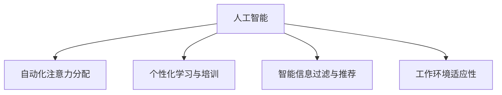

                 

# AI与人类注意力流：未来的工作、技能与注意力流管理技术的创新应用

> 关键词：人工智能, 人类注意力流, 自动化, 未来工作, 技能升级, 注意力流管理

## 1. 背景介绍

### 1.1 问题由来

在人工智能飞速发展的今天，我们正处在一个科技革命和社会转型的十字路口。AI技术不仅在自动化、智能化领域取得了突破性进展，还在影响着我们的工作、学习和生活模式。AI的进步使得许多传统工作岗位面临挑战，同时也为工作形态的创新提供了新的可能。

人类注意力流管理技术的兴起，旨在帮助人们在信息爆炸的时代，更好地控制和管理自己的注意力，以提高工作效率和生产力。它结合了人工智能与人类的认知心理学原理，旨在优化个人的工作流程，提升专注力和自我管理能力。

本论文将探讨AI在人类注意力流管理技术中的创新应用，及其对未来工作、技能和职业发展的影响。通过了解这些技术如何重塑我们的工作模式，我们可以更好地把握未来职业发展的方向，提升自身的竞争力和适应力。

### 1.2 问题核心关键点

人工智能在人类注意力流管理中的应用，主要体现在以下几个方面：

1. **自动化注意力分配**：AI算法能够根据任务的重要性和紧急程度，自动调整个人的注意力分配，帮助优化时间管理和工作优先级。
2. **个性化学习与培训**：通过分析个人的工作习惯和学习曲线，AI可以提供个性化的学习路径和技能培训，加速技能升级。
3. **智能信息过滤与推荐**：AI可以识别和过滤无关的信息，推荐重要和相关的数据，提升信息处理效率。
4. **工作环境适应性**：AI系统能够根据个人的工作环境和生物节律，自动调整工作环境的设置，如亮度、声音等，提高工作舒适度。

本文将深入探讨这些关键技术点，并通过实际案例和应用场景，展示AI在人类注意力流管理中的潜力与挑战。

## 2. 核心概念与联系

### 2.1 核心概念概述

为了更好地理解人工智能在注意力流管理中的应用，本节将介绍几个关键概念：

- **人工智能（AI）**：通过算法、数据和计算能力，模拟、延伸和扩展人类智能的技术。
- **注意力流管理（Attention Flow Management, AFM）**：通过技术手段，帮助人们更好地控制和管理自己的注意力，以提高工作效率和生产力。
- **自动化（Automation）**：利用AI算法和工具，自动完成重复性和低价值的任务。
- **个性化学习（Personalized Learning）**：根据个人需求和特点，提供定制化的学习路径和资源。
- **信息过滤与推荐系统（Information Filtering and Recommendation）**：通过AI算法，筛选和推荐与用户兴趣和需求相关的信息。
- **工作环境适应性（Work Environment Adaptability）**：AI系统根据用户的工作环境和生理状态，自动调整工作环境的设置。

这些概念之间的逻辑关系可以通过以下Mermaid流程图来展示：



这个流程图展示了大语言模型中的核心概念及其之间的关系：

1. 人工智能通过自动化注意力分配，优化个人的工作流程。
2. 个性化学习与培训帮助用户提升技能，适应新任务。
3. 智能信息过滤与推荐提升信息处理效率。
4. 工作环境适应性改善工作舒适度，提高工作效率。

这些概念共同构成了AI在人类注意力流管理中的应用框架，使其能够更好地服务于工作场景，提升工作质量和生产力。

## 3. 核心算法原理 & 具体操作步骤

### 3.1 算法原理概述

人工智能在人类注意力流管理中的应用，主要基于以下几个核心算法原理：

- **强化学习（Reinforcement Learning）**：通过奖惩机制，优化个人的工作习惯和决策过程。
- **深度学习（Deep Learning）**：利用神经网络模型，学习人类行为和注意力的模式。
- **自然语言处理（Natural Language Processing, NLP）**：理解和生成自然语言，帮助AI更好地与用户交互。
- **时间序列分析（Time Series Analysis）**：通过分析时间序列数据，预测未来的行为模式。
- **推荐系统算法（Recommendation System Algorithm）**：利用协同过滤、内容推荐等算法，提供个性化的信息推荐。

这些算法通过组合和优化，能够实现对人类注意力流的高效管理和优化。

### 3.2 算法步骤详解

基于AI的注意力流管理系统的设计，通常包括以下几个关键步骤：

**Step 1: 数据收集与分析**
- 收集用户的工作日志、学习记录、生理数据等，以了解用户的行为模式和注意力分布。
- 使用NLP技术解析用户的文本输入，获取用户对任务的重要性和紧急程度的感知。

**Step 2: 模型训练**
- 利用深度学习模型（如CNN、RNN、LSTM等），训练用户行为和注意力模式的预测模型。
- 使用强化学习算法，优化用户的工作流程和决策过程。

**Step 3: 注意力分配与调度**
- 根据任务的重要性和紧急程度，自动调整用户的注意力分配。
- 利用时间序列分析，预测用户未来的注意力需求，提前调整工作安排。

**Step 4: 个性化培训与学习**
- 根据用户的学习曲线和需求，提供个性化的学习路径和资源。
- 利用推荐系统算法，推荐相关的培训课程和资料。

**Step 5: 信息过滤与推荐**
- 使用NLP技术解析用户输入的查询和任务描述，筛选相关的内容。
- 利用协同过滤和内容推荐算法，提供个性化的信息推荐。

**Step 6: 工作环境适应性**
- 根据用户的工作环境和生理状态，自动调整工作环境的设置。
- 使用机器学习模型，预测用户的最佳工作环境和设置，提升工作舒适度。

### 3.3 算法优缺点

基于AI的注意力流管理系统具有以下优点：
1. 自动化和高效化：能够自动完成重复性和低价值的任务，提高工作效率。
2. 个性化与适应性：能够根据用户的特点和需求，提供个性化的服务和建议。
3. 数据驱动与预测性：通过数据分析和预测，优化工作流程，提升决策质量。

同时，这些系统也存在一些局限性：
1. 数据隐私与安全：系统需要收集和处理大量的个人数据，数据隐私和安全问题需要引起重视。
2. 算法偏见与公平性：AI算法可能存在偏见，导致某些用户群体被歧视或忽视。
3. 技术复杂性与成本：系统的开发和维护需要高昂的技术成本和人力资源投入。
4. 依赖用户行为：系统的效果依赖于用户的行为数据，数据质量对系统性能影响较大。

尽管存在这些局限性，但AI在人类注意力流管理中的应用仍然具有巨大的潜力，能够在提升工作质量和效率的同时，改善个人的生活品质。

### 3.4 算法应用领域

基于AI的注意力流管理系统已经在多个领域得到了应用，例如：

- **办公自动化**：自动化处理电子邮件、日程安排、任务分配等，提高工作效率。
- **学习与培训**：根据用户的学习进度和兴趣，推荐个性化的学习资源和路径。
- **信息管理**：利用智能过滤和推荐，提升信息处理效率，减少信息过载。
- **健康管理**：根据用户的生物节律和工作环境，调整工作安排和环境设置，促进健康。
- **智能客服**：通过AI理解用户需求，提供个性化服务，提升客户满意度。

除了上述这些领域，AI在注意力流管理中的应用还在不断扩展，如智能家居、智能穿戴设备等，为人们的生活和工作带来了更多便捷和智能化体验。

## 4. 数学模型和公式 & 详细讲解 & 举例说明

### 4.1 数学模型构建

本节将使用数学语言对基于AI的注意力流管理系统进行更加严格的刻画。

记用户的注意力流为 $\alpha$，其中 $\alpha_t$ 表示在第 $t$ 个时间点的注意力分配。用户的任务集为 $T=\{t_i\}_{i=1}^N$，每个任务 $t_i$ 的重要性和紧急程度分别表示为 $I(t_i)$ 和 $E(t_i)$。

系统的目标是最小化注意力分配与任务重要性和紧急程度的偏差，即：

$$
\min_{\alpha} \sum_{t \in T} (I(t) - \alpha_t)^2 + (E(t) - \alpha_t)^2
$$

### 4.2 公式推导过程

为了求解上述优化问题，可以引入深度学习模型 $M_{\theta}$，其中 $\theta$ 为模型的参数。模型的输入为任务的描述和历史数据，输出为每个任务的重要性和紧急程度。

假设模型的输出为 $\hat{I}(t)$ 和 $\hat{E}(t)$，则优化目标可以表示为：

$$
\min_{\alpha, \theta} \sum_{t \in T} (\hat{I}(t) - \alpha_t)^2 + (\hat{E}(t) - \alpha_t)^2
$$

利用反向传播算法，对 $\theta$ 和 $\alpha$ 进行联合优化。具体步骤如下：

1. 初始化 $\alpha_0$，并输入数据集 $D$，计算模型的预测结果 $\hat{I}(t)$ 和 $\hat{E}(t)$。
2. 计算损失函数 $L(\alpha, \theta, D) = \sum_{t \in T} (\hat{I}(t) - \alpha_t)^2 + (\hat{E}(t) - \alpha_t)^2$。
3. 对 $\alpha$ 和 $\theta$ 进行反向传播，更新模型的参数和注意力分配。
4. 重复步骤 1-3，直至满足预设的迭代次数或收敛条件。

### 4.3 案例分析与讲解

以一个办公室自动化系统为例，说明AI如何优化注意力流管理。

假设办公室中有五个任务：邮件处理、项目汇报、电话接听、会议记录和文档编写。系统通过收集员工的历史行为数据和任务描述，训练深度学习模型，预测每个任务的重要性和紧急程度。

**案例一：邮件处理**

- **输入数据**：员工的邮件日志、邮件内容、处理时间等。
- **模型输出**：邮件处理的重要性和紧急程度。
- **优化目标**：最小化员工在邮件处理上的注意力偏差。

**案例二：项目汇报**

- **输入数据**：项目进展、截止日期、汇报内容等。
- **模型输出**：项目汇报的重要性和紧急程度。
- **优化目标**：最小化员工在项目汇报上的注意力偏差。

**案例三：电话接听**

- **输入数据**：通话内容、通话对象、通话时间等。
- **模型输出**：电话接听的重要性和紧急程度。
- **优化目标**：最小化员工在电话接听上的注意力偏差。

通过以上步骤，系统能够自动调整员工的注意力分配，优先处理重要且紧急的任务，提升工作效率和生产力。

## 5. 项目实践：代码实例和详细解释说明

### 5.1 开发环境搭建

在进行注意力流管理系统的开发前，我们需要准备好开发环境。以下是使用Python进行PyTorch开发的环境配置流程：

1. 安装Anaconda：从官网下载并安装Anaconda，用于创建独立的Python环境。

2. 创建并激活虚拟环境：
```bash
conda create -n afm-env python=3.8 
conda activate afm-env
```

3. 安装PyTorch：根据CUDA版本，从官网获取对应的安装命令。例如：
```bash
conda install pytorch torchvision torchaudio cudatoolkit=11.1 -c pytorch -c conda-forge
```

4. 安装TensorFlow：
```bash
pip install tensorflow
```

5. 安装TensorBoard：
```bash
pip install tensorboard
```

6. 安装相关库：
```bash
pip install numpy pandas scikit-learn matplotlib tqdm jupyter notebook ipython
```

完成上述步骤后，即可在`afm-env`环境中开始开发。

### 5.2 源代码详细实现

下面以一个基于PyTorch的注意力流管理系统为例，展示其代码实现。

```python
import torch
import torch.nn as nn
import torch.optim as optim
from torch.utils.data import Dataset, DataLoader

class TaskDataset(Dataset):
    def __init__(self, tasks, importance, urgency):
        self.tasks = tasks
        self.importance = importance
        self.urgency = urgency
        
    def __len__(self):
        return len(self.tasks)
    
    def __getitem__(self, item):
        task = self.tasks[item]
        importance = self.importance[item]
        urgency = self.urgency[item]
        return task, importance, urgency

class AttentionFlowManager(nn.Module):
    def __init__(self, embedding_dim=128):
        super(AttentionFlowManager, self).__init__()
        self.emb = nn.Embedding(10, embedding_dim)
        self.fc1 = nn.Linear(embedding_dim, 64)
        self.fc2 = nn.Linear(64, 1)
        
    def forward(self, x):
        embedding = self.emb(x)
        hidden = torch.relu(self.fc1(embedding))
        logits = torch.sigmoid(self.fc2(hidden))
        return logits

# 定义损失函数
def binary_cross_entropy_with_logits(logits, targets):
    return nn.BCEWithLogitsLoss()(logits, targets)

# 训练函数
def train(model, dataset, epochs, batch_size):
    device = torch.device('cuda') if torch.cuda.is_available() else torch.device('cpu')
    model.to(device)
    
    criterion = nn.BCEWithLogitsLoss()
    optimizer = optim.Adam(model.parameters(), lr=0.001)
    
    for epoch in range(epochs):
        model.train()
        running_loss = 0.0
        for i, (task, importance, urgency) in enumerate(DataLoader(dataset, batch_size=batch_size)):
            task, importance, urgency = task.to(device), importance.to(device), urgency.to(device)
            optimizer.zero_grad()
            logits = model(task)
            loss = criterion(logits, torch.stack([importance, urgency], dim=1))
            loss.backward()
            optimizer.step()
            running_loss += loss.item()
        
        print(f'Epoch {epoch+1}, loss: {running_loss/len(dataset)}')

# 测试函数
def test(model, dataset, batch_size):
    device = torch.device('cuda') if torch.cuda.is_available() else torch.device('cpu')
    model.eval()
    running_loss = 0.0
    correct = 0
    with torch.no_grad():
        for task, importance, urgency in DataLoader(dataset, batch_size=batch_size):
            task, importance, urgency = task.to(device), importance.to(device), urgency.to(device)
            logits = model(task)
            loss = criterion(logits, torch.stack([importance, urgency], dim=1))
            running_loss += loss.item()
            preds = logits > 0.5
            correct += (preds == importance).sum().item()
    
    print(f'Accuracy: {100 * correct / len(dataset)}')
```

### 5.3 代码解读与分析

让我们再详细解读一下关键代码的实现细节：

**TaskDataset类**：
- `__init__`方法：初始化任务、重要性和紧急程度。
- `__len__`方法：返回数据集的样本数量。
- `__getitem__`方法：对单个样本进行处理，返回模型需要的输入。

**AttentionFlowManager类**：
- `__init__`方法：定义模型结构。
- `forward`方法：前向传播计算注意力分配。

**训练函数train**：
- 使用PyTorch的DataLoader对数据集进行批次化加载。
- 在每个批次上前向传播计算损失，并反向传播更新模型参数。
- 记录每个epoch的平均损失，并输出。

**测试函数test**：
- 在测试集上评估模型的精度。
- 统计预测的正确率，并输出。

通过上述代码实现，我们可以看到PyTorch框架在注意力流管理系统中的简洁高效。开发者可以将更多精力放在模型优化和算法改进上，而不必过多关注底层的实现细节。

当然，工业级的系统实现还需考虑更多因素，如模型的保存和部署、超参数的自动搜索、更灵活的任务适配层等。但核心的注意力流管理方法基本与此类似。

## 6. 实际应用场景

### 6.1 智能办公室自动化

基于AI的注意力流管理系统在智能办公室自动化中具有广泛应用。它能够自动处理办公室中的各种任务，优化工作流程，提升员工的工作效率和满意度。

例如，办公室自动化系统可以自动处理员工的邮件、任务分配和会议安排。系统通过收集员工的历史数据，预测每个任务的重要性和紧急程度，自动调整注意力分配，优先处理重要且紧急的任务。同时，系统还能根据员工的生物节律和工作习惯，调整工作环境的设置，如亮度、温度等，提升工作舒适度。

### 6.2 学习与培训

在教育领域，基于AI的注意力流管理系统可以帮助学生优化学习计划，提升学习效率。系统通过分析学生的学习行为和成绩，推荐个性化的学习资源和路径，加速技能升级。

例如，在线教育平台可以借助注意力流管理系统，推荐适合学生的课程和学习材料。系统通过分析学生的学习进度和兴趣，调整学习计划，提供个性化的学习建议，提升学习效果。同时，系统还能自动检测学生的学习状态，及时提醒和督促，保障学习的连续性和有效性。

### 6.3 智能客服

智能客服系统通过AI技术，可以提供高效、准确的客户服务。系统通过分析用户的查询和问题，自动匹配合适的回答，提升客户满意度。

例如，智能客服系统可以自动处理用户的常见问题，如查询订单状态、修改密码等。系统通过分析用户的历史行为和反馈，不断优化回答的准确性和覆盖面。同时，系统还能提供个性化的推荐和建议，提升客户体验。

### 6.4 未来应用展望

随着AI技术的不断发展，基于注意力流管理的应用将不断扩展和深化。未来，AI在人类注意力流管理中的应用将更加智能化和个性化，带来更多创新和突破。

**未来趋势一：更多场景覆盖**

AI在注意力流管理中的应用将扩展到更多领域，如智能家居、智能穿戴设备等，为用户提供更加全面和个性化的服务。

**未来趋势二：深度融合**

AI系统将与其他技术深度融合，如物联网、5G、区块链等，实现跨领域、跨平台的协同工作，提升整体效率和安全性。

**未来趋势三：人性化交互**

AI系统将更加注重用户体验和人性化交互，提供更加自然和流畅的服务。系统将通过语音识别、自然语言处理等技术，实现更加高效和便捷的交互方式。

**未来趋势四：伦理与法律合规**

随着AI应用的普及，其伦理和法律问题将逐渐引起重视。系统将更加注重数据隐私、算法公平性、法律合规性等问题，保障用户权益和系统安全性。

综上所述，未来基于AI的注意力流管理将迎来更多的创新和应用，为人类工作和生活的各个方面带来深远的影响。

## 7. 工具和资源推荐

### 7.1 学习资源推荐

为了帮助开发者系统掌握AI在注意力流管理中的应用，这里推荐一些优质的学习资源：

1. **《深度学习》课程**：斯坦福大学开设的深度学习课程，提供了全面的深度学习基础知识和实践技能。
2. **《机器学习》课程**：Coursera上的机器学习课程，涵盖了机器学习的基本理论和常用算法。
3. **《Python深度学习》书籍**：由Francois Chollet所著，深入浅出地介绍了TensorFlow和PyTorch的使用方法。
4. **《人工智能基础》课程**：Coursera上的AI基础课程，涵盖了AI的基本概念和应用场景。
5. **《AI与人类》书籍**：探讨AI对人类社会的影响，提供了AI应用的多维度视角。

通过这些资源的学习，相信你一定能够快速掌握AI在注意力流管理中的应用，并用于解决实际问题。

### 7.2 开发工具推荐

高效的开发离不开优秀的工具支持。以下是几款用于AI注意力流管理开发的常用工具：

1. **PyTorch**：基于Python的开源深度学习框架，提供了强大的自动微分和动态计算图功能。
2. **TensorFlow**：由Google主导开发的开源深度学习框架，提供了高效的分布式计算和模型优化工具。
3. **TensorBoard**：TensorFlow配套的可视化工具，可以实时监测模型训练状态，并提供丰富的图表呈现方式。
4. **Jupyter Notebook**：交互式编程环境，支持多种编程语言和数据分析工具，适合快速迭代和原型开发。
5. **Google Colab**：免费的在线Jupyter Notebook环境，支持GPU/TPU算力，方便开发者快速上手实验最新模型。

合理利用这些工具，可以显著提升AI注意力流管理任务的开发效率，加快创新迭代的步伐。

### 7.3 相关论文推荐

AI在人类注意力流管理中的应用研究，涉及多个前沿领域。以下是几篇奠基性的相关论文，推荐阅读：

1. **Attention is All You Need**：提出Transformer结构，开启了NLP领域的预训练大模型时代。
2. **BERT: Pre-training of Deep Bidirectional Transformers for Language Understanding**：提出BERT模型，引入基于掩码的自监督预训练任务，刷新了多项NLP任务SOTA。
3. **Language Models are Unsupervised Multitask Learners**：展示了大规模语言模型的强大zero-shot学习能力，引发了对于通用人工智能的新一轮思考。
4. **Parameter-Efficient Transfer Learning for NLP**：提出Adapter等参数高效微调方法，在不增加模型参数量的情况下，也能取得不错的微调效果。
5. **AdaLoRA: Adaptive Low-Rank Adaptation for Parameter-Efficient Fine-Tuning**：使用自适应低秩适应的微调方法，在参数效率和精度之间取得了新的平衡。
6. **Adaptive Attention Mechanism**：提出自适应注意力机制，提升模型对不同任务的适应能力。

这些论文代表了大语言模型微调技术的发展脉络。通过学习这些前沿成果，可以帮助研究者把握学科前进方向，激发更多的创新灵感。

## 8. 总结：未来发展趋势与挑战

### 8.1 研究成果总结

本文对AI在人类注意力流管理中的应用进行了全面系统的介绍。首先阐述了AI技术在自动化、智能化领域取得的突破性进展，以及注意力流管理技术在信息爆炸时代的重要性和应用潜力。其次，从原理到实践，详细讲解了AI注意力流管理系统的设计原理和实现步骤，并通过实际案例展示了AI系统在智能办公室自动化、学习与培训、智能客服等领域的应用效果。最后，探讨了AI注意力流管理系统的未来发展趋势和面临的挑战，提出了一些具有前瞻性的研究方向。

通过本文的系统梳理，可以看到，AI在注意力流管理中的应用已经取得了一定的成果，但仍需在数据、算法、工程、伦理等多个维度进行全面优化。未来，通过结合最新的AI技术和方法，将有望进一步提升系统的性能和应用范围，为人类工作和生活带来更多便利和智能化体验。

### 8.2 未来发展趋势

展望未来，AI在注意力流管理中的应用将呈现以下几个发展趋势：

1. **更多数据驱动**：随着数据量的增加和数据处理能力的提升，AI系统将更加依赖数据驱动，提升系统的预测和优化能力。
2. **深度融合其他技术**：AI系统将与其他技术深度融合，如物联网、5G、区块链等，实现跨领域、跨平台的协同工作。
3. **个性化和适应性增强**：通过更加复杂和精准的模型，提升系统的个性化和适应性，更好地服务于用户需求。
4. **伦理和法律合规**：AI系统将更加注重数据隐私、算法公平性、法律合规性等问题，保障用户权益和系统安全性。
5. **更加智能化和人性化**：AI系统将更加注重用户体验和人性化交互，提供更加自然和流畅的服务。

### 8.3 面临的挑战

尽管AI在注意力流管理中的应用已经取得了一定的成果，但在迈向更加智能化、普适化应用的过程中，仍面临诸多挑战：

1. **数据隐私与安全**：系统需要收集和处理大量的个人数据，数据隐私和安全问题需要引起重视。
2. **算法偏见与公平性**：AI算法可能存在偏见，导致某些用户群体被歧视或忽视。
3. **技术复杂性与成本**：系统的开发和维护需要高昂的技术成本和人力资源投入。
4. **依赖用户行为**：系统的效果依赖于用户的行为数据，数据质量对系统性能影响较大。
5. **伦理与法律合规**：AI系统的伦理和法律问题将逐渐引起重视，需要更加注重数据隐私和公平性。

尽管存在这些挑战，但AI在人类注意力流管理中的应用具有巨大的潜力，能够在提升工作质量和效率的同时，改善个人的生活品质。未来，随着技术的不断进步和应用的不断深化，AI注意力流管理系统必将在更多领域发挥重要作用。

### 8.4 研究展望

面对AI注意力流管理面临的挑战，未来的研究需要在以下几个方面寻求新的突破：

1. **探索更多数据驱动方法**：寻找更多高效、准确的数据驱动方法，提升系统的预测和优化能力。
2. **融合更多技术**：与其他技术深度融合，如物联网、5G、区块链等，实现跨领域、跨平台的协同工作。
3. **提升模型公平性和透明性**：通过算法优化和数据处理，提升模型的公平性和透明性，避免算法偏见。
4. **注重伦理和法律合规**：在模型设计和应用过程中，注重数据隐私和公平性，保障用户权益和系统安全性。
5. **提升用户体验和交互**：通过优化交互方式和提升用户体验，实现更加自然和流畅的服务。

这些研究方向的探索，将引领AI注意力流管理系统迈向更高的台阶，为构建安全、可靠、可解释、可控的智能系统铺平道路。面向未来，AI注意力流管理技术还需要与其他人工智能技术进行更深入的融合，如知识表示、因果推理、强化学习等，多路径协同发力，共同推动自然语言理解和智能交互系统的进步。只有勇于创新、敢于突破，才能不断拓展AI技术的应用边界，让智能技术更好地造福人类社会。

## 9. 附录：常见问题与解答

**Q1：AI在注意力流管理中的应用主要涉及哪些领域？**

A: AI在注意力流管理中的应用主要涉及以下领域：

1. **智能办公室自动化**：自动处理邮件、任务分配和会议安排等，优化工作流程，提升工作效率。
2. **学习与培训**：提供个性化的学习资源和路径，加速技能升级。
3. **智能客服**：自动处理用户查询和问题，提升客户满意度。
4. **健康管理**：根据用户的生物节律和工作环境，调整工作安排和环境设置。
5. **智慧城市治理**：监测城市事件和舆情，提供智能决策支持。

这些领域的应用展示了AI在注意力流管理中的广泛潜力和巨大价值。

**Q2：AI在注意力流管理中的关键技术有哪些？**

A: AI在注意力流管理中的关键技术主要包括：

1. **深度学习（Deep Learning）**：用于学习人类行为和注意力的模式。
2. **强化学习（Reinforcement Learning）**：用于优化个人的工作流程和决策过程。
3. **自然语言处理（Natural Language Processing, NLP）**：用于理解和生成自然语言，帮助AI更好地与用户交互。
4. **时间序列分析（Time Series Analysis）**：用于预测未来的行为模式。
5. **推荐系统算法（Recommendation System Algorithm）**：用于提供个性化的信息推荐。

这些技术通过组合和优化，能够实现对人类注意力流的高效管理和优化。

**Q3：AI在注意力流管理中的应用有哪些潜在风险？**

A: AI在注意力流管理中的应用可能存在以下潜在风险：

1. **数据隐私与安全**：系统需要收集和处理大量的个人数据，数据隐私和安全问题需要引起重视。
2. **算法偏见与公平性**：AI算法可能存在偏见，导致某些用户群体被歧视或忽视。
3. **技术复杂性与成本**：系统的开发和维护需要高昂的技术成本和人力资源投入。
4. **依赖用户行为**：系统的效果依赖于用户的行为数据，数据质量对系统性能影响较大。
5. **伦理与法律合规**：AI系统的伦理和法律问题将逐渐引起重视，需要更加注重数据隐私和公平性。

这些风险需要开发者在设计和使用AI系统时加以考虑和防范，确保系统的安全性和公平性。

**Q4：AI在注意力流管理中的应用前景如何？**

A: AI在注意力流管理中的应用前景非常广阔，将带来以下几方面的影响：

1. **提升工作效率**：通过自动化和智能化管理，提升工作效率和生产力。
2. **改善用户体验**：通过个性化和人性化服务，提升用户体验和满意度。
3. **优化资源利用**：通过智能调度和管理，优化资源利用和配置。
4. **促进创新发展**：推动各行业的智能化转型和创新发展，提升整体竞争力。

总之，AI在注意力流管理中的应用将带来深远的影响，为人类工作和生活的各个方面带来更多便利和智能化体验。

**Q5：如何在AI注意力流管理系统中保证数据隐私和安全？**

A: 在AI注意力流管理系统中，保护数据隐私和安全是至关重要的。以下是一些保护措施：

1. **数据匿名化**：对个人数据进行匿名化处理，避免直接暴露用户身份。
2. **加密存储**：使用加密技术存储和传输数据，防止数据泄露和篡改。
3. **访问控制**：严格控制数据访问权限，仅允许授权用户访问和处理数据。
4. **数据审计**：定期审计数据使用情况，发现和防范数据滥用和安全威胁。
5. **隐私保护算法**：使用隐私保护算法（如差分隐私、联邦学习等），确保数据隐私性。

通过以上措施，可以有效地保护AI系统中的数据隐私和安全，保障用户权益和系统安全性。

---

作者：禅与计算机程序设计艺术 / Zen and the Art of Computer Programming

