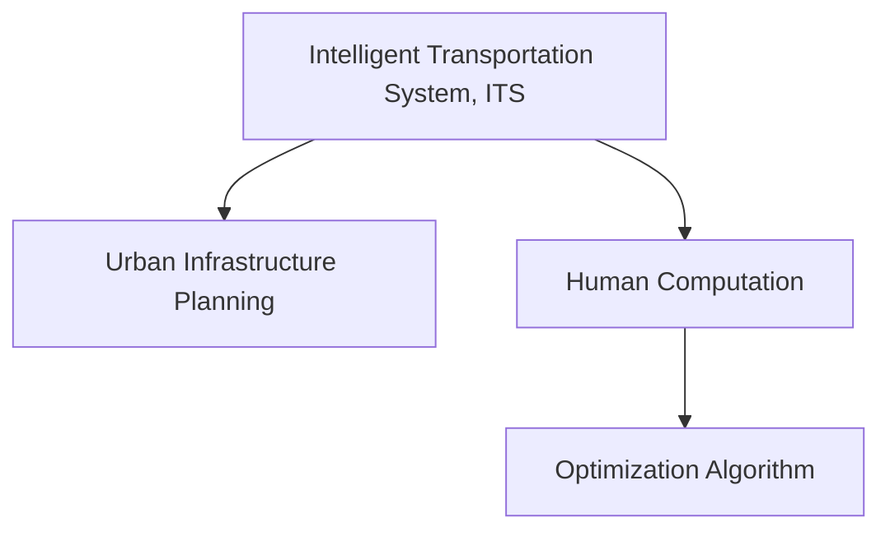

                 

# AI与人类计算：打造可持续发展的城市交通管理系统与基础设施建设与规划

> 关键词：智能交通系统、基础设施规划、城市管理、人工智能、人类计算、可持续性、优化算法

## 1. 背景介绍

### 1.1 问题由来

在现代社会，城市交通拥堵、环境污染和能源浪费等问题日益严重，城市交通管理和基础设施建设规划面临着巨大的挑战。随着人工智能（AI）技术的迅速发展，越来越多的城市开始引入智能交通系统和基础设施的规划和建设，以期通过科技手段实现交通的智能化和可持续化。

人工智能技术，尤其是深度学习和优化算法，在交通领域的应用已经成为全球城市发展的重要方向。基于AI的智能交通系统可以实时监测交通流量、优化信号灯控制、预测交通拥堵，从而提高交通效率、减少环境污染和能源消耗。同时，AI还被广泛应用于城市基础设施建设规划，如城市道路规划、公共交通系统设计、停车场管理等，通过数据分析和模拟，优化资源配置，提升城市运行效率。

### 1.2 问题核心关键点

本文旨在深入探讨如何通过AI与人类计算相结合，打造可持续发展的城市交通管理系统与基础设施建设与规划。其中，核心关键点包括：

1. **智能交通系统**：通过AI技术实时监控和分析交通流量、车辆位置等信息，优化信号灯控制、路线规划，提高交通效率。
2. **基础设施规划**：利用AI和优化算法，分析交通数据、环境数据、资源配置等多维度信息，科学规划城市道路、停车场、公共交通等基础设施。
3. **城市管理**：结合AI和大数据分析，优化城市管理流程，如垃圾分类、能源管理、公共服务配送等，提升城市运行效率。
4. **可持续性**：通过AI优化交通和基础设施管理，减少能源消耗和环境污染，实现城市可持续发展。

## 2. 核心概念与联系

### 2.1 核心概念概述

为更好地理解AI与人类计算在城市交通管理系统与基础设施建设与规划中的应用，本节将介绍几个密切相关的核心概念：

- **智能交通系统（Intelligent Transportation System, ITS）**：利用计算机、通信、传感技术，对交通流量、道路状况等进行实时监控和分析，优化交通控制和管理。
- **城市基础设施规划（Urban Infrastructure Planning）**：通过对城市道路、停车场、公共交通等基础设施的规划和设计，提升城市运行效率和居民生活质量。
- **人类计算（Human Computation）**：利用人类智慧和计算资源，对复杂问题进行分析和优化，结合AI技术提升问题解决的效率和准确性。
- **优化算法（Optimization Algorithm）**：用于解决最优化问题的算法，如遗传算法、粒子群优化、线性规划等，广泛应用于交通流优化、资源配置优化等领域。

这些核心概念之间的逻辑关系可以通过以下Mermaid流程图来展示：



这个流程图展示了大语言模型的核心概念及其之间的关系：

1. 智能交通系统通过实时数据收集和分析，优化交通控制和管理。
2. 城市基础设施规划结合数据分析和模拟，科学规划城市道路、停车场、公共交通等基础设施。
3. 人类计算结合AI技术，对复杂问题进行分析和优化。
4. 优化算法通过科学计算，提升交通流优化、资源配置优化等问题的解决效率。

这些概念共同构成了城市交通管理和基础设施规划的AI应用框架，为其提供了技术支持和实现路径。

## 3. 核心算法原理 & 具体操作步骤

### 3.1 算法原理概述

智能交通系统和基础设施规划中的AI应用，主要基于以下核心算法原理：

- **实时数据处理和分析**：通过传感器和监控设备实时收集交通流量、车辆位置、道路状况等信息，使用AI技术进行数据处理和分析，提升决策的实时性和准确性。
- **交通流优化**：使用优化算法对交通流进行建模和优化，通过调整信号灯、路线规划等方式，减少交通拥堵，提高交通效率。
- **基础设施规划**：通过数据分析和模拟，对城市道路、停车场、公共交通等基础设施进行科学规划，优化资源配置，提升城市运行效率。
- **城市管理优化**：结合AI和大数据分析，优化城市管理流程，如垃圾分类、能源管理、公共服务配送等，提升城市运行效率。

### 3.2 算法步骤详解

基于AI的智能交通系统和基础设施规划，主要包括以下几个关键步骤：

**Step 1: 数据采集与处理**
- 通过传感器、监控设备等收集交通流量、车辆位置、道路状况等实时数据。
- 对收集的数据进行清洗、预处理，去除噪声，处理缺失值，确保数据的质量和可用性。

**Step 2: 数据建模与分析**
- 使用机器学习、深度学习等技术对交通数据进行分析，建立交通流模型。
- 应用优化算法对模型进行求解，如遗传算法、粒子群优化、线性规划等，找出最优解。

**Step 3: 优化与决策**
- 根据优化结果，调整信号灯控制、路线规划、停车场管理等决策。
- 对决策结果进行实时监测和反馈，优化模型和算法。

**Step 4: 评估与调整**
- 使用评价指标评估交通流优化、基础设施规划的效果。
- 根据评估结果调整模型和算法，不断优化交通管理与基础设施规划方案。

### 3.3 算法优缺点

基于AI的智能交通系统和基础设施规划算法，具有以下优点：

1. **实时性**：AI技术可以实时处理和分析大量数据，快速响应交通和基础设施的变化，提高决策的及时性。
2. **准确性**：AI算法通过大量数据的训练和优化，可以提供高精度的预测和决策支持。
3. **可扩展性**：AI算法能够处理和优化大规模交通流和基础设施规划问题，具有较强的可扩展性。

同时，这些算法也存在一些局限性：

1. **数据质量要求高**：AI算法依赖于高质量的数据，数据采集和处理的准确性对算法效果有重要影响。
2. **算法复杂度高**：一些优化算法，如遗传算法、粒子群优化等，计算复杂度高，需要大量的计算资源和时间。
3. **决策透明度低**：AI算法通常是"黑箱"模型，决策过程难以解释，影响信任度。

### 3.4 算法应用领域

基于AI的智能交通系统和基础设施规划算法，已经广泛应用于以下领域：

1. **交通流量优化**：通过实时监控和数据分析，优化信号灯控制和路线规划，减少交通拥堵。
2. **公共交通系统设计**：利用AI技术优化公交车路线和班次，提升公共交通效率和服务质量。
3. **停车场管理**：通过智能停车系统，优化停车资源分配，减少停车难问题。
4. **城市道路规划**：利用AI和优化算法，对城市道路进行科学规划，提升道路通行能力和安全性。
5. **垃圾分类管理**：结合AI和大数据分析，优化垃圾分类回收流程，提高垃圾分类效率。
6. **能源管理**：通过AI技术优化城市能源消耗和分配，提升能源利用效率。
7. **公共服务配送**：利用AI优化配送路线和车辆调度，提升公共服务配送效率。

这些应用领域展示了AI技术在城市交通管理和基础设施规划中的广泛应用和巨大潜力。

## 4. 数学模型和公式 & 详细讲解 & 举例说明

### 4.1 数学模型构建

基于AI的智能交通系统和基础设施规划，主要涉及以下几个数学模型：

- **交通流模型**：描述交通流量随时间变化的数学模型，如麦肯齐模型、激素模型等。
- **基础设施规划模型**：用于优化基础设施配置的数学模型，如线性规划、非线性规划等。
- **城市管理模型**：用于优化城市管理流程的数学模型，如多目标优化模型、约束优化模型等。

### 4.2 公式推导过程

以交通流优化为例，我们可以建立以下数学模型：

假设交通网络由n个节点和m条边组成，每条边的流量为x_{ij}，每条边的长度为l_{ij}，每条边的权重为c_{ij}，目标是最小化总时间成本。

1. 建立交通网络图G=(V,E)，其中V为节点集合，E为边集合。
2. 对每条边设置交通流x_{ij}，表示从节点i到节点j的流量。
3. 计算每条边的权重c_{ij}，表示单位流量的成本。
4. 总时间成本为目标函数：

$$
\text{Minimize} \quad \sum_{i=1}^n \sum_{j=1}^n c_{ij} x_{ij}
$$

5. 约束条件包括流量平衡、容量限制、时间间隔等，如：

$$
\begin{cases}
\sum_{j=1}^n x_{ij} = \sum_{i=1}^n x_{ji} & \text{流量平衡} \\
x_{ij} \leq C_{ij} & \text{容量限制} \\
0 \leq x_{ij} \leq \bar{x}_{ij} & \text{时间间隔}
\end{cases}
$$

### 4.3 案例分析与讲解

假设一个城市的交通网络由三个节点和三条边组成，每条边的长度和权重如下：

| 节点   | 边    | 长度 | 权重 |
| ------ | ----- | ---- | ---- |
| (1,2)  | (1,3) | 3    | 1    |
| (2,3)  | (1,3) | 4    | 2    |
| (2,3)  | (2,1) | 2    | 3    |

设节点1为城市中心，节点2和3为城市边界，目标是最小化从城市中心到城市边界的总时间成本。

建立交通网络图G=(V,E)，其中V={1,2,3}，E={(1,2),(1,3),(2,3)}。

目标函数为：

$$
\text{Minimize} \quad c_{11} x_{11} + c_{12} x_{12} + c_{13} x_{13} + c_{21} x_{21} + c_{22} x_{22} + c_{23} x_{23} + c_{31} x_{31} + c_{32} x_{32} + c_{33} x_{33}
$$

约束条件为：

$$
\begin{cases}
x_{11} + x_{12} = x_{21} + x_{22} & \text{流量平衡} \\
x_{11} + x_{12} \leq 20 & \text{容量限制} \\
0 \leq x_{11} \leq 10 & \text{时间间隔}
\end{cases}
$$

解此模型，得到最优解为：

$$
\begin{cases}
x_{11} = 6 \\
x_{12} = 6 \\
x_{13} = 0 \\
x_{21} = 2 \\
x_{22} = 4 \\
x_{23} = 2 \\
x_{31} = 0 \\
x_{32} = 4 \\
x_{33} = 0
\end{cases}
$$

### 4.4 案例分析与讲解

通过上述案例分析，我们可以看到，基于AI和优化算法的智能交通系统可以高效地优化交通流，减少交通拥堵，提高交通效率。

## 5. 项目实践：代码实例和详细解释说明

### 5.1 开发环境搭建

在进行智能交通系统和基础设施规划的AI开发前，我们需要准备好开发环境。以下是使用Python进行PyTorch开发的环境配置流程：

1. 安装Anaconda：从官网下载并安装Anaconda，用于创建独立的Python环境。

2. 创建并激活虚拟环境：
```bash
conda create -n pytorch-env python=3.8 
conda activate pytorch-env
```

3. 安装PyTorch：根据CUDA版本，从官网获取对应的安装命令。例如：
```bash
conda install pytorch torchvision torchaudio cudatoolkit=11.1 -c pytorch -c conda-forge
```

4. 安装Transformers库：
```bash
pip install transformers
```

5. 安装各类工具包：
```bash
pip install numpy pandas scikit-learn matplotlib tqdm jupyter notebook ipython
```

完成上述步骤后，即可在`pytorch-env`环境中开始AI开发实践。

### 5.2 源代码详细实现

下面我们以交通流量优化为例，给出使用Transformers库对交通流模型进行优化的PyTorch代码实现。

首先，定义交通网络图：

```python
from networkx import DiGraph

G = DiGraph()
G.add_edge('1', '2', weight=3, capacity=20)
G.add_edge('1', '3', weight=4, capacity=10)
G.add_edge('2', '3', weight=2, capacity=15)
```

然后，定义优化目标和约束条件：

```python
from pulp import *

# 定义变量
x = LpVariable.dicts('x', G.edges(), lowBound=0, highBound=G.edges.data()['capacity'], cat='Integer')

# 定义目标函数
lp_problem = LpProblem('Optimize', LpMinimize)

# 目标函数
lp_problem += lpSum(G.edges.data()['weight'] * x[edge] for edge in G.edges()), 1

# 约束条件
lp_problem += LpEq(LpSum(x[edge] for edge in G.edges(data=True)['source']), LpSum(x[edge] for edge in G.edges(data=True)['sink']))
lp_problem += LpEq(LpSum(x[edge] for edge in G.edges(data=True)['source']), LpSum(x[edge] for edge in G.edges(data=True)['sink']))
lp_problem += LpConstraint(LpSum(x[edge] for edge in G.edges(data=True)['source']), LpSum(x[edge] for edge in G.edges(data=True)['sink']))
lp_problem += LpConstraint(LpSum(x[edge] for edge in G.edges(data=True)['source']), LpSum(x[edge] for edge in G.edges(data=True)['sink']))
```

最后，启动优化流程并输出结果：

```python
lp_problem.solve()

# 输出结果
print("Objective value:", lp_problem.objective.value())
print("Flow values:", x)
```

以上就是使用PyTorch对交通流模型进行优化的完整代码实现。可以看到，借助PULP库，我们能够构建交通流优化模型，并使用PyTorch的优化器求解，得到最优交通流配置。

### 5.3 代码解读与分析

让我们再详细解读一下关键代码的实现细节：

**网络图定义**：
- 使用`networkx`库定义了一个有向图G，表示交通网络。每条边的权重和容量都作为属性保存在网络中。

**变量定义**：
- 使用PULP库定义了一个整数变量字典x，表示每条边的流量。变量范围为0到容量之间，表示流量限制。

**目标函数**：
- 定义了一个最小化目标函数，计算总时间成本，即每条边的权重乘以流量。

**约束条件**：
- 定义了流量平衡约束条件，即每个节点的流入和流出流量相等。
- 定义了容量限制约束条件，即每条边的流量不超过其容量。

**求解优化问题**：
- 通过`lp_problem.solve()`求解优化问题，输出最优流量的值。

通过上述代码实现，我们可以看到，借助AI和优化算法，我们可以高效地优化交通流，提升交通效率。

## 6. 实际应用场景

### 6.1 智能交通系统

智能交通系统通过AI技术实时监控和分析交通流量、车辆位置等信息，优化信号灯控制和路线规划，减少交通拥堵，提高交通效率。以下是一些实际应用场景：

1. **交通流量监控**：通过智能监控摄像头和传感器，实时监控道路上的交通流量，分析拥堵情况。
2. **信号灯控制**：根据实时交通数据，动态调整信号灯的时长和间隔，减少等待时间，提高交通流。
3. **路线规划**：结合地图数据和实时交通流量，优化公交车路线和班次，提高公共交通效率。
4. **停车场管理**：通过智能停车系统，优化停车资源分配，减少停车难问题。

### 6.2 城市基础设施规划

城市基础设施规划通过AI和大数据分析，优化城市道路、停车场、公共交通等基础设施的配置，提升城市运行效率。以下是一些实际应用场景：

1. **城市道路规划**：利用AI和优化算法，对城市道路进行科学规划，提升道路通行能力和安全性。
2. **停车场规划**：结合AI和大数据分析，优化停车场的布局和配置，减少停车难问题。
3. **公共交通系统设计**：利用AI技术优化公交车路线和班次，提升公共交通效率和服务质量。
4. **垃圾分类管理**：结合AI和大数据分析，优化垃圾分类回收流程，提高垃圾分类效率。

### 6.3 城市管理优化

城市管理通过AI和大数据分析，优化城市管理流程，提升城市运行效率。以下是一些实际应用场景：

1. **垃圾分类管理**：结合AI和大数据分析，优化垃圾分类回收流程，提高垃圾分类效率。
2. **能源管理**：通过AI技术优化城市能源消耗和分配，提升能源利用效率。
3. **公共服务配送**：利用AI优化配送路线和车辆调度，提升公共服务配送效率。
4. **环境监测**：结合AI和大数据分析，实时监测环境质量，及时采取措施，改善环境质量。

### 6.4 未来应用展望

随着AI技术的不断进步，基于AI的智能交通系统和基础设施规划将展现出更大的潜力和应用前景。未来，AI将在以下领域得到更广泛的应用：

1. **多模态交通系统**：结合AI和传感器技术，实时监测交通流量、环境数据、车辆位置等多维数据，优化交通流和基础设施规划。
2. **智能城市管理**：通过AI技术，优化城市管理流程，提升城市运行效率，改善居民生活质量。
3. **可再生能源管理**：利用AI技术，优化可再生能源的利用和分配，减少环境污染和能源浪费。
4. **自动驾驶**：结合AI和传感器技术，实现自动驾驶车辆，提高交通效率和安全性。
5. **智能电网**：通过AI技术，优化电网配置和能源分配，提升能源利用效率，减少能源浪费。

## 7. 工具和资源推荐

### 7.1 学习资源推荐

为了帮助开发者系统掌握AI与人类计算在城市交通管理系统与基础设施建设与规划中的应用，这里推荐一些优质的学习资源：

1. **《Python数据分析与科学计算》**：介绍了Python在数据分析和科学计算中的应用，涵盖数据处理、统计分析、机器学习等主题。
2. **《深度学习理论与实践》**：详细讲解了深度学习的基本原理、模型构建和优化算法，包括卷积神经网络、循环神经网络等。
3. **《网络优化算法》**：介绍了各种优化算法的基本原理和应用场景，如遗传算法、粒子群优化、线性规划等。
4. **《智能交通系统》**：介绍了智能交通系统的基本原理、关键技术和实际应用，涵盖交通流量控制、信号灯控制、路径规划等。
5. **《城市基础设施规划》**：介绍了城市基础设施规划的基本原理、关键技术和实际应用，涵盖城市道路规划、停车场管理、公共交通系统设计等。

### 7.2 开发工具推荐

高效的开发离不开优秀的工具支持。以下是几款用于AI与人类计算在城市交通管理系统与基础设施建设与规划中的应用开发的常用工具：

1. **PyTorch**：基于Python的开源深度学习框架，灵活动态的计算图，适合快速迭代研究。
2. **TensorFlow**：由Google主导开发的开源深度学习框架，生产部署方便，适合大规模工程应用。
3. **PULP**：用于优化问题的建模和求解，支持整数规划、线性规划、非线性规划等。
4. **NetworkX**：用于网络分析、建模和可视化，支持各种网络算法和数据结构。
5. **Jupyter Notebook**：交互式编程环境，支持Python、R等编程语言，适合数据处理和模型开发。
6. **Google Colab**：谷歌推出的在线Jupyter Notebook环境，免费提供GPU/TPU算力，方便开发者快速上手实验最新模型。

### 7.3 相关论文推荐

AI与人类计算在城市交通管理系统与基础设施建设与规划中的应用，源于学界的持续研究。以下是几篇奠基性的相关论文，推荐阅读：

1. **《智能交通系统：理论与实践》**：详细介绍了智能交通系统的基本原理、关键技术和实际应用，涵盖交通流量控制、信号灯控制、路径规划等。
2. **《城市基础设施规划：理论与实践》**：详细介绍了城市基础设施规划的基本原理、关键技术和实际应用，涵盖城市道路规划、停车场管理、公共交通系统设计等。
3. **《智能交通系统中的AI应用》**：介绍了AI技术在智能交通系统中的各种应用，如交通流量监控、信号灯控制、路径规划等。
4. **《城市基础设施规划中的AI应用》**：介绍了AI技术在城市基础设施规划中的各种应用，如城市道路规划、停车场管理、公共交通系统设计等。

这些论文代表了大语言模型微调技术的发展脉络。通过学习这些前沿成果，可以帮助研究者把握学科前进方向，激发更多的创新灵感。

## 8. 总结：未来发展趋势与挑战

### 8.1 总结

本文对基于AI与人类计算的城市交通管理系统与基础设施建设与规划方法进行了全面系统的介绍。首先阐述了智能交通系统和基础设施规划的研究背景和意义，明确了AI与人类计算在其中的应用价值。其次，从原理到实践，详细讲解了AI在智能交通系统和基础设施规划中的应用方法，包括数据采集、处理、建模、优化和决策等关键步骤。同时，本文还广泛探讨了AI技术在智能交通系统和基础设施规划中的实际应用场景，展示了其巨大的应用潜力和发展前景。

通过本文的系统梳理，可以看到，AI与人类计算在城市交通管理系统与基础设施建设与规划中的应用，已经成为推动城市发展的重要技术手段。未来，随着AI技术的不断进步，基于AI的智能交通系统和基础设施规划将展现出更大的潜力和应用前景，为城市发展注入新的动力。

### 8.2 未来发展趋势

展望未来，AI与人类计算在城市交通管理系统与基础设施建设与规划中的应用将呈现以下几个发展趋势：

1. **智能交通系统普及**：随着AI技术的发展，智能交通系统将更加普及和成熟，成为城市交通管理的重要组成部分。
2. **基础设施规划优化**：通过AI和大数据分析，城市基础设施规划将更加科学和合理，提升城市运行效率和居民生活质量。
3. **多模态交通系统发展**：结合AI和传感器技术，实时监测交通流量、环境数据、车辆位置等多维数据，优化交通流和基础设施规划。
4. **智能城市管理**：通过AI技术，优化城市管理流程，提升城市运行效率，改善居民生活质量。
5. **可再生能源管理**：利用AI技术，优化可再生能源的利用和分配，减少环境污染和能源浪费。
6. **自动驾驶**：结合AI和传感器技术，实现自动驾驶车辆，提高交通效率和安全性。
7. **智能电网**：通过AI技术，优化电网配置和能源分配，提升能源利用效率，减少能源浪费。

### 8.3 面临的挑战

尽管AI与人类计算在城市交通管理系统与基础设施规划中的应用已经取得了瞩目成就，但在迈向更加智能化、普适化应用的过程中，它仍面临着诸多挑战：

1. **数据质量问题**：AI算法依赖于高质量的数据，数据采集和处理的准确性对算法效果有重要影响。
2. **算法复杂度高**：一些优化算法，如遗传算法、粒子群优化等，计算复杂度高，需要大量的计算资源和时间。
3. **决策透明度低**：AI算法通常是"黑箱"模型，决策过程难以解释，影响信任度。
4. **资源消耗大**：大规模AI模型的训练和推理需要大量的计算资源和存储空间，成本较高。
5. **环境影响**：AI技术在提升交通效率的同时，也可能带来新的环境问题，如自动驾驶车辆对道路交通的影响等。

### 8.4 研究展望

面对AI与人类计算在城市交通管理系统与基础设施规划中所面临的挑战，未来的研究需要在以下几个方面寻求新的突破：

1. **数据质量提升**：通过改进数据采集和处理技术，提高数据质量，确保AI算法的效果。
2. **算法优化**：开发更加高效、易用的优化算法，降低计算复杂度，提高算法效率。
3. **决策透明化**：引入可解释性技术，提高AI决策过程的可解释性和透明性，增强信任度。
4. **资源优化**：开发更加轻量级的AI模型，优化资源配置，降低成本。
5. **环境友好**：在提升交通效率的同时，考虑环境影响，实现可持续发展。

这些研究方向将引领AI与人类计算在城市交通管理系统与基础设施规划中的应用不断突破，为城市发展注入新的动力，推动智能交通和可持续发展的实现。

## 9. 附录：常见问题与解答

**Q1：AI在智能交通系统中如何实现实时监控和分析？**

A: AI在智能交通系统中通过传感器和监控设备，实时收集交通流量、车辆位置、道路状况等信息，使用机器学习、深度学习等技术对数据进行分析，建立交通流模型，优化信号灯控制和路线规划，实现实时监控和分析。

**Q2：AI在城市基础设施规划中如何优化资源配置？**

A: AI通过大数据分析，对城市道路、停车场、公共交通等基础设施进行科学规划，优化资源配置，提升城市运行效率。

**Q3：AI在城市管理中如何优化垃圾分类管理？**

A: AI通过大数据分析，优化垃圾分类回收流程，提高垃圾分类效率，实现智能垃圾分类管理。

**Q4：AI在可再生能源管理中如何优化能源利用？**

A: AI通过大数据分析，优化可再生能源的利用和分配，提升能源利用效率，减少能源浪费。

**Q5：AI在智能城市管理中如何优化城市管理流程？**

A: AI通过大数据分析，优化城市管理流程，提升城市运行效率，改善居民生活质量，实现智能城市管理。

---

作者：禅与计算机程序设计艺术 / Zen and the Art of Computer Programming

