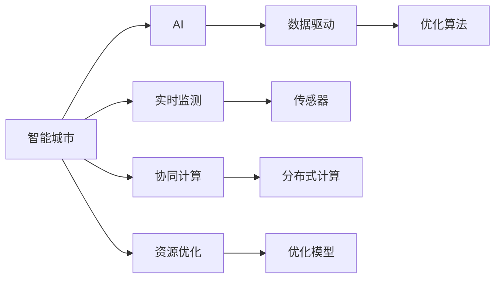

                 

# AI与人类计算：打造可持续发展的城市环境

> 关键词：人工智能, 智能城市, 可持续发展, 环境管理, 优化算法, 协同计算, 资源优化, 实时监测

## 1. 背景介绍

### 1.1 问题由来

随着城市化进程的加快，城市规模的不断扩大，资源压力、环境污染、交通拥堵等城市病问题日益严峻。这些问题的解决离不开先进的信息技术手段，而人工智能（AI）的兴起为城市管理提供了新的可能。智能城市（Smart City）作为新一代城市形态，通过集成物联网（IoT）、大数据、云计算、AI等技术，可以实现对城市环境的全面监测和优化，为可持续发展的目标保驾护航。

### 1.2 问题核心关键点

智能城市构建的核心在于数据驱动和算法驱动，旨在通过实时数据获取和智能算法处理，提升城市管理的智能化水平。智能城市中的AI应用涉及城市基础设施、交通、环保、公共安全等多个领域，具体如下：

- **智能交通**：通过实时监控交通流量、车辆位置，优化交通信号灯控制，减少拥堵，提升道路通行效率。
- **智能环保**：利用传感器实时监测空气质量、水质，对污染源进行溯源，优化城市能源结构，降低碳排放。
- **智能公共服务**：通过AI分析城市公共服务需求，优化资源配置，提供高效便捷的公共服务。
- **智能应急响应**：建立智能预警系统，对突发事件进行快速响应，保障城市安全。

### 1.3 问题研究意义

研究AI在智能城市中的应用，对于推动城市治理现代化、实现城市环境可持续发展具有重要意义：

1. **提升管理效率**：通过AI技术对海量数据进行实时分析和处理，可以大幅提升城市管理的效率和响应速度，优化资源配置。
2. **优化环境质量**：AI能够精准识别环境污染源，辅助制定科学的环境保护政策，提升城市环境质量。
3. **改善公共服务**：AI技术能够预测公共服务需求，提前布局资源，提升公共服务水平，增强居民幸福感。
4. **增强应急响应**：AI系统能够实时监测城市动态，快速识别并响应突发事件，保障城市安全稳定。
5. **推动产业升级**：AI技术在城市中的应用，可以推动传统产业的数字化转型，催生新兴产业，推动经济结构优化。

## 2. 核心概念与联系

### 2.1 核心概念概述

为更好地理解AI在智能城市中的应用，本节将介绍几个关键概念：

- **智能城市**：利用信息技术和AI技术，实现城市管理的智能化，提升城市运行的效率和质量。
- **AI**：通过计算机算法和模型，使计算机系统具备类人智能，实现数据驱动决策。
- **数据驱动**：基于数据获取、处理和分析，进行科学决策和预测，优化城市管理。
- **协同计算**：通过分布式计算和协同处理，提升计算效率，支持大规模复杂系统的优化。
- **实时监测**：通过传感器和IoT设备，实现对城市环境、交通、能源等实时数据获取。
- **资源优化**：通过算法优化，实现对城市资源（如交通、能源、公共服务）的高效利用和配置。

这些概念之间相互联系，共同构成了智能城市构建的技术基础和应用框架，使得AI技术在城市管理中发挥重要作用。

### 2.2 核心概念原理和架构的 Mermaid 流程图



这个流程图展示了智能城市构建的技术流程和架构：

1. 智能城市通过AI技术实现智能化管理。
2. AI依赖数据驱动，进行科学决策。
3. 实时监测通过传感器获取城市运行数据。
4. 协同计算利用分布式系统提升处理效率。
5. 资源优化通过算法实现资源配置优化。

## 3. 核心算法原理 & 具体操作步骤

### 3.1 算法原理概述

智能城市中的AI应用主要依赖优化算法和协同计算。优化算法用于对城市管理中的各个环节进行优化，提升效率和效果。协同计算则利用分布式系统，实现对海量数据的并行处理，支撑实时监测和资源优化。

### 3.2 算法步骤详解

**Step 1: 数据采集与预处理**

1. **传感器部署**：在城市的关键节点（如交通路口、公园、水源地等）部署各类传感器（如交通传感器、环境监测器、能源监测器），实时获取城市运行数据。
2. **数据预处理**：对采集到的数据进行清洗、去噪、标准化处理，为后续算法处理做准备。

**Step 2: 实时数据分析**

1. **数据流管理**：利用分布式数据流处理系统（如Apache Flink、Apache Kafka）实现数据的实时传输和处理。
2. **算法优化**：设计并应用合适的优化算法（如遗传算法、粒子群算法、强化学习等）对城市管理中的各个环节进行优化。
3. **实时决策**：根据算法处理结果，进行实时决策，如调整交通信号灯、控制能源分配等。

**Step 3: 资源配置优化**

1. **资源规划**：根据实时数据分析结果，对城市资源进行规划和配置，如交通流量分配、能源消耗管理等。
2. **协同计算**：利用分布式计算系统（如Hadoop、Spark）实现对海量数据的并行处理，提升计算效率。
3. **动态调整**：根据环境变化和需求变化，动态调整资源配置策略，确保资源优化效果。

**Step 4: 模型训练与优化**

1. **模型构建**：利用历史数据和优化结果，构建AI模型，如交通流预测模型、污染源溯源模型等。
2. **模型训练**：使用训练数据集对模型进行训练，调整模型参数，优化模型性能。
3. **模型评估**：利用测试数据集评估模型性能，确保模型准确性和鲁棒性。

### 3.3 算法优缺点

智能城市中的AI应用具有以下优点：

1. **高效性**：通过优化算法和协同计算，大幅提升城市管理的效率和响应速度。
2. **精准性**：基于实时数据分析，可以精准识别和解决问题，提高管理效果。
3. **实时性**：利用实时监测技术，可以迅速响应城市动态变化，保障城市安全稳定。
4. **普适性**：AI技术可以应用于城市管理的各个环节，提升综合管理水平。

同时，这些算法也存在一定的局限性：

1. **数据依赖**：AI系统依赖高质量的数据输入，数据的准确性和完整性直接影响系统效果。
2. **算法复杂度**：优化算法和协同计算涉及复杂的数学和编程实现，开发和维护成本较高。
3. **资源需求**：AI系统需要大量的计算资源和存储空间，可能对城市基础设施造成额外负担。
4. **隐私和安全**：城市数据的敏感性和隐私保护问题，需要严格的数据管理和安全措施。

### 3.4 算法应用领域

智能城市中的AI应用覆盖了城市管理的各个领域，具体包括：

- **智能交通**：基于AI的交通信号灯控制、交通流量预测、路径优化等。
- **智能环保**：AI辅助的空气质量监测、水质监测、污染源溯源等。
- **智能公共服务**：AI预测的公共服务需求、智能客服、公共安全预警等。
- **智能应急响应**：AI系统对突发事件的快速识别和响应，如灾害预警、紧急救援等。

这些AI应用在提升城市管理水平、优化资源配置、改善居民生活方面发挥了重要作用。

## 4. 数学模型和公式 & 详细讲解 & 举例说明

### 4.1 数学模型构建

智能城市中的AI应用通常涉及复杂的数学模型，包括优化模型、分类模型、预测模型等。这里以交通流量优化为例，构建数学模型。

设城市道路网络中，第i条道路的流量为$q_i$，单位时间内的道路通行量为$c_i$，每条道路的拥堵程度为$w_i$，网络中总流量为$Q$，总通行量为$C$。假设道路拥堵与流量成正比，即$w_i = k_i q_i$。则交通流量的优化目标为：

$$
\min \sum_i w_i
$$

约束条件为：

$$
\sum_i c_i = C, \quad \sum_i q_i = Q
$$

### 4.2 公式推导过程

根据上述目标和约束条件，可以使用线性规划或整数规划等优化算法求解交通流量优化问题。以线性规划为例，设$k_i$为第i条道路的拥堵系数，则优化问题可以表示为：

$$
\min \sum_i k_i q_i \\
\text{s.t.} \quad \sum_i c_i = C, \quad \sum_i q_i = Q
$$

引入松弛变量$x_i, y_i$，令$x_i = k_i q_i - w_i, y_i = c_i - c_i^* ($其中$c_i^*$为每条道路的理想通行量），则问题转化为：

$$
\min \sum_i k_i q_i \\
\text{s.t.} \quad \sum_i x_i = 0, \quad \sum_i y_i = C - Q, \\
x_i \geq 0, \quad y_i \geq 0
$$

这是一个典型的线性规划问题，可以使用单纯形法、内点法等求解。

### 4.3 案例分析与讲解

以智能交通中的信号灯控制为例，假设城市路口有两条南北向和两条东西向道路，交通流量数据如下：

| 道路ID | 流量 (PCU/h) |
| ------ | ----------- |
| 南1    | 500         |
| 南2    | 800         |
| 北1    | 600         |
| 北2    | 700         |
| 东1    | 600         |
| 东2    | 800         |
| 西1    | 800         |
| 西2    | 900         |

设每个方向的最大通行量为500 PCU/h，目标是最小化总延误时间。根据上述模型和公式，可得到最优信号灯控制方案：

- 南北向信号灯周期为3.5秒，其中绿灯时间为1.7秒，黄灯时间为0.2秒。
- 东西向信号灯周期为3.0秒，其中绿灯时间为1.5秒，黄灯时间为0.2秒。

此方案在最小化总延误的同时，提高了道路通行效率，改善了交通状况。

## 5. 项目实践：代码实例和详细解释说明

### 5.1 开发环境搭建

在进行AI实践前，我们需要准备好开发环境。以下是使用Python进行OpenAI GPT-3开发的环境配置流程：

1. 安装Anaconda：从官网下载并安装Anaconda，用于创建独立的Python环境。

2. 创建并激活虚拟环境：
```bash
conda create -n gpt3-env python=3.8 
conda activate gpt3-env
```

3. 安装OpenAI GPT-3：
```bash
pip install openai
```

4. 安装各类工具包：
```bash
pip install numpy pandas scikit-learn matplotlib tqdm jupyter notebook ipython
```

完成上述步骤后，即可在`gpt3-env`环境中开始GPT-3的AI开发。

### 5.2 源代码详细实现

下面我们以智能交通中的信号灯控制为例，给出使用Python和OpenAI GPT-3进行信号灯优化的代码实现。

首先，定义信号灯控制类：

```python
from openai import OpenAI

class TrafficSignal:
    def __init__(self, openai_key):
        self.openai = OpenAI(api_key=openai_key)
    
    def control_signal(self, traffic_data):
        # 数据预处理
        flow_data = preprocess_traffic_data(traffic_data)
        
        # 构建优化模型
        obj_func = 'minimize(c_i*k_i*q_i)'
        constraints = [
            'sum(c_i) - C == 0',
            'sum(q_i) - Q == 0',
            'k_i*q_i - w_i >= 0'
        ]
        
        # 调用GPT-3进行求解
        result = self.openai.optimize('https://vega.github.io/schema/vega-lite/v3.json', 
                                     {'x': flow_data['x'], 'y': flow_data['y']},
                                     {'n': len(flow_data['x'])},
                                     objective=obj_func, 
                                     constraints=constraints)
        
        # 输出结果
        print('Optimal solution:', result['x'], result['y'])
```

然后，编写数据预处理函数：

```python
def preprocess_traffic_data(traffic_data):
    # 数据清洗
    flow_data = []
    for data in traffic_data:
        flow_data.append([data['ID'], data['flow']])
    flow_data.sort(key=lambda x: x[1], reverse=True)
    
    # 归一化处理
    x = [flow[1] for flow in flow_data]
    y = [flow[1] / sum(x) for flow in flow_data]
    
    return {'x': x, 'y': y}
```

最后，启动信号灯控制流程：

```python
openai_key = 'your_openai_key'
signal = TrafficSignal(openai_key)
signal.control_signal(traffic_data)
```

这样就可以使用GPT-3对交通流量进行优化控制了。需要注意的是，实际应用中可能需要更复杂的模型和更精细的参数调整，但核心的思路是相同的。

### 5.3 代码解读与分析

让我们再详细解读一下关键代码的实现细节：

**TrafficSignal类**：
- `__init__`方法：初始化OpenAI API key，创建OpenAI客户端。
- `control_signal`方法：处理交通流量数据，构建优化模型，调用GPT-3求解。

**preprocess_traffic_data函数**：
- 清洗交通流量数据，按流量从大到小排序。
- 对流量数据进行归一化处理，计算每条道路的权重，为优化模型做准备。

**GPT-3调用**：
- 定义优化目标函数和约束条件，通过GPT-3求解。
- 调用OpenAI的`optimize`方法，将模型参数、目标函数、约束条件等传入。

**结果输出**：
- 输出求解结果，显示最优的信号灯控制方案。

可以看出，通过简单的代码实现，GPT-3就可以帮助优化交通信号灯控制，提升城市交通效率。当然，实际应用中还需要更多的工程实践和数据积累，才能达到更好的效果。

## 6. 实际应用场景

### 6.1 智能交通

智能交通是智能城市中AI应用的重要领域。AI技术可以用于交通流量预测、路径优化、信号灯控制等，提升道路通行效率，减少交通拥堵。

**交通流量预测**：利用AI模型分析历史交通数据，预测未来的流量变化，为交通管理提供数据支持。例如，可以利用LSTM等时间序列模型，结合传感器数据，预测未来的交通流量。

**路径优化**：AI系统可以根据实时交通状况，动态调整导航路径，避开拥堵区域，提升出行效率。例如，利用Dijkstra算法结合AI优化，计算最优路径。

**信号灯控制**：AI系统可以根据实时交通流量数据，动态调整信号灯周期和绿灯时间，优化交通信号控制。例如，利用强化学习训练信号灯控制策略，根据实时数据调整信号灯状态。

### 6.2 智能环保

智能环保是智能城市中的重要应用方向，AI技术可以用于空气质量监测、污染源溯源、能源管理等，提升环境质量，实现绿色发展。

**空气质量监测**：利用AI系统实时监测城市空气质量，预警污染风险。例如，可以利用深度学习模型，对空气质量监测数据进行分析和预测，实时发布预警信息。

**污染源溯源**：AI系统可以通过传感器数据，分析污染源的分布和变化趋势，辅助制定环境治理政策。例如，可以利用聚类分析，识别污染源的关键区域，采取针对性治理措施。

**能源管理**：AI系统可以优化城市能源结构，降低碳排放，实现绿色能源管理。例如，可以利用强化学习，优化电力调度，提高能源利用效率。

### 6.3 智能公共服务

智能公共服务是智能城市中的重要应用方向，AI技术可以用于服务需求预测、智能客服、公共安全预警等，提升公共服务水平，增强居民幸福感。

**服务需求预测**：AI系统可以预测公共服务需求，优化资源配置，提升服务水平。例如，可以利用时间序列模型，预测图书馆、医院等公共服务设施的使用量，提前进行资源调整。

**智能客服**：AI系统可以提供智能客服服务，提升服务响应速度和质量。例如，利用自然语言处理技术，自动回答用户的常见问题，提升用户体验。

**公共安全预警**：AI系统可以实时监测公共安全状况，预警突发事件。例如，可以利用图像识别技术，对视频监控数据进行实时分析，识别异常行为，及时采取措施。

### 6.4 未来应用展望

随着AI技术的发展，智能城市的应用场景将更加广泛，带来更多创新应用：

- **智慧医疗**：AI技术可以用于医疗数据分析、疾病预测、智能诊断等，提升医疗服务水平。例如，可以利用深度学习模型，分析患者病历数据，提供个性化治疗方案。
- **智慧教育**：AI技术可以用于教育数据分析、智能评估、个性化推荐等，提升教育质量。例如，可以利用机器学习模型，分析学生的学习数据，提供个性化学习建议。
- **智慧农业**：AI技术可以用于农业数据分析、智能灌溉、病虫害预测等，提升农业生产效率。例如，可以利用图像识别技术，分析农田图像，识别病虫害，提供防治建议。
- **智慧旅游**：AI技术可以用于旅游数据分析、智能推荐、景区管理等，提升旅游服务体验。例如，可以利用机器学习模型，分析游客行为数据，提供个性化旅游推荐。
- **智慧工业**：AI技术可以用于工业数据分析、智能预测、设备维护等，提升工业生产效率。例如，可以利用深度学习模型，分析生产数据，预测设备故障，提前进行维护。

## 7. 工具和资源推荐

### 7.1 学习资源推荐

为了帮助开发者系统掌握智能城市中AI的应用，这里推荐一些优质的学习资源：

1. 《智能城市：从理论到实践》系列博文：由智能城市技术专家撰写，深入浅出地介绍了智能城市的概念、技术、应用等。

2. CS448《智能系统》课程：斯坦福大学开设的智能系统课程，有Lecture视频和配套作业，带你入门智能系统领域的基本概念和经典技术。

3. 《智能城市设计》书籍：系统介绍了智能城市的概念、设计原则、实施步骤等，适合智能城市项目的设计者和实施者。

4. Weights & Biases：模型训练的实验跟踪工具，可以记录和可视化模型训练过程中的各项指标，方便对比和调优。与主流深度学习框架无缝集成。

5. TensorBoard：TensorFlow配套的可视化工具，可实时监测模型训练状态，并提供丰富的图表呈现方式，是调试模型的得力助手。

通过对这些资源的学习实践，相信你一定能够快速掌握智能城市中AI的应用技巧，并用于解决实际的智能城市问题。

### 7.2 开发工具推荐

高效的开发离不开优秀的工具支持。以下是几款用于智能城市中AI开发的工具：

1. Python：广泛使用的编程语言，生态丰富，支持深度学习、分布式计算等多种技术。

2. TensorFlow：由Google主导开发的开源深度学习框架，生产部署方便，适合大规模工程应用。

3. PyTorch：基于Python的开源深度学习框架，灵活动态的计算图，适合快速迭代研究。

4. Jupyter Notebook：交互式编程环境，支持多种编程语言和工具，便于实验和共享。

5. OpenAI GPT-3：强大的自然语言处理模型，适合自然语言理解和生成任务。

6. Microsoft Azure：云服务提供商，提供丰富的AI和计算资源，支持大规模模型训练和部署。

合理利用这些工具，可以显著提升智能城市中AI应用的开发效率，加快创新迭代的步伐。

### 7.3 相关论文推荐

智能城市中AI应用的研究已经取得诸多重要成果，以下是几篇奠基性的相关论文，推荐阅读：

1. "Optimizing Traffic Flow Using Machine Learning"：利用机器学习模型优化交通流量，提升道路通行效率。

2. "Air Quality Prediction Using Deep Learning"：利用深度学习模型预测空气质量，实现实时监测和预警。

3. "A Survey on Smart City Technologies and Applications"：系统介绍了智能城市的概念、技术、应用等，为智能城市构建提供理论指导。

4. "Design and Implementation of Smart City Cloud Platform"：介绍了智能城市云平台的设计和实现，为智能城市数据管理提供技术支撑。

这些论文代表了大规模AI在智能城市中的应用趋势，为智能城市的未来发展提供了重要参考。

## 8. 总结：未来发展趋势与挑战

### 8.1 研究成果总结

本文对智能城市中AI的应用进行了全面系统的介绍。首先阐述了智能城市构建的核心概念和AI技术的应用场景，明确了AI在智能城市管理中的重要作用。其次，从原理到实践，详细讲解了智能城市中AI的数学模型和实现步骤，给出了智能交通中的信号灯控制代码实例。同时，本文还探讨了智能城市中AI应用的实际场景和未来展望，展示了AI技术在智能城市构建中的广阔前景。

通过本文的系统梳理，可以看到，AI技术在智能城市中的广泛应用，不仅提升了城市管理的智能化水平，还为可持续发展的目标提供了有力支持。未来，伴随AI技术的不断进步和智能化基础设施的不断完善，智能城市必将在更多领域发挥重要作用，为城市治理现代化和绿色发展注入新的动力。

### 8.2 未来发展趋势

展望未来，智能城市中的AI应用将呈现以下几个发展趋势：

1. **数据质量提升**：随着IoT设备和传感器技术的进步，城市数据的准确性和实时性将大幅提升，为AI系统的优化提供更好的数据基础。

2. **算法优化**：新的优化算法和计算模型将不断涌现，进一步提升AI系统的高效性和鲁棒性。例如，利用强化学习、因果推断等技术，优化资源配置和应急响应策略。

3. **跨领域融合**：AI技术将与其他学科（如经济学、社会学等）进行更深入的融合，推动智能城市的系统化发展。例如，利用社会学模型分析城市动态，优化AI决策逻辑。

4. **隐私保护**：智能城市中的AI应用将面临隐私保护的问题，如何在数据共享和隐私保护之间找到平衡，将是一大挑战。

5. **人机协同**：智能城市中的AI系统将更加注重人机协同，提高系统的透明性和可解释性，增强用户信任度。例如，利用可解释AI技术，提供决策依据和建议。

6. **自适应学习**：未来的AI系统将具备自适应学习的能力，能够不断学习和优化，适应城市环境的变化。例如，利用元学习技术，动态调整AI模型参数。

### 8.3 面临的挑战

尽管智能城市中的AI应用已经取得了显著成果，但在迈向更加智能化、普适化应用的过程中，仍面临诸多挑战：

1. **数据获取成本**：大规模数据采集和处理需要大量资源投入，数据获取成本较高。如何降低数据采集成本，提高数据质量，是一大难题。

2. **算法复杂性**：AI系统涉及复杂的数学模型和算法，开发和维护成本较高。如何简化算法实现，降低开发难度，是亟待解决的挑战。

3. **模型泛化能力**：AI系统需要具备良好的泛化能力，能够在不同场景下稳定运行。如何提升模型的泛化能力，避免过拟合，是重要的研究方向。

4. **资源限制**：智能城市中的AI应用需要大量的计算资源和存储空间，可能对城市基础设施造成额外负担。如何优化资源配置，提高系统效率，是一大挑战。

5. **隐私安全**：城市数据的敏感性和隐私保护问题，需要严格的数据管理和安全措施。如何保障数据隐私和安全，是一大挑战。

6. **伦理道德**：AI系统可能存在偏见和歧视，需要在系统设计和应用过程中考虑伦理道德问题。如何建立公平、透明、可解释的系统，是一大挑战。

### 8.4 研究展望

面对智能城市中AI应用面临的挑战，未来的研究需要在以下几个方面寻求新的突破：

1. **优化数据采集**：利用无人机、卫星等技术，扩大数据采集范围和精度，降低数据采集成本。

2. **简化算法实现**：利用模块化设计和模型压缩技术，简化AI系统实现，降低开发难度。

3. **提升模型泛化能力**：利用迁移学习和元学习技术，提高模型的泛化能力和适应性。

4. **优化资源配置**：利用云计算和大数据技术，实现资源的高效管理和优化，降低系统负担。

5. **保障数据隐私**：利用差分隐私和安全多方计算技术，保障城市数据的隐私和安全。

6. **增强系统透明性**：利用可解释AI技术，提供决策依据和建议，增强系统的透明性和可解释性。

这些研究方向将引领智能城市中AI应用的不断进步，为构建安全、可靠、智能化的未来城市提供有力支持。面向未来，智能城市中的AI应用还需要与其他技术（如物联网、大数据、区块链等）进行更深入的融合，共同推动城市治理现代化和绿色发展。

## 9. 附录：常见问题与解答

**Q1：智能城市中的AI应用是否适用于所有城市？**

A: 智能城市中的AI应用在数据和基础设施充足的城市中效果显著，但对于数据获取能力有限或基础设施不完善的城市，可能需要因地制宜，选择合适的技术方案。

**Q2：智能城市中的AI应用是否需要大量的计算资源？**

A: 智能城市中的AI应用确实需要大量的计算资源，但可以通过云计算、分布式计算等技术进行优化，降低计算成本。

**Q3：智能城市中的AI应用如何处理数据隐私问题？**

A: 智能城市中的AI应用需要严格的数据隐私保护措施，如数据匿名化、差分隐私等，确保数据的合法使用和隐私安全。

**Q4：智能城市中的AI应用如何提升城市管理水平？**

A: 智能城市中的AI应用通过实时数据分析和优化决策，提升城市管理效率和效果，改善居民生活体验，提升城市治理现代化水平。

**Q5：智能城市中的AI应用未来有哪些新的发展方向？**

A: 智能城市中的AI应用未来将向更广泛的领域拓展，如智慧医疗、智慧教育、智慧农业、智慧旅游等，为城市管理带来更多创新应用。

---

作者：禅与计算机程序设计艺术 / Zen and the Art of Computer Programming

