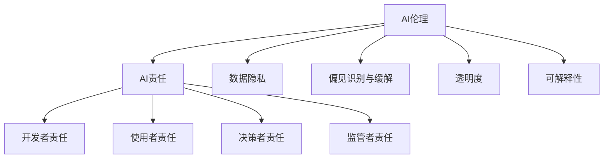

                 

# AI伦理的产业联盟:共建负责任的AI生态

## 1. 背景介绍

### 1.1 问题由来
人工智能（AI）技术的迅猛发展，使得其在各个行业中的应用日益广泛。然而，AI技术的深入应用也引发了一系列伦理问题，包括但不限于数据隐私、偏见与歧视、责任归属、决策透明度等。这些伦理问题不仅影响AI技术的进一步普及，还对社会、经济、伦理等各个层面产生了深远影响。

为了解决这些挑战，促进AI技术的安全、透明和负责任的使用，全球范围内的科技公司、研究机构、政府、非政府组织（NGOs）和企业开始联合起来，形成AI伦理的产业联盟，共同探讨和制定AI伦理标准和最佳实践。

### 1.2 问题核心关键点
AI伦理的产业联盟的核心在于以下几个方面：
- **多方参与**：包括科技公司、学术机构、政府机构、非政府组织等。
- **标准制定**：共同制定AI伦理准则，包括数据隐私、偏见识别和缓解、透明度、责任归属等。
- **最佳实践**：提供可行的技术解决方案和政策指导，帮助企业实现负责任的AI应用。
- **教育培训**：对员工进行AI伦理教育和培训，提升全行业的伦理意识。
- **公众参与**：邀请公众参与讨论和反馈，使AI技术的应用更加符合社会价值观。

### 1.3 问题研究意义
建立AI伦理的产业联盟，有助于：
1. **提升AI技术的可信度**：通过制定严格的标准和最佳实践，提高AI系统的可靠性和透明度，减少公众对AI的恐惧和不信任。
2. **促进社会公平**：通过识别和缓解AI系统中的偏见和歧视，确保技术应用不会加剧社会不平等。
3. **推动法规完善**：通过多方合作，为政府制定相关法规提供科学依据，促进AI领域的法律建设。
4. **实现可持续发展**：确保AI技术的应用不会对环境和社会产生负面影响，支持可持续发展目标。

## 2. 核心概念与联系

### 2.1 核心概念概述

- **AI伦理（AI Ethics）**：涉及AI技术应用中的道德、法律和社会问题，确保技术应用符合人类的价值观和社会规范。
- **AI责任（AI Responsibility）**：指在AI系统中确定各方责任，包括开发者、使用者、决策者和监管者。
- **数据隐私（Data Privacy）**：保护个人数据的隐私和安全，防止未经授权的数据使用。
- **偏见识别与缓解（Bias Identification and Mitigation）**：识别AI系统中的偏见，并采取措施减少或消除这些偏见。
- **透明度（Transparency）**：要求AI系统在决策过程中保持透明，便于用户理解和信任。
- **可解释性（Explainability）**：确保AI系统的决策过程和结果可以被解释和理解，避免“黑盒”问题。

这些核心概念通过以下Mermaid流程图进行展示：



这个流程图展示了AI伦理与AI责任、数据隐私、偏见识别与缓解、透明度和可解释性等核心概念之间的联系和互动。

## 3. 核心算法原理 & 具体操作步骤

### 3.1 算法原理概述

AI伦理的产业联盟的核心在于通过多方协作，制定并执行一套全面的AI伦理标准和最佳实践。这些标准和实践应包括数据收集、处理、存储和共享的伦理准则，AI系统开发和部署的透明性和可解释性要求，以及对AI系统偏见和歧视的识别和缓解措施。

### 3.2 算法步骤详解

以下是AI伦理产业联盟的一般操作步骤：

**Step 1: 确定伦理标准**
- 多方合作，包括科技公司、学术界、政府、非政府组织等，共同讨论并制定AI伦理标准。
- 标准应涵盖数据隐私、偏见识别与缓解、透明度和可解释性等方面，确保技术应用的全面性和合理性。

**Step 2: 制定最佳实践**
- 根据伦理标准，制定具体的技术实现方案和操作指南。
- 包括数据处理流程、模型开发流程、决策过程和结果的解释等。
- 最佳实践应提供可操作的、具体的指导，便于企业参考实施。

**Step 3: 教育与培训**
- 对企业员工进行AI伦理教育，提升全行业的伦理意识。
- 通过线上和线下培训、研讨会等方式，普及AI伦理知识。
- 确保员工了解并遵守AI伦理标准和最佳实践。

**Step 4: 公众参与与反馈**
- 邀请公众参与讨论和反馈，确保AI技术应用符合社会价值观。
- 收集公众意见，调整和完善AI伦理标准和最佳实践。
- 通过公开报告和公众咨询机制，增加透明度和信任度。

**Step 5: 监督与评估**
- 建立独立的监督机构，定期评估企业AI系统的伦理合规情况。
- 对不符合标准的系统进行整改和处罚。
- 定期发布伦理合规报告，向公众透明化评估结果。

### 3.3 算法优缺点

AI伦理的产业联盟的优点包括：
1. **多方合作**：通过多方合作，汇集各方智慧，制定更为全面和合理的AI伦理标准。
2. **标准化和规范化**：统一的伦理标准和最佳实践，有助于提高AI系统的可靠性和透明度。
3. **教育与培训**：提升全行业的伦理意识，减少人为失误和不当使用。
4. **公众参与**：通过公众参与，确保AI技术应用符合社会价值观，增加公众信任。

然而，该方法也存在一些局限：
1. **协调成本高**：多方参与可能增加协调成本，影响效率。
2. **执行难度大**：统一的伦理标准和最佳实践可能难以在所有企业中得到严格执行。
3. **文化差异**：不同国家和地区的文化和价值观可能影响标准和实践的适用性。
4. **动态变化**：AI技术和应用环境不断发展，伦理标准和实践需要不断更新。

### 3.4 算法应用领域

AI伦理的产业联盟不仅适用于科技公司，还可以应用于政府机构、非政府组织、学术机构等多个领域。具体应用领域包括：

- **科技公司**：确保AI系统的开发和应用符合伦理标准，提升用户信任度。
- **政府机构**：制定和执行AI相关的法律法规，促进AI技术的合法合规应用。
- **学术机构**：通过研究和教学，提升全行业的AI伦理意识和知识。
- **非政府组织**：通过公众教育和监督，推动AI技术的社会责任和可持续发展。

## 4. 数学模型和公式 & 详细讲解 & 举例说明

### 4.1 数学模型构建

AI伦理的产业联盟涉及多个方面的伦理问题，可以通过数学模型进行量化和分析。例如，数据隐私问题可以通过量化数据泄露的风险和成本来评估；偏见识别和缓解问题可以通过建立和分析数据集的偏见度量指标来识别；透明度和可解释性问题可以通过模型的可解释性指标来衡量。

### 4.2 公式推导过程

以数据隐私为例，可以通过量化数据泄露的风险和成本来构建数学模型。设$P$为数据泄露的概率，$C$为数据泄露的成本，则数据泄露的总风险$R$可以表示为：

$$
R = P \times C
$$

为了降低风险，可以采取多种措施，如加强数据加密、匿名化处理、访问控制等。这些措施的有效性可以通过模型进行评估和优化。

### 4.3 案例分析与讲解

假设某科技公司需要处理大量用户数据，但数据隐私问题未被充分考虑。公司首先对数据进行匿名化处理，然后评估其对隐私风险的影响。设处理后的数据泄露概率为$P_1$，泄露成本为$C_1$，未处理的数据泄露概率为$P_0$，泄露成本为$C_0$。通过量化处理前后的隐私风险，可以评估匿名化处理的效果，并优化数据保护措施。

## 5. 项目实践：代码实例和详细解释说明

### 5.1 开发环境搭建

在进行AI伦理项目实践前，需要准备好开发环境。以下是使用Python进行开发的环境配置流程：

1. 安装Anaconda：从官网下载并安装Anaconda，用于创建独立的Python环境。

2. 创建并激活虚拟环境：
```bash
conda create -n ai-ethics python=3.8 
conda activate ai-ethics
```

3. 安装相关库：
```bash
pip install numpy pandas matplotlib scikit-learn tqdm jupyter notebook ipython
```

4. 安装数据隐私评估库：
```bash
pip install ffx
```

完成上述步骤后，即可在`ai-ethics`环境中开始项目实践。

### 5.2 源代码详细实现

以下是使用Python进行数据隐私评估的代码实现。

首先，定义数据隐私风险评估函数：

```python
import numpy as np
from ffx import PrivacyRiskAssessment

def calculate_privacy_risk(P, C):
    # 计算数据泄露的总风险
    return P * C
```

然后，使用匿名化处理和访问控制等措施来降低隐私风险：

```python
# 模拟匿名化处理后的数据泄露概率
P_1 = 0.1
# 模拟匿名化处理后的数据泄露成本
C_1 = 1000

# 模拟未处理的数据泄露概率
P_0 = 0.5
# 模拟未处理的数据泄露成本
C_0 = 10000

# 计算匿名化处理前后隐私风险的变化
risk_before = calculate_privacy_risk(P_0, C_0)
risk_after = calculate_privacy_risk(P_1, C_1)

# 输出结果
print("未处理隐私风险：", risk_before)
print("处理后隐私风险：", risk_after)
```

在实际应用中，可以通过具体的数据集和隐私保护措施，进一步优化和评估AI系统的隐私风险。

### 5.3 代码解读与分析

在上述代码中，我们使用了Python的`ffx`库来计算数据泄露的风险。`ffx`库是一个隐私保护工具，提供了数据泄露风险的评估和隐私保护措施的模拟。通过定义隐私风险计算函数，并使用模拟的数据泄露概率和成本，可以计算出处理前后的隐私风险变化。

## 6. 实际应用场景

### 6.1 智能医疗

在智能医疗领域，AI伦理的应用尤为重要。AI系统用于疾病诊断、治疗方案推荐等，直接关系到患者的生命健康。因此，确保AI系统的伦理合规性至关重要。

具体应用包括：
- **数据隐私保护**：确保患者数据的安全和匿名性，防止数据泄露和滥用。
- **偏见识别与缓解**：识别和缓解AI系统中的偏见，确保诊断和治疗方案的公平性。
- **透明度和可解释性**：确保AI系统的决策过程和结果可解释，便于医生和患者理解。

### 6.2 金融风控

金融行业依赖AI系统进行风险评估、欺诈检测等。AI伦理的应用可以确保系统的公正性和透明性，避免数据滥用和偏见。

具体应用包括：
- **数据隐私保护**：保护客户数据的隐私，防止数据泄露和滥用。
- **偏见识别与缓解**：识别和缓解AI系统中的偏见，确保风险评估的公平性。
- **透明度和可解释性**：确保风险评估和欺诈检测的决策过程和结果可解释，便于监管和客户信任。

### 6.3 自动驾驶

自动驾驶技术的应用涉及到复杂的安全问题，AI伦理的应用可以确保系统的可靠性和安全性。

具体应用包括：
- **数据隐私保护**：保护行车数据的隐私，防止数据泄露和滥用。
- **偏见识别与缓解**：识别和缓解AI系统中的偏见，确保驾驶决策的公平性。
- **透明度和可解释性**：确保驾驶决策的决策过程和结果可解释，便于监管和公众信任。

### 6.4 未来应用展望

随着AI技术的不断发展，AI伦理的产业联盟将继续扩展其应用领域和影响力。未来，AI伦理的应用将覆盖更多行业和应用场景，促进AI技术的健康发展和负责任的使用。

## 7. 工具和资源推荐

### 7.1 学习资源推荐

为了帮助开发者系统掌握AI伦理的标准和实践，这里推荐一些优质的学习资源：

1. **AI伦理课程**：如MIT的《AI伦理与决策》课程，介绍了AI伦理的基本概念和原则。

2. **AI伦理书籍**：如《人工智能伦理》（Zachary L. Katz），全面探讨了AI伦理的理论基础和实践应用。

3. **AI伦理网站**：如AI Ethics Consortium网站，提供了大量的AI伦理案例和最佳实践。

4. **AI伦理标准**：如IEEE的《人工智能伦理指南》，提供了AI伦理的标准和指导。

通过对这些资源的学习实践，相信你一定能够快速掌握AI伦理的精髓，并用于解决实际的AI应用问题。

### 7.2 开发工具推荐

高效的开发离不开优秀的工具支持。以下是几款用于AI伦理开发常用的工具：

1. **Jupyter Notebook**：用于数据隐私评估和模型训练，支持Python和R等多种语言。

2. **Privacy Toolkit**：用于数据隐私保护的工具包，支持数据加密、匿名化处理、访问控制等多种措施。

3. **Scikit-learn**：用于机器学习模型的训练和评估，支持多种算法和评估指标。

4. **TensorBoard**：用于可视化模型训练过程和结果的工具，支持实时监控和报告。

5. **Hugging Face Transformers**：用于NLP任务的开发和微调，支持多种预训练模型和任务。

合理利用这些工具，可以显著提升AI伦理项目的开发效率，加快创新迭代的步伐。

### 7.3 相关论文推荐

AI伦理的研究源于学界的持续研究。以下是几篇奠基性的相关论文，推荐阅读：

1. **《AI伦理框架》（The Ethics of AI）**：提出了AI伦理的框架和原则，探讨了AI技术应用中的伦理问题。

2. **《AI伦理：一个综合框架》（AI Ethics: A Comprehensive Framework）**：提供了全面的AI伦理分析方法，包括数据隐私、偏见识别与缓解等方面。

3. **《AI伦理的挑战》（Challenges in AI Ethics）**：探讨了AI伦理的挑战和解决策略，提出了多种AI伦理的解决方案。

这些论文代表了大规模AI伦理的研究方向，通过学习这些前沿成果，可以帮助研究者把握学科前进方向，激发更多的创新灵感。

## 8. 总结：未来发展趋势与挑战

### 8.1 总结

本文对AI伦理的产业联盟进行了全面系统的介绍。首先阐述了AI伦理的重要性和现状，明确了多方协作的必要性。其次，从原理到实践，详细讲解了AI伦理的数学模型和关键步骤，给出了AI伦理项目开发的完整代码实例。同时，本文还广泛探讨了AI伦理在智能医疗、金融风控、自动驾驶等诸多行业领域的应用前景，展示了AI伦理的巨大潜力。最后，本文精选了AI伦理的标准、工具和学习资源，力求为读者提供全方位的技术指引。

通过本文的系统梳理，可以看到，AI伦理的产业联盟为AI技术的安全、透明和负责任的使用提供了重要保障。这些多方合作、标准制定、教育培训、公众参与和监督评估等措施，能够确保AI技术在实际应用中的伦理合规性，为AI技术的健康发展奠定坚实基础。

### 8.2 未来发展趋势

展望未来，AI伦理的产业联盟将呈现以下几个发展趋势：

1. **国际化**：随着全球化进程的加速，AI伦理标准和实践将逐步国际化，促进全球AI技术的协作和共享。

2. **标准化**：AI伦理的标准和实践将逐步标准化，形成国际统一的伦理规范，提升AI技术的全球可接受性。

3. **动态更新**：AI技术不断进步，AI伦理标准和实践将动态更新，适应新的技术环境和应用场景。

4. **技术集成**：AI伦理将与AI技术和应用深度集成，通过技术手段实现伦理目标，提升AI系统的透明性和可解释性。

5. **公众参与**：AI伦理将更多地依赖公众参与，通过透明度和公众监督，确保AI技术应用的公正性和可持续性。

这些趋势凸显了AI伦理的产业联盟的未来发展方向，将为AI技术在全球范围内的普及和应用提供有力保障。

### 8.3 面临的挑战

尽管AI伦理的产业联盟取得了显著进展，但在迈向更加智能化、普适化应用的过程中，仍面临诸多挑战：

1. **多方协作的协调成本**：多方参与可能增加协作成本，影响效率。
2. **标准执行的难度**：统一的伦理标准和实践可能难以在所有企业中得到严格执行。
3. **文化差异的影响**：不同国家和地区的文化和价值观可能影响标准和实践的适用性。
4. **技术动态变化**：AI技术和应用环境不断发展，伦理标准和实践需要不断更新。
5. **资源和成本**：部分企业可能缺乏资源和能力，难以全面实施AI伦理措施。

### 8.4 研究展望

面对AI伦理的产业联盟所面临的挑战，未来的研究需要在以下几个方面寻求新的突破：

1. **自动化工具**：开发自动化工具，帮助企业更便捷地实施AI伦理措施。
2. **国际合作**：加强国际合作，推动全球范围内的AI伦理标准和实践。
3. **公众参与**：通过公众参与和反馈机制，增强AI伦理的透明度和可接受性。
4. **技术创新**：结合AI技术和应用，提升AI系统的透明性和可解释性。
5. **伦理教育**：加强AI伦理教育，提升全行业的伦理意识和能力。

这些研究方向的探索，必将引领AI伦理的产业联盟迈向更高的台阶，为AI技术的健康发展和负责任的使用提供有力保障。面向未来，AI伦理的产业联盟需要持续努力，通过多方合作、标准制定、技术创新和公众参与，推动AI技术的可持续发展。

## 9. 附录：常见问题与解答

**Q1：AI伦理的产业联盟是否适用于所有AI应用？**

A: AI伦理的产业联盟主要适用于涉及复杂决策和数据隐私的应用领域，如医疗、金融、自动驾驶等。对于简单的任务，如文本分类、图像识别等，AI伦理的关注点可能相对较少。

**Q2：如何在AI系统中实现透明性和可解释性？**

A: 实现透明性和可解释性需要从多个方面入手：
1. **模型解释工具**：使用如LIME、SHAP等模型解释工具，生成模型的决策解释。
2. **可解释性模型**：采用可解释性强的模型，如决策树、线性模型等。
3. **文档和日志**：记录和保存模型的训练和推理过程，提供透明的决策依据。

**Q3：如何识别和缓解AI系统中的偏见？**

A: 识别和缓解AI系统中的偏见需要从数据和算法两个方面入手：
1. **数据预处理**：清洗数据，去除偏见样本，增加数据多样性。
2. **算法设计**：选择公平性强的算法，如公平误差最小化、平衡样本等。
3. **模型评估**：评估模型的偏见度量指标，识别和修正偏见。

**Q4：如何保护数据隐私？**

A: 保护数据隐私需要从数据收集、处理、存储和共享的各个环节入手：
1. **数据加密**：采用数据加密技术，保护数据在传输和存储过程中的安全。
2. **匿名化处理**：去除个人身份信息，保护用户隐私。
3. **访问控制**：严格控制数据的访问权限，防止数据泄露。

这些措施可以结合使用，形成全面的数据隐私保护方案。

**Q5：如何确保AI系统的公正性？**

A: 确保AI系统的公正性需要从数据、模型和应用各个环节进行评估和改进：
1. **数据评估**：评估数据集的多样性和代表性，识别和缓解数据偏见。
2. **模型训练**：选择公平性强的模型，避免偏见传递到模型中。
3. **应用评估**：评估AI系统在不同群体中的表现，发现和修正偏见。

通过这些措施，可以确保AI系统在各个环节的公正性和公平性。

---

作者：禅与计算机程序设计艺术 / Zen and the Art of Computer Programming

