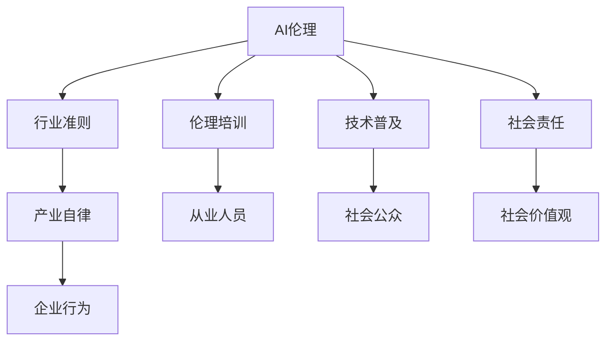

                 

# AI伦理的产业自律:行业准则制定和伦理培训

> 关键词：AI伦理,产业自律,行业准则,伦理培训,技术普及,社会责任

## 1. 背景介绍

### 1.1 问题由来
人工智能（AI）技术的迅猛发展，在为人类生活带来便利的同时，也引发了一系列伦理问题。如AI算法的不透明性、偏见与歧视、数据隐私泄露、算法决策的公平性、安全性等。这些问题不仅影响了技术本身的应用效果，还可能引发严重的社会问题。

如何从技术和社会两个维度对AI伦理进行规范和引导，成为当下急需解决的重要议题。在AI技术产业化和商业化过程中，实现产业自律、规范发展成为共识。

### 1.2 问题核心关键点
AI伦理的产业自律，核心在于制定一系列行业准则，通过规范企业行为、引导技术实践，实现技术创新与社会责任的平衡。其关键点包括：

1. **准则制定**：由行业协会、企业、科研机构等共同参与，制定科学合理、可操作的伦理准则，为AI技术应用提供指导。
2. **伦理培训**：面向开发者、产品经理、工程师等从业人员，提供系统的AI伦理培训，提升其伦理意识和行为标准。
3. **技术普及**：利用教育和宣传，普及AI伦理知识，提高社会公众对AI伦理的认识和关注度。
4. **社会责任**：鼓励企业履行社会责任，关注AI技术的社会影响，确保技术应用符合社会价值观。

本文将系统阐述AI伦理的产业自律框架，详细讲解行业准则制定和伦理培训的具体方法，并探讨其实际应用场景和未来发展趋势。

## 2. 核心概念与联系

### 2.1 核心概念概述

为更好地理解AI伦理的产业自律，需先了解几个核心概念：

1. **AI伦理**：涉及技术使用过程中的道德、法律和社会责任问题。AI伦理旨在确保技术发展与人类的道德价值和利益相符。
2. **产业自律**：指企业在遵循法律法规的基础上，自主制定并遵守的行业行为规范，以促进健康有序的发展。
3. **行业准则**：由行业协会等机构制定的，指导AI技术开发与应用的标准和规则。
4. **伦理培训**：面向从业人员，通过课程、讲座、工作坊等方式，提升其伦理意识和行为标准。
5. **技术普及**：通过教育、媒体宣传等方式，让社会公众了解AI技术及其伦理问题，提高全社会的伦理意识。
6. **社会责任**：企业需关注AI技术对社会的长期影响，主动承担社会责任，确保技术应用符合社会价值观。

这些概念之间的联系可以通过以下Mermaid流程图来展示：



该流程图展示了各概念之间的相互关系：

1. AI伦理是指导准则制定的核心，行业准则、伦理培训、技术普及和社会责任都是实现AI伦理的具体手段。
2. 行业准则是产业自律的基础，确保企业行为规范。
3. 伦理培训提升从业人员的伦理意识，确保技术开发与应用符合伦理准则。
4. 技术普及让社会公众了解AI伦理，提高全社会的伦理意识。
5. 社会责任促进企业自觉遵守行业准则，关注社会影响。

这些概念共同构成了AI伦理的产业自律框架，为AI技术的健康发展提供了保障。

## 3. 核心算法原理 & 具体操作步骤

### 3.1 算法原理概述

AI伦理的产业自律，其核心在于通过制定和执行行业准则，确保AI技术的开发与应用符合伦理标准。行业准则的制定基于AI伦理原则，具体包括以下几个方面：

1. **数据伦理**：确保数据收集、使用和共享符合法律规定，保护个人隐私和数据安全。
2. **算法透明性**：提升算法决策过程的透明性，确保算法的可解释性。
3. **偏见与歧视**：避免算法偏见和歧视，确保算法的公平性。
4. **安全性与责任**：确保AI系统的安全性，明确算法决策的责任归属。
5. **用户知情权**：确保用户对其数据和算法的处理知情并同意。

### 3.2 算法步骤详解

制定和执行AI伦理的行业准则，主要包括以下几个步骤：

1. **组建工作组**：由企业、科研机构、行业协会等共同组建工作组，负责行业准则的制定与修订。
2. **调研与分析**：收集相关法律法规、国际标准、行业最佳实践等资料，进行系统调研和分析。
3. **起草准则**：在工作组的基础上，根据调研结果，起草初步的行业准则草案。
4. **征求意见**：通过行业会议、征求意见稿等方式，广泛征求利益相关方的意见和建议。
5. **审议与修订**：工作组对征集到的意见进行审议，必要时进行修改，形成最终准则。
6. **推广与实施**：通过发布、宣传、培训等方式，推广准则，确保企业遵守并实施。

### 3.3 算法优缺点

AI伦理的行业准则制定具有以下优点：

1. **规范化**：制定统一的行业准则，规范企业行为，避免伦理风险。
2. **透明度**：通过透明的准则制定过程，提升行业整体的透明度和可信度。
3. **引导性**：为AI技术的开发和应用提供指导，引导技术创新与社会责任的平衡。

但其也存在一些缺点：

1. **执行难度**：准则是指导性文件，难以严格执行，需依赖企业的自觉性。
2. **更新滞后**：准则更新需经过严格审议，可能无法快速响应新出现的伦理问题。
3. **地域差异**：不同国家和地区的法律法规、文化背景不同，准则的推广和执行可能存在差异。

### 3.4 算法应用领域

AI伦理的行业准则已应用于多个领域，如医疗、金融、司法等，主要包括以下方面：

1. **医疗**：确保医疗AI系统的数据隐私保护、算法透明性和决策公平性。
2. **金融**：规范金融AI系统的数据使用、算法透明性和用户隐私保护。
3. **司法**：明确司法AI系统的算法责任、决策透明性和公平性。
4. **教育**：制定教育AI系统的数据保护、算法透明性和教育公平性准则。
5. **城市治理**：确保智能城市AI系统的数据隐私、算法透明性和公共安全。

## 4. 数学模型和公式 & 详细讲解 & 举例说明

### 4.1 数学模型构建

行业准则的制定可看作是一个复杂的系统工程，涉及多方的利益协调和规范设计。其数学模型可构建如下：

1. **目标函数**：行业准则制定的目标函数为最大化社会整体利益，最小化伦理风险。
2. **约束条件**：包括法律法规、国际标准、行业最佳实践等，确保准则的合法合规性。

### 4.2 公式推导过程

以医疗AI系统的数据伦理准则为例，其推导过程如下：

1. **隐私保护**：确保数据收集、使用和共享符合GDPR等法律法规。
   $$
   \min_{\text{隐私}} \text{隐私风险} = P(\text{数据泄露}) + P(\text{数据滥用})
   $$
2. **数据共享**：明确数据共享的范围和条件，确保数据安全。
   $$
   \min_{\text{共享}} \text{共享风险} = P(\text{数据泄露}) + P(\text{数据滥用})
   $$

### 4.3 案例分析与讲解

以医疗AI系统的数据伦理准则为例，分析其制定过程：

1. **调研与分析**：收集相关法律法规、国际标准、医疗行业最佳实践等资料，进行系统调研和分析。
2. **数据隐私保护**：根据GDPR等法律法规，确保数据收集、使用和共享符合隐私保护要求。
3. **数据安全**：通过加密、匿名化等技术手段，确保数据的安全性，防止数据泄露和滥用。
4. **公平性**：确保算法在各类人群中的公平性，避免数据偏见和算法歧视。

## 5. 项目实践：代码实例和详细解释说明

### 5.1 开发环境搭建

1. **安装Python**：从官网下载并安装Python 3.x版本。
2. **安装Jupyter Notebook**：使用pip安装Jupyter Notebook，作为代码编写和交互平台。
3. **安装相关库**：安装TensorFlow、Pandas、Numpy等数据处理和机器学习库。

### 5.2 源代码详细实现

以下以医疗AI系统的数据隐私保护为例，实现数据隐私保护的代码：

```python
import pandas as pd
from sklearn.model_selection import train_test_split

# 加载数据
data = pd.read_csv('hospital_data.csv')

# 数据清洗和预处理
data = data.dropna()  # 删除缺失值
data = data.drop_duplicates()  # 删除重复值

# 特征工程
X = data.drop(['Patient_ID', 'Medical_ID'], axis=1)  # 特征矩阵
y = data['Disease']  # 目标变量

# 数据集划分
X_train, X_test, y_train, y_test = train_test_split(X, y, test_size=0.2, random_state=42)

# 训练模型
model = XGBoost()  # 使用XGBoost作为分类器
model.fit(X_train, y_train)

# 数据隐私保护
def data_privacy_protection(X):
    return X.applymap(lambda x: anonymize(x))

def anonymize(x):
    # 匿名化处理
    if x == 'Patient_ID' or x == 'Medical_ID':
        return 'Anonymized'
    else:
        return x

X_train = data_privacy_protection(X_train)
X_test = data_privacy_protection(X_test)
```

### 5.3 代码解读与分析

上述代码实现了医疗AI系统的数据隐私保护，具体步骤如下：

1. **数据加载与预处理**：加载数据集，并进行清洗和预处理，去除缺失值和重复值。
2. **特征工程**：将数据集划分为特征矩阵和目标变量。
3. **模型训练**：使用XGBoost作为分类器，训练模型。
4. **数据隐私保护**：定义匿名化处理函数，对敏感信息进行匿名化处理，确保数据隐私。

## 6. 实际应用场景

### 6.1 智能医疗

在智能医疗领域，AI伦理的行业准则主要应用于以下场景：

1. **诊断辅助**：确保AI诊断系统的算法透明性和数据隐私保护，避免误诊和漏诊。
2. **治疗方案**：规范AI推荐治疗方案的算法公平性和决策透明性，确保方案的合理性。
3. **健康管理**：保护患者数据隐私，确保AI系统的安全性和可靠性。

### 6.2 金融风控

在金融风控领域，AI伦理的行业准则主要应用于以下场景：

1. **信用评分**：确保AI信用评分系统的算法透明性和数据公平性，避免歧视。
2. **欺诈检测**：规范AI欺诈检测系统的算法透明性和数据隐私保护，确保检测准确性。
3. **风险评估**：明确AI风险评估系统的算法责任和决策透明性，确保评估公正性。

### 6.3 司法判决

在司法判决领域，AI伦理的行业准则主要应用于以下场景：

1. **案件分析**：确保AI案件分析系统的算法透明性和数据隐私保护，避免误判。
2. **量刑建议**：规范AI量刑建议系统的算法公平性和决策透明性，确保建议的合理性。
3. **法律咨询**：明确AI法律咨询系统的算法责任和数据保护，确保咨询的合法合规性。

## 7. 工具和资源推荐

### 7.1 学习资源推荐

1. **《AI伦理指南》**：由全球知名的AI伦理研究机构编写，涵盖AI伦理的多个方面，适合入门学习。
2. **Coursera《AI伦理》课程**：斯坦福大学教授讲授，系统介绍AI伦理的基本概念和应用案例。
3. **《AI伦理与法律》一书**：涵盖AI伦理的法律法规、社会责任等方面，适合深入学习。
4. **IEEE《AI伦理标准》**：IEEE发布的AI伦理标准，包括数据隐私、算法透明性等多个方面，适合参考。

### 7.2 开发工具推荐

1. **Jupyter Notebook**：适合编写和交互AI伦理相关的代码，支持多种编程语言。
2. **GitHub**：提供代码托管和版本控制，适合协作开发和代码分享。
3. **Jupytext**：将Jupyter Notebook代码导出为Markdown和文本格式，方便文档管理和代码共享。

### 7.3 相关论文推荐

1. **《AI伦理：挑战与机遇》**：介绍AI伦理的挑战和应对措施，适合研究者参考。
2. **《AI伦理准则制定的探索》**：探讨AI伦理准则的制定方法，适合从业人员参考。
3. **《AI伦理与社会责任》**：讨论AI伦理与社会责任的关系，适合社会公众关注。

## 8. 总结：未来发展趋势与挑战

### 8.1 研究成果总结

本文系统阐述了AI伦理的产业自律框架，详细讲解了行业准则制定和伦理培训的具体方法，并探讨了其实际应用场景和未来发展趋势。主要研究成果包括：

1. **行业准则制定的系统框架**：涵盖数据伦理、算法透明性、偏见与歧视、安全性与责任、用户知情权等多个方面。
2. **伦理培训的实施方法**：面向从业人员，提供系统的AI伦理培训，提升其伦理意识和行为标准。
3. **技术普及的推广手段**：通过教育和宣传，普及AI伦理知识，提高全社会的伦理意识。
4. **社会责任的履行路径**：鼓励企业履行社会责任，关注AI技术的社会影响，确保技术应用符合社会价值观。

### 8.2 未来发展趋势

未来，AI伦理的产业自律将呈现以下几个发展趋势：

1. **全球化**：随着AI技术的全球化应用，AI伦理准则的制定和执行也将趋于全球化，确保技术应用的普适性和公正性。
2. **标准化**：国际标准化组织将进一步制定和完善AI伦理标准，为全球AI技术应用提供统一的指导。
3. **数据治理**：加强数据隐私保护和数据治理，确保数据安全性和伦理性。
4. **算法透明性**：提升算法透明性和可解释性，确保算法的公正性和可信度。
5. **伦理培训普及**：通过教育和技术普及，提升全社会的AI伦理意识，培养更多的伦理AI从业者。

### 8.3 面临的挑战

尽管AI伦理的产业自律取得了一定进展，但仍面临诸多挑战：

1. **法规差异**：不同国家和地区的法律法规、文化背景不同，AI伦理准则的推广和执行可能存在差异。
2. **技术复杂性**：AI技术的复杂性和多样性使得AI伦理准则的制定和执行难度增加。
3. **伦理争议**：AI伦理准则的制定和执行过程中，难免会遇到伦理争议，需多方协调和妥协。

### 8.4 研究展望

未来的研究需要在以下几个方面寻求新的突破：

1. **全球合作**：推动全球范围内的AI伦理研究与合作，制定统一的行业准则和标准。
2. **技术创新**：通过技术创新，提升算法的透明性和可解释性，解决伦理争议。
3. **公众参与**：加强公众对AI伦理的参与和监督，提高全社会的伦理意识。
4. **政策支持**：政府需制定和完善AI伦理法规，为AI技术应用提供法律保障。

这些研究方向的探索，必将引领AI伦理的产业自律走向更高的台阶，为AI技术的健康发展提供保障。相信通过多方协同努力，AI伦理的产业自律将实现更好发展，为构建人机协同的智能社会贡献力量。

## 9. 附录：常见问题与解答

### Q1: 什么是AI伦理的产业自律？

A: AI伦理的产业自律是指企业在遵循法律法规的基础上，自主制定并遵守的行业行为规范，以促进AI技术的健康有序发展。

### Q2: AI伦理的行业准则如何制定？

A: AI伦理的行业准则制定主要包括以下步骤：组建工作组、调研与分析、起草准则、征求意见、审议与修订、推广与实施。

### Q3: 如何提升AI系统的算法透明性？

A: 提升AI系统的算法透明性，主要通过以下方法：引入可解释性模型、提供模型解释接口、增加模型可解释性注释等。

### Q4: 什么是AI伦理培训？

A: AI伦理培训是面向从业人员，通过课程、讲座、工作坊等方式，提升其伦理意识和行为标准的系统教育。

### Q5: AI伦理准则的全球化推广有哪些挑战？

A: AI伦理准则的全球化推广面临法规差异、技术复杂性、伦理争议等挑战，需要多方协同努力，推动全球合作和政策支持。

---

作者：禅与计算机程序设计艺术 / Zen and the Art of Computer Programming

