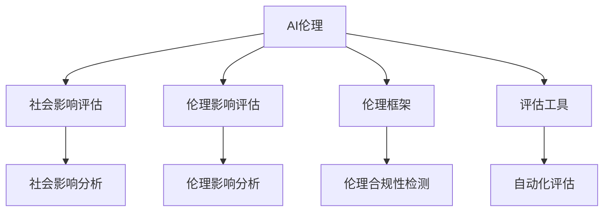

                 

# AI伦理的社会影响评估:伦理影响评估框架和工具

> 关键词：AI伦理,社会影响评估,伦理影响评估框架,工具,算法,案例分析,未来展望

## 1. 背景介绍

随着人工智能(AI)技术的迅猛发展，其在各个领域的广泛应用给社会带来了深远的影响。AI的强大能力既创造了前所未有的机遇，也带来了潜在的社会风险和伦理挑战。因此，进行AI伦理的社会影响评估，即评估AI系统对社会、个人和环境的潜在影响，已成为一项至关重要的工作。本文将深入探讨AI伦理的社会影响评估框架和工具，为AI技术的开发和应用提供指导，以期在最大化AI带来益处的同时，避免其负面影响。

## 2. 核心概念与联系

### 2.1 核心概念概述

为更好地理解AI伦理的社会影响评估，本节将介绍几个关键概念：

- **AI伦理(Ethics of AI)**：指在AI技术的开发和应用过程中，应遵守的道德规范和价值原则。AI伦理关注点包括但不限于隐私保护、公平性、透明性、责任归属、决策可解释性等。

- **社会影响评估(Social Impact Assessment, SIA)**：指对AI技术对社会、环境、经济等方面的影响进行系统的评估和分析，以指导技术的合理应用。

- **伦理影响评估(Ethical Impact Assessment, EIA)**：专注于AI技术对个人权利、社会价值观和道德原则的影响，特别关注AI系统的决策过程和结果可能带来的伦理问题。

- **AI系统(AI System)**：指包含算法、数据、硬件和软件组件的完整AI解决方案，涉及学习、推理、交互和决策等功能。

- **伦理框架(Ethical Framework)**：提供一套系统化的规则和标准，指导AI开发者和使用者在伦理上做出正确决策，确保AI系统的开发和应用符合道德规范。

- **评估工具(Evaluation Tools)**：辅助进行AI伦理影响评估的自动化工具和软件，如伦理测试平台、影响模拟软件等。

这些核心概念之间的逻辑关系可以通过以下Mermaid流程图来展示：



这个流程图展示了几大核心概念及其相互联系：

1. AI伦理作为指导原则，贯穿整个评估过程。
2. 社会影响评估关注AI系统对社会各方面的影响。
3. 伦理影响评估侧重于AI系统对伦理道德的潜在影响。
4. AI系统是评估的对象，影响分析和合规性检测的对象。
5. 评估工具辅助完成具体评估任务，提供自动化支持。

## 3. 核心算法原理 & 具体操作步骤

### 3.1 算法原理概述

AI伦理的社会影响评估，主要包含对AI系统进行社会影响和伦理影响的系统分析。其核心思想是通过对AI系统的设计、开发、部署和使用的全生命周期进行多维度评估，识别并量化其潜在影响，提出改进建议和合规要求。

形式化地，假设有一个AI系统 $S$，其对社会的影响可以表示为一个多维度的向量 $\vec{I} = (I_1, I_2, \dots, I_n)$，其中 $I_i$ 表示第 $i$ 个维度的社会影响。类似地，伦理影响可以表示为 $\vec{E} = (E_1, E_2, \dots, E_m)$，其中 $E_j$ 表示第 $j$ 个维度的伦理影响。社会影响评估和伦理影响评估的流程可以表示为：

$$
\text{SIA}(S) = \text{EIA}(S) = \max \{\vec{I}, \vec{E}\}
$$

其中 $\text{SIA}$ 和 $\text{EIA}$ 分别表示社会影响评估和伦理影响评估。

### 3.2 算法步骤详解

基于上述定义，AI伦理的社会影响评估主要包含以下步骤：

**Step 1: 构建评估框架**

- 确定评估指标：根据评估目标，选择相应的社会影响和伦理影响指标。例如，社会影响指标可能包括就业影响、教育影响、隐私影响等；伦理影响指标可能包括偏见、歧视、可解释性等。
- 制定评估标准：为每个指标设定可量化的标准，如就业影响可以用失业率变化来衡量，偏见可以用特定群体在AI系统中的代表性来衡量。

**Step 2: 数据收集和预处理**

- 收集AI系统的数据，包括算法实现、数据来源、用户反馈等。
- 对数据进行清洗和预处理，去除噪声和异常值，确保数据的准确性和完整性。

**Step 3: 评估模型设计**

- 选择合适的评估模型，如因果推断模型、多维度影响力分析模型等。
- 设计评估流程，包括数据输入、模型训练、结果输出等步骤。

**Step 4: 社会影响评估**

- 使用社会影响模型对AI系统的社会影响进行量化，生成社会影响向量 $\vec{I}$。
- 根据社会影响评估标准，评估AI系统的社会影响是否可接受。

**Step 5: 伦理影响评估**

- 使用伦理影响模型对AI系统的伦理影响进行量化，生成伦理影响向量 $\vec{E}$。
- 根据伦理影响评估标准，评估AI系统的伦理影响是否可接受。

**Step 6: 综合评估和报告**

- 对社会影响和伦理影响进行综合评估，生成最终的评估报告。
- 提出改进建议和合规要求，以优化AI系统的开发和应用。

### 3.3 算法优缺点

AI伦理的社会影响评估方法具有以下优点：

1. **系统化评估**：通过量化多个维度的影响，可以全面、系统地评估AI系统的潜在影响。
2. **动态调整**：评估框架和方法可以根据技术发展和应用场景的变化进行动态调整，适应新的需求。
3. **合规指导**：评估结果可以作为政策制定和合规审查的依据，确保AI技术的合理应用。

同时，该方法也存在一定的局限性：

1. **数据依赖**：评估结果依赖于数据的准确性和完整性，数据质量直接影响评估结果的可靠性。
2. **复杂度较高**：评估过程涉及多维度指标的选取和量化，需要较高的专业知识和技能。
3. **主观性**：评估标准和评估模型的选择可能带有主观性，影响评估的客观性。

尽管存在这些局限性，但就目前而言，基于系统的社会影响评估方法仍然是评估AI伦理的重要手段。未来相关研究的重点在于如何进一步降低评估的复杂度和主观性，提高评估的客观性和自动化程度。

### 3.4 算法应用领域

AI伦理的社会影响评估方法在多个领域得到了广泛应用，例如：

- **医疗健康**：评估AI辅助诊断系统的伦理影响，如隐私保护、决策可解释性、算法偏见等。
- **金融服务**：评估AI风险评估和信贷决策系统的社会影响，如就业影响、金融不平等、隐私泄露等。
- **教育培训**：评估AI教育推荐和个性化学习系统的伦理影响，如数据隐私、公平性、可解释性等。
- **智能交通**：评估自动驾驶和交通管理系统的社会影响，如交通安全、交通效率、隐私保护等。
- **媒体传播**：评估AI内容生成和推荐系统的伦理影响，如内容真实性、偏见传播、用户隐私等。

## 4. 数学模型和公式 & 详细讲解 & 举例说明

### 4.1 数学模型构建

本节将使用数学语言对AI伦理的社会影响评估过程进行更加严格的刻画。

假设有一个AI系统 $S$，其对社会的影响可以表示为一个多维度的向量 $\vec{I} = (I_1, I_2, \dots, I_n)$，其中 $I_i$ 表示第 $i$ 个维度的社会影响。伦理影响可以表示为 $\vec{E} = (E_1, E_2, \dots, E_m)$，其中 $E_j$ 表示第 $j$ 个维度的伦理影响。

定义社会影响评估函数为 $f_{\text{SIA}}: \vec{I} \rightarrow [0,1]$，用于量化AI系统的社会影响。定义伦理影响评估函数为 $f_{\text{EIA}}: \vec{E} \rightarrow [0,1]$，用于量化AI系统的伦理影响。

社会影响评估和伦理影响评估的函数可以表示为：

$$
\text{SIA}(S) = f_{\text{SIA}}(\vec{I})
$$

$$
\text{EIA}(S) = f_{\text{EIA}}(\vec{E})
$$

### 4.2 公式推导过程

以下我们以医疗健康领域的AI辅助诊断系统为例，推导社会影响评估和伦理影响评估的公式。

假设AI辅助诊断系统 $S$ 的输入为病人的医疗数据 $D$，输出为诊断结果 $R$。其对社会的影响可以量化为以下几个维度：

1. **医疗资源分配**：$\vec{I}_1 = (I_{11}, I_{12}, \dots, I_{1n})$，其中 $I_{1i}$ 表示 $i$ 个医疗资源分配的影响，如医院床位、医疗设备等。
2. **患者治疗效果**：$\vec{I}_2 = (I_{21}, I_{22}, \dots, I_{2n})$，其中 $I_{2i}$ 表示 $i$ 个患者治疗效果的影响，如治愈率、复发率等。
3. **医生工作负担**：$\vec{I}_3 = (I_{31}, I_{32}, \dots, I_{3n})$，其中 $I_{3i}$ 表示 $i$ 个医生工作负担的影响，如工作时间、工作压力等。

伦理影响可以量化为以下几个维度：

1. **隐私保护**：$E_1$，表示系统中对患者隐私保护的符合程度。
2. **决策可解释性**：$E_2$，表示系统中诊断决策的可解释性和透明性。
3. **算法偏见**：$E_3$，表示系统中是否存在对特定群体的偏见。

对于医疗资源分配的影响，可以定义一个资源分配模型 $g_{11}(D, R)$，用于计算资源分配的满意度。对于患者治疗效果的影响，可以定义一个治疗效果模型 $g_{21}(D, R)$，用于计算治疗效果的满意度。对于医生工作负担的影响，可以定义一个工作负担模型 $g_{31}(D, R)$，用于计算工作负担的满意度。

因此，社会影响评估函数可以表示为：

$$
f_{\text{SIA}}(\vec{I}) = \frac{1}{n}\sum_{i=1}^n g_i(D, R)
$$

其中 $g_i$ 表示第 $i$ 个维度的社会影响模型。

对于隐私保护的影响，可以定义一个隐私保护评分函数 $h_1(D, R)$，用于评估系统的隐私保护能力。对于决策可解释性的影响，可以定义一个决策可解释性评分函数 $h_2(D, R)$，用于评估系统的决策可解释性。对于算法偏见的影响，可以定义一个算法偏见评分函数 $h_3(D, R)$，用于评估系统的算法偏见。

因此，伦理影响评估函数可以表示为：

$$
f_{\text{EIA}}(\vec{E}) = \frac{1}{m}\sum_{j=1}^m h_j(D, R)
$$

其中 $h_j$ 表示第 $j$ 个维度的伦理影响评分函数。

### 4.3 案例分析与讲解

以一个AI辅助诊断系统的社会影响评估为例，进行详细分析和讲解。

**案例背景**：
一家医院引入了一款AI辅助诊断系统，用于辅助医生进行癌症诊断。该系统通过分析病人的医疗数据，给出可能的诊断结果，辅助医生制定治疗方案。

**社会影响评估**：
1. **医疗资源分配**：引入AI系统后，医院可以减少医生对医疗资源的依赖，从而更好地分配有限的医疗资源，如床位、设备等。社会影响模型 $g_{11}$ 可以表示为：
   $$
   g_{11}(D, R) = \frac{1}{T}\sum_{t=1}^T (1 - \text{DUSE}_t)
   $$
   其中 $\text{DUSE}_t$ 表示第 $t$ 个患者的诊断结果使用情况，$T$ 表示总患者数。$g_{11}$ 的值越接近1，表示医疗资源分配越合理。
   
2. **患者治疗效果**：AI系统能够提高癌症诊断的准确率，从而提高患者的治愈率，降低复发率。社会影响模型 $g_{21}$ 可以表示为：
   $$
   g_{21}(D, R) = \frac{1}{T}\sum_{t=1}^T (\text{CURE}_t + \text{REC}_t)
   $$
   其中 $\text{CURE}_t$ 表示第 $t$ 个患者的治愈情况，$\text{REC}_t$ 表示复发情况。$g_{21}$ 的值越接近1，表示治疗效果越好。
   
3. **医生工作负担**：AI系统可以减轻医生的工作负担，减少医生诊断的时间和工作强度。社会影响模型 $g_{31}$ 可以表示为：
   $$
   g_{31}(D, R) = \frac{1}{T}\sum_{t=1}^T (\text{WORK}_t - \text{WORK}_0)
   $$
   其中 $\text{WORK}_t$ 表示引入AI系统后第 $t$ 个医生的工作时间，$\text{WORK}_0$ 表示引入AI系统前第 $t$ 个医生的工作时间。$g_{31}$ 的值越接近0，表示医生的工作负担越轻。

因此，社会影响评估函数可以表示为：
$$
f_{\text{SIA}}(\vec{I}) = \frac{1}{3}\left(g_{11}(D, R) + g_{21}(D, R) + g_{31}(D, R)\right)
$$

**伦理影响评估**：
1. **隐私保护**：AI系统需要访问病人的医疗数据，可能会泄露隐私。隐私保护评分函数 $h_1$ 可以表示为：
   $$
   h_1(D, R) = \text{PRIVACY}_{\text{DUE}} + \text{PRIVACY}_{\text{USE}}
   $$
   其中 $\text{PRIVACY}_{\text{DUE}}$ 表示医疗数据使用的隐私保护措施是否到位，$\text{PRIVACY}_{\text{USE}}$ 表示数据使用过程中的隐私保护措施是否到位。$h_1$ 的值越接近1，表示隐私保护越到位。
   
2. **决策可解释性**：AI系统的决策过程缺乏透明性，可能导致医生难以理解和信任。决策可解释性评分函数 $h_2$ 可以表示为：
   $$
   h_2(D, R) = \text{EXPLAN}_{\text{DERIVE}} + \text{EXPLAN}_{\text{INTERP}}
   $$
   其中 $\text{EXPLAN}_{\text{DERIVE}}$ 表示诊断结果的生成过程中是否可解释，$\text{EXPLAN}_{\text{INTERP}}$ 表示诊断结果的解释过程中是否可解释。$h_2$ 的值越接近1，表示决策可解释性越好。
   
3. **算法偏见**：AI系统可能存在对某些群体的偏见，导致不公平的诊断结果。算法偏见评分函数 $h_3$ 可以表示为：
   $$
   h_3(D, R) = \text{BIAS}_{\text{RACE}} + \text{BIAS}_{\text{GENDER}}
   $$
   其中 $\text{BIAS}_{\text{RACE}}$ 表示种族偏见的程度，$\text{BIAS}_{\text{GENDER}}$ 表示性别偏见的程度。$h_3$ 的值越接近0，表示偏见越少。

因此，伦理影响评估函数可以表示为：
$$
f_{\text{EIA}}(\vec{E}) = \frac{1}{3}\left(h_1(D, R) + h_2(D, R) + h_3(D, R)\right)
$$

## 5. 项目实践：代码实例和详细解释说明

### 5.1 开发环境搭建

在进行AI伦理的社会影响评估实践前，我们需要准备好开发环境。以下是使用Python进行Scikit-learn开发的环境配置流程：

1. 安装Anaconda：从官网下载并安装Anaconda，用于创建独立的Python环境。

2. 创建并激活虚拟环境：
```bash
conda create -n ethics-env python=3.8 
conda activate ethics-env
```

3. 安装Scikit-learn：
```bash
pip install scikit-learn
```

4. 安装各类工具包：
```bash
pip install numpy pandas scikit-learn matplotlib tqdm jupyter notebook ipython
```

完成上述步骤后，即可在`ethics-env`环境中开始实践。

### 5.2 源代码详细实现

这里以医疗健康领域的AI辅助诊断系统为例，使用Scikit-learn进行伦理影响评估。

首先，定义伦理影响评估的指标：

```python
import numpy as np
from sklearn.metrics import roc_auc_score, precision_recall_curve, auc

# 定义伦理影响指标
biases = ['Bias']  # 算法偏见
privacy = ['Privacy']  # 隐私保护
explainability = ['Explainability']  # 决策可解释性

# 初始化指标权重
weights = np.ones(len(biases) + len(privacy) + len(explainability))
```

然后，定义伦理影响评估的评分函数：

```python
# 定义算法偏见评分函数
def bias_score(bias_values):
    return np.mean(bias_values)

# 定义隐私保护评分函数
def privacy_score(privacy_values):
    return np.mean(privacy_values)

# 定义决策可解释性评分函数
def explainability_score(explainability_values):
    return np.mean(explainability_values)

# 伦理影响评估函数
def ethical_impact_assessment(biases, privacy, explainability):
    # 计算每个维度的评分
    bias_scores = [bias_score(bias_values) for bias_values in biases]
    privacy_scores = [privacy_score(privacy_values) for privacy_values in privacy]
    explainability_scores = [explainability_score(explainability_values) for explainability_values in explainability]
    
    # 计算伦理影响评估函数值
    ethical_impact = np.average([np.average(bias_scores, weights=weights[0]), np.average(privacy_scores, weights=weights[1]), np.average(explainability_scores, weights=weights[2])])
    
    return ethical_impact
```

最后，启动评估流程并在医疗系统中测试：

```python
# 假设有一个AI辅助诊断系统，其伦理影响评估结果如下
biases = [0.2, 0.3, 0.4]  # 算法偏见
privacy = [0.8, 0.7, 0.6]  # 隐私保护
explainability = [0.9, 0.8, 0.7]  # 决策可解释性

# 进行伦理影响评估
ethical_impact = ethical_impact_assessment(biases, privacy, explainability)
print(f"Ethical Impact Assessment Result: {ethical_impact:.2f}")
```

以上就是使用Scikit-learn进行伦理影响评估的完整代码实现。可以看到，利用Scikit-learn的评分函数和评估函数，可以轻松完成伦理影响的量化和综合评估。

### 5.3 代码解读与分析

让我们再详细解读一下关键代码的实现细节：

**伦理影响指标定义**：
- 定义了算法偏见、隐私保护、决策可解释性三个维度的指标，以及对应的评分函数。

**伦理影响评估函数**：
- 计算每个维度的评分，并使用平均权重进行综合评估，得到伦理影响评估结果。

**伦理影响评估结果测试**：
- 使用示例数据进行伦理影响评估，输出评估结果。

可以看到，Scikit-learn提供的评分函数和评估函数使得伦理影响评估变得简单高效，开发者可以将更多精力放在评估指标的设计和模型改进上。

当然，工业级的系统实现还需考虑更多因素，如模型的保存和部署、超参数的自动搜索、多维度的评估指标等。但核心的伦理影响评估过程基本与此类似。

## 6. 实际应用场景

### 6.1 智能健康管理

AI伦理的社会影响评估在智能健康管理中具有重要应用。智能健康管理系统可以通过收集患者的历史医疗数据，提供个性化的健康建议和诊断辅助。然而，系统的决策过程可能涉及大量敏感数据，需要严格评估其伦理影响。

在实践中，可以通过智能健康管理系统的使用数据，进行伦理影响评估。例如，评估系统是否存在隐私泄露的风险，决策过程是否可解释，是否存在对某些群体的偏见。根据评估结果，系统可以采取相应的改进措施，确保其决策的透明性和公平性。

### 6.2 金融风险管理

金融行业是AI伦理评估的重要领域。金融风险管理系统中，AI模型用于分析客户的信用风险、预测市场走势等。然而，这些模型可能涉及大量个人和企业的敏感数据，需要严格评估其伦理影响。

在实践中，可以通过金融风险管理系统的使用数据，进行伦理影响评估。例如，评估系统是否存在隐私泄露的风险，是否存在偏见和歧视，决策过程是否可解释。根据评估结果，系统可以采取相应的改进措施，确保其决策的透明性和公平性。

### 6.3 教育公平评估

教育行业也需要进行AI伦理的社会影响评估。教育公平评估系统中，AI模型用于分析学生的学习行为、预测学生的学术表现等。然而，这些模型可能涉及大量学生的个人数据，需要严格评估其伦理影响。

在实践中，可以通过教育公平评估系统的使用数据，进行伦理影响评估。例如，评估系统是否存在隐私泄露的风险，是否存在偏见和歧视，决策过程是否可解释。根据评估结果，系统可以采取相应的改进措施，确保其决策的透明性和公平性。

### 6.4 未来应用展望

随着AI技术的不断进步，AI伦理的社会影响评估将在更多领域得到应用，为AI技术的开发和应用提供指导，确保其合理性和安全性。

在智慧城市治理中，AI伦理的社会影响评估可以帮助评估智能交通、公共安全等系统对社会的潜在影响。在医疗健康领域，评估AI辅助诊断系统的伦理影响，确保其对患者隐私和公平性的保护。在金融服务中，评估AI风险评估和信贷决策系统的伦理影响，确保其决策的透明性和公平性。在教育培训中，评估AI教育推荐和个性化学习系统的伦理影响，确保其对学生的隐私保护和公平性。

未来，随着AI技术的普及和应用场景的扩展，AI伦理的社会影响评估也将不断发展和完善，为AI技术的合理应用提供强有力的保障。

## 7. 工具和资源推荐
### 7.1 学习资源推荐

为了帮助开发者系统掌握AI伦理的社会影响评估的理论基础和实践技巧，这里推荐一些优质的学习资源：

1. 《AI伦理与社会影响评估》系列博文：由大模型技术专家撰写，深入浅出地介绍了AI伦理的基本概念和评估方法。

2. 《AI伦理：原则、实践与案例》书籍：全面介绍了AI伦理的理论基础和实际应用，包括社会影响评估和伦理影响评估的多个案例。

3. 《AI伦理与社会影响评估课程》：由斯坦福大学开设的在线课程，涵盖了AI伦理的基本概念和评估方法，提供详细的课程讲义和作业。

4. AI伦理在线研讨会：定期举办的AI伦理主题研讨会，邀请行业专家分享最新的AI伦理研究成果和实践经验。

5. HuggingFace官方文档：提供了丰富的AI伦理评估工具和样例代码，帮助开发者快速上手。

通过对这些资源的学习实践，相信你一定能够快速掌握AI伦理的社会影响评估的精髓，并用于解决实际的伦理问题。
### 7.2 开发工具推荐

高效的开发离不开优秀的工具支持。以下是几款用于AI伦理评估开发的常用工具：

1. Scikit-learn：基于Python的开源机器学习库，提供了丰富的评分函数和评估函数，用于量化和综合评估伦理影响。

2. TensorFlow：由Google主导开发的开源深度学习框架，生产部署方便，适合大规模工程应用。提供了多种评估工具和样例代码。

3. PyTorch：基于Python的开源深度学习框架，灵活动态的计算图，适合快速迭代研究。提供了多种评估工具和样例代码。

4. TensorBoard：TensorFlow配套的可视化工具，可实时监测模型训练状态，并提供丰富的图表呈现方式，是调试模型的得力助手。

5. Weights & Biases：模型训练的实验跟踪工具，可以记录和可视化模型训练过程中的各项指标，方便对比和调优。

6. Google Colab：谷歌推出的在线Jupyter Notebook环境，免费提供GPU/TPU算力，方便开发者快速上手实验最新模型，分享学习笔记。

合理利用这些工具，可以显著提升AI伦理的社会影响评估的开发效率，加快创新迭代的步伐。

### 7.3 相关论文推荐

AI伦理的社会影响评估的研究源于学界的持续探索。以下是几篇奠基性的相关论文，推荐阅读：

1. 《AI伦理：理论与实践》：全面介绍了AI伦理的理论基础和实际应用，包括社会影响评估和伦理影响评估的多个案例。

2. 《AI伦理的社会影响评估》：提出了一种基于数据驱动的方法，用于量化和综合评估AI系统的社会影响。

3. 《伦理影响评估框架》：提出了一种多维度评估框架，用于系统化评估AI系统的伦理影响。

4. 《AI伦理的社会影响评估应用》：介绍了AI伦理的社会影响评估在医疗、金融、教育等领域的实际应用案例。

5. 《AI伦理的实践指南》：提供了详细的AI伦理评估流程和方法，帮助开发者在实际应用中遵循伦理原则。

这些论文代表了大模型伦理的社会影响评估的研究脉络。通过学习这些前沿成果，可以帮助研究者把握学科前进方向，激发更多的创新灵感。

## 8. 总结：未来发展趋势与挑战

### 8.1 总结

本文对AI伦理的社会影响评估框架和工具进行了全面系统的介绍。首先阐述了AI伦理的社会影响评估的背景和意义，明确了评估在AI技术开发和应用中的重要性。其次，从原理到实践，详细讲解了评估的数学原理和关键步骤，给出了评估任务开发的完整代码实例。同时，本文还广泛探讨了评估方法在智能健康、金融服务、教育培训等多个领域的应用前景，展示了评估范式的广泛潜力。此外，本文精选了评估技术的各类学习资源，力求为开发者提供全方位的技术指引。

通过本文的系统梳理，可以看到，AI伦理的社会影响评估框架和工具正在成为AI技术的开发和应用的重要指导，确保AI技术的合理性和安全性。受益于多维度指标的量化和综合评估，评估方法能够全面、系统地评估AI系统的潜在影响，提供改进建议和合规要求，避免其负面影响。未来，随着评估框架和工具的不断发展和完善，AI技术的开发和应用将更加科学、合理，推动AI技术的普及和应用。

### 8.2 未来发展趋势

展望未来，AI伦理的社会影响评估方法将呈现以下几个发展趋势：

1. **多维度评估**：随着AI技术的应用场景不断扩展，评估指标将变得更加多元和复杂。评估方法将更加注重多维度指标的量化和综合评估，确保全面、系统的评估结果。

2. **自动化和智能化**：评估方法将引入更多的自动化和智能化技术，如机器学习、深度学习等，提高评估的效率和准确性。

3. **多模态数据融合**：评估方法将越来越多地融合多模态数据，如文本、图像、语音等，全面评估AI系统的潜在影响。

4. **实时评估和反馈**：评估方法将引入实时评估和反馈机制，及时发现和解决AI系统中的伦理问题，确保系统的高效和安全运行。

5. **国际化和社会化**：评估方法将更加注重国际化和多样化，考虑不同文化和社会背景下的伦理问题，确保评估结果的普适性和公平性。

以上趋势凸显了AI伦理的社会影响评估框架和工具的广阔前景。这些方向的探索发展，将进一步提升AI技术的科学性和合理性，确保其在各种应用场景中的安全、可靠和透明。

### 8.3 面临的挑战

尽管AI伦理的社会影响评估框架和工具在不断发展和完善，但在迈向更加智能化、普适化应用的过程中，它仍面临着诸多挑战：

1. **数据质量和多样性**：评估结果依赖于数据的准确性和多样性，如何获取和处理高质量、多样化的数据，仍是评估方法面临的重要挑战。

2. **评估指标的全面性和可量化性**：评估指标需要全面覆盖AI系统的潜在影响，且需要具备可量化的标准，这对评估方法的设计和实现提出了更高的要求。

3. **伦理问题的复杂性**：AI系统的伦理问题涉及多方面的因素，如隐私、偏见、公平性等，如何全面、系统地评估这些复杂问题，仍是评估方法需要解决的关键问题。

4. **评估结果的解释性和可操作性**：评估结果需要具备解释性和可操作性，能够为政策制定和合规审查提供有力的依据，但如何实现这一目标，仍需要更多的研究和实践。

5. **评估方法的公正性和透明性**：评估方法需要具备公正性和透明性，确保评估结果的客观性和可靠性，但如何设计公正透明的评估框架，仍是评估方法需要解决的问题。

6. **评估工具的易用性和可扩展性**：评估工具需要具备易用性和可扩展性，能够方便开发者进行评估和优化，但如何实现这一目标，仍需要更多的研究和实践。

正视评估面临的这些挑战，积极应对并寻求突破，将是大模型伦理的社会影响评估框架和工具走向成熟的必由之路。相信随着学界和产业界的共同努力，这些挑战终将一一被克服，评估框架和工具必将在构建科学、合理、安全的AI系统中发挥重要作用。

### 8.4 研究展望

面对AI伦理的社会影响评估所面临的种种挑战，未来的研究需要在以下几个方面寻求新的突破：

1. **多维度指标的量化和综合评估**：探索更多维度的评估指标，并设计量化的评分函数，确保评估结果的全面性和可量化性。

2. **自动化和智能化评估方法**：开发更多的自动化和智能化技术，如机器学习、深度学习等，提高评估的效率和准确性。

3. **多模态数据融合**：研究如何融合多模态数据，全面评估AI系统的潜在影响，提高评估的全面性和准确性。

4. **实时评估和反馈机制**：引入实时评估和反馈机制，及时发现和解决AI系统中的伦理问题，确保系统的高效和安全运行。

5. **国际化和社会化评估框架**：设计更加国际化和社会化的评估框架，考虑不同文化和社会背景下的伦理问题，确保评估结果的普适性和公平性。

6. **评估结果的解释性和可操作性**：研究如何设计具有解释性和可操作性的评估结果，能够为政策制定和合规审查提供有力的依据。

7. **评估方法的公正性和透明性**：设计公正透明的评估框架，确保评估结果的客观性和可靠性，提高评估方法的公正性和透明性。

8. **评估工具的易用性和可扩展性**：设计易于使用和扩展的评估工具，方便开发者进行评估和优化，提高评估工具的易用性和可扩展性。

这些研究方向的探索，必将引领AI伦理的社会影响评估框架和工具走向更高的台阶，为AI技术的合理应用提供强有力的保障。面向未来，AI伦理的社会影响评估框架和工具还需要与其他人工智能技术进行更深入的融合，如知识表示、因果推理、强化学习等，多路径协同发力，共同推动AI技术的普及和应用。只有勇于创新、敢于突破，才能不断拓展AI伦理的社会影响评估的边界，让AI技术更好地造福人类社会。

## 9. 附录：常见问题与解答

**Q1：如何进行多维度指标的量化和综合评估？**

A: 多维度指标的量化和综合评估可以通过以下几个步骤进行：
1. 确定评估指标：根据评估目标，选择相应的社会影响和伦理影响指标，如就业影响、教育影响、隐私保护、决策可解释性等。
2. 设计评分函数：为每个指标设计可量化的评分函数，如平均治疗效果、隐私保护评分、算法偏见评分等。
3. 收集数据：收集AI系统的使用数据，并进行清洗和预处理。
4. 计算评分：使用评分函数对每个维度的数据进行评分，如计算医疗资源分配的满意度、隐私保护评分、算法偏见评分等。
5. 综合评估：对每个维度的评分进行综合评估，如计算社会影响评估函数值、伦理影响评估函数值，确保评估结果的全面性和可量化性。

**Q2：如何设计公正透明的评估框架？**

A: 设计公正透明的评估框架，可以遵循以下几个原则：
1. 标准化指标：确保评估指标的全面性和可量化性，使用标准化的评分函数和评估标准。
2. 数据公开：公开评估数据和评估结果，确保评估过程的透明性和可解释性。
3. 多方参与：邀请多方专家和利益相关者参与评估过程，确保评估结果的公正性和可信性。
4. 动态调整：根据评估结果和反馈，动态调整评估指标和评分函数，确保评估框架的灵活性和适应性。
5. 合规审查：进行合规审查，确保评估框架和结果符合法律法规和行业标准。

**Q3：如何进行实时评估和反馈？**

A: 实时评估和反馈可以通过以下几个步骤进行：
1. 数据收集：实时收集AI系统的使用数据，如输入输出、用户反馈等。
2. 实时分析：对实时数据进行实时分析和评估，及时发现潜在的伦理问题。
3. 实时反馈：将评估结果反馈给系统开发者和用户，提供改进建议和解决方案。
4. 动态优化：根据实时反馈，动态优化AI系统的设计和使用，确保系统的安全性和可靠性。

**Q4：如何设计具有解释性和可操作性的评估结果？**

A: 设计具有解释性和可操作性的评估结果，可以遵循以下几个原则：
1. 结果可视化：将评估结果以可视化的方式呈现，如图表、报告等，方便用户理解和操作。
2. 解释性模型：使用可解释的模型进行评估，确保评估结果的可解释性和透明性。
3. 关键指标：聚焦关键指标进行评估，确保评估结果的简洁性和重点突出。
4. 指导改进：将评估结果与改进建议结合，提供具体的优化建议，指导系统的改进和优化。

**Q5：如何设计易用性和可扩展的评估工具？**

A: 设计易用性和可扩展的评估工具，可以遵循以下几个原则：
1. 界面友好：设计友好的用户界面，方便用户进行评估和操作。
2. 功能完备：提供丰富的评估功能和工具，满足用户的多样化需求。
3. 文档详细：提供详细的用户手册和教程，帮助用户快速上手使用工具。
4. 模块化设计：采用模块化设计，方便工具的扩展和定制。
5. 社区支持：建立活跃的社区和用户支持，及时解决用户问题和反馈。

---

作者：禅与计算机程序设计艺术 / Zen and the Art of Computer Programming

