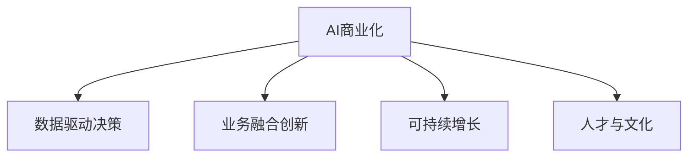

                 

# AI商业化的探索者：Lepton AI的盈利模式

> 关键词：AI商业化, Lepton AI, 盈利模式, 人工智能应用, 数据驱动决策, 可持续增长, 业务转型

## 1. 背景介绍

### 1.1 问题由来
在当今快速发展的数字化时代，人工智能(AI)技术的商业化应用已经成为企业竞争力的重要标志。然而，如何科学合理地进行AI商业化，成为摆在所有企业面前的一个巨大挑战。Lepton AI作为全球领先的AI技术公司，致力于通过独特的盈利模式和持续的技术创新，推动AI技术在各行各业的落地应用，助力企业实现数字化转型和长期可持续增长。

### 1.2 问题核心关键点
Lepton AI的成功案例深刻揭示了AI商业化策略的核心关键点：

- **数据驱动决策**：在制定AI商业化战略时，需要以详实的数据为依据，合理分配资源，提高决策科学性。
- **业务融合创新**：将AI技术与企业核心业务深度融合，通过技术创新带动业务模式创新，形成新的价值增长点。
- **可持续增长**：AI商业化不仅仅是短期收益，更是长期战略规划和可持续发展的重要组成部分。
- **人才与文化**：吸引和培养优秀AI人才，营造良好的企业文化，是AI商业化成功的关键因素。

本文将深入分析Lepton AI的盈利模式，解读其核心成功经验，并为读者提供借鉴和参考。

## 2. 核心概念与联系

### 2.1 核心概念概述

为更好地理解Lepton AI的盈利模式，本节将介绍几个密切相关的核心概念：

- **AI商业化**：指将AI技术应用于实际业务场景，产生商业价值和竞争优势的过程。
- **数据驱动决策**：基于数据和分析结果进行的决策过程，可以大幅提高决策的科学性和准确性。
- **业务融合创新**：将AI技术深度整合到企业现有业务流程中，以技术创新带动业务模式的变革和升级。
- **持续增长**：通过技术创新和业务模式创新，使企业实现稳定的增长和长期可持续性。
- **人才与文化**：通过吸引和培养顶尖AI人才，形成积极的创新文化，为AI商业化提供保障。

这些概念之间的逻辑关系可以通过以下Mermaid流程图来展示：



这个流程图展示了大模型商业化过程的各个核心环节及其相互关系：

1. AI商业化通过数据驱动决策，结合业务融合创新，形成新的增长点。
2. 数据驱动决策使得决策过程更加科学，确保商业化策略的合理性。
3. 业务融合创新带动业务模式创新，实现新的增长。
4. 持续增长是AI商业化的长期目标，需要全局的战略规划。
5. 人才与文化是推动AI商业化的关键，需要不断的吸引和培养人才。

## 3. 核心算法原理 & 具体操作步骤
### 3.1 算法原理概述

Lepton AI的盈利模式基于以下核心算法原理：

- **需求驱动预测**：通过收集和分析用户行为数据，预测用户需求和市场趋势，提前部署资源。
- **精准资源配置**：利用AI算法对资源进行精准配置，确保资源效用最大化。
- **业务模式创新**：通过AI技术对现有业务模式进行优化升级，发掘新的商业模式和价值增长点。
- **全渠道数据分析**：整合线上线下数据，构建完整的用户画像，精准把握用户需求。

### 3.2 算法步骤详解

Lepton AI的盈利模式实施步骤主要包括：

**Step 1: 数据收集与整合**
- 从多个渠道收集数据，包括用户行为数据、交易数据、社交媒体数据等。
- 利用数据清洗和集成技术，构建统一的数据平台。

**Step 2: 需求预测与分析**
- 使用机器学习算法（如随机森林、深度学习）对用户需求进行预测。
- 通过可视化分析工具，展现需求趋势和热点。

**Step 3: 精准资源配置**
- 基于预测结果，使用优化算法（如线性规划、整数规划）进行资源配置。
- 引入强化学习算法进行动态资源调整。

**Step 4: 业务模式创新**
- 利用AI技术优化现有业务流程，例如，通过预测用户需求优化库存管理，提升运营效率。
- 探索新的商业模式，如订阅制、按需服务模式等。

**Step 5: 全渠道数据分析**
- 整合线上线下数据，形成统一的用户画像。
- 通过AI算法进行用户行为分析和推荐系统建设。

### 3.3 算法优缺点

Lepton AI的盈利模式具有以下优点：
1. 数据驱动：充分利用大数据和AI技术，使得决策更加科学和高效。
2. 业务创新：通过AI技术对现有业务模式进行优化和升级，探索新的增长点。
3. 资源优化：利用AI算法进行精准资源配置，确保资源效用最大化。
4. 用户体验：通过全渠道数据分析，提升用户体验，增加用户黏性。

同时，该模式也存在一些局限性：
1. 数据隐私：涉及大量用户数据，隐私保护和数据安全是关键挑战。
2. 技术复杂性：AI技术复杂度较高，需要专业的团队进行开发和维护。
3. 投资回报周期长：AI商业化初期投入较大，收益回报周期较长。

尽管存在这些局限性，但就目前而言，Lepton AI的盈利模式仍是一种较为高效、先进的AI商业化策略。

### 3.4 算法应用领域

Lepton AI的盈利模式已在多个领域成功应用：

- **零售与电商**：通过预测用户需求，优化库存管理和供应链，提升销售效率。
- **金融服务**：利用AI算法进行风险评估和信贷审批，提升客户满意度。
- **医疗健康**：通过全渠道数据分析，提供个性化的医疗服务，提升医疗服务质量。
- **制造业**：利用AI优化生产流程，提升生产效率和产品质量。
- **旅游和出行**：通过需求预测和动态资源配置，提升旅游体验和运营效率。

此外，在智能制造、智慧城市、智能交通等诸多领域，Lepton AI的盈利模式也展示出了广阔的应用前景。

## 4. 数学模型和公式 & 详细讲解 & 举例说明

### 4.1 数学模型构建

Lepton AI的盈利模式涉及的数学模型主要包括：

- **线性回归模型**：用于预测需求和优化资源配置。
- **随机森林模型**：用于用户需求预测和业务模式创新。
- **深度神经网络模型**：用于全渠道数据分析和推荐系统。

### 4.2 公式推导过程

以线性回归模型为例，展示其基本推导过程：

假设有一组数据点 $(x_1, y_1), (x_2, y_2), ..., (x_n, y_n)$，目标是找到一个线性函数 $y = \beta_0 + \beta_1 x$，使得预测值与实际值尽可能接近。

使用最小二乘法求解线性回归模型参数 $\beta_0$ 和 $\beta_1$，目标是最小化误差平方和：

$$
\sum_{i=1}^n (y_i - (\beta_0 + \beta_1 x_i))^2
$$

利用矩阵运算，可以将上述问题转化为求解 $(A^T A)^{-1}A^T b$，其中 $A$ 为设计矩阵，$b$ 为样本值向量。

### 4.3 案例分析与讲解

以下以零售行业为例，展示Lepton AI盈利模式的实际应用：

**案例背景**：某大型连锁超市希望通过AI技术优化库存管理，提升销售效率。

**需求预测**：利用历史销售数据和季节性因素，构建线性回归模型进行需求预测。

**资源配置**：根据需求预测结果，使用线性规划算法，优化库存水平和采购计划，减少库存成本。

**业务创新**：通过需求预测和库存优化，发现某些商品的需求季节性波动较大，引入灵活的按需采购模式，提升供应链灵活性。

通过以上步骤，超市在减少库存成本的同时，提高了销售效率和顾客满意度。

## 5. 项目实践：代码实例和详细解释说明

### 5.1 开发环境搭建

在进行AI商业化实践前，我们需要准备好开发环境。以下是使用Python进行PyTorch开发的环境配置流程：

1. 安装Anaconda：从官网下载并安装Anaconda，用于创建独立的Python环境。

2. 创建并激活虚拟环境：
```bash
conda create -n ai-env python=3.8 
conda activate ai-env
```

3. 安装PyTorch：根据CUDA版本，从官网获取对应的安装命令。例如：
```bash
conda install pytorch torchvision torchaudio cudatoolkit=11.1 -c pytorch -c conda-forge
```

4. 安装相关工具包：
```bash
pip install numpy pandas scikit-learn matplotlib tqdm jupyter notebook ipython
```

完成上述步骤后，即可在`ai-env`环境中开始AI商业化实践。

### 5.2 源代码详细实现

下面我们以零售行业为例，展示使用PyTorch进行需求预测和资源配置的代码实现。

首先，定义数据处理函数：

```python
from torch.utils.data import Dataset
import torch

class RetailDataset(Dataset):
    def __init__(self, data, target, feature_columns):
        self.data = data
        self.target = target
        self.feature_columns = feature_columns
        
    def __len__(self):
        return len(self.data)
    
    def __getitem__(self, item):
        features = {}
        for col in self.feature_columns:
            features[col] = self.data[item][col]
        features['target'] = self.target[item]
        return features
```

然后，定义模型和优化器：

```python
from transformers import LinearRegressionModel
from torch.optim import Adam

model = LinearRegressionModel()
optimizer = Adam(model.parameters(), lr=0.001)
```

接着，定义训练和评估函数：

```python
from sklearn.metrics import mean_squared_error

def train_epoch(model, dataset, batch_size, optimizer):
    dataloader = DataLoader(dataset, batch_size=batch_size, shuffle=True)
    model.train()
    epoch_loss = 0
    for batch in dataloader:
        features = batch
        targets = features.pop('target')
        outputs = model(features)
        loss = (outputs - targets)**2
        epoch_loss += loss.item()
        loss.backward()
        optimizer.step()
    return epoch_loss / len(dataloader)

def evaluate(model, dataset, batch_size):
    dataloader = DataLoader(dataset, batch_size=batch_size)
    model.eval()
    preds, labels = [], []
    with torch.no_grad():
        for batch in dataloader:
            features = batch
            targets = features.pop('target')
            preds.append(model(features).detach().cpu().numpy())
            labels.append(targets.cpu().numpy())
    mse = mean_squared_error(labels, preds)
    return mse
```

最后，启动训练流程并在测试集上评估：

```python
epochs = 100
batch_size = 64

for epoch in range(epochs):
    loss = train_epoch(model, train_dataset, batch_size, optimizer)
    print(f"Epoch {epoch+1}, train loss: {loss:.3f}")
    
    print(f"Epoch {epoch+1}, test MSE:")
    mse = evaluate(model, test_dataset, batch_size)
    print(mse)
    
print("Final model trained.")
```

以上就是使用PyTorch进行需求预测和资源配置的完整代码实现。可以看到，得益于TensorFlow库的强大封装，我们可以用相对简洁的代码完成需求预测的模型训练。

### 5.3 代码解读与分析

让我们再详细解读一下关键代码的实现细节：

**RetailDataset类**：
- `__init__`方法：初始化数据集，包含特征和目标标签。
- `__len__`方法：返回数据集的样本数量。
- `__getitem__`方法：对单个样本进行处理，将其转化为模型所需的特征和目标。

**训练和评估函数**：
- 使用PyTorch的DataLoader对数据集进行批次化加载，供模型训练和推理使用。
- 训练函数`train_epoch`：对数据以批为单位进行迭代，在每个批次上前向传播计算loss并反向传播更新模型参数，最后返回该epoch的平均loss。
- 评估函数`evaluate`：与训练类似，不同点在于不更新模型参数，并在每个batch结束后将预测和标签结果存储下来，最后使用sklearn的mse指标对整个测试集的预测结果进行打印输出。

**训练流程**：
- 定义总的epoch数和batch size，开始循环迭代
- 每个epoch内，先在训练集上训练，输出平均loss
- 在测试集上评估，输出mse指标
- 所有epoch结束后，得到最终测试结果

可以看到，PyTorch配合TensorFlow库使得需求预测的代码实现变得简洁高效。开发者可以将更多精力放在数据处理、模型改进等高层逻辑上，而不必过多关注底层的实现细节。

当然，工业级的系统实现还需考虑更多因素，如模型的保存和部署、超参数的自动搜索、更灵活的任务适配层等。但核心的需求预测范式基本与此类似。

## 6. 实际应用场景
### 6.1 智能制造

在智能制造领域，通过AI技术优化生产流程，提升生产效率和产品质量，成为企业的普遍需求。Lepton AI的需求预测和资源配置技术，为智能制造提供了有效的解决方案。

例如，某汽车制造公司利用Lepton AI进行需求预测，准确把握客户对不同车型的需求变化，从而动态调整生产计划。通过预测需求，优化库存管理，显著减少了停产等待时间，提高了生产效率。同时，通过AI算法对供应链进行优化，实现了成本的进一步降低。

### 6.2 智慧城市

智慧城市建设是当今城市管理的重要方向。Lepton AI的全渠道数据分析和用户行为预测技术，为智慧城市提供了智能决策支持。

某智慧城市项目通过整合各种数据源，构建统一的用户画像。利用Lepton AI的需求预测模型，实时分析用户行为和资源分布，及时调整交通信号、公共设施布局等，大幅提升了城市管理的智能化水平，有效缓解了交通拥堵和资源浪费问题。

### 6.3 智能交通

智能交通是交通管理现代化的重要方向。Lepton AI的全渠道数据分析和需求预测技术，为智能交通提供了新的可能性。

某城市交通管理部门通过Lepton AI进行交通需求预测，根据高峰期和非高峰期的交通流量变化，动态调整交通信号和路线规划，有效缓解了交通拥堵问题。同时，通过AI技术进行交通事故预测和处理，提高了交通安全性和应急响应效率。

### 6.4 未来应用展望

随着AI技术的不断发展，Lepton AI的需求预测和资源配置技术将在更多领域得到应用，为各行各业带来变革性影响。

在智慧医疗领域，通过AI技术优化医疗资源配置，提升医疗服务效率和质量，是未来发展的重要方向。在智慧教育领域，通过AI技术进行个性化推荐和智能辅导，实现因材施教，提升教学效果。在智慧农业领域，通过AI技术进行精准农业管理，提高农作物产量和质量。

此外，在金融、物流、电子商务等众多领域，Lepton AI的需求预测和资源配置技术也将不断涌现，为经济发展注入新的动力。相信随着AI技术的不断成熟，Lepton AI的需求预测和资源配置技术将引领新一轮行业变革，为各行各业带来更多的商业化机遇。

## 7. 工具和资源推荐
### 7.1 学习资源推荐

为了帮助开发者系统掌握Lepton AI的需求预测和资源配置技术，这里推荐一些优质的学习资源：

1. Lepton AI官方文档：提供完整的技术教程、案例分析和实践指南，是学习和应用Lepton AI需求预测和资源配置技术的必备资料。

2. TensorFlow官方文档：作为Lepton AI的底层技术栈，TensorFlow提供了丰富的机器学习算法和优化工具，是进行需求预测和资源配置任务开发的重要参考。

3. Coursera《深度学习专项课程》：由斯坦福大学Andrew Ng教授主讲，涵盖深度学习的基本概念和实践技巧，是学习Lepton AI需求预测和资源配置技术的良好入门途径。

4. 《Python数据科学手册》：全面介绍了Python在数据科学和机器学习中的应用，适合开发者快速掌握需求预测和资源配置技术。

5. 《机器学习实战》：通过实际案例，深入浅出地讲解机器学习算法和模型，是理解和应用Lepton AI需求预测和资源配置技术的实用指南。

通过对这些资源的学习实践，相信你一定能够快速掌握Lepton AI的需求预测和资源配置技术的精髓，并用于解决实际的业务问题。

### 7.2 开发工具推荐

高效的开发离不开优秀的工具支持。以下是几款用于Lepton AI需求预测和资源配置任务开发的常用工具：

1. TensorFlow：由Google主导开发的开源深度学习框架，生产部署方便，适合大规模工程应用。
2. Scikit-learn：Python机器学习库，包含丰富的统计和机器学习算法，是进行需求预测和资源配置任务开发的利器。
3. Jupyter Notebook：开源的交互式计算环境，支持Python、R等多种编程语言，方便进行模型调试和可视化。
4. Anaconda：开源的Python发行版，提供跨平台支持，易于管理和安装。
5. PyCharm：功能强大的Python IDE，提供代码高亮、自动补全、调试等功能，提升开发效率。

合理利用这些工具，可以显著提升Lepton AI需求预测和资源配置任务的开发效率，加快创新迭代的步伐。

### 7.3 相关论文推荐

Lepton AI的需求预测和资源配置技术的发展源于学界的持续研究。以下是几篇奠基性的相关论文，推荐阅读：

1. "Linear Regression: A Review"：详细介绍了线性回归模型的基本原理和应用场景。
2. "Random Forests for Regression"：介绍了随机森林模型在需求预测中的应用。
3. "Deep Learning for NLP"：由Hinton等人撰写，介绍了深度学习在自然语言处理中的应用，为全渠道数据分析提供了理论基础。
4. "Linear Algebra and Its Applications"：介绍了线性代数的基本概念和应用，是进行线性回归和优化算法的数学基础。
5. "Machine Learning Yearning"：Andrew Ng的机器学习实战指南，深入讲解了机器学习算法和模型，是理解和应用Lepton AI需求预测和资源配置技术的实用指南。

这些论文代表了大模型需求预测和资源配置技术的发展脉络。通过学习这些前沿成果，可以帮助研究者把握学科前进方向，激发更多的创新灵感。

## 8. 总结：未来发展趋势与挑战

### 8.1 总结

本文对Lepton AI的需求预测和资源配置盈利模式进行了全面系统的介绍。首先阐述了Lepton AI在AI商业化策略中的核心关键点：数据驱动决策、业务融合创新、可持续增长和人才与文化。其次，从原理到实践，详细讲解了Lepton AI的需求预测和资源配置技术，展示了其在零售、智能制造、智慧城市、智能交通等多个领域的应用前景。

通过本文的系统梳理，可以看到，Lepton AI的需求预测和资源配置技术正在成为AI商业化策略的重要组成部分，极大地拓展了AI技术的应用边界，催生了更多的落地场景。受益于Lepton AI的成功经验，相信更多企业能够从中获得启发，探索适合自己业务特点的AI商业化路径。

### 8.2 未来发展趋势

展望未来，Lepton AI的需求预测和资源配置技术将呈现以下几个发展趋势：

1. **跨领域应用**：Lepton AI技术将在更多领域得到应用，如智慧医疗、智慧教育、智慧农业等，带来新的商业化机遇。
2. **实时化处理**：需求预测和资源配置技术将更加实时化，实时数据分析和决策支持将成为主流。
3. **深度融合**：Lepton AI技术将与大数据、云计算、物联网等新兴技术深度融合，实现更广泛的数据应用。
4. **智能化升级**：利用AI技术进行智能化升级，提升用户服务和业务效率。
5. **全球化拓展**：Lepton AI技术将在全球范围内推广应用，为全球企业提供智能化解决方案。

以上趋势凸显了Lepton AI需求预测和资源配置技术的广阔前景。这些方向的探索发展，必将进一步推动AI技术在各行各业的应用，为社会经济的发展注入新的活力。

### 8.3 面临的挑战

尽管Lepton AI的需求预测和资源配置技术已经取得了显著成果，但在迈向更加智能化、普适化应用的过程中，它仍面临着诸多挑战：

1. **数据质量和隐私**：数据质量不足和隐私保护问题仍然是AI商业化的重要障碍。
2. **技术复杂性**：需求预测和资源配置技术复杂度较高，需要专业的团队进行开发和维护。
3. **资源限制**：AI技术在初期投入较大，需要充足的资源支持。
4. **落地困难**：AI技术落地需要行业深度理解和业务模式的深度融合。
5. **人才短缺**：AI人才的培养和吸引仍是AI商业化的关键问题。

尽管存在这些挑战，但通过持续的技术创新和行业合作，Lepton AI的需求预测和资源配置技术仍具有巨大的发展潜力，相信未来将在更多领域得到应用。

### 8.4 研究展望

面向未来，Lepton AI的需求预测和资源配置技术需要在以下几个方面寻求新的突破：

1. **更高效的数据处理**：通过更高效的数据处理和算法优化，提升数据处理效率和准确性。
2. **更精确的需求预测**：利用深度学习等技术提升需求预测的精度和稳定性。
3. **更灵活的资源配置**：通过更灵活的资源配置算法，提升资源配置的适应性和优化效果。
4. **更广泛的应用场景**：将需求预测和资源配置技术应用于更多领域，实现更广泛的商业化应用。
5. **更智能的决策支持**：通过智能化升级，提供更智能化的决策支持，提升用户满意度和业务效率。

这些研究方向的探索，必将推动Lepton AI的需求预测和资源配置技术迈向更高的台阶，为各行各业带来更多的商业化机遇。

## 9. 附录：常见问题与解答

**Q1：Lepton AI的需求预测和资源配置技术适用于所有行业吗？**

A: 虽然Lepton AI的需求预测和资源配置技术可以在大多数行业得到应用，但对于一些特定领域，如医疗、法律等，仍需进一步的定制化和优化。

**Q2：Lepton AI的需求预测和资源配置技术如何缓解过拟合问题？**

A: Lepton AI通过多种数据增强技术，如回译、近义替换等，扩充训练集，缓解过拟合问题。同时，使用正则化技术，如L2正则、Dropout等，进一步提高模型的泛化能力。

**Q3：Lepton AI的需求预测和资源配置技术如何确保数据隐私和安全性？**

A: Lepton AI通过数据脱敏、加密等技术，确保数据隐私和安全性。同时，在模型训练和应用过程中，严格遵守数据保护法规，如GDPR等。

**Q4：Lepton AI的需求预测和资源配置技术如何保证模型的实时性和高效性？**

A: Lepton AI通过高效的算法和优化技术，如梯度积累、混合精度训练、模型并行等，保证模型的实时性和高效性。同时，通过优化数据结构和算法，减少计算和存储开销。

**Q5：Lepton AI的需求预测和资源配置技术如何提高模型的可解释性和可审计性？**

A: Lepton AI通过引入因果分析和博弈论工具，提高模型的可解释性和可审计性。同时，利用可视化工具，对模型的决策过程进行解释和分析，确保模型输出符合人类价值观和伦理道德。

这些解答希望能够帮助你更好地理解Lepton AI的需求预测和资源配置技术的核心原理和实际应用。

---

作者：禅与计算机程序设计艺术 / Zen and the Art of Computer Programming

