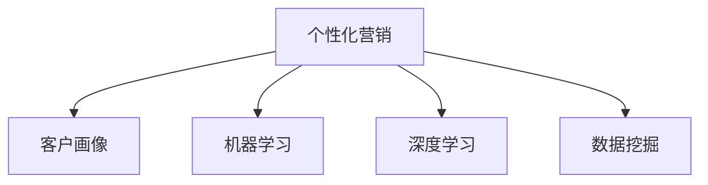

                 

# AI在个性化营销策略中的应用：精准客户定位

> 关键词：个性化营销,精准客户定位,客户画像,机器学习,深度学习,数据挖掘

## 1. 背景介绍

### 1.1 问题由来

在数字化时代，企业面临的海量数据和复杂的市场环境，如何实现精准客户定位，成为影响营销效果和收益的关键。传统的市场细分和客户分群方法依赖人工经验和主观判断，既费时费力，又缺乏科学性和准确性。而人工智能(AI)技术的应用，特别是基于机器学习(Machine Learning)和深度学习(Deep Learning)的数据挖掘技术，能够从海量的客户数据中挖掘出更深层次的洞察，实现精准的客户定位，从而优化营销策略，提高营销效果和收益。

### 1.2 问题核心关键点

实现精准客户定位的核心在于构建科学的客户画像，通过对客户的属性、行为、偏好等维度的综合分析，建立起全面的客户画像。该画像可以用于定位潜在客户，细分市场，制定个性化营销策略，实现更有效的市场覆盖和客户转化。AI技术的应用主要体现在以下几个方面：

1. **客户数据分析**：通过数据挖掘和机器学习技术，从海量客户数据中提取有用信息，识别客户特征和行为模式。
2. **客户画像构建**：将分析结果汇总，构建多维度的客户画像，实现对客户全面的描述和理解。
3. **个性化推荐**：基于客户画像，实现个性化产品推荐，提升客户满意度和转化率。
4. **营销效果评估**：通过预测模型评估营销活动的效果，持续优化策略。

### 1.3 问题研究意义

精准客户定位在个性化营销中的应用，对于企业优化营销策略，提升客户转化率，提高品牌忠诚度具有重要意义。通过精准定位，企业能够实现更有效的市场细分，降低营销成本，提升客户体验，进而实现更高的市场占有率和收益。同时，AI技术的应用也为传统行业带来了新的技术手段，促进了数字化转型，推动了经济的智能化发展。

## 2. 核心概念与联系

### 2.1 核心概念概述

为更好地理解基于AI的精准客户定位方法，本节将介绍几个密切相关的核心概念：

- **个性化营销**：针对不同客户群体定制化的营销策略，实现更高的客户满意度和转化率。
- **客户画像**：从多个维度对客户进行描述和分析，建立完整的客户画像，以实现更精准的营销定位。
- **机器学习**：通过数据驱动的学习算法，从大量数据中提取模式和规律，进行预测和分类等任务。
- **深度学习**：一种特殊的机器学习技术，通过多层次的神经网络模型，从原始数据中学习到更高层次的抽象特征。
- **数据挖掘**：从大规模数据集中发现有用信息和知识的过程，常用于客户行为分析和市场细分。

这些核心概念之间的逻辑关系可以通过以下Mermaid流程图来展示：



这个流程图展示了个性化营销的核心概念及其之间的关系：

1. 个性化营销通过客户画像来实现，而客户画像的构建离不开数据挖掘和机器学习。
2. 深度学习是机器学习的一种特殊形式，其应用领域覆盖了从特征提取到模型训练的各个环节。

## 3. 核心算法原理 & 具体操作步骤
### 3.1 算法原理概述

基于AI的精准客户定位，本质上是一个数据驱动的预测和分类问题。其核心思想是：通过数据挖掘和机器学习技术，从客户数据中提取有用的特征和模式，构建客户画像，并对客户进行分类，实现精准定位。

形式化地，假设客户数据集为 $D=\{(x_i,y_i)\}_{i=1}^N, x_i \in \mathcal{X}, y_i \in \mathcal{Y}$，其中 $x_i$ 为客户的属性和行为数据，$y_i$ 为客户的标签（如客户分类、行为预测等）。定义客户画像模型为 $M_{\theta}:\mathcal{X} \rightarrow \mathcal{Y}$，其中 $\theta$ 为模型的参数。通过训练模型 $M_{\theta}$ 在数据集 $D$ 上的预测能力，构建客户画像。

### 3.2 算法步骤详解

基于AI的精准客户定位一般包括以下几个关键步骤：

**Step 1: 数据准备**

1. **数据收集**：收集客户的各种数据，包括基本信息（如年龄、性别、职业等）、行为数据（如浏览记录、购买记录等）、社交媒体数据等。
2. **数据预处理**：清洗、标准化和归一化数据，去除噪音和异常值，确保数据质量和一致性。
3. **特征工程**：根据客户画像的目标，提取和构造有意义的特征，如人口统计特征、行为特征、情感特征等。

**Step 2: 模型训练**

1. **选择合适的算法**：根据问题的性质和数据的特征，选择合适的机器学习或深度学习模型，如决策树、随机森林、支持向量机、神经网络等。
2. **划分训练集和测试集**：将数据集划分为训练集和测试集，通常使用70-30或80-20的比例。
3. **模型训练**：在训练集上训练模型，使用交叉验证等方法优化模型参数。
4. **模型评估**：在测试集上评估模型的性能，使用准确率、召回率、F1分数等指标。

**Step 3: 客户画像构建**

1. **客户聚类**：使用聚类算法将客户分为不同的群体，如基于K-means、层次聚类等。
2. **特征降维**：使用主成分分析(PCA)、t-SNE等方法对高维特征进行降维，简化客户画像。
3. **可视化展示**：将客户画像可视化展示，如使用散点图、热力图、树状图等，帮助理解客户特征。

**Step 4: 个性化推荐**

1. **个性化模型训练**：根据客户画像和历史行为数据，训练个性化推荐模型，如协同过滤、内容推荐等。
2. **推荐结果展示**：根据客户的画像和偏好，提供个性化的产品推荐，使用户能够更快地找到所需产品。

### 3.3 算法优缺点

基于AI的精准客户定位方法具有以下优点：

1. **准确度高**：通过数据驱动的方法，能够从海量数据中提取有用信息，提高客户分类的准确性。
2. **自动化程度高**：自动化处理数据，降低了人工干预和主观判断的误差，提高了工作效率。
3. **灵活性强**：能够处理多种类型的数据，包括结构化和非结构化数据，适应性广。

同时，该方法也存在一定的局限性：

1. **数据依赖性大**：精准客户定位依赖高质量和充分的数据，数据缺失或不完整会导致模型效果不佳。
2. **模型复杂度高**：深度学习等复杂模型需要更多的计算资源和时间，训练和部署成本较高。
3. **可解释性不足**：模型通常是一个"黑盒"，难以解释其内部工作机制和决策逻辑。
4. **隐私和安全问题**：客户数据的处理和使用涉及隐私和安全问题，需要严格的法律法规和技术措施保护。

尽管存在这些局限性，但就目前而言，基于AI的精准客户定位方法仍然是实现个性化营销的重要手段。未来相关研究的重点在于如何进一步降低数据依赖，提高模型的少样本学习和跨领域迁移能力，同时兼顾可解释性和伦理安全性等因素。

### 3.4 算法应用领域

基于AI的精准客户定位方法在多个领域中得到了广泛应用，例如：

- **电子商务**：通过分析客户的购物行为和偏好，实现个性化推荐，提升客户转化率和销售额。
- **金融服务**：根据客户的消费行为和信用记录，实现客户细分和风险管理，优化信贷审批流程。
- **旅游行业**：通过分析客户的旅行历史和偏好，提供个性化的旅游推荐，提升客户体验和满意度。
- **医疗健康**：根据病人的健康数据和行为模式，实现精准医疗，提高诊疗效果和病人满意度。
- **媒体娱乐**：通过分析用户的观看历史和行为数据，实现个性化的内容推荐，提升用户粘性和满意度。

除了上述这些经典应用外，AI技术在个性化营销领域的应用还在不断扩展，为各行各业带来新的机遇和挑战。

## 4. 数学模型和公式 & 详细讲解 & 举例说明

### 4.1 数学模型构建

本节将使用数学语言对基于AI的精准客户定位过程进行更加严格的刻画。

假设客户数据集为 $D=\{(x_i,y_i)\}_{i=1}^N, x_i \in \mathcal{X}, y_i \in \mathcal{Y}$。定义客户画像模型为 $M_{\theta}:\mathcal{X} \rightarrow \mathcal{Y}$，其中 $\theta$ 为模型的参数。

客户画像的构建过程可以表示为以下公式：

$$
\hat{y} = M_{\theta}(x_i)
$$

其中 $\hat{y}$ 表示模型对客户 $i$ 的预测标签，$M_{\theta}(x_i)$ 为模型在输入 $x_i$ 上的输出。

定义客户画像模型在训练集 $D$ 上的经验风险为：

$$
\mathcal{L}(\theta) = \frac{1}{N}\sum_{i=1}^N \ell(\hat{y_i}, y_i)
$$

其中 $\ell$ 为损失函数，用于衡量模型预测输出与真实标签之间的差异。常见的损失函数包括交叉熵损失、均方误差损失等。

### 4.2 公式推导过程

以下我们以二分类任务为例，推导交叉熵损失函数及其梯度的计算公式。

假设客户画像模型 $M_{\theta}$ 在输入 $x_i$ 上的输出为 $\hat{y}=M_{\theta}(x_i) \in [0,1]$，表示客户属于正类的概率。真实标签 $y_i \in \{0,1\}$。则二分类交叉熵损失函数定义为：

$$
\ell(M_{\theta}(x_i),y_i) = -[y_i\log \hat{y} + (1-y_i)\log (1-\hat{y})]
$$

将其代入经验风险公式，得：

$$
\mathcal{L}(\theta) = -\frac{1}{N}\sum_{i=1}^N [y_i\log M_{\theta}(x_i)+(1-y_i)\log(1-M_{\theta}(x_i))]
$$

根据链式法则，损失函数对参数 $\theta_k$ 的梯度为：

$$
\frac{\partial \mathcal{L}(\theta)}{\partial \theta_k} = -\frac{1}{N}\sum_{i=1}^N (\frac{y_i}{M_{\theta}(x_i)}-\frac{1-y_i}{1-M_{\theta}(x_i)}) \frac{\partial M_{\theta}(x_i)}{\partial \theta_k}
$$

其中 $\frac{\partial M_{\theta}(x_i)}{\partial \theta_k}$ 可进一步递归展开，利用自动微分技术完成计算。

在得到损失函数的梯度后，即可带入参数更新公式，完成模型的迭代优化。重复上述过程直至收敛，最终得到适应客户画像的目标模型参数 $\theta^*$。

### 4.3 案例分析与讲解

假设我们有一个电商公司的客户数据集，其中包含客户的年龄、性别、职业、购买历史、浏览记录等。我们的目标是构建一个客户画像模型，实现基于用户行为的个性化推荐。

**Step 1: 数据准备**

1. **数据收集**：收集客户的各项数据，如基本信息、浏览记录、购买记录等。
2. **数据预处理**：清洗、标准化和归一化数据，去除噪音和异常值，确保数据质量和一致性。
3. **特征工程**：提取和构造有意义的特征，如人口统计特征、行为特征、情感特征等。

**Step 2: 模型训练**

1. **选择合适的算法**：选择适合二分类任务的机器学习模型，如决策树、随机森林、支持向量机等。
2. **划分训练集和测试集**：将数据集划分为训练集和测试集，通常使用70-30或80-20的比例。
3. **模型训练**：在训练集上训练模型，使用交叉验证等方法优化模型参数。
4. **模型评估**：在测试集上评估模型的性能，使用准确率、召回率、F1分数等指标。

**Step 3: 客户画像构建**

1. **客户聚类**：使用聚类算法将客户分为不同的群体，如基于K-means、层次聚类等。
2. **特征降维**：使用主成分分析(PCA)、t-SNE等方法对高维特征进行降维，简化客户画像。
3. **可视化展示**：将客户画像可视化展示，如使用散点图、热力图、树状图等，帮助理解客户特征。

**Step 4: 个性化推荐**

1. **个性化模型训练**：根据客户画像和历史行为数据，训练个性化推荐模型，如协同过滤、内容推荐等。
2. **推荐结果展示**：根据客户的画像和偏好，提供个性化的产品推荐，使用户能够更快地找到所需产品。

## 5. 项目实践：代码实例和详细解释说明
### 5.1 开发环境搭建

在进行项目实践前，我们需要准备好开发环境。以下是使用Python进行Scikit-learn开发的环境配置流程：

1. 安装Anaconda：从官网下载并安装Anaconda，用于创建独立的Python环境。

2. 创建并激活虚拟环境：
```bash
conda create -n pytorch-env python=3.8 
conda activate pytorch-env
```

3. 安装Scikit-learn：
```bash
pip install scikit-learn
```

4. 安装各类工具包：
```bash
pip install numpy pandas scikit-learn matplotlib tqdm jupyter notebook ipython
```

完成上述步骤后，即可在`pytorch-env`环境中开始项目实践。

### 5.2 源代码详细实现

下面我们以二分类任务为例，给出使用Scikit-learn对客户画像模型进行训练的PyTorch代码实现。

首先，定义数据处理函数：

```python
import pandas as pd
from sklearn.model_selection import train_test_split
from sklearn.preprocessing import StandardScaler
from sklearn.ensemble import RandomForestClassifier
from sklearn.metrics import classification_report

def preprocess_data(data_path):
    data = pd.read_csv(data_path)
    X = data[['age', 'gender', 'occupation', 'buying_historical', 'browsing_history']]
    y = data['target']
    X = StandardScaler().fit_transform(X)
    X_train, X_test, y_train, y_test = train_test_split(X, y, test_size=0.2, random_state=42)
    return X_train, X_test, y_train, y_test
```

然后，定义模型训练函数：

```python
from sklearn.metrics import accuracy_score

def train_model(X_train, y_train):
    clf = RandomForestClassifier(n_estimators=100, random_state=42)
    clf.fit(X_train, y_train)
    y_pred = clf.predict(X_train)
    print("Accuracy:", accuracy_score(y_train, y_pred))
    return clf
```

接着，定义评估函数：

```python
def evaluate_model(clf, X_test, y_test):
    y_pred = clf.predict(X_test)
    print(classification_report(y_test, y_pred))
```

最后，启动训练流程并在测试集上评估：

```python
X_train, X_test, y_train, y_test = preprocess_data('data.csv')
clf = train_model(X_train, y_train)
evaluate_model(clf, X_test, y_test)
```

以上就是使用Scikit-learn对客户画像模型进行训练和评估的完整代码实现。可以看到，利用Scikit-learn可以方便地进行数据预处理和模型训练，无需过多关注底层的实现细节。

### 5.3 代码解读与分析

让我们再详细解读一下关键代码的实现细节：

**preprocess_data函数**：
- 读取数据集，并进行特征选择和标准化处理。
- 使用train_test_split将数据集划分为训练集和测试集。

**train_model函数**：
- 选择随机森林模型作为客户画像模型。
- 使用交叉验证等方法优化模型参数。
- 输出模型的准确率。

**evaluate_model函数**：
- 在测试集上评估模型的性能。
- 输出模型的准确率、召回率、F1分数等指标。

**训练流程**：
- 首先定义训练数据和测试数据。
- 使用train_model函数训练模型，输出模型的准确率。
- 使用evaluate_model函数在测试集上评估模型性能，给出模型各项指标。

可以看到，Scikit-learn提供了丰富的机器学习算法和工具，使得模型训练和评估变得非常简单。利用Scikit-learn进行项目实践，可以大大提高开发效率，同时保证模型的稳定性和可靠性。

## 6. 实际应用场景
### 6.1 智能推荐系统

基于AI的精准客户定位技术，在智能推荐系统中的应用最为广泛。通过分析用户的浏览历史和行为数据，可以构建客户画像，实现个性化推荐。智能推荐系统能够实时分析用户行为，提供更符合用户偏好的产品，提升用户满意度和转化率。

在技术实现上，可以利用协同过滤、内容推荐等算法，构建推荐模型。同时，通过在线学习和增量更新，不断优化推荐策略，实现更高效的推荐效果。

### 6.2 个性化广告投放

精准客户定位技术还可以用于个性化广告投放。通过分析客户的浏览记录和行为数据，可以构建客户画像，实现精准的广告投放。企业可以根据客户的画像和兴趣点，定制个性化的广告内容，提高广告的点击率和转化率。

在技术实现上，可以利用深度学习等高级技术，构建更精准的广告推荐模型。同时，通过在线广告平台，实时监测广告效果，不断优化广告投放策略。

### 6.3 客户细分和市场分析

精准客户定位技术还可以用于客户细分和市场分析。通过分析客户的各类数据，可以构建客户画像，实现市场细分和客户分群。企业可以根据客户画像，制定针对性的市场策略，提升市场覆盖率和客户转化率。

在技术实现上，可以利用聚类算法等技术，将客户分为不同的群体。同时，通过可视化工具展示客户画像，帮助理解客户特征和行为模式，制定更有效的市场策略。

### 6.4 未来应用展望

随着AI技术的发展，基于精准客户定位的方法将不断扩展应用场景，带来更多的创新和突破：

1. **实时推荐系统**：结合在线学习技术，构建实时推荐系统，根据用户实时行为，动态调整推荐内容，提升用户体验。
2. **多模态数据融合**：融合多种数据源（如文本、图像、音频等），构建更全面的客户画像，提升推荐效果。
3. **跨领域应用**：将精准客户定位技术应用于更多领域，如金融、医疗、教育等，带来新的商业价值和社会效益。
4. **智能客服**：结合自然语言处理技术，实现智能客服系统，提升客户服务质量和效率。
5. **风险管理**：利用客户画像进行风险管理，提升金融、保险等行业的风险控制能力。

总之，基于AI的精准客户定位技术将不断创新，带来更多的商业价值和社会效益。未来，随着技术的进一步发展，该技术将在更多领域得到应用，为社会带来更多的变革。

## 7. 工具和资源推荐
### 7.1 学习资源推荐

为了帮助开发者系统掌握精准客户定位的理论基础和实践技巧，这里推荐一些优质的学习资源：

1. 《机器学习实战》：吴恩达教授撰写的机器学习入门书籍，详细介绍了机器学习的基本概念和应用。
2. 《深度学习》：Ian Goodfellow等人撰写的深度学习经典教材，全面介绍了深度学习的理论和实践。
3. 《Python数据科学手册》：Jake VanderPlas撰写的数据科学入门书籍，详细介绍了Python数据处理和可视化技术。
4. Coursera上的机器学习和深度学习课程：斯坦福大学、MIT等名校开设的在线课程，涵盖机器学习和深度学习的各个方面。
5. Kaggle平台：全球最大的数据科学竞赛平台，提供丰富的数据集和算法竞赛，帮助你快速提升实践能力。

通过对这些资源的学习实践，相信你一定能够快速掌握精准客户定位的精髓，并用于解决实际的业务问题。
###  7.2 开发工具推荐

高效的开发离不开优秀的工具支持。以下是几款用于精准客户定位开发的常用工具：

1. Scikit-learn：基于Python的机器学习库，提供丰富的机器学习算法和工具，简单易用。
2. TensorFlow：由Google主导开发的深度学习框架，生产部署方便，适合大规模工程应用。
3. Keras：高层次的神经网络API，基于TensorFlow，易于上手。
4. PyTorch：基于Python的开源深度学习框架，灵活高效，适合快速迭代研究。
5. Weights & Biases：模型训练的实验跟踪工具，可以记录和可视化模型训练过程中的各项指标，方便对比和调优。
6. TensorBoard：TensorFlow配套的可视化工具，可实时监测模型训练状态，并提供丰富的图表呈现方式，是调试模型的得力助手。

合理利用这些工具，可以显著提升精准客户定位任务的开发效率，加快创新迭代的步伐。

### 7.3 相关论文推荐

精准客户定位技术的发展源于学界的持续研究。以下是几篇奠基性的相关论文，推荐阅读：

1. Adaptive Boosting（AdaBoost）：由Freund和Schapire提出的一种集成学习算法，广泛应用于分类和回归问题。
2. Random Forest：由Breiman提出的一种随机决策树算法，具有高准确率和低过拟合风险。
3. Support Vector Machine（SVM）：由Cortes和Vapnik提出的一种机器学习算法，广泛应用于分类和回归问题。
4. Deep Learning for Recommendations（DeepRec）：使用深度神经网络模型进行推荐系统构建，提升推荐效果。
5. Deep Learning with Missing Labels（DLML）：在存在大量缺失标签的情况下，使用深度学习技术进行推荐系统构建。

这些论文代表了大语言模型微调技术的发展脉络。通过学习这些前沿成果，可以帮助研究者把握学科前进方向，激发更多的创新灵感。

## 8. 总结：未来发展趋势与挑战
### 8.1 总结

本文对基于AI的精准客户定位方法进行了全面系统的介绍。首先阐述了精准客户定位在个性化营销中的重要性和应用背景，明确了AI技术在客户画像构建、个性化推荐、市场分析等方面的独特价值。其次，从原理到实践，详细讲解了精准客户定位的数学原理和关键步骤，给出了完整的代码实例和详细解释说明。同时，本文还广泛探讨了该技术在推荐系统、广告投放、客户细分等多个行业领域的应用前景，展示了精准客户定位技术的巨大潜力。此外，本文精选了学习资源和开发工具，力求为读者提供全方位的技术指引。

通过本文的系统梳理，可以看到，基于AI的精准客户定位技术正在成为个性化营销的重要手段，极大地拓展了客户数据的应用边界，提升了客户转化率和市场效益。未来，伴随AI技术的持续演进，基于精准客户定位的方法还将进一步优化和完善，为个性化营销带来更多创新和突破。

### 8.2 未来发展趋势

精准客户定位技术在未来将呈现以下几个发展趋势：

1. **数据驱动的智能推荐**：结合在线学习和增量更新，构建实时推荐系统，实现更高效的推荐效果。
2. **多模态数据融合**：融合多种数据源（如文本、图像、音频等），构建更全面的客户画像，提升推荐效果。
3. **跨领域应用**：将精准客户定位技术应用于更多领域，如金融、医疗、教育等，带来新的商业价值和社会效益。
4. **智能客服**：结合自然语言处理技术，实现智能客服系统，提升客户服务质量和效率。
5. **风险管理**：利用客户画像进行风险管理，提升金融、保险等行业的风险控制能力。

以上趋势凸显了精准客户定位技术的广阔前景。这些方向的探索发展，必将进一步提升AI技术在商业中的应用，推动经济的智能化发展。

### 8.3 面临的挑战

尽管精准客户定位技术已经取得了显著的成果，但在迈向更加智能化、普适化应用的过程中，它仍面临着诸多挑战：

1. **数据隐私和安全问题**：客户数据的处理和使用涉及隐私和安全问题，需要严格的法律法规和技术措施保护。
2. **模型复杂度高**：深度学习等复杂模型需要更多的计算资源和时间，训练和部署成本较高。
3. **可解释性不足**：模型通常是一个"黑盒"，难以解释其内部工作机制和决策逻辑。
4. **实时性要求高**：在线推荐系统和智能客服系统需要实时响应，对系统的实时性和计算效率有较高要求。

尽管存在这些挑战，但精准客户定位技术在解决客户画像构建、个性化推荐、市场分析等问题上已经展现出显著的优势，未来仍有望进一步优化和完善，实现更广泛的商业应用。

### 8.4 研究展望

面向未来，精准客户定位技术需要在以下几个方面寻求新的突破：

1. **数据隐私保护**：开发更高效的数据隐私保护技术，确保客户数据的安全性。
2. **轻量级推荐模型**：开发轻量级推荐模型，降低计算资源和时间消耗，提高实时性。
3. **解释性增强**：开发可解释性更强的模型，提升决策的透明性和可理解性。
4. **多领域应用**：将精准客户定位技术推广到更多领域，实现跨领域应用。
5. **跨模态融合**：结合多模态数据，提升推荐和分类的准确性。

这些研究方向的探索，必将引领精准客户定位技术迈向更高的台阶，为个性化营销和智能化发展带来更多创新和突破。

## 9. 附录：常见问题与解答

**Q1：如何选择合适的客户画像特征？**

A: 选择客户画像特征需要考虑特征的相关性、有效性、可解释性等因素。一般可以从以下维度进行特征选择：
1. **人口统计特征**：如年龄、性别、职业等，反映客户的背景和基本信息。
2. **行为特征**：如浏览记录、购买历史等，反映客户的行为和偏好。
3. **情感特征**：如评论情感、反馈情感等，反映客户的情感倾向。
4. **兴趣特征**：如兴趣爱好、社交网络等，反映客户的兴趣和社交行为。

通过特征工程和数据预处理，结合领域知识和业务经验，可以构建出更加全面和准确的客户画像。

**Q2：精准客户定位的推荐算法有哪些？**

A: 精准客户定位的推荐算法包括但不限于：
1. **协同过滤**：基于用户的相似度和物品的相似度进行推荐，常用于电商和视频网站。
2. **内容推荐**：基于物品的特征和用户的历史行为进行推荐，常用于新闻、博客等网站。
3. **深度学习**：使用神经网络模型进行推荐，如CNN、RNN等，提升推荐效果。
4. **混合推荐**：结合多种推荐算法，取长补短，提升推荐效果。

选择合适的推荐算法需要根据具体场景和数据特点进行优化和调整。

**Q3：如何应对数据稀疏性和噪声问题？**

A: 数据稀疏性和噪声问题在精准客户定位中普遍存在，可以通过以下方法进行应对：
1. **数据增强**：通过数据增强技术，如回译、近义词替换等，扩充训练数据集，缓解数据稀疏性。
2. **数据清洗**：对数据进行清洗和去噪处理，去除异常值和噪音，提升数据质量。
3. **模型选择**：选择抗噪性能强的模型，如随机森林、支持向量机等，降低噪声对模型的影响。
4. **正则化**：使用正则化技术，如L1正则、Dropout等，减少过拟合和噪音的影响。

通过综合应用这些方法，可以提升模型的鲁棒性和稳定性，提高推荐和分类的准确性。

**Q4：如何进行客户画像的实时更新和优化？**

A: 客户画像的实时更新和优化是实现精准推荐和智能服务的关键。以下是一些常用的方法：
1. **在线学习**：结合在线学习技术，实时更新模型参数，适应新数据和用户行为的变化。
2. **增量更新**：使用增量更新技术，定期更新模型，保留历史数据的同时，及时吸收新数据。
3. **多任务学习**：结合多任务学习技术，同时训练多个模型，提高模型的稳定性和鲁棒性。
4. **协同过滤**：利用协同过滤技术，分析用户和物品之间的关系，实现实时推荐和智能服务。

通过综合应用这些方法，可以构建更全面、更灵活、更高效的客户画像，提升推荐和分类的效果。

**Q5：如何评估精准客户定位的效果？**

A: 评估精准客户定位的效果可以从多个维度进行：
1. **准确率**：衡量模型对客户分类的准确性。
2. **召回率**：衡量模型对客户的覆盖率。
3. **F1分数**：综合考虑准确率和召回率，评估模型的综合性能。
4. **ROC曲线**：通过ROC曲线评估模型的分类效果，衡量模型在不同阈值下的性能表现。
5. **AUC值**：计算ROC曲线下的面积，衡量模型整体的分类性能。

结合具体业务场景和评估指标，可以制定更加科学和合理的评估方案，持续优化模型性能。

---

作者：禅与计算机程序设计艺术 / Zen and the Art of Computer Programming

