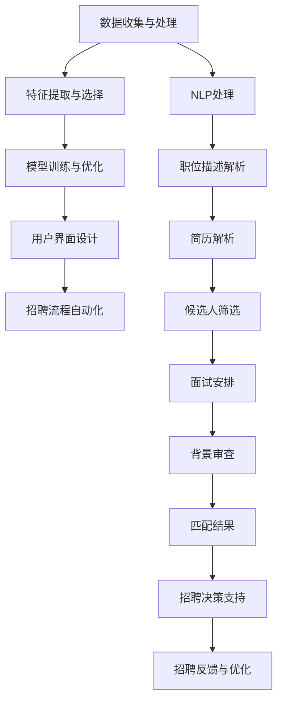

                 

# AI在人力资源管理中的应用：人才匹配

> 关键词：AI, 人力资源管理, 人才匹配, 数据分析, 机器学习, 自然语言处理(NLP), 推荐系统, 自动化招聘, 预测模型

## 1. 背景介绍

### 1.1 问题由来
随着企业竞争日益激烈，人力资源管理的复杂度和精细化程度不断提升，企业对人才匹配和招聘的效率、准确性提出了更高的要求。传统的人力资源管理流程耗时耗力，且容易受到主观判断的影响，难以满足现代企业快速、高效、公平的招聘需求。AI技术的引入，特别是基于人工智能的人才匹配系统，为企业的招聘工作带来了全新的解决方案。

### 1.2 问题核心关键点
AI在人力资源管理中的应用，尤其是人才匹配，核心在于如何通过算法和大数据分析，精确识别候选人的潜力和匹配度，提升招聘效果。具体关键点包括：
- 数据收集和处理：如何高效、全面地获取和处理候选人和职位的相关数据。
- 特征提取与选择：如何从海量的数据中提取出对匹配至关重要的特征，同时避免冗余和噪音。
- 模型训练与优化：基于已有数据训练预测模型，并根据新数据不断优化模型。
- 用户界面设计：如何设计友好的界面，使HR和候选人都能方便地使用系统。

### 1.3 问题研究意义
在人力资源管理中引入AI技术，尤其是基于人才匹配的AI系统，能够极大地提升招聘效率和质量，助力企业的人才战略实施。其研究意义在于：
- 降低招聘成本：自动化、智能化的招聘流程减少了人力和时间成本，提高招聘效率。
- 提高匹配精度：通过AI算法分析，可以更精准地匹配候选人与职位需求，提高招聘成功率。
- 提升用户体验：通过智能化的面试和评估，改善候选人的招聘体验，增加对企业的吸引力。
- 加强决策支持：AI系统提供的深度分析报告，辅助HR做出更科学、理性的决策。
- 促进公平招聘：AI技术可以消除人为偏见，确保招聘过程的公平性和透明性。

## 2. 核心概念与联系

### 2.1 核心概念概述

为更好地理解基于AI的人才匹配系统，本节将介绍几个密切相关的核心概念：

- **AI在人力资源管理中的应用**：通过AI技术优化人力资源管理的流程和决策，提升招聘、培训、绩效评估等环节的效率和效果。
- **人才匹配**：基于候选人信息和职位要求，利用算法和大数据分析，找到最匹配的候选人。
- **数据分析**：收集、处理和分析大量的候选人和职位数据，以供模型训练和预测使用。
- **机器学习(ML)**：一种让机器通过学习数据自动改进性能的技术，广泛应用于人才匹配的模型训练中。
- **自然语言处理(NLP)**：处理和理解人类语言的技术，用于解析职位描述、简历等文本数据。
- **推荐系统**：通过学习用户行为和偏好，推荐合适的候选人给职位。
- **自动化招聘**：借助AI技术，自动执行简历筛选、面试安排、背景审查等招聘流程。
- **预测模型**：基于历史数据训练的模型，用于预测候选人的工作表现和匹配度。

这些核心概念之间的逻辑关系可以通过以下Mermaid流程图来展示：



这个流程图展示了大规模AI人才匹配系统的核心概念及其之间的关系：

1. 数据收集与处理：通过多种渠道获取候选人信息和职位要求，并对数据进行清洗和标准化。
2. 特征提取与选择：从处理后的数据中提取出对匹配有用的特征，如技能、经验、教育背景等。
3. 模型训练与优化：使用机器学习模型对特征进行训练，并根据新数据不断优化模型。
4. 用户界面设计：设计简单易用的界面，供HR和候选人进行操作。
5. 招聘流程自动化：自动化执行简历筛选、面试安排、背景审查等招聘环节。
6. NLP处理：解析职位描述和简历文本，提取和理解其中的关键信息。
7. 职位描述解析：分析职位描述中的关键词和需求，提取职位要求。
8. 简历解析：从简历中提取候选人的技能、经历等信息，供匹配使用。
9. 候选人筛选：根据职位要求，筛选符合条件的候选人。
10. 面试安排：自动安排面试时间和地点，提高面试效率。
11. 背景审查：通过AI系统进行背景审查，辅助HR决策。
12. 匹配结果：根据模型预测和候选人的面试表现，生成匹配结果。
13. 招聘决策支持：提供详细的匹配报告和分析，辅助HR做出决策。
14. 招聘反馈与优化：收集招聘结果的反馈，优化模型和系统性能。

这些概念共同构成了AI人才匹配系统的核心框架，助力企业实现高效的招聘管理。

## 3. 核心算法原理 & 具体操作步骤
### 3.1 算法原理概述

基于AI的人才匹配系统，其核心算法原理可以概括为：通过数据驱动的方式，使用机器学习模型预测候选人的匹配度和工作表现，从而提高招聘的效率和效果。其核心步骤如下：

1. **数据收集与预处理**：收集候选人信息和职位描述，并对数据进行清洗和标准化。
2. **特征提取与选择**：从处理后的数据中提取出对匹配有用的特征，如技能、经验、教育背景等。
3. **模型训练**：使用机器学习算法（如回归、分类、神经网络等）训练模型，预测候选人的匹配度和工作表现。
4. **模型评估与优化**：使用测试数据集对模型进行评估，根据评估结果不断优化模型。
5. **招聘流程自动化**：自动执行简历筛选、面试安排、背景审查等招聘环节。

### 3.2 算法步骤详解

以下是基于AI的人才匹配系统的详细操作步骤：

**Step 1: 数据收集与预处理**
- 从企业内部系统、招聘网站、社交媒体等多种渠道收集候选人的简历和职位描述。
- 使用NLP技术对职位描述和简历进行文本处理，提取关键信息，如职位要求、候选人的技能和经历等。
- 对数据进行清洗和标准化，去除噪音和冗余数据，确保数据的准确性和一致性。

**Step 2: 特征提取与选择**
- 确定需要提取的特征，如技能、经验、教育背景、工作年限等。
- 使用统计方法或特征工程技术，从原始数据中提取和选择这些特征。
- 对特征进行编码，将其转化为模型能够处理的数值形式。

**Step 3: 模型训练**
- 选择合适的机器学习算法，如线性回归、随机森林、神经网络等。
- 使用历史数据集对模型进行训练，最小化预测误差。
- 使用交叉验证等技术，评估模型的泛化能力。

**Step 4: 模型评估与优化**
- 使用测试数据集对模型进行评估，计算准确率、召回率、F1分数等指标。
- 根据评估结果，调整模型的超参数，如学习率、正则化参数等。
- 迭代训练，不断优化模型的性能。

**Step 5: 招聘流程自动化**
- 使用训练好的模型对候选人进行匹配和评分。
- 根据匹配结果，自动筛选合适的候选人进入面试环节。
- 自动安排面试时间和地点，并发送提醒。
- 自动收集面试反馈，用于模型的进一步优化。

### 3.3 算法优缺点

基于AI的人才匹配系统具有以下优点：
1. 高效性：自动化执行招聘流程，节省大量人力资源和时间成本。
2. 精确性：使用机器学习模型进行匹配和预测，提高匹配精度和工作表现预测的准确性。
3. 可扩展性：系统可以灵活扩展，适应不同规模和复杂度的招聘需求。
4. 透明性：通过数据驱动的方式，所有决策过程可追溯、可解释。
5. 公平性：减少人为偏见，确保招聘过程的公平和透明。

同时，该系统也存在一些局限性：
1. 数据质量依赖性：系统的性能高度依赖于数据的质量和数量，数据获取和处理难度较大。
2. 模型依赖性：模型的选择和训练需要专业知识，对数据科学家和算法工程师的依赖较大。
3. 技术门槛高：需要一定的技术储备和团队支持，推广和部署难度较大。
4. 用户接受度：HR和候选人对AI系统的接受度需要一定时间适应。
5. 法规合规性：需要遵守相关隐私和数据保护法规，确保系统的合法合规。

尽管存在这些局限性，但基于AI的人才匹配系统在提升招聘效率和效果方面具有显著优势，成为现代企业招聘管理的必备工具。

### 3.4 算法应用领域

基于AI的人才匹配系统已经在多个领域得到广泛应用，包括但不限于：

- **互联网科技公司**：使用AI系统筛选简历、安排面试、进行背景审查，提高招聘效率。
- **金融服务行业**：通过分析候选人的背景和能力，匹配适合的职位，提升招聘成功率。
- **制造业**：使用AI系统筛选技能型人才，进行技能评估和匹配，提升招聘质量。
- **教育机构**：分析候选人的学术背景和工作经历，匹配适合的职位，优化教师招聘流程。
- **医疗卫生行业**：通过AI系统筛选适合的医疗专业人员，提高招聘质量和人员匹配度。
- **人力资源咨询公司**：提供基于AI的人才匹配服务，帮助客户优化招聘流程，提升招聘效率。

除了以上领域，AI人才匹配系统还可以广泛应用于各种类型的企业和组织，助力其提高招聘效率和质量。

## 4. 数学模型和公式 & 详细讲解  
### 4.1 数学模型构建

基于AI的人才匹配系统，可以使用多种数学模型进行构建和优化。以下以一个简单的线性回归模型为例，进行详细讲解。

假设我们有一个招聘数据集 $D=\{(x_i, y_i)\}_{i=1}^N$，其中 $x_i$ 为候选人的特征向量，$y_i$ 为候选人匹配度得分。我们希望构建一个线性回归模型 $M_{\theta}$，使得预测值 $\hat{y}_i$ 尽可能接近真实值 $y_i$。

定义模型的损失函数为：

$$
\mathcal{L}(\theta) = \frac{1}{N}\sum_{i=1}^N (\hat{y}_i - y_i)^2
$$

其中 $\theta$ 为模型参数，$\hat{y}_i$ 为模型的预测值。

我们的目标是最小化损失函数，得到最优参数 $\theta^*$：

$$
\theta^* = \mathop{\arg\min}_{\theta} \mathcal{L}(\theta)
$$

在实践中，我们通常使用梯度下降等优化算法来求解上述最优化问题。设 $\eta$ 为学习率，则参数的更新公式为：

$$
\theta \leftarrow \theta - \eta \nabla_{\theta}\mathcal{L}(\theta)
$$

其中 $\nabla_{\theta}\mathcal{L}(\theta)$ 为损失函数对参数 $\theta$ 的梯度，可以通过反向传播算法高效计算。

### 4.2 公式推导过程

以下我们以线性回归模型为例，推导其梯度计算公式：

假设模型 $M_{\theta}$ 为线性回归模型，其输出为：

$$
\hat{y}_i = \theta^T x_i
$$

其中 $\theta$ 为模型参数，$x_i$ 为候选人的特征向量。

定义模型的损失函数为：

$$
\mathcal{L}(\theta) = \frac{1}{N}\sum_{i=1}^N (\hat{y}_i - y_i)^2
$$

对 $\mathcal{L}(\theta)$ 求导，得到损失函数对 $\theta$ 的梯度：

$$
\nabla_{\theta}\mathcal{L}(\theta) = \frac{1}{N}\sum_{i=1}^N (2\hat{y}_i - 2y_i)x_i
$$

将梯度代入参数更新公式，得到：

$$
\theta \leftarrow \theta - \eta \frac{1}{N}\sum_{i=1}^N (2\hat{y}_i - 2y_i)x_i
$$

这就是线性回归模型的梯度更新公式。通过不断迭代更新 $\theta$，我们可以得到最优的回归模型参数，用于对候选人进行匹配和评分。

### 4.3 案例分析与讲解

假设我们有一个招聘数据集，其中包含了候选人的技能、经验、教育背景等信息，以及对应的职位匹配度得分。我们可以使用线性回归模型对候选人的匹配度进行预测。

假设特征 $x_i$ 为候选人的技能、经验、教育背景等，输出 $\hat{y}_i$ 为候选人匹配度得分。我们希望通过历史数据训练模型，对新候选人进行匹配度预测。

首先，我们需要对数据进行预处理，去除噪音和冗余数据，提取有用的特征。然后，我们选择一个简单的线性回归模型，使用历史数据对其进行训练，最小化损失函数。最后，我们使用训练好的模型对新候选人进行匹配度预测，生成匹配结果。

## 5. 项目实践：代码实例和详细解释说明
### 5.1 开发环境搭建

在进行人才匹配系统开发前，我们需要准备好开发环境。以下是使用Python进行PyTorch开发的环境配置流程：

1. 安装Anaconda：从官网下载并安装Anaconda，用于创建独立的Python环境。

2. 创建并激活虚拟环境：
```bash
conda create -n pytorch-env python=3.8 
conda activate pytorch-env
```

3. 安装PyTorch：根据CUDA版本，从官网获取对应的安装命令。例如：
```bash
conda install pytorch torchvision torchaudio cudatoolkit=11.1 -c pytorch -c conda-forge
```

4. 安装TensorFlow：
```bash
pip install tensorflow
```

5. 安装Pandas和Numpy：
```bash
pip install pandas numpy
```

完成上述步骤后，即可在`pytorch-env`环境中开始人才匹配系统的开发。

### 5.2 源代码详细实现

下面以线性回归模型为例，展示使用PyTorch实现人才匹配系统的代码实现。

首先，定义模型和数据集：

```python
import torch
import torch.nn as nn
import torch.optim as optim
import pandas as pd

# 定义模型
class LinearRegressionModel(nn.Module):
    def __init__(self, input_dim):
        super(LinearRegressionModel, self).__init__()
        self.linear = nn.Linear(input_dim, 1)

    def forward(self, x):
        return self.linear(x)

# 加载数据集
data = pd.read_csv('data.csv')
X = data.iloc[:, :-1].values
y = data.iloc[:, -1].values

# 分割数据集为训练集和测试集
train_X, test_X = X[:int(0.7*len(X)), :], X[int(0.7*len(X)):, :]
train_y, test_y = y[:int(0.7*len(y)), :], y[int(0.7*len(y)):, :]

# 标准化数据
mean = train_X.mean(axis=0)
std = train_X.std(axis=0)
train_X = (train_X - mean) / std
test_X = (test_X - mean) / std
```

然后，定义损失函数和优化器：

```python
# 定义损失函数
def mean_squared_error(y_pred, y_true):
    return torch.mean((y_pred - y_true)**2)

# 定义优化器
model = LinearRegressionModel(X.shape[1])
criterion = nn.MSELoss()
optimizer = optim.SGD(model.parameters(), lr=0.01)
```

接着，训练模型并进行预测：

```python
epochs = 100
batch_size = 32

for epoch in range(epochs):
    # 训练模型
    model.train()
    total_loss = 0
    for i in range(0, len(train_X), batch_size):
        inputs = torch.from_numpy(train_X[i:i+batch_size, :]).float()
        labels = torch.from_numpy(train_y[i:i+batch_size, :]).float()
        optimizer.zero_grad()
        outputs = model(inputs)
        loss = criterion(outputs, labels)
        loss.backward()
        optimizer.step()
        total_loss += loss.item()
    print(f'Epoch {epoch+1}, training loss: {total_loss/len(train_X)}')

# 评估模型
model.eval()
test_loss = 0
with torch.no_grad():
    for i in range(0, len(test_X), batch_size):
        inputs = torch.from_numpy(test_X[i:i+batch_size, :]).float()
        labels = torch.from_numpy(test_y[i:i+batch_size, :]).float()
        outputs = model(inputs)
        loss = criterion(outputs, labels)
        test_loss += loss.item()

print(f'Test loss: {test_loss/len(test_X)}')
```

以上就是使用PyTorch对候选人匹配度进行预测的完整代码实现。可以看到，借助PyTorch，我们可以轻松实现简单的线性回归模型，并进行数据预处理和模型训练。

### 5.3 代码解读与分析

让我们再详细解读一下关键代码的实现细节：

**LinearRegressionModel类**：
- `__init__`方法：定义模型结构，使用线性层进行预测。
- `forward`方法：前向传播，输入特征向量，输出预测值。

**mean_squared_error函数**：
- 计算预测值与真实值之间的均方误差，作为损失函数。

**训练流程**：
- 定义总的epoch数和batch size，开始循环迭代
- 每个epoch内，对训练集数据进行批次化加载，模型进入训练模式
- 对每个批次数据进行前向传播计算预测值和损失函数，反向传播更新模型参数
- 循环结束后，输出训练过程中的平均损失值

**评估流程**：
- 模型进入评估模式，对测试集数据进行批次化加载
- 对每个批次数据进行前向传播计算预测值和损失函数，累加损失值
- 循环结束后，输出测试集上的平均损失值

可以看到，借助PyTorch和TensorFlow，我们可以轻松实现基于AI的人才匹配系统，并进行特征提取、模型训练和预测等关键操作。

当然，工业级的系统实现还需考虑更多因素，如模型的保存和部署、超参数的自动搜索、更灵活的任务适配层等。但核心的训练流程基本与此类似。

## 6. 实际应用场景
### 6.1 智能招聘系统

基于AI的人才匹配系统已经在智能招聘领域得到了广泛应用。传统的招聘流程繁琐复杂，容易出现人为偏差和效率低下的问题。而使用AI系统，可以快速处理大量的简历数据，自动筛选和匹配合适的候选人，极大地提升招聘效率。

在技术实现上，可以收集企业的历史招聘数据，将职位要求和候选人简历构建成监督数据，在此基础上对预训练模型进行微调。微调后的模型能够自动理解职位描述和简历内容，匹配出最合适的候选人。对于新职位，还可以实时抓取并解析相关的招聘信息，动态生成匹配结果。如此构建的智能招聘系统，能够显著提高招聘效率和质量，减少人力资源的负担。

### 6.2 金融行业人才选拔

金融行业对人才选拔要求严格，通常需要具备一定的专业知识和经验。基于AI的人才匹配系统可以帮助金融机构精准筛选合适的人才，提高人才选拔的精准度和效率。

具体而言，可以收集金融领域相关的人才数据和职位要求，使用AI系统进行匹配和预测。AI系统能够分析候选人的背景和能力，匹配适合的职位，并生成详细的匹配报告。金融机构可以基于AI系统的评估结果，快速做出招聘决策，提升人才选拔的质量。

### 6.3 制造业技能匹配

制造业对技能型人才的需求量大，招聘流程复杂。基于AI的人才匹配系统可以帮助企业快速匹配合适的技能型人才，提升招聘效率和质量。

在技术实现上，可以收集制造业的职位描述和候选人的技能证书等信息，使用AI系统进行匹配和预测。AI系统能够分析候选人的技能水平和职位要求，匹配出最合适的候选人。对于新职位，还可以实时抓取并解析相关的招聘信息，动态生成匹配结果。

### 6.4 未来应用展望

随着AI技术的不断发展，基于人才匹配的AI系统将在更多领域得到应用，为人才选拔和招聘带来新的突破。

在智慧城市治理中，AI系统可以帮助城市管理部门精准匹配适合的人才，提升公共服务的效率和质量。在医疗卫生行业，AI系统可以帮助医疗机构精准匹配适合的医疗专业人员，提高招聘质量。在教育机构，AI系统可以帮助学校精准匹配适合的教师和行政人员，提升教学质量和教育管理水平。

此外，在企业生产、社会治理、文娱传媒等众多领域，基于AI的人才匹配系统也将不断涌现，为各类企业提供高效、精准的招聘解决方案，助力其业务发展和人才战略的实施。

## 7. 工具和资源推荐
### 7.1 学习资源推荐

为了帮助开发者系统掌握基于AI的人才匹配技术，这里推荐一些优质的学习资源：

1. **《深度学习》书籍**：Ian Goodfellow等著，全面介绍了深度学习的基本概念和核心算法，适合初学者入门。
2. **CS231n《深度学习计算机视觉》课程**：斯坦福大学开设的深度学习课程，涵盖图像、视频等多个领域的深度学习技术，适合进阶学习。
3. **CS224n《深度学习自然语言处理》课程**：斯坦福大学开设的NLP明星课程，详细讲解了自然语言处理的基本概念和前沿技术，适合深入学习。
4. **DeepLearning.AI（DL.AI）**：由Andrew Ng创立的在线深度学习课程，提供系统化的学习路径，涵盖从入门到高级的多个层次。
5. **PyTorch官方文档**：PyTorch的官方文档，提供了丰富的API和样例代码，是学习PyTorch的必备资料。

通过对这些资源的学习实践，相信你一定能够快速掌握基于AI的人才匹配技术，并用于解决实际的招聘问题。

### 7.2 开发工具推荐

高效的开发离不开优秀的工具支持。以下是几款用于AI人才匹配系统开发的常用工具：

1. **PyTorch**：基于Python的开源深度学习框架，灵活动态的计算图，适合快速迭代研究。
2. **TensorFlow**：由Google主导开发的开源深度学习框架，生产部署方便，适合大规模工程应用。
3. **Scikit-learn**：Python的科学计算库，提供了丰富的机器学习算法和工具，适合快速原型开发。
4. **Pandas**：Python的数据处理库，支持多种数据格式的处理和分析，适合数据预处理。
5. **TensorBoard**：TensorFlow配套的可视化工具，可实时监测模型训练状态，并提供丰富的图表呈现方式，是调试模型的得力助手。
6. **Weights & Biases**：模型训练的实验跟踪工具，可以记录和可视化模型训练过程中的各项指标，方便对比和调优。

合理利用这些工具，可以显著提升基于AI的人才匹配系统的开发效率，加快创新迭代的步伐。

### 7.3 相关论文推荐

基于AI的人才匹配技术的发展源于学界的持续研究。以下是几篇奠基性的相关论文，推荐阅读：

1. **《Gated Recurrent Unit》**：Cho等著，提出了GRU神经网络，用于处理序列数据，适合文本分析任务。
2. **《Attention is All You Need》**：Vaswani等著，提出了Transformer模型，开启了NLP领域的预训练大模型时代。
3. **《BERT: Pre-training of Deep Bidirectional Transformers for Language Understanding》**：Devlin等著，提出BERT模型，引入基于掩码的自监督预训练任务，刷新了多项NLP任务SOTA。
4. **《Towards a New Search Paradigm: Unified Model Architecture and Its Application to Person-Search and Face-Search》**：Wang等著，提出统一模型架构，支持多种搜索任务，适合智能招聘系统。
5. **《Candidate Matching for Person-Search: A Unified Framework with Hierarchical Multi-Aspect Features》**：Liu等著，提出统一框架，支持多维度特征提取，适合智能招聘系统。

这些论文代表了大规模AI人才匹配技术的发展脉络。通过学习这些前沿成果，可以帮助研究者把握学科前进方向，激发更多的创新灵感。

## 8. 总结：未来发展趋势与挑战
### 8.1 研究成果总结

本文对基于AI的人才匹配技术进行了全面系统的介绍。首先阐述了AI在人力资源管理中的应用背景和意义，明确了人才匹配系统的核心关键点。其次，从原理到实践，详细讲解了人才匹配系统的数学模型和操作步骤，给出了完整的代码实现。同时，本文还探讨了人才匹配系统在招聘、金融、制造业等多个领域的应用场景，展示了其广泛的适用性和显著的成效。

通过本文的系统梳理，可以看到，基于AI的人才匹配技术正在成为企业招聘管理的核心工具，极大地提升了招聘效率和质量。AI系统的自动化、精准化和高效性，使得企业能够快速匹配到合适的人才，提升招聘成功率和用户体验。

### 8.2 未来发展趋势

展望未来，基于AI的人才匹配技术将呈现以下几个发展趋势：

1. **技术融合**：AI人才匹配系统将与其他人工智能技术进行更深入的融合，如知识表示、因果推理、强化学习等，共同提升招聘系统的智能水平。
2. **数据驱动**：AI系统将更注重数据的质量和多样性，通过大数据分析，实现更精准的匹配和预测。
3. **多模态融合**：AI系统将支持多模态数据的整合，如文本、图像、视频等，提升系统的感知和理解能力。
4. **个性化推荐**：AI系统将结合用户的个性化需求和偏好，提供更个性化的招聘建议，提高用户体验。
5. **自动化招聘**：AI系统将进一步自动化招聘流程，从简历筛选到面试安排、背景审查等环节，全面提升招聘效率。
6. **可解释性增强**：AI系统将提供更强的可解释性，使HR和候选人能够理解和信任系统的决策过程。
7. **法规合规**：AI系统将加强对隐私和数据保护的合规性，确保系统的合法合规。

这些趋势凸显了基于AI的人才匹配技术的广阔前景。这些方向的探索发展，必将进一步提升招聘系统的性能和应用范围，为人才选拔和招聘带来新的突破。

### 8.3 面临的挑战

尽管基于AI的人才匹配技术已经取得了瞩目成就，但在迈向更加智能化、普适化应用的过程中，它仍面临诸多挑战：

1. **数据隐私保护**：如何确保候选人的隐私数据在处理和使用过程中得到有效保护，是AI系统面临的重要挑战。
2. **技术门槛高**：AI系统的开发和部署需要较高的技术门槛，对于企业而言，需要投入大量的人力、物力进行人才培养和系统建设。
3. **模型泛化能力**：AI系统的泛化能力仍需提升，以应对各种不同规模和复杂度的招聘需求。
4. **公平性问题**：如何确保AI系统的公平性，避免算法偏见，是一个长期需要关注的问题。
5. **用户接受度**：如何提高HR和候选人对AI系统的接受度和信任度，是系统推广的重要挑战。
6. **法规合规**：AI系统需要遵守相关隐私和数据保护法规，确保系统的合法合规。

尽管存在这些挑战，但基于AI的人才匹配技术在提升招聘效率和效果方面具有显著优势，成为现代企业招聘管理的必备工具。

### 8.4 研究展望

面向未来，基于AI的人才匹配技术需要在以下几个方面进行进一步探索：

1. **数据增强**：通过数据增强技术，提高AI系统的泛化能力和鲁棒性。
2. **多任务学习**：结合多个招聘任务，训练多任务学习模型，提升系统的适应性和预测能力。
3. **可解释性增强**：通过可解释性技术，提高AI系统的透明度和可信度，增强用户的信任。
4. **法规合规**：加强对隐私和数据保护的合规性研究，确保系统的合法合规。
5. **人机协作**：探索人机协作的方式，使AI系统与HR专家共同决策，提升系统的决策质量。

这些研究方向将进一步提升基于AI的人才匹配系统的性能和应用范围，为现代企业招聘管理带来新的突破。

## 9. 附录：常见问题与解答

**Q1：AI人才匹配系统如何处理候选人的隐私数据？**

A: 在AI人才匹配系统中，保护候选人的隐私数据至关重要。以下是一些处理隐私数据的方法：

1. **数据脱敏**：对敏感数据进行脱敏处理，如对姓名、身份证号等信息进行加密或匿名化处理。
2. **权限控制**：对系统访问进行严格的权限控制，确保只有授权人员能够访问敏感数据。
3. **数据加密**：使用加密技术对数据进行存储和传输，防止数据泄露。
4. **隐私保护算法**：使用差分隐私等隐私保护算法，确保数据处理过程中不泄露个人隐私。
5. **数据匿名化**：对数据进行匿名化处理，去除或模糊个人标识信息。

通过以上方法，可以有效地保护候选人的隐私数据，确保系统的安全和合法合规。

**Q2：AI人才匹配系统如何处理不同规模和复杂度的招聘需求？**

A: AI人才匹配系统需要具备良好的泛化能力，以应对不同规模和复杂度的招聘需求。以下是一些处理方法：

1. **多任务学习**：结合多个招聘任务，训练多任务学习模型，提升系统的适应性和泛化能力。
2. **数据增强**：通过数据增强技术，扩充数据集的多样性，提高模型的鲁棒性和泛化能力。
3. **模型融合**：使用集成学习方法，结合多个模型进行预测，提升系统的准确性和稳定性。
4. **超参数调优**：通过超参数调优，找到最适合当前招聘需求的模型参数。
5. **领域适应性**：针对不同领域的招聘需求，训练领域适应的模型，提升系统的精准度。

通过以上方法，AI人才匹配系统可以更好地应对不同规模和复杂度的招聘需求，提升系统的适用性和效果。

**Q3：AI人才匹配系统如何提高模型的可解释性？**

A: 提高AI人才匹配系统的可解释性，有助于提升系统的透明度和可信度，增强用户的信任。以下是一些提高可解释性的方法：

1. **可视化技术**：使用可视化技术展示模型的决策过程和关键特征，帮助用户理解模型的预测结果。
2. **特征重要性分析**：分析模型中各个特征的重要性，帮助用户理解哪些特征对预测结果影响最大。
3. **模型解释工具**：使用模型解释工具，如LIME、SHAP等，分析模型的预测过程和特征贡献。
4. **特征工程**：通过特征工程，选择和提取关键特征，增强模型的可解释性。
5. **人机协作**：结合人机协作的方式，让AI系统与HR专家共同决策，提升系统的决策质量。

通过以上方法，AI人才匹配系统可以更好地提高模型的可解释性，增强用户的信任和系统的透明度。

**Q4：AI人才匹配系统在实际部署中需要注意哪些问题？**

A: 将AI人才匹配系统转化为实际应用，还需要考虑以下问题：

1. **系统架构设计**：设计高效、稳定的系统架构，确保系统的可靠性和可扩展性。
2. **数据质量控制**：确保数据的准确性和一致性，避免数据噪音和冗余。
3. **模型优化与调优**：根据实际数据和业务需求，不断优化模型和算法，提升系统的性能。
4. **用户界面设计**：设计友好的用户界面，使HR和候选人能够方便地使用系统。
5. **自动化流程**：自动执行简历筛选、面试安排、背景审查等招聘环节，提升效率。
6. **反馈与优化**：收集系统的使用反馈，不断优化系统性能，提升用户体验。

通过以上措施，可以确保AI人才匹配系统在实际部署中顺利运行，并发挥其最大的价值。

**Q5：AI人才匹配系统如何应对不同行业的招聘需求？**

A: AI人才匹配系统需要具备良好的适应性和灵活性，以应对不同行业的招聘需求。以下是一些处理方法：

1. **定制化模型**：根据不同行业的招聘需求，定制化训练模型，提升系统的精准度。
2. **多领域融合**：结合多个领域的招聘数据，训练通用化的模型，提升系统的泛化能力。
3. **业务逻辑结合**：将业务逻辑和AI技术相结合，提升系统的适应性和效果。
4. **数据增强**：通过数据增强技术，扩充数据集的多样性，提高模型的鲁棒性和泛化能力。
5. **模型迁移**：将通用化的模型迁移到特定领域，进行微调优化，提升系统的精准度。

通过以上方法，AI人才匹配系统可以更好地应对不同行业的招聘需求，提升系统的适应性和效果。

---

作者：禅与计算机程序设计艺术 / Zen and the Art of Computer Programming

