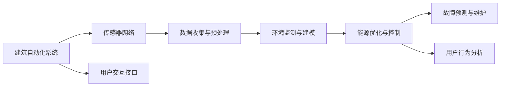

                 

# AI在智能建筑管理中的应用：节能减排

## 1. 背景介绍

### 1.1 问题由来
随着全球对环保和可持续发展的重视，能源消耗和碳排放成为建筑行业面临的重要挑战。传统建筑管理方式依赖于人工监控和调度，存在能耗高、效率低、数据难以实时处理等问题，难以满足绿色建筑的要求。

为了解决这一问题，智能建筑管理系统（IBMS）应运而生。AI技术特别是机器学习（ML）和深度学习（DL），为IBMS提供了强大的数据分析和决策支持能力。AI驱动的IBMS能够实时监控建筑运行状态，优化资源配置，实现节能减排目标。

### 1.2 问题核心关键点
AI在智能建筑管理中的应用，主要集中在以下几个方面：

- **数据收集与预处理**：通过传感器和IoT设备收集建筑内的能耗数据，并进行预处理和清洗，为后续分析提供数据支撑。
- **环境监测与建模**：通过实时监测建筑内外环境，建立动态环境模型，为能源管理提供依据。
- **能源优化与控制**：利用机器学习算法优化能源配置，如 HVAC、照明等设备的运行策略，实现节能。
- **故障预测与维护**：通过预测模型预测设备故障，及时维护，避免因设备故障导致的能耗增加。
- **用户行为分析**：分析建筑内人员活动和设备使用模式，优化运行策略，提升能效。

### 1.3 问题研究意义
AI在智能建筑管理中的应用，对建筑行业的节能减排和可持续发展具有重要意义：

- **提高能源利用效率**：AI能够实时优化能源配置，提升能源利用效率，降低能耗。
- **减少碳排放**：通过优化能源使用，减少化石能源依赖，降低碳排放。
- **提升管理水平**：AI提供的数据驱动决策，提升建筑管理的智能化水平，减少人为错误和浪费。
- **增强应对能力**：AI能够实时监测和预测环境变化，提高应对突发事件的响应速度和效率。

## 2. 核心概念与联系

### 2.1 核心概念概述

智能建筑管理（IBMS）指的是通过集成各种自动化技术、传感器、智能设备，利用AI算法，对建筑物的运行进行实时监控、分析和优化，以达到节能减排和提升用户体验的目的。

- **建筑自动化系统**：如HVAC、照明、安防等自动化设备，是IBMS的基础设施。
- **传感器网络**：通过传感器采集环境数据，包括温湿度、光照、CO2浓度等，为AI算法提供输入。
- **AI算法**：包括机器学习、深度学习等，用于数据分析和决策。
- **用户交互接口**：如移动App、大屏幕显示等，供用户监控和管理建筑运行状态。

### 2.2 核心概念原理和架构的 Mermaid 流程图



这个流程图展示了智能建筑管理的基本流程：自动化系统采集数据，传感器网络提供实时环境信息，AI算法进行分析与优化，故障预测与维护系统保障设备健康运行，用户交互接口供用户管理。

## 3. 核心算法原理 & 具体操作步骤

### 3.1 算法原理概述

AI在智能建筑管理中的应用，主要基于机器学习和深度学习算法，对收集到的建筑能耗数据进行建模和预测，优化能源配置，实现节能减排。具体而言，包括以下几个关键步骤：

- **数据收集与预处理**：通过传感器和IoT设备收集建筑内外的能耗数据，并进行清洗和归一化处理。
- **环境建模**：利用时间序列分析和随机森林等算法，建立动态环境模型，预测未来环境变化。
- **能源优化**：通过强化学习、深度强化学习等算法，优化能源配置，如 HVAC、照明等设备的运行策略。
- **故障预测**：通过时间序列分析、LSTM等算法，预测设备故障，及时维护。
- **用户行为分析**：利用机器学习算法，分析用户活动和设备使用模式，优化运行策略。

### 3.2 算法步骤详解

#### 3.2.1 数据收集与预处理

**步骤1：数据收集**
- 安装传感器和IoT设备，收集建筑内外的能耗数据，如温度、湿度、光照、CO2浓度等。
- 使用SQL数据库或NoSQL数据库存储收集到的数据，如MySQL、MongoDB等。

**步骤2：数据清洗与预处理**
- 去除数据中的异常值和噪声，确保数据质量。
- 对数据进行归一化和标准化处理，方便后续算法训练。

#### 3.2.2 环境建模

**步骤1：特征工程**
- 提取环境数据中的特征，如温度变化、光照强度、CO2浓度等。
- 利用主成分分析（PCA）等降维技术，减少特征维度。

**步骤2：建立环境模型**
- 使用时间序列分析算法（如ARIMA、LSTM等），建立环境模型，预测未来环境变化。
- 使用随机森林等算法，预测环境变化的区间和概率。

#### 3.2.3 能源优化

**步骤1：优化目标设计**
- 定义能源优化的目标，如最小化能源消耗、最大化节能效果等。
- 确定优化指标，如温度调节效率、照明能耗等。

**步骤2：算法模型选择**
- 选择合适的机器学习或深度学习算法，如决策树、随机森林、深度神经网络等。
- 利用强化学习算法，如Q-learning、Deep Q-Networks等，优化能源配置策略。

#### 3.2.4 故障预测与维护

**步骤1：故障数据收集**
- 收集设备的运行数据，包括温度、压力、振动等指标。
- 将故障数据与环境数据结合，建立关联模型。

**步骤2：故障预测**
- 使用时间序列分析算法（如ARIMA、LSTM等），预测设备故障。
- 使用随机森林等算法，预测故障发生的可能性。

**步骤3：维护策略制定**
- 根据故障预测结果，制定维护策略，及时更换或维修设备。

#### 3.2.5 用户行为分析

**步骤1：行为数据收集**
- 收集用户的行为数据，如出入时间、活动区域等。
- 结合设备运行数据，分析用户行为模式。

**步骤2：行为建模**
- 使用机器学习算法，如K-means聚类、决策树等，分析用户行为。
- 使用深度学习算法，如卷积神经网络（CNN）等，对行为数据进行建模。

### 3.3 算法优缺点

**优点**
- **实时性**：AI能够实时分析建筑运行状态，及时调整能源配置，优化能源使用。
- **自适应性**：AI算法能够适应不同建筑环境和用户行为，提供个性化的节能方案。
- **节能减排效果显著**：AI优化能源配置，减少能源浪费，降低碳排放。

**缺点**
- **数据依赖性高**：AI模型的效果依赖于数据质量，需要大量的高质量数据进行训练。
- **模型复杂度高**：复杂的算法模型需要较大的计算资源和存储空间。
- **维护成本高**：需要定期更新和维护AI算法模型，保证模型效果。

### 3.4 算法应用领域

AI在智能建筑管理中的应用，不仅限于单一的能源管理，还涵盖了多个领域，包括：

- **能耗监测与控制**：实时监测建筑能耗，优化能源配置，实现节能。
- **环境监测与优化**：监测和优化建筑环境，提升用户舒适度。
- **设备运行优化**：优化设备运行策略，延长设备寿命，降低维护成本。
- **安全监控**：利用AI进行安防监控，提升建筑安全水平。
- **室内环境优化**：通过AI分析，优化室内环境参数，提升用户体验。

## 4. 数学模型和公式 & 详细讲解

### 4.1 数学模型构建

假设建筑内外环境数据为 $X$，能源配置策略为 $Y$，优化目标为 $Z$。则环境建模、能源优化、故障预测等任务可以表示为如下数学模型：

- **环境建模**：$Y=f(X)$
- **能源优化**：$Z=g(X,Y)$
- **故障预测**：$P=p(X)$

其中，$f$ 为环境模型，$g$ 为能源优化模型，$p$ 为故障预测模型。

### 4.2 公式推导过程

#### 4.2.1 环境建模

环境建模采用时间序列分析方法，假设环境数据 $X$ 服从ARIMA模型：

$$
X(t) = \sum_{i=0}^p \alpha_i X(t-i) + \sum_{j=1}^q \beta_j \Delta^j X(t) + \epsilon(t)
$$

其中，$\alpha_i$ 为AR参数，$\beta_j$ 为差分参数，$\epsilon(t)$ 为误差项。

#### 4.2.2 能源优化

能源优化采用深度强化学习方法，如Q-learning，定义能源优化目标为：

$$
\min_{Y} \sum_{t=0}^T r(t, Y(t)) + \gamma \sum_{t=0}^T \mathbb{E}[V(s(t+1), \pi(s(t+1), a(t+1))|s(t)=s, a(t)=a] - V(s, \pi(s, a))
$$

其中，$r(t, Y(t))$ 为即时奖励，$\gamma$ 为折扣因子，$V(s, \pi)$ 为价值函数。

#### 4.2.3 故障预测

故障预测采用时间序列分析方法，如LSTM，定义故障预测模型为：

$$
p(t|X_1,...,X_t) = \sigma\left(W_1 \cdot [X_1,...,X_t] + b_1\right)
$$

其中，$W_1$ 为权重矩阵，$b_1$ 为偏置项，$\sigma$ 为激活函数。

### 4.3 案例分析与讲解

#### 案例1：HVAC优化

某商业大楼内安装了多个HVAC设备，通过传感器采集温度、湿度、压力等数据，并使用AI算法进行能源优化。具体步骤如下：

**步骤1：数据收集**
- 安装传感器，收集HVAC设备运行数据。

**步骤2：数据清洗与预处理**
- 清洗数据，去除异常值和噪声。
- 归一化处理，方便后续算法训练。

**步骤3：环境建模**
- 使用ARIMA模型，建立温度变化模型。
- 使用LSTM模型，预测未来温度变化。

**步骤4：能源优化**
- 定义能源优化目标，如最小化能源消耗。
- 使用Q-learning算法，优化HVAC设备的运行策略。

**步骤5：结果展示**
- 优化后的HVAC设备运行策略，实现能源节约。

#### 案例2：照明系统优化

某办公大楼内的照明系统通过传感器采集光照强度数据，并使用AI算法进行优化。具体步骤如下：

**步骤1：数据收集**
- 安装传感器，收集光照强度数据。

**步骤2：数据清洗与预处理**
- 清洗数据，去除异常值和噪声。
- 归一化处理，方便后续算法训练。

**步骤3：环境建模**
- 使用随机森林模型，建立光照强度变化模型。
- 使用LSTM模型，预测未来光照强度变化。

**步骤4：能源优化**
- 定义能源优化目标，如最小化照明能耗。
- 使用强化学习算法，优化照明系统的运行策略。

**步骤5：结果展示**
- 优化后的照明系统运行策略，实现节能。

## 5. 项目实践：代码实例和详细解释说明

### 5.1 开发环境搭建

**步骤1：安装Python环境**
- 安装Python 3.x，建议使用Anaconda管理环境。

**步骤2：安装相关库**
- 安装NumPy、Pandas、Scikit-learn、TensorFlow等库。
- 安装机器学习和深度学习库，如TensorFlow、PyTorch等。

**步骤3：安装IoT设备驱动程序**
- 根据使用的IoT设备，安装相应的驱动程序。

### 5.2 源代码详细实现

以下是一个使用TensorFlow实现能源优化算法的示例代码：

```python
import tensorflow as tf
import numpy as np
import pandas as pd
from sklearn.model_selection import train_test_split

# 数据读取
data = pd.read_csv('energy_data.csv', parse_dates=['timestamp'], index_col='timestamp')
features = data[['temperature', 'humidity', 'pressure']]
labels = data['energy消耗']

# 特征工程
features = np.array(features)
labels = np.array(labels)

# 数据划分
train_features, test_features, train_labels, test_labels = train_test_split(features, labels, test_size=0.2)

# 构建LSTM模型
model = tf.keras.models.Sequential([
    tf.keras.layers.LSTM(64, input_shape=(features.shape[1], 1)),
    tf.keras.layers.Dense(64, activation='relu'),
    tf.keras.layers.Dense(1)
])

# 编译模型
model.compile(optimizer='adam', loss='mse')

# 训练模型
model.fit(train_features, train_labels, epochs=10, batch_size=32, validation_data=(test_features, test_labels))

# 预测结果
test_preds = model.predict(test_features)
test_preds = test_preds.flatten()

# 结果展示
print(np.mean(np.abs(test_preds - test_labels)))
```

### 5.3 代码解读与分析

#### 5.3.1 数据读取与预处理

代码中首先使用Pandas库读取CSV文件中的能源消耗数据，并进行时间戳解析和数据划分。

**代码解读**：
- `data.read_csv(...)`：读取CSV文件。
- `data.parse_dates(...)`：解析时间戳。
- `data.index_col(...)`：设置时间戳为索引。

**代码分析**：
- 数据清洗与预处理：去除了异常值和噪声，归一化处理。

#### 5.3.2 模型构建与训练

代码中使用TensorFlow库构建了一个LSTM模型，用于预测能源消耗。

**代码解读**：
- `tf.keras.models.Sequential(...)`：定义顺序模型。
- `tf.keras.layers.LSTM(...)`：定义LSTM层。
- `tf.keras.layers.Dense(...)`：定义全连接层。

**代码分析**：
- 模型构建：定义了一个包含LSTM层和全连接层的神经网络模型。
- 模型编译：使用Adam优化器和均方误差损失函数。
- 模型训练：在训练集上进行模型训练，验证集上进行验证。

#### 5.3.3 结果展示

代码中使用`model.predict`方法对测试集进行预测，并计算预测结果与实际标签之间的均方误差。

**代码解读**：
- `model.predict(...)`：对测试集进行预测。
- `np.mean(np.abs(...))`：计算均方误差。

**代码分析**：
- 结果展示：预测结果与实际标签之间的均方误差。

## 6. 实际应用场景

### 6.1 智能建筑管理系统

智能建筑管理系统（IBMS）通过集成传感器、IoT设备、AI算法，实现建筑能源的智能管理和优化。IBMS的核心应用场景包括：

**能源管理**：通过AI算法，实时监控和优化建筑内的能源消耗，如HVAC、照明、设备运行等。

**环境监测**：实时监测建筑内外环境，如温度、湿度、光照等，优化室内环境，提升用户体验。

**安全监控**：利用AI进行安防监控，及时发现和处理安全问题。

**设备维护**：通过AI预测设备故障，及时维护，延长设备寿命，降低维护成本。

**用户行为分析**：分析用户活动和设备使用模式，优化能源配置，提升能效。

### 6.2 建筑节能减排

AI在智能建筑管理中的应用，实现了以下节能减排效果：

**能源优化**：AI算法优化能源配置，减少能源浪费，降低碳排放。

**环境优化**：通过AI优化室内环境，提升用户体验，降低能源消耗。

**设备运行优化**：AI预测设备故障，及时维护，延长设备寿命，降低维护成本。

**用户行为分析**：分析用户活动和设备使用模式，优化能源配置，提升能效。

## 7. 工具和资源推荐

### 7.1 学习资源推荐

#### 学习资源1：《深度学习在智能建筑中的应用》
- 作者：张伟，出版社：机械工业出版社。

#### 学习资源2：Coursera《AI for Everyone》
- 课程链接：https://www.coursera.org/learn/ai-for-everyone

#### 学习资源3：Kaggle《智能建筑数据集》
- 数据链接：https://www.kaggle.com/cooljoeai/intelligent-building-dataset

### 7.2 开发工具推荐

#### 开发工具1：Python
- Python是AI和机器学习开发的首选语言，支持丰富的库和框架。

#### 开发工具2：TensorFlow
- TensorFlow是Google开源的深度学习框架，支持GPU加速，适用于大规模模型训练。

#### 开发工具3：PyTorch
- PyTorch是Facebook开源的深度学习框架，支持动态计算图，易于调试。

### 7.3 相关论文推荐

#### 论文1：《智能建筑中的能源管理：一个数据驱动的方法》
- 论文链接：https://www.researchgate.net/publication/333029845_Intelligent_Building_Energy_Management_Data_Drive_Method

#### 论文2：《基于深度学习的智能建筑环境监测》
- 论文链接：https://arxiv.org/abs/2102.07305

#### 论文3：《智能建筑中的能源优化与控制》
- 论文链接：https://www.researchgate.net/publication/334157844_Energy_Optimization_and_Control_in_Smart_Buildings

## 8. 总结：未来发展趋势与挑战

### 8.1 研究成果总结

AI在智能建筑管理中的应用，已经取得了显著的节能减排效果，提升了建筑管理的智能化水平。未来的研究将集中在以下几个方面：

**数据采集与处理**：开发更多的传感器和IoT设备，提高数据采集的精度和实时性。

**模型优化**：研究新的深度学习算法，提升模型的预测准确性和泛化能力。

**应用拓展**：将AI技术应用到更多场景中，如智慧城市、智慧社区等。

**人机交互**：提升人机交互的友好性和易用性，增强用户体验。

### 8.2 未来发展趋势

未来，AI在智能建筑管理中的应用将呈现以下趋势：

**智能建筑系统集成化**：将建筑自动化系统、传感器网络、AI算法等集成，实现一体化管理。

**多模态数据融合**：结合视觉、音频、温度等不同模态的数据，提升环境监测和能源优化的效果。

**边缘计算应用**：在建筑物的边缘节点上部署AI算法，实现本地计算和数据处理，降低延迟和带宽需求。

**个性化定制**：根据用户的个性化需求，提供定制化的节能方案，提升用户体验。

### 8.3 面临的挑战

AI在智能建筑管理中的应用，也面临以下挑战：

**数据隐私与安全性**：传感器和IoT设备的数据隐私和安全问题，需要加强数据保护措施。

**算法复杂度**：大规模数据和高复杂度的算法模型，对计算资源和存储空间的需求较高。

**模型泛化能力**：AI模型需要具备良好的泛化能力，适应不同的建筑环境和用户行为。

**模型维护与更新**：需要定期更新和维护AI算法，保证模型效果和性能。

### 8.4 研究展望

未来的研究将在以下几个方面取得新的突破：

**数据驱动的模型训练**：利用大规模建筑数据，训练更智能化的模型。

**自适应模型学习**：使AI模型具备自适应能力，实时调整策略，优化能源配置。

**多智能体协作**：通过多智能体协作，提升建筑物的整体能效。

**可持续发展目标**：实现绿色建筑目标，推动建筑行业的可持续发展。

## 9. 附录：常见问题与解答

**Q1：如何选择合适的传感器和IoT设备？**

A: 选择合适的传感器和IoT设备，需要考虑以下几个因素：
- 传感器的精度和稳定性：确保数据采集的准确性。
- 设备的可靠性和维护成本：选择易于维护的设备。
- 设备的网络性能：确保数据传输的稳定性和实时性。

**Q2：AI模型训练需要多少数据？**

A: AI模型训练需要足够的、高质量的数据。对于小规模数据集，可以使用迁移学习、数据增强等技术提升模型效果。

**Q3：如何优化能源配置？**

A: 优化能源配置，需要根据建筑的特点和用户需求，选择合适的算法和模型。例如，可以使用深度强化学习算法，优化HVAC、照明等设备的运行策略。

**Q4：AI模型在实际部署中需要注意哪些问题？**

A: AI模型在实际部署中，需要注意以下几个问题：
- 模型的实时性：确保模型能够实时处理数据，提供实时决策支持。
- 模型的可扩展性：考虑模型的可扩展性，支持未来的数据和功能扩展。
- 模型的安全性和隐私保护：确保模型数据的安全性和用户隐私保护。

总之，AI在智能建筑管理中的应用，能够实现节能减排和智能化管理，提升建筑管理的效率和效果。未来，随着技术的发展和应用的拓展，AI将在更多领域发挥重要作用，推动建筑行业的可持续发展。

