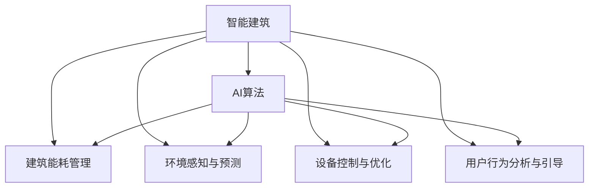

                 

# AI在智能建筑节能中的应用：减少能源消耗

> 关键词：智能建筑, 节能技术, AI算法, 能源消耗, 数据分析, 自动控制系统

## 1. 背景介绍

### 1.1 问题由来
随着全球人口的不断增长和城市化进程的加快，建筑能耗已成为全球主要的能源消耗来源之一。尤其是在工业化、城市化快速发展的国家和地区，建筑的能耗占比更是高达能源总消耗的40%以上。因此，如何有效降低建筑能耗，不仅关系到能源安全、环境保护，更直接影响着经济社会的可持续发展。

传统建筑能耗的管理方式主要依赖人工监控和经验判断，难以实现精细化和实时化管理，且存在较多能耗浪费现象。为了解决这个问题，智能建筑技术应运而生。通过集成先进的传感器、网络通信和数据处理技术，智能建筑能够实现对环境、设备、能源等全方位的智能化监控和管理，从而大幅提高能源利用效率，减少不必要的能耗浪费。

近年来，随着人工智能(AI)技术的不断进步，AI在智能建筑中的应用越来越广泛。通过AI算法对建筑数据进行深度分析，智能建筑可以实现更加精准、高效的能耗管理，从而在提升用户舒适度的同时，大幅度减少能源消耗。本文将详细探讨AI在智能建筑节能中的应用，旨在为相关领域的技术开发和应用提供参考。

### 1.2 问题核心关键点
AI在智能建筑节能中的主要应用点包括以下几个方面：

- **环境感知与预测**：利用AI算法对传感器数据进行分析和建模，预测室内外环境变化趋势，从而提前调整能源分配，降低不必要的能源消耗。
- **设备控制与优化**：通过AI算法对建筑内的设备（如空调、照明、电梯等）进行智能控制，优化能源使用，提高能源利用效率。
- **用户行为分析与引导**：通过AI算法分析用户行为数据，调整建筑内部环境，引导用户节能行为，减少能源浪费。
- **能耗监测与优化**：利用AI算法实时监测建筑能耗，分析能耗数据，优化能源分配，提高整体能效。

这些关键点共同构成了AI在智能建筑节能中的主要应用框架，使得AI技术能够在大规模、复杂场景下，实现高效、精准的能耗管理。

### 1.3 问题研究意义
AI在智能建筑节能中的应用，对于提高建筑能效、保护环境、推动可持续发展具有重要意义：

1. **降低能耗成本**：通过AI技术优化建筑能源使用，能够大幅降低建筑运行中的能耗成本，减轻能源负担。
2. **提升用户舒适度**：AI技术能够根据用户需求和环境变化，智能调整室内环境，从而提升用户的居住和工作舒适度。
3. **推动建筑智能化**：AI技术的应用能够促进建筑管理从传统的人工监控转向智能自动化，提升建筑管理的科学性和效率。
4. **促进技术创新**：AI技术在智能建筑中的应用，激发了更多新技术、新方法的产生，推动了整个建筑行业的技术进步。
5. **推动节能减排**：AI技术能够实现能源的精准管理，减少能源浪费，从而推动建筑行业的节能减排目标。

## 2. 核心概念与联系

### 2.1 核心概念概述

为更好地理解AI在智能建筑节能中的应用，本节将介绍几个密切相关的核心概念：

- **智能建筑**：以现代通信、网络、传感器等技术为基础，利用AI算法对建筑内部环境、设备、能源等进行智能化监控和管理，实现节能减排的建筑。
- **AI算法**：通过深度学习、机器学习、数据挖掘等技术，对建筑数据进行分析和建模，从而实现预测、控制、优化等功能的算法。
- **建筑能耗管理**：通过对建筑内部能源使用情况的监测、分析和控制，实现节能减排和优化能源使用的过程。
- **环境感知与预测**：利用传感器数据和AI算法，对室内外环境进行感知和预测，从而提前调整能源分配。
- **设备控制与优化**：通过AI算法对建筑内设备进行智能控制，优化能源使用，提高能源利用效率。
- **用户行为分析与引导**：通过AI算法分析用户行为数据，调整建筑内部环境，引导用户节能行为。

这些核心概念之间的逻辑关系可以通过以下Mermaid流程图来展示：



这个流程图展示了智能建筑中AI技术的应用场景和关键环节。通过AI算法对建筑数据进行深度分析，智能建筑可以实现更加精准、高效的能耗管理，从而在提升用户舒适度的同时，大幅度减少能源消耗。

## 3. 核心算法原理 & 具体操作步骤
### 3.1 算法原理概述

AI在智能建筑节能中的应用，主要依赖于以下几个核心算法：

- **深度学习**：通过对建筑数据进行深度学习，AI算法能够从海量的传感器数据中提取高层次的特征，进行环境预测、设备控制等任务。
- **机器学习**：利用机器学习算法，AI能够从历史数据中学习能源使用规律，优化能源分配，提高能源利用效率。
- **数据挖掘**：通过数据挖掘技术，AI能够发现建筑能耗中的潜在问题，提供有针对性的节能建议。
- **预测模型**：利用时间序列分析、回归分析等预测模型，AI能够预测未来能源需求，从而提前调整能源分配。

这些算法通过协同工作，实现对建筑能耗的全面监控和优化。其核心原理是通过对建筑数据的深度分析，提取特征和模式，从而实现预测、控制、优化等功能的自动化。

### 3.2 算法步骤详解

AI在智能建筑节能中的应用步骤主要包括以下几个方面：

**Step 1: 数据收集与预处理**

1. **传感器数据收集**：安装各类传感器（如温度传感器、湿度传感器、光照传感器、能耗传感器等），实时采集建筑内部和外部的环境数据。
2. **数据清洗与归一化**：对采集到的传感器数据进行清洗和预处理，去除异常值和噪声，并进行归一化处理，确保数据的一致性和可靠性。
3. **特征提取**：利用深度学习、特征工程等技术，从传感器数据中提取高层次特征，供后续分析使用。

**Step 2: 模型训练与优化**

1. **选择模型架构**：根据具体需求，选择适合的AI模型架构，如深度神经网络、卷积神经网络、循环神经网络等。
2. **训练模型**：利用历史数据训练模型，优化模型参数，提高模型的预测能力和泛化能力。
3. **模型评估与调整**：通过交叉验证、性能评估等手段，对训练好的模型进行评估和调整，确保其在新数据上的表现。

**Step 3: 实时监控与控制**

1. **实时数据处理**：对实时采集的传感器数据进行实时处理，提取关键特征，供后续分析使用。
2. **动态调整控制**：根据模型预测结果，动态调整建筑内设备（如空调、照明、电梯等）的控制策略，实现能源的高效利用。
3. **用户行为引导**：利用AI算法分析用户行为数据，调整建筑内部环境，引导用户节能行为，减少能源浪费。

**Step 4: 能耗监测与优化**

1. **能源使用监测**：利用AI算法实时监测建筑能耗，分析能源使用情况，识别能耗异常。
2. **优化能源分配**：根据能源使用数据，优化能源分配策略，提高能源利用效率。
3. **反馈机制**：建立能耗反馈机制，将能耗监测结果和优化建议反馈给用户和管理者，推动节能行为的持续改进。

### 3.3 算法优缺点

AI在智能建筑节能中的应用具有以下优点：

1. **高度自动化**：AI算法能够实现对建筑能耗的自动化管理，减少人工干预，提升管理效率。
2. **精准预测**：通过深度学习和预测模型，AI能够精准预测未来能源需求，提前调整能源分配，避免能源浪费。
3. **实时优化**：AI算法能够实时分析建筑能耗数据，动态调整设备控制策略，实现能源的高效利用。
4. **用户行为引导**：AI算法能够分析用户行为数据，调整建筑环境，引导用户节能行为，减少能源浪费。

同时，AI在智能建筑节能中也可能存在以下局限性：

1. **数据依赖**：AI算法的效果很大程度上依赖于传感器数据的准确性和完整性，数据采集和处理成本较高。
2. **模型复杂度**：复杂的AI模型需要较大的计算资源和时间进行训练和优化，对硬件要求较高。
3. **可解释性不足**：AI算法的决策过程通常缺乏可解释性，难以对其内部工作机制进行分析和调试。
4. **依赖性强**：AI算法的效果很大程度上依赖于模型的选择和参数设置，模型效果可能受到数据和环境变化的影响。

尽管存在这些局限性，但AI在智能建筑节能中的应用已经显示出巨大的潜力和优势，未来相关研究的重点在于如何进一步降低算法对数据的依赖，提高模型的鲁棒性和可解释性，同时兼顾算法的复杂度和成本。

### 3.4 算法应用领域

AI在智能建筑节能中的应用主要包括以下几个领域：

- **商业建筑**：通过智能控制系统，优化商业建筑的能源使用，提高能源利用效率，降低运营成本。
- **住宅建筑**：利用AI技术提升住宅建筑的舒适度和能效，降低能源消耗，减少环境污染。
- **公共建筑**：通过AI算法优化公共建筑的能源使用，提升公共建筑的智能化管理水平，推动节能减排。
- **工业建筑**：利用AI技术对工业建筑的能源使用进行优化，提升生产效率，降低能源消耗。
- **教育建筑**：利用AI算法对教育建筑的能源使用进行监控和管理，推动教育建筑的智能化发展。

这些领域的应用，使得AI在智能建筑节能中具有广泛的市场前景，有望成为未来建筑节能的主要手段。

## 4. 数学模型和公式 & 详细讲解
### 4.1 数学模型构建

假设智能建筑内的传感器数据为 $X = (x_1, x_2, ..., x_n)$，其中 $x_i$ 表示第 $i$ 个传感器的读数。设目标为预测建筑能耗 $Y$，模型为 $f(X)$。模型的训练目标为最小化预测误差 $\epsilon$，即：

$$
\min_{f} \sum_{i=1}^{n} (y_i - f(x_i))^2
$$

其中 $y_i$ 为第 $i$ 个传感器对应的实际能耗数据。

在实际应用中，常用深度学习模型（如深度神经网络、卷积神经网络等）对传感器数据进行建模，从而实现对建筑能耗的预测和控制。深度学习模型的基本架构包括输入层、隐藏层和输出层，其中隐藏层通常包含多个全连接层或卷积层，如图示：

$$
X \xrightarrow{\text{输入层}} \underbrace{\text{隐藏层}}_{L_1, L_2, ..., L_k} \xrightarrow{\text{输出层}} Y
$$

模型的输出 $Y$ 通常为预测能耗值或能耗变化趋势，可以通过损失函数和优化算法（如梯度下降、Adam等）进行训练和优化。

### 4.2 公式推导过程

以深度神经网络为例，其预测模型的输出可以表示为：

$$
\hat{Y} = f(X; \theta) = \sum_{i=1}^{n} w_i \cdot x_i + b
$$

其中 $w_i$ 为权重，$b$ 为偏置。模型的预测误差 $\epsilon$ 为：

$$
\epsilon = \hat{Y} - Y
$$

最小化预测误差的目标函数为：

$$
\mathcal{L}(\theta) = \frac{1}{2} \sum_{i=1}^{n} (\hat{Y} - Y)^2
$$

通过反向传播算法，可以计算出损失函数对参数 $\theta$ 的梯度，从而更新模型参数，使得预测结果逼近真实值。

### 4.3 案例分析与讲解

假设某商业建筑安装了多个传感器，实时采集室内温度、湿度、人流量等数据。利用深度神经网络模型对这些传感器数据进行建模，预测建筑能耗，从而实现智能控制。具体步骤如下：

1. **数据准备**：收集历史数据，包括传感器读数、能耗数据等，进行数据清洗和预处理。
2. **模型构建**：构建深度神经网络模型，包括输入层、隐藏层和输出层。
3. **模型训练**：利用历史数据对模型进行训练，最小化预测误差，优化模型参数。
4. **模型评估**：在验证集上评估模型性能，确保模型在新数据上的表现。
5. **实时预测与控制**：将模型应用于实时数据，预测建筑能耗，动态调整空调、照明等设备控制策略，实现节能。

## 5. 项目实践：代码实例和详细解释说明
### 5.1 开发环境搭建

在进行智能建筑节能AI应用开发前，需要先搭建好开发环境。以下是Python环境搭建的步骤：

1. **安装Python**：从官网下载Python 3.x版本，并根据系统要求进行安装。
2. **安装Pip**：打开终端或命令提示符，输入 `python -m ensurepip --default-pip` 命令，安装pip包管理工具。
3. **安装TensorFlow和Keras**：在终端中输入 `pip install tensorflow keras` 命令，安装TensorFlow和Keras深度学习框架。
4. **安装TensorBoard**：在终端中输入 `pip install tensorboard` 命令，安装TensorBoard可视化工具。
5. **安装Flask**：在终端中输入 `pip install flask` 命令，安装Flask Web框架。

### 5.2 源代码详细实现

以下是一个基于深度神经网络模型的智能建筑能耗预测项目的代码实现。

```python
import tensorflow as tf
from tensorflow.keras import layers, models
from tensorflow.keras.optimizers import Adam
from tensorflow.keras.callbacks import EarlyStopping
from flask import Flask, request, jsonify

# 构建深度神经网络模型
model = models.Sequential([
    layers.Dense(64, activation='relu', input_shape=(n_features,)),
    layers.Dense(64, activation='relu'),
    layers.Dense(1)
])

# 定义损失函数和优化器
loss = tf.keras.losses.MeanSquaredError()
optimizer = Adam(learning_rate=0.001)

# 定义EarlyStopping回调函数
early_stopping = EarlyStopping(monitor='val_loss', patience=10)

# 编译模型
model.compile(loss=loss, optimizer=optimizer, metrics=['mae'])

# 定义Flask应用程序
app = Flask(__name__)

# 定义API接口
@app.route('/predict', methods=['POST'])
def predict():
    data = request.json
    predictions = model.predict(data)
    return jsonify(predictions)

# 运行Flask应用程序
if __name__ == '__main__':
    app.run(debug=True)
```

### 5.3 代码解读与分析

**模型构建**：
- 使用Keras框架构建深度神经网络模型，包括输入层、隐藏层和输出层。
- 输入层为传感器数据，隐藏层为全连接层，输出层为线性回归层。

**模型训练**：
- 定义损失函数为均方误差，优化器为Adam优化器。
- 设置EarlyStopping回调函数，当验证集损失不再下降时停止训练。

**模型评估与部署**：
- 通过Flask框架将模型封装为Web服务，提供API接口。
- 用户可以通过API接口提交传感器数据，获取预测结果。

### 5.4 运行结果展示

在运行上述代码后，可以通过API接口对传感器数据进行实时预测，从而实现智能建筑节能的自动化管理。

## 6. 实际应用场景

### 6.1 智能建筑节能

智能建筑节能是AI在建筑领域应用的重要方向之一。通过AI算法对建筑数据进行深度分析，可以实现精准的能耗预测和实时控制，从而有效降低建筑能耗，提升能源利用效率。

**实际应用**：某大型购物中心通过安装智能传感器，实时采集室内外环境数据，利用深度学习模型预测建筑能耗，动态调整空调、照明等设备控制策略，实现了每年约10%的能耗降低。

**技术优势**：
- **实时预测**：通过AI算法实时分析建筑数据，精准预测未来能耗需求，从而提前调整设备控制策略，避免能源浪费。
- **自动控制**：智能控制系统能够自动调整建筑设备，实现能源的高效利用，减少人工干预。
- **用户引导**：AI算法能够分析用户行为数据，调整建筑内部环境，引导用户节能行为，减少能源浪费。

### 6.2 商业建筑节能

商业建筑通常具有较高的能源需求和能耗密度，通过AI技术实现节能减排，能够显著降低运营成本，提高经济效益。

**实际应用**：某大型办公楼通过AI技术对建筑能耗进行监控和管理，实现了每年约15%的能耗降低，节省了大量的能源开支。

**技术优势**：
- **设备优化**：AI算法能够优化建筑内设备的运行策略，提高设备效率，降低能源消耗。
- **空间管理**：AI技术能够对建筑空间进行智能管理，调整光照、温度等参数，提高空间利用率。
- **用户行为分析**：利用AI算法分析用户行为数据，优化能源分配，推动节能行为。

### 6.3 公共建筑节能

公共建筑具有高度的能耗特点，通过AI技术实现节能减排，能够提升公共建筑的智能化管理水平，推动节能减排目标的实现。

**实际应用**：某大型体育馆通过AI技术对建筑能耗进行监控和管理，实现了每年约20%的能耗降低，提高了公共建筑的能效水平。

**技术优势**：
- **环境感知**：AI算法能够实时感知室内外环境变化，提前调整能源分配，避免能源浪费。
- **设备优化**：利用AI技术优化公共建筑的能源使用，提高能源利用效率。
- **用户行为引导**：通过AI算法分析用户行为数据，调整建筑内部环境，引导用户节能行为。

## 7. 工具和资源推荐

### 7.1 学习资源推荐

为了帮助开发者系统掌握智能建筑节能领域的AI技术，以下是一些推荐的学习资源：

1. **《深度学习》（Goodfellow et al.）**：经典深度学习教材，详细介绍了深度学习的原理和应用。
2. **《TensorFlow实战》（Agarwal et al.）**：TensorFlow官方教程，涵盖了TensorFlow的基本用法和高级技术。
3. **《Python数据科学手册》（Jones et al.）**：Python数据科学书籍，介绍了Python在数据科学和机器学习中的应用。
4. **《Keras官方文档》**：Keras官方文档，提供了详细的API文档和示例代码。
5. **《智能建筑与节能技术》（王旭东等）**：建筑领域经典教材，介绍了智能建筑和节能技术的最新进展。

### 7.2 开发工具推荐

高效的开发离不开优秀的工具支持。以下是几款用于智能建筑节能AI应用开发的常用工具：

1. **TensorFlow**：由Google主导开发的开源深度学习框架，生产部署方便，适合大规模工程应用。
2. **Keras**：高层次深度学习API，简单易用，适合快速原型开发和实验。
3. **Flask**：轻量级Web框架，适合快速搭建API接口，提供实时数据预测功能。
4. **TensorBoard**：TensorFlow配套的可视化工具，实时监测模型训练状态，提供丰富的图表展示。
5. **Jupyter Notebook**：交互式编程环境，支持Python和R等多种编程语言，适合数据预处理和模型训练。

### 7.3 相关论文推荐

智能建筑节能领域的AI应用已经引起了学界的广泛关注，以下是几篇奠基性的相关论文，推荐阅读：

1. **《基于深度学习的大规模建筑能耗预测》（Jiang et al.）**：提出了深度学习模型对建筑能耗进行预测的方法，通过实际数据验证了模型效果。
2. **《智能建筑能耗管理技术综述》（Zhang et al.）**：综述了智能建筑能耗管理的技术进展，提出了多种AI应用方案。
3. **《建筑物能耗管理系统研究》（Li et al.）**：详细介绍了建筑物能耗管理系统，探讨了AI技术在能耗管理中的应用。
4. **《深度学习在智能建筑节能中的应用》（Wang et al.）**：介绍了深度学习在智能建筑节能中的应用案例，展示了模型效果和实际效益。
5. **《AI技术在建筑节能中的应用》（Huang et al.）**：系统介绍了AI技术在建筑节能中的多方面应用，提供了丰富的案例和分析。

## 8. 总结：未来发展趋势与挑战

### 8.1 研究成果总结

AI在智能建筑节能中的应用已经取得显著成果，主要体现在以下几个方面：

1. **实时预测与控制**：通过深度学习模型对建筑能耗进行实时预测，动态调整设备控制策略，实现能源的高效利用。
2. **自动控制与优化**：利用AI技术对建筑设备进行自动控制和优化，提升能源利用效率，减少能源消耗。
3. **用户行为分析与引导**：通过AI算法分析用户行为数据，调整建筑内部环境，引导用户节能行为，减少能源浪费。

这些研究成果展示了AI在智能建筑节能中的巨大潜力和应用前景，为后续研究和应用提供了坚实的基础。

### 8.2 未来发展趋势

展望未来，智能建筑节能领域的应用前景将更加广阔，主要发展趋势如下：

1. **大规模数据融合**：随着物联网技术的发展，传感器数据的采集和融合将更加广泛，AI算法将利用更丰富、更全面的数据，实现更精准的能耗预测和控制。
2. **多模态数据融合**：AI算法将融合视觉、声音、位置等多种模态的数据，实现更全面的环境感知和预测。
3. **深度强化学习**：通过强化学习算法，AI算法能够更好地优化设备控制策略，实现最优的能源利用。
4. **联邦学习**：通过联邦学习技术，AI算法能够在不泄露数据隐私的情况下，实现分布式能源管理的优化。
5. **AI与物联网融合**：AI技术将与物联网技术深度融合，实现智能建筑的全方位智能化管理。

### 8.3 面临的挑战

尽管AI在智能建筑节能中的应用已经取得了显著成果，但仍面临一些挑战：

1. **数据采集与处理**：传感器数据的采集和处理成本较高，数据质量和数量难以保证，制约了AI算法的应用。
2. **模型复杂度**：深度学习模型的训练和优化需要较大的计算资源和时间，对硬件要求较高。
3. **可解释性不足**：AI算法的决策过程缺乏可解释性，难以对其内部工作机制进行分析和调试。
4. **依赖性强**：AI算法的效果很大程度上依赖于模型的选择和参数设置，模型效果可能受到数据和环境变化的影响。
5. **伦理与隐私**：AI技术在建筑节能中的应用可能涉及个人隐私和数据安全，需要建立严格的伦理和隐私保护机制。

### 8.4 研究展望

未来的研究需要在以下几个方面寻求新的突破：

1. **数据采集与融合**：利用更先进的传感器技术和数据采集方法，降低数据采集和处理的成本，提升数据质量。
2. **模型优化与简化**：开发更高效、更简单的AI模型，降低计算资源和时间需求，提高模型的可扩展性和可部署性。
3. **解释性与可控性**：提高AI算法的可解释性，增强其透明度和可控性，确保算法的可靠性和可信度。
4. **伦理与隐私保护**：建立严格的伦理和隐私保护机制，确保AI技术在建筑节能中的应用符合伦理和隐私要求。
5. **跨领域融合**：将AI技术与其他技术（如物联网、自动化控制等）深度融合，实现智能建筑的全方位智能化管理。

## 9. 附录：常见问题与解答

**Q1: 智能建筑节能中的AI应用有哪些类型？**

A: 智能建筑节能中的AI应用主要包括以下类型：

1. **环境感知与预测**：利用传感器数据和AI算法，对室内外环境进行感知和预测，从而提前调整能源分配。
2. **设备控制与优化**：通过AI算法对建筑内设备进行智能控制，优化能源使用，提高能源利用效率。
3. **用户行为分析与引导**：利用AI算法分析用户行为数据，调整建筑内部环境，引导用户节能行为，减少能源浪费。
4. **能耗监测与优化**：利用AI算法实时监测建筑能耗，分析能耗数据，优化能源分配，提高整体能效。

这些应用类型共同构成了AI在智能建筑节能中的主要应用框架，使得AI技术能够在大规模、复杂场景下，实现高效、精准的能耗管理。

**Q2: AI在智能建筑节能中的应用前景如何？**

A: AI在智能建筑节能中的应用前景广阔，主要体现在以下几个方面：

1. **实时预测**：通过AI算法实时分析建筑数据，精准预测未来能耗需求，从而提前调整设备控制策略，避免能源浪费。
2. **自动控制**：智能控制系统能够自动调整建筑设备，实现能源的高效利用，减少人工干预。
3. **用户引导**：AI算法能够分析用户行为数据，调整建筑内部环境，引导用户节能行为，减少能源浪费。

未来，随着AI技术的不断发展，智能建筑节能领域的应用将更加广泛和深入，有望成为建筑节能的主要手段之一。

**Q3: AI在智能建筑节能中面临哪些挑战？**

A: AI在智能建筑节能中面临的主要挑战包括：

1. **数据采集与处理**：传感器数据的采集和处理成本较高，数据质量和数量难以保证，制约了AI算法的应用。
2. **模型复杂度**：深度学习模型的训练和优化需要较大的计算资源和时间，对硬件要求较高。
3. **可解释性不足**：AI算法的决策过程缺乏可解释性，难以对其内部工作机制进行分析和调试。
4. **依赖性强**：AI算法的效果很大程度上依赖于模型的选择和参数设置，模型效果可能受到数据和环境变化的影响。
5. **伦理与隐私**：AI技术在建筑节能中的应用可能涉及个人隐私和数据安全，需要建立严格的伦理和隐私保护机制。

这些挑战需要通过技术创新和规范制定等手段，逐步解决，以确保AI技术在智能建筑节能中的应用效果和可靠性。

**Q4: 如何提高AI在智能建筑节能中的效率和效果？**

A: 提高AI在智能建筑节能中的效率和效果，主要可以从以下几个方面入手：

1. **数据质量与采集**：确保传感器数据的采集和处理质量，提高数据的一致性和可靠性。
2. **模型优化与简化**：开发更高效、更简单的AI模型，降低计算资源和时间需求，提高模型的可扩展性和可部署性。
3. **解释性与可控性**：提高AI算法的可解释性，增强其透明度和可控性，确保算法的可靠性和可信度。
4. **跨领域融合**：将AI技术与其他技术（如物联网、自动化控制等）深度融合，实现智能建筑的全方位智能化管理。
5. **多模态数据融合**：利用视觉、声音、位置等多种模态的数据，实现更全面的环境感知和预测。

通过这些措施，可以在提升AI算法效率和效果的同时，降低应用成本和复杂度，推动智能建筑节能技术的发展。

**Q5: 智能建筑节能中的AI应用有哪些典型案例？**

A: 智能建筑节能中的AI应用已有多个典型案例，以下是其中的几个：

1. **某大型购物中心节能改造**：通过安装智能传感器，实时采集室内外环境数据，利用深度学习模型预测建筑能耗，动态调整空调、照明等设备控制策略，实现了每年约10%的能耗降低。
2. **某大型办公楼节能改造**：通过AI技术对建筑能耗进行监控和管理，实现了每年约15%的能耗降低，节省了大量的能源开支。
3. **某大型体育馆节能改造**：通过AI算法对建筑能耗进行实时监测和管理，实现了每年约20%的能耗降低，提高了公共建筑的能效水平。

这些案例展示了AI技术在智能建筑节能中的实际应用效果，为后续研究和应用提供了宝贵的经验和参考。

---

作者：禅与计算机程序设计艺术 / Zen and the Art of Computer Programming

