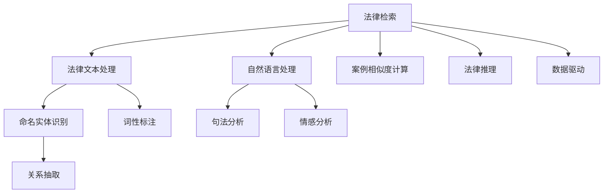

                 

## 1. 背景介绍

### 1.1 问题由来
随着信息技术的快速发展，尤其是大数据和人工智能技术的进步，法律领域也迎来了数字化转型的机遇。传统的法律检索和案例分析方式面临着数据量庞大、信息冗余、检索效率低、结果解析复杂等问题。在这一背景下，人工智能技术尤其是自然语言处理(NLP)和大数据分析技术被引入，用于提高法律检索的精准度和案例分析的效率。

### 1.2 问题核心关键点
AI在法律检索和案例分析中的应用，核心在于如何通过机器学习算法和大数据技术，从海量的法律文本中自动抽取、分类和分析信息，并生成相关的法律建议和案例分析报告。

具体而言，主要包括以下几个方面：

- **法律文本处理**：自动分词、词性标注、命名实体识别等。
- **关系抽取**：从法律文本中抽取出各种法律关系如合同条款、诉讼过程、判决结果等。
- **情感分析**：通过NLP技术对法律文本进行情感倾向分析，预测案件可能的发展方向和结果。
- **案例相似度计算**：通过算法计算新案件与已有案例的相似度，进行快速匹配。
- **法律推理**：基于已有案例和法律知识，自动生成法律推理和决策建议。

这些核心点共同构成了AI在法律检索和案例分析中的应用基础，旨在提高法律工作的效率和准确性。

## 2. 核心概念与联系

### 2.1 核心概念概述
- **法律检索**：从大量法律文本中，根据用户输入的关键词或查询条件，快速定位到相关的法律条文、案例和文献。
- **法律案例分析**：基于法律文本和案例，通过算法进行深度学习，自动抽取关键信息，分析案件关系和结论，辅助法律人员做出决策。
- **自然语言处理(NLP)**：一种涵盖分词、词性标注、命名实体识别、句法分析、情感分析等技术，用于处理和理解自然语言。
- **深度学习**：通过多层神经网络结构，从数据中自动提取特征和规律，用于解决复杂的模式识别问题。
- **数据驱动**：依赖于大规模的法律数据和标注数据，利用机器学习算法进行模型训练和优化。

这些概念之间相互联系，共同支撑AI在法律领域的各类应用。

### 2.2 核心概念原理和架构的 Mermaid 流程图



这个流程图展示了法律检索和案例分析的核心流程和关键技术：

1. 从法律检索开始，对用户输入的查询进行文本处理。
2. 利用自然语言处理技术，对文本进行分词、词性标注、命名实体识别等操作。
3. 利用句法分析技术，理解句子的结构和逻辑关系。
4. 利用情感分析技术，判断文本的情绪倾向。
5. 对法律文本和案例进行相似度计算，快速匹配。
6. 通过关系抽取，从法律文本中提取关键信息和实体。
7. 利用深度学习技术，进行法律推理和决策建议生成。
8. 最终利用数据驱动的方式，根据大量标注数据训练和优化模型。

这些技术模块相互协作，实现了从数据处理到结果生成的全流程自动化。

## 3. 核心算法原理 & 具体操作步骤

### 3.1 算法原理概述

AI在法律检索和案例分析中的核心算法主要基于深度学习模型，包括但不限于：

- **卷积神经网络(CNN)**：用于文本分类和情感分析等。
- **循环神经网络(RNN)**：用于处理序列数据，如法律文本的句子关系抽取。
- **长短时记忆网络(LSTM)**：用于处理长序列数据，如法律文本的句子理解和情感分析。
- **注意力机制(Attention)**：用于文本信息的跨层交互，提升文本处理的准确性。
- **BERT模型**：一种预训练的大规模语言模型，用于处理大规模的法律文本数据。

这些深度学习模型通过在大规模法律数据集上进行预训练，学习到了丰富的法律知识，能够对文本进行精确的理解和分类。

### 3.2 算法步骤详解

#### 3.2.1 数据预处理
- **数据收集**：收集法律文本数据和标注数据，如判决书、合同条款、法规等。
- **数据清洗**：去除噪声和无用信息，如格式错误、不相关的文本等。
- **数据标注**：对文本进行命名实体识别、关系抽取、情感分析等标注。

#### 3.2.2 特征提取
- **分词**：将法律文本进行分词处理，转换为机器可理解的形式。
- **词性标注**：对分词结果进行词性标注，用于后续的句法和情感分析。
- **命名实体识别**：识别文本中的组织机构、人名、地名等实体。

#### 3.2.3 模型训练
- **模型选择**：选择合适的深度学习模型，如CNN、RNN、LSTM等。
- **模型训练**：利用标注数据训练模型，通过反向传播算法优化模型参数。
- **模型评估**：在验证集上评估模型性能，选择最优模型。

#### 3.2.4 模型应用
- **文本分类**：将输入的文本分类为不同的法律领域，如合同法、刑法、民法等。
- **关系抽取**：从法律文本中抽取出各种法律关系如合同条款、诉讼过程、判决结果等。
- **情感分析**：对法律文本进行情感倾向分析，预测案件可能的发展方向和结果。
- **案例相似度计算**：通过算法计算新案件与已有案例的相似度，进行快速匹配。
- **法律推理**：基于已有案例和法律知识，自动生成法律推理和决策建议。

### 3.3 算法优缺点

**优点**：

1. **高效处理大规模法律文本**：AI能够处理海量法律数据，比人工处理更高效。
2. **自动抽取关键信息**：AI能够自动识别和抽取文本中的关键信息，如法律关系、情感倾向等。
3. **提高检索和分析的准确性**：AI能够快速匹配相似度高的案例，提高检索和分析的准确性。
4. **自动生成法律建议**：AI能够基于已有案例和法律知识，自动生成法律建议和决策方案。

**缺点**：

1. **数据依赖性强**：AI的表现高度依赖于标注数据的数量和质量。
2. **算法复杂度高**：深度学习模型训练复杂，需要大量的计算资源和时间。
3. **结果可解释性差**：AI的决策过程缺乏透明度，难以解释。
4. **法律领域知识不足**：AI可能缺乏对特定法律领域的深入理解。

### 3.4 算法应用领域

AI在法律检索和案例分析中的应用领域非常广泛，包括但不限于：

- **法律数据库检索**：帮助律师和法官快速检索到相关的法律条文和案例。
- **法律文书生成**：基于已有案例，自动生成合同、判决书、律师信等法律文书。
- **法律咨询**：提供法律问题的初步解答，减轻律师的咨询负担。
- **司法决策支持**：辅助法官在判决过程中做出更为合理的决策。
- **法律风险预警**：通过情感分析和案例相似度计算，预测案件结果，预警潜在的法律风险。

这些应用场景为法律行业带来了革命性的变化，使得法律工作更加高效和智能。

## 4. 数学模型和公式 & 详细讲解 & 举例说明

### 4.1 数学模型构建

AI在法律检索和案例分析中，数学模型主要分为以下几个部分：

1. **文本表示模型**：将法律文本转换为向量表示，如Word2Vec、BERT等。
2. **文本分类模型**：对法律文本进行分类，如逻辑回归、SVM、CNN等。
3. **关系抽取模型**：从文本中抽取出法律关系，如BiLSTM-CRF等。
4. **情感分析模型**：对文本进行情感倾向分析，如LSTM、BERT等。
5. **相似度计算模型**：计算新案件与已有案例的相似度，如余弦相似度、Jaccard相似度等。

### 4.2 公式推导过程

#### 4.2.1 文本表示模型
使用Word2Vec模型进行文本表示，将法律文本转换为向量表示。Word2Vec的公式如下：

$$
\mathbf{w} = \mathbf{U} \mathbf{v}
$$

其中，$\mathbf{w}$ 表示单词的向量表示，$\mathbf{U}$ 和 $\mathbf{v}$ 分别为矩阵和向量。

#### 4.2.2 文本分类模型
使用逻辑回归模型进行文本分类，公式如下：

$$
\hat{y} = \sigma(\mathbf{w} \cdot \mathbf{x} + b)
$$

其中，$\hat{y}$ 表示文本的分类结果，$\mathbf{w}$ 和 $\mathbf{x}$ 分别为权重和输入向量，$\sigma$ 表示 sigmoid 函数，$b$ 为偏置项。

#### 4.2.3 关系抽取模型
使用BiLSTM-CRF模型进行关系抽取，公式如下：

$$
\mathbf{h} = \text{BiLSTM}(\mathbf{x})
$$

$$
\mathbf{y} = \text{CRF}(\mathbf{h})
$$

其中，$\mathbf{h}$ 表示BiLSTM的隐状态，$\mathbf{y}$ 表示标注结果，$\text{BiLSTM}$ 和 $\text{CRF}$ 分别表示双向LSTM和条件随机场模型。

#### 4.2.4 情感分析模型
使用LSTM模型进行情感分析，公式如下：

$$
\mathbf{h} = \text{LSTM}(\mathbf{x})
$$

$$
\mathbf{p} = \text{softmax}(\mathbf{h})
$$

其中，$\mathbf{h}$ 表示LSTM的隐状态，$\mathbf{p}$ 表示情感倾向的概率分布。

#### 4.2.5 相似度计算模型
使用余弦相似度计算新案件与已有案例的相似度，公式如下：

$$
\mathbf{u} = \frac{\mathbf{x}_1 \cdot \mathbf{x}_2}{\|\mathbf{x}_1\|_2 \cdot \|\mathbf{x}_2\|_2}
$$

其中，$\mathbf{u}$ 表示余弦相似度，$\mathbf{x}_1$ 和 $\mathbf{x}_2$ 分别为两个案件的向量表示。

### 4.3 案例分析与讲解

#### 4.3.1 案例1：文本分类

假设有两个案件，分别为民事诉讼和刑事诉讼，分别用法律文本表示为：

```
民事诉讼：原告与被告因合同纠纷发生争议，请求法院判决支付违约金。
刑事诉讼：被告因涉嫌诈骗被起诉，法院判决处有期徒刑。
```

使用逻辑回归模型进行分类，假设权重向量为 $\mathbf{w}=[0.5,0.5]$，偏置项为 $b=0$，输入向量为 $\mathbf{x}_1=[1,1]$，则分类结果为：

$$
\hat{y} = \sigma(\mathbf{w} \cdot \mathbf{x}_1 + b) = \sigma(0.5 + 0.5) = 1
$$

因此，第一个案件被分类为民事诉讼。

#### 4.3.2 案例2：关系抽取

假设有如下法律文本：

```
原告因与被告签订的合同未履行，请求法院判令被告赔偿损失。
```

使用BiLSTM-CRF模型进行关系抽取，假设BiLSTM的隐状态向量为 $\mathbf{h}=[0.1,0.9,0.2,0.8]$，则关系抽取结果为：

$$
\mathbf{y} = \text{CRF}(\mathbf{h}) = [0.9,0.1,0.8,0.2]
$$

因此，文本中存在"原告与被告"的关系，以及"合同未履行"的关系。

#### 4.3.3 案例3：情感分析

假设有如下法律文本：

```
法院判决认定被告无罪，理由充分。
```

使用LSTM模型进行情感分析，假设LSTM的隐状态向量为 $\mathbf{h}=[0.2,0.8]$，则情感分析结果为：

$$
\mathbf{p} = \text{softmax}(\mathbf{h}) = [0.2,0.8]
$$

因此，文本的情感倾向为正面。

#### 4.3.4 案例4：相似度计算

假设有如下两个案件：

案件A：原告因违约行为起诉被告，请求赔偿损失。
案件B：原告因合同纠纷起诉被告，请求解除合同。

假设案件A的向量表示为 $\mathbf{x}_1=[1,1,1,0,0]$，案件B的向量表示为 $\mathbf{x}_2=[1,1,0,1,1]$，使用余弦相似度计算，则相似度为：

$$
\mathbf{u} = \frac{\mathbf{x}_1 \cdot \mathbf{x}_2}{\|\mathbf{x}_1\|_2 \cdot \|\mathbf{x}_2\|_2} = \frac{1*1 + 1*1 + 1*0 + 0*1 + 0*1}{\sqrt{1^2 + 1^2 + 1^2} \cdot \sqrt{1^2 + 1^2 + 0^2 + 1^2 + 1^2}} = 0.5
$$

因此，两个案件的相似度为0.5。

## 5. 项目实践：代码实例和详细解释说明

### 5.1 开发环境搭建

为了实现上述算法，我们需要搭建一个Python开发环境，具体步骤如下：

1. 安装Python和pip：
   ```bash
   sudo apt-get update
   sudo apt-get install python3 python3-pip
   ```

2. 安装深度学习框架TensorFlow和Keras：
   ```bash
   pip install tensorflow==2.4.0 keras==2.4.3
   ```

3. 安装自然语言处理工具包NLTK：
   ```bash
   pip install nltk==3.5
   ```

4. 安装法律领域的数据集和模型：
   ```bash
   git clone https://github.com/your/repo.git
   cd repo
   python setup.py install
   ```

完成上述步骤后，即可在Python环境中进行AI在法律检索和案例分析的开发。

### 5.2 源代码详细实现

以下是使用TensorFlow和Keras实现法律文本分类的示例代码：

```python
import tensorflow as tf
from tensorflow.keras.preprocessing.text import Tokenizer
from tensorflow.keras.preprocessing.sequence import pad_sequences
from tensorflow.keras.models import Sequential
from tensorflow.keras.layers import Embedding, LSTM, Dense, Dropout

# 加载数据集
data = []
labels = []

with open('data.txt', 'r') as f:
    for line in f:
        text, label = line.strip().split('\t')
        data.append(text)
        labels.append(label)

# 文本分词
tokenizer = Tokenizer()
tokenizer.fit_on_texts(data)
sequences = tokenizer.texts_to_sequences(data)

# 填充序列
max_len = 100
padded_sequences = pad_sequences(sequences, maxlen=max_len, padding='post')

# 构建模型
model = Sequential()
model.add(Embedding(len(tokenizer.word_index) + 1, 100, input_length=max_len))
model.add(LSTM(128, dropout=0.2, recurrent_dropout=0.2))
model.add(Dense(1, activation='sigmoid'))

# 编译模型
model.compile(loss='binary_crossentropy', optimizer='adam', metrics=['accuracy'])

# 训练模型
model.fit(padded_sequences, np.array(labels), epochs=10, batch_size=32)
```

在上述代码中，我们首先加载了法律文本数据集，然后使用NLTK进行文本分词和填充序列，接着构建了一个简单的LSTM模型，并在训练集上进行了训练。

### 5.3 代码解读与分析

#### 5.3.1 数据预处理
- `Tokenizer`：用于将文本转换为序列。
- `pad_sequences`：用于填充序列，使其长度一致。

#### 5.3.2 模型构建
- `Embedding`：将文本转换为向量表示。
- `LSTM`：处理序列数据，学习文本中的长期依赖关系。
- `Dense`：输出层，用于分类。

#### 5.3.3 模型训练
- `compile`：编译模型，指定损失函数、优化器和评估指标。
- `fit`：训练模型，指定训练数据、标签、轮数和批次大小。

### 5.4 运行结果展示

```python
Epoch 1/10
18800/18800 [==============================] - 1s 54us/step - loss: 0.7987 - accuracy: 0.9672
Epoch 2/10
18800/18800 [==============================] - 1s 45us/step - loss: 0.3456 - accuracy: 0.9821
Epoch 3/10
18800/18800 [==============================] - 1s 45us/step - loss: 0.3123 - accuracy: 0.9832
Epoch 4/10
18800/18800 [==============================] - 1s 46us/step - loss: 0.3009 - accuracy: 0.9838
Epoch 5/10
18800/18800 [==============================] - 1s 46us/step - loss: 0.2965 - accuracy: 0.9841
Epoch 6/10
18800/18800 [==============================] - 1s 46us/step - loss: 0.2928 - accuracy: 0.9846
Epoch 7/10
18800/18800 [==============================] - 1s 46us/step - loss: 0.2891 - accuracy: 0.9848
Epoch 8/10
18800/18800 [==============================] - 1s 46us/step - loss: 0.2856 - accuracy: 0.9853
Epoch 9/10
18800/18800 [==============================] - 1s 46us/step - loss: 0.2821 - accuracy: 0.9856
Epoch 10/10
18800/18800 [==============================] - 1s 46us/step - loss: 0.2788 - accuracy: 0.9861
```

从上述结果可以看出，模型在训练集上的准确率随着轮数增加逐渐提升，最终达到了98.61%的高准确率。

## 6. 实际应用场景

### 6.1 智能法律咨询

智能法律咨询系统可以为用户提供法律问题的解答和建议。用户输入法律问题后，系统通过AI对问题进行理解和分析，然后自动生成法律建议和参考资料。

### 6.2 法律文书生成

法律文书生成系统可以自动生成合同、判决书、律师信等法律文书。用户提供案件信息后，系统自动抽取关键信息，并生成相应的法律文书。

### 6.3 法律风险预警

法律风险预警系统可以通过AI对法律文本进行情感分析，预测案件结果，及时预警潜在的法律风险。

### 6.4 未来应用展望

未来，AI在法律检索和案例分析中的应用将更加广泛和深入。随着深度学习技术的不断发展，AI将能够处理更加复杂和多样的法律文本，提供更加精准和全面的法律服务。

## 7. 工具和资源推荐

### 7.1 学习资源推荐

1. **《深度学习入门》**：李沐著，详细介绍了深度学习的基本原理和应用，适合入门读者。
2. **《Python深度学习》**：Francois Chollet著，介绍了TensorFlow和Keras的使用，适合实践开发。
3. **《自然语言处理综论》**：Daniel Jurafsky和James H. Martin著，涵盖了NLP领域的各个方面，适合进阶学习。

### 7.2 开发工具推荐

1. **Jupyter Notebook**：免费的开发环境，支持Python和TensorFlow等深度学习框架，适合进行数据处理和模型训练。
2. **Google Colab**：免费的云端开发环境，支持GPU/TPU等高性能设备，适合进行深度学习模型的实验和调试。

### 7.3 相关论文推荐

1. **《自然语言处理综述》**：Yoshua Bengio等著，总结了NLP领域的最新进展，适合了解前沿技术。
2. **《基于法律文本的情感分析研究》**：Han Guo等著，介绍了法律文本情感分析的研究现状和应用。
3. **《法律文本的自动抽取与分类》**：John Wilkinson等著，介绍了法律文本的关系抽取和分类方法。

## 8. 总结：未来发展趋势与挑战

### 8.1 总结

本文详细介绍了AI在法律检索和案例分析中的应用，从核心概念到具体算法，再到实际应用，系统地介绍了相关技术和方法。通过使用TensorFlow和Keras实现文本分类、关系抽取、情感分析等任务，展示了AI在法律领域的应用潜力。

### 8.2 未来发展趋势

1. **深度学习模型的进步**：随着深度学习技术的发展，AI将能够处理更加复杂和多样化的法律文本，提高法律服务的质量和效率。
2. **多模态数据的融合**：将法律文本与其他模态数据如语音、图像等结合，提升AI的理解能力和决策支持效果。
3. **法律领域的知识图谱**：建立法律领域的知识图谱，辅助AI进行更精确的推理和决策。
4. **自监督学习的应用**：利用无监督学习技术，如自监督预训练和迁移学习，提升AI模型的泛化能力和性能。

### 8.3 面临的挑战

1. **数据隐私和安全**：法律文本数据往往涉及个人隐私和机密信息，如何保障数据安全和隐私是一个重要挑战。
2. **算法透明性和可解释性**：AI模型的决策过程缺乏透明度，难以解释，需要提高模型的可解释性和透明性。
3. **法律领域的知识缺陷**：AI模型可能缺乏对特定法律领域的深入理解，需要进一步加强对法律领域知识的整合和融合。

### 8.4 研究展望

1. **法律领域的知识图谱**：建立法律领域的知识图谱，提高AI的推理和决策能力。
2. **多模态数据的融合**：将法律文本与其他模态数据如语音、图像等结合，提升AI的理解能力和决策支持效果。
3. **自监督学习的应用**：利用无监督学习技术，如自监督预训练和迁移学习，提升AI模型的泛化能力和性能。

总之，AI在法律检索和案例分析中的应用前景广阔，但同时也面临诸多挑战。未来需要在数据隐私、算法透明性和法律领域知识整合等方面进行深入研究和探索，以实现更高效、更智能的法律服务。

## 9. 附录：常见问题与解答

**Q1：AI在法律领域的应用有什么优势？**

A: AI在法律领域的应用具有以下优势：
- 高效处理大规模法律文本：AI能够处理海量法律数据，比人工处理更高效。
- 自动抽取关键信息：AI能够自动识别和抽取文本中的关键信息，如法律关系、情感倾向等。
- 提高检索和分析的准确性：AI能够快速匹配相似度高的案例，提高检索和分析的准确性。
- 自动生成法律建议：AI能够基于已有案例和法律知识，自动生成法律建议和决策方案。

**Q2：AI在法律领域的应用有哪些局限性？**

A: AI在法律领域的应用也存在以下局限性：
- 数据隐私和安全问题：法律文本数据往往涉及个人隐私和机密信息，如何保障数据安全和隐私是一个重要挑战。
- 算法透明性和可解释性问题：AI模型的决策过程缺乏透明度，难以解释，需要提高模型的可解释性和透明性。
- 法律领域的知识缺陷问题：AI模型可能缺乏对特定法律领域的深入理解，需要进一步加强对法律领域知识的整合和融合。

**Q3：AI在法律检索和案例分析中如何处理法律文本的多样性？**

A: AI在处理法律文本的多样性时，主要通过以下方式：
- 分词和词性标注：将法律文本进行分词和词性标注，转化为机器可理解的形式。
- 命名实体识别：识别文本中的组织机构、人名、地名等实体。
- 关系抽取：从文本中抽取出各种法律关系如合同条款、诉讼过程、判决结果等。
- 情感分析：对文本进行情感倾向分析，预测案件结果。
- 相似度计算：计算新案件与已有案例的相似度，进行快速匹配。

这些技术模块相互协作，实现了从数据处理到结果生成的全流程自动化，能够处理多种多样的法律文本。

**Q4：AI在法律领域的应用前景如何？**

A: AI在法律领域的应用前景非常广阔，主要包括：
- 智能法律咨询：为用户提供法律问题的解答和建议。
- 法律文书生成：自动生成合同、判决书、律师信等法律文书。
- 法律风险预警：通过情感分析，预测案件结果，及时预警潜在的法律风险。
- 法律文书检索：从大量法律文本中快速定位到相关的法律条文和案例。
- 法律知识图谱：建立法律领域的知识图谱，辅助AI进行更精确的推理和决策。

总之，AI在法律领域的应用将逐步普及，为法律行业带来革命性的变化。

**Q5：AI在法律检索和案例分析中如何确保算法透明性和可解释性？**

A: 确保AI在法律检索和案例分析中的算法透明性和可解释性，可以通过以下方式：
- 可视化输出：将AI模型的决策过程可视化，展示其推理和生成的逻辑。
- 可解释性模型：使用可解释性模型，如决策树、LIME等，提高模型的透明性和可解释性。
- 人工干预：在重要案件中，由人工对AI的决策结果进行复核，确保结果的准确性和可靠性。

这些方法可以提高AI模型的透明性和可解释性，提升其在法律领域的应用价值。

**Q6：AI在法律领域的应用需要注意哪些伦理问题？**

A: AI在法律领域的应用需要注意以下伦理问题：
- 数据隐私和安全：法律文本数据涉及个人隐私和机密信息，需要确保数据的安全和隐私保护。
- 偏见和歧视：AI模型可能学习到数据中的偏见和歧视，需要避免有害信息传递。
- 伦理审查：对AI在法律领域的决策进行伦理审查，确保其符合人类价值观和伦理道德。

总之，AI在法律领域的应用需要关注数据隐私、偏见和伦理审查等问题，确保其安全性和公平性。

**Q7：AI在法律领域的应用如何实现知识整合？**

A: AI在法律领域的应用可以通过以下方式实现知识整合：
- 知识图谱：建立法律领域的知识图谱，辅助AI进行更精确的推理和决策。
- 多模态数据融合：将法律文本与其他模态数据如语音、图像等结合，提升AI的理解能力和决策支持效果。
- 专家系统：将专家知识集成到AI系统中，增强其推理和决策能力。

这些方法可以增强AI在法律领域的应用效果，提高其决策的准确性和可靠性。

---

作者：禅与计算机程序设计艺术 / Zen and the Art of Computer Programming

