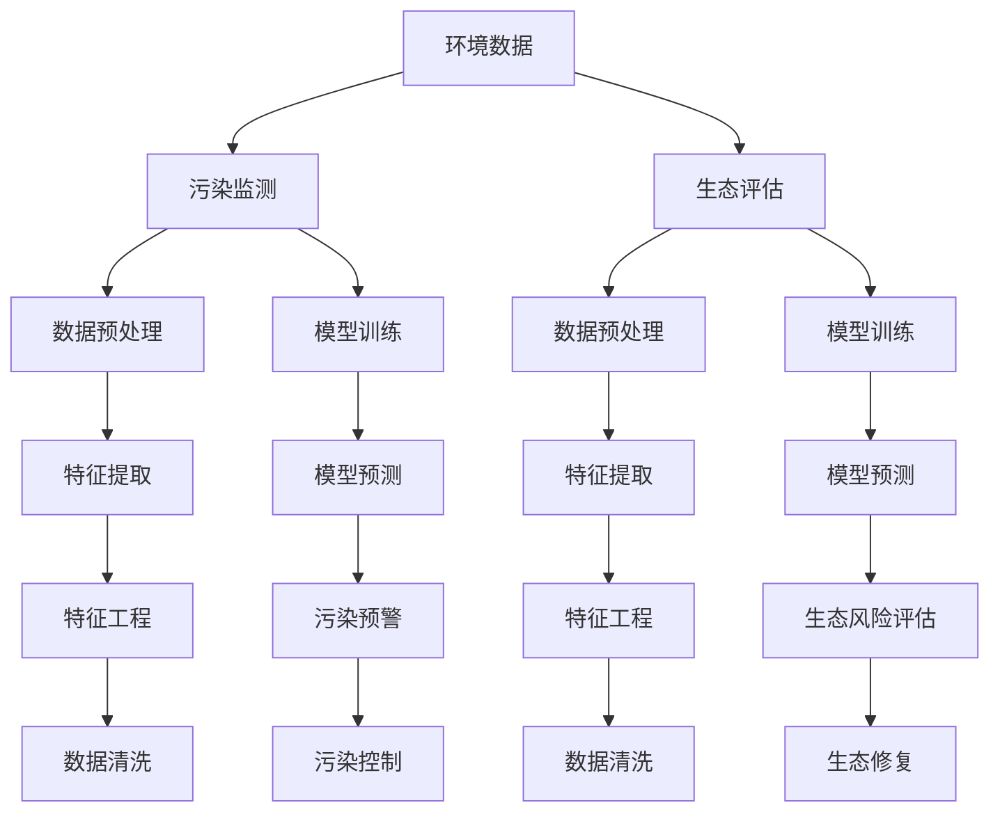

                 

# AI在环境保护中的应用：污染监测与生态评估

> 关键词：AI, 污染监测, 生态评估, 环境科学, 机器学习

## 1. 背景介绍

### 1.1 问题由来

环境保护是当今社会面临的重大挑战之一。随着工业化和城市化的快速推进，环境污染和生态破坏问题日益严峻。传统的监测和评估方法往往存在数据收集难度大、处理时间长、成本高昂等弊端。因此，利用人工智能(AI)技术对环境数据进行实时监测和智能分析，成为解决这一问题的新方向。

近年来，人工智能在环境保护中的应用逐渐增多，尤其是在污染监测和生态评估等领域。通过深度学习模型对大规模环境数据进行处理，可以发现数据中的异常和趋势，从而为环境保护提供决策支持。本文将重点介绍基于AI的污染监测和生态评估技术，包括关键算法、操作步骤、应用场景和未来展望等内容。

## 2. 核心概念与联系

### 2.1 核心概念概述

1. **污染监测**：通过对环境中的污染物浓度进行实时监测，判断环境质量状况，并预测污染趋势。
2. **生态评估**：利用AI技术对生态系统进行综合评估，识别生态风险，提供生态保护和修复建议。
3. **环境科学**：研究环境系统、环境问题、环境影响及其对策的科学。
4. **机器学习**：通过数据驱动的方法，让计算机从数据中学习规律和模式，自动提升预测和决策能力。
5. **深度学习**：一种特殊的机器学习方法，能够处理大规模非结构化数据，适用于复杂的环境监测任务。

### 2.2 核心概念原理和架构的 Mermaid 流程图



此流程图展示了环境数据从采集到处理、训练、预测和应用的全流程。通过污染监测和生态评估，结合模型训练和预测，最终实现环境污染的预警和生态系统的评估与修复。

## 3. 核心算法原理 & 具体操作步骤

### 3.1 算法原理概述

基于AI的污染监测和生态评估主要依赖于以下几类算法：

1. **数据预处理**：包括数据清洗、特征提取和数据标准化等步骤，是确保模型输入数据质量的基础。
2. **模型训练**：利用深度学习框架（如TensorFlow、PyTorch等），对模型进行训练，优化模型参数，提升模型性能。
3. **模型预测**：使用训练好的模型对新的环境数据进行预测，识别污染和生态风险，生成预警信息或评估报告。
4. **特征工程**：根据具体任务需求，选择和设计模型输入的特征，优化特征表示，提高模型泛化能力。
5. **模型评估**：通过交叉验证等方法，对模型进行评估，选择最优模型，应用于实际场景。

### 3.2 算法步骤详解

#### 3.2.1 数据预处理

1. **数据采集**：通过传感器、遥感设备等技术手段，获取环境数据。
2. **数据清洗**：去除噪声和异常值，处理缺失数据，确保数据质量。
3. **特征提取**：选择与环境问题相关的特征，如水质指标、大气污染浓度、土壤样本等。

#### 3.2.2 模型训练

1. **选择模型**：根据具体任务需求，选择适合的深度学习模型（如卷积神经网络、循环神经网络等）。
2. **划分数据集**：将数据集分为训练集、验证集和测试集，用于模型训练、调参和评估。
3. **模型训练**：使用训练集对模型进行训练，调整模型参数，优化损失函数。
4. **模型评估**：在验证集上评估模型性能，选择合适的超参数，防止过拟合。
5. **模型调优**：根据评估结果，调整模型结构和超参数，提升模型泛化能力。

#### 3.2.3 模型预测

1. **输入数据**：将新的环境数据输入到训练好的模型中。
2. **模型预测**：使用模型对输入数据进行预测，输出污染和生态风险评估结果。
3. **结果解释**：结合领域知识，对模型预测结果进行解释，生成易于理解的环境报告。

### 3.3 算法优缺点

#### 3.3.1 优点

1. **实时性强**：深度学习模型能够处理大规模非结构化数据，支持实时数据分析和预测。
2. **精度高**：深度学习模型通过大量数据训练，能够学习到更准确的规律和模式。
3. **泛化能力强**：模型能够处理未知数据，预测新环境下的污染和生态风险。
4. **自动化程度高**：自动化数据处理和模型训练过程，减少人工干预。

#### 3.3.2 缺点

1. **数据依赖性高**：模型的性能依赖于高质量的数据，数据采集难度大，成本高。
2. **计算资源需求大**：深度学习模型需要大量的计算资源，对硬件要求较高。
3. **模型复杂度高**：深度学习模型的结构和参数复杂，不易理解和调试。
4. **模型解释性差**：深度学习模型往往是"黑盒"模型，难以解释其决策过程。

### 3.4 算法应用领域

基于AI的污染监测和生态评估技术已经应用于多个领域，例如：

1. **空气质量监测**：利用传感器和大气监测设备，实时监测空气污染浓度，预测PM2.5、NO2等污染物的浓度变化。
2. **水环境监测**：通过水质监测站点，采集水质数据，预测水质变化趋势，判断水体污染状况。
3. **土壤污染监测**：使用土壤监测设备，获取土壤样本数据，评估土壤污染程度，识别污染源。
4. **生态系统评估**：利用遥感技术和图像识别技术，评估森林覆盖率、生态多样性等指标，识别生态系统变化。
5. **生态修复**：结合生态评估结果，制定生态修复方案，实施生态修复工程，恢复生态系统健康。

## 4. 数学模型和公式 & 详细讲解

### 4.1 数学模型构建

1. **输入数据**：假设环境数据为 $X = \{x_1, x_2, ..., x_n\}$，其中 $x_i$ 表示第 $i$ 个环境样本。
2. **输出标签**：假设环境监测的输出标签为 $Y = \{y_1, y_2, ..., y_n\}$，其中 $y_i$ 表示第 $i$ 个环境样本的污染等级或生态风险等级。
3. **模型结构**：假设选择的深度学习模型为 $M$，包含输入层、隐藏层和输出层。

### 4.2 公式推导过程

#### 4.2.1 输入特征表示

对于输入数据 $x_i$，首先需要将其转化为模型可处理的特征向量 $z_i$，通常使用PCA、TF-IDF等方法进行特征提取。

#### 4.2.2 模型训练

假设模型的损失函数为 $L$，模型的预测结果为 $\hat{y}_i = M(x_i)$，则模型训练的目标为最小化损失函数：

$$
\min_{\theta} \sum_{i=1}^n L(y_i, \hat{y}_i)
$$

其中 $\theta$ 表示模型的可训练参数。

#### 4.2.3 模型预测

对于新的输入数据 $x$，使用训练好的模型 $M$ 进行预测，得到预测结果 $\hat{y}$：

$$
\hat{y} = M(x)
$$

### 4.3 案例分析与讲解

#### 4.3.1 案例背景

某城市空气污染监测项目，需要实时监测PM2.5、NO2、SO2等污染物的浓度，预测未来24小时的污染趋势，并生成预警信息。

#### 4.3.2 数据处理

1. **数据采集**：使用传感器获取空气质量数据，包括PM2.5、NO2、SO2的浓度等。
2. **数据清洗**：去除异常值和噪声，处理缺失数据，确保数据质量。
3. **特征提取**：选择与污染相关的特征，如温度、湿度、风速等。

#### 4.3.3 模型训练

1. **选择模型**：选择卷积神经网络（CNN）作为模型结构，设计多个卷积层和池化层。
2. **划分数据集**：将数据集划分为训练集、验证集和测试集。
3. **模型训练**：使用训练集对模型进行训练，调整模型参数，优化损失函数。
4. **模型评估**：在验证集上评估模型性能，选择最优模型。

#### 4.3.4 模型预测

1. **输入数据**：将新的空气质量数据输入到训练好的模型中。
2. **模型预测**：使用模型预测未来24小时的PM2.5、NO2、SO2浓度。
3. **结果解释**：根据预测结果，生成预警信息，及时采取措施。

## 5. 项目实践：代码实例和详细解释说明

### 5.1 开发环境搭建

#### 5.1.1 环境依赖

- Python 3.7及以上版本
- TensorFlow 2.0及以上版本
- PyTorch 1.3及以上版本
- 相关环境依赖：numpy、scikit-learn、pandas等

#### 5.1.2 开发工具

- PyCharm：开发IDE，支持Python和深度学习模型开发。
- Jupyter Notebook：交互式开发环境，方便进行数据处理和模型训练。
- Git：版本控制工具，方便代码管理和协作。

#### 5.1.3 部署工具

- TensorFlow Serving：部署深度学习模型的服务框架，支持模型推理和调用。
- Flask：轻量级的Web框架，方便构建API接口。

### 5.2 源代码详细实现

#### 5.2.1 数据预处理

```python
import pandas as pd
from sklearn.preprocessing import MinMaxScaler

# 读取数据
data = pd.read_csv('air_pollution.csv')

# 数据清洗
data = data.dropna()

# 特征提取
features = data[['PM2.5', 'NO2', 'SO2', 'temperature', 'humidity', 'wind_speed']]
target = data['pollution_level']

# 数据标准化
scaler = MinMaxScaler(feature_range=(0, 1))
features = scaler.fit_transform(features)
```

#### 5.2.2 模型训练

```python
import tensorflow as tf
from tensorflow.keras.models import Sequential
from tensorflow.keras.layers import Conv2D, MaxPooling2D, Flatten, Dense

# 定义模型
model = Sequential()
model.add(Conv2D(32, (3, 3), activation='relu', input_shape=(None, None, 1)))
model.add(MaxPooling2D((2, 2)))
model.add(Flatten())
model.add(Dense(64, activation='relu'))
model.add(Dense(1, activation='sigmoid'))

# 编译模型
model.compile(optimizer='adam', loss='binary_crossentropy', metrics=['accuracy'])

# 训练模型
model.fit(features, target, epochs=10, batch_size=32, validation_split=0.2)
```

#### 5.2.3 模型预测

```python
import numpy as np

# 读取新的空气质量数据
new_data = pd.read_csv('new_air_pollution.csv')

# 数据预处理
new_data = new_data.dropna()
new_features = new_data[['PM2.5', 'NO2', 'SO2', 'temperature', 'humidity', 'wind_speed']]
new_features = scaler.transform(new_features)

# 模型预测
predictions = model.predict(new_features)
predictions = (predictions > 0.5).astype(int)
```

### 5.3 代码解读与分析

#### 5.3.1 数据预处理

- 使用Pandas读取数据，并去除缺失值和噪声。
- 使用MinMaxScaler进行特征标准化，确保数据在模型输入时具有相同的尺度。

#### 5.3.2 模型训练

- 使用TensorFlow定义卷积神经网络模型，包含卷积层、池化层和全连接层。
- 编译模型，并使用训练集进行训练，设置合适的小批量和验证集比例。
- 使用交叉验证等方法评估模型性能，选择最优模型。

#### 5.3.3 模型预测

- 读取新的空气质量数据，进行特征预处理。
- 使用训练好的模型进行预测，将预测结果转化为二分类输出。

### 5.4 运行结果展示

- 模型训练结果：在验证集上评估模型性能，输出准确率、损失等指标。
- 模型预测结果：对新的空气质量数据进行预测，输出污染等级。

## 6. 实际应用场景

### 6.1 智能监测预警

基于AI的污染监测和生态评估技术可以实时监测环境数据，快速识别异常情况，生成预警信息，及时采取措施。例如，在工业园区和重污染区域，通过传感器和大数据分析，可以实现环境污染的实时预警和应急响应。

#### 6.1.1 应用实例

某化工企业通过部署空气质量监测设备，实时采集厂区内的空气质量数据。使用基于CNN的深度学习模型对数据进行处理和分析，预测PM2.5和NO2的浓度变化，生成预警信息。当污染物浓度超过设定阈值时，系统自动报警，并采取措施，如降低生产负荷、启动应急处理设备等。

### 6.2 生态系统评估

AI技术可以综合分析遥感数据和地面调查数据，评估生态系统的健康状况，识别生态风险，提供生态保护和修复建议。例如，在森林资源监测中，利用卫星图像和无人机技术，获取森林覆盖率和植被指数数据，使用深度学习模型进行生态系统评估。

#### 6.2.1 应用实例

某国家级自然保护区通过无人机和卫星图像，获取森林覆盖率数据，使用卷积神经网络模型进行生态系统评估。评估结果显示森林覆盖率在过去五年中持续下降，系统自动生成报告，并提出森林保护和修复的建议。

### 6.3 环境健康管理

AI技术可以结合气象数据和环境监测数据，评估环境对人类健康的影响，提供健康预警和建议。例如，在城市热岛效应监测中，使用深度学习模型分析温度、湿度、风速等环境数据，评估热岛效应对人类健康的影响，生成预警信息。

#### 6.3.1 应用实例

某城市通过气象站和环境监测设备，获取温度、湿度、风速等数据，使用循环神经网络模型进行环境健康评估。评估结果显示热岛效应对呼吸系统疾病的影响显著增加，系统自动生成报告，并提出健康建议，如减少户外活动、佩戴口罩等。

### 6.4 未来应用展望

#### 6.4.1 实时智能决策

未来，基于AI的污染监测和生态评估技术将进一步提升实时智能决策能力。通过深度学习模型和大数据分析，实时生成环境监测报告和预警信息，帮助决策者快速应对突发事件，优化环境管理。

#### 6.4.2 跨域数据融合

AI技术可以融合多源数据，提升环境监测的全面性和准确性。例如，结合气象数据、卫星图像和地面调查数据，综合评估环境状况，提供更全面的环境监测报告。

#### 6.4.3 自动化系统集成

AI技术将与物联网、大数据、云计算等技术深度融合，构建自动化系统，实现环境监测、预警、评估和修复的全过程自动化。例如，通过传感器网络、物联网设备和云计算平台，实现环境监测数据的实时采集、存储、分析和应用。

## 7. 工具和资源推荐

### 7.1 学习资源推荐

1. 《深度学习基础》书籍：全面介绍深度学习的基本概念和算法，适合初学者入门。
2. 《环境数据科学》课程：斯坦福大学开设的跨学科课程，涵盖数据采集、处理和分析等知识点。
3. 《自然语言处理》课程：清华大学开设的NLP课程，涵盖文本处理、情感分析、语言模型等知识。
4. 《AI与环境》论文：综述性论文，全面介绍AI在环境保护中的应用，涵盖污染监测、生态评估、智能决策等多个方向。

### 7.2 开发工具推荐

1. PyTorch：灵活的深度学习框架，支持动态图和静态图两种计算图模式。
2. TensorFlow：高效的深度学习框架，支持分布式计算和自动微分。
3. Keras：高层次的深度学习框架，适合快速原型设计和模型训练。
4. Scikit-learn：开源的机器学习库，包含大量经典算法和工具函数。

### 7.3 相关论文推荐

1. "Air Quality Prediction Using Deep Learning Models"：介绍深度学习模型在空气质量预测中的应用。
2. "Ecological Risk Assessment Using AI Techniques"：利用AI技术进行生态系统风险评估的研究。
3. "Environmental Data Mining and Statistical Learning"：环境数据挖掘和统计学习方法综述，涵盖多个应用领域。

## 8. 总结：未来发展趋势与挑战

### 8.1 研究成果总结

基于AI的污染监测和生态评估技术已经在多个实际应用中取得显著成果，提升了环境监测的实时性、准确性和自动化水平。未来，随着技术的发展和应用场景的拓展，该技术将进一步发挥其在环境保护中的重要作用。

### 8.2 未来发展趋势

1. **深度学习模型的进一步优化**：深度学习模型将成为未来环境监测的核心技术，通过改进模型结构和训练方法，提升模型性能和泛化能力。
2. **多源数据融合**：融合多源数据，提升环境监测的全面性和准确性，实现跨域数据融合和协同处理。
3. **实时智能决策**：通过实时智能决策系统，提升环境管理效率和响应速度，优化环境决策过程。
4. **自动化系统集成**：将AI技术与物联网、大数据、云计算等技术深度融合，构建自动化环境监测和决策系统。
5. **环境健康管理**：结合环境监测数据和气象数据，评估环境对人类健康的影响，提供健康预警和建议。

### 8.3 面临的挑战

1. **数据质量问题**：环境数据采集和处理难度大，数据质量参差不齐，影响模型性能。
2. **计算资源需求高**：深度学习模型需要大量计算资源，对硬件设备要求较高。
3. **模型解释性差**：深度学习模型往往是"黑盒"模型，难以解释其决策过程。
4. **跨域数据融合难度大**：多源数据融合需要解决数据格式、单位、时间同步等问题，技术挑战较大。
5. **隐私和安全问题**：环境数据涉及个人隐私和敏感信息，数据存储和传输需要保障安全性和隐私性。

### 8.4 研究展望

未来，基于AI的污染监测和生态评估技术将进一步拓展应用场景，提升环境监测和管理水平。同时，研究者需要关注数据质量、计算资源、模型解释性等关键问题，推动技术创新和应用发展。

## 9. 附录：常见问题与解答

**Q1: 数据预处理包括哪些步骤？**

A: 数据预处理包括数据采集、数据清洗、特征提取和数据标准化等步骤。数据清洗主要是去除噪声和异常值，处理缺失数据。特征提取是选择与环境问题相关的特征，如水质指标、大气污染浓度、土壤样本等。数据标准化是将数据缩放到统一的尺度，方便模型处理。

**Q2: 如何选择适合的环境监测模型？**

A: 选择环境监测模型需要考虑数据类型、任务需求、计算资源等因素。常用的模型包括卷积神经网络、循环神经网络和深度学习集成模型等。可以通过实验比较不同模型的性能，选择最优模型。

**Q3: 如何评估环境监测模型的性能？**

A: 环境监测模型的评估指标包括准确率、召回率、F1分数、ROC曲线等。可以通过交叉验证、保留测试集等方法评估模型性能，选择最优模型。

**Q4: 环境监测模型部署需要注意哪些问题？**

A: 环境监测模型部署需要注意模型裁剪、量化加速、服务化封装、弹性伸缩和监控告警等问题。模型裁剪可以减小模型尺寸，提高推理速度。量化加速可以压缩模型存储空间，提升计算效率。服务化封装可以将模型封装为API接口，方便调用。弹性伸缩可以根据请求流量动态调整资源配置，平衡服务质量和成本。监控告警可以实时采集系统指标，设置异常告警阈值，确保服务稳定性。

---

作者：禅与计算机程序设计艺术 / Zen and the Art of Computer Programming

