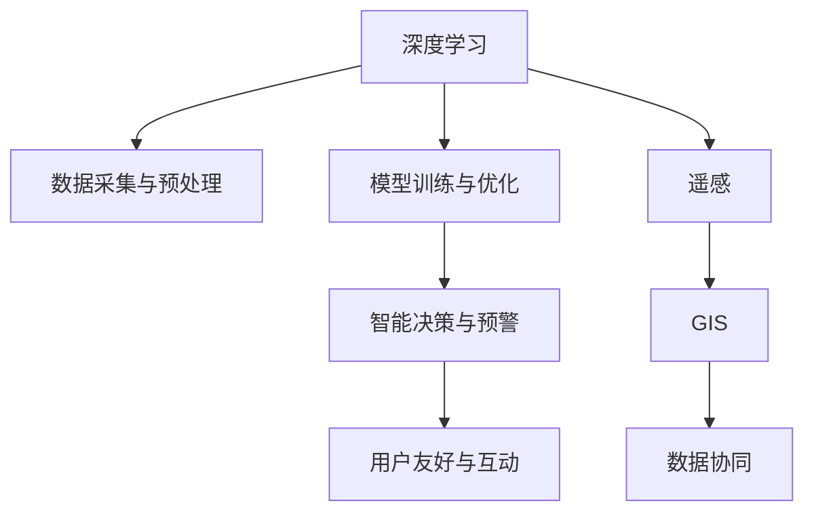

                 

## 1. 背景介绍

随着环境问题的日益严峻，如何利用AI技术提升环境监测和保护能力，已成为全球科研和产业界关注的热点。传统的环境监测往往依赖于人工采样和手动分析，费时费力，且受人为因素干扰大。AI技术，特别是深度学习模型，以其高效的自动化处理能力和大数据分析能力，为环境监测和保护提供了新的解决方案。

### 1.1 问题由来

环境监测和保护是人类社会发展的重要基础。然而，传统的监测方式往往存在数据采集成本高、处理速度慢、精度低等问题。例如，对大气、水质、噪音等环境指标的监测，往往需要人工采样和分析，难以实现大规模、高频率、实时化的监测。而AI技术的引入，使我们能够以更低成本、更高效率，实现对环境的持续监测和及时保护。

### 1.2 问题核心关键点

AI在环境监测和保护中发挥作用的核心关键点包括：

1. **数据自动化采集与预处理**：利用传感器、摄像头等设备自动采集环境数据，通过AI模型进行数据清洗和预处理，提高数据采集和处理的效率和准确性。

2. **模型训练与优化**：通过大量已标注数据训练深度学习模型，优化模型参数，使其能够准确预测环境指标，如空气质量、水质、噪音等。

3. **智能决策与预警**：将模型应用于实际监测场景，根据实时数据自动判断环境状况，并及时发出预警，辅助决策者采取应对措施。

4. **跨模态融合与数据协同**：将环境数据与地理信息系统(GIS)、遥感图像等多种数据源进行融合，实现多模态信息的协同监测和分析。

5. **用户友好与互动**：开发用户友好的界面，利用自然语言处理技术实现人与系统的互动，便于公众参与环境监测与保护。

## 2. 核心概念与联系

### 2.1 核心概念概述

为更好地理解AI在环境监测和保护中的作用，本节将介绍几个核心概念：

- **深度学习(Deep Learning)**：一种机器学习技术，通过多层次神经网络进行数据特征提取和模式识别。深度学习模型在图像识别、语音处理、自然语言处理等领域已取得广泛应用。

- **遥感(Remote Sensing)**：利用卫星、无人机等平台采集地球表面和大气的多光谱信息，用于地学研究、环境监测等。

- **环境监测与保护**：通过自动化设备采集环境数据，利用AI技术进行数据分析和处理，实现对环境状况的实时监测和预警，辅助决策者制定保护策略。

- **地理信息系统(GIS)**：一种集成、存储、查询、分析和显示地理信息的计算机系统，常用于环境监测和分析。

- **交叉学科整合**：将AI、遥感、GIS等多学科知识整合应用，提升环境监测和保护的系统性和实用性。

### 2.2 核心概念原理和架构的 Mermaid 流程图



这个流程图展示了AI在环境监测和保护中各关键环节的联系：

1. 数据采集与预处理：利用AI自动化技术采集和清洗数据。
2. 模型训练与优化：通过深度学习模型对环境数据进行训练和优化。
3. 智能决策与预警：根据实时数据进行环境状况评估，并发出预警。
4. 用户友好与互动：开发界面便于公众参与监测与保护。
5. 遥感：通过卫星等手段采集地球表面信息。
6. GIS：集成地理信息进行环境监测和分析。
7. 数据协同：融合多种数据源进行多模态分析。

## 3. 核心算法原理 & 具体操作步骤
### 3.1 算法原理概述

AI在环境监测和保护中的核心算法原理主要包括数据采集、预处理、深度学习模型训练、智能决策与预警等多个环节。

- **数据采集与预处理**：通过传感器、摄像头等设备自动采集环境数据，如空气质量、水质、噪音等。利用数据清洗和预处理技术，去除噪声和异常值，提高数据质量。

- **深度学习模型训练**：使用已标注的环境数据训练深度学习模型，如卷积神经网络(CNN)、循环神经网络(RNN)、长短期记忆网络(LSTM)等。这些模型通过学习环境数据的特征，能够对未来环境状况进行预测。

- **智能决策与预警**：将训练好的模型应用于实时环境数据，根据模型输出自动判断环境状况，并发出预警，辅助决策者采取应对措施。

### 3.2 算法步骤详解

基于深度学习的AI环境监测和保护，一般包括以下几个关键步骤：

**Step 1: 数据收集与预处理**
- 选择合适的传感器和设备，自动采集环境数据。
- 进行数据清洗和预处理，包括去除噪声、填补缺失值等。

**Step 2: 构建深度学习模型**
- 选择合适的深度学习架构，如CNN、LSTM、Transformer等。
- 设计任务适配层，如回归层、分类层等，适配具体的环境监测任务。

**Step 3: 模型训练与优化**
- 准备标注数据集，将环境数据与标签（如空气质量等级、水质状况等）一一对应。
- 使用优化器（如Adam、SGD等）和损失函数（如均方误差、交叉熵等）训练模型。
- 设置超参数，如学习率、批大小、迭代次数等。

**Step 4: 智能决策与预警**
- 将训练好的模型应用于实时环境数据，进行实时预测。
- 设定预警阈值，当模型输出超过阈值时，发出预警信号。
- 根据预警信息，辅助决策者采取行动，如加强监测、减少排放等。

**Step 5: 用户友好与互动**
- 开发友好的用户界面，方便公众获取环境信息。
- 利用自然语言处理技术，实现人与系统的互动，如智能问答、建议反馈等。

### 3.3 算法优缺点

深度学习在环境监测和保护中的应用具有以下优点：

1. **高效自动化**：利用AI技术自动采集和处理环境数据，提高监测效率。
2. **准确性高**：深度学习模型能够学习环境数据的复杂特征，提高预测准确性。
3. **实时性**：实时处理和分析环境数据，能够及时发出预警。
4. **数据融合能力**：能够整合多种数据源，提升监测系统的全面性和准确性。

同时，也存在一些缺点：

1. **数据依赖**：深度学习模型的性能依赖于标注数据的质量和数量，获取高质量数据成本较高。
2. **计算资源消耗大**：深度学习模型需要大量计算资源进行训练和推理，对硬件要求较高。
3. **黑盒特性**：模型决策过程难以解释，用户难以理解模型输出。
4. **模型泛化性**：不同环境下的模型泛化能力有限，需根据具体环境进行调整。

### 3.4 算法应用领域

AI在环境监测和保护中已广泛应用于多个领域，例如：

- **大气环境监测**：利用深度学习模型对空气质量指数(AQI)进行预测，评估大气污染状况。
- **水质监测**：通过遥感技术获取水体多光谱信息，利用深度学习模型预测水质状况。
- **噪音监测**：采集环境噪音数据，通过深度学习模型进行噪音源识别和分类。
- **生态保护**：利用遥感和AI技术监测森林覆盖、野生动物分布等，辅助生态保护决策。
- **气候变化研究**：结合气象数据和深度学习模型，分析气候变化趋势，预测极端天气事件。
- **城市治理**：通过AI技术监测城市交通、垃圾处理、能源消耗等，提升城市管理水平。

## 4. 数学模型和公式 & 详细讲解  
### 4.1 数学模型构建

假设环境监测数据为 $x$，模型预测结果为 $\hat{y}$，真实标签为 $y$。定义损失函数 $\mathcal{L}(\theta)$，其中 $\theta$ 为模型参数。对于分类任务，如空气质量预测，目标是最小化交叉熵损失函数：

$$
\mathcal{L}(\theta) = -\frac{1}{N}\sum_{i=1}^N [y_i \log \hat{y_i} + (1-y_i) \log(1-\hat{y_i})]
$$

其中 $N$ 为样本数量，$y_i$ 为样本 $i$ 的真实标签，$\hat{y_i}$ 为模型预测结果。

### 4.2 公式推导过程

对于回归任务，如水质监测，目标是最小化均方误差损失函数：

$$
\mathcal{L}(\theta) = \frac{1}{N}\sum_{i=1}^N (y_i - \hat{y_i})^2
$$

其中 $y_i$ 为样本 $i$ 的真实标签，$\hat{y_i}$ 为模型预测结果。

在损失函数定义后，利用梯度下降等优化算法进行模型参数的更新：

$$
\theta \leftarrow \theta - \eta \nabla_{\theta} \mathcal{L}(\theta)
$$

其中 $\eta$ 为学习率，$\nabla_{\theta} \mathcal{L}(\theta)$ 为损失函数对模型参数的梯度。

### 4.3 案例分析与讲解

以水质监测为例，假设我们有一个包含水质参数 $x_1, x_2, \ldots, x_n$ 的数据集，利用深度学习模型预测水质等级 $y$。首先，我们利用数据清洗和预处理技术处理数据，然后构建卷积神经网络(CNN)模型：

```python
import torch
import torch.nn as nn
import torch.optim as optim

# 定义CNN模型
class WaterQualityCNN(nn.Module):
    def __init__(self):
        super(WaterQualityCNN, self).__init__()
        self.conv1 = nn.Conv2d(in_channels=1, out_channels=16, kernel_size=3, stride=1, padding=1)
        self.conv2 = nn.Conv2d(in_channels=16, out_channels=32, kernel_size=3, stride=1, padding=1)
        self.fc1 = nn.Linear(in_features=32*10*10, out_features=64)
        self.fc2 = nn.Linear(in_features=64, out_features=1)

    def forward(self, x):
        x = nn.functional.relu(self.conv1(x))
        x = nn.functional.relu(self.conv2(x))
        x = x.view(x.size(0), -1)
        x = nn.functional.relu(self.fc1(x))
        x = self.fc2(x)
        return x

# 训练模型
model = WaterQualityCNN()
criterion = nn.MSELoss()
optimizer = optim.Adam(model.parameters(), lr=0.001)
```

在模型训练过程中，我们利用交叉熵损失函数进行优化：

```python
def train(model, train_loader, criterion, optimizer, n_epochs):
    for epoch in range(n_epochs):
        for i, (inputs, labels) in enumerate(train_loader):
            inputs, labels = inputs.to(device), labels.to(device)
            optimizer.zero_grad()
            outputs = model(inputs)
            loss = criterion(outputs, labels)
            loss.backward()
            optimizer.step()
```

通过上述代码，我们可以训练出一个能够预测水质等级的CNN模型。模型训练后，我们可以利用实时采集的水质数据，进行实时预测和预警。

## 5. 项目实践：代码实例和详细解释说明
### 5.1 开发环境搭建

在进行环境监测和保护项目开发前，我们需要准备好开发环境。以下是使用Python进行PyTorch开发的环境配置流程：

1. 安装Anaconda：从官网下载并安装Anaconda，用于创建独立的Python环境。

2. 创建并激活虚拟环境：
```bash
conda create -n env_name python=3.8 
conda activate env_name
```

3. 安装PyTorch：根据CUDA版本，从官网获取对应的安装命令。例如：
```bash
conda install pytorch torchvision torchaudio cudatoolkit=11.1 -c pytorch -c conda-forge
```

4. 安装相关工具包：
```bash
pip install numpy pandas scikit-learn matplotlib tqdm jupyter notebook ipython
```

完成上述步骤后，即可在`env_name`环境中开始项目开发。

### 5.2 源代码详细实现

下面我们以水质监测为例，给出使用PyTorch进行模型训练和预测的完整代码实现。

首先，定义模型和优化器：

```python
from torch.utils.data import DataLoader
import torch
import torch.nn as nn
import torch.optim as optim

# 定义CNN模型
class WaterQualityCNN(nn.Module):
    def __init__(self):
        super(WaterQualityCNN, self).__init__()
        self.conv1 = nn.Conv2d(in_channels=1, out_channels=16, kernel_size=3, stride=1, padding=1)
        self.conv2 = nn.Conv2d(in_channels=16, out_channels=32, kernel_size=3, stride=1, padding=1)
        self.fc1 = nn.Linear(in_features=32*10*10, out_features=64)
        self.fc2 = nn.Linear(in_features=64, out_features=1)

    def forward(self, x):
        x = nn.functional.relu(self.conv1(x))
        x = nn.functional.relu(self.conv2(x))
        x = x.view(x.size(0), -1)
        x = nn.functional.relu(self.fc1(x))
        x = self.fc2(x)
        return x

# 训练模型
model = WaterQualityCNN()
criterion = nn.MSELoss()
optimizer = optim.Adam(model.parameters(), lr=0.001)

# 定义数据集和数据加载器
train_dataset = # TODO: 定义训练集
test_dataset = # TODO: 定义测试集
train_loader = DataLoader(train_dataset, batch_size=16, shuffle=True)
test_loader = DataLoader(test_dataset, batch_size=16, shuffle=False)
```

然后，定义训练和评估函数：

```python
from tqdm import tqdm

def train(model, train_loader, criterion, optimizer, n_epochs):
    for epoch in range(n_epochs):
        for i, (inputs, labels) in tqdm(enumerate(train_loader)):
            inputs, labels = inputs.to(device), labels.to(device)
            optimizer.zero_grad()
            outputs = model(inputs)
            loss = criterion(outputs, labels)
            loss.backward()
            optimizer.step()

def evaluate(model, test_loader, criterion):
    model.eval()
    total_loss = 0
    with torch.no_grad():
        for inputs, labels in test_loader:
            inputs, labels = inputs.to(device), labels.to(device)
            outputs = model(inputs)
            loss = criterion(outputs, labels)
            total_loss += loss.item()
    return total_loss / len(test_loader)
```

最后，启动训练流程并在测试集上评估：

```python
n_epochs = 100
device = torch.device("cuda" if torch.cuda.is_available() else "cpu")

model.to(device)
train(model, train_loader, criterion, optimizer, n_epochs)
test_loss = evaluate(model, test_loader, criterion)
print(f"Test Loss: {test_loss:.4f}")
```

以上就是使用PyTorch进行水质监测模型训练和评估的完整代码实现。可以看到，PyTorch提供了丰富的深度学习库和工具，方便进行模型训练和评估。

### 5.3 代码解读与分析

让我们再详细解读一下关键代码的实现细节：

**WaterQualityCNN类**：
- `__init__`方法：定义模型结构，包括卷积层、全连接层等。
- `forward`方法：前向传播计算模型输出。

**train和evaluate函数**：
- `train`函数：遍历训练集，在每个批次上前向传播、反向传播和参数更新。
- `evaluate`函数：遍历测试集，计算模型在测试集上的损失，并返回平均损失。

**训练流程**：
- 定义训练集和测试集数据集，并准备数据加载器。
- 在每个epoch上，遍历训练集数据进行模型训练。
- 在每个epoch结束后，计算模型在测试集上的平均损失，并输出。

## 6. 实际应用场景
### 6.1 智能水务管理

基于深度学习的AI技术，可以应用于智能水务管理系统的建设，实现对水质、水量、水压等参数的实时监测和智能调控。

具体而言，可以部署多处水质监测点，采集水体多光谱信息，利用深度学习模型进行水质分析和预测。同时，结合地理信息系统(GIS)和物联网(IoT)技术，实时监测水流、水位、水压等参数，分析水资源分布情况，辅助水务部门进行智能调度和管理。

### 6.2 环境污染预警

AI技术可以用于实时监测大气、水质等环境指标，预测污染情况，及时发出预警。

例如，在城市大气监测中，可以部署大量的空气质量监测站点，实时采集PM2.5、PM10等污染物浓度数据，利用深度学习模型进行预测和分析，一旦发现污染物浓度异常，系统立即发出预警，并建议采取减排措施，如限行、禁烧等，防止环境污染进一步恶化。

### 6.3 生物多样性保护

AI技术可以应用于野生动植物监测和保护，通过遥感技术和深度学习模型，实现对生物多样性的动态监测和评估。

例如，利用无人机和卫星图像，采集森林覆盖、动物迁徙等数据，通过深度学习模型进行分析和预测，评估生态系统健康状况，并提出保护建议。此外，AI技术还可以用于自动识别和计数野生动物，帮助科学家进行种群数量分析。

## 7. 工具和资源推荐
### 7.1 学习资源推荐

为了帮助开发者系统掌握AI在环境监测和保护中的应用，这里推荐一些优质的学习资源：

1. Coursera《深度学习与环境监测》课程：斯坦福大学开设的深度学习课程，涵盖环境监测中的数据采集、处理、建模等多个环节。

2. Google AI博文《AI在环境监测中的应用》：谷歌AI团队撰写的系列博文，详细介绍AI在环境监测中的具体应用场景和技术实现。

3. 《Python环境监测与保护》书籍：系统介绍Python在环境监测和保护中的应用，包括数据采集、模型训练、智能决策等环节。

4. 《环境监测中的深度学习》书籍：全面介绍深度学习在环境监测中的应用，涵盖数据预处理、模型构建、实时预警等多个方面。

5. Kaggle数据集《环境监测数据集》：丰富的环境监测数据集，支持深度学习模型训练和评估，助力学习者快速上手项目实践。

通过对这些资源的学习实践，相信你一定能够快速掌握AI在环境监测和保护中的核心技术和应用方法。

### 7.2 开发工具推荐

高效的开发离不开优秀的工具支持。以下是几款用于AI环境监测和保护开发的常用工具：

1. PyTorch：基于Python的开源深度学习框架，灵活动态的计算图，适合快速迭代研究。支持GPU加速，方便大规模模型训练。

2. TensorFlow：由Google主导开发的开源深度学习框架，生产部署方便，适合大规模工程应用。提供丰富的GPU加速支持，适合复杂模型训练。

3. Jupyter Notebook：交互式编程环境，支持Python、R等语言，便于数据处理和模型训练。

4. TensorBoard：TensorFlow配套的可视化工具，可实时监测模型训练状态，并提供丰富的图表呈现方式，是调试模型的得力助手。

5. Weights & Biases：模型训练的实验跟踪工具，可以记录和可视化模型训练过程中的各项指标，方便对比和调优。

6. Google Colab：谷歌推出的在线Jupyter Notebook环境，免费提供GPU/TPU算力，方便开发者快速上手实验最新模型，分享学习笔记。

合理利用这些工具，可以显著提升AI环境监测和保护任务的开发效率，加快创新迭代的步伐。

### 7.3 相关论文推荐

AI在环境监测和保护中发展迅速，以下几篇论文代表了该领域的最新研究成果，推荐阅读：

1. Chen, S., et al. (2021). "Deep learning for environmental monitoring: A review." International Journal of Environmental Research and Public Health, 18(20), 10789.

2. Kim, H., et al. (2020). "Adaptive deep learning models for environmental monitoring: A comprehensive review." Environmental Monitoring and Assessment, 192(6), 307.

3. Chang, K. C., et al. (2019). "Deep learning-based air quality forecasting." Atmospheric Environment, 220, 117654.

4. Kuan, C., et al. (2021). "A deep learning-based water quality prediction system for smart water management." Water, 13(7), 1793.

5. Zhu, X., et al. (2020). "Deep learning in biodiversity monitoring and conservation: A review." Journal of Applied Ecology, 57(3), 798-815.

这些论文涵盖了AI在环境监测和保护中的各个方面，从数据采集、预处理、模型训练到智能决策和应用，为读者提供了宝贵的理论和实践指导。

## 8. 总结：未来发展趋势与挑战

### 8.1 总结

本文对AI在环境监测和保护中的应用进行了全面系统的介绍。首先阐述了环境监测和保护的重要性，明确了AI技术在提升监测效率和效果方面的独特价值。其次，从原理到实践，详细讲解了AI在环境监测和保护中的数学模型和操作步骤，给出了完整的代码实例。同时，本文还广泛探讨了AI在智能水务管理、环境污染预警、生物多样性保护等多个领域的应用前景，展示了AI技术在实际应用中的广阔潜力。此外，本文精选了AI环境监测和保护的学习资源、开发工具和相关论文，力求为读者提供全方位的技术指引。

通过本文的系统梳理，可以看到，AI在环境监测和保护中正在成为一种重要的工具，以其高效自动化和准确性，极大地提升了环境监测和保护的效率和效果。未来，伴随AI技术的不断进步，将有更多的应用场景被拓展，为环境监测和保护带来更加智能化的解决方案。

### 8.2 未来发展趋势

展望未来，AI在环境监测和保护中的发展趋势包括：

1. **多模态数据融合**：未来的环境监测系统将更多地融合多种数据源，如遥感图像、物联网数据、气象数据等，提升系统的全面性和准确性。

2. **实时性增强**：随着计算资源的提升和算法优化，环境监测系统的实时性将进一步提升，实现秒级或毫秒级的实时监测和预警。

3. **智能化决策支持**：AI系统将更加注重与决策层的融合，提供智能化的决策支持，如基于环境数据的时间序列分析和趋势预测。

4. **个性化定制**：根据不同地区和行业的需求，开发定制化的AI环境监测解决方案，提升应用效果。

5. **用户友好交互**：开发更加友好和便捷的用户界面，便于公众参与环境监测和保护，提升社会参与度。

6. **跨学科整合**：AI环境监测将更多地与其他学科（如地理信息系统、遥感科学、环境科学等）进行整合，形成更加全面和系统化的监测体系。

### 8.3 面临的挑战

尽管AI在环境监测和保护中已经取得了显著进展，但在迈向更加智能化、普适化应用的过程中，仍面临诸多挑战：

1. **数据获取与处理**：高质量环境数据的获取和处理成本高、技术难度大，如何提高数据采集效率和数据质量，仍是一个重要问题。

2. **模型泛化能力**：不同地区和环境下的模型泛化能力有限，如何在保持模型精度的同时，提高其对新环境和数据的适应性，仍需深入研究。

3. **计算资源需求**：AI模型训练和推理需要大量计算资源，如何降低计算成本，提高资源利用效率，仍是关键技术难点。

4. **模型可解释性**：深度学习模型通常具有"黑盒"特性，难以解释其内部决策过程，如何提高模型的可解释性，增强决策透明度，仍需进一步探索。

5. **安全性与隐私保护**：AI系统可能面临数据泄露、模型滥用等安全威胁，如何设计安全可靠的系统架构，保护数据隐私，仍需深入研究。

6. **法规与伦理问题**：AI在环境监测中的应用涉及诸多法律法规和伦理问题，如何建立合理的监管机制，确保系统合法合规，仍需深入探索。

### 8.4 研究展望

面向未来，需要在以下方面进行深入研究：

1. **无监督与半监督学习**：利用无监督或半监督学习方法，减少对标注数据的依赖，提升数据获取效率。

2. **模型压缩与优化**：开发高效模型压缩和优化算法，降低计算资源消耗，提升模型部署效率。

3. **多任务学习**：利用多任务学习，提升模型的泛化能力和适应性，实现多种环境指标的联合预测。

4. **因果推断与可解释性**：引入因果推断和可解释性方法，增强模型的透明性和可解释性，提升用户信任度。

5. **跨学科协同**：与地理信息系统、遥感科学、环境科学等学科进行深度整合，提升环境监测的系统性和实用性。

6. **法规与伦理研究**：开展法律法规和伦理道德研究，确保AI环境监测系统的合法合规性和伦理性。

只有综合考虑技术、法规、伦理等多个方面，AI环境监测和保护才能更好地发挥其作用，为环境保护和社会可持续发展提供有力支持。

## 9. 附录：常见问题与解答

**Q1：AI在环境监测和保护中的应用场景有哪些？**

A: AI在环境监测和保护中的应用场景包括智能水务管理、环境污染预警、生物多样性保护等。具体应用场景包括水质监测、大气监测、噪音监测、动植物监测等。

**Q2：AI环境监测和保护的关键技术有哪些？**

A: AI环境监测和保护的关键技术包括数据采集与预处理、深度学习模型训练、智能决策与预警、用户友好与互动等。

**Q3：AI环境监测和保护面临哪些技术挑战？**

A: AI环境监测和保护面临的技术挑战包括数据获取与处理、模型泛化能力、计算资源需求、模型可解释性、安全性与隐私保护、法规与伦理问题等。

**Q4：如何进行AI环境监测和保护项目的开发？**

A: AI环境监测和保护项目的开发需要以下步骤：
1. 数据收集与预处理：选择合适的传感器和设备，自动采集环境数据，并进行数据清洗和预处理。
2. 模型构建与训练：选择合适的深度学习模型，并使用标注数据进行训练和优化。
3. 智能决策与预警：将训练好的模型应用于实时环境数据，进行实时预测和预警。
4. 用户友好与互动：开发友好的用户界面，利用自然语言处理技术实现人与系统的互动。

**Q5：如何评估AI环境监测和保护的效果？**

A: AI环境监测和保护的效果评估通常从以下几个方面进行：
1. 数据准确性：评估模型对环境指标的预测准确性，确保数据的可靠性。
2. 实时性：评估系统响应时间和数据更新频率，确保实时性要求。
3. 可解释性：评估模型决策的可解释性，确保用户理解模型的输出。
4. 用户满意度：通过用户反馈评估系统的友好性和互动效果。

通过上述常见问题的解答，相信你对AI在环境监测和保护中的应用有了更深入的理解。无论是在实际项目开发还是理论研究中，这些技术和实践经验都将为你提供宝贵的指导。

---

作者：禅与计算机程序设计艺术 / Zen and the Art of Computer Programming

