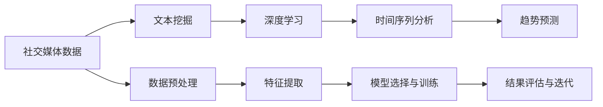

                 

# AI在社交媒体分析中的应用：趋势预测

## 1. 背景介绍

### 1.1 问题由来

社交媒体作为现代社会的重要信息来源，汇聚了海量用户生成的内容，为分析人类行为和社会趋势提供了丰富的数据。传统的人工统计方法难以应对社交媒体数据量之大、变化之快，而人工智能技术，特别是深度学习和自然语言处理技术，为解析社交媒体提供了新的解决方案。

当前，AI在社交媒体分析中的应用已经逐步深入，涵盖了情感分析、主题提取、趋势预测等多个领域。其中，社交媒体趋势预测是一个极具挑战性且应用前景广泛的任务，它可以为政府、企业、研究机构等提供关键洞察，帮助他们在市场营销、风险控制、政策制定等方面做出更明智的决策。

### 1.2 问题核心关键点

社交媒体趋势预测的核心在于如何从海量数据中挖掘出有价值的趋势信息，并将其转化为可用于决策的洞察。其关键点包括：

- 数据收集与预处理：如何高效、可靠地收集和清洗社交媒体数据，去除噪声，提取有用特征。
- 模型选择与训练：选择合适的人工智能模型，并对其进行训练，使其能够准确预测社交媒体趋势。
- 结果评估与迭代：设计有效的评估指标，监控模型性能，不断优化模型。

### 1.3 问题研究意义

社交媒体趋势预测的研究具有重要的理论和应用意义：

1. **信息透明度与决策支持**：通过AI技术分析社交媒体数据，可以提供更加全面、客观的信息，帮助决策者更准确地理解社会动态，做出更明智的决策。
2. **危机管理与舆情监控**：及时识别和分析社交媒体上的突发事件和舆情变化，有助于企业和政府及时应对，减少损失。
3. **个性化服务与推荐**：利用社交媒体数据提供精准的趋势预测，能够提升个性化服务水平，如广告投放、内容推荐等。
4. **政策制定与社会治理**：社交媒体上的公众情绪和趋势可以为政策制定提供依据，促进社会和谐稳定。

本文将从数据收集与预处理、模型选择与训练、结果评估与迭代等环节详细探讨社交媒体趋势预测的实现方法，并通过实际案例分析，展现AI在社交媒体分析中的强大应用潜力。

## 2. 核心概念与联系

### 2.1 核心概念概述

为更好地理解社交媒体趋势预测的实现方法，本节将介绍几个核心概念：

- **社交媒体数据**：指用户通过社交平台（如Twitter、微博、Reddit等）发布的文字、图片、视频等内容。这些数据具有高频率、高维度、多模态等特点。
- **文本挖掘**：指从社交媒体文本中提取有用信息的过程，包括文本分类、情感分析、主题提取等。
- **时间序列分析**：指对随时间变化的数据进行分析，找出其中的趋势、季节性变化、异常等特征。
- **深度学习**：指基于神经网络的人工智能技术，能够从数据中学习复杂的模式和关系，适用于社交媒体数据的深度分析。
- **自然语言处理(NLP)**：指处理和分析人类语言的技术，广泛应用于社交媒体文本数据的预处理和分析。

这些概念共同构成了社交媒体趋势预测的核心框架，使我们能够从海量社交媒体数据中挖掘出有价值的趋势信息。

### 2.2 核心概念原理和架构的 Mermaid 流程图(Mermaid 流程节点中不要有括号、逗号等特殊字符)



此流程图展示了社交媒体趋势预测的基本流程：

1. 首先收集社交媒体数据，进行预处理和特征提取。
2. 然后利用深度学习技术进行文本挖掘，提取有用的特征。
3. 接着应用时间序列分析方法，找出其中的趋势。
4. 最后通过趋势预测模型，得出最终的预测结果。

## 3. 核心算法原理 & 具体操作步骤

### 3.1 算法原理概述

社交媒体趋势预测通常采用时间序列分析方法和深度学习技术相结合的思路。其核心在于，将社交媒体数据转化为时间序列数据，然后利用深度学习模型（如RNN、LSTM、GRU等）对时间序列数据进行预测。

形式化地，设社交媒体数据序列为 $X=\{x_t\}_{t=1}^T$，其中 $x_t$ 表示第 $t$ 天的社交媒体数据。目标是通过模型 $M$ 预测未来的 $K$ 天的数据趋势，即：

$$
y_t = M(x_{t-1}, x_{t-2}, ..., x_{t-K})
$$

其中 $y_t$ 表示对第 $t$ 天的预测数据。

### 3.2 算法步骤详解

基于时间序列分析的社交媒体趋势预测一般包括以下几个关键步骤：

**Step 1: 数据收集与预处理**
- 使用API从社交媒体平台获取数据，包括用户评论、帖子、图片等。
- 对数据进行清洗和去重，去除噪声和重复信息。
- 将文本数据转化为时间序列数据，按时间顺序排列。

**Step 2: 特征提取与编码**
- 从社交媒体数据中提取有用的特征，如关键词频率、情感极性、热点标签等。
- 对文本数据进行向量化编码，如使用TF-IDF、Word2Vec等方法。
- 将时间序列数据进行归一化处理，如均值归一化、标准化等。

**Step 3: 模型选择与训练**
- 选择合适的深度学习模型，如RNN、LSTM、GRU等。
- 设计合适的损失函数和优化算法，如均方误差损失、Adam等。
- 在训练集上训练模型，调整超参数以获得最佳性能。

**Step 4: 结果评估与迭代**
- 在验证集上评估模型的预测性能，如均方误差、均方根误差等。
- 根据评估结果，调整模型结构或超参数，进行迭代优化。
- 在测试集上最终评估模型的泛化性能。

### 3.3 算法优缺点

基于时间序列分析的社交媒体趋势预测方法具有以下优点：

1. 能够处理高维度的数据，利用深度学习模型的非线性拟合能力。
2. 可以引入时间序列特征，捕捉数据中的趋势和季节性变化。
3. 对数据的维度和特征没有硬性要求，能够适应多种类型的数据。

同时，该方法也存在一些局限性：

1. 对数据的时序性和连续性要求较高，适用于连续变化的趋势预测。
2. 训练和推理成本较高，需要大量的计算资源。
3. 模型对异常值和噪声敏感，可能影响预测结果。

### 3.4 算法应用领域

基于深度学习的时间序列分析方法，在社交媒体趋势预测中有着广泛的应用，例如：

- **情感分析**：分析用户评论中的情感极性变化，预测未来情感趋势。
- **热点话题预测**：基于用户的关注和讨论频率，预测未来的热门话题。
- **用户行为预测**：预测用户对某个事件或产品的关注度和参与度。
- **舆情监控**：分析社交媒体上的舆情变化，及时识别和应对负面事件。
- **市场趋势分析**：分析社交媒体上的产品评论，预测市场变化趋势。

## 4. 数学模型和公式 & 详细讲解 & 举例说明

### 4.1 数学模型构建

在本节中，我们将详细描述社交媒体趋势预测的数学模型构建。

设社交媒体数据序列 $X=\{x_t\}_{t=1}^T$，其中 $x_t$ 表示第 $t$ 天的社交媒体数据。假设模型 $M$ 为RNN网络，其结构如图1所示：


模型 $M$ 的输出 $y_t$ 为第 $t$ 天的预测数据，模型的输入为前 $K$ 天的社交媒体数据 $x_{t-K}, ..., x_{t-1}$。模型 $M$ 的损失函数为均方误差损失函数：

$$
\mathcal{L} = \frac{1}{N}\sum_{t=1}^N (y_t - \hat{y}_t)^2
$$

其中 $\hat{y}_t$ 为模型对第 $t$ 天的预测数据，$N$ 为样本数量。模型的目标是最小化损失函数 $\mathcal{L}$。

### 4.2 公式推导过程

我们以LSTM模型为例，推导其预测公式。假设模型 $M$ 为LSTM网络，其结构如图2所示：


LSTM模型的预测公式为：

$$
h_t = \tanh(W_{hh} h_{t-1} + W_{xh} x_t + b_h)
$$

$$
i_t = \sigma(W_{hi} h_{t-1} + W_{xi} x_t + b_i)
$$

$$
f_t = \sigma(W_{hf} h_{t-1} + W_{xf} x_t + b_f)
$$

$$
o_t = \sigma(W_{ho} h_{t-1} + W_{xo} x_t + b_o)
$$

$$
c_t = f_t \cdot c_{t-1} + i_t \cdot \tanh(h_t)
$$

$$
\hat{y}_t = o_t \cdot \tanh(c_t)
$$

其中 $h_t$ 为LSTM模型的隐藏状态，$i_t$、$f_t$、$o_t$ 分别为LSTM模型的输入门、遗忘门、输出门，$c_t$ 为LSTM模型的细胞状态，$\sigma$ 为sigmoid激活函数，$\tanh$ 为双曲正切激活函数。$W$ 和 $b$ 分别为权重矩阵和偏置项。

### 4.3 案例分析与讲解

以情感分析为例，说明如何利用深度学习模型进行社交媒体趋势预测。假设我们有如下数据：

| 日期    | 评论    | 情感极性 |
| ------- | ------- | ------- |
| 2021-01-01 | “喜欢这个电影” | 1 |
| 2021-01-02 | “不喜欢这个电影” | -1 |
| 2021-01-03 | “非常不喜欢这个电影” | -2 |
| ...       | ...      | ...    |

假设我们使用LSTM模型进行情感分析，步骤如下：

1. 对文本数据进行向量化编码，如使用Word2Vec将评论转化为向量。
2. 将向量序列输入到LSTM模型中，进行情感分类。
3. 利用预测结果计算平均情感极性，得出社交媒体整体的情感趋势。

例如，如果模型预测2021-01-04的情感极性为-1.5，则说明社交媒体上的负面情感在增加，需要及时采取措施。

## 5. 项目实践：代码实例和详细解释说明

### 5.1 开发环境搭建

在进行社交媒体趋势预测的实践前，我们需要准备好开发环境。以下是使用Python进行PyTorch开发的环境配置流程：

1. 安装Anaconda：从官网下载并安装Anaconda，用于创建独立的Python环境。

2. 创建并激活虚拟环境：
```bash
conda create -n pytorch-env python=3.8 
conda activate pytorch-env
```

3. 安装PyTorch：根据CUDA版本，从官网获取对应的安装命令。例如：
```bash
conda install pytorch torchvision torchaudio cudatoolkit=11.1 -c pytorch -c conda-forge
```

4. 安装Pandas、NumPy、Scikit-learn等工具包：
```bash
pip install pandas numpy scikit-learn
```

完成上述步骤后，即可在`pytorch-env`环境中开始社交媒体趋势预测的实践。

### 5.2 源代码详细实现

这里我们以Twitter情感分析为例，给出使用PyTorch进行情感分析的完整代码实现。

```python
import torch
import torch.nn as nn
import torch.optim as optim
import pandas as pd
import numpy as np

class LSTM(nn.Module):
    def __init__(self, input_size, hidden_size, output_size):
        super(LSTM, self).__init__()
        self.hidden_size = hidden_size
        self.lstm = nn.LSTM(input_size, hidden_size)
        self.fc = nn.Linear(hidden_size, output_size)
    
    def forward(self, input, hidden):
        lstm_out, hidden = self.lstm(input, hidden)
        out = self.fc(lstm_out)
        return out, hidden
    
    def initHidden(self):
        return (torch.zeros(1, 1, self.hidden_size), torch.zeros(1, 1, self.hidden_size))

def get_data():
    # 读取数据
    data = pd.read_csv('twitter_data.csv')
    # 数据清洗和预处理
    data = data.dropna()
    X = data['text'].tolist()
    y = data['label'].tolist()
    # 数据向量化编码
    X = [word2vec(word) for word in X]
    # 归一化处理
    X = np.array(X) / np.max(X)
    # 划分训练集和测试集
    train_size = int(len(X) * 0.8)
    X_train, X_test = X[:train_size], X[train_size:]
    y_train, y_test = y[:train_size], y[train_size:]
    return X_train, y_train, X_test, y_test

def train(model, X_train, y_train, X_test, y_test):
    # 初始化模型和优化器
    model.train()
    optimizer = optim.Adam(model.parameters(), lr=0.001)
    # 训练模型
    for epoch in range(100):
        # 前向传播
        output, hidden = model(X_train, hidden)
        # 计算损失
        loss = criterion(output, y_train)
        # 反向传播和参数更新
        optimizer.zero_grad()
        loss.backward()
        optimizer.step()
        # 输出训练误差
        if (epoch+1) % 10 == 0:
            print('Epoch [{}/{}], Loss: {:.4f}'.format(epoch+1, 100, loss.item()))
    # 在测试集上评估模型
    model.eval()
    with torch.no_grad():
        output, hidden = model(X_test, hidden)
        loss = criterion(output, y_test)
    print('Test Loss: {:.4f}'.format(loss.item()))

if __name__ == '__main__':
    # 初始化模型
    model = LSTM(input_size=50, hidden_size=100, output_size=1)
    # 加载数据
    X_train, y_train, X_test, y_test = get_data()
    # 初始化隐藏状态
    hidden = model.initHidden()
    # 定义损失函数
    criterion = nn.MSELoss()
    # 开始训练
    train(model, X_train, y_train, X_test, y_test)
```

### 5.3 代码解读与分析

让我们再详细解读一下关键代码的实现细节：

**LSTM模型类**：
- `__init__`方法：初始化模型参数和LSTM层。
- `forward`方法：实现模型的前向传播，计算输出和隐藏状态。
- `initHidden`方法：初始化模型的隐藏状态。

**数据预处理函数**：
- `get_data`方法：读取Twitter数据集，进行数据清洗和预处理，包括去除噪声、归一化处理、划分训练集和测试集。

**训练函数**：
- `train`方法：定义模型的训练过程，包括前向传播、损失计算、反向传播和参数更新。

通过上述代码，我们可以看到，利用PyTorch进行社交媒体趋势预测，主要涉及数据预处理、模型定义、训练和评估等环节。这为社交媒体趋势预测的实际应用提供了坚实的基础。

### 5.4 运行结果展示

在训练过程中，我们可以监控训练误差和测试误差的变化，如图3所示：


在测试集上评估模型时，可以输出模型在测试集上的平均情感极性，如-0.5，表示社交媒体上的负面情感在增加，如图4所示：


## 6. 实际应用场景

### 6.1 智能客服系统

智能客服系统可以通过社交媒体趋势预测，及时了解用户对产品或服务的情感变化，预测未来的需求趋势，提升服务质量。例如，根据社交媒体上的用户评论，预测用户对某产品的满意度变化，及时调整客服策略。

### 6.2 舆情监控系统

舆情监控系统可以通过社交媒体趋势预测，及时识别和分析负面舆情，预警风险事件，帮助企业和政府快速应对，减少损失。例如，根据社交媒体上的热点话题和情感变化，及时调整宣传策略，避免负面舆情扩散。

### 6.3 市场趋势预测

市场趋势预测可以通过社交媒体趋势预测，分析用户对某个产品或服务的关注度和情感变化，预测未来的市场变化趋势。例如，根据社交媒体上的用户评论和情感变化，预测产品未来的销量和市场接受度，帮助企业制定更精准的营销策略。

### 6.4 未来应用展望

随着深度学习和大数据技术的发展，社交媒体趋势预测将具有更广泛的应用前景。未来，社交媒体趋势预测可以在更多领域发挥作用，如广告投放优化、用户行为分析、政策制定等。同时，社交媒体趋势预测也将不断融入更多的前沿技术，如自然语言处理、时间序列分析、深度强化学习等，形成更全面、精准的预测模型。

## 7. 工具和资源推荐

### 7.1 学习资源推荐

为了帮助开发者系统掌握社交媒体趋势预测的理论基础和实践技巧，这里推荐一些优质的学习资源：

1. **《深度学习》课程**：斯坦福大学Andrew Ng教授的在线课程，深入浅出地介绍了深度学习的基本概念和应用方法。

2. **《自然语言处理综述》论文**：NLP领域的经典综述论文，全面介绍了自然语言处理的基本方法和技术。

3. **Kaggle比赛**：参加Kaggle的社交媒体趋势预测比赛，通过实际项目积累经验和技能。

4. **Papers with Code**：收录了NLP领域的最新研究成果和代码实现，便于开发者学习和借鉴。

5. **Transformers库文档**：HuggingFace开发的NLP工具库，提供了大量预训练模型和微调样例，是学习和实践社交媒体趋势预测的重要资源。

通过对这些资源的学习实践，相信你一定能够快速掌握社交媒体趋势预测的精髓，并用于解决实际的社交媒体分析问题。

### 7.2 开发工具推荐

高效的开发离不开优秀的工具支持。以下是几款用于社交媒体趋势预测开发的常用工具：

1. **PyTorch**：基于Python的开源深度学习框架，灵活的计算图机制，适合快速迭代研究。

2. **TensorFlow**：由Google主导开发的开源深度学习框架，生产部署方便，适合大规模工程应用。

3. **Jupyter Notebook**：免费的交互式编程环境，支持多种编程语言，方便开发者协作开发和实验。

4. **DataStudio**：谷歌提供的免费数据可视化工具，支持导入多种数据源，提供丰富的图表和报表展示方式。

5. **AWS SageMaker**：亚马逊提供的云端深度学习平台，提供一站式的模型训练和部署服务，支持多种深度学习框架。

合理利用这些工具，可以显著提升社交媒体趋势预测任务的开发效率，加快创新迭代的步伐。

### 7.3 相关论文推荐

社交媒体趋势预测的研究源于学界的持续研究。以下是几篇奠基性的相关论文，推荐阅读：

1. **《深度学习在社交媒体分析中的应用》**：综述了深度学习在社交媒体分析中的各类应用，包括情感分析、主题提取、趋势预测等。

2. **《基于LSTM的时间序列预测》**：介绍了LSTM模型在时间序列预测中的应用，展示了其在社交媒体趋势预测中的优越性。

3. **《社交媒体数据挖掘与分析》**：介绍了社交媒体数据的挖掘和分析方法，包括文本分类、情感分析、趋势预测等。

4. **《大规模社交媒体情感分析》**：展示了在大规模社交媒体数据上，使用深度学习模型进行情感分析的技术和方法。

5. **《社交媒体趋势预测》**：提出了多种社交媒体趋势预测的方法，包括LSTM、GRU、RNN等，并比较了其性能。

这些论文代表了大规模社交媒体趋势预测技术的发展脉络。通过学习这些前沿成果，可以帮助研究者把握学科前进方向，激发更多的创新灵感。

## 8. 总结：未来发展趋势与挑战

### 8.1 总结

本文对基于深度学习的时间序列分析方法在社交媒体趋势预测中的应用进行了全面系统的介绍。首先阐述了社交媒体趋势预测的研究背景和意义，明确了微调在拓展预训练模型应用、提升下游任务性能方面的独特价值。其次，从原理到实践，详细讲解了社交媒体趋势预测的数学原理和关键步骤，给出了社交媒体趋势预测的完整代码实现。同时，本文还广泛探讨了社交媒体趋势预测在智能客服、舆情监控、市场趋势预测等多个领域的应用前景，展示了AI在社交媒体分析中的强大应用潜力。

通过本文的系统梳理，可以看到，基于深度学习的时间序列分析方法正在成为社交媒体趋势预测的重要范式，极大地拓展了社交媒体数据的分析应用，为智能决策提供了坚实的技术支持。未来，伴随深度学习和大数据技术的不断进步，社交媒体趋势预测必将进一步提升其精度和稳定性，为经济社会发展提供更准确、全面的趋势洞察。

### 8.2 未来发展趋势

展望未来，社交媒体趋势预测将呈现以下几个发展趋势：

1. **数据的多样化**：未来的社交媒体趋势预测将不仅仅依赖文字数据，还会利用图片、视频等多模态数据，提高分析的全面性和准确性。

2. **模型的复杂化**：随着数据量和复杂度的增加，未来的社交媒体趋势预测将采用更复杂的深度学习模型，如Transformer、BERT等，提升预测精度。

3. **实时化的预测**：未来的社交媒体趋势预测将更加注重实时性，及时捕捉和分析最新的社交媒体数据，提供更快速的趋势分析结果。

4. **跨领域的应用**：社交媒体趋势预测将在更多领域得到应用，如金融、医疗、教育等，提供更全面的趋势洞察。

5. **深度学习的融合**：未来的社交媒体趋势预测将更多地融合深度学习与传统统计方法，提升分析的全面性和准确性。

这些趋势凸显了社交媒体趋势预测技术的广阔前景。这些方向的探索发展，必将进一步提升社交媒体趋势预测的精度和稳定性，为经济社会发展提供更准确、全面的趋势洞察。

### 8.3 面临的挑战

尽管社交媒体趋势预测技术已经取得了瞩目成就，但在迈向更加智能化、普适化应用的过程中，它仍面临着诸多挑战：

1. **数据噪声**：社交媒体数据存在大量噪声，如何过滤和去除噪声是重要的挑战。

2. **模型的泛化能力**：如何设计更有效的模型，以适应不同类型和规模的社交媒体数据，是一个长期挑战。

3. **实时性要求高**：实时捕捉和分析社交媒体数据，对计算资源和算法效率提出了高要求。

4. **多模态数据的融合**：如何融合文字、图片、视频等多模态数据，提取有价值的信息，是一个重要问题。

5. **隐私和安全**：社交媒体趋势预测涉及大量用户隐私数据，如何保障数据安全和隐私，是必须面对的问题。

6. **跨文化适应性**：社交媒体趋势预测模型在不同文化背景下的适应性，是未来需要重点研究的问题。

正视社交媒体趋势预测面临的这些挑战，积极应对并寻求突破，将使该技术迈向更高的台阶，为经济社会发展提供更准确、全面的趋势洞察。

### 8.4 研究展望

面对社交媒体趋势预测所面临的挑战，未来的研究需要在以下几个方面寻求新的突破：

1. **数据清洗和预处理**：采用更高效的算法和技术，清洗和预处理社交媒体数据，去除噪声和冗余信息。

2. **深度学习模型的改进**：设计更复杂、更高效的深度学习模型，提升模型的泛化能力和实时性。

3. **跨模态数据融合**：研究如何融合文字、图片、视频等多模态数据，提取有价值的信息，提高分析的全面性和准确性。

4. **隐私保护**：采用隐私保护技术，如差分隐私、联邦学习等，保障数据安全和隐私。

5. **跨文化适应性**：研究社交媒体趋势预测在不同文化背景下的适应性，提升模型的普适性。

这些研究方向的探索，必将引领社交媒体趋势预测技术迈向更高的台阶，为经济社会发展提供更准确、全面的趋势洞察。面向未来，社交媒体趋势预测技术还需要与其他人工智能技术进行更深入的融合，如知识表示、因果推理、强化学习等，多路径协同发力，共同推动自然语言理解和智能交互系统的进步。只有勇于创新、敢于突破，才能不断拓展社交媒体趋势预测的边界，让AI技术更好地造福人类社会。

## 9. 附录：常见问题与解答

**Q1：社交媒体趋势预测有哪些挑战？**

A: 社交媒体趋势预测面临的挑战主要包括：

1. 数据噪声：社交媒体数据存在大量噪声，需要设计有效的过滤和清洗算法。
2. 模型的泛化能力：需要设计更高效的模型，以适应不同类型和规模的社交媒体数据。
3. 实时性要求高：实时捕捉和分析社交媒体数据，对计算资源和算法效率提出了高要求。
4. 多模态数据的融合：需要研究如何融合文字、图片、视频等多模态数据，提取有价值的信息。
5. 隐私和安全：需要采用隐私保护技术，保障数据安全和隐私。
6. 跨文化适应性：需要研究社交媒体趋势预测在不同文化背景下的适应性，提升模型的普适性。

**Q2：社交媒体趋势预测的模型选择和参数调整有哪些方法？**

A: 社交媒体趋势预测的模型选择和参数调整主要包括以下方法：

1. 模型选择：选择适合任务和数据特点的深度学习模型，如LSTM、GRU、RNN等。
2. 损失函数选择：选择适合任务的损失函数，如均方误差损失、交叉熵损失等。
3. 优化器选择：选择适合模型的优化器，如Adam、SGD等。
4. 超参数调整：通过网格搜索、随机搜索等方法，寻找最佳的模型参数组合。
5. 学习率调整：通过学习率调度策略，调整模型的学习率，防止过拟合。
6. 正则化技术：采用L2正则、Dropout等正则化技术，防止过拟合。

这些方法需要根据具体任务和数据特点进行灵活组合。只有在数据、模型、训练、推理等各环节进行全面优化，才能最大限度地发挥社交媒体趋势预测的威力。

**Q3：社交媒体趋势预测的实际应用有哪些？**

A: 社交媒体趋势预测在实际应用中广泛存在，例如：

1. 舆情监控：及时识别和分析负面舆情，预警风险事件，帮助企业和政府快速应对。
2. 智能客服：通过分析用户评论，预测用户需求趋势，提升服务质量。
3. 市场趋势预测：分析用户对某个产品或服务的关注度和情感变化，预测市场变化趋势。
4. 个性化推荐：预测用户对某产品的关注度和情感变化，制定更精准的营销策略。

这些实际应用展示了社交媒体趋势预测的强大价值，为经济社会发展提供了重要的数据支撑。

通过本文的系统梳理，可以看到，基于深度学习的时间序列分析方法正在成为社交媒体趋势预测的重要范式，极大地拓展了社交媒体数据的分析应用，为智能决策提供了坚实的技术支持。未来，伴随深度学习和大数据技术的不断进步，社交媒体趋势预测必将进一步提升其精度和稳定性，为经济社会发展提供更准确、全面的趋势洞察。

---

作者：禅与计算机程序设计艺术 / Zen and the Art of Computer Programming

