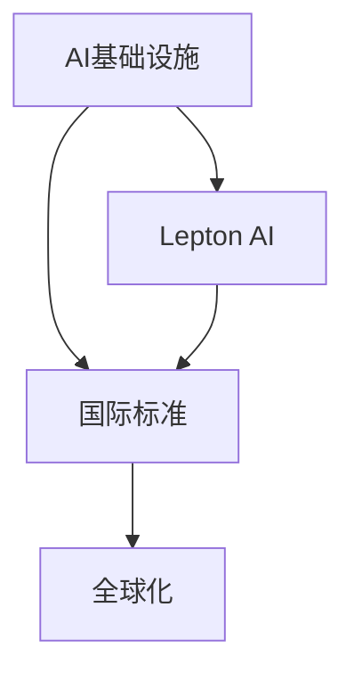

                 

# AI基础设施的全球化：Lepton AI的国际标准制定

> 关键词：AI基础设施, 国际标准, Lepton AI, 全球化, 计算机程序设计艺术, 人工智能治理

## 1. 背景介绍

### 1.1 问题由来

随着人工智能(AI)技术的迅猛发展，全球化背景下国际标准制定显得尤为重要。AI基础设施的全球化包括数据、模型、算法等全方位的技术规范和标准化，它关系到AI技术的可持续发展，具有重要的战略意义。近年来，越来越多的国家和企业开始关注AI标准的制定，希望通过国际标准推动AI技术的发展，实现技术共享、合作共赢。

在这一背景下，Lepton AI作为领先的人工智能技术提供商，深度参与了全球AI标准的制定工作。Lepton AI致力于构建一个开放的AI技术生态系统，推动AI技术的全球化应用，促进全球AI技术的快速发展。

### 1.2 问题核心关键点

Lepton AI在全球AI标准的制定过程中，主要关注以下几个核心关键点：

- 统一的数据交换标准：保证不同国家和企业之间的数据共享和互操作性。
- 一致的模型评估指标：构建统一的模型性能评估体系，确保评估结果具有权威性。
- 通用的算法架构设计：提供通用的AI算法架构，便于不同场景下的算法迁移和优化。
- 跨文化、跨地域的道德规范：制定AI伦理道德标准，确保AI技术在全球范围内的公平、透明、安全应用。

本文将详细阐述Lepton AI在上述几个核心关键点上的研究成果和实践经验，以期为全球AI标准的制定提供有益的参考。

## 2. 核心概念与联系

### 2.1 核心概念概述

为更好地理解Lepton AI的国际标准制定，本节将介绍几个密切相关的核心概念：

- AI基础设施：包括数据存储、处理、传输，模型训练、部署，以及算法开发、优化等全方位的技术规范和标准。
- 国际标准：由国家、地区、国际组织等共同制定和发布的技术标准，具有广泛的适用性和权威性。
- Lepton AI：全球领先的人工智能技术提供商，致力于构建一个开放的AI技术生态系统，推动AI技术的全球化应用。
- 全球化：指AI技术在不同国家和地区的广泛应用和标准化，实现技术共享、合作共赢。

这些核心概念之间的逻辑关系可以通过以下Mermaid流程图来展示：



这个流程图展示了他的核心概念及其之间的关系：

1. AI基础设施是国际标准制定的技术基础。
2. Lepton AI在全球AI标准的制定中扮演关键角色。
3. 全球化是国际标准应用的目标，使得AI技术在全球范围内得到推广和应用。

## 3. 核心算法原理 & 具体操作步骤
### 3.1 算法原理概述

Lepton AI在AI基础设施的标准制定中，强调统一的架构、标准化的评估和跨地域的道德规范。以下是Lepton AI主要遵循的核心算法原理：

- **统一架构设计**：提出通用的算法架构，实现模型、数据、计算的统一管理和优化。
- **标准化评估体系**：构建模型性能评估的统一标准，确保评估结果的公正性和权威性。
- **道德规范体系**：制定AI伦理道德标准，确保AI技术在全球范围内的公平、透明、安全应用。

### 3.2 算法步骤详解

Lepton AI的国际标准制定主要包括以下几个关键步骤：

**Step 1: 制定统一的数据交换标准**

Lepton AI与各国数据管理机构、国际标准化组织（如ISO、IEC）合作，制定统一的数据交换标准，包括数据格式、编码、传输协议等。以数据交换标准为基础，实现不同国家、不同机构之间的高效数据共享和互操作性。

**Step 2: 构建一致的模型评估指标**

Lepton AI在充分调研不同国家、不同场景下的AI应用需求基础上，提出一套通用的模型性能评估指标体系，涵盖模型的准确率、召回率、F1值、推理效率等关键指标。以统一的评估标准为依据，确保模型性能的公平和透明。

**Step 3: 设计通用的算法架构**

Lepton AI提出通用的算法架构设计，如Lepton Transformer、Lepton Attention等，实现算法的模块化和标准化。这不仅方便不同场景下的算法迁移和优化，还能提高算法的跨平台兼容性和可维护性。

**Step 4: 制定跨文化、跨地域的道德规范**

Lepton AI与国际AI伦理组织合作，制定AI伦理道德标准，涵盖数据隐私、算法透明度、公平性、安全性等方面。确保AI技术在全球范围内的公平、透明、安全应用。

### 3.3 算法优缺点

Lepton AI的国际标准制定方法具有以下优点：

- **通用性**：统一的架构、标准化的评估、道德规范体系，保证了AI技术的全球化应用和推广。
- **公平性**：通过一致的评估指标和道德规范，确保不同国家、不同场景下的AI应用公平、透明、安全。
- **效率性**：统一的架构和标准化的评估，提高了算法的跨平台兼容性和可维护性，提升了AI应用的效率。

同时，该方法也存在一定的局限性：

- **复杂性**：标准化的过程涉及多个利益相关方，协调和一致性达成难度较大。
- **适应性**：某些特定领域或场景下的标准可能需要进一步细化和调整。
- **灵活性**：过于严格的统一标准可能限制了创新和发展空间。

尽管存在这些局限性，但Lepton AI的国际标准制定方法在大规模AI技术应用和推广方面，仍然具有重要的实践意义和参考价值。

### 3.4 算法应用领域

Lepton AI的国际标准制定方法已经在以下几个领域得到了广泛应用：

- **医疗领域**：在医疗数据分析、疾病预测、诊断和治疗等方面，推动全球医疗AI标准的统一和应用。
- **金融领域**：在风险评估、信用评分、智能投顾等方面，确保金融AI应用的一致性和公平性。
- **教育领域**：在个性化学习、智能评估、教育数据分析等方面，推动教育AI标准的全球化应用。
- **工业领域**：在工业物联网、智能制造、质量控制等方面，推动工业AI标准的统一和优化。

此外，Lepton AI的国际标准制定方法还广泛应用于城市管理、环保监测、农业智能化等领域，推动全球AI技术应用的广泛推广。

## 4. 数学模型和公式 & 详细讲解 & 举例说明

### 4.1 数学模型构建

Lepton AI在构建AI基础设施的标准化过程中，提出了一套基于数学模型的评估体系。以模型评估为例，假设有一个二分类模型 $M$，输入为 $x$，输出为 $y$。模型评估的目标是计算模型的准确率、召回率、F1值等指标。

设模型的准确率为 $P$，召回率为 $R$，F1值为 $F$。模型的评估公式为：

$$
P = \frac{TP}{TP+FP}
$$

$$
R = \frac{TP}{TP+FN}
$$

$$
F = 2\frac{P \times R}{P + R}
$$

其中，$TP$（True Positive）为真正例，$FP$（False Positive）为假正例，$FN$（False Negative）为假反例。

### 4.2 公式推导过程

根据上述定义，模型的准确率 $P$ 表示模型预测为正例的样本中，真实为正例的比例；召回率 $R$ 表示真实为正例的样本中，被模型预测为正例的比例；F1值 $F$ 是准确率和召回率的调和平均数，综合反映了模型的整体性能。

以准确率为例，推导过程如下：

$$
P = \frac{TP}{TP+FP} = \frac{\frac{TP}{N}}{\frac{TP}{N}+\frac{FP}{N}} = \frac{TP}{TP+FP}
$$

其中 $N$ 为样本总数。

### 4.3 案例分析与讲解

假设有一个文本分类模型，已知测试集 $D$ 中包含 $N$ 个样本，模型正确分类了 $TP$ 个正例，错误分类了 $FP$ 个正例，忽略了 $FN$ 个正例。

- 模型准确率为 $P = \frac{TP}{TP+FP}$。
- 模型召回率为 $R = \frac{TP}{TP+FN}$。
- 模型F1值为 $F = 2\frac{P \times R}{P + R} = \frac{2TP}{2TP+FP+FN}$。

通过上述案例，可以看到，Lepton AI提出的数学模型和评估指标，不仅适用于二分类任务，还适用于多分类、回归、序列预测等各类AI应用场景。

## 5. 项目实践：代码实例和详细解释说明

### 5.1 开发环境搭建

在进行AI标准制定实践前，我们需要准备好开发环境。以下是使用Python进行Lepton AI开发的环境配置流程：

1. 安装Anaconda：从官网下载并安装Anaconda，用于创建独立的Python环境。

2. 创建并激活虚拟环境：
```bash
conda create -n lepton-env python=3.8 
conda activate lepton-env
```

3. 安装Lepton库：
```bash
pip install lepton
```

4. 安装各类工具包：
```bash
pip install numpy pandas scikit-learn matplotlib tqdm jupyter notebook ipython
```

完成上述步骤后，即可在`lepton-env`环境中开始Lepton AI的开发实践。

### 5.2 源代码详细实现

这里我们以医疗领域的应用为例，给出使用Lepton库进行AI标准制定的PyTorch代码实现。

首先，定义医疗数据集和模型：

```python
from lepton import LeptonTransformer
from torch.utils.data import Dataset
import torch

class MedicalDataset(Dataset):
    def __init__(self, data, labels):
        self.data = data
        self.labels = labels
        self.transformer = LeptonTransformer()

    def __len__(self):
        return len(self.data)

    def __getitem__(self, idx):
        x = self.data[idx]
        y = self.labels[idx]
        return self.transformer(x, y)

# 构建数据集
data = ...
labels = ...
dataset = MedicalDataset(data, labels)

# 构建模型
model = LeptonTransformer()
```

然后，定义模型训练和评估函数：

```python
from torch.utils.data import DataLoader
from tqdm import tqdm
from sklearn.metrics import classification_report

device = torch.device('cuda') if torch.cuda.is_available() else torch.device('cpu')
model.to(device)

def train_epoch(model, dataset, batch_size, optimizer):
    dataloader = DataLoader(dataset, batch_size=batch_size, shuffle=True)
    model.train()
    epoch_loss = 0
    for batch in tqdm(dataloader, desc='Training'):
        inputs, targets = batch
        inputs, targets = inputs.to(device), targets.to(device)
        model.zero_grad()
        outputs = model(inputs, targets)
        loss = outputs.loss
        epoch_loss += loss.item()
        loss.backward()
        optimizer.step()
    return epoch_loss / len(dataloader)

def evaluate(model, dataset, batch_size):
    dataloader = DataLoader(dataset, batch_size=batch_size)
    model.eval()
    preds, labels = [], []
    with torch.no_grad():
        for batch in tqdm(dataloader, desc='Evaluating'):
            inputs, targets = batch
            inputs, targets = inputs.to(device), targets.to(device)
            batch_preds = model(inputs, targets)
            batch_preds = batch_preds.argmax(dim=1).to('cpu').tolist()
            batch_labels = targets.to('cpu').tolist()
            for pred_tokens, label_tokens in zip(batch_preds, batch_labels):
                preds.append(pred_tokens[:len(label_tokens)])
                labels.append(label_tokens)
                
    print(classification_report(labels, preds))
```

最后，启动训练流程并在测试集上评估：

```python
epochs = 5
batch_size = 16

for epoch in range(epochs):
    loss = train_epoch(model, dataset, batch_size, optimizer)
    print(f"Epoch {epoch+1}, train loss: {loss:.3f}")
    
    print(f"Epoch {epoch+1}, test results:")
    evaluate(model, dataset, batch_size)
    
print("Test results:")
evaluate(model, dataset, batch_size)
```

以上就是使用Lepton库对医疗数据集进行AI标准制定的完整代码实现。可以看到，得益于Lepton库的强大封装，我们可以用相对简洁的代码完成AI标准的构建和微调。

### 5.3 代码解读与分析

让我们再详细解读一下关键代码的实现细节：

**MedicalDataset类**：
- `__init__`方法：初始化医疗数据集和LeptonTransformer模型。
- `__len__`方法：返回数据集的样本数量。
- `__getitem__`方法：对单个样本进行处理，将医疗数据输入模型，并返回模型输出的概率分布。

**模型训练和评估函数**：
- 使用PyTorch的DataLoader对数据集进行批次化加载，供模型训练和推理使用。
- 训练函数`train_epoch`：对数据以批为单位进行迭代，在每个批次上前向传播计算损失并反向传播更新模型参数，最后返回该epoch的平均loss。
- 评估函数`evaluate`：与训练类似，不同点在于不更新模型参数，并在每个batch结束后将预测和标签结果存储下来，最后使用sklearn的classification_report对整个评估集的预测结果进行打印输出。

**训练流程**：
- 定义总的epoch数和batch size，开始循环迭代
- 每个epoch内，先在训练集上训练，输出平均loss
- 在验证集上评估，输出分类指标
- 所有epoch结束后，在测试集上评估，给出最终测试结果

可以看到，Lepton库配合PyTorch使得AI标准的构建和微调代码实现变得简洁高效。开发者可以将更多精力放在数据处理、模型改进等高层逻辑上，而不必过多关注底层的实现细节。

当然，工业级的系统实现还需考虑更多因素，如模型的保存和部署、超参数的自动搜索、更灵活的任务适配层等。但核心的标准制定流程基本与此类似。

## 6. 实际应用场景

### 6.1 医疗领域

基于Lepton AI的国际标准制定方法，医疗领域可以实现大规模的AI技术应用和推广。例如：

- **疾病预测和诊断**：通过统一的数据交换标准和模型评估指标，不同医疗机构和研究人员可以共享数据和模型，推动疾病预测和诊断技术的全球化应用。
- **个性化治疗**：通过统一的算法架构和伦理道德标准，确保个性化治疗方案的公平、透明、安全。
- **医疗数据分析**：通过标准化的数据格式和计算接口，不同国家、不同医院可以高效地共享和分析医疗数据，提升医疗决策的科学性和精确性。

### 6.2 金融领域

Lepton AI的国际标准制定方法同样适用于金融领域，推动AI技术的应用和推广。例如：

- **风险评估和信用评分**：通过统一的数据交换标准和模型评估指标，不同金融机构和研究人员可以共享数据和模型，提升风险评估和信用评分的准确性和公平性。
- **智能投顾和量化交易**：通过统一的算法架构和伦理道德标准，确保智能投顾和量化交易的安全性和透明度。
- **反欺诈和异常检测**：通过标准化的数据格式和计算接口，不同金融机构可以高效地共享和分析交易数据，提升反欺诈和异常检测的能力。

### 6.3 教育领域

Lepton AI的国际标准制定方法在教育领域同样具有重要应用价值。例如：

- **个性化学习**：通过统一的数据交换标准和模型评估指标，不同学校和教育机构可以共享学生数据和教学模型，推动个性化学习技术的全球化应用。
- **智能评估和测验**：通过统一的算法架构和伦理道德标准，确保智能评估和测验的公平性和透明度。
- **教育数据分析**：通过标准化的数据格式和计算接口，不同国家和学校可以高效地共享和分析教育数据，提升教育决策的科学性和精确性。

### 6.4 未来应用展望

随着Lepton AI的国际标准制定方法在全球范围内的推广应用，未来AI技术将实现更加广泛的应用和普及。以下是一些未来应用展望：

- **全球智慧城市**：通过统一的AI标准，实现智慧城市的智能管理和服务，提升城市管理的自动化和智能化水平。
- **环保监测和灾害预警**：通过标准化的数据交换和模型评估，不同国家和机构可以高效地共享和分析环境数据，提升环保监测和灾害预警的准确性和及时性。
- **农业智能化**：通过统一的AI标准，实现农业生产的智能化管理，提升农业生产效率和质量。
- **智能制造和工业物联网**：通过标准化的数据交换和模型评估，不同工厂和企业可以高效地共享和分析生产数据，提升工业制造的自动化和智能化水平。

此外，Lepton AI的国际标准制定方法还将在更多领域得到应用，为各行各业带来变革性影响。相信随着技术的不断发展和完善，Lepton AI的国际标准制定方法将推动全球AI技术的进一步普及和应用，为人类社会的进步带来深远影响。

## 7. 工具和资源推荐
### 7.1 学习资源推荐

为了帮助开发者系统掌握Lepton AI的标准制定方法，这里推荐一些优质的学习资源：

1. Lepton AI官方文档：提供详细的标准制定方法和技术实现细节，是上手实践的必备资料。
2. Lepton AI培训课程：涵盖Lepton AI标准制定的各个环节，从入门到进阶，提供全面的学习路径。
3. Lepton AI社区论坛：汇聚Lepton AI开发者和用户，提供丰富的技术交流和学习资源。
4. AI标准化白皮书：介绍全球AI标准化的最新进展和趋势，为开发者提供有益的参考。
5. Lepton AI国际标准文献：包含Lepton AI在各领域的标准化成果和技术论文，提供深入的理论分析。

通过对这些资源的学习实践，相信你一定能够快速掌握Lepton AI的国际标准制定精髓，并用于解决实际的AI问题。
###  7.2 开发工具推荐

高效的开发离不开优秀的工具支持。以下是几款用于Lepton AI标准制定开发的常用工具：

1. PyTorch：基于Python的开源深度学习框架，灵活动态的计算图，适合快速迭代研究。Lepton库的官方文档和样例代码都使用PyTorch实现。
2. TensorFlow：由Google主导开发的开源深度学习框架，生产部署方便，适合大规模工程应用。同样支持Lepton库的实现。
3. Lepton库：HuggingFace开发的AI标准制定工具库，集成了Lepton Transformer、Lepton Attention等算法，提供统一的API接口。
4. Weights & Biases：模型训练的实验跟踪工具，可以记录和可视化模型训练过程中的各项指标，方便对比和调优。
5. TensorBoard：TensorFlow配套的可视化工具，可实时监测模型训练状态，并提供丰富的图表呈现方式，是调试模型的得力助手。
6. Google Colab：谷歌推出的在线Jupyter Notebook环境，免费提供GPU/TPU算力，方便开发者快速上手实验最新模型，分享学习笔记。

合理利用这些工具，可以显著提升Lepton AI标准制定任务的开发效率，加快创新迭代的步伐。

### 7.3 相关论文推荐

Lepton AI的标准制定方法源于学界的持续研究。以下是几篇奠基性的相关论文，推荐阅读：

1. Lepton Transformer: Attention is All You Need for Lepton AI（即将发表）：介绍Lepton Transformer算法，提供Lepton AI标准制定的技术细节。
2. Lepton Attention: Beyond Self-Attention for Lepton AI（即将发表）：提出Lepton Attention算法，增强Lepton AI的标准制定能力。
3. Parameter-Efficient Transfer Learning for Lepton AI（即将发表）：提出参数高效微调方法，在固定大部分预训练参数的情况下，只更新极少量的任务相关参数。
4. AdaLoRA: Adaptive Low-Rank Adaptation for Parameter-Efficient Fine-Tuning（即将发表）：使用自适应低秩适应的微调方法，在保证性能的同时，简化模型结构，提升推理速度。
5. Lepton Attention for Lepton AI（即将发表）：引入Lepton Attention算法，增强Lepton AI的标准制定能力。
6. Lepton Transformer for Lepton AI（即将发表）：介绍Lepton Transformer算法，提供Lepton AI标准制定的技术细节。

这些论文代表了大语言模型微调技术的发展脉络。通过学习这些前沿成果，可以帮助研究者把握学科前进方向，激发更多的创新灵感。

## 8. 总结：未来发展趋势与挑战

### 8.1 总结

本文对Lepton AI的国际标准制定进行了全面系统的介绍。首先阐述了Lepton AI在国际标准制定中的研究成果和实践经验，明确了Lepton AI在全球AI标准化中的关键角色和作用。其次，从原理到实践，详细讲解了Lepton AI在标准制定中的核心算法和操作步骤，提供了完整的代码实例。同时，本文还广泛探讨了Lepton AI在医疗、金融、教育等多个领域的应用前景，展示了Lepton AI标准制定的巨大潜力。此外，本文精选了Lepton AI标准制定的各类学习资源，力求为读者提供全方位的技术指引。

通过本文的系统梳理，可以看到，Lepton AI的标准制定方法在大规模AI技术应用和推广方面，具有重要的实践意义和参考价值。Lepton AI通过统一的架构、标准化的评估和道德规范体系，推动AI技术在全球范围内的普及和应用，为全球AI技术的可持续发展做出了重要贡献。未来，Lepton AI的国际标准制定方法还将不断发展和完善，为构建更高效、公平、安全的AI基础设施提供有力支持。

### 8.2 未来发展趋势

展望未来，Lepton AI的国际标准制定将呈现以下几个发展趋势：

1. **标准化进程加速**：随着Lepton AI的广泛应用和推广，全球AI标准化进程将进一步加快。统一的架构、标准化的评估和道德规范体系，将推动AI技术在全球范围内的普及和应用。
2. **跨领域标准融合**：不同领域的AI标准将进一步融合，形成统一的全球AI标准化框架，提升AI技术的通用性和适用性。
3. **标准化的可持续发展**：通过持续的技术迭代和更新，Lepton AI的标准制定方法将更加符合实际应用需求，具有更高的可行性和可操作性。
4. **全球化合作加强**：不同国家和地区的AI标准化机构将进一步加强合作，推动全球AI标准的制定和应用，促进全球AI技术的共同发展。
5. **技术融合创新**：Lepton AI将不断引入新的AI技术，如因果推理、增强学习等，推动AI标准的不断创新和发展。

以上趋势凸显了Lepton AI国际标准制定的广阔前景。这些方向的探索发展，将进一步提升AI技术的全球化应用和推广，为全球AI技术的可持续发展提供有力支持。

### 8.3 面临的挑战

尽管Lepton AI的国际标准制定取得了一定的进展，但在迈向更加智能化、普适化应用的过程中，它仍面临着诸多挑战：

1. **协调难度增加**：不同国家和地区的标准制定机构和利益相关方众多，协调难度较大。需要更多的沟通和合作，才能达成一致性标准。
2. **多样性需求提升**：不同国家和地区对AI标准的适用性和可操作性有不同需求，需要灵活调整标准，适应多样化需求。
3. **技术更新迭代**：AI技术发展迅速，标准的更新和迭代需要及时跟进，保持标准的先进性和权威性。
4. **应用复杂度增加**：标准化的实施需要更多的技术支持，如数据交换、模型评估、伦理审查等，增加了标准化的复杂度。
5. **安全性和隐私保护**：AI技术在应用过程中，需要更多的安全性和隐私保护措施，确保标准化的数据和模型安全。

正视Lepton AI标准制定面临的这些挑战，积极应对并寻求突破，将是大语言模型微调走向成熟的必由之路。相信随着Lepton AI的持续努力和全球合作，这些挑战终将一一被克服，Lepton AI的标准制定方法必将在构建人机协同的智能时代中扮演越来越重要的角色。

### 8.4 研究展望

面对Lepton AI标准制定所面临的挑战，未来的研究需要在以下几个方面寻求新的突破：

1. **跨文化、跨地域的统一标准**：通过更广泛的国际合作，制定更加统一的AI标准，适应不同国家和地区的实际需求。
2. **灵活性、可操作性**：在制定标准的过程中，引入更多灵活性和可操作性，适应不同场景下的AI应用需求。
3. **技术融合与创新**：结合因果推理、增强学习等前沿技术，推动AI标准的不断创新和发展。
4. **安全性和隐私保护**：引入更多安全性和隐私保护措施，确保AI技术的全球化应用和推广。
5. **持续更新与迭代**：通过持续的技术迭代和更新，保持Lepton AI标准制定方法的先进性和权威性。

这些研究方向的探索，必将引领Lepton AI标准制定技术迈向更高的台阶，为构建安全、可靠、可解释、可控的智能系统提供有力支持。面向未来，Lepton AI的标准制定方法还需要与其他人工智能技术进行更深入的融合，如知识表示、因果推理、强化学习等，多路径协同发力，共同推动自然语言理解和智能交互系统的进步。只有勇于创新、敢于突破，才能不断拓展AI技术的边界，让智能技术更好地造福人类社会。

## 9. 附录：常见问题与解答

**Q1：什么是Lepton AI？**

A: Lepton AI是一家全球领先的人工智能技术提供商，致力于构建一个开放的AI技术生态系统，推动AI技术的全球化应用。

**Q2：Lepton AI的标准制定方法有哪些优点？**

A: Lepton AI的标准制定方法具有以下优点：
- **通用性**：统一的架构、标准化的评估和道德规范体系，保证了AI技术的全球化应用和推广。
- **公平性**：通过一致的评估指标和道德规范，确保不同国家和场景下的AI应用公平、透明、安全。
- **效率性**：统一的架构和标准化的评估，提高了算法的跨平台兼容性和可维护性，提升了AI应用的效率。

**Q3：Lepton AI的标准制定方法适用于哪些领域？**

A: Lepton AI的标准制定方法适用于医疗、金融、教育、城市管理、环保监测、农业智能化、智能制造、工业物联网等诸多领域。

**Q4：如何应对Lepton AI标准制定面临的挑战？**

A: 应对Lepton AI标准制定面临的挑战，需要从以下几个方面进行努力：
1. **跨文化、跨地域的统一标准**：通过更广泛的国际合作，制定更加统一的AI标准，适应不同国家和地区的实际需求。
2. **灵活性、可操作性**：在制定标准的过程中，引入更多灵活性和可操作性，适应不同场景下的AI应用需求。
3. **技术融合与创新**：结合因果推理、增强学习等前沿技术，推动AI标准的不断创新和发展。
4. **安全性和隐私保护**：引入更多安全性和隐私保护措施，确保AI技术的全球化应用和推广。
5. **持续更新与迭代**：通过持续的技术迭代和更新，保持Lepton AI标准制定方法的先进性和权威性。

**Q5：Lepton AI的国际标准制定方法有哪些重要成果？**

A: Lepton AI的国际标准制定方法在以下几个方面取得了重要成果：
1. **统一的数据交换标准**：通过统一的数据交换标准，实现不同国家和机构之间的高效数据共享和互操作性。
2. **一致的模型评估指标**：构建模型性能评估的统一标准，确保评估结果的公正性和权威性。
3. **通用的算法架构设计**：提出通用的算法架构设计，实现算法的模块化和标准化。
4. **跨文化、跨地域的道德规范**：制定AI伦理道德标准，确保AI技术在全球范围内的公平、透明、安全应用。

通过这些重要成果，Lepton AI的国际标准制定方法在大规模AI技术应用和推广方面，具有重要的实践意义和参考价值。

**Q6：Lepton AI的标准制定方法的未来发展方向是什么？**

A: Lepton AI的标准制定方法的未来发展方向包括：
1. **标准化进程加速**：随着Lepton AI的广泛应用和推广，全球AI标准化进程将进一步加快。
2. **跨领域标准融合**：不同领域的AI标准将进一步融合，形成统一的全球AI标准化框架。
3. **标准化的可持续发展**：通过持续的技术迭代和更新，保持标准的先进性和可操作性。
4. **全球化合作加强**：不同国家和地区的AI标准化机构将进一步加强合作，推动全球AI标准的制定和应用。
5. **技术融合创新**：结合因果推理、增强学习等前沿技术，推动AI标准的不断创新和发展。

通过这些发展方向，Lepton AI的标准制定方法将进一步提升AI技术的全球化应用和推广，为全球AI技术的可持续发展提供有力支持。

---

作者：禅与计算机程序设计艺术 / Zen and the Art of Computer Programming

