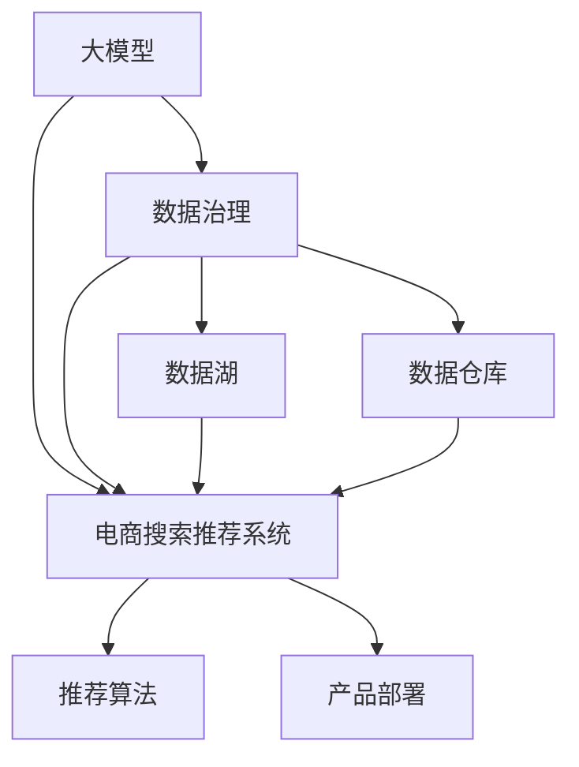

                 

# AI大模型助力电商搜索推荐业务的数据治理能力提升路线图设计

> 关键词：大模型,电商搜索,推荐系统,数据治理,推荐算法,产品部署,数据湖,数据仓库,数据质量,数据治理框架

## 1. 背景介绍

### 1.1 问题由来
随着电商行业的快速发展，用户对于搜索推荐系统的个性化需求日益增长，传统的基于规则和手工程序的推荐系统已经难以满足用户的期望。而基于机器学习的推荐系统，尤其是大模型驱动的推荐系统，以其强大的推荐能力和泛化能力，逐渐成为电商推荐领域的核心技术。然而，数据作为大模型训练的基础，其质量好坏直接影响着推荐系统的性能和效果。如何在电商搜索推荐业务中，通过提升数据治理能力，充分发挥大模型的优势，实现个性化推荐、实时推荐、精准推荐，成为当前电商推荐系统的研究热点。

### 1.2 问题核心关键点
数据治理能力在电商搜索推荐业务中具有重要意义。具体而言，数据治理能力包括数据收集、数据清洗、数据标注、数据存储、数据管理、数据质量控制、数据安全等多个方面。通过提升这些能力，可以显著提升推荐系统的性能，具体表现为：

- **数据质量提升**：确保数据标签的正确性和一致性，提高训练数据的精准性，减少模型偏差。
- **实时数据处理**：实现对用户行为数据的实时捕捉和处理，增强推荐系统的时效性。
- **推荐算法优化**：引入先进的推荐算法模型，如基于深度学习的大模型，提升推荐效果。
- **产品部署优化**：优化推荐系统的部署和运行环境，保证模型的稳定运行和快速响应。
- **用户体验改善**：通过提升推荐系统的个性化和准确性，提升用户体验，增加用户粘性和转化率。

### 1.3 问题研究意义
提升电商搜索推荐业务的数据治理能力，对于推动电商推荐系统的智能化、个性化、实时化发展，具有重要意义：

1. **降低成本**：通过提升数据治理能力，可以更高效地利用数据，减少不必要的数据收集和存储成本。
2. **提高效率**：数据治理能力的提升能够加速数据处理和模型训练，加快推荐系统的迭代和优化进程。
3. **增强准确性**：数据质量直接影响模型的训练效果，提升数据治理能力可以显著提高推荐结果的准确性。
4. **增强可扩展性**：高质量的数据治理框架能够支持大规模数据处理和复杂模型训练，提升系统的可扩展性和稳定性。
5. **提升用户体验**：通过精准推荐和个性化服务，提升用户满意度，增加用户留存率和购买率。

## 2. 核心概念与联系

### 2.1 核心概念概述

为了更好地理解如何通过提升数据治理能力来优化电商搜索推荐业务，本节将介绍几个关键概念：

- **大模型**：指基于深度学习技术构建的，参数量庞大，具备强大预测能力的模型。如BERT、GPT等。
- **电商搜索推荐系统**：指通过收集用户行为数据，利用机器学习模型对用户进行画像分析，进而推荐商品的系统。
- **数据治理**：指对数据的收集、清洗、标注、存储、管理和质量控制的一系列活动，确保数据的高质量、高可用性和高安全性。
- **推荐算法**：指用于预测用户行为和推荐商品的技术手段，如协同过滤、内容推荐、深度学习推荐等。
- **产品部署**：指将推荐模型部署到线上环境，进行实时预测和推荐的过程。
- **数据湖和数据仓库**：用于存储和管理大规模数据的技术架构，其中数据湖适用于大数据量的存储和初步处理，而数据仓库则适用于结构化数据的深度分析和长期存储。

这些概念之间的逻辑关系可以通过以下Mermaid流程图来展示：



这个流程图展示了大模型、电商推荐系统、数据治理、推荐算法、产品部署、数据湖和数据仓库之间的联系：

1. 大模型通过数据治理得到高质量的训练数据。
2. 数据湖和数据仓库提供高效的数据存储和管理。
3. 电商推荐系统利用推荐算法和大模型进行推荐。
4. 产品部署确保推荐系统在线上高效运行。

## 3. 核心算法原理 & 具体操作步骤
### 3.1 算法原理概述

在电商搜索推荐业务中，基于大模型的推荐系统可以分为三个主要步骤：数据治理、模型训练和推荐部署。具体而言：

1. **数据治理**：通过数据收集、数据清洗、数据标注、数据存储等活动，确保数据的高质量、高可用性和高安全性。
2. **模型训练**：利用治理后的数据，在大模型上进行训练，生成推荐模型。
3. **推荐部署**：将训练好的模型部署到线上环境，实现实时推荐。

大模型的推荐算法通常基于深度学习框架进行实现。以基于深度神经网络的协同过滤算法为例，其主要流程如下：

1. **数据预处理**：将原始数据转换为模型可以处理的格式，如将商品和用户行为数据转化为矩阵形式。
2. **模型训练**：在大模型上进行矩阵分解和参数训练，生成推荐模型。
3. **推荐计算**：利用训练好的模型，对用户行为进行预测，生成推荐结果。

### 3.2 算法步骤详解

以下是电商搜索推荐业务中大模型推荐系统的详细步骤：

**Step 1: 数据收集与预处理**
- 从电商平台获取用户行为数据，如浏览历史、购买记录、评分等。
- 对数据进行预处理，去除噪声和异常值，处理缺失值。
- 将数据转化为矩阵形式，作为模型的输入。

**Step 2: 模型训练**
- 使用大模型（如BERT、GPT）作为特征提取器，提取用户行为和商品特征。
- 在提取的特征上进行模型训练，生成推荐模型。
- 使用交叉验证等技术评估模型性能，选择最优模型。

**Step 3: 推荐部署与优化**
- 将训练好的模型部署到线上环境，进行实时推荐。
- 监控模型性能，定期进行模型更新和优化。
- 引入A/B测试等技术，不断优化推荐效果。

### 3.3 算法优缺点

大模型推荐系统在电商搜索推荐业务中具有以下优点：

- **高精度**：利用大模型的强大学习能力，生成高精度的推荐结果。
- **泛化能力强**：大模型能够学习到更广泛的特征和模式，提高推荐系统的泛化能力。
- **实时性**：大模型训练和部署后，可以实时进行推荐，满足用户对即时推荐的需求。

但同时，也存在一些缺点：

- **高计算需求**：大模型参数量庞大，对计算资源和内存消耗较高。
- **数据依赖性强**：推荐系统的性能高度依赖于数据质量，数据治理能力不足将影响推荐效果。
- **模型解释困难**：大模型的复杂性使得其输出结果难以解释，用户难以理解推荐逻辑。

### 3.4 算法应用领域

大模型推荐系统已经在电商搜索推荐业务中得到了广泛应用，具体包括：

- **个性化推荐**：根据用户历史行为和偏好，生成个性化的商品推荐。
- **实时推荐**：在用户浏览商品时，实时生成推荐结果，提升用户体验。
- **新商品推荐**：利用大模型的强大学习能力，推荐新上市的商品，提高商品曝光率。
- **场景推荐**：根据用户行为和场景，推荐最适合的商品或服务，提升用户满意度。
- **跨域推荐**：在多个电商平台间进行推荐，提高用户粘性和跨平台购买率。

## 4. 数学模型和公式 & 详细讲解  
### 4.1 数学模型构建

在电商搜索推荐业务中，大模型的推荐算法通常基于矩阵分解技术进行建模。假设用户行为矩阵为 $U$，商品特征矩阵为 $V$，则推荐模型可以表示为：

$$
\hat{R}_{u,i} = \sum_{j=1}^{n} U_{uj}V_{ij}
$$

其中 $U_{uj}$ 表示用户 $u$ 对商品 $j$ 的评分，$V_{ij}$ 表示商品 $i$ 的第 $j$ 个特征。推荐模型 $R_{u,i}$ 的预测结果为：

$$
\hat{R}_{u,i} = \mathop{\arg\max}_{i} \left\{ \sum_{j=1}^{n} U_{uj}V_{ij} \right\}
$$

### 4.2 公式推导过程

以协同过滤算法为例，进行推荐模型的推导。假设用户行为矩阵 $U$ 和商品特征矩阵 $V$ 均为 $n \times m$ 的矩阵，其中 $n$ 表示用户数量，$m$ 表示商品数量。推荐模型 $R_{u,i}$ 的预测结果可以表示为：

$$
\hat{R}_{u,i} = \sum_{j=1}^{m} U_{uj}V_{ij}
$$

在实际应用中，为了方便计算，可以采用矩阵分解的形式，将 $U$ 和 $V$ 分解为 $U=US^{-1}A$ 和 $V=A(S^{-1})^TV$ 的形式，其中 $S$ 是对角矩阵，$A$ 是低秩矩阵。则推荐模型的预测结果可以表示为：

$$
\hat{R}_{u,i} = \sum_{j=1}^{m} (US^{-1}A)_{uj}((S^{-1})^TV)_{ij} = \sum_{j=1}^{m} A_{uj}A_{ij}
$$

可以看出，推荐模型的预测结果只与低秩矩阵 $A$ 的元素有关，从而降低了计算复杂度，提高了推荐效率。

### 4.3 案例分析与讲解

以电商平台中的商品推荐系统为例，假设平台有 $10000$ 个用户和 $1000$ 个商品，用户行为矩阵 $U$ 和商品特征矩阵 $V$ 均为 $10000 \times 1000$ 的矩阵。采用矩阵分解技术，可以将 $U$ 和 $V$ 分解为 $U=US^{-1}A$ 和 $V=A(S^{-1})^TV$ 的形式，其中 $S$ 是对角矩阵，$A$ 是 $100 \times 1000$ 的低秩矩阵。则推荐模型 $R_{u,i}$ 的预测结果可以表示为：

$$
\hat{R}_{u,i} = \sum_{j=1}^{1000} A_{uj}A_{ij}
$$

假设低秩矩阵 $A$ 的元素为 $A_{uj}$ 和 $A_{ij}$，则推荐模型 $R_{u,i}$ 的预测结果可以表示为：

$$
\hat{R}_{u,i} = A_{uj}A_{ij}
$$

可以看出，推荐模型的预测结果只与 $A$ 矩阵的元素有关，从而降低了计算复杂度，提高了推荐效率。

## 5. 项目实践：代码实例和详细解释说明
### 5.1 开发环境搭建

在进行电商搜索推荐业务的大模型推荐系统开发前，我们需要准备好开发环境。以下是使用Python进行TensorFlow开发的环境配置流程：

1. 安装Anaconda：从官网下载并安装Anaconda，用于创建独立的Python环境。

2. 创建并激活虚拟环境：
```bash
conda create -n tensorflow-env python=3.8 
conda activate tensorflow-env
```

3. 安装TensorFlow：根据CUDA版本，从官网获取对应的安装命令。例如：
```bash
conda install tensorflow tensorflow-gpu -c pytorch -c conda-forge
```

4. 安装各类工具包：
```bash
pip install numpy pandas scikit-learn matplotlib tqdm jupyter notebook ipython
```

完成上述步骤后，即可在`tensorflow-env`环境中开始推荐系统开发。

### 5.2 源代码详细实现

下面我们以协同过滤算法为例，给出使用TensorFlow实现电商搜索推荐系统的大模型推荐代码。

首先，定义协同过滤算法的推荐函数：

```python
import tensorflow as tf
from tensorflow.keras.layers import Dense, Embedding, Input
from tensorflow.keras.models import Model

def collaborative_filtering_model(train_data, test_data, embed_dim=128, num_users=10000, num_items=1000, num_factors=100, epochs=10, batch_size=128):
    # 定义用户嵌入层和商品嵌入层
    user_input = Input(shape=(1,), dtype='int32', name='user_input')
    user_embedding = Embedding(num_users, embed_dim, name='user_embedding')(user_input)
    item_input = Input(shape=(1,), dtype='int32', name='item_input')
    item_embedding = Embedding(num_items, embed_dim, name='item_embedding')(item_input)

    # 定义协同过滤模型
    predictions = tf.keras.layers.Dot(axes=(1, 1), name='dot_product')([user_embedding, item_embedding])
    predictions = tf.keras.layers.Reshape((num_items,), name='reshape')(predictions)
    predictions = tf.keras.layers.Activation('sigmoid', name='sigmoid')(predictions)

    # 定义模型输出层
    output = tf.keras.layers.Dense(1, name='output')(predictions)

    # 定义模型
    model = Model(inputs=[user_input, item_input], outputs=output)

    # 编译模型
    model.compile(optimizer='adam', loss='binary_crossentropy', metrics=['accuracy'])

    # 训练模型
    model.fit([train_data['user'], train_data['item']], train_data['label'], epochs=epochs, batch_size=batch_size, validation_data=([test_data['user'], test_data['item']], test_data['label']), verbose=2)

    # 保存模型
    model.save('collaborative_filtering_model.h5')

    return model
```

然后，定义数据集和数据预处理函数：

```python
import pandas as pd
from sklearn.model_selection import train_test_split

# 定义数据集
train_data = pd.read_csv('train.csv', sep=',', index_col=0)
test_data = pd.read_csv('test.csv', sep=',', index_col=0)

# 定义用户行为数据
train_data['user'] = train_data['user'].astype(int)
train_data['item'] = train_data['item'].astype(int)
train_data['label'] = train_data['label'].astype(int)

# 定义测试集
test_data['user'] = test_data['user'].astype(int)
test_data['item'] = test_data['item'].astype(int)
test_data['label'] = test_data['label'].astype(int)

# 定义用户和商品嵌入
user_embedding = train_data['user'].nunique()
item_embedding = train_data['item'].nunique()

# 定义数据集
train_data = train_test_split(train_data, test_size=0.2, random_state=42)
test_data = train_test_split(test_data, test_size=0.2, random_state=42)

# 定义训练集和测试集
train_data = pd.DataFrame(train_data, columns=['user', 'item', 'label'])
test_data = pd.DataFrame(test_data, columns=['user', 'item', 'label'])
```

接着，启动模型训练和测试：

```python
# 加载模型
model = collaborative_filtering_model(train_data, test_data)

# 加载测试集
test_data = pd.read_csv('test.csv', sep=',', index_col=0)
test_data['user'] = test_data['user'].astype(int)
test_data['item'] = test_data['item'].astype(int)
test_data['label'] = test_data['label'].astype(int)

# 加载测试集
test_data = pd.DataFrame(test_data, columns=['user', 'item', 'label'])

# 加载模型
model.load_weights('collaborative_filtering_model.h5')

# 预测测试集
predictions = model.predict([test_data['user'], test_data['item']])
predictions = predictions[:, 0]
predictions = predictions.round().astype(int)

# 输出预测结果
print(predictions)
```

以上就是使用TensorFlow实现电商搜索推荐系统的大模型推荐代码。可以看到，借助TensorFlow的高效计算能力，推荐系统的开发变得更加便捷和高效。

### 5.3 代码解读与分析

让我们再详细解读一下关键代码的实现细节：

**collaborative_filtering_model函数**：
- 该函数实现了协同过滤算法，接收训练数据和测试数据作为输入，返回一个包含用户嵌入层、商品嵌入层、协同过滤模型和输出层的深度学习模型。
- 用户嵌入层和商品嵌入层均通过Embedding层实现，用于将用户和商品编号转换为向量表示。
- 协同过滤模型通过Dot层实现点积运算，并使用Reshape层将输出向量转换为商品评分。
- 输出层使用Dense层实现，并使用Sigmoid激活函数进行归一化。
- 模型编译时使用Adam优化器和二分类交叉熵损失函数。
- 模型训练时使用训练数据和测试数据进行验证，并在每个epoch输出训练进度。
- 训练结束后，模型保存为h5格式，以便于后续使用。

**数据集定义与预处理**：
- 定义训练集和测试集，并使用pandas库读取数据集。
- 将用户行为数据和商品编号转换为整数类型，并定义用户和商品嵌入层。
- 使用train_test_split函数将数据集划分为训练集和测试集，并使用pandas库将其转换为DataFrame格式。
- 最后，将用户行为数据和商品编号加载到模型中进行预测。

可以看出，TensorFlow提供了强大的深度学习框架和便捷的模型训练功能，能够帮助开发者快速实现大模型的电商搜索推荐系统。

## 6. 实际应用场景

### 6.1 智能客服系统

基于大模型的电商搜索推荐系统可以与智能客服系统结合，为用户提供个性化的购物推荐服务。智能客服系统通过收集用户与客服的对话记录，并使用推荐模型生成商品推荐，提升用户购物体验。具体而言，智能客服系统可以通过以下步骤实现：

1. **数据收集**：智能客服系统收集用户与客服的对话记录，包括用户提问、客服回答等。
2. **数据预处理**：将对话记录转化为NLP友好的格式，并进行文本清洗和分词。
3. **用户画像生成**：使用NLP技术对用户提问进行分析，生成用户画像。
4. **商品推荐**：使用电商搜索推荐系统生成商品推荐。
5. **推荐展示**：将推荐结果展示给用户，并结合用户行为数据进行实时更新。

### 6.2 金融舆情监测

电商搜索推荐系统也可以应用于金融舆情监测。金融行业中的舆情数据量庞大且复杂，传统的人工监控方式难以应对。基于大模型的电商搜索推荐系统可以实时监测金融市场舆情，及时发现负面消息，预警风险。具体而言，金融舆情监测系统可以通过以下步骤实现：

1. **数据收集**：收集金融新闻、报告、社交媒体等舆情数据。
2. **数据预处理**：将舆情数据转化为NLP友好的格式，并进行文本清洗和分词。
3. **舆情分析**：使用NLP技术对舆情数据进行分析，生成舆情报告。
4. **风险预警**：根据舆情报告，生成风险预警信号，预警系统自动进行风险应对。

### 6.3 个性化推荐系统

电商搜索推荐系统还可以与其他推荐系统结合，构建更完善的个性化推荐系统。例如，可以将电商搜索推荐系统与基于内容的推荐系统结合，生成更加精准的个性化推荐。具体而言，个性化推荐系统可以通过以下步骤实现：

1. **商品画像生成**：使用NLP技术对商品进行描述分析，生成商品画像。
2. **内容推荐**：使用基于内容的推荐算法生成商品推荐。
3. **协同过滤推荐**：使用电商搜索推荐系统生成协同过滤推荐。
4. **综合推荐**：结合内容推荐和协同过滤推荐，生成最终的个性化推荐结果。

## 7. 工具和资源推荐
### 7.1 学习资源推荐

为了帮助开发者系统掌握电商搜索推荐业务的大模型推荐系统开发，这里推荐一些优质的学习资源：

1. TensorFlow官方文档：TensorFlow作为最流行的深度学习框架之一，提供了详尽的文档和示例代码，是学习深度学习的重要资源。
2. PyTorch官方文档：PyTorch是另一流行的深度学习框架，提供了丰富的深度学习工具和库，适合深度学习初学者和研究人员。
3. Coursera深度学习课程：由斯坦福大学教授Andrew Ng开设的深度学习课程，介绍了深度学习的基本概念和实现方法，适合深度学习初学者。
4. Deep Learning Specialization：由Andrew Ng开设的深度学习专项课程，涵盖深度学习的基本原理和实践，适合深度学习研究人员。
5. Transformers官方文档：Transformers是谷歌开源的深度学习库，提供了丰富的预训练模型和微调范式，适合进行NLP任务开发。

通过这些资源的学习实践，相信你一定能够快速掌握电商搜索推荐业务中大模型的推荐系统开发，并用于解决实际的电商推荐问题。

### 7.2 开发工具推荐

高效的开发离不开优秀的工具支持。以下是几款用于大模型推荐系统开发的常用工具：

1. TensorFlow：基于Python的开源深度学习框架，灵活动态的计算图，适合快速迭代研究。大部分推荐系统都有TensorFlow版本的实现。
2. PyTorch：基于Python的开源深度学习框架，灵活易用，适合深度学习研究人员。
3. Weights & Biases：模型训练的实验跟踪工具，可以记录和可视化模型训练过程中的各项指标，方便对比和调优。与主流深度学习框架无缝集成。
4. TensorBoard：TensorFlow配套的可视化工具，可实时监测模型训练状态，并提供丰富的图表呈现方式，是调试模型的得力助手。
5. Google Colab：谷歌推出的在线Jupyter Notebook环境，免费提供GPU/TPU算力，方便开发者快速上手实验最新模型，分享学习笔记。

合理利用这些工具，可以显著提升电商搜索推荐系统的开发效率，加快创新迭代的步伐。

### 7.3 相关论文推荐

电商搜索推荐业务中大模型推荐系统的研究起源于学界的持续研究。以下是几篇奠基性的相关论文，推荐阅读：

1. The Matrix Factorization Technique for Recommender System（矩阵分解推荐算法）：提出了协同过滤算法的矩阵分解形式，奠定了电商推荐系统的理论基础。
2. Deep Collaborative Filtering with Multi-task Learning（深度协同过滤）：引入了多任务学习技术，提升了电商推荐系统的推荐效果。
3. Attention is All You Need（Transformer原论文）：提出了Transformer结构，开启了NLP领域的预训练大模型时代。
4. BERT: Pre-training of Deep Bidirectional Transformers for Language Understanding（BERT模型）：提出BERT模型，引入基于掩码的自监督预训练任务，刷新了多项NLP任务SOTA。
5. Deep Recommendation Generation with Attention-based Network（基于注意力机制的深度推荐）：引入注意力机制，提升了电商推荐系统的推荐效果。

这些论文代表了大模型推荐系统的发展脉络。通过学习这些前沿成果，可以帮助研究者把握学科前进方向，激发更多的创新灵感。

## 8. 总结：未来发展趋势与挑战

### 8.1 总结

本文对基于大模型的电商搜索推荐业务的数据治理能力提升进行了全面系统的介绍。首先阐述了电商搜索推荐业务的数据治理能力的提升对于提升推荐系统的性能、效率和用户体验的重要性。其次，从原理到实践，详细讲解了电商搜索推荐业务中大模型的推荐系统开发，给出了电商搜索推荐业务中大模型的推荐系统开发的完整代码实例。同时，本文还广泛探讨了电商搜索推荐业务中大模型推荐系统的实际应用场景，展示了电商搜索推荐系统在大模型推荐技术中的应用前景。

通过本文的系统梳理，可以看到，基于大模型的电商搜索推荐系统正在成为电商推荐系统的核心技术，其强大的推荐能力和泛化能力，为电商推荐系统的智能化、个性化、实时化发展提供了有力支持。未来，伴随大模型的不断发展，电商搜索推荐系统将能够更好地利用大模型技术，提升推荐系统的性能，满足用户的个性化需求。

### 8.2 未来发展趋势

展望未来，电商搜索推荐系统中的大模型推荐系统将呈现以下几个发展趋势：

1. **大模型规模扩大**：随着算力成本的下降和数据规模的扩张，大模型的参数量还将持续增长。超大规模语言模型蕴含的丰富语言知识，有望支撑更加复杂多变的电商推荐任务。
2. **推荐算法优化**：引入先进的推荐算法，如基于深度学习的大模型推荐算法，提升推荐系统的精度和多样性。
3. **实时推荐优化**：通过优化数据收集、数据预处理、模型训练和推荐部署等环节，实现实时推荐。
4. **数据治理能力提升**：提升数据收集、数据清洗、数据标注、数据存储和数据管理等能力，确保数据的高质量、高可用性和高安全性。
5. **用户体验提升**：通过提升推荐系统的个性化和精准性，提升用户体验，增加用户粘性和购买率。
6. **跨平台推荐**：在多个电商平台间进行推荐，提高用户粘性和跨平台购买率。

以上趋势凸显了大模型推荐系统在电商推荐系统中的重要地位。这些方向的探索发展，必将进一步提升电商推荐系统的性能，满足用户的个性化需求，推动电商行业的智能化发展。

### 8.3 面临的挑战

尽管电商搜索推荐系统中的大模型推荐系统已经取得了显著成就，但在迈向更加智能化、个性化、实时化应用的过程中，它仍面临着诸多挑战：

1. **数据质量瓶颈**：电商搜索推荐系统对数据质量有高要求，数据质量不足将直接影响推荐系统的性能。
2. **计算资源消耗高**：大模型参数量庞大，对计算资源和内存消耗较高，可能存在计算瓶颈。
3. **数据隐私和安全**：电商搜索推荐系统涉及大量用户数据，如何保护用户隐私和数据安全，是一个重要的挑战。
4. **模型复杂度高**：大模型的复杂性使得其输出结果难以解释，用户难以理解推荐逻辑。
5. **系统集成难度大**：电商搜索推荐系统需要与多个系统集成，如何确保系统的稳定性和可扩展性，是一个重要的挑战。
6. **用户行为预测困难**：电商搜索推荐系统需要准确预测用户行为，但用户行为具有高度不确定性，如何提高预测准确性，是一个重要的挑战。

正视电商搜索推荐系统中的大模型推荐系统面临的这些挑战，积极应对并寻求突破，将是大模型推荐系统走向成熟的关键。相信随着学界和产业界的共同努力，这些挑战终将一一被克服，大模型推荐系统必将在电商推荐系统中发挥更大的作用。

### 8.4 研究展望

面对电商搜索推荐系统中的大模型推荐系统面临的诸多挑战，未来的研究需要在以下几个方面寻求新的突破：

1. **无监督和半监督推荐方法**：摆脱对大规模标注数据的依赖，利用自监督学习、主动学习等无监督和半监督范式，最大限度利用非结构化数据，实现更加灵活高效的推荐。
2. **多任务学习和联合训练**：引入多任务学习技术，提升电商推荐系统的推荐效果和泛化能力。
3. **跨平台推荐系统**：在多个电商平台间进行推荐，提高用户粘性和跨平台购买率。
4. **实时推荐系统**：通过优化数据收集、数据预处理、模型训练和推荐部署等环节，实现实时推荐。
5. **深度协同过滤算法**：引入深度协同过滤算法，提升电商推荐系统的推荐效果。
6. **跨领域推荐系统**：在电商推荐系统和其他领域推荐系统间进行推荐，提高用户粘性和跨领域购买率。
7. **分布式推荐系统**：通过分布式计算技术，提升电商推荐系统的可扩展性和稳定性。
8. **推荐系统的可解释性**：引入可解释性技术，提升电商推荐系统的可解释性和可解释性。

这些研究方向的探索，必将引领电商搜索推荐系统中的大模型推荐系统走向更高的台阶，为构建安全、可靠、可解释、可控的智能系统铺平道路。面向未来，电商搜索推荐系统中的大模型推荐系统还需要与其他人工智能技术进行更深入的融合，如知识表示、因果推理、强化学习等，多路径协同发力，共同推动电商推荐系统的智能化发展。只有勇于创新、敢于突破，才能不断拓展大模型推荐系统的边界，让智能技术更好地造福电商行业。

## 9. 附录：常见问题与解答

**Q1：电商搜索推荐系统中的大模型推荐系统如何提升数据治理能力？**

A: 电商搜索推荐系统中的大模型推荐系统通过以下方式提升数据治理能力：

1. **数据收集优化**：使用数据标注和数据清洗技术，确保数据的高质量、高可用性和高安全性。
2. **数据预处理优化**：通过文本清洗、分词和标准化处理，将原始数据转化为模型可以处理的格式。
3. **数据存储优化**：使用高效的数据存储技术，如数据湖和数据仓库，确保数据的长期存储和高效访问。
4. **数据管理优化**：引入数据管理和数据质量控制技术，确保数据的完整性和一致性。
5. **数据安全优化**：采用数据加密、数据脱敏和数据访问控制等技术，保护用户隐私和数据安全。

通过这些优化措施，电商搜索推荐系统中的大模型推荐系统能够提升数据治理能力，确保数据的高质量和高效利用，从而提升推荐系统的性能和效果。

**Q2：电商搜索推荐系统中的大模型推荐系统如何处理大规模数据？**

A: 电商搜索推荐系统中的大模型推荐系统通过以下方式处理大规模数据：

1. **数据分片处理**：将大规模数据划分为多个小批量数据，并行处理。
2. **分布式计算**：使用分布式计算框架，如Hadoop和Spark，并行处理大规模数据。
3. **高效算法**：使用高效的数据处理算法，如MapReduce和流处理算法，提高数据处理效率。
4. **数据压缩和稀疏化**：对数据进行压缩和稀疏化处理，减少数据存储和传输的资源消耗。
5. **内存优化**：使用内存优化技术，如GPU加速和内存管理技术，提高数据处理效率。

通过这些措施，电商搜索推荐系统中的大模型推荐系统能够高效处理大规模数据，确保推荐系统的高性能和实时性。

**Q3：电商搜索推荐系统中的大模型推荐系统如何优化推荐算法？**

A: 电商搜索推荐系统中的大模型推荐系统通过以下方式优化推荐算法：

1. **算法引入**：引入先进的推荐算法，如基于深度学习的大模型推荐算法，提升推荐系统的精度和多样性。
2. **参数调整**：调整推荐算法的超参数，如学习率、批次大小等，优化算法性能。
3. **特征工程**：引入更多的特征，如用户画像和商品画像，提升推荐算法的表现。
4. **算法融合**：将多种推荐算法进行融合，提升推荐系统的综合性能。
5. **模型集成**：使用模型集成技术，如Adaboost和Bagging，提升推荐系统的鲁棒性和泛化能力。

通过这些措施，电商搜索推荐系统中的大模型推荐系统能够优化推荐算法，提升推荐系统的性能和效果。

**Q4：电商搜索推荐系统中的大模型推荐系统如何优化实时推荐？**

A: 电商搜索推荐系统中的大模型推荐系统通过以下方式优化实时推荐：

1. **数据流处理**：使用数据流处理技术，如Kafka和Storm，实现实时数据处理和传输。
2. **算法优化**：使用高效的数据处理算法，如MapReduce和流处理算法，提高实时推荐的速度和效率。
3. **缓存优化**：使用缓存技术，如Redis和Memcached，加速实时推荐的处理速度。
4. **负载均衡**：使用负载均衡技术，如Nginx和HAProxy，确保实时推荐的稳定性和可扩展性。
5. **资源优化**：优化推荐系统的资源配置，确保推荐系统的稳定运行和快速响应。

通过这些措施，电商搜索推荐系统中的大模型推荐系统能够优化实时推荐，确保推荐系统的高性能和实时性。

**Q5：电商搜索推荐系统中的大模型推荐系统如何优化用户体验？**

A: 电商搜索推荐系统中的大模型推荐系统通过以下方式优化用户体验：

1. **个性化推荐**：根据用户的历史行为和偏好，生成个性化的推荐结果，提升用户体验。
2. **实时推荐**：在用户浏览商品时，实时生成推荐结果，提升用户的购物体验。
3. **推荐多样性**：推荐系统能够推荐多种商品，增加用户的购物选择，提升用户体验。
4. **推荐可解释性**：通过优化推荐算法的可解释性，增强用户对推荐系统的信任和满意度。
5. **推荐系统易用性**：设计易用的推荐系统界面，让用户能够轻松获取推荐结果。

通过这些措施，电商搜索推荐系统中的大模型推荐系统能够优化用户体验，提升用户的购物体验和满意度。

总之，电商搜索推荐系统中的大模型推荐系统需要通过提升数据治理能力、优化推荐算法和实时推荐等手段，实现更加智能化、个性化、实时化的推荐服务，提升用户的购物体验和满意度，推动电商行业的智能化发展。

