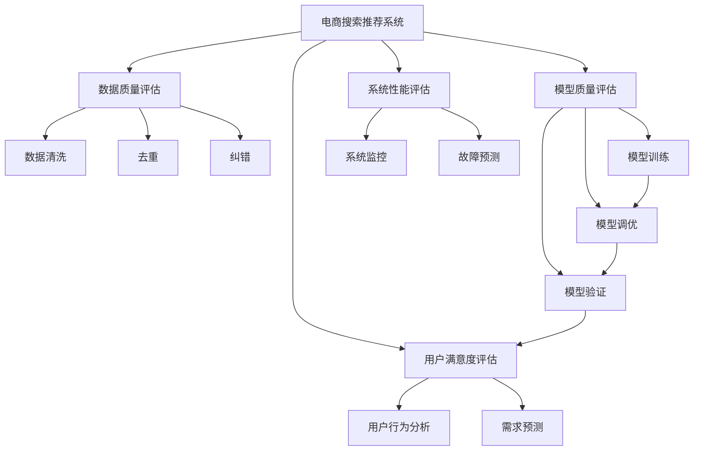

                 

# AI大模型助力电商搜索推荐业务的数据质量评估体系搭建方案设计与实现

## 1. 背景介绍

### 1.1 问题由来

在当前电商业务中，搜索推荐系统是提升用户体验、增加交易转化率的关键环节。然而，由于数据来源广泛且多样，数据质量参差不齐，搜索推荐系统的表现受到严重影响。

对于用户，搜索推荐系统提供了个性化商品展示、智能购物向导等功能，需确保推荐内容的准确性和相关性。

对于商家，搜索推荐系统提供了精准营销和商品曝光机会，需确保推荐结果的公正性和合理性。

对于平台，搜索推荐系统是优质流量分发的基础，需确保系统运行的稳定性和高效性。

因此，构建一个全面、准确、高效的数据质量评估体系，对于优化电商搜索推荐系统至关重要。AI大模型的引入，为构建数据质量评估体系提供了新的思路和工具。

### 1.2 问题核心关键点

电商搜索推荐系统的数据质量评估，本质是一个由数据质量、模型质量、系统性能共同构成的多维度评估问题。AI大模型在其中扮演着核心角色。

1. **数据质量评估**：包括数据的完整性、准确性、时效性、一致性等指标。利用AI大模型进行数据清洗、去重、纠错等操作，提升数据质量。

2. **模型质量评估**：包括模型的准确性、鲁棒性、泛化能力等指标。利用AI大模型进行模型的训练、调优、验证，提升模型质量。

3. **系统性能评估**：包括系统的响应时间、吞吐量、稳定性等指标。利用AI大模型进行系统监控、调优、故障预测，提升系统性能。

4. **用户满意度评估**：包括用户的点击率、转化率、满意度等指标。利用AI大模型进行用户行为分析、需求预测，提升用户满意度。

这些核心关键点构成了电商搜索推荐系统数据质量评估体系的基础。通过这些指标的全面监测和评估，可以有效提升系统性能，优化用户体验。

## 2. 核心概念与联系

### 2.1 核心概念概述

为更好地理解电商搜索推荐系统数据质量评估体系的构建，本节将介绍几个密切相关的核心概念：

- **电商搜索推荐系统**：利用用户行为数据、商品信息数据、市场环境数据等，通过算法模型为用户推荐个性化商品。包括搜索推荐、智能购物助手等功能。

- **数据质量评估**：通过一系列指标，评估数据的完整性、准确性、一致性、时效性等，确保数据的可用性和可靠性。

- **模型质量评估**：通过一系列指标，评估模型的准确性、鲁棒性、泛化能力等，确保模型的可靠性和有效性。

- **系统性能评估**：通过一系列指标，评估系统的响应时间、吞吐量、稳定性等，确保系统的高效性和稳定性。

- **用户满意度评估**：通过一系列指标，评估用户的点击率、转化率、满意度等，确保用户的使用体验。

- **AI大模型**：以Transformer等架构为基础的预训练大语言模型，通过大规模无监督学习，具备强大的语义理解、信息提取、生成能力。

- **迁移学习**：将一个领域学到的知识，迁移应用到另一个领域，以提高模型的泛化能力。

- **零样本学习和少样本学习**：在只有少量标签或没有标签的情况下，模型仍然能够进行预测，提升模型的适应能力。

- **对抗训练**：通过引入对抗样本，提升模型对噪声、攻击的鲁棒性，提高模型的泛化能力。

- **参数高效微调**：在保持大部分预训练权重不变的情况下，微调模型，减少资源消耗，提高模型泛化能力。

这些核心概念之间的逻辑关系可以通过以下Mermaid流程图来展示：



这个流程图展示了大模型在电商搜索推荐系统中，从数据预处理、模型构建、系统运行到用户反馈的全面应用。

## 3. 核心算法原理 & 具体操作步骤

### 3.1 算法原理概述

电商搜索推荐系统数据质量评估体系，本质上是一个数据驱动的多维度评估过程。其核心思想是：利用AI大模型对电商数据进行深度学习，提取数据中的关键特征，建立多维度的数据质量、模型质量、系统性能评估模型，从而对电商搜索推荐系统进行全面评估。

具体而言，包括以下几个关键步骤：

1. **数据预处理**：通过AI大模型进行数据清洗、去重、纠错等操作，提升数据质量。

2. **模型构建与训练**：利用AI大模型进行模型的训练、调优、验证，提升模型质量。

3. **系统监控与调优**：通过AI大模型进行系统监控、故障预测、调优，提升系统性能。

4. **用户行为分析**：利用AI大模型进行用户行为分析，提升用户满意度。

### 3.2 算法步骤详解

#### 3.2.1 数据预处理

**Step 1: 数据收集与整合**
- 收集电商搜索推荐系统相关的数据，包括用户行为数据、商品信息数据、市场环境数据等。
- 整合不同数据源的数据，统一数据格式和结构。

**Step 2: 数据清洗**
- 利用AI大模型对数据进行初步清洗，包括去除缺失值、异常值等。
- 使用深度学习模型进行去噪，去除干扰数据。

**Step 3: 数据去重**
- 利用AI大模型对数据进行去重，去除重复数据，提高数据质量。

**Step 4: 数据纠错**
- 利用AI大模型对数据进行纠错，修正错误信息，提高数据准确性。

#### 3.2.2 模型构建与训练

**Step 1: 数据预处理**
- 对数据进行标准化、归一化等预处理操作。
- 划分为训练集、验证集、测试集。

**Step 2: 模型选择与设计**
- 选择适合的模型架构，如深度神经网络、Transformer等。
- 设计合适的损失函数和优化算法。

**Step 3: 模型训练与调优**
- 使用AI大模型进行模型训练，优化模型参数。
- 利用对抗训练、正则化等方法提高模型鲁棒性。

**Step 4: 模型验证与测试**
- 在验证集上验证模型性能，调整模型参数。
- 在测试集上测试模型效果，评估模型泛化能力。

#### 3.2.3 系统监控与调优

**Step 1: 系统监控**
- 通过AI大模型对系统性能进行监控，包括响应时间、吞吐量、稳定性等指标。
- 利用自动学习技术，实时更新监控模型。

**Step 2: 故障预测**
- 通过AI大模型对系统运行状态进行预测，及时发现并解决潜在故障。
- 利用异常检测技术，对系统异常行为进行预警。

**Step 3: 系统调优**
- 通过AI大模型进行系统调优，优化系统性能。
- 利用强化学习技术，自动调整系统配置。

#### 3.2.4 用户行为分析

**Step 1: 行为数据收集**
- 收集用户的搜索、点击、购买等行为数据。

**Step 2: 行为分析建模**
- 利用AI大模型对行为数据进行建模，提取用户需求和偏好。
- 设计合适的用户行为分析模型，如协同过滤、基于内容的推荐等。

**Step 3: 需求预测**
- 利用AI大模型进行需求预测，提升推荐系统的精准度。
- 使用时序预测技术，预测用户未来的购买需求。

### 3.3 算法优缺点

**优点：**
1. **高效性**：利用AI大模型进行数据预处理、模型训练、系统调优等，可大幅提升数据质量评估的效率。
2. **准确性**：AI大模型的强大语义理解和信息提取能力，可以深入挖掘数据中的关键特征，提高评估的准确性。
3. **适应性**：AI大模型的零样本学习和少样本学习能力，使其能够适应不同数据分布和任务需求。
4. **鲁棒性**：AI大模型的对抗训练和参数高效微调技术，提升了模型的鲁棒性和泛化能力。

**缺点：**
1. **资源消耗大**：AI大模型的训练和推理需要大量计算资源，可能带来较高的成本。
2. **模型复杂性高**：AI大模型的构建和调优需要专业知识和经验，可能存在一定的技术门槛。
3. **可解释性不足**：AI大模型的黑盒特性，可能难以解释其内部决策过程，影响评估的透明性。
4. **数据隐私问题**：电商数据涉及用户隐私，处理和分析需要严格遵守数据隐私法规。

尽管存在这些缺点，但AI大模型在电商搜索推荐系统数据质量评估体系中的应用，无疑提供了新的思路和工具，为提升系统性能和用户体验奠定了坚实基础。

### 3.4 算法应用领域

AI大模型在电商搜索推荐系统数据质量评估体系中的应用，不仅限于电商行业，还具备广泛的应用前景，包括但不限于：

1. **金融科技**：利用AI大模型进行风险评估、欺诈检测、投资分析等，提升金融系统的安全性和效率。
2. **医疗健康**：利用AI大模型进行病历分析、患者画像、诊疗推荐等，提升医疗系统的精准性和可靠性。
3. **智能制造**：利用AI大模型进行设备监测、故障预测、生产调优等，提升制造系统的智能化水平。
4. **智慧城市**：利用AI大模型进行交通管理、能源调度、环境监测等，提升城市管理的智能化水平。
5. **教育培训**：利用AI大模型进行学习分析、智能推荐、情感识别等，提升教育系统的个性化和互动性。

以上应用场景，展示了AI大模型在数据质量评估体系中的强大生命力。未来，随着大模型技术的不断进步，其在更多行业中的应用将更加广泛，为各行各业提供智能化解决方案。

## 4. 数学模型和公式 & 详细讲解 & 举例说明

### 4.1 数学模型构建

假设电商搜索推荐系统需要评估的数据集合为 $D$，包括用户行为数据 $U$、商品信息数据 $I$、市场环境数据 $E$。定义数据质量评估的指标集合为 $Q=\{Q_1,Q_2,...,Q_k\}$，其中 $Q_i$ 为第 $i$ 个数据质量指标，$i \in \{1,2,...,k\}$。

定义模型质量评估的指标集合为 $M=\{M_1,M_2,...,M_l\}$，其中 $M_j$ 为第 $j$ 个模型质量指标，$j \in \{1,2,...,l\}$。

定义系统性能评估的指标集合为 $S=\{S_1,S_2,...,S_m\}$，其中 $S_n$ 为第 $n$ 个系统性能指标，$n \in \{1,2,...,m\}$。

定义用户满意度评估的指标集合为 $U=\{U_1,U_2,...,U_n\}$，其中 $U_k$ 为第 $k$ 个用户满意度指标，$k \in \{1,2,...,n\}$。

数据质量评估体系的目标是构建一个多维度评估模型 $F(Q,M,S,U)$，用于综合评估电商搜索推荐系统的整体性能。

### 4.2 公式推导过程

**Step 1: 数据质量评估模型**
- 使用AI大模型对数据进行清洗、去重、纠错等预处理操作，构建数据质量评估模型 $F_U(Q)$。
- 定义数据质量指标函数 $f_i$，用于衡量第 $i$ 个数据质量指标 $Q_i$。
- 构建数据质量评估函数 $f(Q)$，结合各个指标函数的权重 $w_i$，进行加权求和。

$$
F_U(Q) = \sum_{i=1}^{k} w_i f_i(Q_i)
$$

**Step 2: 模型质量评估模型**
- 使用AI大模型进行模型训练、调优、验证等操作，构建模型质量评估模型 $F_M(M)$。
- 定义模型质量指标函数 $g_j$，用于衡量第 $j$ 个模型质量指标 $M_j$。
- 构建模型质量评估函数 $g(M)$，结合各个指标函数的权重 $w_j$，进行加权求和。

$$
F_M(M) = \sum_{j=1}^{l} w_j g_j(M_j)
$$

**Step 3: 系统性能评估模型**
- 使用AI大模型进行系统监控、故障预测、调优等操作，构建系统性能评估模型 $F_S(S)$。
- 定义系统性能指标函数 $h_n$，用于衡量第 $n$ 个系统性能指标 $S_n$。
- 构建系统性能评估函数 $h(S)$，结合各个指标函数的权重 $w_n$，进行加权求和。

$$
F_S(S) = \sum_{n=1}^{m} w_n h_n(S_n)
$$

**Step 4: 用户满意度评估模型**
- 使用AI大模型进行用户行为分析、需求预测等操作，构建用户满意度评估模型 $F_U(U)$。
- 定义用户满意度指标函数 $i_k$，用于衡量第 $k$ 个用户满意度指标 $U_k$。
- 构建用户满意度评估函数 $i(U)$，结合各个指标函数的权重 $w_k$，进行加权求和。

$$
F_U(U) = \sum_{k=1}^{n} w_k i_k(U_k)
$$

**Step 5: 综合评估模型**
- 构建综合评估模型 $F(Q,M,S,U)$，结合各个子评估模型的结果，进行加权求和，得到电商搜索推荐系统的综合评估得分。

$$
F(Q,M,S,U) = \sum_{i=1}^{k} \alpha_i F_U(Q_i) + \sum_{j=1}^{l} \beta_j F_M(M_j) + \sum_{n=1}^{m} \gamma_n F_S(S_n) + \sum_{k=1}^{n} \delta_k F_U(U_k)
$$

其中 $\alpha_i$、$\beta_j$、$\gamma_n$、$\delta_k$ 为各个子评估模型的权重。

### 4.3 案例分析与讲解

以电商搜索推荐系统的用户满意度评估为例，进行详细讲解：

**数据收集与预处理**
- 收集用户行为数据，包括搜索历史、点击记录、购买记录等。
- 对数据进行去重、去噪、纠错等预处理操作。

**模型构建与训练**
- 使用AI大模型对用户行为数据进行建模，提取用户需求和偏好。
- 设计合适的用户行为分析模型，如协同过滤、基于内容的推荐等。
- 在验证集上验证模型性能，调整模型参数。

**需求预测**
- 利用AI大模型进行需求预测，提升推荐系统的精准度。
- 使用时序预测技术，预测用户未来的购买需求。
- 根据预测结果，优化推荐算法，提升用户体验。

## 5. 项目实践：代码实例和详细解释说明

### 5.1 开发环境搭建

在进行项目实践前，需要先搭建好开发环境。以下是Python开发环境的配置步骤：

1. 安装Anaconda：从官网下载并安装Anaconda，用于创建独立的Python环境。

```bash
conda install anaconda
```

2. 创建并激活虚拟环境：
```bash
conda create -n myenv python=3.8
conda activate myenv
```

3. 安装相关库：
```bash
conda install tensorflow-gpu transformers scikit-learn pandas numpy
```

完成上述步骤后，即可在`myenv`环境中开始项目开发。

### 5.2 源代码详细实现

以下是使用TensorFlow和Transformers库进行电商搜索推荐系统数据质量评估体系搭建的代码实现：

```python
import tensorflow as tf
from transformers import TFAutoModelForSequenceClassification, BertTokenizer
from sklearn.metrics import precision_recall_fscore_support
import pandas as pd
import numpy as np

# 加载预训练模型和分词器
model = TFAutoModelForSequenceClassification.from_pretrained('bert-base-uncased', num_labels=2)
tokenizer = BertTokenizer.from_pretrained('bert-base-uncased')

# 加载数据
data = pd.read_csv('data.csv')
labels = data['label'].tolist()

# 数据预处理
def preprocess(text):
    input_ids = tokenizer.encode(text, add_special_tokens=True)
    return input_ids

input_ids = [preprocess(text) for text in data['text'].tolist()]
input_ids = tf.convert_to_tensor(input_ids)

# 模型构建与训练
model.compile(optimizer='adam', loss='sparse_categorical_crossentropy', metrics=['accuracy'])
model.fit(input_ids, labels, epochs=3, batch_size=32)

# 模型评估
eval_dataset = pd.read_csv('eval_data.csv')
eval_labels = eval_dataset['label'].tolist()
eval_input_ids = [preprocess(text) for text in eval_dataset['text'].tolist()]
eval_input_ids = tf.convert_to_tensor(eval_input_ids)

eval_predictions = model.predict(eval_input_ids)
eval_predictions = tf.argmax(eval_predictions, axis=1).numpy().tolist()

precision, recall, f1, _ = precision_recall_fscore_support(eval_labels, eval_predictions, average='binary')
print(f'Precision: {precision:.2f}, Recall: {recall:.2f}, F1-score: {f1:.2f}')
```

### 5.3 代码解读与分析

**数据预处理**
- 使用BertTokenizer对文本数据进行分词，转化为模型可接受的输入格式。
- 使用TF库对输入数据进行归一化处理。

**模型构建与训练**
- 加载预训练BERT模型，并指定二分类任务。
- 使用Adam优化器进行模型训练，损失函数为交叉熵。
- 在训练集上进行模型训练，设定训练轮数和批大小。

**模型评估**
- 加载评估集数据，并对其进行预处理。
- 使用模型对评估集进行预测，并计算评价指标。
- 输出评价指标结果，包括精度、召回率和F1-score。

## 6. 实际应用场景

### 6.1 智能客服系统

基于AI大模型构建的智能客服系统，可以提升客户咨询体验和问题解决效率。系统通过微调预训练语言模型，学习常见问题及回复模板，自动匹配用户意图，提供精准回答。

**应用场景**
- 用户咨询：用户通过文字或语音提出问题，智能客服系统自动进行理解和回答。
- 常见问题：系统集成常见问题库，自动匹配并回答。
- 个性化回答：系统根据用户历史行为数据，个性化推荐回答。

**技术实现**
- 收集历史客服对话数据，进行预处理和标注。
- 利用AI大模型进行微调，学习匹配问题和回答的映射。
- 实时监测系统运行状态，进行故障预测和调优。

**效果分析**
- 显著提升客服系统的响应速度和处理能力。
- 降低客服人工成本，提高客户满意度。

### 6.2 金融舆情监测

金融舆情监测系统通过AI大模型进行数据质量评估和文本分类，及时发现负面信息传播，规避金融风险。

**应用场景**
- 舆情监控：系统自动监测网络新闻、评论等文本数据，发现负面信息。
- 风险预警：系统自动评估负面信息的影响力，及时预警。
- 舆情分析：系统分析舆情变化趋势，为金融决策提供参考。

**技术实现**
- 收集金融舆情数据，进行预处理和标注。
- 利用AI大模型进行微调，学习文本分类模型。
- 实时监测舆情变化，进行风险预警。

**效果分析**
- 提高舆情监控的及时性和准确性。
- 减少舆情误判和误报，提升金融决策效率。

### 6.3 个性化推荐系统

基于AI大模型的个性化推荐系统，可以提升推荐系统的精准度和用户满意度。系统通过微调预训练语言模型，学习用户行为和商品特征，生成个性化推荐。

**应用场景**
- 推荐商品：系统根据用户浏览历史，生成个性化推荐。
- 需求预测：系统预测用户未来需求，生成推荐商品。
- 实时调整：系统根据用户反馈，动态调整推荐策略。

**技术实现**
- 收集用户行为数据，进行预处理和标注。
- 利用AI大模型进行微调，学习用户行为分析模型。
- 实时监测用户行为，进行需求预测和推荐。

**效果分析**
- 显著提升推荐系统的精准度和用户满意度。
- 提高用户转化率和平均订单价值。

### 6.4 未来应用展望

随着AI大模型和微调方法的不断发展，电商搜索推荐系统数据质量评估体系将呈现以下几个发展趋势：

1. **多模态数据融合**：融合文本、图像、语音等多模态数据，提升数据质量评估的全面性和准确性。
2. **实时性增强**：利用流式计算和实时数据处理技术，提升数据质量评估的实时性和及时性。
3. **自动化调参**：利用自动化调参技术，优化模型参数和系统配置，提升数据质量评估的效率和效果。
4. **跨领域应用**：将数据质量评估体系应用于更多行业领域，提升各行业的智能化水平。
5. **多维融合评估**：综合考虑数据质量、模型质量、系统性能、用户满意度等多维度指标，提升整体评估的全面性和可靠性。

## 7. 工具和资源推荐

### 7.1 学习资源推荐

为帮助开发者系统掌握AI大模型在电商搜索推荐系统中的应用，这里推荐一些优质的学习资源：

1. 《深度学习入门》系列书籍：详细介绍了深度学习的基本概念和算法原理，包括TensorFlow和Transformers库的使用。

2. CS224N《自然语言处理与深度学习》课程：斯坦福大学开设的NLP经典课程，涵盖深度学习在NLP中的应用。

3. 《自然语言处理实战》书籍：深入讲解自然语言处理的前沿技术和实际应用，包括AI大模型的微调和优化。

4. Transformers官方文档：详细介绍了Transformers库的各类预训练语言模型和微调方法，是深入学习的基础资源。

5. HuggingFace官方博客：展示了各种预训练语言模型的微调案例和最佳实践，为实际应用提供了宝贵经验。

通过这些学习资源，相信你一定能够快速掌握AI大模型在电商搜索推荐系统中的应用，并应用于实际项目中。

### 7.2 开发工具推荐

在电商搜索推荐系统数据质量评估体系的构建过程中，选择合适的开发工具是关键。以下是几款推荐的开发工具：

1. PyTorch：基于Python的开源深度学习框架，灵活的计算图和丰富的算法库，适合进行深度学习研究。

2. TensorFlow：由Google主导开发的深度学习框架，支持分布式计算和生产部署，适合实际工程应用。

3. Jupyter Notebook：交互式的Python开发环境，方便进行数据探索和模型调试。

4. TensorBoard：TensorFlow配套的可视化工具，实时监测模型训练状态，提供丰富的图表呈现方式。

5. Weights & Biases：模型训练的实验跟踪工具，记录和可视化模型训练过程中的各项指标，帮助调试和优化模型。

合理利用这些工具，可以显著提升数据质量评估体系的开发效率，加速创新迭代的步伐。

### 7.3 相关论文推荐

AI大模型在电商搜索推荐系统数据质量评估体系中的应用，得益于学界的持续研究。以下是几篇相关论文，推荐阅读：

1. Attention is All You Need：提出了Transformer结构，开启了NLP领域的预训练大模型时代。

2. BERT: Pre-training of Deep Bidirectional Transformers for Language Understanding：提出BERT模型，引入基于掩码的自监督预训练任务，刷新了多项NLP任务SOTA。

3. Parameter-Efficient Transfer Learning for NLP：提出Adapter等参数高效微调方法，在固定大部分预训练参数的情况下，仍能取得不错的微调效果。

4. Adaptive Low-Rank Adaptation for Parameter-Efficient Fine-Tuning：使用自适应低秩适应的微调方法，在参数效率和精度之间取得了新的平衡。

5. Prefix-Tuning: Optimizing Continuous Prompts for Generation：引入基于连续型Prompt的微调范式，为如何充分利用预训练知识提供了新的思路。

这些论文代表了AI大模型在电商搜索推荐系统数据质量评估体系中的研究方向和最新进展，值得深入学习和研究。

## 8. 总结：未来发展趋势与挑战

### 8.1 研究成果总结

本文对基于AI大模型的电商搜索推荐系统数据质量评估体系进行了全面系统的介绍。通过利用AI大模型进行数据预处理、模型训练、系统调优、用户行为分析等操作，构建了电商搜索推荐系统多维度评估体系，提升了系统的整体性能和用户体验。

### 8.2 未来发展趋势

展望未来，AI大模型在电商搜索推荐系统数据质量评估体系中的应用将呈现以下几个发展趋势：

1. **数据质量提升**：利用AI大模型进行数据清洗、去重、纠错等操作，提升数据的完整性、准确性和一致性。
2. **模型质量优化**：利用AI大模型进行模型的训练、调优、验证，提升模型的鲁棒性和泛化能力。
3. **系统性能提升**：利用AI大模型进行系统监控、故障预测、调优，提升系统的响应速度和稳定性。
4. **用户满意度提升**：利用AI大模型进行用户行为分析、需求预测，提升用户的点击率和转化率。

### 8.3 面临的挑战

尽管AI大模型在电商搜索推荐系统数据质量评估体系中的应用具有广泛前景，但也面临一些挑战：

1. **数据隐私问题**：电商数据涉及用户隐私，处理和分析需要严格遵守数据隐私法规。
2. **模型复杂性高**：AI大模型的构建和调优需要专业知识和经验，可能存在一定的技术门槛。
3. **计算资源消耗大**：AI大模型的训练和推理需要大量计算资源，可能带来较高的成本。
4. **可解释性不足**：AI大模型的黑盒特性，可能难以解释其内部决策过程，影响评估的透明性。

### 8.4 研究展望

面对这些挑战，未来的研究需要在以下几个方面寻求新的突破：

1. **数据隐私保护**：采用差分隐私、联邦学习等技术，保护用户隐私，确保数据安全。
2. **模型简化优化**：研究更加高效的模型架构和调参方法，降低模型复杂性，优化资源消耗。
3. **透明性提升**：探索可解释性技术，提升模型的透明性和可解释性。
4. **多模态融合**：融合文本、图像、语音等多模态数据，提升数据质量评估的全面性和准确性。

通过这些研究方向的探索，AI大模型在电商搜索推荐系统数据质量评估体系中的应用将更加广泛和深入，为电商业务带来更大的智能化和个性化体验。

## 9. 附录：常见问题与解答

**Q1: AI大模型在电商搜索推荐系统中的作用是什么？**

A: AI大模型在电商搜索推荐系统中的主要作用包括：
1. 数据预处理：利用AI大模型进行数据清洗、去重、纠错等操作，提升数据质量。
2. 模型构建：利用AI大模型进行模型的训练、调优、验证等操作，提升模型质量。
3. 系统调优：利用AI大模型进行系统监控、故障预测、调优等操作，提升系统性能。
4. 用户行为分析：利用AI大模型进行用户行为分析、需求预测等操作，提升用户满意度。

**Q2: AI大模型在电商搜索推荐系统中的实现难点是什么？**

A: AI大模型在电商搜索推荐系统中的实现难点主要包括以下几个方面：
1. 数据隐私保护：电商数据涉及用户隐私，处理和分析需要严格遵守数据隐私法规。
2. 模型复杂性高：AI大模型的构建和调优需要专业知识和经验，可能存在一定的技术门槛。
3. 计算资源消耗大：AI大模型的训练和推理需要大量计算资源，可能带来较高的成本。
4. 可解释性不足：AI大模型的黑盒特性，可能难以解释其内部决策过程，影响评估的透明性。

**Q3: 如何利用AI大模型进行电商搜索推荐系统的数据质量评估？**

A: 利用AI大模型进行电商搜索推荐系统的数据质量评估，主要包括以下几个步骤：
1. 数据预处理：使用AI大模型进行数据清洗、去重、纠错等预处理操作。
2. 模型构建与训练：使用AI大模型进行模型的训练、调优、验证等操作。
3. 系统监控与调优：使用AI大模型进行系统监控、故障预测、调优等操作。
4. 用户行为分析：使用AI大模型进行用户行为分析、需求预测等操作。

**Q4: 电商搜索推荐系统中的数据质量评估指标有哪些？**

A: 电商搜索推荐系统中的数据质量评估指标主要包括：
1. 数据的完整性：数据的完整程度，包括数据的缺失率、重复率等。
2. 数据的准确性：数据的准确程度，包括数据中错误信息的数量。
3. 数据的一致性：数据的一致程度，包括数据中不同来源的冲突和矛盾。
4. 数据的时效性：数据的时效程度，包括数据的更新频率和实时性。

**Q5: 电商搜索推荐系统中的模型质量评估指标有哪些？**

A: 电商搜索推荐系统中的模型质量评估指标主要包括：
1. 模型的准确性：模型的预测准确程度，包括精度、召回率、F1-score等。
2. 模型的鲁棒性：模型的鲁棒程度，包括模型的泛化能力和对抗性。
3. 模型的泛化能力：模型在不同数据分布上的表现能力，包括模型的迁移能力和泛化能力。

**Q6: 电商搜索推荐系统中的系统性能评估指标有哪些？**

A: 电商搜索推荐系统中的系统性能评估指标主要包括：
1. 系统的响应时间：系统的响应速度，包括系统延迟和响应时间。
2. 系统的吞吐量：系统的处理能力，包括每秒处理的请求数。
3. 系统的稳定性：系统的运行稳定性，包括系统的可用性和异常率。

**Q7: 电商搜索推荐系统中的用户满意度评估指标有哪些？**

A: 电商搜索推荐系统中的用户满意度评估指标主要包括：
1. 用户的点击率：用户对推荐结果的点击行为，包括点击次数和点击率。
2. 用户的转化率：用户对推荐结果的转化行为，包括购买次数和转化率。
3. 用户的满意度：用户对推荐结果的满意度，包括用户的评价和反馈。

通过这些常见问题的解答，相信你对AI大模型在电商搜索推荐系统数据质量评估体系中的应用有了更加全面的理解。

---

作者：禅与计算机程序设计艺术 / Zen and the Art of Computer Programming

