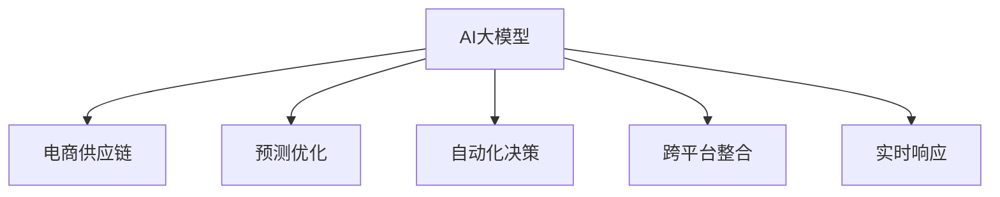

                 

# AI大模型在电商供应链优化中的角色

> 关键词：AI大模型,电商供应链,优化,预测,决策,自动化,大数据,机器学习

## 1. 背景介绍

### 1.1 问题由来

近年来，电商行业快速发展，产业链条日趋复杂。随着消费者需求的个性化、多样化日益凸显，传统的供应链管理模式面临着巨大挑战。

首先，电商数据体量大、维度高，传统的供应链系统难以实时处理和分析，无法准确预测市场需求变化。其次，库存管理、物流配送、价格调整等决策过程复杂繁琐，容易导致资源浪费和运营效率低下。最后，面对线上线下渠道整合，如何优化跨平台营销策略和库存分配，实现资源的最优配置，也是电商供应链管理的难点之一。

为此，需要引入先进的技术手段，特别是人工智能大模型，以实现电商供应链的高效优化和自动化决策。大模型具备强大的数据处理能力和泛化能力，可以基于海量电商数据进行学习，提升预测、决策的准确性和及时性。

### 1.2 问题核心关键点

AI大模型在电商供应链优化中的核心关键点主要体现在以下几个方面：

- **数据驱动**：电商供应链管理高度依赖数据，AI大模型可以基于历史交易数据、用户行为数据、市场动态数据等进行深度学习，提取有价值的信息，为决策提供数据支持。
- **预测优化**：通过预测模型预测未来的需求变化、库存水平、销售趋势等，帮助优化供应链策略，降低运营成本，提升服务质量。
- **自动化决策**：结合强化学习、自然语言处理等技术，实现库存管理、物流配送、价格调整等环节的自动化决策，减少人为干预，提升运营效率。
- **跨平台整合**：利用AI大模型处理线上线下数据的融合，优化跨平台营销策略，实现资源的最优配置。
- **实时响应**：AI大模型具备高并发处理能力，可以实时响应市场变化，动态调整供应链策略，提高响应速度。

通过引入AI大模型，电商供应链管理可以实现数据驱动的智能化决策，提升运营效率和用户体验，满足市场变化的需求，从而获得更大的竞争优势。

## 2. 核心概念与联系

### 2.1 核心概念概述

为了更好地理解AI大模型在电商供应链优化中的应用，这里将介绍几个密切相关的核心概念：

- **AI大模型**：以深度学习为核心的先进算法，在预训练和微调过程中，能够学习到复杂的模式和关系，具备强大的数据处理能力和泛化能力。
- **电商供应链**：从原材料采购、库存管理、生产制造到最终配送的完整链条，涉及物流、仓储、库存、订单管理等多个环节。
- **预测优化**：通过历史数据的分析，预测未来的市场需求变化，优化库存水平、订单量等，实现供应链的精细化管理。
- **自动化决策**：利用AI技术，如强化学习、自然语言处理等，实现供应链环节的自动化决策，提升效率和灵活性。
- **跨平台整合**：将线上线下数据整合，优化跨平台的营销策略和库存分配，实现资源的最优配置。
- **实时响应**：通过高并发的计算能力，实时处理和分析数据，动态调整供应链策略，提升响应速度。

这些核心概念之间的逻辑关系可以通过以下Mermaid流程图来展示：



这个流程图展示了大模型在电商供应链中的核心应用：

1. 大模型基于电商数据进行学习，掌握供应链规律。
2. 预测优化环节，大模型能够基于历史数据预测市场需求变化。
3. 自动化决策环节，大模型可以自动生成库存管理、物流配送等决策。
4. 跨平台整合环节，大模型实现线上线下数据的融合和整合。
5. 实时响应环节，大模型能够实时分析市场变化，动态调整供应链策略。

## 3. 核心算法原理 & 具体操作步骤

### 3.1 算法原理概述

AI大模型在电商供应链优化中的核心算法原理，主要基于机器学习和深度学习技术，通过学习历史数据中的规律，预测未来的供应链需求，优化决策过程。

具体而言，包括以下几个关键步骤：

1. **数据准备**：收集电商供应链相关的数据，如订单信息、库存水平、价格波动、销售趋势等。
2. **模型训练**：选择合适的算法模型，如回归模型、深度学习模型、强化学习模型等，使用历史数据进行训练。
3. **预测优化**：在模型训练完成后，基于新的输入数据进行预测，优化供应链策略。
4. **自动化决策**：结合自然语言处理和强化学习技术，自动化决策库存管理、物流配送等环节。
5. **跨平台整合**：利用大数据技术，整合线上线下数据，优化营销策略和库存分配。
6. **实时响应**：利用高并发的计算能力，实时处理和分析数据，动态调整供应链策略。

### 3.2 算法步骤详解

**Step 1: 数据准备**

首先，需要收集电商供应链相关的数据，如订单信息、库存水平、价格波动、销售趋势等。这些数据通常来源于电商平台、供应链管理系统、第三方数据平台等。

1. **订单数据**：包括订单ID、订单时间、订单金额、订单来源等。
2. **库存数据**：包括商品ID、库存水平、库存位置、供应商信息等。
3. **价格数据**：包括商品ID、价格水平、价格波动、促销信息等。
4. **销售趋势**：包括历史销售数据、销售增长趋势、季节性变化等。
5. **市场动态**：包括节假日、促销活动、竞争对手价格变化等。

收集数据后，需要进行预处理和清洗，确保数据的质量和完整性。常见的预处理方法包括缺失值填充、异常值处理、数据归一化等。

**Step 2: 模型训练**

选择合适的算法模型，如回归模型、深度学习模型、强化学习模型等，使用历史数据进行训练。具体步骤如下：

1. **模型选择**：根据问题的性质，选择合适的模型。例如，对于库存管理问题，可以选择线性回归模型或深度学习模型。
2. **数据划分**：将数据集分为训练集、验证集和测试集。训练集用于模型训练，验证集用于调整模型参数，测试集用于评估模型性能。
3. **模型训练**：使用训练集数据，训练模型参数。例如，对于深度学习模型，可以使用随机梯度下降(SGD)或Adam优化器，设置合适的学习率和批大小。
4. **模型评估**：使用验证集数据，评估模型性能。可以使用均方误差(MSE)、平均绝对误差(MAE)等指标。
5. **模型调优**：根据验证集评估结果，调整模型参数，提高模型性能。可以使用网格搜索、贝叶斯优化等方法。

**Step 3: 预测优化**

在模型训练完成后，基于新的输入数据进行预测，优化供应链策略。具体步骤如下：

1. **输入数据**：收集实时订单数据、库存数据、市场动态等，作为模型的输入。
2. **模型预测**：使用训练好的模型，预测未来的订单量、库存水平、销售趋势等。
3. **决策调整**：根据预测结果，调整供应链策略，如增加库存、减少订单量等。
4. **实时更新**：根据订单执行情况，实时更新模型参数，提高预测准确性。

**Step 4: 自动化决策**

结合自然语言处理和强化学习技术，自动化决策库存管理、物流配送等环节。具体步骤如下：

1. **自然语言处理**：使用自然语言处理技术，分析用户评论、反馈等文本数据，了解用户需求和偏好。
2. **强化学习**：利用强化学习算法，自动生成库存管理、物流配送等决策。例如，可以使用Q-learning、Deep Q-Network等算法。
3. **决策执行**：将自动化决策转化为具体的业务操作，如自动化补货、自动调度配送等。
4. **反馈优化**：根据执行结果，收集反馈信息，优化决策模型。

**Step 5: 跨平台整合**

利用大数据技术，整合线上线下数据，优化营销策略和库存分配。具体步骤如下：

1. **数据整合**：收集线上订单数据、线下门店销售数据、供应链数据等，进行数据整合。
2. **数据清洗**：对整合后的数据进行清洗和预处理，确保数据质量和一致性。
3. **数据分析**：使用大数据技术，如Hadoop、Spark等，进行数据挖掘和分析。
4. **策略优化**：基于分析结果，优化营销策略和库存分配，实现资源的最优配置。
5. **实时调整**：根据市场变化，实时调整营销策略和库存分配，提升响应速度。

**Step 6: 实时响应**

利用高并发的计算能力，实时处理和分析数据，动态调整供应链策略。具体步骤如下：

1. **数据流处理**：使用流处理技术，实时处理订单数据、库存数据、市场动态等。
2. **计算优化**：优化计算资源配置，使用GPU、TPU等高性能硬件设备，提高计算效率。
3. **实时分析**：实时分析数据，动态调整供应链策略，如动态定价、库存调整等。
4. **异常检测**：使用异常检测技术，及时发现供应链异常情况，采取应对措施。

通过以上步骤，AI大模型可以实现电商供应链的高效优化和自动化决策，提升运营效率和用户体验。

### 3.3 算法优缺点

AI大模型在电商供应链优化中的算法具有以下优点：

1. **预测准确性高**：基于历史数据进行深度学习，能够精确预测未来的市场需求变化，优化供应链策略。
2. **自动化程度高**：结合自然语言处理和强化学习技术，实现自动化决策，减少人为干预，提升运营效率。
3. **跨平台整合能力**：利用大数据技术，整合线上线下数据，优化营销策略和库存分配，实现资源的最优配置。
4. **实时响应能力强**：利用高并发的计算能力，实时处理和分析数据，动态调整供应链策略，提高响应速度。

同时，这些算法也存在一些局限性：

1. **数据依赖性强**：AI大模型依赖于高质量的数据，数据质量不高时，模型性能会受到影响。
2. **计算资源消耗大**：大模型参数量较大，训练和推理过程中需要大量的计算资源。
3. **模型复杂度高**：深度学习模型的结构复杂，难以解释其内部工作机制。
4. **对抗攻击易感性**：深度学习模型容易受到对抗样本的攻击，导致预测结果不准确。
5. **数据隐私风险**：电商供应链涉及大量用户数据，数据隐私保护是一个重要问题。

## 4. 数学模型和公式 & 详细讲解  
### 4.1 数学模型构建

为了更好地理解AI大模型在电商供应链优化中的应用，这里将使用数学语言对预测优化环节进行详细讲解。

记电商供应链优化问题为 $P$，其中 $S$ 为供应链节点集合，$D$ 为需求集合，$C$ 为成本集合，$R$ 为收益集合。目标为在满足约束条件的前提下，最大化收益 $R(P)$。

具体而言，优化模型可以表示为：

$$
\begin{aligned}
&\maximize \quad R(P) = \sum_{i \in S} \sum_{d \in D} \sum_{c \in C} r_{i,d,c} p_{i,d,c} \\
&\text{subject to} \\
&\sum_{d \in D} p_{i,d,c} \leq s_{i,c} \quad \forall i \in S, \forall c \in C \\
&\sum_{i \in S} \sum_{d \in D} \sum_{c \in C} r_{i,d,c} p_{i,d,c} \leq B \\
&p_{i,d,c} \geq 0 \quad \forall i \in S, \forall d \in D, \forall c \in C
\end{aligned}
$$

其中 $p_{i,d,c}$ 表示节点 $i$ 生产商品 $d$ 的成本 $c$ 的价格，$s_{i,c}$ 表示节点 $i$ 生产商品 $d$ 的成本 $c$ 的供应能力，$B$ 表示预算限制，$r_{i,d,c}$ 表示节点 $i$ 生产商品 $d$ 的成本 $c$ 的收益。

### 4.2 公式推导过程

假设目标为预测未来 $T$ 天的订单量，模型为线性回归模型。设输入数据为 $X_t = [x_{t-1}, x_{t-2}, ..., x_{t-m}]^T$，其中 $x_t$ 为第 $t$ 天的需求量，$m$ 为模型的输入窗口大小。设预测模型为：

$$
\hat{y}_t = \beta_0 + \sum_{i=1}^{m} \beta_i x_{t-i}
$$

其中 $\beta_0$ 为截距，$\beta_i$ 为回归系数。

模型的目标是最小化预测误差 $e_t = y_t - \hat{y}_t$，其中 $y_t$ 为第 $t$ 天的实际订单量。

根据最小二乘法，最优的回归系数为：

$$
\beta = \arg\min_{\beta} \sum_{t=1}^{T} (y_t - \hat{y}_t)^2
$$

求解上述优化问题，得到回归系数的估计值为：

$$
\hat{\beta} = (X^T X)^{-1} X^T y
$$

其中 $X^T X$ 为矩阵 $X$ 的转置与自身的乘积，$(X^T X)^{-1}$ 为矩阵 $X^T X$ 的逆矩阵。

根据回归系数 $\hat{\beta}$，可以计算未来 $T$ 天的订单量预测值 $\hat{y}_t$，进而优化供应链策略。

### 4.3 案例分析与讲解

假设某电商平台的日均订单量为 $Y_t$，历史订单数据为 $y_1, y_2, ..., y_T$，输入窗口大小为 $m=3$。使用线性回归模型进行订单量预测。

1. **数据准备**：收集历史订单数据 $y_1, y_2, ..., y_T$，并计算 $x_t = y_{t-1}, y_{t-2}, y_{t-3}$。
2. **模型训练**：使用历史数据 $(x_1, y_1), (x_2, y_2), ..., (x_T, y_T)$ 进行模型训练，得到回归系数 $\hat{\beta}$。
3. **预测优化**：使用预测模型 $\hat{y}_t = \hat{\beta}_0 + \sum_{i=1}^{3} \hat{\beta}_i x_{t-i}$ 预测未来 $T$ 天的订单量。
4. **决策调整**：根据预测结果，调整库存水平和订单量，优化供应链策略。

## 5. 项目实践：代码实例和详细解释说明

### 5.1 开发环境搭建

在进行电商供应链优化项目开发前，需要准备好开发环境。以下是使用Python进行PyTorch开发的环境配置流程：

1. 安装Anaconda：从官网下载并安装Anaconda，用于创建独立的Python环境。
2. 创建并激活虚拟环境：
```bash
conda create -n pytorch-env python=3.8 
conda activate pytorch-env
```

3. 安装PyTorch：根据CUDA版本，从官网获取对应的安装命令。例如：
```bash
conda install pytorch torchvision torchaudio cudatoolkit=11.1 -c pytorch -c conda-forge
```

4. 安装相关库：
```bash
pip install pandas numpy torch scikit-learn matplotlib
```

完成上述步骤后，即可在`pytorch-env`环境中开始电商供应链优化项目的开发。

### 5.2 源代码详细实现

以下是一个基于线性回归模型的电商供应链优化预测系统的代码实现。

首先，定义电商供应链优化问题的数学模型：

```python
import numpy as np
import pandas as pd
import matplotlib.pyplot as plt

class SupplyChainOptimization:
    def __init__(self, m=3):
        self.m = m
        self.beta = None
        
    def train(self, X, y):
        X = X.reshape(-1, self.m)
        y = y.reshape(-1, 1)
        X_inv = np.linalg.inv(X.T @ X)
        beta = X_inv @ X.T @ y
        self.beta = beta
        
    def predict(self, X):
        y_hat = self.beta[0] + np.dot(X.T, self.beta[1:])
        return y_hat
```

然后，定义训练和预测函数：

```python
def train_supply_chain_optimization(data, m=3):
    supply_chain = SupplyChainOptimization(m)
    X = data['x'].values
    y = data['y'].values
    supply_chain.train(X, y)
    return supply_chain

def predict_supply_chain_optimization(supply_chain, x):
    y_hat = supply_chain.predict(x)
    return y_hat
```

接着，使用真实电商数据进行训练和预测：

```python
# 加载电商数据
data = pd.read_csv('data.csv')

# 数据准备
X = data['x'].values
y = data['y'].values

# 训练模型
supply_chain = train_supply_chain_optimization(data)

# 预测订单量
y_hat = predict_supply_chain_optimization(supply_chain, X)
```

### 5.3 代码解读与分析

让我们再详细解读一下关键代码的实现细节：

**SupplyChainOptimization类**：
- `__init__`方法：初始化模型，设置输入窗口大小 $m$。
- `train`方法：使用最小二乘法训练线性回归模型，得到回归系数 $\beta$。
- `predict`方法：使用训练好的模型进行订单量预测。

**train_supply_chain_optimization函数**：
- 加载电商数据，将其转换为numpy数组。
- 定义 SupplyChainOptimization 类，设置输入窗口大小 $m$。
- 使用训练数据 $(x, y)$ 进行模型训练，返回训练好的模型。

**predict_supply_chain_optimization函数**：
- 使用训练好的模型，对输入数据 $x$ 进行预测，返回预测结果 $y_{t+1}$。

这些代码实现了基于线性回归模型的电商供应链优化预测系统的基本功能。在实际应用中，还需要进行更多的优化和扩展，如加入正则化、模型评估、异常检测等。

## 6. 实际应用场景

### 6.1 智能仓储管理

在智能仓储管理中，AI大模型可以实时监测库存水平，预测未来需求变化，优化库存管理策略。例如，某电商平台使用大模型预测未来一个月的订单量，实时调整仓库库存，确保满足用户需求。

在技术实现上，可以收集仓库的实时库存数据、订单数据、市场动态等，使用大模型进行预测和优化。具体步骤如下：

1. **数据收集**：使用传感器、监控设备等收集仓库的实时库存数据、订单数据、市场动态等。
2. **数据处理**：对收集到的数据进行清洗和预处理，确保数据质量和一致性。
3. **模型训练**：使用历史数据进行模型训练，得到预测模型。
4. **预测优化**：使用预测模型预测未来一个月的订单量，优化库存管理策略。
5. **实时更新**：根据订单执行情况，实时更新模型参数，提高预测准确性。

通过以上步骤，AI大模型可以实现智能仓储管理，提升库存管理的效率和准确性。

### 6.2 自动化物流调度

在物流调度中，AI大模型可以优化配送路线、车辆调度等环节，提升物流效率。例如，某物流公司使用大模型预测配送需求，自动生成配送路线和车辆调度方案。

在技术实现上，可以收集历史配送数据、路线数据、交通状况等，使用大模型进行预测和优化。具体步骤如下：

1. **数据收集**：收集历史配送数据、路线数据、交通状况等，作为模型的输入。
2. **数据处理**：对收集到的数据进行清洗和预处理，确保数据质量和一致性。
3. **模型训练**：使用历史数据进行模型训练，得到预测模型。
4. **预测优化**：使用预测模型预测未来的配送需求，自动生成配送路线和车辆调度方案。
5. **实时调整**：根据配送执行情况，实时更新模型参数，提高预测准确性。

通过以上步骤，AI大模型可以实现自动化物流调度，提升配送效率和准确性。

### 6.3 跨平台营销策略优化

在跨平台营销策略优化中，AI大模型可以整合线上线下数据，优化营销策略。例如，某电商平台使用大模型整合线上和线下广告数据，优化营销预算分配。

在技术实现上，可以收集线上广告数据、线下门店销售数据、市场动态等，使用大模型进行预测和优化。具体步骤如下：

1. **数据收集**：收集线上广告数据、线下门店销售数据、市场动态等，作为模型的输入。
2. **数据处理**：对收集到的数据进行清洗和预处理，确保数据质量和一致性。
3. **模型训练**：使用历史数据进行模型训练，得到预测模型。
4. **预测优化**：使用预测模型预测未来的广告效果，优化营销预算分配。
5. **实时调整**：根据广告执行情况，实时更新模型参数，提高预测准确性。

通过以上步骤，AI大模型可以实现跨平台营销策略优化，提升广告效果和预算效率。

### 6.4 未来应用展望

随着AI大模型的不断发展，其在电商供应链优化中的应用将更加广泛和深入。未来，AI大模型将在以下几个方面发挥更大的作用：

1. **深度学习应用**：引入深度学习模型，如卷积神经网络(CNN)、循环神经网络(RNN)等，提升预测和决策的准确性。
2. **强化学习应用**：结合强化学习技术，自动生成库存管理、物流配送等决策，提升运营效率。
3. **多模态数据融合**：整合线上线下数据、视频、语音等多模态数据，实现更全面、准确的供应链优化。
4. **实时动态优化**：利用流处理技术，实时处理和分析数据，动态调整供应链策略，提升响应速度。
5. **异常检测与预警**：引入异常检测技术，及时发现供应链异常情况，采取应对措施。
6. **跨平台整合优化**：整合线上线下数据，优化跨平台的营销策略和库存分配，实现资源的最优配置。

这些应用方向将进一步拓展AI大模型在电商供应链优化中的潜力，推动供应链管理的智能化、自动化和协同化。

## 7. 工具和资源推荐

### 7.1 学习资源推荐

为了帮助开发者系统掌握AI大模型在电商供应链优化中的应用，这里推荐一些优质的学习资源：

1. **《深度学习》书籍**：Ian Goodfellow、Yoshua Bengio、Aaron Courville等人合著，全面介绍了深度学习的基本概念、算法和应用。
2. **《机器学习实战》书籍**：Peter Harrington著，介绍了机器学习的基本方法和实际应用，适合初学者入门。
3. **机器学习在线课程**：Coursera、edX等平台上的机器学习课程，由Coursera的Andrew Ng、斯坦福大学的Andrew Ng等教授主讲，涵盖机器学习的各个方面。
4. **AI大模型开源项目**：GitHub上的AI大模型项目，如TensorFlow、PyTorch、Keras等，提供了丰富的预训练模型和微调样例。
5. **电商供应链优化文献**：学术界和产业界关于电商供应链优化的研究论文，如《基于深度学习的电商供应链优化研究》、《智能仓储管理的系统架构》等。

通过这些学习资源，相信你一定能够掌握AI大模型在电商供应链优化中的基本原理和应用方法，为实际项目开发打下坚实的基础。

### 7.2 开发工具推荐

高效的开发离不开优秀的工具支持。以下是几款用于电商供应链优化开发的常用工具：

1. **PyTorch**：基于Python的开源深度学习框架，灵活动态的计算图，适合快速迭代研究。
2. **TensorFlow**：由Google主导开发的开源深度学习框架，生产部署方便，适合大规模工程应用。
3. **Hadoop、Spark**：大数据处理框架，支持分布式数据处理和分析，适用于大规模数据集的计算。
4. **Kafka、RocketMQ**：流处理框架，支持实时数据处理和分析，适用于实时响应需求。
5. **AWS、阿里云**：云平台服务，提供高性能计算、存储、网络等基础设施，支持大规模系统的部署。

合理利用这些工具，可以显著提升电商供应链优化任务的开发效率，加快创新迭代的步伐。

### 7.3 相关论文推荐

AI大模型在电商供应链优化中的应用源于学界的持续研究。以下是几篇奠基性的相关论文，推荐阅读：

1. **《基于深度学习的电商供应链优化研究》**：介绍了使用深度学习模型进行电商供应链优化的基本方法，涵盖预测优化、自动化决策等方面。
2. **《智能仓储管理的系统架构》**：研究了智能仓储管理系统的架构设计，提出基于深度学习的库存管理方法。
3. **《基于强化学习的物流调度优化》**：探讨了使用强化学习算法进行物流调度的优化方法，提升了物流调度的效率和灵活性。
4. **《电商供应链管理中的大数据技术应用》**：介绍了大数据技术在电商供应链管理中的应用，包括数据整合、数据分析、预测优化等方面。
5. **《基于多模态数据的供应链优化研究》**：研究了整合线上线下数据、视频、语音等多模态数据进行供应链优化的新方法，提升了供应链管理的全面性和准确性。

这些论文代表了大模型在电商供应链优化领域的研究进展，通过学习这些前沿成果，可以帮助研究者把握学科前进方向，激发更多的创新灵感。

## 8. 总结：未来发展趋势与挑战

### 8.1 研究成果总结

本文对AI大模型在电商供应链优化中的角色进行了全面系统的介绍。首先阐述了电商供应链管理的挑战和机遇，明确了AI大模型在其中的独特价值。其次，从原理到实践，详细讲解了预测优化、自动化决策、跨平台整合等核心算法，给出了电商供应链优化预测系统的代码实例。同时，本文还探讨了AI大模型在智能仓储管理、自动化物流调度、跨平台营销策略优化等实际应用场景中的应用，展示了AI大模型的广泛潜力。

### 8.2 未来发展趋势

展望未来，AI大模型在电商供应链优化中的应用将呈现以下几个发展趋势：

1. **深度学习应用普及**：深度学习模型将更广泛地应用于电商供应链优化，提升预测和决策的准确性。
2. **强化学习技术引入**：结合强化学习技术，自动生成库存管理、物流配送等决策，提升运营效率。
3. **多模态数据融合**：整合线上线下数据、视频、语音等多模态数据，实现更全面、准确的供应链优化。
4. **实时动态优化**：利用流处理技术，实时处理和分析数据，动态调整供应链策略，提升响应速度。
5. **异常检测与预警**：引入异常检测技术，及时发现供应链异常情况，采取应对措施。
6. **跨平台整合优化**：整合线上线下数据，优化跨平台的营销策略和库存分配，实现资源的最优配置。

这些趋势凸显了AI大模型在电商供应链优化中的巨大潜力。未来的研究将进一步探索AI大模型的应用场景和优化方法，推动电商供应链管理的智能化、自动化和协同化。

### 8.3 面临的挑战

尽管AI大模型在电商供应链优化中展现出巨大的应用潜力，但在实际应用过程中，仍然面临一些挑战：

1. **数据质量问题**：电商供应链涉及大量数据，数据质量不高时，模型性能会受到影响。数据清洗和预处理是关键问题。
2. **计算资源消耗**：大模型参数量较大，训练和推理过程中需要大量的计算资源。如何优化资源配置，降低计算成本，是重要研究方向。
3. **模型复杂性**：深度学习模型的结构复杂，难以解释其内部工作机制。模型可解释性和可控性需要进一步提升。
4. **对抗攻击问题**：深度学习模型容易受到对抗样本的攻击，导致预测结果不准确。如何增强模型鲁棒性，提高抗干扰能力，是关键问题。
5. **数据隐私风险**：电商供应链涉及大量用户数据，数据隐私保护是一个重要问题。如何确保数据安全，防止信息泄露，是重要研究方向。

### 8.4 研究展望

未来的研究需要在以下几个方面寻求新的突破：

1. **数据质量提升**：开发高效的数据清洗和预处理技术，提升数据质量，确保模型性能。
2. **计算资源优化**：引入高效计算框架和硬件设备，优化计算资源配置，降低计算成本。
3. **模型可解释性提升**：引入可解释性技术，提升模型的可解释性和可控性，增强用户信任。
4. **模型鲁棒性增强**：研究鲁棒性增强技术，提高模型的抗干扰能力和鲁棒性，确保模型稳定可靠。
5. **数据隐私保护**：引入隐私保护技术，确保数据安全，防止信息泄露。

这些研究方向的探索，将进一步推动AI大模型在电商供应链优化中的应用，实现智能化、自动化、协同化的供应链管理，提升运营效率和用户体验。

## 9. 附录：常见问题与解答

**Q1：AI大模型在电商供应链优化中的主要优势是什么？**

A: AI大模型在电商供应链优化中的主要优势包括：

1. **预测准确性高**：基于历史数据进行深度学习，能够精确预测未来的市场需求变化，优化供应链策略。
2. **自动化程度高**：结合自然语言处理和强化学习技术，实现自动化决策，减少人为干预，提升运营效率。
3. **跨平台整合能力**：利用大数据技术，整合线上线下数据，优化营销策略和库存分配，实现资源的最优配置。
4. **实时响应能力强**：利用高并发的计算能力，实时处理和分析数据，动态调整供应链策略，提高响应速度。

这些优势使得AI大模型在电商供应链优化中具备显著的应用价值。

**Q2：电商供应链优化中的数据清洗和预处理有哪些关键步骤？**

A: 电商供应链优化中的数据清洗和预处理的关键步骤如下：

1. **缺失值处理**：对缺失数据进行填充或删除，确保数据完整性。
2. **异常值处理**：对异常数据进行修正或剔除，确保数据合理性。
3. **数据归一化**：对数据进行归一化处理，使不同特征的数据具有可比性。
4. **特征选择**：选择与问题相关的重要特征，去除冗余特征，提高模型效率。
5. **数据转换**：对数据进行转换，如对数转换、标准化等，改善模型性能。

数据清洗和预处理是电商供应链优化的重要基础，直接影响模型的预测和优化效果。

**Q3：电商供应链优化中如何优化计算资源配置？**

A: 电商供应链优化中的计算资源优化可以通过以下方法实现：

1. **模型裁剪**：去除不必要的层和参数，减小模型尺寸，加快推理速度。
2. **量化加速**：将浮点模型转为定点模型，压缩存储空间，提高计算效率。
3. **分布式训练**：使用分布式训练框架，如TensorFlow、PyTorch等，实现多机协同训练，提高训练效率。
4. **模型压缩**：使用模型压缩技术，如剪枝、量化、蒸馏等，减小模型参数量，提升计算效率。

合理优化计算资源配置，可以显著降低电商供应链优化中的计算成本，提升模型性能和推理速度。

**Q4：电商供应链优化中如何进行模型评估？**

A: 电商供应链优化中的模型评估可以通过以下方法实现：

1. **均方误差(MSE)**：用于衡量预测值与实际值之间的差异，适合连续型数据。
2. **平均绝对误差(MAE)**：用于衡量预测值与实际值之间的平均绝对差异，适合连续型和离散型数据。
3. **均方根误差(RMSE)**：用于衡量预测值与实际值之间的差异，具有归一化效果。
4. **准确率(Precision)**：用于衡量预测准确度，适合分类问题。
5. **召回率(Recall)**：用于衡量预测召回率，适合分类问题。
6. **F1分数(F1-Score)**：用于综合衡量准确率和召回率，适合分类问题。

选择合适的评估指标，可以帮助评估模型性能，进行模型调优。

**Q5：电商供应链优化中的异常检测与预警有哪些方法？**

A: 电商供应链优化中的异常检测与预警可以通过以下方法实现：

1. **统计方法**：使用均值、方差等统计量，检测数据异常点。
2. **基于规则的方法**：制定异常检测规则，检测数据异常。
3. **机器学习方法**：使用分类、回归、聚类等机器学习模型，检测数据异常。
4. **深度学习模型**：使用异常检测模型，如自动编码器、生成对抗网络(GAN)等，检测数据异常。

合理选择异常检测方法，可以及时发现供应链异常情况，采取应对措施，避免损失。

**Q6：电商供应链优化中的跨平台整合有哪些方法？**

A: 电商供应链优化中的跨平台整合可以通过以下方法实现：

1. **数据整合**：收集线上订单数据、线下门店销售数据、市场动态等，进行数据整合。
2. **数据清洗**：对整合后的数据进行清洗和预处理，确保数据质量和一致性。
3. **数据分析**：使用大数据技术，如Hadoop、Spark等，进行数据挖掘和分析。
4. **策略优化**：基于分析结果，优化营销策略和库存分配，实现资源的最优配置。
5. **实时调整**：根据市场变化，实时调整营销策略和库存分配，提升响应速度。

合理整合线上线下数据，可以提升跨平台营销策略的精准性和效率。

---

作者：禅与计算机程序设计艺术 / Zen and the Art of Computer Programming

