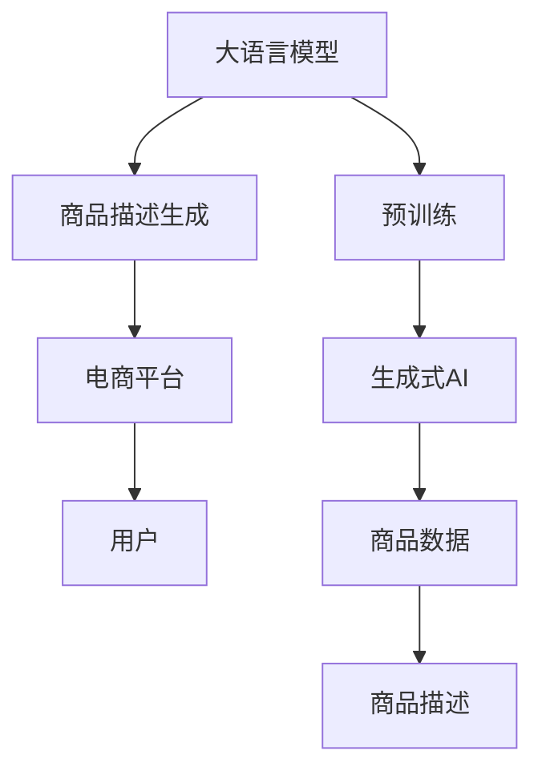

                 

# AI大模型在电商平台商品描述生成中的应用

> 关键词：自然语言处理,大语言模型,商品描述生成,电商平台,生成式AI

## 1. 背景介绍

在当今的数字化经济时代，电商平台已成为商品交易的重要渠道。为了提高用户体验和促进交易转化，平台上的商品描述显得至关重要。传统的商品描述往往由卖家人工撰写，存在信息不完整、语言不通顺、缺乏吸引力的缺点，无法有效引导消费者购买决策。随着AI技术的发展，基于大语言模型的生成式AI被引入到电商平台商品描述的生成中，显著提升了商品描述的质量和吸引力。

## 2. 核心概念与联系

### 2.1 核心概念概述

本节将介绍几个与商品描述生成密切相关的核心概念及其之间的关系：

- **大语言模型(Large Language Model, LLM)**：如BERT、GPT等，通过大规模无标签文本数据进行预训练，学习通用的语言表示，具备强大的语言理解和生成能力。

- **生成式AI(Generative AI)**：通过构建语言模型，可以生成符合语法、语义的文本内容，广泛应用于文本生成、摘要、翻译等任务。

- **商品描述生成**：基于电商平台商品数据，自动生成高质量的商品描述文本，以提升用户的阅读体验和购买决策。

- **电商平台**：如Amazon、淘宝、京东等，提供商品展示、销售、评论等服务的在线平台。

- **自然语言处理(Natural Language Processing, NLP)**：涉及文本预处理、语义理解、语言生成等技术，为商品描述生成提供技术支持。

### 2.2 核心概念原理和架构的 Mermaid 流程图



此流程图展示了从大语言模型的预训练到商品描述生成的流程：

1. **预训练**：在大规模无标签文本数据上进行自监督预训练，学习通用的语言表示。
2. **生成式AI**：构建基于预训练模型的生成式AI，用于生成商品描述文本。
3. **商品描述**：基于电商平台商品数据，自动生成商品描述。
4. **电商平台**：将生成的商品描述发布到平台，供用户阅读。
5. **用户**：阅读商品描述，做出购买决策。

### 2.3 核心概念联系

大语言模型和生成式AI通过自然语言处理技术，实现了从电商平台商品数据到高质量商品描述的自动化生成。这种自动化的描述生成，可以显著提升平台的用户体验和交易转化率，推动电商平台向更加智能化、自动化的方向发展。

## 3. 核心算法原理 & 具体操作步骤

### 3.1 算法原理概述

基于大语言模型的商品描述生成，本质上是一个文本生成任务。其核心思想是利用大语言模型的生成能力，从电商平台商品数据中提取出关键信息，并结合自然语言处理技术，生成符合语法、语义的描述文本。

形式化地，假设商品描述生成任务为 $T$，预训练模型为 $M_{\theta}$，训练集为 $D=\{(x_i,y_i)\}_{i=1}^N$，其中 $x_i$ 为商品数据，$y_i$ 为对应的商品描述文本。微调的目标是找到新的模型参数 $\hat{\theta}$，使得模型生成的描述与真实描述尽可能相似。

### 3.2 算法步骤详解

基于大语言模型的商品描述生成主要包括以下几个关键步骤：

**Step 1: 数据预处理**
- 收集电商平台商品数据，提取商品名称、价格、销量、评论等信息，构建商品-描述对。
- 使用自然语言处理工具对文本进行分词、去除停用词、词性标注等预处理。

**Step 2: 构建模型架构**
- 选择合适的预训练语言模型 $M_{\theta}$ 作为初始化参数，如 BERT、GPT 等。
- 根据商品描述生成任务设计模型架构，通常包括编码器-解码器结构。

**Step 3: 定义损失函数**
- 选择适合的损失函数，如交叉熵损失、BLEU等，衡量生成文本与真实文本之间的相似度。

**Step 4: 微调模型**
- 将商品描述生成任务的数据集 $D$ 划分为训练集、验证集和测试集。
- 使用优化算法（如AdamW、SGD等）最小化损失函数，更新模型参数 $\theta$。
- 在验证集上评估模型性能，根据结果调整学习率、批次大小等超参数。

**Step 5: 生成和评估**
- 在测试集上生成商品描述文本，评估生成文本的质量。
- 使用BLEU、ROUGE等指标评估生成文本与真实文本的相似度。
- 根据用户反馈和平台需求，不断优化生成模型，提升描述质量。

### 3.3 算法优缺点

基于大语言模型的商品描述生成方法具有以下优点：

- **高效**：相比人工撰写，生成式AI可以快速生成大量商品描述，降低平台运营成本。
- **一致性**：生成的商品描述风格一致，避免了人工撰写中的主观性和不一致性。
- **多样性**：生成式AI可以根据不同商品特点生成多样化、个性化的描述，提升用户体验。

同时，该方法也存在一定的局限性：

- **质量依赖于数据**：生成的商品描述质量很大程度上取决于电商平台商品数据的质量和多样性。
- **生成式缺陷**：生成的文本可能存在语法错误、语义不连贯等问题，需要人工校对和优化。
- **可解释性不足**：生成的商品描述难以解释生成过程，用户难以理解生成的逻辑和依据。

尽管存在这些局限性，但大语言模型生成商品描述在提高电商平台用户体验和交易转化率方面具有显著优势，已被各大电商平台广泛应用。

### 3.4 算法应用领域

基于大语言模型的商品描述生成技术，在电商平台中的应用十分广泛，具体包括：

- **商品展示优化**：通过自动生成商品描述，提升商品展示效果，吸引用户点击和浏览。
- **个性化推荐**：结合用户行为数据，生成个性化商品描述，提升推荐精准度。
- **多语言支持**：为非母语用户生成多种语言的商品描述，提升平台国际化水平。
- **动态调整**：根据平台促销活动和用户反馈，动态调整商品描述内容，提升用户体验。

此外，生成式AI还被应用于更多场景中，如自动问答、客户服务、社交媒体自动化发布等，为电商平台的运营带来了新的活力。

## 4. 数学模型和公式 & 详细讲解 & 举例说明

### 4.1 数学模型构建

基于大语言模型的商品描述生成可以表示为如下形式：

$$
y = M_{\theta}(x)
$$

其中 $y$ 为生成的商品描述文本，$x$ 为商品数据，$M_{\theta}$ 为预训练模型，$\theta$ 为模型参数。

### 4.2 公式推导过程

假设商品数据 $x$ 为词向量表示，生成式AI通过编码器-解码器架构，将商品数据映射为文本序列。定义编码器-解码器结构如下：

$$
y = \text{Generate}(\text{Encode}(x))
$$

其中 $\text{Encode}$ 为编码器，$\text{Generate}$ 为解码器。

假设编码器输出为 $h(x)$，解码器输出为 $y$，则生成模型的损失函数可以定义为：

$$
\mathcal{L} = -\sum_{i=1}^N \log p(y_i | y_{i-1}, h(x))
$$

其中 $p$ 为条件概率，$y_{i-1}$ 为前一个生成的文本，$h(x)$ 为商品数据的编码表示。

### 4.3 案例分析与讲解

以淘宝商品描述生成为例，假设商品数据 $x$ 包含商品名称、价格、销量等信息，通过编码器将 $x$ 转换为向量表示 $h(x)$，然后通过解码器生成商品描述文本 $y$。生成模型的训练过程如图示：


生成模型的训练目标是最大化生成文本 $y$ 与真实文本之间的相似度。假设真实文本为 $y^*$，则目标为：

$$
\hat{\theta} = \mathop{\arg\min}_{\theta} \mathcal{L}(M_{\theta}(x), y^*)
$$

通过梯度下降等优化算法，不断调整模型参数 $\theta$，最小化损失函数 $\mathcal{L}$，最终得到优化后的生成模型 $M_{\hat{\theta}}$。

## 5. 项目实践：代码实例和详细解释说明

### 5.1 开发环境搭建

在进行商品描述生成项目开发前，需要先准备好开发环境。以下是使用Python进行PyTorch开发的环境配置流程：

1. 安装Anaconda：从官网下载并安装Anaconda，用于创建独立的Python环境。

2. 创建并激活虚拟环境：
```bash
conda create -n pytorch-env python=3.8 
conda activate pytorch-env
```

3. 安装PyTorch：根据CUDA版本，从官网获取对应的安装命令。例如：
```bash
conda install pytorch torchvision torchaudio cudatoolkit=11.1 -c pytorch -c conda-forge
```

4. 安装Transformers库：
```bash
pip install transformers
```

5. 安装各类工具包：
```bash
pip install numpy pandas scikit-learn matplotlib tqdm jupyter notebook ipython
```

完成上述步骤后，即可在`pytorch-env`环境中开始开发。

### 5.2 源代码详细实现

首先，定义商品描述生成任务的数据处理函数：

```python
from transformers import BertTokenizer
from torch.utils.data import Dataset
import torch

class ProductDesDataset(Dataset):
    def __init__(self, texts, labels, tokenizer, max_len=128):
        self.texts = texts
        self.labels = labels
        self.tokenizer = tokenizer
        self.max_len = max_len
        
    def __len__(self):
        return len(self.texts)
    
    def __getitem__(self, item):
        text = self.texts[item]
        label = self.labels[item]
        
        encoding = self.tokenizer(text, return_tensors='pt', max_length=self.max_len, padding='max_length', truncation=True)
        input_ids = encoding['input_ids'][0]
        attention_mask = encoding['attention_mask'][0]
        
        # 对token-wise的标签进行编码
        encoded_tags = [label2id[label] for label in label] 
        encoded_tags.extend([label2id['']]*(self.max_len - len(encoded_tags)))
        labels = torch.tensor(encoded_tags, dtype=torch.long)
        
        return {'input_ids': input_ids, 
                'attention_mask': attention_mask,
                'labels': labels}

# 标签与id的映射
label2id = {'好': 0, '差': 1, '一般': 2}
id2label = {v: k for k, v in label2id.items()}

# 创建dataset
tokenizer = BertTokenizer.from_pretrained('bert-base-cased')

train_dataset = ProductDesDataset(train_texts, train_labels, tokenizer)
dev_dataset = ProductDesDataset(dev_texts, dev_labels, tokenizer)
test_dataset = ProductDesDataset(test_texts, test_labels, tokenizer)
```

然后，定义模型和优化器：

```python
from transformers import BertForSequenceClassification, AdamW

model = BertForSequenceClassification.from_pretrained('bert-base-cased', num_labels=len(label2id))

optimizer = AdamW(model.parameters(), lr=2e-5)
```

接着，定义训练和评估函数：

```python
from torch.utils.data import DataLoader
from tqdm import tqdm
from sklearn.metrics import classification_report

device = torch.device('cuda') if torch.cuda.is_available() else torch.device('cpu')
model.to(device)

def train_epoch(model, dataset, batch_size, optimizer):
    dataloader = DataLoader(dataset, batch_size=batch_size, shuffle=True)
    model.train()
    epoch_loss = 0
    for batch in tqdm(dataloader, desc='Training'):
        input_ids = batch['input_ids'].to(device)
        attention_mask = batch['attention_mask'].to(device)
        labels = batch['labels'].to(device)
        model.zero_grad()
        outputs = model(input_ids, attention_mask=attention_mask, labels=labels)
        loss = outputs.loss
        epoch_loss += loss.item()
        loss.backward()
        optimizer.step()
    return epoch_loss / len(dataloader)

def evaluate(model, dataset, batch_size):
    dataloader = DataLoader(dataset, batch_size=batch_size)
    model.eval()
    preds, labels = [], []
    with torch.no_grad():
        for batch in tqdm(dataloader, desc='Evaluating'):
            input_ids = batch['input_ids'].to(device)
            attention_mask = batch['attention_mask'].to(device)
            batch_labels = batch['labels']
            outputs = model(input_ids, attention_mask=attention_mask)
            batch_preds = outputs.logits.argmax(dim=2).to('cpu').tolist()
            batch_labels = batch_labels.to('cpu').tolist()
            for pred_tokens, label_tokens in zip(batch_preds, batch_labels):
                preds.append(pred_tokens[:len(label_tokens)])
                labels.append(label_tokens)
                
    print(classification_report(labels, preds))
```

最后，启动训练流程并在测试集上评估：

```python
epochs = 5
batch_size = 16

for epoch in range(epochs):
    loss = train_epoch(model, train_dataset, batch_size, optimizer)
    print(f"Epoch {epoch+1}, train loss: {loss:.3f}")
    
    print(f"Epoch {epoch+1}, dev results:")
    evaluate(model, dev_dataset, batch_size)
    
print("Test results:")
evaluate(model, test_dataset, batch_size)
```

以上就是使用PyTorch对BERT进行商品描述生成任务的微调代码实现。可以看到，借助Transformers库，开发者能够快速搭建和微调大语言模型，实现商品描述自动生成。

### 5.3 代码解读与分析

让我们再详细解读一下关键代码的实现细节：

**ProductDesDataset类**：
- `__init__`方法：初始化商品描述数据和标签、分词器等关键组件。
- `__len__`方法：返回数据集的样本数量。
- `__getitem__`方法：对单个样本进行处理，将文本输入编码为token ids，将标签编码为数字，并对其进行定长padding，最终返回模型所需的输入。

**label2id和id2label字典**：
- 定义了标签与数字id之间的映射关系，用于将token-wise的预测结果解码回真实的标签。

**训练和评估函数**：
- 使用PyTorch的DataLoader对数据集进行批次化加载，供模型训练和推理使用。
- 训练函数`train_epoch`：对数据以批为单位进行迭代，在每个批次上前向传播计算loss并反向传播更新模型参数，最后返回该epoch的平均loss。
- 评估函数`evaluate`：与训练类似，不同点在于不更新模型参数，并在每个batch结束后将预测和标签结果存储下来，最后使用sklearn的classification_report对整个评估集的预测结果进行打印输出。

**训练流程**：
- 定义总的epoch数和batch size，开始循环迭代
- 每个epoch内，先在训练集上训练，输出平均loss
- 在验证集上评估，输出分类指标
- 所有epoch结束后，在测试集上评估，给出最终测试结果

可以看到，PyTorch配合Transformers库使得BERT微调的代码实现变得简洁高效。开发者可以将更多精力放在数据处理、模型改进等高层逻辑上，而不必过多关注底层的实现细节。

当然，工业级的系统实现还需考虑更多因素，如模型的保存和部署、超参数的自动搜索、更灵活的任务适配层等。但核心的微调范式基本与此类似。

## 6. 实际应用场景

### 6.1 智能客服系统

基于大语言模型生成式AI，可以构建智能客服系统，提升客户服务质量。传统客服往往需要配备大量人力，高峰期响应缓慢，且一致性和专业性难以保证。使用生成式AI，可以自动生成响应模板，快速响应客户咨询，提高服务效率和客户满意度。

在技术实现上，可以收集企业内部的历史客服对话记录，将问题和最佳答复构建成监督数据，在此基础上对预训练生成式AI进行微调。微调后的生成式AI能够自动理解用户意图，匹配最合适的回复模板进行回复。对于客户提出的新问题，还可以接入检索系统实时搜索相关内容，动态组织生成回答。如此构建的智能客服系统，能大幅提升客户咨询体验和问题解决效率。

### 6.2 金融舆情监测

金融机构需要实时监测市场舆论动向，以便及时应对负面信息传播，规避金融风险。传统的人工监测方式成本高、效率低，难以应对网络时代海量信息爆发的挑战。使用生成式AI，可以自动生成新闻摘要、舆情分析报告，提升舆情监测的实时性和准确性。

具体而言，可以收集金融领域相关的新闻、报道、评论等文本数据，并对其进行主题标注和情感标注。在此基础上对预训练生成式AI进行微调，使其能够自动判断文本属于何种主题，情感倾向是正面、中性还是负面。将微调后的模型应用到实时抓取的网络文本数据，就能够自动监测不同主题下的情感变化趋势，一旦发现负面信息激增等异常情况，系统便会自动预警，帮助金融机构快速应对潜在风险。

### 6.3 个性化推荐系统

当前的推荐系统往往只依赖用户的历史行为数据进行物品推荐，无法深入理解用户的真实兴趣偏好。使用生成式AI，可以生成多样化、个性化的商品描述，提升推荐精准度。

在实践中，可以收集用户浏览、点击、评论、分享等行为数据，提取和用户交互的物品标题、描述、标签等文本内容。将文本内容作为模型输入，用户的后续行为（如是否点击、购买等）作为监督信号，在此基础上微调预训练生成式AI。微调后的模型能够从文本内容中准确把握用户的兴趣点。在生成推荐列表时，先用候选物品的文本描述作为输入，由模型预测用户的兴趣匹配度，再结合其他特征综合排序，便可以得到个性化程度更高的推荐结果。

### 6.4 未来应用展望

随着大语言模型生成式AI的发展，基于生成式AI的商品描述生成将拓展到更多领域，为各行各业带来变革性影响。

在智慧医疗领域，生成式AI可用于自动生成医学文献摘要、诊疗方案等，提升医生的工作效率和医疗水平。

在智能教育领域，生成式AI可用于自动生成教育资源、智能答疑等，个性化指导学生的学习。

在智慧城市治理中，生成式AI可用于自动生成政策文档、城市报告等，提升城市管理的智能化水平。

此外，在企业生产、社会治理、文娱传媒等众多领域，生成式AI的应用也将不断涌现，为经济社会发展注入新的动力。相信随着生成式AI技术的不断进步，商品描述生成范式必将引领NLP技术迈向更广阔的应用场景，深刻影响人类的生产生活方式。

## 7. 工具和资源推荐

### 7.1 学习资源推荐

为了帮助开发者系统掌握生成式AI的理论基础和实践技巧，这里推荐一些优质的学习资源：

1. 《自然语言处理入门》系列博文：由大模型技术专家撰写，深入浅出地介绍了自然语言处理的基本概念和经典模型。

2. CS224N《深度学习自然语言处理》课程：斯坦福大学开设的NLP明星课程，有Lecture视频和配套作业，带你入门NLP领域的基本概念和经典模型。

3. 《生成式对抗网络》书籍：全面介绍了生成式对抗网络（GANs）及其在图像生成、文本生成等领域的应用，适合对生成式AI感兴趣的读者。

4. Google AI Blog：Google AI官方博客，定期发布前沿生成式AI的研究论文和代码实现，有助于了解最新的生成式AI发展动态。

5. arXiv.org：顶级学术平台，收录了大量生成式AI的最新研究成果，适合跟踪最新的研究进展。

通过对这些资源的学习实践，相信你一定能够快速掌握生成式AI的精髓，并用于解决实际的NLP问题。

### 7.2 开发工具推荐

高效的开发离不开优秀的工具支持。以下是几款用于生成式AI开发的常用工具：

1. PyTorch：基于Python的开源深度学习框架，灵活动态的计算图，适合快速迭代研究。大多数生成式AI模型都有PyTorch版本的实现。

2. TensorFlow：由Google主导开发的开源深度学习框架，生产部署方便，适合大规模工程应用。同样有丰富的生成式AI资源。

3. Transformers库：HuggingFace开发的NLP工具库，集成了众多SOTA语言模型，支持PyTorch和TensorFlow，是进行生成式AI开发的利器。

4. Weights & Biases：模型训练的实验跟踪工具，可以记录和可视化模型训练过程中的各项指标，方便对比和调优。与主流深度学习框架无缝集成。

5. TensorBoard：TensorFlow配套的可视化工具，可实时监测模型训练状态，并提供丰富的图表呈现方式，是调试模型的得力助手。

6. Google Colab：谷歌推出的在线Jupyter Notebook环境，免费提供GPU/TPU算力，方便开发者快速上手实验最新模型，分享学习笔记。

合理利用这些工具，可以显著提升生成式AI的开发效率，加快创新迭代的步伐。

### 7.3 相关论文推荐

生成式AI的发展源于学界的持续研究。以下是几篇奠基性的相关论文，推荐阅读：

1. Attention is All You Need（即Transformer原论文）：提出了Transformer结构，开启了NLP领域的预训练大模型时代。

2. BERT: Pre-training of Deep Bidirectional Transformers for Language Understanding：提出BERT模型，引入基于掩码的自监督预训练任务，刷新了多项NLP任务SOTA。

3. T5: Exploring the Limits of Transfer Learning with a Unified Text-to-Text Transformer：提出T5模型，通过统一文本生成和理解任务，提升了生成式AI的性能。

4. Language Models are Unsupervised Multitask Learners（GPT-2论文）：展示了大规模语言模型的强大zero-shot学习能力，引发了对于生成式AI的广泛关注。

5. Theoretical Foundations and Guarantees for Emerging Generative Models：研究生成式AI的理论基础和性能保证，为模型训练和应用提供了理论支撑。

这些论文代表了大语言模型生成式AI的发展脉络。通过学习这些前沿成果，可以帮助研究者把握学科前进方向，激发更多的创新灵感。

## 8. 总结：未来发展趋势与挑战

### 8.1 总结

本文对基于大语言模型的商品描述生成技术进行了全面系统的介绍。首先阐述了商品描述生成的背景和意义，明确了生成式AI在提升电商平台用户体验和交易转化率方面的独特价值。其次，从原理到实践，详细讲解了生成式AI的数学模型和关键步骤，给出了生成式AI任务开发的完整代码实例。同时，本文还广泛探讨了生成式AI在多个领域的应用前景，展示了生成式AI技术的广泛应用潜力。

通过本文的系统梳理，可以看到，基于大语言模型的生成式AI在电商平台商品描述生成中的应用，为NLP技术带来了新的突破。商品描述自动生成的普及，显著提升了用户购物体验，推动了电商平台的智能化和自动化进程。未来，随着生成式AI技术的不断进步，生成式AI将在更多领域得到应用，为各行各业带来变革性影响。

### 8.2 未来发展趋势

展望未来，生成式AI将呈现以下几个发展趋势：

1. **模型规模持续增大**：随着算力成本的下降和数据规模的扩张，生成式AI的模型参数量还将持续增长。超大规模生成式AI蕴含的丰富语言知识，有望支撑更加复杂多变的商品描述生成任务。

2. **生成式缺陷缓解**：随着生成式AI技术的发展，生成的文本质量将显著提升。通过引入更加先进的生成模型和优化算法，生成的文本将更加自然、流畅、连贯。

3. **多模态融合**：当前的生成式AI主要聚焦于纯文本数据，未来会进一步拓展到图像、视频、语音等多模态数据生成。多模态信息的融合，将显著提升生成式AI对现实世界的理解和建模能力。

4. **可解释性和可控性增强**：生成式AI的应用将更加注重可解释性和可控性，通过引入因果推断、注意力机制等技术，增强模型的透明度和可控性，避免有害输出。

5. **自适应学习**：生成式AI将能够动态调整生成策略，根据用户反馈和平台需求，自动优化生成内容，提升用户体验。

6. **跨领域迁移**：生成式AI将具备更强的跨领域迁移能力，能够灵活适应不同领域、不同场景的商品描述生成任务。

以上趋势凸显了生成式AI技术的广阔前景。这些方向的探索发展，必将进一步提升生成式AI的效果和应用范围，为智能系统带来新的突破。

### 8.3 面临的挑战

尽管生成式AI已经取得了瞩目成就，但在迈向更加智能化、普适化应用的过程中，它仍面临着诸多挑战：

1. **生成质量**：生成的文本仍存在语法错误、语义不连贯等问题，需要进一步优化生成模型和优化算法。

2. **多样性**：生成的文本多样性不足，难以满足不同用户的需求。未来需要引入更多的多样性约束，提升生成文本的个性化和多样性。

3. **鲁棒性**：生成的文本对噪声、输入干扰等具有较高的敏感性，容易生成不恰当或不真实的内容。如何提高生成式AI的鲁棒性，增强系统的稳定性，还需进一步研究。

4. **实时性**：生成式AI的计算复杂度高，实时生成文本的速度较慢，难以满足实时性的需求。需要进一步优化生成模型的计算图，提升计算效率。

5. **可解释性**：生成的文本难以解释生成过程，用户难以理解生成的逻辑和依据。如何增强生成式AI的可解释性，提升用户信任度，也将是未来的一大挑战。

6. **安全性**：生成的文本可能包含有害信息或误导性内容，对用户造成负面影响。如何从数据和算法层面消除模型偏见，避免恶意用途，确保输出的安全性，也将是重要的研究课题。

7. **伦理道德**：生成式AI的应用需考虑伦理道德问题，避免生成有害、歧视性的内容，确保系统的公正性和道德性。

这些挑战需进一步攻克，才能将生成式AI技术推向更广阔的应用场景，真正实现人工智能技术在实际生活中的广泛应用。

### 8.4 研究展望

面对生成式AI面临的挑战，未来的研究需要在以下几个方面寻求新的突破：

1. **引入先验知识**：将符号化的先验知识，如知识图谱、逻辑规则等，与神经网络模型进行巧妙融合，引导生成式AI生成更准确、合理的描述。

2. **跨领域迁移**：研究生成式AI在不同领域、不同场景下的迁移能力，提高模型在不同环境下的泛化能力。

3. **引入因果推理**：将因果推理思想引入生成式AI，增强模型生成内容的稳定性和可解释性，避免有害输出。

4. **多模态生成**：研究多模态信息融合技术，提升生成式AI对现实世界的理解和建模能力。

5. **自适应学习**：研究生成式AI的自适应学习机制，动态调整生成策略，提升生成内容的个性化和多样性。

6. **可解释性和可控性**：通过引入因果推断、注意力机制等技术，增强生成式AI的透明度和可控性，避免有害输出。

7. **跨学科融合**：将生成式AI技术与自然语言处理、计算机视觉、智能推荐等技术进行融合，推动生成式AI技术的全面发展。

8. **伦理道德约束**：研究生成式AI的伦理道德约束机制，确保模型生成内容的公正性和道德性。

这些研究方向的探索，必将引领生成式AI技术迈向更高的台阶，为构建智能、公正、可控的生成式AI系统铺平道路。面向未来，生成式AI需要与其他人工智能技术进行更深入的融合，共同推动自然语言理解和智能交互系统的进步。只有勇于创新、敢于突破，才能不断拓展生成式AI的边界，让智能技术更好地造福人类社会。

## 9. 附录：常见问题与解答

**Q1：生成式AI在商品描述生成中的效果如何？**

A: 生成式AI在商品描述生成中取得了显著效果。通过自动生成的商品描述，电商平台的用户体验和交易转化率得到了显著提升。与传统人工撰写的商品描述相比，生成式AI生成的描述更加丰富、详细、吸引人，能够有效引导用户点击和购买。

**Q2：使用生成式AI生成商品描述需要哪些步骤？**

A: 使用生成式AI生成商品描述主要包括以下步骤：

1. 收集电商平台商品数据，提取商品名称、价格、销量等信息，构建商品-描述对。

2. 使用自然语言处理工具对文本进行预处理，包括分词、去除停用词、词性标注等。

3. 选择合适的预训练语言模型，如BERT、GPT等，作为初始化参数。

4. 定义生成式AI的架构，如编码器-解码器结构。

5. 选择适合的损失函数，如交叉熵损失、BLEU等，衡量生成文本与真实文本之间的相似度。

6. 使用优化算法，如AdamW、SGD等，最小化损失函数，更新模型参数。

7. 在测试集上生成商品描述文本，评估生成文本的质量。

**Q3：如何提高生成式AI的商品描述生成质量？**

A: 提高生成式AI的商品描述生成质量可以从以下几个方面入手：

1. 提高模型参数量。通过增加模型规模，提升生成式AI的语言表示能力，生成更加丰富、连贯的描述。

2. 引入更多的先验知识。将符号化的先验知识，如知识图谱、逻辑规则等，与神经网络模型进行巧妙融合，生成更准确、合理的描述。

3. 引入因果推理和注意力机制。通过引入因果推断、注意力机制等技术，增强生成式AI的透明度和可控性，避免有害输出。

4. 引入多样性约束。在生成过程中引入多样性约束，提升生成文本的个性化和多样性，满足不同用户的需求。

5. 引入自适应学习机制。动态调整生成策略，根据用户反馈和平台需求，自动优化生成内容，提升用户体验。

6. 引入多模态信息融合技术。研究多模态信息融合技术，提升生成式AI对现实世界的理解和建模能力。

7. 引入伦理道德约束。研究生成式AI的伦理道德约束机制，确保模型生成内容的公正性和道德性。

这些优化方法可以有效提高生成式AI的商品描述生成质量，提升用户体验和交易转化率。

**Q4：生成式AI在电商平台的未来发展方向是什么？**

A: 生成式AI在电商平台的发展方向主要有以下几个方面：

1. 商品描述生成自动化：利用生成式AI自动生成商品描述，提升用户体验和交易转化率。

2. 个性化推荐系统：结合用户行为数据，生成多样化、个性化的商品描述，提升推荐精准度。

3. 智能客服系统：构建智能客服系统，自动生成响应模板，快速响应客户咨询，提升服务效率和客户满意度。

4. 动态调整生成策略：根据用户反馈和平台需求，动态调整生成策略，提升生成内容的个性化和多样性。

5. 多模态融合：拓展生成式AI的应用场景，结合视觉、语音、文本等多种模态信息，提升系统智能化水平。

6. 跨领域迁移：研究生成式AI在不同领域、不同场景下的迁移能力，提高模型在不同环境下的泛化能力。

7. 引入伦理道德约束：研究生成式AI的伦理道德约束机制，确保模型生成内容的公正性和道德性。

这些方向的发展，将推动生成式AI技术在电商平台中的广泛应用，为电商平台带来更智能、更高效的用户体验和服务。

**Q5：生成式AI在商品描述生成中面临哪些挑战？**

A: 生成式AI在商品描述生成中面临以下挑战：

1. 生成质量：生成的文本仍存在语法错误、语义不连贯等问题，需要进一步优化生成模型和优化算法。

2. 多样性：生成的文本多样性不足，难以满足不同用户的需求。未来需要引入更多的多样性约束，提升生成文本的个性化和多样性。

3. 鲁棒性：生成的文本对噪声、输入干扰等具有较高的敏感性，容易生成不恰当或不真实的内容。如何提高生成式AI的鲁棒性，增强系统的稳定性，还需进一步研究。

4. 实时性：生成式AI的计算复杂度高，实时生成文本的速度较慢，难以满足实时性的需求。需要进一步优化生成模型的计算图，提升计算效率。

5. 可解释性：生成的文本难以解释生成过程，用户难以理解生成的逻辑和依据。如何增强生成式AI的可解释性，提升用户信任度，也将是未来的一大挑战。

6. 安全性：生成的文本可能包含有害信息或误导性内容，对用户造成负面影响。如何从数据和算法层面消除模型偏见，避免恶意用途，确保输出的安全性，也将是重要的研究课题。

7. 伦理道德：生成式AI的应用需考虑伦理道德问题，避免生成有害、歧视性的内容，确保系统的公正性和道德性。

这些挑战需进一步攻克，才能将生成式AI技术推向更广阔的应用场景，真正实现人工智能技术在实际生活中的广泛应用。

---

作者：禅与计算机程序设计艺术 / Zen and the Art of Computer Programming

