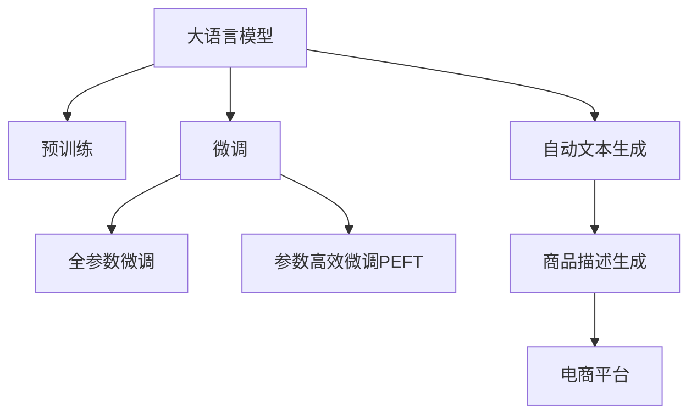

                 

# AI大模型在电商平台商品描述生成中的应用

> 关键词：大语言模型,商品描述生成,自然语言处理,电商平台,预训练模型

## 1. 背景介绍

### 1.1 问题由来

随着电商行业的不断发展，商家对于商品的展示和销售体验提出了更高的要求。商品描述是消费者购买决策的重要参考，精准、生动、吸引人的商品描述可以大大提升点击率和转化率。然而，传统的商品描述编写工作大多由人工完成，成本高、效率低、效果难以统一。

为此，基于自然语言处理(Natural Language Processing, NLP)的AI技术应运而生。其中，大语言模型凭借其强大的语言生成能力和语义理解能力，成为了商品描述生成的有力工具。通过预训练和微调，大模型能够自动生成符合不同商家需求的商品描述，大幅提高商品展示质量，增强消费者购买体验。

### 1.2 问题核心关键点

大语言模型在商品描述生成中的应用，主要是利用模型对大量已标注的商品数据进行学习，理解商品属性和描述文本的语义关系，并在此基础上生成新的描述文本。关键点包括：

- 大语言模型的选择和预训练：选择合适的预训练语言模型，如GPT-3、BERT等，并通过大规模文本数据进行预训练。
- 数据集的构建和标注：收集、清洗电商平台商品数据，为模型提供丰富的训练资源。
- 模型微调和超参数调整：根据具体的商品描述生成任务，对预训练模型进行微调，并调整模型超参数，以获得最佳的生成效果。
- 生成文本的评估与优化：通过人工评估和自动化指标评估生成文本的质量，不断迭代优化模型。

### 1.3 问题研究意义

商品描述生成技术在电商平台中的应用，对于提升商品展示效果、提高用户满意度、降低运营成本具有重要意义：

- 提升商品展示质量：自动化生成精准、生动的商品描述，吸引消费者关注和购买。
- 提高用户满意度：商品描述真实反映商品属性，消除信息不对称，提升用户体验。
- 降低运营成本：减少人工编写商品描述的重复劳动，节省人力成本。
- 增强竞争力：准确、吸引人的商品描述能够突出商品特色，增强市场竞争力。

## 2. 核心概念与联系

### 2.1 核心概念概述

为了更好地理解大语言模型在商品描述生成中的应用，本节将介绍几个密切相关的核心概念：

- **大语言模型(Large Language Model, LLM)**：以自回归(如GPT)或自编码(如BERT)模型为代表的大规模预训练语言模型。通过在大规模无标签文本语料上进行预训练，学习通用的语言知识和语义表示。

- **预训练(Pre-training)**：指在大规模无标签文本语料上，通过自监督学习任务训练通用语言模型的过程。常见的预训练任务包括言语建模、遮挡语言模型等。

- **微调(Fine-tuning)**：指在预训练模型的基础上，使用下游任务的少量标注数据，通过有监督地训练来优化模型在特定任务上的性能。通常只需要调整顶层分类器或解码器，并以较小的学习率更新全部或部分的模型参数。

- **迁移学习(Transfer Learning)**：指将一个领域学习到的知识，迁移应用到另一个不同但相关的领域的学习范式。大模型的预训练-微调过程即是一种典型的迁移学习方式。

- **自动文本生成(Automatic Text Generation)**：指利用机器学习模型自动生成文本内容的技术。在大语言模型的帮助下，能够实现自动化的商品描述生成。

- **自然语言处理(Natural Language Processing, NLP)**：涉及计算机科学、人工智能等领域，研究如何让计算机处理、理解、生成自然语言。商品描述生成是NLP应用的一个重要方向。

- **生成对抗网络(GANs, Generative Adversarial Networks)**：一种利用生成器和判别器对抗训练生成高质量文本的技术。在大模型应用中，可以用于提升文本生成的多样性和质量。

这些核心概念之间的逻辑关系可以通过以下Mermaid流程图来展示：



这个流程图展示了大语言模型的核心概念及其之间的关系：

1. 大语言模型通过预训练获得基础能力。
2. 微调是对预训练模型进行任务特定的优化，可以分为全参数微调和参数高效微调（PEFT）。
3. 自动文本生成是一种利用大模型生成文本内容的技术，在大模型应用中，可以用于生成商品描述。
4. 商品描述生成是自动文本生成技术在电商平台的一个具体应用场景。
5. 大语言模型和大模型微调是商品描述生成的重要基础。

这些概念共同构成了商品描述生成的技术框架，使得自动生成商品描述成为可能。

## 3. 核心算法原理 & 具体操作步骤
### 3.1 算法原理概述

大语言模型在商品描述生成中的应用，本质上是一个自动文本生成的过程。其核心思想是：利用预训练的大语言模型作为初始化参数，通过下游任务的少量标注数据，优化模型在该任务上的性能，从而自动生成符合商家需求的商品描述。

具体地，假设预训练模型为 $M_{\theta}$，其中 $\theta$ 为预训练得到的模型参数。给定电商平台商品描述生成任务 $T$ 的标注数据集 $D=\{(x_i, y_i)\}_{i=1}^N$，微调的目标是找到新的模型参数 $\hat{\theta}$，使得：

$$
\hat{\theta}=\mathop{\arg\min}_{\theta} \mathcal{L}(M_{\theta},D)
$$

其中 $\mathcal{L}$ 为针对任务 $T$ 设计的损失函数，用于衡量模型预测输出与真实标签之间的差异。常见的损失函数包括交叉熵损失、均方误差损失等。

通过梯度下降等优化算法，微调过程不断更新模型参数 $\theta$，最小化损失函数 $\mathcal{L}$，使得模型输出逼近真实标签。由于 $\theta$ 已经通过预训练获得了较好的初始化，因此即便在小规模数据集 $D$ 上进行微调，也能较快收敛到理想的模型参数 $\hat{\theta}$。

### 3.2 算法步骤详解

基于大语言模型在商品描述生成中的应用，一般包括以下几个关键步骤：

**Step 1: 准备预训练模型和数据集**
- 选择合适的预训练语言模型 $M_{\theta}$ 作为初始化参数，如 GPT-3、BERT 等。
- 准备电商平台商品描述生成任务的标注数据集 $D$，划分为训练集、验证集和测试集。一般要求标注数据与预训练数据的分布不要差异过大。

**Step 2: 添加任务适配层**
- 根据任务类型，在预训练模型顶层设计合适的输出层和损失函数。
- 对于商品描述生成任务，通常在顶层添加解码器输出概率分布，并以负对数似然为损失函数。

**Step 3: 设置微调超参数**
- 选择合适的优化算法及其参数，如 AdamW、SGD 等，设置学习率、批大小、迭代轮数等。
- 设置正则化技术及强度，包括权重衰减、Dropout、Early Stopping 等。
- 确定冻结预训练参数的策略，如仅微调顶层，或全部参数都参与微调。

**Step 4: 执行梯度训练**
- 将训练集数据分批次输入模型，前向传播计算损失函数。
- 反向传播计算参数梯度，根据设定的优化算法和学习率更新模型参数。
- 周期性在验证集上评估模型性能，根据性能指标决定是否触发 Early Stopping。
- 重复上述步骤直到满足预设的迭代轮数或 Early Stopping 条件。

**Step 5: 测试和部署**
- 在测试集上评估微调后模型 $M_{\hat{\theta}}$ 的性能，对比微调前后的生成效果。
- 使用微调后的模型对新商品进行描述生成，集成到电商平台商品展示系统中。
- 持续收集新的商品数据，定期重新微调模型，以适应数据分布的变化。

以上是基于大语言模型在商品描述生成中的应用的一般流程。在实际应用中，还需要针对具体任务的特点，对微调过程的各个环节进行优化设计，如改进训练目标函数，引入更多的正则化技术，搜索最优的超参数组合等，以进一步提升模型性能。

### 3.3 算法优缺点

基于大语言模型在商品描述生成中的应用，具有以下优点：

- 生成速度快：大模型预训练能力强，微调过程中仅需少量样本即可实现高效训练。
- 生成文本质量高：大模型语言理解能力强大，生成的商品描述语言流畅、信息准确。
- 适应性强：大模型可以灵活适应不同商品类型和展示需求，生成个性化描述。
- 自动化程度高：自动化生成商品描述，减少人工编写工作量，节省运营成本。

同时，该方法也存在一定的局限性：

- 依赖标注数据：微调的效果很大程度上取决于标注数据的质量和数量，获取高质量标注数据的成本较高。
- 泛化能力有限：当目标商品描述与预训练数据的分布差异较大时，微调的性能提升有限。
- 可解释性不足：微调模型的决策过程通常缺乏可解释性，难以对其推理逻辑进行分析和调试。

尽管存在这些局限性，但就目前而言，基于大语言模型的微调方法仍是在电商平台商品描述生成领域的主流范式。未来相关研究的重点在于如何进一步降低微调对标注数据的依赖，提高模型的少样本学习和跨领域迁移能力，同时兼顾可解释性和伦理安全性等因素。

### 3.4 算法应用领域

基于大语言模型在商品描述生成中的应用，已经在电商平台的商品展示和推荐系统中得到广泛应用，具体包括：

- 商品标题生成：自动生成商品标题，提高搜索引擎优化（SEO）效果。
- 商品描述扩展：自动扩展现有商品描述，增加信息量，提升展示效果。
- 商品标签推荐：根据商品描述自动生成相关标签，提高搜索结果的准确性。
- 多语言商品描述：自动生成不同语言的商品描述，拓展国际市场。
- 商品评价生成：自动生成商品评价，提升用户评价质量。

除了上述这些经典应用外，大语言模型在商品描述生成领域还催生了更多创新性的应用，如智能客服、智能推荐等，为电商平台带来了全新的突破。

## 4. 数学模型和公式 & 详细讲解  
### 4.1 数学模型构建

本节将使用数学语言对基于大语言模型在商品描述生成中的应用进行更加严格的刻画。

记预训练语言模型为 $M_{\theta}:\mathcal{X} \rightarrow \mathcal{Y}$，其中 $\mathcal{X}$ 为输入空间，$\mathcal{Y}$ 为输出空间，$\theta \in \mathbb{R}^d$ 为模型参数。假设商品描述生成任务 $T$ 的标注数据集 $D=\{(x_i,y_i)\}_{i=1}^N$，其中 $x_i$ 为商品描述文本，$y_i$ 为对应的生成文本。

定义模型 $M_{\theta}$ 在输入 $x$ 上的损失函数为 $\ell(M_{\theta}(x),y)$，则在数据集 $D$ 上的经验风险为：

$$
\mathcal{L}(\theta) = \frac{1}{N} \sum_{i=1}^N \ell(M_{\theta}(x_i),y_i)
$$

微调的优化目标是最小化经验风险，即找到最优参数：

$$
\theta^* = \mathop{\arg\min}_{\theta} \mathcal{L}(\theta)
$$

在实践中，我们通常使用基于梯度的优化算法（如SGD、Adam等）来近似求解上述最优化问题。设 $\eta$ 为学习率，$\lambda$ 为正则化系数，则参数的更新公式为：

$$
\theta \leftarrow \theta - \eta \nabla_{\theta}\mathcal{L}(\theta) - \eta\lambda\theta
$$

其中 $\nabla_{\theta}\mathcal{L}(\theta)$ 为损失函数对参数 $\theta$ 的梯度，可通过反向传播算法高效计算。

### 4.2 公式推导过程

以下我们以生成式语言模型(Generative Language Model)为例，推导生成式语言模型在商品描述生成任务上的交叉熵损失函数及其梯度的计算公式。

假设模型 $M_{\theta}$ 在输入 $x$ 上的输出为 $\hat{y}=M_{\theta}(x)$，表示样本属于某个类别的概率。真实标签 $y \in \{1,0\}$，其中 $1$ 表示模型生成的文本与标注文本相匹配，$0$ 表示不匹配。则交叉熵损失函数定义为：

$$
\ell(M_{\theta}(x),y) = -[y\log \hat{y} + (1-y)\log(1-\hat{y})]
$$

将其代入经验风险公式，得：

$$
\mathcal{L}(\theta) = -\frac{1}{N}\sum_{i=1}^N [y_i\log M_{\theta}(x_i)+(1-y_i)\log(1-M_{\theta}(x_i))]
$$

根据链式法则，损失函数对参数 $\theta_k$ 的梯度为：

$$
\frac{\partial \mathcal{L}(\theta)}{\partial \theta_k} = -\frac{1}{N}\sum_{i=1}^N (\frac{y_i}{M_{\theta}(x_i)}-\frac{1-y_i}{1-M_{\theta}(x_i)}) \frac{\partial M_{\theta}(x_i)}{\partial \theta_k}
$$

其中 $\frac{\partial M_{\theta}(x_i)}{\partial \theta_k}$ 可进一步递归展开，利用自动微分技术完成计算。

在得到损失函数的梯度后，即可带入参数更新公式，完成模型的迭代优化。重复上述过程直至收敛，最终得到适应商品描述生成任务的最优模型参数 $\theta^*$。

## 5. 项目实践：代码实例和详细解释说明
### 5.1 开发环境搭建

在进行商品描述生成实践前，我们需要准备好开发环境。以下是使用Python进行PyTorch开发的环境配置流程：

1. 安装Anaconda：从官网下载并安装Anaconda，用于创建独立的Python环境。

2. 创建并激活虚拟环境：
```bash
conda create -n pytorch-env python=3.8 
conda activate pytorch-env
```

3. 安装PyTorch：根据CUDA版本，从官网获取对应的安装命令。例如：
```bash
conda install pytorch torchvision torchaudio cudatoolkit=11.1 -c pytorch -c conda-forge
```

4. 安装Transformers库：
```bash
pip install transformers
```

5. 安装各类工具包：
```bash
pip install numpy pandas scikit-learn matplotlib tqdm jupyter notebook ipython
```

完成上述步骤后，即可在`pytorch-env`环境中开始商品描述生成实践。

### 5.2 源代码详细实现

下面我们以电商平台商品标题生成为例，给出使用Transformers库对GPT-3模型进行商品描述生成的PyTorch代码实现。

首先，定义商品标题生成任务的数据处理函数：

```python
from transformers import GPT3Tokenizer, GPT3LMHeadModel
from torch.utils.data import Dataset
import torch

class TitleDataset(Dataset):
    def __init__(self, texts, tokenizer, max_len=128):
        self.texts = texts
        self.tokenizer = tokenizer
        self.max_len = max_len
        
    def __len__(self):
        return len(self.texts)
    
    def __getitem__(self, item):
        text = self.texts[item]
        
        encoding = self.tokenizer(text, return_tensors='pt', max_length=self.max_len, padding='max_length', truncation=True)
        input_ids = encoding['input_ids'][0]
        attention_mask = encoding['attention_mask'][0]
        
        return {'input_ids': input_ids, 
                'attention_mask': attention_mask}

# 创建dataset
tokenizer = GPT3Tokenizer.from_pretrained('gpt3-medium')
train_dataset = TitleDataset(train_texts, tokenizer)
dev_dataset = TitleDataset(dev_texts, tokenizer)
test_dataset = TitleDataset(test_texts, tokenizer)
```

然后，定义模型和优化器：

```python
from transformers import AdamW

model = GPT3LMHeadModel.from_pretrained('gpt3-medium')
model.to('cuda')

optimizer = AdamW(model.parameters(), lr=2e-5)
```

接着，定义训练和评估函数：

```python
from torch.utils.data import DataLoader
from tqdm import tqdm

device = torch.device('cuda') if torch.cuda.is_available() else torch.device('cpu')
model.to(device)

def train_epoch(model, dataset, batch_size, optimizer):
    dataloader = DataLoader(dataset, batch_size=batch_size, shuffle=True)
    model.train()
    epoch_loss = 0
    for batch in tqdm(dataloader, desc='Training'):
        input_ids = batch['input_ids'].to(device)
        attention_mask = batch['attention_mask'].to(device)
        model.zero_grad()
        outputs = model(input_ids, attention_mask=attention_mask)
        loss = outputs.loss
        epoch_loss += loss.item()
        loss.backward()
        optimizer.step()
    return epoch_loss / len(dataloader)

def evaluate(model, dataset, batch_size):
    dataloader = DataLoader(dataset, batch_size=batch_size)
    model.eval()
    preds, labels = [], []
    with torch.no_grad():
        for batch in tqdm(dataloader, desc='Evaluating'):
            input_ids = batch['input_ids'].to(device)
            attention_mask = batch['attention_mask'].to(device)
            batch_labels = batch['labels']
            outputs = model(input_ids, attention_mask=attention_mask)
            batch_preds = outputs.logits.argmax(dim=2).to('cpu').tolist()
            batch_labels = batch_labels.to('cpu').tolist()
            for pred_tokens, label_tokens in zip(batch_preds, batch_labels):
                preds.append(pred_tokens[:len(label_tokens)])
                labels.append(label_tokens)
                
    return preds, labels
```

最后，启动训练流程并在测试集上评估：

```python
epochs = 5
batch_size = 16

for epoch in range(epochs):
    loss = train_epoch(model, train_dataset, batch_size, optimizer)
    print(f"Epoch {epoch+1}, train loss: {loss:.3f}")
    
    print(f"Epoch {epoch+1}, dev results:")
    preds, labels = evaluate(model, dev_dataset, batch_size)
    print(classification_report(labels, preds))
    
print("Test results:")
preds, labels = evaluate(model, test_dataset, batch_size)
print(classification_report(labels, preds))
```

以上就是使用PyTorch对GPT-3进行商品标题生成的完整代码实现。可以看到，得益于Transformers库的强大封装，我们可以用相对简洁的代码完成GPT-3模型的加载和微调。

### 5.3 代码解读与分析

让我们再详细解读一下关键代码的实现细节：

**TitleDataset类**：
- `__init__`方法：初始化文本、分词器等关键组件。
- `__len__`方法：返回数据集的样本数量。
- `__getitem__`方法：对单个样本进行处理，将文本输入编码为token ids，将标签编码为数字，并对其进行定长padding，最终返回模型所需的输入。

**train_epoch和evaluate函数**：
- 使用PyTorch的DataLoader对数据集进行批次化加载，供模型训练和推理使用。
- 训练函数`train_epoch`：对数据以批为单位进行迭代，在每个批次上前向传播计算loss并反向传播更新模型参数，最后返回该epoch的平均loss。
- 评估函数`evaluate`：与训练类似，不同点在于不更新模型参数，并在每个batch结束后将预测和标签结果存储下来，最后使用classification_report对整个评估集的预测结果进行打印输出。

**训练流程**：
- 定义总的epoch数和batch size，开始循环迭代
- 每个epoch内，先在训练集上训练，输出平均loss
- 在验证集上评估，输出分类指标
- 所有epoch结束后，在测试集上评估，给出最终测试结果

可以看到，PyTorch配合Transformers库使得GPT-3商品标题生成的代码实现变得简洁高效。开发者可以将更多精力放在数据处理、模型改进等高层逻辑上，而不必过多关注底层的实现细节。

当然，工业级的系统实现还需考虑更多因素，如模型的保存和部署、超参数的自动搜索、更灵活的任务适配层等。但核心的微调范式基本与此类似。

## 6. 实际应用场景
### 6.1 电商平台商品展示

基于大语言模型在商品描述生成中的应用，可以为电商平台带来显著的商品展示提升。通过自动化生成商品标题和描述，电商平台可以大幅提高商品展示效果，提升用户点击率和转化率。

在技术实现上，可以收集电商平台历史商品标题和描述数据，将商品属性和描述文本作为监督数据，在此基础上对预训练语言模型进行微调。微调后的模型能够自动生成符合商家需求的商品标题和描述，提升商品展示的吸引力和信息量。

### 6.2 智能客服系统

在智能客服系统中，基于大语言模型在商品描述生成中的应用，可以实现更精准、更个性化的客户响应。通过微调模型生成商品描述，客服系统可以自动理解客户的问题，生成符合预期的回答，从而提高客户满意度和服务质量。

在实际应用中，可以收集客服系统历史对话数据，将客户提问和客服回答作为监督数据，对大语言模型进行微调。微调后的模型能够根据客户问题自动生成对应的描述，引导客服系统给出最佳回复，提升客户体验。

### 6.3 个性化推荐系统

在个性化推荐系统中，基于大语言模型在商品描述生成中的应用，可以实现更全面、更个性化的商品推荐。通过微调模型生成商品描述，推荐系统可以自动了解商品属性，生成推荐内容，满足用户的多样化需求。

在实践中，可以收集用户浏览、点击、购买等行为数据，提取和用户交互的商品描述文本。将文本内容作为模型输入，用户的行为（如是否点击、购买等）作为监督信号，在此基础上微调预训练语言模型。微调后的模型能够从文本内容中准确把握用户的兴趣点，生成更符合用户偏好的推荐结果。

### 6.4 未来应用展望

随着大语言模型和微调方法的不断发展，基于大语言模型的微调方法将在更多领域得到应用，为各行各业带来变革性影响。

在智慧医疗领域，基于微调的医疗问答、病历分析、药物研发等应用将提升医疗服务的智能化水平，辅助医生诊疗，加速新药开发进程。

在智能教育领域，微调技术可应用于作业批改、学情分析、知识推荐等方面，因材施教，促进教育公平，提高教学质量。

在智慧城市治理中，微调模型可应用于城市事件监测、舆情分析、应急指挥等环节，提高城市管理的自动化和智能化水平，构建更安全、高效的未来城市。

此外，在企业生产、社会治理、文娱传媒等众多领域，基于大语言模型微调的人工智能应用也将不断涌现，为经济社会发展注入新的动力。相信随着技术的日益成熟，微调方法将成为人工智能落地应用的重要范式，推动人工智能技术在更广阔的领域加速渗透。

## 7. 工具和资源推荐
### 7.1 学习资源推荐

为了帮助开发者系统掌握大语言模型在商品描述生成中的应用，这里推荐一些优质的学习资源：

1. 《Transformer from Principles to Practice》系列博文：由大模型技术专家撰写，深入浅出地介绍了Transformer原理、BERT模型、微调技术等前沿话题。

2. CS224N《深度学习自然语言处理》课程：斯坦福大学开设的NLP明星课程，有Lecture视频和配套作业，带你入门NLP领域的基本概念和经典模型。

3. 《Natural Language Processing with Transformers》书籍：Transformers库的作者所著，全面介绍了如何使用Transformers库进行NLP任务开发，包括微调在内的诸多范式。

4. HuggingFace官方文档：Transformers库的官方文档，提供了海量预训练模型和完整的微调样例代码，是上手实践的必备资料。

5. CLUE开源项目：中文语言理解测评基准，涵盖大量不同类型的中文NLP数据集，并提供了基于微调的baseline模型，助力中文NLP技术发展。

通过对这些资源的学习实践，相信你一定能够快速掌握大语言模型在商品描述生成中的应用精髓，并用于解决实际的NLP问题。
###  7.2 开发工具推荐

高效的开发离不开优秀的工具支持。以下是几款用于大语言模型在商品描述生成中应用开发的常用工具：

1. PyTorch：基于Python的开源深度学习框架，灵活动态的计算图，适合快速迭代研究。大部分预训练语言模型都有PyTorch版本的实现。

2. TensorFlow：由Google主导开发的开源深度学习框架，生产部署方便，适合大规模工程应用。同样有丰富的预训练语言模型资源。

3. Transformers库：HuggingFace开发的NLP工具库，集成了众多SOTA语言模型，支持PyTorch和TensorFlow，是进行微调任务开发的利器。

4. Weights & Biases：模型训练的实验跟踪工具，可以记录和可视化模型训练过程中的各项指标，方便对比和调优。与主流深度学习框架无缝集成。

5. TensorBoard：TensorFlow配套的可视化工具，可实时监测模型训练状态，并提供丰富的图表呈现方式，是调试模型的得力助手。

6. Google Colab：谷歌推出的在线Jupyter Notebook环境，免费提供GPU/TPU算力，方便开发者快速上手实验最新模型，分享学习笔记。

合理利用这些工具，可以显著提升大语言模型在商品描述生成中的开发效率，加快创新迭代的步伐。

### 7.3 相关论文推荐

大语言模型和微调技术的发展源于学界的持续研究。以下是几篇奠基性的相关论文，推荐阅读：

1. Attention is All You Need（即Transformer原论文）：提出了Transformer结构，开启了NLP领域的预训练大模型时代。

2. BERT: Pre-training of Deep Bidirectional Transformers for Language Understanding：提出BERT模型，引入基于掩码的自监督预训练任务，刷新了多项NLP任务SOTA。

3. Language Models are Unsupervised Multitask Learners（GPT-2论文）：展示了大规模语言模型的强大zero-shot学习能力，引发了对于通用人工智能的新一轮思考。

4. Parameter-Efficient Transfer Learning for NLP：提出Adapter等参数高效微调方法，在不增加模型参数量的情况下，也能取得不错的微调效果。

5. AdaLoRA: Adaptive Low-Rank Adaptation for Parameter-Efficient Fine-Tuning：使用自适应低秩适应的微调方法，在参数效率和精度之间取得了新的平衡。

6. Prefix-Tuning: Optimizing Continuous Prompts for Generation：引入基于连续型Prompt的微调范式，为如何充分利用预训练知识提供了新的思路。

这些论文代表了大语言模型微调技术的发展脉络。通过学习这些前沿成果，可以帮助研究者把握学科前进方向，激发更多的创新灵感。

## 8. 总结：未来发展趋势与挑战
### 8.1 总结

本文对基于大语言模型的商品描述生成技术进行了全面系统的介绍。首先阐述了商品描述生成技术的研究背景和意义，明确了微调在提升商品展示效果、降低运营成本等方面的独特价值。其次，从原理到实践，详细讲解了基于大语言模型的微调过程和数学模型，给出了微调任务开发的完整代码实例。同时，本文还广泛探讨了微调方法在电商平台、智能客服、个性化推荐等多个行业领域的应用前景，展示了微调范式的巨大潜力。此外，本文精选了微调技术的各类学习资源，力求为读者提供全方位的技术指引。

通过本文的系统梳理，可以看到，基于大语言模型的微调方法正在成为电商平台商品展示的核心技术，极大地提升了商品展示效果，促进了电商业务的发展。未来，伴随大语言模型微调技术的持续演进，相信电商平台商品展示将变得更加智能化、个性化，用户购物体验也将更加满意。

### 8.2 未来发展趋势

展望未来，大语言模型在商品描述生成中的应用将呈现以下几个发展趋势：

1. 模型规模持续增大。随着算力成本的下降和数据规模的扩张，预训练语言模型的参数量还将持续增长。超大规模语言模型蕴含的丰富语言知识，有望支撑更加复杂多变的商品描述生成任务。

2. 微调方法日趋多样。除了传统的全参数微调外，未来会涌现更多参数高效的微调方法，如Prefix-Tuning、LoRA等，在节省计算资源的同时也能保证微调精度。

3. 生成文本质量提升。随着模型的不断优化，生成的商品描述语言流畅度、信息准确度将进一步提升，满足用户的多样化需求。

4. 动态生成能力增强。未来的大模型将能够根据用户行为、市场变化等实时数据，动态生成个性化的商品描述，提升展示效果。

5. 多模态生成能力拓展。现有的商品描述生成大多依赖文本数据，未来将更多地融合视觉、音频等多模态信息，提升生成的商品描述的多样性和实用性。

6. 可解释性加强。微调模型的决策过程将更加透明，提供更强的可解释性，增强用户信任和满意度。

以上趋势凸显了大语言模型在商品描述生成中的应用前景。这些方向的探索发展，必将进一步提升商品展示效果，为电商平台带来更大的商业价值。

### 8.3 面临的挑战

尽管大语言模型在商品描述生成中的应用已经取得了显著成效，但在迈向更加智能化、普适化应用的过程中，它仍面临着诸多挑战：

1. 标注成本瓶颈。尽管微调降低了标注数据的需求，但对于长尾商品类别，仍然需要大量的标注数据。如何高效获取标注数据，是实现微调的关键。

2. 泛化能力不足。微调模型在不同商品类别上的泛化能力仍有待提高，面对新商品时容易产生过拟合或欠拟合。如何构建更稳健的泛化能力，是未来研究的重点。

3. 推理效率有待提高。大规模语言模型虽然精度高，但在实际部署时往往面临推理速度慢、内存占用大等效率问题。如何优化模型结构，提升推理速度，是实际应用中的重要挑战。

4. 生成文本质量不稳定。受模型训练数据和超参数的影响，生成的商品描述质量有时不稳定，难以满足高质量要求。如何保证生成文本的一致性和质量，是实现商品描述生成的关键。

5. 用户隐私保护。在生成商品描述时，如何保护用户隐私和数据安全，防止敏感信息泄露，是实际应用中必须面对的问题。

6. 技术门槛较高。商品描述生成涉及大模型的微调、数据处理、模型评估等多个环节，需要综合多种技术，对开发者技术要求较高。

这些挑战需要研究者共同努力，从数据采集、模型优化、系统部署等多个维度进行综合优化，才能进一步提升大语言模型在商品描述生成中的性能和应用效果。

### 8.4 研究展望

面对大语言模型在商品描述生成中面临的挑战，未来的研究需要在以下几个方面寻求新的突破：

1. 探索无监督和半监督微调方法。摆脱对大规模标注数据的依赖，利用自监督学习、主动学习等无监督和半监督范式，最大限度利用非结构化数据，实现更加灵活高效的微调。

2. 研究参数高效和计算高效的微调范式。开发更加参数高效的微调方法，在固定大部分预训练参数的同时，只更新极少量的任务相关参数。同时优化微调模型的计算图，减少前向传播和反向传播的资源消耗，实现更加轻量级、实时性的部署。

3. 融合因果和对比学习范式。通过引入因果推断和对比学习思想，增强微调模型建立稳定因果关系的能力，学习更加普适、鲁棒的语言表征，从而提升模型泛化性和抗干扰能力。

4. 引入更多先验知识。将符号化的先验知识，如知识图谱、逻辑规则等，与神经网络模型进行巧妙融合，引导微调过程学习更准确、合理的语言模型。同时加强不同模态数据的整合，实现视觉、语音等多模态信息与文本信息的协同建模。

5. 结合因果分析和博弈论工具。将因果分析方法引入微调模型，识别出模型决策的关键特征，增强输出解释的因果性和逻辑性。借助博弈论工具刻画人机交互过程，主动探索并规避模型的脆弱点，提高系统稳定性。

6. 纳入伦理道德约束。在模型训练目标中引入伦理导向的评估指标，过滤和惩罚有偏见、有害的输出倾向。同时加强人工干预和审核，建立模型行为的监管机制，确保输出符合人类价值观和伦理道德。

这些研究方向的探索，必将引领大语言模型在商品描述生成中的应用走向更高的台阶，为构建安全、可靠、可解释、可控的智能系统铺平道路。面向未来，大语言模型在商品描述生成中的应用还需与其他人工智能技术进行更深入的融合，如知识表示、因果推理、强化学习等，多路径协同发力，共同推动自然语言理解和智能交互系统的进步。只有勇于创新、敢于突破，才能不断拓展语言模型的边界，让智能技术更好地造福人类社会。

## 9. 附录：常见问题与解答

**Q1：大语言模型在商品描述生成中的效果如何？**

A: 大语言模型在商品描述生成中的效果显著，主要体现在以下几个方面：
1. 生成文本质量高：大语言模型通过预训练，能够学习到丰富的语言知识和语义关系，生成的商品描述语言流畅、信息准确。
2. 生成速度快：大语言模型预训练能力强，微调过程中仅需少量样本即可实现高效训练，生成的商品描述响应速度快。
3. 灵活性高：大语言模型可以灵活适应不同商品类型和展示需求，生成个性化描述，满足多样化的用户需求。

**Q2：大语言模型在商品描述生成中如何使用？**

A: 大语言模型在商品描述生成中的使用主要包括以下几个步骤：
1. 选择合适的预训练语言模型，如GPT-3、BERT等，并加载到计算环境中。
2. 准备商品描述数据集，包括商品标题、描述等，进行数据清洗和标注。
3. 对预训练模型进行微调，调整模型参数，优化损失函数，提升生成效果。
4. 在测试集上评估微调后的模型，生成商品描述并验证效果。
5. 部署微调后的模型到实际应用场景，生成商品描述并集成到电商平台。

**Q3：如何提高大语言模型在商品描述生成中的泛化能力？**

A: 提高大语言模型在商品描述生成中的泛化能力，可以考虑以下方法：
1. 使用更多样的训练数据：收集更多类型的商品描述数据，增加模型训练的多样性。
2. 引入正则化技术：使用L2正则、Dropout、Early Stopping等技术，防止模型过拟合。
3. 优化超参数：调整学习率、批次大小、迭代轮数等超参数，找到最佳设置。
4. 结合因果分析和博弈论工具：引入因果推断和博弈论方法，提高模型泛化性和抗干扰能力。

**Q4：如何提高大语言模型在商品描述生成中的推理效率？**

A: 提高大语言模型在商品描述生成中的推理效率，可以考虑以下方法：
1. 使用参数高效微调技术：仅调整少数参数，保持大部分预训练参数不变，减少计算量。
2. 采用混合精度训练：使用低精度浮点数进行部分计算，减少内存占用和计算时间。
3. 优化模型结构：减少不必要的层和参数，提高模型推理速度。
4. 使用分布式训练：将模型分布到多个计算节点，提高训练和推理效率。

**Q5：如何在商品描述生成中保护用户隐私？**

A: 在商品描述生成中保护用户隐私，可以采取以下措施：
1. 数据匿名化：对用户数据进行匿名处理，去除敏感信息。
2. 访问控制：对数据集和模型进行访问控制，确保只有授权人员可以访问和使用。
3. 差分隐私：在数据处理和模型训练过程中，加入差分隐私技术，保护用户隐私。
4. 数据加密：对数据进行加密处理，防止数据泄露。

通过以上措施，可以在商品描述生成中有效保护用户隐私，增强用户信任和满意度。

---

作者：禅与计算机程序设计艺术 / Zen and the Art of Computer Programming

