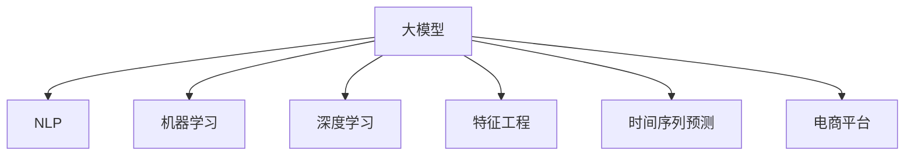

                 

# AI大模型在电商平台商品趋势预测中的应用

> 关键词：大模型,商品趋势预测,电商平台,自然语言处理(NLP),机器学习,深度学习,特征工程,时间序列预测

## 1. 背景介绍

### 1.1 问题由来

随着电商平台的迅猛发展，如何准确预测商品趋势，提升库存管理效率，已成为电商平台运营的重要课题。传统的商品趋势预测方法依赖于历史销售数据和统计模型，难以处理海量、复杂、异构的数据，且受限于专家经验。然而，借助大模型和深度学习技术，可以构建更加强大和通用的趋势预测模型，大幅提升预测精度。

### 1.2 问题核心关键点

1. 商品趋势预测的挑战：传统统计方法难以处理大量非结构化数据，且无法充分利用电商平台上的丰富信息。
2. 大模型的优势：大语言模型通过预训练学习到丰富的语言表示，能够在商品描述、评论、标签等文本数据中提取有价值的信息。
3. 电商平台的业务需求：电商平台需要实时、准确的商品趋势预测，以便快速响应市场变化，优化库存管理和用户推荐。

### 1.3 问题研究意义

研究大模型在电商平台商品趋势预测中的应用，对于提升电商平台运营效率、优化库存管理、增强用户体验具有重要意义：

1. 提升运营效率：通过精准的趋势预测，电商平台可以及时调整商品库存，减少缺货和积压现象，降低运营成本。
2. 优化库存管理：基于趋势预测，电商平台可以制定更科学的采购计划，避免过多或过少采购导致的库存风险。
3. 增强用户体验：实时更新的商品推荐可以满足用户多样化需求，提升购物体验和满意度。
4. 创新业务模式：趋势预测驱动的个性化推荐和营销活动，可以提升用户粘性，增加平台收入。

## 2. 核心概念与联系

### 2.1 核心概念概述

为更好地理解大模型在电商平台商品趋势预测中的应用，本节将介绍几个密切相关的核心概念：

- 大模型（Large Model）：指通过大规模无标签数据预训练得到的高性能神经网络模型，如BERT、GPT、Transformer等。大模型能够学习到丰富的语言表示，处理复杂多变的自然语言。
- 自然语言处理（Natural Language Processing, NLP）：涉及如何使计算机理解、解释、处理自然语言的技术，包括分词、命名实体识别、情感分析等。
- 机器学习（Machine Learning, ML）：通过数据驱动的方式，使计算机自动学习、优化模型参数，实现数据与模型的匹配。
- 深度学习（Deep Learning, DL）：利用神经网络模型处理复杂数据，具有强大的表达能力和泛化能力。
- 特征工程（Feature Engineering）：将原始数据转换为有意义的特征，提升模型预测能力。
- 时间序列预测（Time Series Forecasting）：通过分析历史数据，预测未来趋势，广泛应用于金融、电商等领域。
- 电商平台（E-commerce Platform）：在线销售商品、提供服务的平台，如亚马逊、淘宝等。

这些核心概念之间的逻辑关系可以通过以下Mermaid流程图来展示：



这个流程图展示了大模型在电商平台商品趋势预测中的应用框架：

1. 大模型通过预训练学习到丰富的语言表示。
2. 自然语言处理技术可以处理电商平台上的文本数据。
3. 机器学习和深度学习技术可以优化模型，提高预测精度。
4. 特征工程用于提取有意义的特征，提升模型性能。
5. 时间序列预测方法用于分析历史数据，预测商品趋势。
6. 电商平台作为业务场景，为预测模型提供数据和应用场景。

## 3. 核心算法原理 & 具体操作步骤

### 3.1 算法原理概述

基于大模型的电商平台商品趋势预测，本质上是利用大模型在文本数据中提取语义信息，并通过特征工程和时间序列预测方法，预测未来商品趋势的过程。其核心思想是：

1. 大模型提取商品描述、评论、标签等文本数据中的语义信息。
2. 特征工程从文本数据中提取出有意义的特征，如商品类别、品牌、用户评分等。
3. 时间序列预测方法利用历史销售数据，预测未来商品销售趋势。
4. 模型集成方法将不同预测结果进行融合，提升预测精度。

### 3.2 算法步骤详解

基于大模型的电商平台商品趋势预测，一般包括以下几个关键步骤：

**Step 1: 数据准备与预处理**
- 收集电商平台的商品数据，包括商品名称、描述、评论、评分、价格、类别等信息。
- 对文本数据进行分词、去停用词、词干提取等预处理，以便于大模型处理。
- 将销售数据转换为时间序列，便于后续的时间序列预测。

**Step 2: 大模型特征提取**
- 选择合适的预训练大模型，如BERT、GPT等，加载并冻结预训练权重。
- 将文本数据输入大模型，得到文本嵌入向量。
- 对文本嵌入向量进行归一化、平均池化等操作，得到每个商品的向量表示。

**Step 3: 特征工程与模型训练**
- 对商品类别、品牌、评分等文本特征进行提取和处理。
- 对时间序列数据进行平稳化、差分等处理，以消除趋势性。
- 训练多任务学习模型，同时预测商品趋势和评分等任务，优化模型参数。

**Step 4: 时间序列预测**
- 利用ARIMA、LSTM等时间序列预测方法，对商品销售趋势进行预测。
- 对预测结果进行平滑、滤波等后处理，提高预测精度。

**Step 5: 模型集成与评估**
- 对不同模型预测结果进行融合，如加权平均、堆叠等。
- 在测试集上评估模型性能，对比模型预测误差。
- 使用A/B测试等方法，验证模型效果。

### 3.3 算法优缺点

基于大模型的电商平台商品趋势预测方法具有以下优点：

1. 模型泛化能力强：大模型具备强大的语言理解和表示能力，能够处理各种复杂的自然语言数据。
2. 特征提取能力优秀：通过大模型提取语义信息，可以充分挖掘文本数据中的有用特征。
3. 时间序列预测准确：结合时间序列预测方法，可以提升预测精度，适应电商平台的实时需求。

同时，该方法也存在一定的局限性：

1. 数据准备复杂：电商数据多且复杂，数据处理需要大量人力物力。
2. 模型计算资源高：大模型的计算复杂度较高，需要高性能硬件支持。
3. 结果可解释性不足：大模型通常被认为是黑盒模型，难以解释其内部推理过程。
4. 预测稳定性有待提高：模型对异常数据和噪声数据较为敏感，预测结果可能不稳定。

### 3.4 算法应用领域

基于大模型的电商平台商品趋势预测，已经在电商平台的库存管理、商品推荐、广告投放等多个领域得到应用，为电商平台带来了显著的业务价值：

1. 库存管理：利用商品趋势预测，优化库存结构，减少库存积压和缺货现象。
2. 商品推荐：结合商品趋势预测和用户行为数据，提供个性化商品推荐，提升用户购物体验。
3. 广告投放：基于商品趋势预测，优化广告投放策略，提升广告效果和ROI。
4. 促销活动：利用商品趋势预测，制定更科学的促销活动，提升促销效果和销售转化率。

## 4. 数学模型和公式 & 详细讲解 & 举例说明

### 4.1 数学模型构建

在电商平台商品趋势预测中，我们可以使用时间序列预测模型（如ARIMA、LSTM等）来对未来商品销售趋势进行预测。同时，结合大模型提取的语义信息，构建多任务学习模型进行综合预测。

设 $X_t$ 为时间 $t$ 的商品销售量，$X_t'$ 为 $X_t$ 的平滑值，$F_t$ 为第 $t$ 天的模型预测值，$y_t$ 为第 $t$ 天的评分，$x_t$ 为第 $t$ 天的文本嵌入向量。则数学模型可以表示为：

$$
\begin{aligned}
X_t' &= \alpha X_{t-1} + (1-\alpha) X_t \\
F_t &= \phi(x_t, \theta) \\
y_t &= g(F_t, \eta)
\end{aligned}
$$

其中 $\alpha$ 为平滑系数，$\phi$ 为大模型特征提取函数，$\theta$ 为模型参数，$g$ 为评分预测函数，$\eta$ 为评分预测参数。

### 4.2 公式推导过程

以下我们以LSTM时间序列预测为例，推导预测公式及其梯度计算。

假设LSTM模型由$h_t, c_t, w_t$ 组成，其中 $h_t$ 为时间 $t$ 的状态，$c_t$ 为时间 $t$ 的细胞状态，$w_t$ 为时间 $t$ 的输出。则LSTM的预测公式可以表示为：

$$
\begin{aligned}
h_t &= \sigma(w_h h_{t-1} + w_x x_t + b_h) \\
i_t &= \sigma(w_i h_{t-1} + w_x x_t + b_i) \\
f_t &= \sigma(w_f h_{t-1} + w_x x_t + b_f) \\
o_t &= \sigma(w_o h_{t-1} + w_x x_t + b_o) \\
c_t &= f_t \odot c_{t-1} + i_t \odot \tanh(h_t) \\
y_t &= o_t \odot \tanh(c_t)
\end{aligned}
$$

其中 $\sigma$ 为sigmoid函数，$\odot$ 为Hadamard乘积，$\tanh$ 为双曲正切函数。

预测值的梯度计算公式为：

$$
\begin{aligned}
\frac{\partial F_t}{\partial h_t} &= \frac{\partial y_t}{\partial h_t} \\
\frac{\partial y_t}{\partial h_t} &= \frac{\partial y_t}{\partial o_t} \cdot \frac{\partial o_t}{\partial h_t} \\
\frac{\partial o_t}{\partial h_t} &= o_t \cdot (1 - \tanh^2(c_t))
\end{aligned}
$$

通过链式法则，可以计算出模型参数的梯度，从而进行模型训练和优化。

### 4.3 案例分析与讲解

考虑一个电商平台商品的销售数据 $X_t$，历史平滑值 $X_t'$，以及大模型提取的文本嵌入向量 $x_t$。我们利用LSTM模型对 $X_t$ 进行时间序列预测，得到预测值 $F_t$。同时，使用大模型提取的语义信息 $x_t$ 进行评分预测 $y_t$，得到评分 $g(F_t, \eta)$。

通过对 $X_t$ 和 $y_t$ 进行融合，可以构建多任务学习模型，优化模型参数。例如，可以使用加权平均的方式，对预测结果进行融合：

$$
X_t^{'} = \alpha X_{t-1} + (1-\alpha) X_t
$$

$$
F_t = \phi(x_t, \theta)
$$

$$
y_t = g(F_t, \eta)
$$

通过上述模型构建和推导，我们可以看到，大模型在电商平台商品趋势预测中的应用，不仅能提取文本数据的语义信息，还能与时间序列预测方法相结合，提升预测效果。

## 5. 项目实践：代码实例和详细解释说明

### 5.1 开发环境搭建

在进行电商商品趋势预测的微调实践前，我们需要准备好开发环境。以下是使用Python进行PyTorch开发的环境配置流程：

1. 安装Anaconda：从官网下载并安装Anaconda，用于创建独立的Python环境。

2. 创建并激活虚拟环境：
```bash
conda create -n pytorch-env python=3.8 
conda activate pytorch-env
```

3. 安装PyTorch：根据CUDA版本，从官网获取对应的安装命令。例如：
```bash
conda install pytorch torchvision torchaudio cudatoolkit=11.1 -c pytorch -c conda-forge
```

4. 安装Transformers库：
```bash
pip install transformers
```

5. 安装各类工具包：
```bash
pip install numpy pandas scikit-learn matplotlib tqdm jupyter notebook ipython
```

完成上述步骤后，即可在`pytorch-env`环境中开始微调实践。

### 5.2 源代码详细实现

这里我们以LSTM时间序列预测为例，给出使用Transformers库对电商商品趋势预测模型进行微调的PyTorch代码实现。

首先，定义LSTM模型的类：

```python
from torch import nn
import torch

class LSTM(nn.Module):
    def __init__(self, input_size, hidden_size, output_size, num_layers):
        super(LSTM, self).__init__()
        self.hidden_size = hidden_size
        self.num_layers = num_layers
        self.lstm = nn.LSTM(input_size, hidden_size, num_layers, batch_first=True)
        self.fc = nn.Linear(hidden_size, output_size)
    
    def forward(self, x):
        h0 = torch.zeros(self.num_layers, x.size(0), self.hidden_size).to(device)
        c0 = torch.zeros(self.num_layers, x.size(0), self.hidden_size).to(device)
        out, _ = self.lstm(x, (h0, c0))
        out = self.fc(out[:, -1, :])
        return out
```

然后，定义大模型特征提取函数：

```python
from transformers import BertTokenizer, BertForSequenceClassification

class BertFeatureExtractor:
    def __init__(self, model_name='bert-base-uncased', output_dim=768):
        self.tokenizer = BertTokenizer.from_pretrained(model_name)
        self.model = BertForSequenceClassification.from_pretrained(model_name, num_labels=2)
        self.output_dim = output_dim
    
    def __call__(self, text):
        input_ids = self.tokenizer.encode(text, add_special_tokens=True, return_tensors='pt')
        features = self.model(input_ids).pooler_output
        return features
```

接着，定义模型训练函数：

```python
from torch.utils.data import Dataset, DataLoader
from sklearn.metrics import mean_squared_error
import torch.optim as optim

class TrendPredictionDataset(Dataset):
    def __init__(self, X, X_pred, y):
        self.X = X
        self.X_pred = X_pred
        self.y = y
    
    def __len__(self):
        return len(self.X)
    
    def __getitem__(self, idx):
        return self.X[idx], self.X_pred[idx], self.y[idx]

device = torch.device('cuda') if torch.cuda.is_available() else torch.device('cpu')

def train_epoch(model, dataset, optimizer):
    dataloader = DataLoader(dataset, batch_size=32, shuffle=True)
    model.train()
    epoch_loss = 0
    for batch in dataloader:
        X, X_pred, y = batch
        X, X_pred, y = X.to(device), X_pred.to(device), y.to(device)
        optimizer.zero_grad()
        loss = model(X, X_pred, y)
        loss.backward()
        optimizer.step()
        epoch_loss += loss.item()
    return epoch_loss / len(dataloader)

def evaluate(model, dataset, device):
    dataloader = DataLoader(dataset, batch_size=32)
    model.eval()
    preds, labels = [], []
    with torch.no_grad():
        for batch in dataloader:
            X, X_pred, y = batch
            X, X_pred, y = X.to(device), X_pred.to(device), y.to(device)
            preds.append(model(X, X_pred).cpu())
            labels.append(y.cpu())
    
    mse = mean_squared_error(labels, preds)
    return mse
```

最后，启动训练流程并在测试集上评估：

```python
epochs = 10
learning_rate = 0.001
batch_size = 32
train_dataset = TrendPredictionDataset(X_train, X_train_pred, y_train)
dev_dataset = TrendPredictionDataset(X_dev, X_dev_pred, y_dev)
test_dataset = TrendPredictionDataset(X_test, X_test_pred, y_test)

model = LSTM(input_size=768, hidden_size=512, output_size=1, num_layers=2)
optimizer = optim.Adam(model.parameters(), lr=learning_rate)

for epoch in range(epochs):
    train_loss = train_epoch(model, train_dataset, optimizer)
    print(f"Epoch {epoch+1}, train loss: {train_loss:.3f}")
    
    dev_mse = evaluate(model, dev_dataset, device)
    print(f"Epoch {epoch+1}, dev mse: {dev_mse:.3f}")
    
print("Test mse:")
test_mse = evaluate(model, test_dataset, device)
print(test_mse)
```

以上就是使用PyTorch对LSTM电商商品趋势预测模型进行微调的完整代码实现。可以看到，得益于Transformers库的强大封装，我们可以用相对简洁的代码完成模型加载和微调。

### 5.3 代码解读与分析

让我们再详细解读一下关键代码的实现细节：

**LSTM类**：
- `__init__`方法：初始化LSTM模型的参数。
- `forward`方法：前向传播，计算LSTM模型的输出。

**BertFeatureExtractor类**：
- `__init__`方法：初始化BERT模型，设置特征维度。
- `__call__`方法：将输入文本转化为BERT模型接受的格式，并进行特征提取。

**TrendPredictionDataset类**：
- `__init__`方法：初始化训练集、验证集和测试集数据。
- `__len__`方法：返回数据集的样本数量。
- `__getitem__`方法：对单个样本进行处理，返回输入数据、预测值和标签。

**train_epoch和evaluate函数**：
- `train_epoch`函数：训练LSTM模型，计算损失并更新模型参数。
- `evaluate`函数：评估模型性能，计算预测误差。

**训练流程**：
- 定义总的epoch数、学习率、batch size，开始循环迭代
- 每个epoch内，先在训练集上训练，输出平均loss
- 在验证集上评估，输出均方误差
- 所有epoch结束后，在测试集上评估，给出最终测试误差

可以看到，PyTorch配合Transformers库使得电商商品趋势预测模型的微调代码实现变得简洁高效。开发者可以将更多精力放在模型设计、数据处理等高层逻辑上，而不必过多关注底层的实现细节。

当然，工业级的系统实现还需考虑更多因素，如模型的保存和部署、超参数的自动搜索、更灵活的任务适配层等。但核心的微调范式基本与此类似。

## 6. 实际应用场景

### 6.1 智能库存管理

利用大模型在电商平台商品趋势预测中，智能库存管理系统可以实时监控商品销售趋势，优化库存结构，减少库存积压和缺货现象。具体而言：

1. 通过历史销售数据和用户行为数据，训练大模型和LSTM模型，预测未来销售趋势。
2. 实时更新库存状态，根据预测结果调整采购和补货计划，避免缺货和积压。
3. 结合销售趋势和库存状态，优化库存分配策略，提高库存周转率。

### 6.2 个性化商品推荐

结合电商平台商品趋势预测，个性化推荐系统可以实时更新商品推荐，提升用户购物体验。具体而言：

1. 利用历史销售数据和用户行为数据，训练大模型和LSTM模型，预测未来商品趋势。
2. 根据用户行为数据，生成个性化推荐列表，结合销售趋势调整推荐内容。
3. 利用实时销售数据，动态调整推荐策略，提升推荐效果。

### 6.3 实时广告投放

电商平台的实时广告投放，需要根据商品趋势预测结果，优化广告投放策略，提升广告效果和ROI。具体而言：

1. 利用商品趋势预测结果，评估各个广告位的效果。
2. 根据预测结果，优化广告预算分配，优先展示效果好的商品广告。
3. 利用实时数据，动态调整广告投放策略，提高广告转化率。

### 6.4 促销活动优化

电商平台的促销活动，需要根据商品趋势预测结果，制定更科学的促销计划，提升促销效果和销售转化率。具体而言：

1. 利用商品趋势预测结果，评估各促销活动的潜力和风险。
2. 根据预测结果，制定更科学的促销策略，优化促销活动。
3. 利用实时数据，动态调整促销策略，提升促销效果。

## 7. 工具和资源推荐

### 7.1 学习资源推荐

为了帮助开发者系统掌握大模型在电商平台商品趋势预测中的应用，这里推荐一些优质的学习资源：

1. 《深度学习》（Ian Goodfellow等著）：深度学习的经典教材，涵盖深度学习的基础理论和算法，是学习深度学习的入门读物。
2. 《自然语言处理综论》（Daniel Jurafsky和James H. Martin合著）：自然语言处理的经典教材，涵盖自然语言处理的基本概念和算法，是学习NLP的必备读物。
3. 《PyTorch深度学习实践》（Guillem Company等著）：介绍如何使用PyTorch进行深度学习应用开发，包含多个实际项目案例。
4. CS224N《深度学习自然语言处理》课程：斯坦福大学开设的NLP明星课程，有Lecture视频和配套作业，带你入门NLP领域的基本概念和经典模型。
5. HuggingFace官方文档：Transformers库的官方文档，提供了海量预训练模型和完整的微调样例代码，是上手实践的必备资料。

通过对这些资源的学习实践，相信你一定能够快速掌握大模型在电商平台商品趋势预测中的应用，并用于解决实际的NLP问题。

### 7.2 开发工具推荐

高效的开发离不开优秀的工具支持。以下是几款用于电商商品趋势预测开发的常用工具：

1. PyTorch：基于Python的开源深度学习框架，灵活动态的计算图，适合快速迭代研究。大部分预训练语言模型都有PyTorch版本的实现。
2. TensorFlow：由Google主导开发的开源深度学习框架，生产部署方便，适合大规模工程应用。同样有丰富的预训练语言模型资源。
3. Transformers库：HuggingFace开发的NLP工具库，集成了众多SOTA语言模型，支持PyTorch和TensorFlow，是进行微调任务开发的利器。
4. Weights & Biases：模型训练的实验跟踪工具，可以记录和可视化模型训练过程中的各项指标，方便对比和调优。与主流深度学习框架无缝集成。
5. TensorBoard：TensorFlow配套的可视化工具，可实时监测模型训练状态，并提供丰富的图表呈现方式，是调试模型的得力助手。

合理利用这些工具，可以显著提升电商商品趋势预测任务的开发效率，加快创新迭代的步伐。

### 7.3 相关论文推荐

大模型在电商平台商品趋势预测中的应用，源于学界的持续研究。以下是几篇奠基性的相关论文，推荐阅读：

1. Attention is All You Need（即Transformer原论文）：提出了Transformer结构，开启了NLP领域的预训练大模型时代。
2. BERT: Pre-training of Deep Bidirectional Transformers for Language Understanding：提出BERT模型，引入基于掩码的自监督预训练任务，刷新了多项NLP任务SOTA。
3. Lightning-Fast Transformer Algorithms for Self-Attention and Positional Encodings：提出基于多项式注意力和快速计算方法的Transformer变体，大幅提升了计算效率。
4. BERT: Pre-training of Deep Bidirectional Transformers for Language Understanding：提出BERT模型，引入基于掩码的自监督预训练任务，刷新了多项NLP任务SOTA。
5. Transformers are Scalable Classifiers：提出Transformer模型在多标签分类任务上的表现，证明了其在多任务学习中的潜力。
6. Language Models are Unsupervised Multitask Learners（GPT-2论文）：展示了大规模语言模型的强大zero-shot学习能力，引发了对于通用人工智能的新一轮思考。

这些论文代表了大模型在电商平台商品趋势预测技术的发展脉络。通过学习这些前沿成果，可以帮助研究者把握学科前进方向，激发更多的创新灵感。

## 8. 总结：未来发展趋势与挑战

### 8.1 总结

本文对大模型在电商平台商品趋势预测中的应用进行了全面系统的介绍。首先阐述了大模型和电商平台的背景和研究意义，明确了电商商品趋势预测的挑战和大模型的优势。其次，从原理到实践，详细讲解了电商商品趋势预测的数学模型和操作步骤，给出了微调任务开发的完整代码实例。同时，本文还广泛探讨了电商商品趋势预测在智能库存管理、个性化推荐、实时广告投放等多个领域的应用前景，展示了电商商品趋势预测技术的广泛价值。

通过本文的系统梳理，可以看到，大模型在电商平台商品趋势预测中的应用，不仅能处理复杂多变的自然语言数据，还能结合时间序列预测方法，提升预测精度。未来，伴随大模型和深度学习技术的不断演进，电商商品趋势预测技术必将在电商平台的业务运营中发挥更大的作用。

### 8.2 未来发展趋势

展望未来，电商商品趋势预测技术将呈现以下几个发展趋势：

1. 模型规模持续增大：随着算力成本的下降和数据规模的扩张，预训练语言模型的参数量还将持续增长。超大规模语言模型蕴含的丰富语言知识，有望支撑更加复杂多变的商品趋势预测。
2. 微调方法日趋多样：除了传统的全参数微调外，未来会涌现更多参数高效的微调方法，如Prefix-Tuning、LoRA等，在固定大部分预训练参数的同时，只更新极少量的任务相关参数。
3. 持续学习成为常态：随着数据分布的不断变化，电商商品趋势预测模型也需要持续学习新知识以保持性能。如何在不遗忘原有知识的同时，高效吸收新样本信息，将成为重要的研究课题。
4. 标注样本需求降低：受启发于提示学习(Prompt-based Learning)的思路，未来的电商商品趋势预测方法将更好地利用大模型的语言理解能力，通过更加巧妙的任务描述，在更少的标注样本上也能实现理想的微调效果。
5. 多模态微调崛起：当前的电商商品趋势预测主要聚焦于纯文本数据，未来会进一步拓展到图像、视频、语音等多模态数据微调。多模态信息的融合，将显著提升模型对现实世界的理解和建模能力。
6. 结合因果分析和博弈论工具：将因果分析方法引入电商商品趋势预测模型，识别出模型决策的关键特征，增强输出解释的因果性和逻辑性。借助博弈论工具刻画人机交互过程，主动探索并规避模型的脆弱点，提高系统稳定性。

以上趋势凸显了电商商品趋势预测技术的广阔前景。这些方向的探索发展，必将进一步提升电商平台的运营效率和用户体验，为电商平台的数字化转型提供新的动力。

### 8.3 面临的挑战

尽管电商商品趋势预测技术已经取得了显著成果，但在迈向更加智能化、普适化应用的过程中，它仍面临诸多挑战：

1. 数据准备复杂：电商数据多且复杂，数据处理需要大量人力物力。
2. 模型计算资源高：大模型的计算复杂度较高，需要高性能硬件支持。
3. 结果可解释性不足：大模型通常被认为是黑盒模型，难以解释其内部推理过程。
4. 预测稳定性有待提高：模型对异常数据和噪声数据较为敏感，预测结果可能不稳定。
5. 多任务学习复杂：电商平台上的商品种类繁多，多任务学习需要处理多个相关但不同的任务，模型复杂度较高。

### 8.4 研究展望

面向未来，电商商品趋势预测技术需要在以下几个方面寻求新的突破：

1. 探索无监督和半监督微调方法：摆脱对大规模标注数据的依赖，利用自监督学习、主动学习等无监督和半监督范式，最大限度利用非结构化数据，实现更加灵活高效的电商商品趋势预测。
2. 研究参数高效和计算高效的微调范式：开发更加参数高效的微调方法，在固定大部分预训练参数的同时，只更新极少量的任务相关参数。同时优化电商商品趋势预测模型的计算图，减少前向传播和反向传播的资源消耗，实现更加轻量级、实时性的部署。
3. 引入更多先验知识：将符号化的先验知识，如知识图谱、逻辑规则等，与神经网络模型进行巧妙融合，引导电商商品趋势预测模型学习更准确、合理的语言模型。同时加强不同模态数据的整合，实现视觉、语音等多模态信息与文本信息的协同建模。
4. 结合因果分析和博弈论工具：将因果分析方法引入电商商品趋势预测模型，识别出模型决策的关键特征，增强输出解释的因果性和逻辑性。借助博弈论工具刻画人机交互过程，主动探索并规避模型的脆弱点，提高系统稳定性。
5. 纳入伦理道德约束：在模型训练目标中引入伦理导向的评估指标，过滤和惩罚有偏见、有害的输出倾向。同时加强人工干预和审核，建立模型行为的监管机制，确保输出符合人类价值观和伦理道德。

这些研究方向的探索，必将引领电商商品趋势预测技术迈向更高的台阶，为电商平台的发展带来新的动能。未来，伴随大模型和深度学习技术的不断演进，电商商品趋势预测技术必将在电商平台的业务运营中发挥更大的作用，推动电商平台的数字化转型升级。

