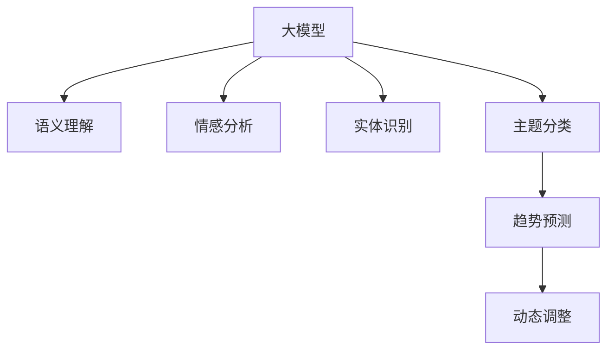

                 

## 1. 背景介绍

### 1.1 问题由来

在电商平台上，用户反馈是商家了解用户需求、改进产品和服务的重要依据。通过分析用户反馈，商家可以优化产品设计，提升用户体验，进而增加销量和用户粘性。然而，面对海量用户反馈数据，传统的数据分析和处理方式往往力不从心，难以挖掘出有价值的洞见。

近年来，随着人工智能技术的飞速发展，基于大模型的自然语言处理技术(NLP)为电商平台用户反馈分析带来了新的可能性。大模型通过在大规模无标签文本数据上进行预训练，学习到了丰富的语言知识和模式，可以用于自动化地分析用户反馈，快速提取出关键洞见和趋势。

### 1.2 问题核心关键点

大模型在电商平台用户反馈分析中的应用，关键在于如何构建高效的反馈分析系统。该系统需要具备以下几个核心能力：

- **语义理解**：理解用户反馈中的具体问题和需求，避免误判和噪声。
- **情感分析**：判断用户反馈的情感倾向，分为正面、中性、负面，便于商家快速识别和应对。
- **实体识别**：从用户反馈中识别出具体的产品或功能，便于针对性地改进。
- **主题分类**：将用户反馈按照主题进行分类，便于系统化管理和优先级排序。
- **趋势预测**：基于历史反馈数据，预测未来趋势，指导产品迭代。
- **动态调整**：根据最新的用户反馈数据，动态调整产品策略，保持产品竞争力。

### 1.3 问题研究意义

通过大模型对电商平台用户反馈进行自动化分析，商家可以：

1. **快速响应**：实时了解用户需求和问题，快速响应，提升用户体验。
2. **精准改进**：基于用户反馈的洞见，精准改进产品设计和功能，减少不必要的资源浪费。
3. **增强决策**：系统化地分析反馈数据，辅助高层管理人员制定科学决策，提升整体运营效率。
4. **数据驱动**：构建数据驱动的产品迭代闭环，持续优化产品和服务，增强市场竞争力。

## 2. 核心概念与联系

### 2.1 核心概念概述

为更好地理解大模型在电商平台用户反馈分析中的应用，本节将介绍几个密切相关的核心概念：

- **大模型**：如GPT-3、BERT、T5等大规模预训练语言模型，通过自监督或监督学习任务进行训练，具备强大的语言理解和生成能力。
- **语义理解**：理解文本的深层含义，包括句法结构、语义关系等，能够准确识别出用户反馈中的关键信息和问题。
- **情感分析**：通过情感词典、深度学习模型等手段，判断文本的情感倾向，分为正面、中性、负面。
- **实体识别**：识别出文本中的命名实体，如产品名称、功能描述等，便于商家针对性地改进产品。
- **主题分类**：对用户反馈进行主题分类，如质量问题、功能建议、配送问题等，便于系统化管理和优先级排序。
- **趋势预测**：基于历史反馈数据，使用时间序列分析、预测模型等手段，预测未来趋势，指导产品迭代。
- **动态调整**：根据最新的用户反馈数据，动态调整产品策略，如产品定价、推广策略等，保持产品竞争力。

这些概念之间的逻辑关系可以通过以下Mermaid流程图来展示：



这个流程图展示了大模型在电商平台用户反馈分析中的核心概念及其之间的关系：

1. 大模型通过预训练学习到了丰富的语言知识和模式。
2. 在语义理解、情感分析、实体识别等任务上，大模型能够提取关键信息，并提供洞见。
3. 主题分类和趋势预测进一步提升了反馈分析的系统性和前瞻性。
4. 动态调整帮助商家根据最新反馈数据，快速优化产品策略。

## 3. 核心算法原理 & 具体操作步骤

### 3.1 算法原理概述

大模型在电商平台用户反馈分析中的应用，本质上是一个多任务的微调过程。其核心思想是：将预训练的大模型视作一个强大的"特征提取器"，通过用户反馈数据上的有监督学习，优化模型在多个特定任务上的性能。

具体而言，基于大模型的用户反馈分析系统包括以下几个核心步骤：

1. 将用户反馈数据进行预处理，包括去噪、分词、标准化等。
2. 将预处理后的数据输入到大模型中进行语义理解、情感分析、实体识别等任务。
3. 根据任务目标，设计合适的输出层和损失函数。
4. 使用微调算法，在标注数据集上训练模型，优化任务特定参数。
5. 在验证集和测试集上评估模型性能，动态调整模型参数和策略。

### 3.2 算法步骤详解

#### 3.2.1 数据预处理

用户反馈数据通常包含各种格式和语言，需要进行预处理以便于模型处理。具体包括：

- **去噪**：去除无关噪声，如标点符号、停用词等，保留有用信息。
- **分词**：将文本分割成单词或子词，以便于模型进行语义理解。
- **标准化**：统一文本格式，包括大小写转换、缩写处理等。

#### 3.2.2 输入设计

将预处理后的数据输入到大模型中，进行语义理解、情感分析、实体识别等任务。具体输入格式如下：

- **语义理解**：输入文本，通过BERT或GPT等模型进行语义编码，提取关键信息。
- **情感分析**：输入文本和对应的标签，通过分类模型判断情感倾向。
- **实体识别**：输入文本和实体标签，通过标注数据训练模型，识别命名实体。

#### 3.2.3 输出设计

根据任务目标，设计合适的输出层和损失函数。具体包括：

- **语义理解**：设计分类层，输出预测类别，使用交叉熵损失。
- **情感分析**：设计分类层，输出情感类别，使用二分类交叉熵损失。
- **实体识别**：设计序列标注层，输出实体标签，使用序列交叉熵损失。

#### 3.2.4 模型微调

使用微调算法，在标注数据集上训练模型，优化任务特定参数。具体包括：

- **选择微调模型**：选择合适的大模型进行微调，如BERT、RoBERTa、XLNet等。
- **设计微调任务**：根据任务目标，设计微调任务，包括分类、标注、预测等。
- **优化器选择**：选择合适优化器，如AdamW、SGD等，设置学习率、批大小等参数。
- **训练策略**：设置训练轮数、Early Stopping等策略，防止过拟合。

#### 3.2.5 性能评估

在验证集和测试集上评估模型性能，动态调整模型参数和策略。具体包括：

- **评估指标**：选择合适的评估指标，如准确率、F1-score、ROC-AUC等。
- **模型调优**：根据评估结果，动态调整模型参数，如学习率、批大小等。
- **策略调整**：根据评估结果，调整产品策略，如优化产品设计、改进客户服务等。

### 3.3 算法优缺点

大模型在电商平台用户反馈分析中的应用具有以下优点：

- **高效性**：大模型能够高效处理大规模文本数据，提升分析效率。
- **灵活性**：通过微调，模型可以适应不同的任务和数据集，具备较强的泛化能力。
- **准确性**：大模型通过多任务微调，提升了在不同任务上的准确性，能够更好地理解用户需求和问题。
- **可解释性**：大模型能够提供详细的输出结果和分析洞见，便于商家理解和应用。

同时，该方法也存在一些局限性：

- **资源消耗高**：大模型通常参数量大，需要高性能计算资源，存在一定的资源消耗。
- **训练成本高**：标注数据集的准备和标注工作较为耗时，存在一定的训练成本。
- **模型可控性差**：大模型较为复杂，其内部工作机制难以解释，存在一定的不可控性。

尽管存在这些局限性，但就目前而言，基于大模型的用户反馈分析方法仍是在线业务分析的重要手段。未来相关研究的重点在于如何进一步降低大模型对计算资源和标注数据的依赖，提高模型的可控性和可解释性，以及优化模型的推理效率，以适应电商平台的实时性需求。

### 3.4 算法应用领域

基于大模型的用户反馈分析技术，已在电商平台的多个场景中得到了广泛应用，例如：

- **产品质量监控**：通过分析用户对产品的评价和投诉，及时发现产品质量问题，指导生产改进。
- **用户满意度分析**：通过分析用户反馈的情感倾向，了解用户对产品服务的满意度，优化客户体验。
- **产品功能优化**：通过分析用户对产品功能的建议和需求，快速迭代和优化产品设计，提升产品竞争力。
- **供应链优化**：通过分析用户对物流配送的反馈，优化供应链流程，提升配送效率和服务质量。
- **市场趋势预测**：基于历史反馈数据，使用时间序列分析等方法，预测市场趋势和用户需求，指导产品迭代和市场策略。

除了上述这些经典应用外，大模型还广泛应用于个性化推荐、用户画像构建、智能客服等场景中，为电商平台带来了显著的业务价值。

## 4. 数学模型和公式 & 详细讲解  
### 4.1 数学模型构建

假设电商平台用户反馈数据集为 $D=\{(x_i, y_i)\}_{i=1}^N, x_i \in \mathcal{X}, y_i \in \mathcal{Y}$，其中 $\mathcal{X}$ 为输入空间，$\mathcal{Y}$ 为输出空间。

定义大模型 $M_{\theta}$，其中 $\theta$ 为预训练得到的模型参数。假设要进行的任务为语义理解、情感分析、实体识别等，分别定义对应的输出层和损失函数。

- **语义理解**：输入文本 $x_i$，输出预测类别 $p_i$，使用交叉熵损失 $\ell_u = -\frac{1}{N} \sum_{i=1}^N y_i \log p_i$。
- **情感分析**：输入文本 $x_i$ 和标签 $y_i$，输出情感类别 $p_i$，使用二分类交叉熵损失 $\ell_s = -\frac{1}{N} \sum_{i=1}^N (y_i \log p_i + (1-y_i) \log (1-p_i))$。
- **实体识别**：输入文本 $x_i$ 和标签序列 $y_i$，输出序列标签 $p_i$，使用序列交叉熵损失 $\ell_r = -\frac{1}{N} \sum_{i=1}^N \sum_{j=1}^{|y_i|} y_{i,j} \log p_{i,j}$。

在定义好各个任务的损失函数后，整体损失函数 $\mathcal{L}$ 为：

$$
\mathcal{L}(\theta) = \lambda_u \ell_u + \lambda_s \ell_s + \lambda_r \ell_r
$$

其中 $\lambda_u, \lambda_s, \lambda_r$ 为各任务在整体损失中的权重。

### 4.2 公式推导过程

以情感分析任务为例，推导其交叉熵损失函数的计算过程。

假设模型 $M_{\theta}$ 在输入 $x_i$ 上的输出为 $\hat{y}_i=M_{\theta}(x_i) \in [0,1]$，表示样本属于正面情感的概率。真实标签 $y_i \in \{0,1\}$。则二分类交叉熵损失函数定义为：

$$
\ell_s(M_{\theta}(x_i),y_i) = -[y_i\log \hat{y}_i + (1-y_i)\log (1-\hat{y}_i)]
$$

将其代入经验风险公式，得：

$$
\mathcal{L}_s(\theta) = -\frac{1}{N}\sum_{i=1}^N [y_i\log M_{\theta}(x_i)+(1-y_i)\log(1-M_{\theta}(x_i))]
$$

根据链式法则，损失函数对参数 $\theta_k$ 的梯度为：

$$
\frac{\partial \mathcal{L}_s(\theta)}{\partial \theta_k} = -\frac{1}{N}\sum_{i=1}^N (\frac{y_i}{M_{\theta}(x_i)}-\frac{1-y_i}{1-M_{\theta}(x_i)}) \frac{\partial M_{\theta}(x_i)}{\partial \theta_k}
$$

其中 $\frac{\partial M_{\theta}(x_i)}{\partial \theta_k}$ 可进一步递归展开，利用自动微分技术完成计算。

在得到情感分析任务的梯度后，即可带入参数更新公式，完成模型的迭代优化。重复上述过程直至收敛，最终得到适应情感分析任务的最优模型参数 $\theta^*_s$。

## 5. 项目实践：代码实例和详细解释说明
### 5.1 开发环境搭建

在进行大模型微调实践前，我们需要准备好开发环境。以下是使用Python进行PyTorch开发的环境配置流程：

1. 安装Anaconda：从官网下载并安装Anaconda，用于创建独立的Python环境。

2. 创建并激活虚拟环境：
```bash
conda create -n pytorch-env python=3.8 
conda activate pytorch-env
```

3. 安装PyTorch：根据CUDA版本，从官网获取对应的安装命令。例如：
```bash
conda install pytorch torchvision torchaudio cudatoolkit=11.1 -c pytorch -c conda-forge
```

4. 安装Transformers库：
```bash
pip install transformers
```

5. 安装各类工具包：
```bash
pip install numpy pandas scikit-learn matplotlib tqdm jupyter notebook ipython
```

完成上述步骤后，即可在`pytorch-env`环境中开始微调实践。

### 5.2 源代码详细实现

下面我们以电商平台用户反馈情感分析任务为例，给出使用Transformers库对BERT模型进行微调的PyTorch代码实现。

首先，定义情感分析任务的数据处理函数：

```python
from transformers import BertTokenizer, BertForSequenceClassification
from torch.utils.data import Dataset
import torch

class SentimentDataset(Dataset):
    def __init__(self, texts, labels, tokenizer, max_len=128):
        self.texts = texts
        self.labels = labels
        self.tokenizer = tokenizer
        self.max_len = max_len
        
    def __len__(self):
        return len(self.texts)
    
    def __getitem__(self, item):
        text = self.texts[item]
        label = self.labels[item]
        
        encoding = self.tokenizer(text, return_tensors='pt', max_length=self.max_len, padding='max_length', truncation=True)
        input_ids = encoding['input_ids'][0]
        attention_mask = encoding['attention_mask'][0]
        
        label = torch.tensor(label, dtype=torch.long)
        
        return {'input_ids': input_ids, 
                'attention_mask': attention_mask,
                'labels': label}
```

然后，定义模型和优化器：

```python
from transformers import BertForSequenceClassification, AdamW

model = BertForSequenceClassification.from_pretrained('bert-base-cased', num_labels=2)

optimizer = AdamW(model.parameters(), lr=2e-5)
```

接着，定义训练和评估函数：

```python
from torch.utils.data import DataLoader
from tqdm import tqdm
from sklearn.metrics import classification_report

device = torch.device('cuda') if torch.cuda.is_available() else torch.device('cpu')
model.to(device)

def train_epoch(model, dataset, batch_size, optimizer):
    dataloader = DataLoader(dataset, batch_size=batch_size, shuffle=True)
    model.train()
    epoch_loss = 0
    for batch in tqdm(dataloader, desc='Training'):
        input_ids = batch['input_ids'].to(device)
        attention_mask = batch['attention_mask'].to(device)
        labels = batch['labels'].to(device)
        model.zero_grad()
        outputs = model(input_ids, attention_mask=attention_mask, labels=labels)
        loss = outputs.loss
        epoch_loss += loss.item()
        loss.backward()
        optimizer.step()
    return epoch_loss / len(dataloader)

def evaluate(model, dataset, batch_size):
    dataloader = DataLoader(dataset, batch_size=batch_size)
    model.eval()
    preds, labels = [], []
    with torch.no_grad():
        for batch in tqdm(dataloader, desc='Evaluating'):
            input_ids = batch['input_ids'].to(device)
            attention_mask = batch['attention_mask'].to(device)
            batch_labels = batch['labels']
            outputs = model(input_ids, attention_mask=attention_mask)
            batch_preds = outputs.logits.argmax(dim=1).to('cpu').tolist()
            batch_labels = batch_labels.to('cpu').tolist()
            for pred, label in zip(batch_preds, batch_labels):
                preds.append(pred)
                labels.append(label)
                
    print(classification_report(labels, preds))
```

最后，启动训练流程并在测试集上评估：

```python
epochs = 5
batch_size = 16

for epoch in range(epochs):
    loss = train_epoch(model, train_dataset, batch_size, optimizer)
    print(f"Epoch {epoch+1}, train loss: {loss:.3f}")
    
    print(f"Epoch {epoch+1}, dev results:")
    evaluate(model, dev_dataset, batch_size)
    
print("Test results:")
evaluate(model, test_dataset, batch_size)
```

以上就是使用PyTorch对BERT进行情感分析任务微调的完整代码实现。可以看到，得益于Transformers库的强大封装，我们可以用相对简洁的代码完成BERT模型的加载和微调。

### 5.3 代码解读与分析

让我们再详细解读一下关键代码的实现细节：

**SentimentDataset类**：
- `__init__`方法：初始化文本、标签、分词器等关键组件。
- `__len__`方法：返回数据集的样本数量。
- `__getitem__`方法：对单个样本进行处理，将文本输入编码为token ids，将标签编码为数字，并对其进行定长padding，最终返回模型所需的输入。

**BertForSequenceClassification和AdamW**：
- `BertForSequenceClassification.from_pretrained`：加载预训练的BERT模型，指定类别数。
- `AdamW`：选择AdamW优化器，设置学习率。

**训练和评估函数**：
- 使用PyTorch的DataLoader对数据集进行批次化加载，供模型训练和推理使用。
- 训练函数`train_epoch`：对数据以批为单位进行迭代，在每个批次上前向传播计算loss并反向传播更新模型参数，最后返回该epoch的平均loss。
- 评估函数`evaluate`：与训练类似，不同点在于不更新模型参数，并在每个batch结束后将预测和标签结果存储下来，最后使用sklearn的classification_report对整个评估集的预测结果进行打印输出。

**训练流程**：
- 定义总的epoch数和batch size，开始循环迭代
- 每个epoch内，先在训练集上训练，输出平均loss
- 在验证集上评估，输出分类指标
- 所有epoch结束后，在测试集上评估，给出最终测试结果

可以看到，PyTorch配合Transformers库使得BERT微调的代码实现变得简洁高效。开发者可以将更多精力放在数据处理、模型改进等高层逻辑上，而不必过多关注底层的实现细节。

当然，工业级的系统实现还需考虑更多因素，如模型的保存和部署、超参数的自动搜索、更灵活的任务适配层等。但核心的微调范式基本与此类似。

## 6. 实际应用场景
### 6.1 智能客服系统

基于大模型微调的对话技术，可以广泛应用于智能客服系统的构建。传统客服往往需要配备大量人力，高峰期响应缓慢，且一致性和专业性难以保证。而使用微调后的对话模型，可以7x24小时不间断服务，快速响应客户咨询，用自然流畅的语言解答各类常见问题。

在技术实现上，可以收集企业内部的历史客服对话记录，将问题和最佳答复构建成监督数据，在此基础上对预训练对话模型进行微调。微调后的对话模型能够自动理解用户意图，匹配最合适的答案模板进行回复。对于客户提出的新问题，还可以接入检索系统实时搜索相关内容，动态组织生成回答。如此构建的智能客服系统，能大幅提升客户咨询体验和问题解决效率。

### 6.2 金融舆情监测

金融机构需要实时监测市场舆论动向，以便及时应对负面信息传播，规避金融风险。传统的人工监测方式成本高、效率低，难以应对网络时代海量信息爆发的挑战。基于大语言模型微调的文本分类和情感分析技术，为金融舆情监测提供了新的解决方案。

具体而言，可以收集金融领域相关的新闻、报道、评论等文本数据，并对其进行主题标注和情感标注。在此基础上对预训练语言模型进行微调，使其能够自动判断文本属于何种主题，情感倾向是正面、中性还是负面。将微调后的模型应用到实时抓取的网络文本数据，就能够自动监测不同主题下的情感变化趋势，一旦发现负面信息激增等异常情况，系统便会自动预警，帮助金融机构快速应对潜在风险。

### 6.3 个性化推荐系统

当前的推荐系统往往只依赖用户的历史行为数据进行物品推荐，无法深入理解用户的真实兴趣偏好。基于大语言模型微调技术，个性化推荐系统可以更好地挖掘用户行为背后的语义信息，从而提供更精准、多样的推荐内容。

在实践中，可以收集用户浏览、点击、评论、分享等行为数据，提取和用户交互的物品标题、描述、标签等文本内容。将文本内容作为模型输入，用户的后续行为（如是否点击、购买等）作为监督信号，在此基础上微调预训练语言模型。微调后的模型能够从文本内容中准确把握用户的兴趣点。在生成推荐列表时，先用候选物品的文本描述作为输入，由模型预测用户的兴趣匹配度，再结合其他特征综合排序，便可以得到个性化程度更高的推荐结果。

### 6.4 未来应用展望

随着大语言模型微调技术的发展，基于微调范式将在更多领域得到应用，为传统行业带来变革性影响。

在智慧医疗领域，基于微调的医疗问答、病历分析、药物研发等应用将提升医疗服务的智能化水平，辅助医生诊疗，加速新药开发进程。

在智能教育领域，微调技术可应用于作业批改、学情分析、知识推荐等方面，因材施教，促进教育公平，提高教学质量。

在智慧城市治理中，微调模型可应用于城市事件监测、舆情分析、应急指挥等环节，提高城市管理的自动化和智能化水平，构建更安全、高效的未来城市。

此外，在企业生产、社会治理、文娱传媒等众多领域，基于大模型微调的人工智能应用也将不断涌现，为经济社会发展注入新的动力。相信随着技术的日益成熟，微调方法将成为人工智能落地应用的重要范式，推动人工智能技术向更广阔的领域加速渗透。

## 7. 工具和资源推荐
### 7.1 学习资源推荐

为了帮助开发者系统掌握大模型微调的理论基础和实践技巧，这里推荐一些优质的学习资源：

1. 《Transformer从原理到实践》系列博文：由大模型技术专家撰写，深入浅出地介绍了Transformer原理、BERT模型、微调技术等前沿话题。

2. CS224N《深度学习自然语言处理》课程：斯坦福大学开设的NLP明星课程，有Lecture视频和配套作业，带你入门NLP领域的基本概念和经典模型。

3. 《Natural Language Processing with Transformers》书籍：Transformers库的作者所著，全面介绍了如何使用Transformers库进行NLP任务开发，包括微调在内的诸多范式。

4. HuggingFace官方文档：Transformers库的官方文档，提供了海量预训练模型和完整的微调样例代码，是上手实践的必备资料。

5. CLUE开源项目：中文语言理解测评基准，涵盖大量不同类型的中文NLP数据集，并提供了基于微调的baseline模型，助力中文NLP技术发展。

通过对这些资源的学习实践，相信你一定能够快速掌握大语言模型微调的精髓，并用于解决实际的NLP问题。
###  7.2 开发工具推荐

高效的开发离不开优秀的工具支持。以下是几款用于大语言模型微调开发的常用工具：

1. PyTorch：基于Python的开源深度学习框架，灵活动态的计算图，适合快速迭代研究。大部分预训练语言模型都有PyTorch版本的实现。

2. TensorFlow：由Google主导开发的开源深度学习框架，生产部署方便，适合大规模工程应用。同样有丰富的预训练语言模型资源。

3. Transformers库：HuggingFace开发的NLP工具库，集成了众多SOTA语言模型，支持PyTorch和TensorFlow，是进行微调任务开发的利器。

4. Weights & Biases：模型训练的实验跟踪工具，可以记录和可视化模型训练过程中的各项指标，方便对比和调优。与主流深度学习框架无缝集成。

5. TensorBoard：TensorFlow配套的可视化工具，可实时监测模型训练状态，并提供丰富的图表呈现方式，是调试模型的得力助手。

6. Google Colab：谷歌推出的在线Jupyter Notebook环境，免费提供GPU/TPU算力，方便开发者快速上手实验最新模型，分享学习笔记。

合理利用这些工具，可以显著提升大语言模型微调任务的开发效率，加快创新迭代的步伐。

### 7.3 相关论文推荐

大语言模型和微调技术的发展源于学界的持续研究。以下是几篇奠基性的相关论文，推荐阅读：

1. Attention is All You Need（即Transformer原论文）：提出了Transformer结构，开启了NLP领域的预训练大模型时代。

2. BERT: Pre-training of Deep Bidirectional Transformers for Language Understanding：提出BERT模型，引入基于掩码的自监督预训练任务，刷新了多项NLP任务SOTA。

3. Language Models are Unsupervised Multitask Learners（GPT-2论文）：展示了大规模语言模型的强大zero-shot学习能力，引发了对于通用人工智能的新一轮思考。

4. Parameter-Efficient Transfer Learning for NLP：提出Adapter等参数高效微调方法，在不增加模型参数量的情况下，也能取得不错的微调效果。

5. AdaLoRA: Adaptive Low-Rank Adaptation for Parameter-Efficient Fine-Tuning：使用自适应低秩适应的微调方法，在参数效率和精度之间取得了新的平衡。

这些论文代表了大语言模型微调技术的发展脉络。通过学习这些前沿成果，可以帮助研究者把握学科前进方向，激发更多的创新灵感。

## 8. 总结：未来发展趋势与挑战

### 8.1 总结

本文对基于大模型的电商平台用户反馈分析方法进行了全面系统的介绍。首先阐述了大模型在电商平台用户反馈分析中的应用背景和意义，明确了微调在拓展预训练模型应用、提升用户反馈分析能力方面的独特价值。其次，从原理到实践，详细讲解了微调的数学原理和关键步骤，给出了微调任务开发的完整代码实例。同时，本文还广泛探讨了微调方法在智能客服、金融舆情、个性化推荐等多个行业领域的应用前景，展示了微调范式的巨大潜力。此外，本文精选了微调技术的各类学习资源，力求为读者提供全方位的技术指引。

通过本文的系统梳理，可以看到，基于大模型的用户反馈分析方法正在成为电商平台的重要分析手段，极大地提升了商家对用户需求的响应速度和处理效率。未来，伴随大模型的不断进化和微调技术的持续优化，基于微调范式将在更多领域得到应用，为各行业带来革命性影响。

### 8.2 未来发展趋势

展望未来，大模型在电商平台用户反馈分析中的应用将呈现以下几个发展趋势：

1. **实时化**：随着大模型推理速度的提升和边缘计算的发展，实时化分析成为可能，商家能够实时响应用户反馈，提升用户体验。
2. **多模态融合**：将文本、图像、语音等多模态数据结合，提升反馈分析的全面性和准确性。
3. **智能决策支持**：将反馈分析结果与业务系统深度融合，提供智能决策支持，优化产品和服务设计。
4. **用户画像构建**：基于用户反馈数据，构建详细的用户画像，个性化推荐系统能够更精准地满足用户需求。
5. **跨平台协同**：不同电商平台之间的数据共享和反馈联动，提升整体市场响应速度和效率。
6. **伦理和隐私保护**：随着数据量的增加，用户隐私保护问题更加突出，未来的分析系统需要更加注重数据隐私和安全。

以上趋势凸显了大模型在电商平台用户反馈分析中的广阔前景。这些方向的探索发展，必将进一步提升反馈分析系统的性能和应用范围，为电商平台带来更高效、更智能的客户服务。

### 8.3 面临的挑战

尽管大模型在电商平台用户反馈分析中取得了显著成效，但在实现实时化、多模态融合等目标的过程中，仍面临诸多挑战：

1. **数据质量**：用户反馈数据可能存在噪声、不完整等问题，影响分析结果的准确性。如何清洗和标准化数据，是提高分析质量的关键。
2. **模型性能**：大模型在实时处理大规模数据时，推理速度和资源消耗仍需进一步优化。如何平衡速度和性能，是提升用户体验的关键。
3. **跨平台协同**：不同电商平台之间的数据共享和分析需要标准化的接口和协议，如何构建协同系统，是提升整体市场响应速度的关键。
4. **隐私保护**：用户反馈数据涉及用户隐私，如何保护用户数据安全，是构建可信分析系统的关键。
5. **多模态融合**：将文本、图像、语音等多模态数据结合，涉及数据格式、处理方式等方面的复杂性，如何构建统一的分析框架，是提升分析全面性的关键。
6. **智能决策支持**：将分析结果与业务系统深度融合，需要构建更加灵活的决策支持系统，如何确保系统的可靠性和稳定性，是提升服务质量的关键。

这些挑战需要跨学科的协作和技术创新，共同推进大模型在电商平台用户反馈分析中的深度应用。相信随着技术的不断进步和各方努力的共同推动，这些挑战终将一一被克服，大模型将在电商平台中发挥更大的作用，为商家和用户创造更多价值。

### 8.4 研究展望

面对大模型在电商平台用户反馈分析中面临的挑战，未来的研究需要在以下几个方面寻求新的突破：

1. **高效实时化**：开发高效实时推理算法，提升模型在大规模数据上的推理速度，适应电商平台的实时需求。
2. **多模态融合技术**：研究文本、图像、语音等多模态数据的融合分析技术，提升反馈分析的全面性和准确性。
3. **跨平台协同机制**：构建标准化接口和协议，促进不同电商平台之间的数据共享和分析，提升整体市场响应速度和效率。
4. **数据隐私保护**：研究隐私保护技术，如差分隐私、联邦学习等，保护用户反馈数据的隐私安全。
5. **智能决策支持系统**：构建更加灵活、可靠的决策支持系统，将分析结果与业务系统深度融合，提供智能决策支持。

这些研究方向的研究突破，必将进一步提升大模型在电商平台用户反馈分析中的应用价值，为电商平台带来更高效、更智能的客户服务。相信随着技术的不断发展，大模型将在电商平台中发挥更大的作用，为商家和用户创造更多价值。

## 9. 附录：常见问题与解答

**Q1：电商平台用户反馈数据的质量如何保障？**

A: 电商平台用户反馈数据的质量保障主要依赖以下几个方面：

1. **数据清洗**：在数据输入模型前，进行噪音过滤、去重、拼写修正等清洗工作，保证数据质量。
2. **标注质量**：标注数据的质量直接影响模型的性能，需要进行严格的标注审核和标注规范。
3. **数据标注**：通过标注专家团队或平台内用户，进行高质量的数据标注工作。
4. **多模态融合**：将文本、图像、语音等多模态数据结合，提升反馈分析的全面性和准确性。
5. **隐私保护**：保护用户数据隐私，采用差分隐私、联邦学习等隐私保护技术，防止数据泄露和滥用。

通过这些措施，可以保障电商平台用户反馈数据的质量，提升分析结果的准确性和可靠性。

**Q2：如何提高大模型在电商平台用户反馈分析中的实时化能力？**

A: 提高大模型在电商平台用户反馈分析中的实时化能力，可以从以下几个方面入手：

1. **模型压缩**：通过模型压缩技术，如知识蒸馏、剪枝等，减小模型尺寸，提升推理速度。
2. **推理加速**：使用GPU、TPU等高性能计算设备，加速模型推理过程。
3. **分布式计算**：使用分布式计算框架，如TensorFlow分布式训练、PyTorch分布式训练等，实现模型推理的并行化。
4. **边缘计算**：将模型部署到边缘计算设备，如嵌入式设备、云边协同等，实现低延迟推理。
5. **优化算法**：使用高效的优化算法，如AdamW、SGD等，提高模型训练和推理的效率。

通过这些措施，可以显著提升大模型在电商平台用户反馈分析中的实时化能力，实现更高效、更智能的客户服务。

**Q3：如何保障电商平台用户反馈分析系统的数据隐私和安全？**

A: 保障电商平台用户反馈分析系统的数据隐私和安全，主要依赖以下几个方面：

1. **数据加密**：对用户反馈数据进行加密存储和传输，防止数据泄露。
2. **差分隐私**：采用差分隐私技术，对用户反馈数据进行去识别化处理，防止个体隐私泄露。
3. **联邦学习**：通过联邦学习技术，将模型训练分布在各个节点上进行，防止数据集中存储和泄露。
4. **访问控制**：设置严格的访问权限控制，防止未经授权的访问和数据泄露。
5. **隐私保护算法**：使用隐私保护算法，如差分隐私、同态加密等，保护用户数据隐私。

通过这些措施，可以保障电商平台用户反馈分析系统的数据隐私和安全，保护用户数据免受滥用和泄露。

---

作者：禅与计算机程序设计艺术 / Zen and the Art of Computer Programming

