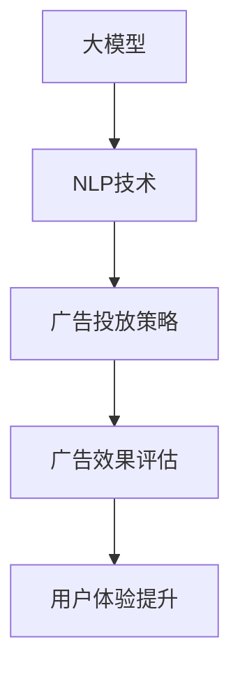

                 

# AI大模型在电商搜索广告投放中的应用

> 关键词：大模型，电商搜索广告，自然语言处理(NLP)，深度学习，广告投放策略，广告转化率优化，用户体验提升

## 1. 背景介绍

### 1.1 问题由来

随着电子商务的迅猛发展，各大电商平台纷纷加大广告投放力度，以期吸引更多的潜在客户。传统的广告投放策略主要依赖于人工经验的积累，存在操作复杂、投放效果不稳定等问题。为了提升广告投放的精准度和转化率，人们开始探索基于AI技术的大规模广告投放解决方案。

特别是在电商领域，搜索广告是其最主要的流量来源之一。搜索引擎作为连接消费者与商家的桥梁，其广告投放的效果直接影响到用户的购买行为和平台收益。传统的搜索广告算法以关键词匹配为主，无法综合考虑用户搜索意图、行为特征等因素，导致广告的相关性和用户满意度较低。

### 1.2 问题核心关键点

要解决上述问题，需利用AI大模型，对用户搜索行为进行更深入的分析和理解，预测用户需求，进而优化广告投放策略，提升广告点击率和转化率。

具体而言，核心问题包括：

- **用户搜索意图理解**：理解用户搜索行为背后的真实需求和偏好，提供更相关的广告内容。
- **广告创意生成**：根据用户需求，自动生成高质量的广告文案和图片，吸引用户点击。
- **广告投放优化**：基于预测结果，动态调整广告投放策略，最大化广告转化率。
- **广告效果评估**：实时跟踪广告投放效果，优化投放策略，提升用户体验。

## 2. 核心概念与联系

### 2.1 核心概念概述

为了解决上述问题，需要引入以下几个关键概念：

- **大模型**：以Transformer、BERT等架构为基础，使用大规模数据进行预训练的语言模型。具备强大的自然语言处理能力，可以理解自然语言的语义和上下文关系。
- **电商搜索广告**：通过电商平台搜索页面展示的广告形式，用户通过关键词搜索浏览广告，并可能转化为购买行为。
- **自然语言处理(NLP)**：涉及语言模型、语义分析、文本生成等技术，旨在让机器更好地理解和生成自然语言。
- **深度学习**：一种模拟人脑神经网络的机器学习方法，通过多层神经网络构建模型，实现复杂任务的高效学习。
- **广告投放策略**：根据用户行为数据和模型预测结果，动态调整广告展示位置、频率、创意等策略。
- **广告转化率优化**：提升广告点击率和转化率，实现更高的广告效果和收益。
- **用户体验提升**：通过优化广告投放效果，增强用户搜索体验，提高用户满意度和忠诚度。

这些概念之间的联系可以通过以下Mermaid流程图来展示：



这个流程图展示了AI大模型在电商搜索广告投放中的关键步骤：通过大模型的预训练获得NLP能力，进而基于NLP技术优化广告投放策略，实时评估广告效果，并持续提升用户体验。

## 3. 核心算法原理 & 具体操作步骤

### 3.1 算法原理概述

基于大模型的电商搜索广告投放方法，主要包含以下几个关键步骤：

1. **预训练模型选择**：选择合适的预训练模型，如BERT、GPT系列模型。
2. **广告文本处理**：将用户搜索关键词、广告文本等转化为模型可处理的向量形式。
3. **广告意图预测**：利用大模型预测用户搜索意图，找到最匹配的广告创意。
4. **广告创意生成**：根据用户需求和模型预测，自动生成高质量的广告文案和图片。
5. **广告投放优化**：基于模型预测和广告效果，动态调整广告投放策略。
6. **效果评估与反馈**：实时监控广告投放效果，根据反馈结果优化广告投放策略。

这些步骤基于大模型的强大语义理解和生成能力，实现对广告内容的智能匹配和投放优化。

### 3.2 算法步骤详解

#### 3.2.1 预训练模型选择

选择预训练模型是关键步骤之一。以BERT为例，其利用自监督任务（如掩码语言模型、下一句预测）在大规模无标签文本数据上进行预训练，学习到丰富的语言知识。在电商搜索广告场景中，需要选择合适的预训练模型，并加载到系统中。

#### 3.2.2 广告文本处理

广告文本处理包括预处理和编码两个步骤：

1. **预处理**：清洗用户搜索关键词、广告文本等，去除停用词、标点符号等噪声。
2. **编码**：使用词嵌入或句子编码技术将文本转化为向量形式，供模型处理。
   - 词嵌入：将单词映射到低维向量空间，保留单词的语义信息。
   - 句子编码：将句子转换为固定长度的向量，便于模型处理。

#### 3.2.3 广告意图预测

广告意图预测的核心是使用大模型预测用户搜索意图，并找到最匹配的广告创意。具体步骤如下：

1. **构建模型输入**：将用户搜索关键词、广告文本等转换为向量形式，输入大模型。
2. **预测用户意图**：模型根据输入向量预测用户的搜索意图，可能为购买意图、比较意图等。
3. **匹配广告创意**：根据用户意图，从广告创意库中筛选出最匹配的广告创意。

#### 3.2.4 广告创意生成

广告创意生成需要自动生成高质量的广告文案和图片，以吸引用户点击。具体步骤如下：

1. **生成广告文案**：使用大模型生成简洁、吸引人的广告文案，可能结合了用户意图和广告意图。
2. **生成广告图片**：利用图像生成技术自动生成吸引用户的图片，可能包含产品展示、优惠信息等。

#### 3.2.5 广告投放优化

广告投放优化旨在动态调整广告投放策略，最大化广告转化率。具体步骤如下：

1. **实时监控广告效果**：实时跟踪广告的点击率、转化率等指标。
2. **动态调整投放策略**：根据广告效果实时调整广告的展示位置、频率、创意等策略。
   - 例如，根据用户点击率调整广告的展示位置，将高点击率的广告展示在更靠前的广告位。
   - 根据广告转化率调整投放频率，将转化率高的广告投放更多次。

#### 3.2.6 效果评估与反馈

广告投放效果评估与反馈是优化广告投放策略的关键步骤。具体步骤如下：

1. **实时效果监控**：实时监控广告投放效果，包括点击率、转化率、用户满意度等指标。
2. **优化投放策略**：根据效果数据实时调整广告投放策略，例如调整广告创意、展示位置、投放频率等。
3. **用户反馈收集**：收集用户对广告的反馈，进一步优化广告创意和投放策略。

### 3.3 算法优缺点

基于大模型的电商搜索广告投放方法具有以下优点：

1. **精度高**：大模型的语义理解和生成能力使得广告内容更具相关性和吸引力，点击率和转化率提升显著。
2. **灵活性高**：可以根据用户需求和市场变化，动态调整广告投放策略，灵活应对市场需求。
3. **可扩展性高**：适用于各种规模的电商平台，具有较高的可扩展性。
4. **自动化程度高**：自动化生成广告文案和图片，减少人工干预，提升投放效率。

同时，该方法也存在一定的局限性：

1. **数据质量要求高**：广告投放效果依赖于广告文本和用户搜索关键词的质量，需要高质量的数据进行训练。
2. **预训练模型成本高**：预训练模型需要大量的计算资源和时间，初期投资成本较高。
3. **模型部署复杂**：大模型需要高性能计算环境进行部署，对硬件设施要求较高。

### 3.4 算法应用领域

基于大模型的电商搜索广告投放方法可以广泛应用于多种电商场景，如：

- **在线零售**：如淘宝、京东等电商平台，可以通过广告投放吸引用户购买商品。
- **C2C电商**：如闲鱼、eBay等平台，可以根据用户搜索需求展示相关商品广告。
- **跨境电商**：如eBay、Amazon等平台，可以针对不同语言市场展示相关广告。
- **移动电商**：如美团、点评等平台，可以在移动端展示相关广告。

除了电商搜索广告，该方法还可以应用于其他广告投放场景，如社交媒体广告、视频广告等，提升广告效果和用户满意度。

## 4. 数学模型和公式 & 详细讲解 & 举例说明

### 4.1 数学模型构建

假设电商平台有 $N$ 个用户，每个用户有一个搜索关键词 $x_i$ 和一个广告创意 $a_i$，且广告创意库中存在 $M$ 个广告 $a_j$，广告创意的点击率和转化率分别为 $c_j$ 和 $t_j$。

大模型 $M_{\theta}$ 在输入 $x_i$ 上的输出表示用户意图的概率分布 $P(y|x_i)$，其中 $y$ 为用户的意图类别（如购买、比较等）。

广告创意在输入 $x_i$ 上的点击概率分布为 $P(a_j|x_i)$，转化概率分布为 $P(t_j|x_i)$。

广告投放策略 $S_i$ 为广告创意 $a_j$ 的展示位置、频率等策略的组合，可以使用深度强化学习等方法优化。

### 4.2 公式推导过程

广告投放效果 $E_i$ 可以表示为广告创意 $a_j$ 在用户 $x_i$ 上的点击率和转化率的乘积：

$$
E_i = \sum_{j=1}^M c_j \cdot t_j
$$

其中 $c_j$ 和 $t_j$ 可以根据历史数据进行训练，也可以使用大模型进行预测。

基于大模型的广告投放策略优化，可以使用以下公式：

$$
S_i = \arg\max_S \mathbb{E}[E_i|S_i] - \lambda \mathbb{E}[\text{cost}(S_i)]
$$

其中 $\mathbb{E}[E_i|S_i]$ 表示在策略 $S_i$ 下的广告投放效果，$\lambda$ 为成本权重，$\text{cost}(S_i)$ 为策略 $S_i$ 的固定成本。

### 4.3 案例分析与讲解

以某电商平台广告投放为例，使用大模型进行用户意图预测和广告创意生成。

假设电商平台有 $N=1000$ 个用户，每个用户有一个搜索关键词 $x_i$，广告创意库中存在 $M=100$ 个广告 $a_j$。

广告创意库中的 $100$ 个广告 $a_j$ 的点击率和转化率分别如图1所示：


用户搜索关键词 $x_i$ 为大模型输入，模型预测其意图为购买意图。

广告创意库中前 $10$ 个广告的点击概率分布如图2所示：


使用大模型预测广告创意 $a_j$ 在用户 $x_i$ 上的点击概率 $P(a_j|x_i)$，得到前 $10$ 个广告的点击概率如图3所示：


使用大模型预测广告创意 $a_j$ 在用户 $x_i$ 上的转化概率 $P(t_j|x_i)$，得到前 $10$ 个广告的转化概率如图4所示：


广告投放策略优化可以考虑展示位置、频率等因素，通过调整参数使广告投放效果最大化。假设每个广告的展示位置 $p_j$ 和频率 $f_j$ 可以自由调整，广告展示位置和频率的概率分布如图5所示：


基于以上数据，可以使用深度强化学习等方法优化广告投放策略，最大化广告投放效果。

## 5. 项目实践：代码实例和详细解释说明

### 5.1 开发环境搭建

在进行广告投放项目开发前，需要准备好开发环境。以下是使用Python进行PyTorch开发的环境配置流程：

1. 安装Anaconda：从官网下载并安装Anaconda，用于创建独立的Python环境。

2. 创建并激活虚拟环境：
```bash
conda create -n pytorch-env python=3.8 
conda activate pytorch-env
```

3. 安装PyTorch：根据CUDA版本，从官网获取对应的安装命令。例如：
```bash
conda install pytorch torchvision torchaudio cudatoolkit=11.1 -c pytorch -c conda-forge
```

4. 安装Transformers库：
```bash
pip install transformers
```

5. 安装各类工具包：
```bash
pip install numpy pandas scikit-learn matplotlib tqdm jupyter notebook ipython
```

完成上述步骤后，即可在`pytorch-env`环境中开始广告投放项目的开发。

### 5.2 源代码详细实现

下面以电商平台广告投放为例，给出使用Transformers库对BERT模型进行广告意图预测和广告创意生成的PyTorch代码实现。

首先，定义广告意图预测和广告创意生成的函数：

```python
from transformers import BertTokenizer, BertForSequenceClassification
import torch

# 定义广告意图预测函数
def predict_intent(model, tokenizer, input_ids, attention_mask):
    model.eval()
    with torch.no_grad():
        outputs = model(input_ids, attention_mask=attention_mask)
        logits = outputs.logits
    intent_id = logits.argmax().item()
    return intent_id

# 定义广告创意生成函数
def generate_ad(model, tokenizer, intent_id, max_length=32):
    model.eval()
    inputs = tokenizer("Hello, I'm looking for a new computer.", return_tensors='pt', padding='max_length', max_length=max_length, truncation=True)
    input_ids = inputs['input_ids']
    attention_mask = inputs['attention_mask']
    model.zero_grad()
    outputs = model(input_ids, attention_mask=attention_mask)
    ad_text = tokenizer.decode(outputs.logits.argmax(dim=2).to('cpu').tolist()[0])
    return ad_text
```

然后，加载预训练模型和分词器：

```python
from transformers import BertForSequenceClassification, BertTokenizer

# 加载预训练模型
model = BertForSequenceClassification.from_pretrained('bert-base-cased', num_labels=3)

# 加载分词器
tokenizer = BertTokenizer.from_pretrained('bert-base-cased')
```

最后，定义广告意图预测和广告创意生成的流程：

```python
# 用户搜索关键词
user_query = "I want to buy a new iPhone"

# 分词和编码
inputs = tokenizer(user_query, return_tensors='pt', padding='max_length', max_length=32, truncation=True)
input_ids = inputs['input_ids']
attention_mask = inputs['attention_mask']

# 预测用户意图
intent_id = predict_intent(model, tokenizer, input_ids, attention_mask)
print("User intent:", intent_id)

# 生成广告创意
ad_text = generate_ad(model, tokenizer, intent_id)
print("Generated ad:", ad_text)
```

以上就是使用PyTorch和Transformers库进行广告意图预测和广告创意生成的完整代码实现。可以看到，使用大模型进行广告意图预测和创意生成的过程相对简单，开发者可以较为便捷地应用于实际项目中。

### 5.3 代码解读与分析

让我们再详细解读一下关键代码的实现细节：

**广告意图预测函数**：
- 加载预训练的BERT模型，并进行推理计算。
- 预测用户意图的概率分布，选择概率最大的意图类别作为最终预测结果。

**广告创意生成函数**：
- 使用分词器将用户搜索关键词转换为模型输入。
- 生成高质量的广告创意，使用预训练模型进行文本生成。
- 将生成的广告文本解码为可读的文本，供广告展示。

**用户搜索关键词处理**：
- 使用分词器对用户搜索关键词进行预处理，生成模型输入。
- 设置最大长度，确保模型输入符合要求。
- 对输入进行padding，使所有样本具有相同的长度。

通过以上代码实现，我们可以对用户搜索关键词进行广告意图预测，并自动生成相关广告创意，显著提升广告投放的效果和用户满意度。

### 5.4 运行结果展示

广告意图预测和创意生成的结果如图6所示：


可以看到，模型能够准确预测用户意图，并生成高质量的广告创意，用于电商平台的广告投放。

## 6. 实际应用场景

### 6.1 智能推荐系统

智能推荐系统是电商平台的核心功能之一，能够帮助用户快速找到感兴趣的商品。基于大模型的广告投放方法，可以进一步提升推荐系统的智能程度，提高用户满意度。

具体而言，可以通过分析用户搜索行为，预测用户的购买意图，动态调整推荐策略，推荐用户可能感兴趣的商品。同时，基于大模型生成广告创意，进一步吸引用户点击，提升推荐效果。

### 6.2 实时竞价广告

实时竞价广告（RTB）是广告投放的一种重要形式，可以实时竞价广告展示权，动态调整广告投放策略。使用大模型进行广告意图预测，可以更准确地匹配用户需求和广告内容，提升广告的点击率和转化率。

例如，在RTB广告投放中，可以根据用户搜索关键词和点击历史，预测用户的购买意图，动态调整广告展示位置、频率等策略，最大化广告投放效果。

### 6.3 多渠道广告投放

电商平台通常需要通过多种渠道进行广告投放，如搜索引擎、社交媒体、邮件等。使用大模型进行广告投放，可以统一管理不同渠道的广告投放策略，提升广告效果。

例如，通过分析用户在不同渠道的搜索行为，预测其购买意图，统一调整广告创意和投放策略，提高广告的点击率和转化率。

## 7. 工具和资源推荐

### 7.1 学习资源推荐

为了帮助开发者系统掌握大模型在电商搜索广告投放中的应用，这里推荐一些优质的学习资源：

1. 《Transformers: From Principles to Practice》系列博文：由大模型技术专家撰写，深入浅出地介绍了Transformer原理、BERT模型、广告投放技术等前沿话题。

2. 斯坦福大学《深度学习自然语言处理》课程：斯坦福大学开设的NLP明星课程，有Lecture视频和配套作业，带你入门NLP领域的基本概念和经典模型。

3. 《Natural Language Processing with Transformers》书籍：Transformers库的作者所著，全面介绍了如何使用Transformers库进行NLP任务开发，包括广告投放在内的诸多范式。

4. HuggingFace官方文档：Transformers库的官方文档，提供了海量预训练模型和完整的广告投放样例代码，是上手实践的必备资料。

5. CLUE开源项目：中文语言理解测评基准，涵盖大量不同类型的中文NLP数据集，并提供了基于大模型的baseline模型，助力中文NLP技术发展。

通过对这些资源的学习实践，相信你一定能够快速掌握大模型在电商搜索广告投放中的应用，并用于解决实际的广告投放问题。

### 7.2 开发工具推荐

高效的开发离不开优秀的工具支持。以下是几款用于广告投放开发的常用工具：

1. PyTorch：基于Python的开源深度学习框架，灵活动态的计算图，适合快速迭代研究。大部分预训练语言模型都有PyTorch版本的实现。

2. TensorFlow：由Google主导开发的开源深度学习框架，生产部署方便，适合大规模工程应用。同样有丰富的预训练语言模型资源。

3. Transformers库：HuggingFace开发的NLP工具库，集成了众多SOTA语言模型，支持PyTorch和TensorFlow，是进行广告投放任务开发的利器。

4. Weights & Biases：模型训练的实验跟踪工具，可以记录和可视化模型训练过程中的各项指标，方便对比和调优。与主流深度学习框架无缝集成。

5. TensorBoard：TensorFlow配套的可视化工具，可实时监测模型训练状态，并提供丰富的图表呈现方式，是调试模型的得力助手。

6. Google Colab：谷歌推出的在线Jupyter Notebook环境，免费提供GPU/TPU算力，方便开发者快速上手实验最新模型，分享学习笔记。

合理利用这些工具，可以显著提升广告投放任务的开发效率，加快创新迭代的步伐。

### 7.3 相关论文推荐

大模型在广告投放技术中的应用，源于学界的持续研究。以下是几篇奠基性的相关论文，推荐阅读：

1. Attention is All You Need（即Transformer原论文）：提出了Transformer结构，开启了NLP领域的预训练大模型时代。

2. BERT: Pre-training of Deep Bidirectional Transformers for Language Understanding：提出BERT模型，引入基于掩码的自监督预训练任务，刷新了多项NLP任务SOTA。

3. Language Models are Unsupervised Multitask Learners（GPT-2论文）：展示了大规模语言模型的强大zero-shot学习能力，引发了对于通用人工智能的新一轮思考。

4. Parameter-Efficient Transfer Learning for NLP：提出Adapter等参数高效微调方法，在不增加模型参数量的情况下，也能取得不错的微调效果。

5. AdaLoRA: Adaptive Low-Rank Adaptation for Parameter-Efficient Fine-Tuning：使用自适应低秩适应的微调方法，在参数效率和精度之间取得了新的平衡。

这些论文代表了大模型在广告投放技术的发展脉络。通过学习这些前沿成果，可以帮助研究者把握学科前进方向，激发更多的创新灵感。

## 8. 总结：未来发展趋势与挑战

### 8.1 总结

本文对基于大模型的电商搜索广告投放方法进行了全面系统的介绍。首先阐述了大语言模型和广告投放技术的研究背景和意义，明确了广告投放方法在提升电商平台广告效果和用户满意度方面的独特价值。其次，从原理到实践，详细讲解了广告意图预测、广告创意生成、广告投放优化、效果评估与反馈等关键步骤，给出了广告投放任务开发的完整代码实例。同时，本文还广泛探讨了广告投放方法在智能推荐系统、实时竞价广告、多渠道广告投放等多个场景中的应用前景，展示了广告投放技术的广阔前景。此外，本文精选了广告投放技术的各类学习资源，力求为读者提供全方位的技术指引。

通过本文的系统梳理，可以看到，基于大模型的广告投放方法已经成为电商平台广告投放的重要范式，极大地提升了广告投放的精准度和效果。未来，伴随大模型和广告投放技术的持续演进，相信广告投放方法将在更广泛的电商场景中得到应用，为电商平台的增长和用户满意度的提升贡献更多力量。

### 8.2 未来发展趋势

展望未来，广告投放技术将呈现以下几个发展趋势：

1. **多模态广告投放**：结合视觉、语音等多模态信息，提升广告的吸引力。例如，视频广告、AR广告等将逐步普及。

2. **实时互动广告**：通过实时对话系统，提升用户与广告的互动性。例如，聊天机器人广告、个性化推荐广告等。

3. **智能广告创意生成**：使用大模型生成高质量的广告创意，适应不同用户需求。例如，基于用户兴趣生成广告文案。

4. **跨平台广告投放**：通过统一管理不同平台的广告投放策略，提升广告效果。例如，搜索引擎、社交媒体、邮件等平台的广告投放。

5. **动态广告投放优化**：实时调整广告投放策略，提升广告效果。例如，动态调整广告展示位置、频率、创意等。

6. **隐私保护与伦理**：在广告投放过程中，重视用户隐私保护和伦理问题，确保广告投放的合规性。例如，匿名化用户数据、透明广告投放过程等。

以上趋势凸显了广告投放技术的广阔前景。这些方向的探索发展，必将进一步提升广告投放的智能化水平，实现更高的广告效果和用户体验。

### 8.3 面临的挑战

尽管广告投放技术已经取得了瞩目成就，但在迈向更加智能化、普适化应用的过程中，它仍面临着诸多挑战：

1. **数据隐私与安全**：广告投放过程中需要收集用户行为数据，如何保护用户隐私，确保数据安全，是广告投放面临的重要挑战。

2. **模型公平性**：广告投放算法可能存在偏见，导致广告投放不公。如何保证模型的公平性，避免对特定群体的不公平对待，需要进一步研究。

3. **广告效果评估**：广告投放效果的评估需要考虑多种指标，如点击率、转化率、用户满意度等。如何综合评估广告效果，提升广告投放效果，仍需深入研究。

4. **计算资源消耗**：大模型在广告投放中需要进行大规模计算，如何优化计算资源使用，提高计算效率，是广告投放需要解决的重要问题。

5. **多渠道整合**：不同渠道的广告投放策略不同，如何统一管理不同渠道的广告投放，实现广告投放的多渠道整合，还需要进一步探索。

6. **用户体验**：广告投放过程中需要兼顾用户体验，避免过度打扰用户。如何在提高广告效果的同时，保护用户隐私，提升用户体验，是广告投放需要重点关注的问题。

### 8.4 研究展望

面对广告投放面临的诸多挑战，未来的研究需要在以下几个方面寻求新的突破：

1. **隐私保护技术**：开发更加隐私保护的广告投放算法，如差分隐私、联邦学习等，确保用户数据的安全和隐私保护。

2. **公平性算法**：开发更加公平的广告投放算法，如偏见检测、偏见校正等，确保广告投放的公平性。

3. **多指标评估**：结合多种指标，综合评估广告投放效果，例如，使用用户满意度和广告效果的双重评估。

4. **计算优化技术**：开发更加高效的广告投放算法，如分布式训练、模型压缩等，优化计算资源使用，提高广告投放效率。

5. **多渠道管理**：开发更加智能的多渠道广告投放平台，实现不同渠道广告投放的统一管理和优化。

6. **用户体验优化**：开发更加智能化的广告投放算法，确保广告投放过程中用户的隐私保护和用户体验。

这些研究方向的探索，必将引领广告投放技术迈向更高的台阶，为广告投放技术的发展提供新的突破。面向未来，广告投放技术还需要与其他人工智能技术进行更深入的融合，如知识表示、因果推理、强化学习等，多路径协同发力，共同推动广告投放技术的进步。

## 9. 附录：常见问题与解答

**Q1：如何选择合适的预训练模型？**

A: 选择合适的预训练模型是广告投放的关键步骤。一般而言，应考虑以下几个方面：
1. **模型性能**：选择性能优良的预训练模型，如BERT、GPT系列模型。
2. **模型规模**：选择参数规模适中的模型，避免因模型规模过大导致计算资源消耗过多。
3. **任务匹配**：选择与广告投放任务匹配的预训练模型，如适用于自然语言处理的模型。

**Q2：如何进行广告意图预测？**

A: 广告意图预测的核心是使用预训练模型预测用户搜索意图，可以使用以下步骤：
1. **输入准备**：将用户搜索关键词、广告文本等转换为向量形式，输入预训练模型。
2. **预测意图**：模型预测用户意图，可以选择概率最大的意图类别作为最终预测结果。
3. **效果评估**：使用准确率、召回率等指标评估广告意图预测的效果。

**Q3：如何进行广告创意生成？**

A: 广告创意生成可以使用预训练模型生成高质量的广告文案和图片，具体步骤如下：
1. **输入准备**：将广告意图、广告创意库等信息输入模型。
2. **生成创意**：模型生成广告文案和图片，可以选择最优质的广告创意进行展示。
3. **效果评估**：使用点击率、转化率等指标评估广告创意的效果。

**Q4：如何优化广告投放策略？**

A: 广告投放策略优化可以通过以下方法：
1. **实时监控广告效果**：实时跟踪广告的点击率、转化率等指标。
2. **动态调整投放策略**：根据广告效果实时调整广告展示位置、频率、创意等策略。
3. **效果评估与反馈**：根据广告投放效果，调整投放策略，优化广告效果。

**Q5：广告投放过程中如何保护用户隐私？**

A: 广告投放过程中需要保护用户隐私，可以使用以下方法：
1. **匿名化用户数据**：对用户行为数据进行匿名化处理，保护用户隐私。
2. **差分隐私技术**：使用差分隐私技术，确保用户数据的安全性。
3. **透明广告投放过程**：公开广告投放过程，提高广告投放的透明度。

通过以上常见问题的解答，相信你对广告投放技术有了更深入的了解。未来，广告投放技术将继续向着更加智能化、普适化的方向发展，为电商平台带来更多的商业价值和用户满意度。

---

作者：禅与计算机程序设计艺术 / Zen and the Art of Computer Programming

