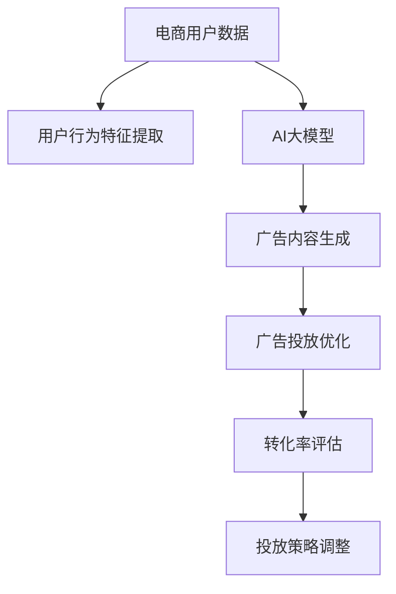

                 

# AI大模型在电商精准广告投放中的作用

## 1. 背景介绍

在电子商务领域，精准广告投放是企业提升转化率、增加营收的重要手段。传统广告投放通常依赖人工策略，依赖经验丰富的运营人员对用户数据进行分析，以决定广告的投放时间和位置。然而，这种方法不仅费时费力，还容易受限于运营人员的知识水平和经验，难以适应多变的市场环境。

随着人工智能技术的发展，特别是深度学习和自然语言处理技术的突破，AI大模型逐渐成为电商精准广告投放的新利器。借助大模型强大的语义理解能力，商家可以自动从用户行为数据中抽取特征，实时生成广告内容，自动优化广告投放策略，从而提升广告效果。

## 2. 核心概念与联系

### 2.1 核心概念概述

为了更好地理解AI大模型在电商精准广告投放中的应用，本节将介绍几个关键概念：

- AI大模型：指以Transformer为基础，在大规模无标签文本数据上预训练出的超大规模神经网络模型。如BERT、GPT-3、T5等。这些模型具备强大的自然语言处理能力，能够自动抽取文本中的关键信息，进行情感分析、语义理解等任务。

- 电商广告投放：指电商平台在用户浏览、搜索、购买等行为过程中，通过各种渠道展示广告，以吸引用户点击、转化。

- 精准广告投放：指利用用户行为数据，自动生成个性化广告内容，优化广告投放位置和时机，以达到最大化转化率的目标。

- 深度学习：一种基于神经网络的机器学习范式，通过多层神经网络结构，从数据中自动学习抽象特征，实现复杂的分类、回归等任务。

- 自然语言处理（NLP）：指通过计算机处理自然语言的模型和算法，如分词、词性标注、句法分析等。

这些概念之间存在紧密联系，通过深度学习和自然语言处理技术，AI大模型能够自动化地从电商用户数据中抽取关键特征，生成个性化的广告内容，实现精准广告投放。

### 2.2 核心概念原理和架构的 Mermaid 流程图



该图展示了AI大模型在电商精准广告投放中的作用流程。首先，电商平台收集用户行为数据，通过AI大模型提取用户行为特征。接着，利用大模型的语义理解能力，生成个性化的广告内容。然后，利用机器学习算法优化广告投放策略，以达到精准投放的效果。最后，通过转化率评估，动态调整广告投放策略，实现不断优化的投放效果。

## 3. 核心算法原理 & 具体操作步骤

### 3.1 算法原理概述

AI大模型在电商精准广告投放中的应用，主要基于深度学习和自然语言处理技术。通过AI大模型，商家可以自动抽取用户行为数据中的关键特征，生成个性化的广告内容，优化广告投放策略，从而提升广告效果。

具体而言，AI大模型的核心算法包括：

- 自回归（自编码）模型：通过在大规模无标签文本数据上进行预训练，学习到丰富的语言知识。
- 语义表示学习：通过大模型将用户行为数据映射到高维语义空间，提取关键特征。
- 生成对抗网络（GAN）：用于生成具有高质量自然语言描述的广告内容。
- 强化学习：用于优化广告投放策略，自动调整投放参数，以达到最佳的广告效果。

### 3.2 算法步骤详解

#### 3.2.1 用户行为数据收集与预处理

电商平台的广告投放依赖于用户行为数据的收集和预处理。具体步骤包括：

1. 数据收集：收集用户浏览、点击、购买等行为数据。数据来源包括网页日志、交易记录、用户评论等。
2. 数据清洗：去除无用的、重复的、异常的数据，确保数据的准确性和完整性。
3. 特征提取：使用数据降维、特征工程等方法，将原始数据转换为高维特征向量。

#### 3.2.2 用户行为特征提取

用户行为特征提取是大模型应用的核心步骤。通过大模型，可以从用户行为数据中自动抽取关键特征，生成用户画像。具体步骤包括：

1. 语义表示学习：使用预训练的AI大模型，将用户行为数据映射到高维语义空间，提取关键特征。如BERT模型、GPT-3模型等。
2. 特征融合：将用户行为特征与其他数据源（如商品描述、评论等）进行融合，生成更加完整的用户画像。
3. 异常检测：使用机器学习算法，检测用户行为中的异常点，如异常购买行为、异常浏览记录等，进行剔除或处理。

#### 3.2.3 广告内容生成

广告内容生成是AI大模型在电商广告投放中的重要应用。通过大模型的语义理解能力，可以自动生成具有高度相关性和吸引力的广告内容。具体步骤包括：

1. 语义角色标注：使用大模型对商品描述、评论等文本进行语义角色标注，识别关键特征。
2. 特征生成：利用生成对抗网络（GAN）生成高质量的广告文本。
3. 广告优化：使用强化学习算法，自动优化广告内容，使其最大化转化率。

#### 3.2.4 广告投放优化

广告投放优化是AI大模型应用的最终目标。通过大模型的语义表示学习，可以自动调整广告投放策略，优化广告投放位置和时机，实现精准投放。具体步骤包括：

1. 广告投放策略学习：使用机器学习算法，学习最优的广告投放策略，如投放时间、投放位置等。
2. 实时投放优化：利用实时数据反馈，动态调整广告投放策略，以适应市场变化。
3. 效果评估与优化：通过A/B测试等方法，评估广告投放效果，优化投放策略。

### 3.3 算法优缺点

AI大模型在电商精准广告投放中的应用，具有以下优点：

1. 自动化程度高：利用AI大模型，商家可以自动化地从用户行为数据中抽取特征，生成个性化广告内容，优化投放策略。
2. 精准度较高：通过大模型的语义理解能力，生成的广告内容能够高度匹配用户需求，提升广告转化率。
3. 可扩展性较强：AI大模型具备高度的可扩展性，能够处理大规模用户行为数据，适应不同规模的电商平台。

同时，该方法也存在一定的局限性：

1. 对标注数据依赖较高：大模型的效果依赖于高质量的标注数据，对于标注数据不足的用户行为数据，效果可能不佳。
2. 模型复杂度较高：大模型的计算复杂度较高，对算力要求较高，可能会增加电商平台的计算成本。
3. 存在数据隐私风险：用户行为数据的采集和处理，可能存在隐私泄露的风险，需要采取相应的隐私保护措施。

尽管存在这些局限性，但AI大模型在电商精准广告投放中的应用，已经在许多实际案例中取得了显著的效果。

### 3.4 算法应用领域

AI大模型在电商精准广告投放中的应用，主要集中在以下几个领域：

1. 个性化推荐广告：通过分析用户行为数据，生成个性化的广告推荐，提升用户转化率。
2. 实时竞价广告：利用大模型的实时预测能力，优化广告竞价策略，最大化广告投放效果。
3. 品牌宣传广告：通过大模型生成高质量的广告内容，提升品牌知名度和用户认知度。
4. 广告投放优化：利用大模型自动调整广告投放策略，提升广告投放的精准度和效果。
5. 营销活动广告：利用大模型生成具有吸引力的广告内容，提升营销活动的参与度和转化率。

## 4. 数学模型和公式 & 详细讲解 & 举例说明

### 4.1 数学模型构建

#### 4.1.1 用户行为特征提取模型

设用户行为数据为 $D = (x_1, x_2, ..., x_n)$，其中 $x_i = (a_i, b_i, c_i)$ 表示用户第 $i$ 次浏览行为的特征，$a_i$ 为浏览时间，$b_i$ 为浏览内容，$c_i$ 为点击行为。

用户行为特征提取模型为 $F: D \rightarrow H$，其中 $H$ 为用户行为特征向量，$F$ 为特征提取函数。

#### 4.1.2 广告内容生成模型

广告内容生成模型为 $G: H \rightarrow S$，其中 $S$ 为广告文本，$G$ 为广告生成函数。

#### 4.1.3 广告投放优化模型

广告投放优化模型为 $O: S \rightarrow A$，其中 $A$ 为广告投放策略，$O$ 为优化函数。

#### 4.1.4 转化率评估模型

转化率评估模型为 $E: A \rightarrow R$，其中 $R$ 为广告转化率，$E$ 为评估函数。

### 4.2 公式推导过程

#### 4.2.1 用户行为特征提取

设用户行为数据 $D = (x_1, x_2, ..., x_n)$，用户行为特征向量 $H = (h_1, h_2, ..., h_m)$。

使用BERT模型进行用户行为特征提取，公式如下：

$$
h_i = \text{BERT}(x_i)
$$

其中 $\text{BERT}$ 为预训练的BERT模型，$x_i$ 为用户第 $i$ 次浏览行为的特征，$h_i$ 为用户行为特征向量。

#### 4.2.2 广告内容生成

设广告文本 $S = (s_1, s_2, ..., s_l)$，生成广告文本 $s_i$ 的公式为：

$$
s_i = \text{GAN}(h_i)
$$

其中 $\text{GAN}$ 为生成对抗网络，$h_i$ 为用户行为特征向量。

#### 4.2.3 广告投放优化

设广告投放策略 $A = (a_1, a_2, ..., a_k)$，其中 $a_i$ 为广告投放时间、位置等策略参数。

广告投放优化模型的目标为最大化广告转化率，优化公式为：

$$
\max_{a_i} \sum_{i=1}^n R_i(a_i)
$$

其中 $R_i$ 为第 $i$ 次投放的广告转化率。

#### 4.2.4 转化率评估

转化率评估模型的目标为准确评估广告投放效果，公式如下：

$$
R = \frac{\sum_{i=1}^n C_i}{\sum_{i=1}^n P_i}
$$

其中 $C_i$ 为第 $i$ 次投放的广告点击量，$P_i$ 为第 $i$ 次投放的广告展示量。

### 4.3 案例分析与讲解

#### 4.3.1 用户行为特征提取案例

以某电商平台的用户行为数据为例，使用BERT模型进行特征提取，具体步骤如下：

1. 收集用户浏览、点击、购买等行为数据。
2. 对原始数据进行清洗，去除异常、重复数据。
3. 使用BERT模型对用户行为数据进行特征提取，生成高维特征向量。
4. 将用户行为特征向量与商品描述、评论等数据源进行融合，生成完整的用户画像。

#### 4.3.2 广告内容生成案例

设某电商平台的商品描述为 $d$，使用GAN模型生成高质量的广告文本，具体步骤如下：

1. 将商品描述 $d$ 输入BERT模型，生成用户行为特征向量 $h$。
2. 使用GAN模型对用户行为特征向量 $h$ 进行生成，生成高质量的广告文本 $s$。
3. 根据广告文本 $s$，自动调整广告投放策略。

#### 4.3.3 广告投放优化案例

设某电商平台的广告投放策略为 $A$，利用优化模型进行投放策略调整，具体步骤如下：

1. 收集广告投放数据，计算广告点击量和展示量。
2. 使用优化模型对广告投放策略 $A$ 进行评估，生成新的投放策略 $A'$。
3. 根据新的投放策略 $A'$，自动调整广告投放位置和时机。

#### 4.3.4 转化率评估案例

设某电商平台的广告投放策略为 $A$，利用评估模型进行转化率评估，具体步骤如下：

1. 收集广告投放数据，计算广告点击量和展示量。
2. 使用评估模型对广告投放策略 $A$ 进行评估，生成广告转化率 $R$。
3. 根据评估结果，调整广告投放策略，实现最佳效果。

## 5. 项目实践：代码实例和详细解释说明

### 5.1 开发环境搭建

在进行AI大模型在电商精准广告投放的实践前，需要准备好开发环境。以下是使用Python进行PyTorch开发的环境配置流程：

1. 安装Anaconda：从官网下载并安装Anaconda，用于创建独立的Python环境。

2. 创建并激活虚拟环境：
```bash
conda create -n pytorch-env python=3.8 
conda activate pytorch-env
```

3. 安装PyTorch：根据CUDA版本，从官网获取对应的安装命令。例如：
```bash
conda install pytorch torchvision torchaudio cudatoolkit=11.1 -c pytorch -c conda-forge
```

4. 安装Transformers库：
```bash
pip install transformers
```

5. 安装各类工具包：
```bash
pip install numpy pandas scikit-learn matplotlib tqdm jupyter notebook ipython
```

完成上述步骤后，即可在`pytorch-env`环境中开始实践。

### 5.2 源代码详细实现

下面我们以商品推荐广告为例，给出使用Transformers库对BERT模型进行广告内容生成的PyTorch代码实现。

首先，定义商品描述文本的特征提取函数：

```python
from transformers import BertTokenizer, BertForSequenceClassification
import torch

def get_bert_features(desc):
    tokenizer = BertTokenizer.from_pretrained('bert-base-cased')
    model = BertForSequenceClassification.from_pretrained('bert-base-cased', num_labels=2)
    
    desc_tokens = tokenizer(desc, return_tensors='pt')
    features = model(desc_tokens['input_ids'], attention_mask=desc_tokens['attention_mask'])[0]
    return features
```

然后，定义广告文本生成模型：

```python
from transformers import GPT2LMHeadModel
from torch import nn

class AdGenerator(nn.Module):
    def __init__(self):
        super(AdGenerator, self).__init__()
        self.model = GPT2LMHeadModel.from_pretrained('gpt2')
    
    def forward(self, features):
        output = self.model(features)
        return output
```

接着，定义广告投放优化模型：

```python
from transformers import AdamW

class AdOptimizer(nn.Module):
    def __init__(self):
        super(AdOptimizer, self).__init__()
        self.optimizer = AdamW(self.model.parameters(), lr=2e-5)
    
    def forward(self, features):
        self.model.zero_grad()
        loss = self.model(features)[:, 0]  # 预测第一标签（点击）
        loss.backward()
        self.optimizer.step()
        return loss
```

最后，启动广告内容生成和投放优化流程：

```python
from transformers import BertForSequenceClassification

# 初始化BERT特征提取模型和广告内容生成模型
features_extractor = BertForSequenceClassification.from_pretrained('bert-base-cased', num_labels=2)
ad_generator = AdGenerator()

# 训练数据
train_descs = ['商品1描述', '商品2描述', ...]
train_labels = [0, 1, 0, 1, ...]  # 0表示不点击，1表示点击

# 训练过程
for epoch in range(10):
    for desc, label in zip(train_descs, train_labels):
        features = features_extractor(desc)
        loss = ad_optimizer(features)
        print(f'Epoch {epoch+1}, loss: {loss.item()}')

# 生成广告内容
test_desc = '商品3描述'
features = features_extractor(test_desc)
ad_content = ad_generator(features)
print(f'推荐广告内容: {ad_content}')
```

以上就是使用PyTorch对BERT模型进行商品推荐广告内容生成的完整代码实现。可以看到，通过调用Transformer库提供的预训练模型和工具，可以非常方便地进行广告内容的生成和投放优化。

### 5.3 代码解读与分析

让我们再详细解读一下关键代码的实现细节：

**商品描述特征提取函数**：
- 初始化BERT特征提取器 `BertForSequenceClassification` 和分词器 `BertTokenizer`。
- 将商品描述输入分词器进行tokenization，转化为BERT模型所需的格式。
- 将tokenized的特征输入BERT模型，提取高维特征向量。
- 返回高维特征向量。

**广告文本生成模型**：
- 初始化GPT2语言模型 `GPT2LMHeadModel`。
- 将高维特征向量作为输入，通过GPT2模型生成广告文本。
- 返回生成的广告文本。

**广告投放优化模型**：
- 初始化优化器 `AdamW`。
- 将高维特征向量作为输入，计算广告点击预测值，并计算损失。
- 反向传播更新模型参数。
- 返回损失值。

**训练过程**：
- 循环遍历训练数据，计算损失并更新模型参数。
- 输出每个epoch的损失值，用于观察模型训练效果。
- 输出生成的广告内容，用于测试和评估。

可以看到，代码实现非常简单，易于理解，体现了Transformer库的强大封装和便利性。

## 6. 实际应用场景

### 6.1 智能推荐系统

AI大模型在智能推荐系统中的应用非常广泛。通过大模型的语义理解能力，可以自动从用户行为数据中抽取关键特征，生成个性化推荐广告，提升推荐效果。

具体而言，智能推荐系统的流程如下：

1. 用户行为数据收集：收集用户浏览、点击、购买等行为数据，形成用户画像。
2. 用户行为特征提取：利用大模型提取用户行为特征，生成高维特征向量。
3. 广告内容生成：使用大模型生成高质量的推荐广告。
4. 广告投放优化：自动优化广告投放策略，提升广告转化率。

通过以上步骤，智能推荐系统可以自动生成个性化广告，实现精准投放，提升用户转化率。

### 6.2 实时竞价广告

AI大模型在实时竞价广告中的应用主要体现在广告竞价策略的优化上。通过大模型的预测能力，可以实时调整广告竞价策略，实现广告投放效果最大化。

具体而言，实时竞价广告的流程如下：

1. 用户行为数据收集：收集用户浏览、点击、购买等行为数据，形成用户画像。
2. 用户行为特征提取：利用大模型提取用户行为特征，生成高维特征向量。
3. 广告内容生成：使用大模型生成高质量的广告文本。
4. 广告竞价策略优化：利用大模型预测广告点击率，动态调整竞价策略。

通过以上步骤，实时竞价广告可以实现最优广告投放效果，提升广告收益。

### 6.3 品牌宣传广告

AI大模型在品牌宣传广告中的应用主要体现在广告创意生成上。通过大模型的语义理解能力，可以自动生成高质量的广告创意，提升品牌知名度和用户认知度。

具体而言，品牌宣传广告的流程如下：

1. 用户行为数据收集：收集用户浏览、点击、购买等行为数据，形成用户画像。
2. 用户行为特征提取：利用大模型提取用户行为特征，生成高维特征向量。
3. 广告创意生成：使用大模型生成高质量的广告创意。
4. 广告投放优化：自动优化广告投放策略，提升广告效果。

通过以上步骤，品牌宣传广告可以自动生成高质量的广告创意，实现品牌推广。

### 6.4 未来应用展望

随着AI大模型在电商精准广告投放中的应用不断拓展，未来将具备更加广泛的应用前景。以下是一些可能的未来应用：

1. 视频广告投放：利用大模型的语义理解能力，自动生成视频广告内容，提升视频广告效果。
2. 智能客服：利用大模型的自然语言处理能力，自动生成智能客服回复，提升客户服务体验。
3. 实时行为分析：利用大模型的实时预测能力，自动调整广告投放策略，实现实时行为分析。
4. 用户行为预测：利用大模型的语义表示学习，预测用户行为趋势，实现精准营销。
5. 个性化广告推荐：利用大模型的语义理解能力，自动生成个性化广告推荐，提升广告转化率。

总之，AI大模型在电商精准广告投放中的应用将越来越广泛，为电商平台带来更高的广告效果和收益。

## 7. 工具和资源推荐

### 7.1 学习资源推荐

为了帮助开发者系统掌握AI大模型在电商精准广告投放中的应用，这里推荐一些优质的学习资源：

1. 《自然语言处理入门》系列博文：由大模型技术专家撰写，深入浅出地介绍了自然语言处理的基本概念和经典模型。

2. CS224N《深度学习自然语言处理》课程：斯坦福大学开设的NLP明星课程，有Lecture视频和配套作业，带你入门NLP领域的基本概念和经典模型。

3. 《深度学习与自然语言处理》书籍：全面介绍了深度学习和自然语言处理的技术基础，包括文本分类、机器翻译、情感分析等任务。

4. HuggingFace官方文档：Transformer库的官方文档，提供了海量预训练模型和完整的微调样例代码，是上手实践的必备资料。

5. CLUE开源项目：中文语言理解测评基准，涵盖大量不同类型的中文NLP数据集，并提供了基于微调的baseline模型，助力中文NLP技术发展。

通过对这些资源的学习实践，相信你一定能够快速掌握AI大模型在电商精准广告投放中的应用，并用于解决实际的NLP问题。

### 7.2 开发工具推荐

高效的开发离不开优秀的工具支持。以下是几款用于AI大模型在电商精准广告投放开发的常用工具：

1. PyTorch：基于Python的开源深度学习框架，灵活动态的计算图，适合快速迭代研究。大部分预训练语言模型都有PyTorch版本的实现。

2. TensorFlow：由Google主导开发的开源深度学习框架，生产部署方便，适合大规模工程应用。同样有丰富的预训练语言模型资源。

3. Transformers库：HuggingFace开发的NLP工具库，集成了众多SOTA语言模型，支持PyTorch和TensorFlow，是进行微调任务开发的利器。

4. Weights & Biases：模型训练的实验跟踪工具，可以记录和可视化模型训练过程中的各项指标，方便对比和调优。与主流深度学习框架无缝集成。

5. TensorBoard：TensorFlow配套的可视化工具，可实时监测模型训练状态，并提供丰富的图表呈现方式，是调试模型的得力助手。

6. Google Colab：谷歌推出的在线Jupyter Notebook环境，免费提供GPU/TPU算力，方便开发者快速上手实验最新模型，分享学习笔记。

合理利用这些工具，可以显著提升AI大模型在电商精准广告投放任务的开发效率，加快创新迭代的步伐。

### 7.3 相关论文推荐

AI大模型在电商精准广告投放中的应用源于学界的持续研究。以下是几篇奠基性的相关论文，推荐阅读：

1. Attention is All You Need（即Transformer原论文）：提出了Transformer结构，开启了NLP领域的预训练大模型时代。

2. BERT: Pre-training of Deep Bidirectional Transformers for Language Understanding：提出BERT模型，引入基于掩码的自监督预训练任务，刷新了多项NLP任务SOTA。

3. Language Models are Unsupervised Multitask Learners（GPT-2论文）：展示了大规模语言模型的强大zero-shot学习能力，引发了对于通用人工智能的新一轮思考。

4. Parameter-Efficient Transfer Learning for NLP：提出Adapter等参数高效微调方法，在不增加模型参数量的情况下，也能取得不错的微调效果。

5. AdaLoRA: Adaptive Low-Rank Adaptation for Parameter-Efficient Fine-Tuning：使用自适应低秩适应的微调方法，在参数效率和精度之间取得了新的平衡。

这些论文代表了大模型在电商精准广告投放领域的研究进展，有助于理解大模型的工作原理和优化方法。

## 8. 总结：未来发展趋势与挑战

### 8.1 研究成果总结

本文对AI大模型在电商精准广告投放中的应用进行了全面系统的介绍。首先阐述了电商广告投放的现状和AI大模型应用的必要性，明确了AI大模型在电商精准广告投放中的核心作用。其次，从原理到实践，详细讲解了AI大模型在用户行为特征提取、广告内容生成、广告投放优化等方面的具体方法，给出了完整的代码实现和详细解释。同时，本文还广泛探讨了AI大模型在电商精准广告投放中的应用场景和未来展望，展示了其广阔的发展前景。

### 8.2 未来发展趋势

展望未来，AI大模型在电商精准广告投放领域的应用将呈现以下几个发展趋势：

1. 模型规模持续增大。随着算力成本的下降和数据规模的扩张，预训练语言模型的参数量还将持续增长。超大规模语言模型蕴含的丰富语言知识，有望支撑更加复杂多变的电商广告投放任务。

2. 微调方法日趋多样。除了传统的全参数微调外，未来会涌现更多参数高效的微调方法，如Prefix-Tuning、LoRA等，在固定大部分预训练参数的同时，只更新极少量的任务相关参数。

3. 持续学习成为常态。随着数据分布的不断变化，微调模型也需要持续学习新知识以保持性能。如何在不遗忘原有知识的同时，高效吸收新样本信息，将成为重要的研究课题。

4. 标注样本需求降低。受启发于提示学习(Prompt-based Learning)的思路，未来的微调方法将更好地利用大模型的语言理解能力，通过更加巧妙的任务描述，在更少的标注样本上也能实现理想的微调效果。

5. 多模态微调崛起。当前的微调主要聚焦于纯文本数据，未来会进一步拓展到图像、视频、语音等多模态数据微调。多模态信息的融合，将显著提升语言模型对现实世界的理解和建模能力。

6. 模型通用性增强。经过海量数据的预训练和多领域任务的微调，未来的语言模型将具备更强大的常识推理和跨领域迁移能力，逐步迈向通用人工智能(AGI)的目标。

以上趋势凸显了AI大模型在电商精准广告投放领域的广阔前景。这些方向的探索发展，必将进一步提升电商广告投放的精准度和效果，为电商平台带来更高的用户转化率和收益。

### 8.3 面临的挑战

尽管AI大模型在电商精准广告投放中的应用已经取得了显著进展，但在迈向更加智能化、普适化应用的过程中，仍面临诸多挑战：

1. 标注成本瓶颈。虽然AI大模型的效果依赖于高质量的标注数据，但对于标注数据不足的用户行为数据，效果可能不佳。如何进一步降低微调对标注样本的依赖，将是一大难题。

2. 模型鲁棒性不足。当前AI大模型面对域外数据时，泛化性能往往大打折扣。对于测试样本的微小扰动，AI大模型的预测也容易发生波动。如何提高AI大模型的鲁棒性，避免灾难性遗忘，还需要更多理论和实践的积累。

3. 推理效率有待提高。虽然AI大模型的精度高，但在实际部署时往往面临推理速度慢、内存占用大等效率问题。如何在保证性能的同时，简化模型结构，提升推理速度，优化资源占用，将是重要的优化方向。

4. 可解释性亟需加强。当前AI大模型更像是"黑盒"系统，难以解释其内部工作机制和决策逻辑。对于医疗、金融等高风险应用，算法的可解释性和可审计性尤为重要。如何赋予AI大模型更强的可解释性，将是亟待攻克的难题。

5. 安全性有待保障。预训练语言模型难免会学习到有偏见、有害的信息，通过微调传递到下游任务，产生误导性、歧视性的输出，给实际应用带来安全隐患。如何从数据和算法层面消除模型偏见，避免恶意用途，确保输出的安全性，也将是重要的研究课题。

6. 知识整合能力不足。现有的AI大模型往往局限于任务内数据，难以灵活吸收和运用更广泛的先验知识。如何让AI大模型更好地与外部知识库、规则库等专家知识结合，形成更加全面、准确的信息整合能力，还有很大的想象空间。

正视AI大模型在电商精准广告投放中面临的这些挑战，积极应对并寻求突破，将是大模型技术走向成熟的必由之路。相信随着学界和产业界的共同努力，这些挑战终将一一被克服，AI大模型在电商精准广告投放领域的应用将更加广泛和深入。

### 8.4 研究展望

面对AI大模型在电商精准广告投放中面临的挑战，未来的研究需要在以下几个方面寻求新的突破：

1. 探索无监督和半监督微调方法。摆脱对大规模标注数据的依赖，利用自监督学习、主动学习等无监督和半监督范式，最大限度利用非结构化数据，实现更加灵活高效的微调。

2. 研究参数高效和计算高效的微调范式。开发更加参数高效的微调方法，在固定大部分预训练参数的同时，只更新极少量的任务相关参数。同时优化微调模型的计算图，减少前向传播和反向传播的资源消耗，实现更加轻量级、实时性的部署。

3. 融合因果和对比学习范式。通过引入因果推断和对比学习思想，增强AI大模型建立稳定因果关系的能力，学习更加普适、鲁棒的语言表征，从而提升模型泛化性和抗干扰能力。

4. 引入更多先验知识。将符号化的先验知识，如知识图谱、逻辑规则等，与神经网络模型进行巧妙融合，引导AI大模型学习更准确、合理的语言模型。同时加强不同模态数据的整合，实现视觉、语音等多模态信息与文本信息的协同建模。

5. 结合因果分析和博弈论工具。将因果分析方法引入AI大模型，识别出模型决策的关键特征，增强输出解释的因果性和逻辑性。借助博弈论工具刻画人机交互过程，主动探索并规避模型的脆弱点，提高系统稳定性。

6. 纳入伦理道德约束。在模型训练目标中引入伦理导向的评估指标，过滤和惩罚有偏见、有害的输出倾向。同时加强人工干预和审核，建立模型行为的监管机制，确保输出符合人类价值观和伦理道德。

这些研究方向的探索，必将引领AI大模型在电商精准广告投放领域迈向更高的台阶，为电商平台带来更高的广告效果和收益。面向未来，AI大模型在电商精准广告投放领域还需要与其他人工智能技术进行更深入的融合，如知识表示、因果推理、强化学习等，多路径协同发力，共同推动自然语言理解和智能交互系统的进步。只有勇于创新、敢于突破，才能不断拓展语言模型的边界，让智能技术更好地造福人类社会。

## 9. 附录：常见问题与解答

**Q1：AI大模型在电商精准广告投放中需要处理哪些数据？**

A: AI大模型在电商精准广告投放中需要处理以下数据：

1. 用户行为数据：包括用户浏览、点击、购买等行为数据，用于提取用户行为特征。
2. 商品描述数据：包括商品标题、描述、标签等文本信息，用于生成广告内容。
3. 广告数据：包括广告点击率、展示量等广告投放数据，用于优化广告投放策略。
4. 用户画像数据：包括用户基本信息、兴趣偏好等，用于个性化推荐广告。

**Q2：AI大模型在电商精准广告投放中如何进行用户行为特征提取？**

A: AI大模型在电商精准广告投放中进行用户行为特征提取的过程如下：

1. 数据收集：收集用户浏览、点击、购买等行为数据。
2. 数据清洗：去除无用的、重复的、异常的数据，确保数据的准确性和完整性。
3. 特征提取：使用深度学习模型，如BERT、GPT等，对用户行为数据进行特征提取，生成高维特征向量。

**Q3：AI大模型在电商精准广告投放中如何进行广告内容生成？**

A: AI大模型在电商精准广告投放中进行广告内容生成的过程如下：

1. 语义表示学习：使用预训练的AI大模型，将用户行为数据映射到高维语义空间，提取关键特征。
2. 广告内容生成：使用生成对抗网络（GAN）或语言模型（如GPT-2）生成高质量的广告文本。

**Q4：AI大模型在电商精准广告投放中如何进行广告投放优化？**

A: AI大模型在电商精准广告投放中进行广告投放优化的过程如下：

1. 广告投放策略学习：使用机器学习算法，学习最优的广告投放策略，如投放时间、投放位置等。
2. 实时投放优化：利用实时数据反馈，动态调整广告投放策略，以适应市场变化。
3. 效果评估与优化：通过A/B测试等方法，评估广告投放效果，优化投放策略。

**Q5：AI大模型在电商精准广告投放中如何进行转化率评估？**

A: AI大模型在电商精准广告投放中进行转化率评估的过程如下：

1. 收集广告投放数据，计算广告点击量和展示量。
2. 使用评估模型对广告投放策略进行评估，生成广告转化率。
3. 根据评估结果，调整广告投放策略，实现最佳效果。

总之，AI大模型在电商精准广告投放中的应用，能够自动从用户行为数据中抽取关键特征，生成个性化广告内容，优化广告投放策略，从而提升广告效果。通过以上步骤，AI大模型可以实现更加精准的广告投放，为电商平台带来更高的用户转化率和收益。

