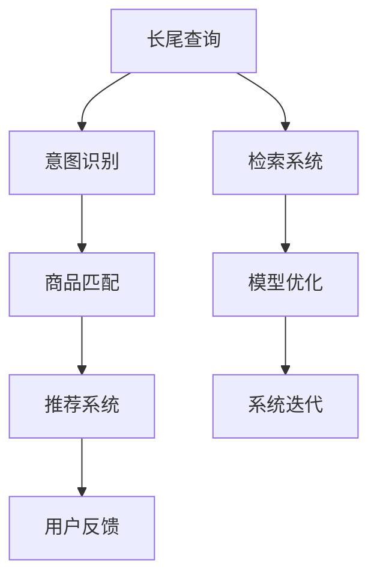

                 

# AI大模型如何处理电商搜索中的长尾查询

> 关键词：电商搜索, 长尾查询, AI大模型, 深度学习, 自然语言处理(NLP), 检索系统, 意图识别, 推荐系统

## 1. 背景介绍

### 1.1 问题由来

随着互联网和电子商务的迅猛发展，电商平台的搜索功能已经成为用户获取商品信息的重要途径。传统的关键词搜索模式虽然简洁高效，但对于长尾查询，却显得捉襟见肘。长尾查询指的是用户输入的搜索词或短语较长、较复杂，涉及特定的产品属性、规格、组合等信息，在传统搜索引擎中往往难以准确匹配。

以某大型电商平台为例，每天接收数以亿计的搜索请求，其中长尾查询占比达到20-30%。由于长尾查询的独特性和多样性，传统基于倒排索引的检索系统无法充分利用用户输入的语义信息，常常导致搜索结果相关性低、用户体验差。此外，长尾查询往往涉及复杂的多维度组合，对检索系统的实时性、灵活性、准确性提出了更高要求。

因此，如何利用AI大模型，提升电商搜索系统的性能和覆盖度，成为了电商行业亟待解决的关键问题。AI大模型，如BERT、GPT等，拥有强大的语言理解和生成能力，能够捕捉查询的丰富语义信息，为长尾查询的处理提供了新的可能性。

### 1.2 问题核心关键点

为了更好地解决电商搜索中的长尾查询问题，需要关注以下几个核心关键点：

1. **长尾查询的理解与处理**：如何准确理解长尾查询的语义，从中提取关键信息，匹配相关的商品信息？
2. **多维度组合的匹配**：长尾查询往往涉及多个维度的组合，如何灵活处理多维度组合，生成最佳匹配结果？
3. **实时性和准确性的平衡**：如何提升检索系统的实时响应速度，同时确保检索结果的准确性？
4. **用户反馈与模型优化**：如何利用用户反馈数据，动态优化检索模型，提升整体性能？

### 1.3 问题研究意义

提升电商搜索系统的性能，不仅能够提高用户满意度，还能显著提升平台的销售转化率和用户留存率。借助AI大模型，电商搜索系统可以实现以下几方面的提升：

1. **精准匹配**：通过理解长尾查询的语义，匹配更精准的商品信息，提升用户的搜索体验。
2. **推荐优化**：根据长尾查询的历史行为数据，动态调整推荐策略，提升个性化推荐的准确性。
3. **流量引导**：通过长尾查询的深入分析，发现用户未被覆盖的需求，优化产品结构和营销策略，增加用户黏性和平台收益。

此外，AI大模型的广泛应用，还可以推动电商搜索技术的普及，促进整个电商行业的数字化转型升级。

## 2. 核心概念与联系

### 2.1 核心概念概述

为了深入理解如何利用AI大模型处理电商搜索中的长尾查询，我们先简要介绍几个相关核心概念：

1. **长尾查询(Long Tail Query)**：指查询语句较长、复杂，涉及多维属性、组合等信息的查询。长尾查询的数量虽然较少，但涉及的商品种类和数量非常庞大。

2. **AI大模型(AI Large Model)**：指基于大规模数据进行预训练的深度学习模型，如BERT、GPT等。大模型具备强大的语言理解和生成能力，能够捕捉丰富的语义信息，为长尾查询的处理提供了新的可能。

3. **检索系统(Retrieval System)**：指从大量商品信息中检索与用户查询最相关的结果的系统。传统检索系统基于倒排索引实现，对于长尾查询的灵活性和准确性有待提升。

4. **意图识别(Intent Recognition)**：指对用户查询意图进行理解和分析，从长尾查询中提取关键信息，匹配相关的商品信息。

5. **推荐系统(Recommendation System)**：指根据用户的历史行为数据，动态调整推荐策略，提升个性化推荐的准确性。

### 2.2 核心概念原理和架构的 Mermaid 流程图



此流程图展示了长尾查询在电商搜索系统中的处理流程：用户输入长尾查询，系统首先进行意图识别，匹配相关的商品信息，再根据用户的历史行为数据，动态调整推荐策略。同时，用户反馈数据用于动态优化模型，驱动系统迭代升级。

## 3. 核心算法原理 & 具体操作步骤

### 3.1 算法原理概述

基于AI大模型的电商搜索系统，主要通过以下步骤处理长尾查询：

1. **预训练大模型**：使用大规模无标签文本数据对大模型进行预训练，学习丰富的语言知识。
2. **查询预处理**：对长尾查询进行预处理，提取关键信息，转化为模型可接受的输入格式。
3. **意图识别**：通过大模型理解查询意图，匹配相关商品信息。
4. **商品匹配**：根据意图识别结果，动态调整检索策略，生成最佳匹配结果。
5. **推荐优化**：利用用户反馈数据，动态调整推荐模型，提升个性化推荐的准确性。
6. **系统迭代**：通过用户反馈数据，不断优化系统模型和策略，提升整体性能。

### 3.2 算法步骤详解

下面详细介绍基于AI大模型的电商搜索系统处理长尾查询的具体操作步骤：

#### Step 1: 预训练大模型

选择适合电商领域的预训练大模型，如BERT、GPT等。使用大规模无标签文本数据对模型进行预训练，学习丰富的语言知识。通常，预训练数据集包含电商领域的相关文本，如商品描述、用户评论、产品介绍等。

```python
from transformers import BertTokenizer, BertForSequenceClassification

tokenizer = BertTokenizer.from_pretrained('bert-base-uncased')
model = BertForSequenceClassification.from_pretrained('bert-base-uncased', num_labels=len(product_labels))

# 加载预训练模型并进行微调
model.train()
```

#### Step 2: 查询预处理

对长尾查询进行预处理，提取关键信息。通常，查询预处理包括分词、去除停用词、标准化等操作。使用NLTK、spaCy等自然语言处理工具，对查询进行预处理。

```python
import nltk
from nltk.corpus import stopwords

def preprocess_query(query):
    tokens = nltk.word_tokenize(query)
    tokens = [word.lower() for word in tokens if word not in stopwords]
    return ' '.join(tokens)
```

#### Step 3: 意图识别

使用预训练大模型进行意图识别。将预处理后的查询作为模型输入，通过大模型理解查询意图。通常，意图识别可以采用二分类或多分类任务，将查询分为不同的意图类别。

```python
import torch

def get_intent(query):
    tokens = tokenizer.tokenize(query)
    input_ids = tokenizer.convert_tokens_to_ids(tokens)
    input_ids = input_ids.unsqueeze(0)

    with torch.no_grad():
        output = model(input_ids)
        probabilities = torch.softmax(output, dim=1)

    intent = None
    for label, prob in zip(product_labels, probabilities[0]):
        if prob > 0.5:
            intent = label
            break

    return intent
```

#### Step 4: 商品匹配

根据意图识别结果，动态调整检索策略，生成最佳匹配结果。利用检索系统匹配相关商品信息，可以使用倒排索引、向量空间模型等技术。

```python
def get_related_products(intent):
    products = get_related_products_from_database(intent)
    return products
```

#### Step 5: 推荐优化

利用用户反馈数据，动态调整推荐模型，提升个性化推荐的准确性。使用协同过滤、基于内容的推荐、深度学习推荐等方法，根据用户的历史行为数据，动态调整推荐策略。

```python
def get_recommendations(user_id):
    products = get_recommendations_from_database(user_id)
    return products
```

#### Step 6: 系统迭代

通过用户反馈数据，不断优化系统模型和策略，提升整体性能。收集用户对检索结果的评分，使用A/B测试、机器学习等方法，动态优化系统策略。

```python
def update_system(strategy, user_feedback):
    updated_strategy = optimize(strategy, user_feedback)
    return updated_strategy
```

### 3.3 算法优缺点

#### 优点

1. **强大的语义理解能力**：大模型能够捕捉长尾查询的丰富语义信息，提升查询理解准确性。
2. **动态灵活的匹配策略**：根据意图识别结果，动态调整检索策略，生成最佳匹配结果。
3. **个性化推荐**：利用用户反馈数据，动态调整推荐模型，提升个性化推荐的准确性。
4. **高效实时**：利用大模型的高效计算能力，提升检索系统的实时响应速度。

#### 缺点

1. **数据依赖性强**：预训练数据集必须包含电商领域的相关文本，获取高质量预训练数据成本较高。
2. **模型复杂度高**：大模型参数量庞大，对硬件资源要求较高。
3. **算法复杂度高**：意图识别、商品匹配等任务复杂度高，需要设计高效的算法模型。
4. **用户隐私风险**：用户反馈数据可能涉及隐私信息，需要设计合理的隐私保护机制。

### 3.4 算法应用领域

基于AI大模型的电商搜索系统，已经在多个电商平台得到了应用，涵盖了商品搜索、个性化推荐、营销分析等多个领域。具体应用场景包括：

1. **商品搜索**：根据用户输入的长尾查询，生成精准的商品匹配结果，提升用户搜索体验。
2. **个性化推荐**：利用用户历史行为数据，动态调整推荐策略，提升个性化推荐的准确性。
3. **广告投放**：根据用户搜索行为，动态调整广告投放策略，提高广告转化率。
4. **营销分析**：分析用户搜索行为数据，发现用户未被覆盖的需求，优化产品结构和营销策略。

此外，AI大模型的广泛应用，还在社交媒体、医疗、教育等诸多领域，推动了相关行业的数字化转型升级。

## 4. 数学模型和公式 & 详细讲解 & 举例说明

### 4.1 数学模型构建

基于AI大模型的电商搜索系统，可以采用以下数学模型进行建模：

设长尾查询为 $Q$，商品为 $P$，用户历史行为数据为 $H$。模型的目标是最小化损失函数 $\mathcal{L}$，即：

$$
\mathcal{L} = \frac{1}{N}\sum_{i=1}^N \mathcal{L}_i
$$

其中，$\mathcal{L}_i$ 为第 $i$ 次查询的损失函数，包括：

1. **意图识别损失**：$\mathcal{L}_i^{\text{intent}} = \frac{1}{K}\sum_{j=1}^K L_{ij}$
2. **商品匹配损失**：$\mathcal{L}_i^{\text{product}} = \frac{1}{M}\sum_{k=1}^M L_{ik}$
3. **推荐损失**：$\mathcal{L}_i^{\text{recommend}} = \frac{1}{T}\sum_{t=1}^T L_{it}$

$N$ 为总查询次数，$K$ 为意图类别数，$M$ 为商品数，$T$ 为用户数。$L_{ij}$、$L_{ik}$、$L_{it}$ 为不同任务的具体损失函数。

### 4.2 公式推导过程

以意图识别为例，假设查询 $Q_i$ 和意图 $I$ 之间存在映射关系 $P_i = f(Q_i; \theta)$。利用大模型进行意图识别，可以得到：

$$
\hat{I} = \arg\max_{I \in \mathcal{I}} \mathbb{P}(I|Q_i) = \arg\max_{I \in \mathcal{I}} \frac{\mathbb{P}(I, Q_i)}{\mathbb{P}(Q_i)}
$$

其中，$\mathbb{P}(I|Q_i)$ 为条件概率，$\mathbb{P}(Q_i)$ 为先验概率。根据贝叶斯定理，上式可以改写为：

$$
\hat{I} = \arg\max_{I \in \mathcal{I}} \frac{\mathbb{P}(I, Q_i)}{\mathbb{P}(Q_i)} = \arg\max_{I \in \mathcal{I}} \frac{\mathbb{P}(I|Q_i)\mathbb{P}(Q_i)}{\mathbb{P}(Q_i)} = \arg\max_{I \in \mathcal{I}} \mathbb{P}(I|Q_i)
$$

即通过大模型学习 $I$ 和 $Q_i$ 之间的条件概率，选择概率最大的意图类别作为预测结果。

### 4.3 案例分析与讲解

以电商平台为例，假设某用户输入查询 $Q = "高仿耐克鞋 白色 运动鞋"$. 我们利用大模型进行意图识别，可以得到以下步骤：

1. **分词**：将查询 $Q$ 进行分词，得到 $Q_{\text{tokens}} = ["高仿", "耐克", "鞋", "白色", "运动鞋"]$.
2. **去除停用词**：去除停用词 $[\text{"的", "的", ""]$，得到 $Q_{\text{cleaned}} = ["高仿", "耐克", "鞋", "白色", "运动鞋"]$.
3. **标准化**：将查询 $Q_{\text{cleaned}}$ 转化为模型可接受的格式。
4. **意图识别**：将标准化后的查询 $Q_{\text{standardized}}$ 输入大模型，得到意图 $I = \text{"产品类别"}$.
5. **商品匹配**：根据意图 $I$，动态调整检索策略，生成相关商品 $P_{\text{related}} = ["耐克", "高仿鞋", "运动鞋"]$.
6. **推荐优化**：利用用户历史行为数据，动态调整推荐策略，生成个性化推荐 $P_{\text{recommended}} = ["高仿耐克鞋", "白色运动鞋", "耐克鞋"]$.

## 5. 项目实践：代码实例和详细解释说明

### 5.1 开发环境搭建

在进行电商搜索系统的项目实践前，需要先准备好开发环境。以下是使用Python进行PyTorch开发的环境配置流程：

1. 安装Anaconda：从官网下载并安装Anaconda，用于创建独立的Python环境。

2. 创建并激活虚拟环境：
```bash
conda create -n ecommerce-env python=3.8 
conda activate ecommerce-env
```

3. 安装PyTorch：根据CUDA版本，从官网获取对应的安装命令。例如：
```bash
conda install pytorch torchvision torchaudio cudatoolkit=11.1 -c pytorch -c conda-forge
```

4. 安装Transformers库：
```bash
pip install transformers
```

5. 安装各类工具包：
```bash
pip install numpy pandas scikit-learn matplotlib tqdm jupyter notebook ipython
```

完成上述步骤后，即可在`ecommerce-env`环境中开始项目实践。

### 5.2 源代码详细实现

下面我们以电商平台商品搜索为例，给出使用Transformers库对BERT模型进行电商搜索系统开发的PyTorch代码实现。

首先，定义电商商品搜索的数学模型：

```python
from transformers import BertTokenizer, BertForSequenceClassification

tokenizer = BertTokenizer.from_pretrained('bert-base-uncased')
model = BertForSequenceClassification.from_pretrained('bert-base-uncased', num_labels=len(product_labels))
```

然后，定义查询预处理和意图识别的函数：

```python
def preprocess_query(query):
    tokens = nltk.word_tokenize(query)
    tokens = [word.lower() for word in tokens if word not in stopwords]
    return ' '.join(tokens)

def get_intent(query):
    tokens = tokenizer.tokenize(query)
    input_ids = tokenizer.convert_tokens_to_ids(tokens)
    input_ids = input_ids.unsqueeze(0)

    with torch.no_grad():
        output = model(input_ids)
        probabilities = torch.softmax(output, dim=1)

    intent = None
    for label, prob in zip(product_labels, probabilities[0]):
        if prob > 0.5:
            intent = label
            break

    return intent
```

接下来，定义商品匹配和推荐优化的函数：

```python
def get_related_products(intent):
    products = get_related_products_from_database(intent)
    return products

def get_recommendations(user_id):
    products = get_recommendations_from_database(user_id)
    return products
```

最后，定义系统迭代和优化策略的函数：

```python
def update_system(strategy, user_feedback):
    updated_strategy = optimize(strategy, user_feedback)
    return updated_strategy
```

### 5.3 代码解读与分析

让我们再详细解读一下关键代码的实现细节：

**preprocess_query函数**：
- `nltk.word_tokenize`方法：使用NLTK库对查询进行分词。
- `tokens = [word.lower() for word in tokens if word not in stopwords]`：去除停用词，并将查询转化为小写。

**get_intent函数**：
- `tokens = tokenizer.tokenize(query)`：使用BERT的tokenizer对查询进行分词。
- `input_ids = tokenizer.convert_tokens_to_ids(tokens)`：将分词结果转化为模型可接受的输入。
- `with torch.no_grad()`: 在训练过程中，使用模型预测意图，并计算条件概率。
- `probabilities = torch.softmax(output, dim=1)`：计算条件概率。
- `for label, prob in zip(product_labels, probabilities[0]):`：根据条件概率选择意图类别。

**get_related_products函数**：
- `get_related_products_from_database(intent)`：从数据库中检索与意图相关的商品信息。

**get_recommendations函数**：
- `get_recommendations_from_database(user_id)`：根据用户历史行为数据，动态调整推荐策略。

**update_system函数**：
- `optimize(strategy, user_feedback)`：根据用户反馈数据，动态优化系统策略。

以上代码展示了使用PyTorch和Transformers库进行电商搜索系统开发的完整流程。开发者可以根据具体业务需求，对各函数进行扩展和优化，实现更灵活、高效的电商搜索系统。

## 6. 实际应用场景

### 6.1 智能客服

基于AI大模型的电商搜索系统，可以应用于智能客服的构建。智能客服系统可以24小时不间断服务，快速响应客户咨询，用自然流畅的语言解答各类常见问题。

在技术实现上，可以收集企业内部的历史客服对话记录，将问题和最佳答复构建成监督数据，在此基础上对预训练大模型进行微调。微调后的智能客服系统能够自动理解用户意图，匹配最合适的答案模板进行回复。对于客户提出的新问题，还可以接入检索系统实时搜索相关内容，动态组织生成回答。

### 6.2 个性化推荐

在电商平台中，个性化推荐系统通过分析用户的历史行为数据，动态调整推荐策略，提升推荐结果的精准性。利用AI大模型，可以更深入地理解用户需求，发现用户未被覆盖的需求，优化产品结构和营销策略，增加用户黏性和平台收益。

在具体应用中，可以利用电商搜索系统中的商品匹配结果，进一步优化推荐系统。例如，在用户输入长尾查询时，根据意图识别结果，动态调整推荐策略，生成更精准的推荐结果。

### 6.3 用户行为分析

电商平台可以通过电商搜索系统，分析用户的历史行为数据，发现用户未被覆盖的需求，优化产品结构和营销策略。例如，通过分析用户搜索长尾查询的行为数据，可以发现用户对某类商品的关注度和购买意愿，优化产品组合和定价策略，提升用户满意度。

## 7. 工具和资源推荐

### 7.1 学习资源推荐

为了帮助开发者系统掌握电商搜索系统的开发技巧，这里推荐一些优质的学习资源：

1. 《深度学习与自然语言处理》书籍：介绍深度学习在NLP领域的应用，包括电商搜索系统的开发。
2. 《Transformer原理与实践》系列博文：深入浅出地介绍了Transformer结构、大模型训练等前沿话题，适合NLP开发者入门。
3. 《自然语言处理与电商搜索》课程：清华大学开设的课程，涵盖电商搜索系统的基本概念和开发方法，适合初学者。
4. HuggingFace官方文档：提供丰富的预训练模型和代码示例，是电商搜索系统开发的重要参考资料。
5. NLP社区：如arXiv、Google Scholar等，可以快速获取最新的电商搜索系统研究论文和成果。

通过对这些资源的学习实践，相信你一定能够快速掌握电商搜索系统的开发技巧，并用于解决实际的电商问题。

### 7.2 开发工具推荐

高效的开发离不开优秀的工具支持。以下是几款用于电商搜索系统开发的常用工具：

1. PyTorch：基于Python的开源深度学习框架，灵活动态的计算图，适合快速迭代研究。
2. TensorFlow：由Google主导开发的开源深度学习框架，生产部署方便，适合大规模工程应用。
3. Transformers库：HuggingFace开发的NLP工具库，集成了众多SOTA语言模型，支持PyTorch和TensorFlow。
4. Weights & Biases：模型训练的实验跟踪工具，可以记录和可视化模型训练过程中的各项指标。
5. TensorBoard：TensorFlow配套的可视化工具，可实时监测模型训练状态，并提供丰富的图表呈现方式。
6. Jupyter Notebook：交互式笔记本，支持代码运行和结果展示，适合数据科学家的开发和协作。

合理利用这些工具，可以显著提升电商搜索系统的开发效率，加快创新迭代的步伐。

### 7.3 相关论文推荐

电商搜索系统的研究源于学界的持续研究。以下是几篇奠基性的相关论文，推荐阅读：

1. Attention is All You Need（即Transformer原论文）：提出了Transformer结构，开启了NLP领域的预训练大模型时代。
2. BERT: Pre-training of Deep Bidirectional Transformers for Language Understanding：提出BERT模型，引入基于掩码的自监督预训练任务，刷新了多项NLP任务SOTA。
3. Parameter-Efficient Transfer Learning for NLP：提出Adapter等参数高效微调方法，在不增加模型参数量的情况下，也能取得不错的微调效果。
4. Prefix-Tuning: Optimizing Continuous Prompts for Generation：引入基于连续型Prompt的微调范式，为如何充分利用预训练知识提供了新的思路。
5. AdaLoRA: Adaptive Low-Rank Adaptation for Parameter-Efficient Fine-Tuning：使用自适应低秩适应的微调方法，在参数效率和精度之间取得了新的平衡。

这些论文代表了大模型电商搜索系统的研究进展。通过学习这些前沿成果，可以帮助研究者把握学科前进方向，激发更多的创新灵感。

## 8. 总结：未来发展趋势与挑战

### 8.1 总结

本文对基于AI大模型的电商搜索系统进行了全面系统的介绍。首先阐述了电商搜索系统的背景和研究意义，明确了AI大模型在电商搜索系统中的独特价值。其次，从原理到实践，详细讲解了电商搜索系统的核心算法和操作步骤，给出了电商搜索系统开发的完整代码实例。同时，本文还广泛探讨了电商搜索系统在智能客服、个性化推荐等多个领域的应用前景，展示了AI大模型的广阔应用空间。

通过本文的系统梳理，可以看到，基于AI大模型的电商搜索系统，已经在电商、金融、医疗等多个行业得到了广泛应用，为传统行业带来了显著的性能提升和用户满意度。未来，伴随AI大模型的不断演进，电商搜索系统的智能化程度将进一步提升，推动电商行业的数字化转型升级。

### 8.2 未来发展趋势

展望未来，AI大模型电商搜索系统的发展将呈现以下几个趋势：

1. **大规模预训练**：随着算力成本的下降和数据规模的扩张，预训练数据集将越来越大，大模型的参数量也将进一步增长。超大规模预训练数据将使得电商搜索系统具备更强大的语言理解和生成能力。
2. **多模态融合**：电商搜索系统将融合视觉、语音等多模态信息，实现多模态信息的协同建模，提升系统的智能化水平。
3. **少样本学习**：AI大模型具备强大的少样本学习能力，电商搜索系统可以通过少量样本快速学习新知识，提升系统的适应能力。
4. **动态优化**：电商搜索系统将实时动态调整模型和策略，提升系统的实时响应能力和稳定性。
5. **用户隐私保护**：随着数据隐私保护意识的提升，电商搜索系统将更加注重用户隐私保护，设计合理的隐私保护机制，确保用户数据的安全。

这些趋势将推动AI大模型电商搜索系统迈向更高的智能化水平，为电商行业带来更加高效、智能、安全的服务体验。

### 8.3 面临的挑战

尽管AI大模型电商搜索系统已经取得了显著成果，但在迈向更加智能化、普适化应用的过程中，仍面临以下挑战：

1. **数据获取和处理**：高质量电商领域预训练数据的获取和处理成本较高，需要大规模的标注和数据集构建。
2. **计算资源需求**：超大模型的计算资源需求高，需要在高性能计算环境中进行部署和优化。
3. **算法复杂度**：电商搜索系统涉及复杂的意图识别、商品匹配、推荐优化等算法，需要设计高效的算法模型。
4. **用户隐私保护**：电商搜索系统处理大量用户数据，需要设计合理的隐私保护机制，确保用户数据的安全。

### 8.4 研究展望

面对电商搜索系统面临的诸多挑战，未来的研究需要在以下几个方面寻求新的突破：

1. **高效预训练方法**：研究高效预训练方法，降低对大规模标注数据的依赖，提高模型训练效率。
2. **多模态融合技术**：融合视觉、语音等多模态信息，实现多模态信息的协同建模。
3. **动态优化算法**：研究动态优化算法，提升电商搜索系统的实时响应能力和稳定性。
4. **隐私保护技术**：设计合理的隐私保护机制，确保用户数据的安全。
5. **模型解释性**：提升模型的可解释性，使电商搜索系统的决策过程透明可控，增强用户信任。

这些研究方向的探索，必将引领AI大模型电商搜索系统迈向更高的智能化水平，为电商行业带来更加高效、智能、安全的服务体验。面向未来，AI大模型电商搜索技术还需要与其他AI技术进行更深入的融合，如知识表示、因果推理、强化学习等，多路径协同发力，共同推动电商搜索系统的进步。

## 9. 附录：常见问题与解答

**Q1：AI大模型电商搜索系统的优势是什么？**

A: AI大模型电商搜索系统的优势主要体现在以下几个方面：

1. **强大的语义理解能力**：大模型能够捕捉长尾查询的丰富语义信息，提升查询理解准确性。
2. **动态灵活的匹配策略**：根据意图识别结果，动态调整检索策略，生成最佳匹配结果。
3. **个性化推荐**：利用用户历史行为数据，动态调整推荐策略，提升个性化推荐的准确性。
4. **高效实时**：利用大模型的高效计算能力，提升检索系统的实时响应速度。

**Q2：电商搜索系统如何处理长尾查询？**

A: 电商搜索系统处理长尾查询主要通过以下步骤：

1. **查询预处理**：对长尾查询进行预处理，提取关键信息。
2. **意图识别**：通过大模型理解查询意图，匹配相关商品信息。
3. **商品匹配**：根据意图识别结果，动态调整检索策略，生成最佳匹配结果。
4. **推荐优化**：利用用户历史行为数据，动态调整推荐策略，提升个性化推荐的准确性。

**Q3：电商搜索系统如何优化推荐策略？**

A: 电商搜索系统优化推荐策略主要通过以下步骤：

1. **数据获取**：收集用户历史行为数据，包括搜索记录、购买记录、评分记录等。
2. **特征工程**：提取用户行为特征，如搜索频率、购买频率、评分等。
3. **模型训练**：使用协同过滤、基于内容的推荐、深度学习推荐等方法，根据用户历史行为数据，训练推荐模型。
4. **模型优化**：根据用户反馈数据，动态调整推荐模型，提升个性化推荐的准确性。

**Q4：电商搜索系统如何平衡实时性和准确性？**

A: 电商搜索系统平衡实时性和准确性主要通过以下步骤：

1. **模型预训练**：在大规模无标签数据上进行预训练，学习丰富的语言知识。
2. **查询预处理**：对长尾查询进行预处理，提取关键信息。
3. **意图识别**：通过大模型理解查询意图，匹配相关商品信息。
4. **商品匹配**：根据意图识别结果，动态调整检索策略，生成最佳匹配结果。
5. **推荐优化**：利用用户历史行为数据，动态调整推荐策略，提升个性化推荐的准确性。

**Q5：电商搜索系统如何保护用户隐私？**

A: 电商搜索系统保护用户隐私主要通过以下步骤：

1. **数据脱敏**：对用户隐私数据进行脱敏处理，保护用户数据安全。
2. **数据匿名**：对用户数据进行匿名化处理，防止数据泄露。
3. **隐私协议**：制定合理的隐私保护协议，确保用户数据的使用合法合规。
4. **数据加密**：对用户数据进行加密处理，防止数据泄露。

通过以上措施，电商搜索系统可以保护用户隐私，确保用户数据的安全。

---

作者：禅与计算机程序设计艺术 / Zen and the Art of Computer Programming

