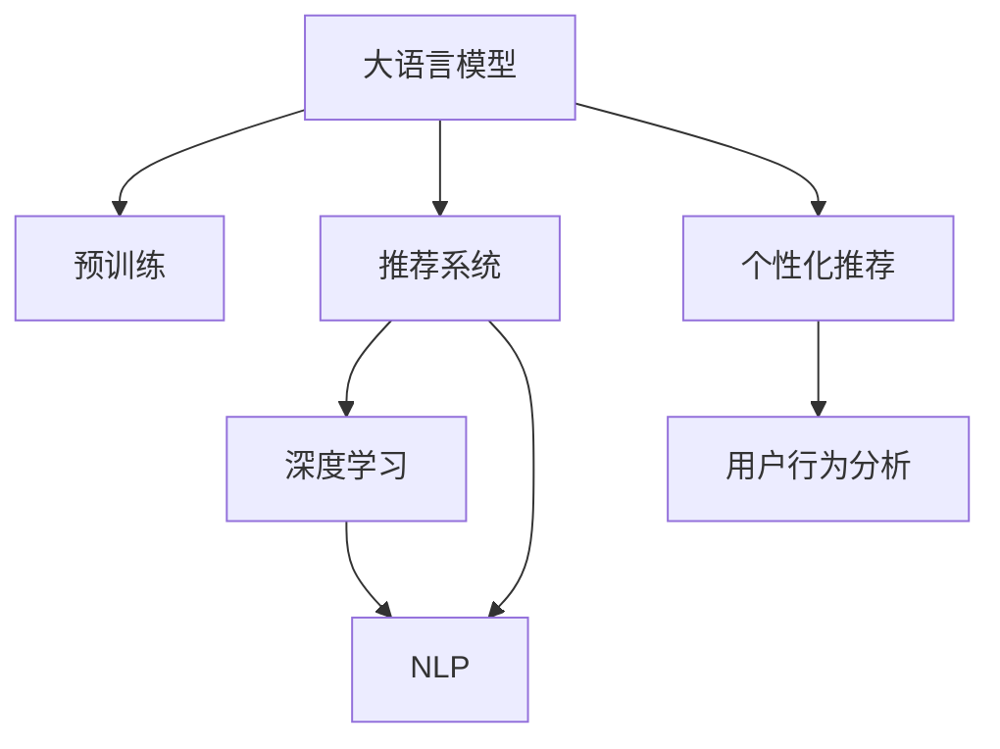

                 

# AI大模型如何提升电商转化率

> 关键词：电商转化率优化, AI大模型, 自然语言处理, 推荐系统, 个性化推荐, 预训练语言模型, 深度学习, 用户行为分析

## 1. 背景介绍

### 1.1 问题由来

随着电子商务市场的不断壮大，电商平台如何提升用户体验，增加用户转化率，成为各大电商平台竞相探索的核心问题。传统的电商推荐系统主要以用户的浏览、购买记录为基础，通过协同过滤、内容推荐等方法提供个性化推荐。但这些方法在面对海量数据时，难以实时、高效地生成个性化推荐。同时，这些系统往往缺乏对用户心理和行为的深入理解，推荐效果难以满足用户的多样化需求。

近年来，随着大语言模型的发展，基于预训练语言模型的推荐系统成为电商转化的新动力。利用大语言模型强大的自然语言处理能力，能够深入理解用户的查询意图、行为特征，通过上下文理解生成更加精准的推荐内容，极大地提升了电商平台的转化率。

### 1.2 问题核心关键点

电商推荐系统的核心在于如何利用用户行为数据，结合上下文信息，生成个性化的推荐结果。其中，利用自然语言处理技术对用户输入的查询进行理解，提取关键信息，是构建高质量推荐模型的关键步骤。大语言模型在这一过程中发挥了重要角色，通过语言模型对用户输入的查询进行语义理解，抽取关键特征，提供更高质量推荐结果。

## 2. 核心概念与联系

### 2.1 核心概念概述

为更好地理解大语言模型在电商转化中的应用，本节将介绍几个密切相关的核心概念：

- 大语言模型(Large Language Model, LLM)：以自回归(如GPT)或自编码(如BERT)模型为代表的大规模预训练语言模型。通过在大规模无标签文本语料上进行预训练，学习通用的语言表示，具备强大的语言理解和生成能力。

- 预训练(Pre-training)：指在大规模无标签文本语料上，通过自监督学习任务训练通用语言模型的过程。常见的预训练任务包括言语建模、遮挡语言模型等。预训练使得模型学习到语言的通用表示。

- 推荐系统(Recommender System)：根据用户历史行为和当前上下文信息，预测用户可能感兴趣的物品，并生成个性化推荐的技术。推荐系统广泛应用于电商、新闻、视频等多个领域。

- 深度学习(Deep Learning)：一种通过多层神经网络实现复杂非线性映射的机器学习方法，广泛应用于图像、语音、自然语言处理等领域。

- 自然语言处理(Natural Language Processing, NLP)：研究如何使计算机理解、解释和生成人类语言的技术。NLP在电商推荐、智能客服、情感分析等场景中均有广泛应用。

- 个性化推荐(Personalized Recommendation)：根据用户特定的需求、兴趣和行为特征，生成个性化推荐结果，提升用户体验和转化率。

- 用户行为分析(User Behavior Analysis)：通过分析用户的搜索、点击、购买等行为数据，理解用户需求，预测用户偏好，生成个性化推荐。

这些核心概念之间的逻辑关系可以通过以下Mermaid流程图来展示：



这个流程图展示了大语言模型与电商推荐系统之间的联系：

1. 大语言模型通过预训练获得基础能力。
2. 电商推荐系统基于大语言模型的语言理解能力，进行用户行为分析，生成个性化推荐。
3. 个性化推荐结合用户行为分析结果，生成高质量推荐结果。
4. 大语言模型和推荐系统共同构成电商转化的核心技术框架。

## 3. 核心算法原理 & 具体操作步骤
### 3.1 算法原理概述

基于大语言模型的电商推荐系统，本质上是一种深度学习驱动的推荐系统。其核心思想是：利用预训练语言模型强大的自然语言处理能力，对用户输入的查询进行语义理解，提取关键特征，结合用户行为数据进行上下文分析，生成个性化推荐结果。

形式化地，假设电商推荐系统接受用户输入的查询 $q$ 和行为数据 $x$，目标是生成最相关的商品 $y$，则推荐模型的目标函数为：

$$
\max_{y} P(y|q,x)
$$

其中 $P$ 为生成概率，表示商品 $y$ 在用户输入查询 $q$ 和行为数据 $x$ 的条件下被推荐出的概率。

为了优化上述目标函数，通常使用基于最大似然估计的优化方法，如极大似然估计（Maximum Likelihood Estimation,MLE）或变分自编码器（Variational Autoencoder,VAE）等。这些方法通过训练模型参数，最大化商品 $y$ 被推荐出的概率，从而提升推荐效果。

### 3.2 算法步骤详解

基于大语言模型的电商推荐系统一般包括以下几个关键步骤：

**Step 1: 准备预训练模型和数据集**
- 选择合适的预训练语言模型 $M_{\theta}$ 作为初始化参数，如 BERT、GPT 等。
- 准备电商推荐系统的数据集，包括用户行为数据和商品数据。常用的数据集有Amazon评论数据、Netflix电影数据等。

**Step 2: 添加任务适配层**
- 根据电商推荐任务的具体需求，设计合适的输出层和损失函数。
- 对于推荐任务，通常使用softmax函数输出商品的推荐概率，并以交叉熵损失函数作为优化目标。

**Step 3: 设置微调超参数**
- 选择合适的优化算法及其参数，如 AdamW、SGD 等，设置学习率、批大小、迭代轮数等。
- 设置正则化技术及强度，包括权重衰减、Dropout、Early Stopping等。
- 确定冻结预训练参数的策略，如仅微调顶层，或全部参数都参与微调。

**Step 4: 执行梯度训练**
- 将电商推荐系统的数据集分批次输入模型，前向传播计算损失函数。
- 反向传播计算参数梯度，根据设定的优化算法和学习率更新模型参数。
- 周期性在验证集上评估模型性能，根据性能指标决定是否触发 Early Stopping。
- 重复上述步骤直到满足预设的迭代轮数或 Early Stopping 条件。

**Step 5: 测试和部署**
- 在测试集上评估微调后模型 $M_{\hat{\theta}}$ 的性能，对比微调前后的推荐效果。
- 使用微调后的模型对新用户输入的查询进行推荐，集成到实际的应用系统中。
- 持续收集新的用户行为数据，定期重新微调模型，以适应数据分布的变化。

以上是基于大语言模型的电商推荐系统的基本流程。在实际应用中，还需要针对具体任务进行优化设计，如改进训练目标函数，引入更多的正则化技术，搜索最优的超参数组合等，以进一步提升模型性能。

### 3.3 算法优缺点

基于大语言模型的电商推荐系统具有以下优点：

- 强大语义理解能力：通过大语言模型强大的自然语言处理能力，能够深度理解用户查询意图，提供精准的推荐结果。
- 模型适应性强：预训练模型在大量通用语料上进行训练，具备较强的泛化能力，适用于多种电商推荐场景。
- 高效推荐生成：利用大语言模型快速生成推荐结果，可以实时响应用户查询，提升用户体验。
- 可解释性强：模型能够通过自然语言生成推荐结果，易于解释和调试。

同时，该方法也存在一些局限性：

- 数据依赖性强：大语言模型的微调需要依赖大量的标注数据，获取标注数据成本较高。
- 模型复杂度高：预训练语言模型参数量庞大，模型训练和推理复杂度较高。
- 实时性要求高：电商推荐系统对实时性要求较高，模型需具备高效的推理能力。
- 数据隐私问题：电商推荐系统需要收集用户行为数据，涉及用户隐私保护问题。

尽管存在这些局限性，但就目前而言，基于大语言模型的推荐系统仍是大规模电商推荐的主要技术范式。未来相关研究的重点在于如何进一步降低数据需求，提高模型实时性，同时兼顾隐私保护等问题。

### 3.4 算法应用领域

基于大语言模型的推荐系统在电商领域已经得到了广泛的应用，覆盖了几乎所有常见的电商推荐场景，例如：

- 商品推荐：根据用户浏览、购买记录，生成个性化商品推荐。
- 跨域推荐：结合用户历史数据和商品标签，推荐跨类别商品。
- 多模态推荐：结合用户画像、商品描述、图像等多模态信息，生成更加全面和精准的推荐。
- 基于上下文推荐：结合用户当前搜索关键词和上下文信息，生成实时推荐。
- 相似商品推荐：推荐与用户已购买商品相似的商品。
- 关联商品推荐：推荐与用户浏览商品关联的推荐商品。

除了上述这些经典场景外，大语言模型推荐系统也被创新性地应用到更多电商推荐中，如可控推荐、广告推荐、视频推荐等，为电商推荐带来了全新的突破。随着预训练语言模型和推荐方法的不断进步，相信电商推荐系统将在更广阔的应用领域大放异彩。

## 4. 数学模型和公式 & 详细讲解  
### 4.1 数学模型构建

本节将使用数学语言对基于大语言模型的电商推荐系统进行更加严格的刻画。

记电商推荐系统输入为 $q$，行为数据为 $x$，输出为推荐商品 $y$。假设推荐模型的参数为 $\theta$，则推荐模型的目标函数为：

$$
\max_{y} P(y|q,x) = \frac{P(y|q,x)}{\sum_{y' \in Y} P(y'|q,x)}
$$

其中 $P(y|q,x)$ 为商品 $y$ 在用户输入查询 $q$ 和行为数据 $x$ 的条件下被推荐出的概率，$\sum_{y' \in Y} P(y'|q,x)$ 为所有可能商品被推荐出的概率和。

### 4.2 公式推导过程

以下我们以二分类任务为例，推导交叉熵损失函数及其梯度的计算公式。

假设模型 $M_{\theta}$ 在输入 $q$ 和行为数据 $x$ 上的输出为 $\hat{y}=M_{\theta}(q,x)$，表示商品 $y$ 在用户输入查询 $q$ 和行为数据 $x$ 的条件下被推荐出的概率。真实标签 $y \in \{0,1\}$。则二分类交叉熵损失函数定义为：

$$
\ell(M_{\theta}(q,x),y) = -[y\log \hat{y} + (1-y)\log (1-\hat{y})]
$$

将其代入目标函数，得：

$$
\max_{y} P(y|q,x) = -\frac{1}{N}\sum_{i=1}^N [y_i\log M_{\theta}(q_i,x_i)+(1-y_i)\log(1-M_{\theta}(q_i,x_i))]
$$

根据链式法则，目标函数对参数 $\theta$ 的梯度为：

$$
\frac{\partial \max_{y} P(y|q,x)}{\partial \theta} = -\frac{1}{N}\sum_{i=1}^N \left[\frac{y_i}{M_{\theta}(q_i,x_i)}-\frac{1-y_i}{1-M_{\theta}(q_i,x_i)}\right] \frac{\partial M_{\theta}(q_i,x_i)}{\partial \theta}
$$

其中 $\frac{\partial M_{\theta}(q_i,x_i)}{\partial \theta}$ 可进一步递归展开，利用自动微分技术完成计算。

在得到目标函数的梯度后，即可带入参数更新公式，完成模型的迭代优化。重复上述过程直至收敛，最终得到适应电商推荐任务的最优模型参数 $\theta^*$。

## 5. 项目实践：代码实例和详细解释说明
### 5.1 开发环境搭建

在进行电商推荐系统开发前，我们需要准备好开发环境。以下是使用Python进行PyTorch开发的环境配置流程：

1. 安装Anaconda：从官网下载并安装Anaconda，用于创建独立的Python环境。

2. 创建并激活虚拟环境：
```bash
conda create -n pytorch-env python=3.8 
conda activate pytorch-env
```

3. 安装PyTorch：根据CUDA版本，从官网获取对应的安装命令。例如：
```bash
conda install pytorch torchvision torchaudio cudatoolkit=11.1 -c pytorch -c conda-forge
```

4. 安装Transformers库：
```bash
pip install transformers
```

5. 安装各类工具包：
```bash
pip install numpy pandas scikit-learn matplotlib tqdm jupyter notebook ipython
```

完成上述步骤后，即可在`pytorch-env`环境中开始电商推荐系统的开发。

### 5.2 源代码详细实现

下面我们以电商推荐系统为例，给出使用Transformers库对BERT模型进行电商推荐系统微调的PyTorch代码实现。

首先，定义电商推荐系统的数据处理函数：

```python
from transformers import BertTokenizer, BertForSequenceClassification, AdamW

tokenizer = BertTokenizer.from_pretrained('bert-base-cased')

def encode_input(query, behavior):
    query = query.lower()
    tokens = tokenizer(query, max_length=64, truncation=True, padding='max_length', return_tensors='pt')
    tokens['input_ids'] = tokens['input_ids'][:, :-1] # 移除[CLS]和[SEP]，只考虑中间部分
    tokens['attention_mask'] = tokens['attention_mask'][:, :-1] # 移除[CLS]和[SEP]，只考虑中间部分
    return tokens

class BERTClassifier(BertForSequenceClassification):
    def __init__(self, num_labels):
        super().__init__.from_pretrained('bert-base-cased', num_labels=num_labels)
    
    def forward(self, input_ids, attention_mask, labels=None):
        outputs = super().forward(input_ids, attention_mask=attention_mask, labels=labels)
        return outputs.logits

# 训练函数
def train_model(model, train_dataset, dev_dataset, epochs, batch_size, learning_rate):
    device = torch.device('cuda' if torch.cuda.is_available() else 'cpu')
    model.to(device)
    
    optimizer = AdamW(model.parameters(), lr=learning_rate)
    
    for epoch in range(epochs):
        model.train()
        for query, behavior in train_dataset:
            input_ids, attention_mask = encode_input(query, behavior)
            input_ids = input_ids.to(device)
            attention_mask = attention_mask.to(device)
            
            optimizer.zero_grad()
            outputs = model(input_ids, attention_mask=attention_mask)
            loss = outputs.loss
            loss.backward()
            optimizer.step()
        
        if (epoch+1) % 5 == 0:
            dev_loss = evaluate_model(model, dev_dataset)
            print(f'Epoch {epoch+1}, dev loss: {dev_loss:.3f}')
    
    test_loss = evaluate_model(model, test_dataset)
    print(f'Test loss: {test_loss:.3f}')
    
    return model

# 评估函数
def evaluate_model(model, dataset):
    device = torch.device('cuda' if torch.cuda.is_available() else 'cpu')
    model.eval()
    total_loss = 0
    total_num = 0
    
    with torch.no_grad():
        for query, behavior in dataset:
            input_ids, attention_mask = encode_input(query, behavior)
            input_ids = input_ids.to(device)
            attention_mask = attention_mask.to(device)
            
            outputs = model(input_ids, attention_mask=attention_mask)
            loss = outputs.loss
            total_loss += loss.item()
            total_num += 1
    
    return total_loss / total_num

# 加载数据集
train_dataset = ...
dev_dataset = ...
test_dataset = ...

# 初始化模型和超参数
model = BERTClassifier(num_labels=2)
learning_rate = 2e-5
batch_size = 16
epochs = 10

# 训练模型
model = train_model(model, train_dataset, dev_dataset, epochs, batch_size, learning_rate)

# 在测试集上评估模型性能
evaluate_model(model, test_dataset)
```

以上就是使用PyTorch对BERT进行电商推荐系统微调的完整代码实现。可以看到，得益于Transformers库的强大封装，我们可以用相对简洁的代码完成BERT模型的加载和微调。

### 5.3 代码解读与分析

让我们再详细解读一下关键代码的实现细节：

**BERTClassifier类**：
- `__init__`方法：初始化模型，基于预训练模型 BertForSequenceClassification 进行微调。
- `forward`方法：重写 forward 方法，移除[CLS]和[SEP]，只考虑中间部分进行前向传播。

**train_model函数**：
- 在训练过程中，首先将模型设置为训练模式，并定义优化器。
- 使用循环遍历训练集中的每条数据，调用 `encode_input` 函数对输入数据进行处理，然后进行前向传播和反向传播。
- 使用 Early Stopping 策略，每隔一定轮数在验证集上评估模型性能。
- 在每个epoch结束后，在测试集上评估模型性能，输出最终测试结果。

**evaluate_model函数**：
- 在评估过程中，将模型设置为评估模式，并移除 GPU 加速。
- 循环遍历评估集中的每条数据，进行前向传播，计算平均损失。
- 返回平均损失，用于评估模型性能。

**encode_input函数**：
- 对输入查询和行为数据进行处理，移除 [CLS] 和 [SEP]，只考虑中间部分进行编码。
- 返回编码后的输入 ids 和 attention mask。

可以看到，PyTorch配合Transformers库使得BERT微调的代码实现变得简洁高效。开发者可以将更多精力放在数据处理、模型改进等高层逻辑上，而不必过多关注底层的实现细节。

当然，工业级的系统实现还需考虑更多因素，如模型的保存和部署、超参数的自动搜索、更灵活的任务适配层等。但核心的电商推荐模型微调范式基本与此类似。

## 6. 实际应用场景
### 6.1 智能客服系统

基于大语言模型的电商推荐系统，可以广泛应用于智能客服系统的构建。传统客服往往需要配备大量人力，高峰期响应缓慢，且一致性和专业性难以保证。而使用微调后的推荐系统，可以7x24小时不间断服务，快速响应客户咨询，用推荐商品引导客户，提升客户满意度。

在技术实现上，可以收集企业内部的历史客服对话记录，将问题和推荐商品构建成监督数据，在此基础上对预训练推荐系统进行微调。微调后的推荐系统能够自动理解客户问题，推荐合适的商品进行回复。对于客户提出的新问题，还可以接入检索系统实时搜索相关商品，动态推荐给客户。如此构建的智能客服系统，能大幅提升客户咨询体验和问题解决效率。

### 6.2 个性化推荐系统

大语言模型推荐系统可以应用于个性化推荐系统中，为用户推荐最感兴趣的商品。推荐系统一般基于用户历史行为数据和商品标签进行推荐，但难以捕捉用户潜在兴趣。通过大语言模型强大的自然语言处理能力，推荐系统能够理解用户的查询意图，生成更加精准的推荐结果。

在实践中，可以收集用户浏览、点击、购买等行为数据，提取和商品相关的文本描述，作为模型输入。用户输入查询后，推荐系统通过大语言模型对查询进行理解，提取关键特征，结合用户行为数据进行上下文分析，生成个性化推荐。对于用户提出的新查询，推荐系统能够动态生成推荐结果，为用户提供实时化的推荐服务。

### 6.3 跨域推荐系统

传统推荐系统一般只能推荐同类别商品，难以跨越不同类别进行推荐。通过大语言模型强大的自然语言处理能力，推荐系统能够跨越类别界限，推荐跨类别商品。

在实践中，可以收集用户行为数据和商品标签数据，结合商品描述和标题，构建推荐系统的训练数据集。通过大语言模型对用户查询进行语义理解，提取关键特征，结合用户行为数据进行上下文分析，生成跨类别推荐结果。用户输入查询后，推荐系统能够动态生成跨类别推荐结果，为用户推荐更多感兴趣的商品。

### 6.4 未来应用展望

随着大语言模型和电商推荐系统的不断发展，基于大语言模型的推荐系统将在更多电商场景中得到应用，为电商推荐带来新的突破。

在智慧零售领域，基于大语言模型的推荐系统能够结合用户需求和商品属性，生成更加精准的推荐结果，提升零售效率。在智能家居领域，推荐系统能够结合用户生活习惯和商品属性，生成个性化推荐，提升用户购物体验。在医疗电商领域，推荐系统能够结合用户健康需求和商品属性，生成健康相关商品推荐，提升用户健康管理水平。

此外，在旅行、旅游、运动等多个电商领域，基于大语言模型的推荐系统也将不断涌现，为电商推荐带来新的可能性。相信随着技术的日益成熟，大语言模型推荐系统必将在更多电商场景中大放异彩，为电商推荐系统带来新的突破。

## 7. 工具和资源推荐
### 7.1 学习资源推荐

为了帮助开发者系统掌握大语言模型在电商推荐中的应用，这里推荐一些优质的学习资源：

1. 《Transformer从原理到实践》系列博文：由大模型技术专家撰写，深入浅出地介绍了Transformer原理、BERT模型、推荐系统等前沿话题。

2. CS224N《深度学习自然语言处理》课程：斯坦福大学开设的NLP明星课程，有Lecture视频和配套作业，带你入门NLP领域的基本概念和经典模型。

3. 《Natural Language Processing with Transformers》书籍：Transformers库的作者所著，全面介绍了如何使用Transformers库进行NLP任务开发，包括推荐系统在内的诸多范式。

4. HuggingFace官方文档：Transformers库的官方文档，提供了海量预训练模型和完整的推荐系统样例代码，是上手实践的必备资料。

5. AI Challenger推荐系统评测：国内顶尖推荐系统评测平台，提供丰富的推荐系统评测任务和数据集，帮助开发者提升推荐系统效果。

通过对这些资源的学习实践，相信你一定能够快速掌握大语言模型在电商推荐中的应用，并用于解决实际的电商推荐问题。
###  7.2 开发工具推荐

高效的开发离不开优秀的工具支持。以下是几款用于电商推荐系统开发的常用工具：

1. PyTorch：基于Python的开源深度学习框架，灵活动态的计算图，适合快速迭代研究。大部分预训练语言模型都有PyTorch版本的实现。

2. TensorFlow：由Google主导开发的开源深度学习框架，生产部署方便，适合大规模工程应用。同样有丰富的预训练语言模型资源。

3. Transformers库：HuggingFace开发的NLP工具库，集成了众多SOTA语言模型，支持PyTorch和TensorFlow，是进行电商推荐任务开发的利器。

4. Weights & Biases：模型训练的实验跟踪工具，可以记录和可视化模型训练过程中的各项指标，方便对比和调优。与主流深度学习框架无缝集成。

5. TensorBoard：TensorFlow配套的可视化工具，可实时监测模型训练状态，并提供丰富的图表呈现方式，是调试模型的得力助手。

6. Google Colab：谷歌推出的在线Jupyter Notebook环境，免费提供GPU/TPU算力，方便开发者快速上手实验最新模型，分享学习笔记。

合理利用这些工具，可以显著提升电商推荐系统的开发效率，加快创新迭代的步伐。

### 7.3 相关论文推荐

大语言模型和电商推荐系统的研究源于学界的持续研究。以下是几篇奠基性的相关论文，推荐阅读：

1. Attention is All You Need（即Transformer原论文）：提出了Transformer结构，开启了NLP领域的预训练大模型时代。

2. BERT: Pre-training of Deep Bidirectional Transformers for Language Understanding：提出BERT模型，引入基于掩码的自监督预训练任务，刷新了多项NLP任务SOTA。

3. Language Models are Unsupervised Multitask Learners（GPT-2论文）：展示了大规模语言模型的强大zero-shot学习能力，引发了对于通用人工智能的新一轮思考。

4. Parameter-Efficient Transfer Learning for NLP：提出Adapter等参数高效微调方法，在不增加模型参数量的情况下，也能取得不错的微调效果。

5. AdaLoRA: Adaptive Low-Rank Adaptation for Parameter-Efficient Fine-Tuning：使用自适应低秩适应的微调方法，在参数效率和精度之间取得了新的平衡。

6. Premier: A Multi-Layer Preprocessing Framework for Large-Scale Machine Learning: 提出Premier框架，在深度学习模型的预处理过程中，引入多层次预处理，提升模型性能。

这些论文代表了大语言模型和电商推荐系统的发展脉络。通过学习这些前沿成果，可以帮助研究者把握学科前进方向，激发更多的创新灵感。

## 8. 总结：未来发展趋势与挑战

### 8.1 总结

本文对基于大语言模型的电商推荐系统进行了全面系统的介绍。首先阐述了电商推荐系统的背景和目标，明确了基于大语言模型推荐系统的核心思想。其次，从原理到实践，详细讲解了电商推荐系统的数学模型和关键步骤，给出了电商推荐系统开发的完整代码实例。同时，本文还广泛探讨了电商推荐系统在智能客服、个性化推荐等场景中的应用前景，展示了电商推荐系统的广泛适用性。

通过本文的系统梳理，可以看到，基于大语言模型的推荐系统正在成为电商推荐的主要技术范式，极大地提升了电商平台的转化率。电商推荐系统能够通过大语言模型的强大自然语言处理能力，深入理解用户需求，生成精准推荐，为电商推荐带来新的突破。未来，随着大语言模型和电商推荐系统的不断演进，基于大语言模型的推荐系统必将在更多电商场景中大放异彩，为电商推荐系统带来新的突破。

### 8.2 未来发展趋势

展望未来，大语言模型推荐系统将呈现以下几个发展趋势：

1. 模型规模持续增大。随着算力成本的下降和数据规模的扩张，预训练语言模型的参数量还将持续增长。超大规模语言模型蕴含的丰富语言知识，有望支撑更加复杂多变的电商推荐任务。

2. 推荐算法多样化。除了传统的协同过滤、内容推荐外，未来的推荐系统将更多采用基于深度学习的方法，如神经网络、Transformer等，提升推荐效果。

3. 实时性要求提高。电商推荐系统对实时性要求较高，推荐系统需要具备高效的推理能力，支持在线实时推荐。

4. 跨模态融合增强。未来的推荐系统将更多引入多模态信息，如文本、图像、视频等，提升推荐的丰富性和精准性。

5. 个性化推荐深入。推荐系统将更多结合用户心理和行为特征，提供个性化推荐，提升用户体验。

6. 数据隐私保护加强。电商推荐系统需要收集用户行为数据，涉及用户隐私保护问题。未来的推荐系统将更多引入隐私保护技术，保障用户隐私。

以上趋势凸显了大语言模型推荐系统的广阔前景。这些方向的探索发展，必将进一步提升推荐系统的性能和应用范围，为电商推荐系统带来新的突破。

### 8.3 面临的挑战

尽管大语言模型推荐系统已经取得了瞩目成就，但在迈向更加智能化、普适化应用的过程中，它仍面临着诸多挑战：

1. 数据依赖性强。电商推荐系统需要依赖大量的标注数据，获取标注数据成本较高。如何进一步降低数据需求，提高推荐系统性能，是一大难题。

2. 模型复杂度高。预训练语言模型参数量庞大，模型训练和推理复杂度较高。如何优化模型结构，提升推荐系统效率，仍需努力。

3. 实时性要求高。电商推荐系统对实时性要求较高，推荐系统需具备高效的推理能力，支持在线实时推荐。

4. 数据隐私问题。电商推荐系统需要收集用户行为数据，涉及用户隐私保护问题。如何平衡推荐系统效果和用户隐私保护，仍需研究。

尽管存在这些挑战，但大语言模型推荐系统具有巨大的发展潜力，相信随着学界和产业界的共同努力，这些挑战终将一一被克服，大语言模型推荐系统必将在电商推荐中大放异彩。

### 8.4 研究展望

面对大语言模型推荐系统所面临的挑战，未来的研究需要在以下几个方面寻求新的突破：

1. 探索无监督和半监督推荐方法。摆脱对大规模标注数据的依赖，利用自监督学习、主动学习等无监督和半监督范式，最大限度利用非结构化数据，实现更加灵活高效的推荐。

2. 研究参数高效和计算高效的推荐范式。开发更加参数高效的推荐方法，在固定大部分预训练参数的情况下，只更新极少量的任务相关参数。同时优化推荐模型的计算图，减少前向传播和反向传播的资源消耗，实现更加轻量级、实时性的部署。

3. 融合因果和对比学习范式。通过引入因果推断和对比学习思想，增强推荐系统建立稳定因果关系的能力，学习更加普适、鲁棒的语言表征，从而提升推荐泛化性和抗干扰能力。

4. 引入更多先验知识。将符号化的先验知识，如知识图谱、逻辑规则等，与神经网络模型进行巧妙融合，引导推荐过程学习更准确、合理的语言模型。同时加强不同模态数据的整合，实现视觉、语音等多模态信息与文本信息的协同建模。

5. 结合因果分析和博弈论工具。将因果分析方法引入推荐系统，识别出推荐系统决策的关键特征，增强推荐结果的因果性和逻辑性。借助博弈论工具刻画人机交互过程，主动探索并规避推荐系统的脆弱点，提高系统稳定性。

6. 纳入伦理道德约束。在推荐系统训练目标中引入伦理导向的评估指标，过滤和惩罚有害、偏见的输出倾向。同时加强人工干预和审核，建立推荐系统的监管机制，确保推荐结果符合人类价值观和伦理道德。

这些研究方向的探索，必将引领大语言模型推荐系统迈向更高的台阶，为构建安全、可靠、可解释、可控的智能推荐系统铺平道路。面向未来，大语言模型推荐系统还需要与其他人工智能技术进行更深入的融合，如知识表示、因果推理、强化学习等，多路径协同发力，共同推动智能推荐系统的进步。只有勇于创新、敢于突破，才能不断拓展电商推荐系统的边界，让智能技术更好地造福人类社会。

## 9. 附录：常见问题与解答

**Q1：电商推荐系统是否适用于所有电商场景？**

A: 电商推荐系统在大多数电商场景上都能取得不错的效果，特别是对于数据量较大的电商场景。但对于一些特殊场景，如小型电商平台、手工艺品等，由于数据量较小，电商推荐系统的效果可能不如人工推荐。此时需要结合人工经验和算法推荐，实现更好的推荐效果。

**Q2：电商推荐系统如何平衡推荐效果和用户隐私？**

A: 电商推荐系统需要收集用户行为数据，涉及用户隐私保护问题。为了平衡推荐效果和用户隐私，可以采用以下方法：
1. 数据匿名化：对用户行为数据进行匿名化处理，保护用户隐私。
2. 差分隐私：通过添加噪声，保护用户隐私，同时保证推荐系统的性能。
3. 用户授权：在推荐系统使用前，获得用户的授权，明确告知用户数据使用方式和隐私保护措施。
4. 多模型融合：结合推荐系统和其他隐私保护技术，如联邦学习等，提升推荐系统效果，同时保护用户隐私。

**Q3：电商推荐系统如何避免推荐系统偏见？**

A: 电商推荐系统可能存在推荐系统偏见，如性别、年龄等偏见。为了避免推荐系统偏见，可以采用以下方法：
1. 数据平衡：在推荐系统训练时，平衡不同群体的数据，减少偏见。
2. 公平性评估：在推荐系统评估时，引入公平性评估指标，过滤有偏见的推荐结果。
3. 用户反馈：在推荐系统使用过程中，收集用户反馈，调整推荐算法，减少偏见。
4. 多样化推荐：通过引入多样化的推荐算法，提升推荐系统的公平性。

**Q4：电商推荐系统如何优化推荐效率？**

A: 电商推荐系统对实时性要求较高，推荐系统需具备高效的推理能力。为了优化推荐效率，可以采用以下方法：
1. 模型裁剪：去除不必要的层和参数，减小模型尺寸，加快推理速度。
2. 量化加速：将浮点模型转为定点模型，压缩存储空间，提高计算效率。
3. 多模型融合：结合多个推荐模型，提升推荐系统的综合性能。
4. 在线学习：在推荐系统运行过程中，持续收集用户数据，更新模型参数，提升推荐系统效果。

**Q5：电商推荐系统如何引入多模态信息？**

A: 电商推荐系统可以引入多模态信息，提升推荐系统的性能。为了引入多模态信息，可以采用以下方法：
1. 数据融合：将多模态数据融合在一起，作为推荐系统的输入。
2. 模型联合训练：将多模态模型联合训练，提升推荐系统的效果。
3. 特征提取：通过多模态特征提取，提升推荐系统的性能。
4. 推荐融合：结合多个推荐模型，提升推荐系统的综合性能。

这些方法能够帮助电商推荐系统更好地引入多模态信息，提升推荐系统的性能。

---

作者：禅与计算机程序设计艺术 / Zen and the Art of Computer Programming

