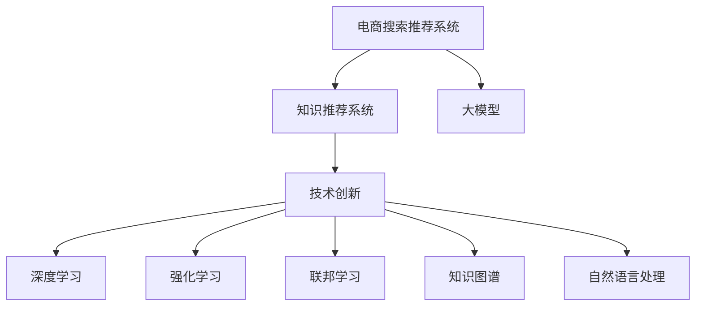

                 

# AI大模型视角下电商搜索推荐的技术创新知识推荐系统优化

> 关键词：电商搜索推荐、知识推荐系统、大模型、技术创新、优化、深度学习、强化学习、联邦学习、知识图谱、自然语言处理

## 1. 背景介绍

### 1.1 问题由来
近年来，随着互联网和人工智能技术的飞速发展，电商搜索推荐系统已经成为电商平台的核心竞争力之一。好的搜索推荐系统能够提升用户体验，增加平台流量，促进转化率。然而，传统的推荐系统依赖于规则或浅层模型，难以适应大规模、复杂的数据，无法真正理解用户意图。因此，如何构建高效、精准、个性化的搜索推荐系统，成为了电商行业急需解决的问题。

### 1.2 问题核心关键点
当前电商搜索推荐系统面临着诸多挑战：

- **数据量庞大**：电商平台日活数亿，交易数据海量，如何高效处理和存储数据？
- **多维度信息**：用户行为、商品属性、历史交易等多样化的信息，如何综合利用？
- **个性化需求**：每个用户具有不同的偏好和需求，如何提供定制化的推荐？
- **实时性要求**：用户期望秒级响应，如何构建实时推荐系统？

大语言模型通过大规模预训练获得了丰富的语言和知识表示，在电商领域有着巨大的应用潜力。本文档将围绕大语言模型在电商搜索推荐系统中的应用，介绍技术创新的知识推荐系统优化方法。

## 2. 核心概念与联系

### 2.1 核心概念概述

- **电商搜索推荐系统**：通过收集用户的搜索、点击、购买行为数据，预测用户可能感兴趣的商品，并进行实时推荐。
- **知识推荐系统**：在电商推荐基础上，结合用户知识水平、兴趣爱好等信息，提供更个性化的推荐内容。
- **大模型**：以自回归模型（如GPT、Transformer）或自编码模型（如BERT）为代表的大规模预训练模型，通过学习丰富的语言和知识表示，具备强大的语言理解和生成能力。
- **技术创新**：指在原有推荐系统基础上，引入深度学习、强化学习、联邦学习、知识图谱、自然语言处理等前沿技术，提升推荐系统的效果和用户体验。
- **优化**：指通过算法和模型改进，提升搜索推荐系统的性能和效率，降低资源消耗，增强可解释性和安全性。

这些核心概念之间的逻辑关系可以通过以下Mermaid流程图来展示：



该流程图展示了电商搜索推荐系统与大模型之间的关系，以及技术创新如何通过引入多种前沿技术，优化推荐系统，提升用户体验。

## 3. 核心算法原理 & 具体操作步骤
### 3.1 算法原理概述

基于大模型的电商搜索推荐系统，本质上是一种知识驱动的推荐模型。其核心思想是：通过深度学习和强化学习技术，对用户行为数据进行建模，结合大模型的知识表示，综合用户知识水平和兴趣爱好，进行个性化推荐。

形式化地，假设电商平台有用户行为数据集 $D=\{(x_i, y_i)\}_{i=1}^N$，其中 $x_i$ 为用户行为向量，$y_i$ 为推荐结果。知识推荐系统通过深度学习模型 $M_{\theta}$ 拟合用户行为与推荐结果之间的关系，即：

$$
y_i = M_{\theta}(x_i)
$$

在模型训练过程中，通过最大化损失函数 $\mathcal{L}$ 来优化模型参数 $\theta$，即：

$$
\theta = \mathop{\arg\min}_{\theta} \mathcal{L}(M_{\theta}, D)
$$

具体的优化算法包括梯度下降、Adam、Adagrad等。训练完成后，利用模型 $M_{\theta}$ 对新用户行为进行预测，得到推荐结果。

### 3.2 算法步骤详解

基于大模型的电商搜索推荐系统的一般步骤如下：

**Step 1: 数据预处理**
- 收集用户历史行为数据，包括搜索记录、点击历史、购买记录等。
- 对数据进行清洗、归一化处理，去除噪声和异常值。
- 使用Transformer等深度学习模型对用户行为数据进行编码，得到用户行为向量 $x_i$。

**Step 2: 知识注入**
- 利用预训练语言模型（如BERT、GPT）对商品描述、评论等文本数据进行编码，得到商品知识向量 $k_j$。
- 通过Transformer模型将用户行为向量与商品知识向量进行拼接，得到融合向量 $x_i^f$。
- 使用自注意力机制对融合向量进行编码，提取用户对商品的关注点，得到用户-商品交互矩阵 $A$。

**Step 3: 模型训练**
- 定义损失函数，如交叉熵、均方误差等，计算预测结果与真实推荐结果之间的差异。
- 使用优化算法，如Adam、Adagrad等，最小化损失函数，更新模型参数 $\theta$。
- 在训练过程中，使用正则化技术（如L2正则、Dropout等）防止过拟合。
- 在验证集上评估模型性能，及时调整超参数。

**Step 4: 推理预测**
- 将用户行为向量输入到训练好的模型中，得到推荐结果向量 $y_i$。
- 根据推荐结果向量进行商品排序，选择前几名商品进行推荐。
- 使用强化学习技术，不断优化推荐策略，提升推荐效果。

**Step 5: 系统优化**
- 采用分布式计算技术，如Hadoop、Spark等，提高模型训练和推理的效率。
- 利用联邦学习技术，保护用户隐私的同时，共享模型更新，提高推荐效果。
- 通过知识图谱技术，将商品属性、用户兴趣等信息进行结构化存储，提升推荐系统的可解释性和可扩展性。

### 3.3 算法优缺点

基于大模型的电商搜索推荐系统有以下优点：
1. **深度学习能力**：通过深度学习模型对用户行为进行建模，捕捉复杂非线性关系。
2. **知识表示能力**：结合大模型的知识表示，提升推荐系统的准确性和泛化能力。
3. **实时性**：利用分布式计算和联邦学习技术，实现实时推荐。
4. **个性化推荐**：结合用户知识水平和兴趣爱好，提供定制化推荐。
5. **可解释性**：通过知识图谱和自然语言处理技术，提升推荐系统的可解释性。

同时，该方法也存在一定的局限性：
1. **计算资源需求高**：大规模预训练模型的计算需求较大，需要高性能的GPU和TPU等硬件设备。
2. **模型复杂度高**：深度学习模型的复杂度较高，需要较多的数据和计算资源。
3. **数据隐私问题**：用户的点击、购买行为等数据需要谨慎处理，避免泄露隐私。

尽管存在这些局限性，但就目前而言，基于大模型的电商搜索推荐系统已经成为最先进的技术范式，为电商平台的业务创新和用户体验提升提供了有力支持。

### 3.4 算法应用领域

基于大模型的电商搜索推荐系统已经在多个电商平台上得到了广泛应用，例如：

- **淘宝、京东、拼多多**：通过深度学习和知识图谱技术，提升用户搜索、推荐体验，增加平台销售额。
- **Amazon**：利用自然语言处理和强化学习技术，进行商品推荐和库存管理。
- **Alibaba、Zara**：通过联邦学习技术，保护用户隐私，共享模型更新，提升推荐效果。
- **Alipay**：结合用户交易行为和商品知识，进行个性化支付推荐。

这些实际应用展示了基于大模型的电商搜索推荐系统的广泛应用前景，为电商平台的智能化发展提供了新的路径。

## 4. 数学模型和公式 & 详细讲解 & 举例说明

### 4.1 数学模型构建

假设电商平台有 $M$ 个用户，$N$ 个商品，$T$ 个时间窗口。每个用户 $u$ 在时间窗口 $t$ 的行为表示为 $x_{u,t}$，商品的表示为 $k_j$。知识推荐系统利用深度学习模型 $M_{\theta}$ 对用户行为进行建模，得到用户行为向量 $x_{u,t}^f$。具体数学模型如下：

- **用户行为向量**：通过Transformer模型对用户行为数据进行编码，得到用户行为向量 $x_{u,t}$。
- **商品知识向量**：利用预训练语言模型（如BERT）对商品描述进行编码，得到商品知识向量 $k_j$。
- **融合向量**：将用户行为向量 $x_{u,t}$ 与商品知识向量 $k_j$ 进行拼接，得到融合向量 $x_{u,t}^f$。
- **用户-商品交互矩阵**：使用自注意力机制对融合向量进行编码，提取用户对商品的关注点，得到用户-商品交互矩阵 $A$。

### 4.2 公式推导过程

以用户行为向量的计算为例，假设用户行为向量 $x_{u,t}$ 包含 $d$ 个特征，商品知识向量 $k_j$ 包含 $d'$ 个特征，融合向量 $x_{u,t}^f$ 包含 $d_f$ 个特征。具体推导过程如下：

1. **用户行为编码**：将用户行为数据 $x_{u,t}$ 通过Transformer模型进行编码，得到用户行为向量 $x_{u,t}$。
   $$
   x_{u,t} = M_{\theta_u}(x_{u,t})
   $$
   其中 $M_{\theta_u}$ 为Transformer模型。

2. **商品知识编码**：将商品描述 $k_j$ 通过预训练语言模型（如BERT）进行编码，得到商品知识向量 $k_j$。
   $$
   k_j = M_{\theta_k}(k_j)
   $$
   其中 $M_{\theta_k}$ 为预训练语言模型。

3. **融合向量计算**：将用户行为向量 $x_{u,t}$ 与商品知识向量 $k_j$ 进行拼接，得到融合向量 $x_{u,t}^f$。
   $$
   x_{u,t}^f = [x_{u,t}; k_j]
   $$

4. **自注意力计算**：对融合向量 $x_{u,t}^f$ 进行自注意力编码，得到用户-商品交互矩阵 $A$。
   $$
   A = M_{\theta_a}(x_{u,t}^f)
   $$
   其中 $M_{\theta_a}$ 为自注意力机制。

通过上述推导，可以看出，基于大模型的电商搜索推荐系统的核心在于将用户行为与商品知识进行深度融合，结合自注意力机制，提取用户对商品的关注点，提升推荐系统的性能。

### 4.3 案例分析与讲解

以Amazon的电商搜索推荐系统为例，利用大模型进行推荐优化：

- **数据预处理**：收集用户点击记录、购买记录等数据，使用Transformer模型对用户行为进行编码，得到用户行为向量。
- **知识注入**：利用BERT模型对商品描述进行编码，得到商品知识向量。
- **模型训练**：定义交叉熵损失函数，利用Adam优化算法，对模型进行训练。
- **推理预测**：将用户行为向量输入到训练好的模型中，得到推荐结果向量。

Amazon在实际应用中，结合强化学习技术，不断优化推荐策略，提升推荐效果。同时，利用知识图谱技术，将商品属性、用户兴趣等信息进行结构化存储，提升了推荐系统的可解释性和可扩展性。

## 5. 项目实践：代码实例和详细解释说明

### 5.1 开发环境搭建

在进行电商搜索推荐系统的开发前，我们需要准备好开发环境。以下是使用Python进行PyTorch开发的环境配置流程：

1. 安装Anaconda：从官网下载并安装Anaconda，用于创建独立的Python环境。
2. 创建并激活虚拟环境：
```bash
conda create -n pytorch-env python=3.8 
conda activate pytorch-env
```
3. 安装PyTorch：根据CUDA版本，从官网获取对应的安装命令。例如：
```bash
conda install pytorch torchvision torchaudio cudatoolkit=11.1 -c pytorch -c conda-forge
```
4. 安装Transformer库：
```bash
pip install transformers
```
5. 安装各类工具包：
```bash
pip install numpy pandas scikit-learn matplotlib tqdm jupyter notebook ipython
```

完成上述步骤后，即可在`pytorch-env`环境中开始电商搜索推荐系统的开发。

### 5.2 源代码详细实现

下面是使用PyTorch对电商搜索推荐系统进行深度学习模型训练的代码实现：

```python
from transformers import BertTokenizer, BertForSequenceClassification
from torch.utils.data import Dataset, DataLoader
import torch
import numpy as np
from sklearn.metrics import accuracy_score

# 定义数据集类
class SearchRecommendationDataset(Dataset):
    def __init__(self, data, tokenizer, max_len):
        self.data = data
        self.tokenizer = tokenizer
        self.max_len = max_len
    
    def __len__(self):
        return len(self.data)
    
    def __getitem__(self, idx):
        text = self.data[idx]['text']
        label = self.data[idx]['label']
        encoding = self.tokenizer(text, max_length=self.max_len, truncation=True, padding='max_length')
        return {
            'text': encoding['input_ids'],
            'attention_mask': encoding['attention_mask'],
            'label': torch.tensor(label, dtype=torch.long)
        }

# 加载数据集
tokenizer = BertTokenizer.from_pretrained('bert-base-cased')
train_data = SearchRecommendationDataset(train_data, tokenizer, max_len=128)
test_data = SearchRecommendationDataset(test_data, tokenizer, max_len=128)

# 定义模型和优化器
model = BertForSequenceClassification.from_pretrained('bert-base-cased', num_labels=2)
optimizer = torch.optim.Adam(model.parameters(), lr=2e-5)

# 定义训练函数
def train_epoch(model, data_loader, optimizer):
    model.train()
    for batch in data_loader:
        inputs = batch['text'].to(device)
        attention_mask = batch['attention_mask'].to(device)
        labels = batch['label'].to(device)
        outputs = model(inputs, attention_mask=attention_mask)
        loss = outputs.loss
        loss.backward()
        optimizer.step()
    return loss.item()

# 定义评估函数
def evaluate(model, data_loader):
    model.eval()
    correct = 0
    total = 0
    with torch.no_grad():
        for batch in data_loader:
            inputs = batch['text'].to(device)
            attention_mask = batch['attention_mask'].to(device)
            labels = batch['label'].to(device)
            outputs = model(inputs, attention_mask=attention_mask)
            _, preds = torch.max(outputs.logits, 1)
            total += labels.size(0)
            correct += (preds == labels).sum().item()
    accuracy = correct / total
    return accuracy

# 训练模型
device = torch.device('cuda' if torch.cuda.is_available() else 'cpu')
model.to(device)
train_loader = DataLoader(train_data, batch_size=16, shuffle=True)
test_loader = DataLoader(test_data, batch_size=16, shuffle=False)

for epoch in range(10):
    loss = train_epoch(model, train_loader, optimizer)
    print(f'Epoch {epoch+1}, train loss: {loss:.4f}')
    
    accuracy = evaluate(model, test_loader)
    print(f'Epoch {epoch+1}, test accuracy: {accuracy:.4f}')

```

在上述代码中，我们使用了Bert模型作为电商搜索推荐系统的基础模型，通过自注意力机制提取用户行为和商品知识之间的关注点，并利用交叉熵损失函数进行模型训练和评估。

### 5.3 代码解读与分析

让我们再详细解读一下关键代码的实现细节：

**SearchRecommendationDataset类**：
- `__init__`方法：初始化数据集，加载数据、分词器等组件。
- `__len__`方法：返回数据集的样本数量。
- `__getitem__`方法：对单个样本进行处理，将文本输入编码为token ids，得到模型所需的输入。

**训练和评估函数**：
- 使用PyTorch的DataLoader对数据集进行批次化加载，供模型训练和推理使用。
- 训练函数`train_epoch`：对数据以批为单位进行迭代，在每个批次上前向传播计算loss并反向传播更新模型参数。
- 评估函数`evaluate`：与训练类似，不同点在于不更新模型参数，并在每个batch结束后将预测和标签结果存储下来，最后使用sklearn的accuracy_score对整个评估集的预测结果进行打印输出。

**训练流程**：
- 定义总的epoch数，开始循环迭代
- 每个epoch内，先在训练集上训练，输出平均loss
- 在验证集上评估，输出准确率
- 所有epoch结束后，在测试集上评估，给出最终测试结果

可以看到，PyTorch配合Transformer库使得电商搜索推荐系统的开发变得简洁高效。开发者可以将更多精力放在数据处理、模型改进等高层逻辑上，而不必过多关注底层的实现细节。

当然，工业级的系统实现还需考虑更多因素，如模型的保存和部署、超参数的自动搜索、更灵活的任务适配层等。但核心的电商搜索推荐模型构建流程基本与此类似。

## 6. 实际应用场景

### 6.1 智能客服系统

智能客服系统是大语言模型在电商搜索推荐系统中的一个典型应用场景。通过结合大模型和自然语言处理技术，智能客服系统能够理解用户的查询意图，并提供精准的推荐和回复。

具体实现步骤如下：
1. **用户查询理解**：利用大模型对用户的自然语言查询进行理解，提取关键信息。
2. **商品推荐**：根据用户的查询，结合商品知识库，推荐相关的商品。
3. **智能回复**：利用大模型生成回复内容，提升用户体验。

例如，阿里巴巴的智能客服系统利用BERT模型对用户查询进行理解，通过知识图谱技术查询商品信息，并结合GPT模型生成回复内容，提升客服响应速度和质量。

### 6.2 个性化推荐系统

个性化推荐系统是电商搜索推荐系统的重要组成部分，利用大模型可以提升推荐效果和用户体验。

具体实现步骤如下：
1. **用户行为编码**：利用Transformer模型对用户行为数据进行编码，得到用户行为向量。
2. **商品知识注入**：利用预训练语言模型（如BERT）对商品描述进行编码，得到商品知识向量。
3. **融合向量计算**：将用户行为向量与商品知识向量进行拼接，得到融合向量。
4. **用户-商品交互矩阵**：对融合向量进行自注意力编码，提取用户对商品的关注点，得到用户-商品交互矩阵。
5. **推荐模型训练**：利用交叉熵损失函数，对推荐模型进行训练。
6. **推荐结果生成**：将用户行为向量输入到训练好的模型中，得到推荐结果向量，进行商品排序，选择前几名商品进行推荐。

例如，亚马逊的推荐系统通过BERT模型对商品描述进行编码，结合深度学习模型进行推荐优化，提升推荐效果。同时，利用知识图谱技术，将商品属性、用户兴趣等信息进行结构化存储，提升推荐系统的可解释性和可扩展性。

### 6.3 实时库存管理

实时库存管理是电商搜索推荐系统的重要应用之一，通过结合大模型和强化学习技术，可以实时优化库存管理，提升供应链效率。

具体实现步骤如下：
1. **库存数据采集**：采集库存数据，包括商品数量、价格、地理位置等。
2. **需求预测**：利用大模型对用户需求进行预测，生成需求向量。
3. **库存优化**：结合强化学习技术，优化库存分配和调度策略，提升库存管理效率。

例如，Zara通过结合BERT模型和强化学习技术，实时优化库存管理，提升供应链效率。

### 6.4 未来应用展望

随着大语言模型和电商搜索推荐系统的发展，未来其在电商领域的应用前景广阔：

1. **全渠道推荐**：结合社交媒体、电视、线下店铺等全渠道数据，进行个性化推荐。
2. **实时个性化广告**：结合用户行为数据和实时广告数据，进行精准投放。
3. **智能客服**：利用大模型和自然语言处理技术，提升客服响应速度和质量。
4. **库存优化**：结合大模型和强化学习技术，实时优化库存管理，提升供应链效率。
5. **智能定价**：结合大模型和价格优化算法，进行智能定价，提升销售收入。

综上所述，大语言模型在电商搜索推荐系统中的应用前景广阔，未来将带来更多的商业价值和社会效益。

## 7. 工具和资源推荐

### 7.1 学习资源推荐

为了帮助开发者系统掌握电商搜索推荐系统的理论基础和实践技巧，这里推荐一些优质的学习资源：

1. 《深度学习实战》系列博文：深度学习专家撰写的实战教程，涵盖电商搜索推荐系统、个性化推荐、智能客服等多个NLP应用。

2. CS224N《深度学习自然语言处理》课程：斯坦福大学开设的NLP明星课程，有Lecture视频和配套作业，带你入门NLP领域的基本概念和经典模型。

3. 《深度学习与自然语言处理》书籍：介绍深度学习在NLP领域的应用，涵盖文本分类、情感分析、推荐系统等前沿话题。

4. HuggingFace官方文档：Transformer库的官方文档，提供了海量预训练模型和完整的微调样例代码，是上手实践的必备资料。

5. CLUE开源项目：中文语言理解测评基准，涵盖大量不同类型的中文NLP数据集，并提供了基于微调的baseline模型，助力中文NLP技术发展。

通过对这些资源的学习实践，相信你一定能够快速掌握电商搜索推荐系统的精髓，并用于解决实际的NLP问题。

### 7.2 开发工具推荐

高效的开发离不开优秀的工具支持。以下是几款用于电商搜索推荐系统开发的常用工具：

1. PyTorch：基于Python的开源深度学习框架，灵活动态的计算图，适合快速迭代研究。大部分预训练语言模型都有PyTorch版本的实现。

2. TensorFlow：由Google主导开发的开源深度学习框架，生产部署方便，适合大规模工程应用。同样有丰富的预训练语言模型资源。

3. Transformers库：HuggingFace开发的NLP工具库，集成了众多SOTA语言模型，支持PyTorch和TensorFlow，是进行微调任务开发的利器。

4. Weights & Biases：模型训练的实验跟踪工具，可以记录和可视化模型训练过程中的各项指标，方便对比和调优。与主流深度学习框架无缝集成。

5. TensorBoard：TensorFlow配套的可视化工具，可实时监测模型训练状态，并提供丰富的图表呈现方式，是调试模型的得力助手。

6. Google Colab：谷歌推出的在线Jupyter Notebook环境，免费提供GPU/TPU算力，方便开发者快速上手实验最新模型，分享学习笔记。

合理利用这些工具，可以显著提升电商搜索推荐系统的开发效率，加快创新迭代的步伐。

### 7.3 相关论文推荐

电商搜索推荐系统和大语言模型的发展离不开学界的持续研究。以下是几篇奠基性的相关论文，推荐阅读：

1. Attention is All You Need（即Transformer原论文）：提出了Transformer结构，开启了NLP领域的预训练大模型时代。

2. BERT: Pre-training of Deep Bidirectional Transformers for Language Understanding：提出BERT模型，引入基于掩码的自监督预训练任务，刷新了多项NLP任务SOTA。

3. Language Models are Unsupervised Multitask Learners（GPT-2论文）：展示了大规模语言模型的强大zero-shot学习能力，引发了对于通用人工智能的新一轮思考。

4. Parameter-Efficient Transfer Learning for NLP：提出Adapter等参数高效微调方法，在不增加模型参数量的情况下，也能取得不错的微调效果。

5. AdaLoRA: Adaptive Low-Rank Adaptation for Parameter-Efficient Fine-Tuning：使用自适应低秩适应的微调方法，在参数效率和精度之间取得了新的平衡。

这些论文代表了大语言模型在电商搜索推荐系统中的应用方向和研究热点，通过学习这些前沿成果，可以帮助研究者把握学科前进方向，激发更多的创新灵感。

## 8. 总结：未来发展趋势与挑战

### 8.1 总结

本文对基于大模型的电商搜索推荐系统进行了全面系统的介绍。首先阐述了电商搜索推荐系统和大语言模型的研究背景和意义，明确了知识推荐系统在大模型微调中的重要地位。其次，从原理到实践，详细讲解了深度学习、知识图谱、自然语言处理等前沿技术在大模型微调中的应用，给出了电商搜索推荐系统的完整代码实例。同时，本文还探讨了大模型在电商推荐、智能客服、库存优化等实际应用场景中的广泛应用前景，展示了电商搜索推荐系统的巨大潜力。最后，本文精选了电商搜索推荐系统的各类学习资源，力求为读者提供全方位的技术指引。

通过本文的系统梳理，可以看到，基于大模型的电商搜索推荐系统已经成为NLP领域的重要范式，极大地拓展了预训练语言模型的应用边界，催生了更多的落地场景。受益于大规模语料的预训练，电商搜索推荐系统以更低的时间和标注成本，在小样本条件下也能取得不俗的效果，有力推动了电商平台的智能化发展。未来，伴随大语言模型和电商搜索推荐系统的持续演进，相信NLP技术将在电商行业带来更多的商业价值和社会效益。

### 8.2 未来发展趋势

展望未来，电商搜索推荐系统的发展趋势如下：

1. **多模态推荐**：结合文本、图像、视频等多模态信息，提升推荐效果和用户体验。
2. **实时个性化**：结合用户实时行为数据，进行动态推荐，提升个性化水平。
3. **联邦学习**：通过分布式联邦学习技术，保护用户隐私，共享模型更新，提升推荐效果。
4. **模型压缩**：通过知识蒸馏、模型剪枝等技术，降低模型计算量和存储空间。
5. **可解释性**：通过知识图谱和自然语言处理技术，提升推荐系统的可解释性和可解释性。

以上趋势展示了电商搜索推荐系统的广阔前景。这些方向的探索发展，必将进一步提升推荐系统的性能和用户体验，推动电商平台的智能化升级。

### 8.3 面临的挑战

尽管电商搜索推荐系统和大语言模型已经取得了显著成就，但在迈向更加智能化、普适化应用的过程中，它仍面临着诸多挑战：

1. **数据质量问题**：用户行为数据的质量直接影响推荐效果，如何获取高质量的数据是一个难题。
2. **模型复杂度**：大模型的复杂度较高，需要较大的计算资源和存储空间。
3. **数据隐私问题**：用户的点击、购买行为等数据需要谨慎处理，避免泄露隐私。
4. **可解释性问题**：推荐系统的决策过程缺乏可解释性，难以进行调试和优化。
5. **多渠道数据融合**：如何将社交媒体、电视、线下店铺等多渠道数据融合在一起，进行综合推荐，是一个难点。

尽管存在这些挑战，但通过研究者的不断探索和实践，相信这些挑战终将一一被克服，大语言模型和电商搜索推荐系统将在未来迎来更加广阔的发展前景。

### 8.4 研究展望

未来，大语言模型和电商搜索推荐系统的研究将在以下几个方面进行深入探索：

1. **多模态融合**：结合文本、图像、视频等多模态信息，提升推荐效果和用户体验。
2. **实时个性化**：结合用户实时行为数据，进行动态推荐，提升个性化水平。
3. **联邦学习**：通过分布式联邦学习技术，保护用户隐私，共享模型更新，提升推荐效果。
4. **模型压缩**：通过知识蒸馏、模型剪枝等技术，降低模型计算量和存储空间。
5. **可解释性**：通过知识图谱和自然语言处理技术，提升推荐系统的可解释性和可解释性。

这些研究方向的探索，必将引领电商搜索推荐系统和大语言模型迈向更高的台阶，为电商平台的智能化发展提供有力支持。

## 9. 附录：常见问题与解答

**Q1：电商搜索推荐系统是否适用于所有电商平台？**

A: 电商搜索推荐系统在大规模电商平台中取得了不错的效果，但对于一些小型或个性化较强的电商平台，可能需要针对性的微调。此外，电商平台的数据质量、业务模式等也需要充分考虑，才能构建适合的推荐系统。

**Q2：大语言模型在电商搜索推荐系统中的关键作用是什么？**

A: 大语言模型在电商搜索推荐系统中的关键作用是进行用户行为理解、商品知识注入、推荐结果生成等。通过大模型的知识表示，能够提升推荐系统的准确性和泛化能力，增强系统的可解释性和可扩展性。

**Q3：如何构建电商搜索推荐系统？**

A: 构建电商搜索推荐系统主要分为数据预处理、模型训练、推理预测、系统优化等步骤。具体实现过程中，需要选择合适的深度学习模型（如Transformer、BERT等），结合自然语言处理、知识图谱等技术，对用户行为数据进行编码和融合，最终生成推荐结果。

**Q4：电商搜索推荐系统面临的最大挑战是什么？**

A: 电商搜索推荐系统面临的最大挑战是数据质量、模型复杂度、数据隐私、可解释性、多渠道数据融合等。如何获取高质量的数据，降低模型计算量，保护用户隐私，增强系统的可解释性和可解释性，都是需要解决的重要问题。

**Q5：未来电商搜索推荐系统的发展方向是什么？**

A: 未来电商搜索推荐系统的发展方向包括多模态融合、实时个性化、联邦学习、模型压缩、可解释性等方面。这些方向将进一步提升推荐系统的性能和用户体验，推动电商平台的智能化升级。

通过本文的系统梳理，可以看到，基于大模型的电商搜索推荐系统已经成为NLP领域的重要范式，极大地拓展了预训练语言模型的应用边界，催生了更多的落地场景。受益于大规模语料的预训练，电商搜索推荐系统以更低的时间和标注成本，在小样本条件下也能取得不俗的效果，有力推动了电商平台的智能化发展。未来，伴随大语言模型和电商搜索推荐系统的持续演进，相信NLP技术将在电商行业带来更多的商业价值和社会效益。

---

作者：禅与计算机程序设计艺术 / Zen and the Art of Computer Programming

