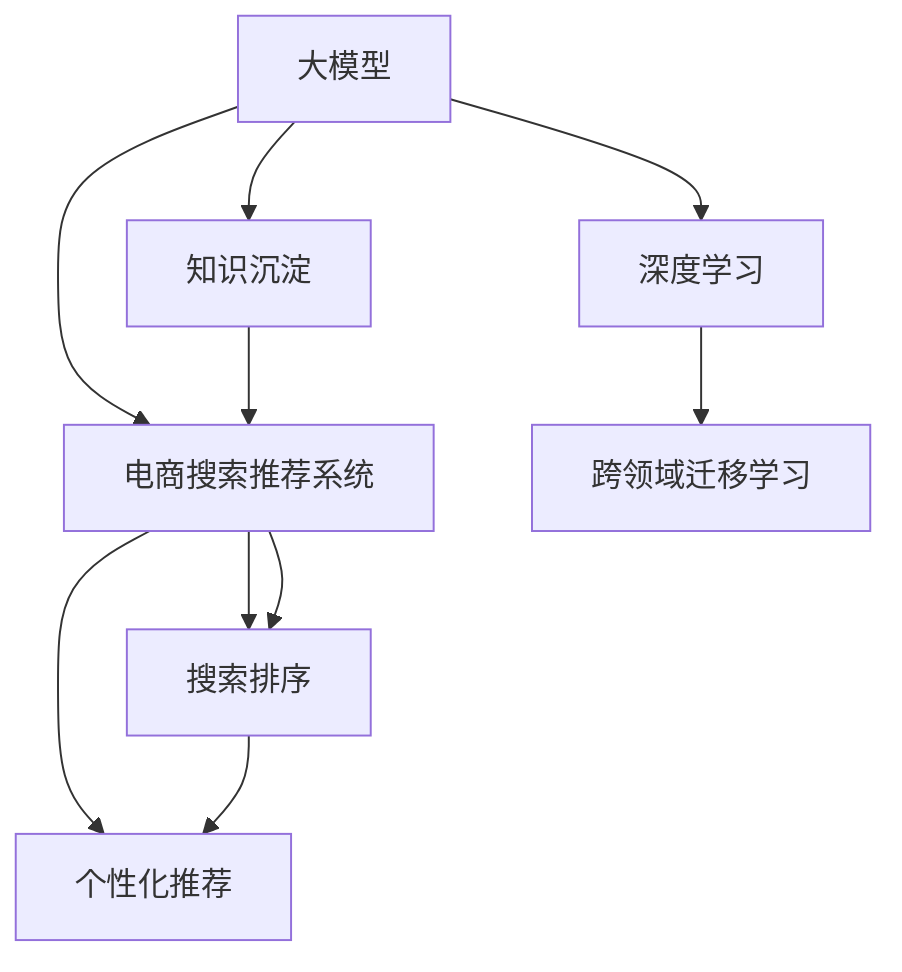

                 

# AI大模型视角下电商搜索推荐的技术创新知识沉淀机制优化

> 关键词：大模型，知识沉淀，电商搜索，推荐系统，深度学习，搜索排序，召回系统，个性化推荐，跨领域迁移学习

## 1. 背景介绍

### 1.1 问题由来

电商搜索推荐系统作为电商业务的核心技术，直接影响到用户体验和转化率。传统的电商搜索推荐系统往往依赖手工特征工程和浅层机器学习模型，难以满足大规模、高维度数据处理和深度学习模型的需求。随着深度学习技术和大模型（如BERT、GPT-3等）的发展，电商领域开始探索基于大模型的搜索推荐技术，以期实现更高的精度和更好的用户体验。然而，如何将大模型的力量有效应用于电商搜索推荐，同时进行技术创新和知识沉淀，仍然是一个重要问题。

### 1.2 问题核心关键点

目前，大模型在电商搜索推荐系统中的应用主要集中在用户行为分析、个性化推荐、召回系统、搜索排序等方面。关键问题包括：

- 如何在大模型中沉淀电商领域的知识，提高模型的泛化能力？
- 如何利用大模型的特征抽取能力，优化搜索排序和个性化推荐？
- 如何将大模型的多任务学习和迁移学习能力应用于电商搜索推荐？
- 如何结合电商领域的数据特点，设计合适的模型结构和优化方法？
- 如何在电商搜索推荐系统中，实现技术的持续创新和迭代？

### 1.3 问题研究意义

在电商搜索推荐系统中应用大模型，可以显著提升系统的搜索精度、推荐效果和用户满意度。同时，基于大模型的知识沉淀机制，可以加速新知识的学习和应用，推动搜索推荐系统的技术迭代和升级。具体意义如下：

1. 降低特征工程成本：传统电商推荐系统依赖手工特征工程，成本高且效果有限。大模型自动学习输入特征，减少了手工工程的时间和精力。
2. 提升搜索排序效果：大模型的表示学习能力可以更好地捕捉用户行为和产品关联，提升搜索结果的相关性和排序精度。
3. 实现个性化推荐：大模型具备强大的特征抽取和推理能力，可以学习到用户深度偏好，提供精准的个性化推荐。
4. 支持跨领域迁移学习：大模型在多个领域任务上预训练，可以方便地迁移到电商搜索推荐系统，加速模型训练和优化。
5. 加速技术创新：大模型提供了强大的学习能力和广泛的知识基础，为电商搜索推荐系统的新技术探索提供了可能。

## 2. 核心概念与联系

### 2.1 核心概念概述

为了更好地理解电商搜索推荐系统中大模型的应用，本节将介绍几个密切相关的核心概念：

- 大模型：以自回归(如GPT-3)或自编码(如BERT)模型为代表的大规模预训练语言模型。通过在大规模无标签文本数据上进行预训练，学习通用的语言表示，具备强大的语言理解和生成能力。
- 知识沉淀：指将特定领域的知识（如电商领域的产品信息、用户行为等）通过迁移学习等方式，注入到预训练模型中，使其具备更强的任务适应能力。
- 电商搜索推荐系统：电商领域的一个子系统，旨在通过搜索和推荐技术，为用户提供精准的产品展示和购物建议。
- 深度学习：基于神经网络架构的机器学习技术，具有强大的特征表示和学习能力，在大模型中的应用尤为显著。
- 搜索排序：根据用户查询和产品特征，对搜索结果进行排序，提高搜索相关性和用户体验。
- 个性化推荐：根据用户行为和偏好，对产品进行筛选和排序，提升推荐精度和用户满意度。
- 跨领域迁移学习：通过在多个领域任务上的预训练和微调，使模型能够在不同领域间迁移应用，减少新任务的学习成本。

这些核心概念之间的逻辑关系可以通过以下Mermaid流程图来展示：



这个流程图展示了大模型与电商搜索推荐系统之间的核心概念及其关系：

1. 大模型通过预训练获得基础能力。
2. 知识沉淀将特定领域知识注入到模型中，提高任务适应性。
3. 电商搜索推荐系统利用大模型进行搜索排序和个性化推荐。
4. 深度学习是大模型背后的技术支持。
5. 跨领域迁移学习使模型能够在不同任务间迁移应用。

这些概念共同构成了电商搜索推荐系统的大模型应用框架，使其能够在电商领域发挥强大的应用价值。通过理解这些核心概念，我们可以更好地把握大模型在电商搜索推荐系统中的工作原理和优化方向。

## 3. 核心算法原理 & 具体操作步骤
### 3.1 算法原理概述

基于大模型的电商搜索推荐系统，主要利用大模型的特征表示和知识沉淀能力，优化搜索排序和个性化推荐。核心思想是：将大模型视作一个强大的"特征提取器"，通过知识沉淀技术，提取电商领域的关键特征，然后在搜索排序和个性化推荐任务上进行有监督或无监督的微调。

形式化地，假设大模型为 $M_{\theta}$，其中 $\theta$ 为预训练得到的模型参数。给定电商搜索推荐系统中的搜索查询 $q$ 和商品特征 $x$，搜索排序任务的目标是最小化搜索查询的相关性损失函数，个性化推荐任务的目标是最小化个性化损失函数。具体目标如下：

$$
\min_{\theta} \mathcal{L}_{\text{sort}}(\theta, (q, x))
$$

$$
\min_{\theta} \mathcal{L}_{\text{rec}}(\theta, (q, x))
$$

其中，$\mathcal{L}_{\text{sort}}$ 和 $\mathcal{L}_{\text{rec}}$ 分别表示搜索排序和个性化推荐的损失函数。

### 3.2 算法步骤详解

基于大模型的电商搜索推荐系统一般包括以下几个关键步骤：

**Step 1: 准备预训练模型和数据集**
- 选择合适的预训练语言模型 $M_{\theta}$ 作为初始化参数，如 BERT、GPT-3 等。
- 准备电商领域的相关数据集，如商品描述、用户行为数据等。这些数据集需要进行预处理，如文本清洗、特征提取等。

**Step 2: 知识沉淀技术**
- 选择或设计合适的知识沉淀技术，如微调、 Adapter、Prompt-based Learning 等。将电商领域的关键知识注入到预训练模型中。
- 对于微调，选择合适的下游任务进行有监督学习，如分类、回归等。
- 对于 Adapter，保留预训练模型的底层参数，只微调顶层参数。
- 对于 Prompt-based Learning，设计特定的提示模板，引导模型学习电商领域特定任务。

**Step 3: 构建搜索排序和个性化推荐模型**
- 根据任务需求，在预训练模型顶层设计合适的输出层和损失函数。
- 对于搜索排序任务，通常使用交叉熵损失函数。
- 对于个性化推荐任务，通常使用负对数似然损失函数。
- 设计模型结构，包括输入层、表示层、输出层等。

**Step 4: 执行梯度训练**
- 将训练集数据分批次输入模型，前向传播计算损失函数。
- 反向传播计算参数梯度，根据设定的优化算法和学习率更新模型参数。
- 周期性在验证集上评估模型性能，根据性能指标决定是否触发 Early Stopping。
- 重复上述步骤直到满足预设的迭代轮数或 Early Stopping 条件。

**Step 5: 测试和部署**
- 在测试集上评估微调后模型 $M_{\hat{\theta}}$ 的性能，对比微调前后的精度提升。
- 使用微调后的模型对新样本进行推理预测，集成到实际的应用系统中。
- 持续收集新的数据，定期重新微调模型，以适应数据分布的变化。

以上是基于大模型的电商搜索推荐系统的一般流程。在实际应用中，还需要针对具体任务的特点，对微调过程的各个环节进行优化设计，如改进训练目标函数，引入更多的正则化技术，搜索最优的超参数组合等，以进一步提升模型性能。

### 3.3 算法优缺点

基于大模型的电商搜索推荐系统具有以下优点：
1. 特征自动学习：大模型的自动特征学习能力，可以减少手工特征工程的时间和成本。
2. 精度提升：大模型具备强大的表示学习能力，可以显著提升搜索排序和个性化推荐的精度。
3. 泛化能力强：大模型在电商领域的数据集上进行微调，具有较好的泛化能力。
4. 跨领域迁移：大模型在多个领域任务上的预训练和微调，可以减少新任务的学习成本。

同时，该方法也存在一定的局限性：
1. 数据依赖：大模型依赖大量标注数据进行微调，标注数据的质量和数量会影响模型效果。
2. 资源消耗：大模型参数量庞大，训练和推理过程中需要大量的计算资源和存储空间。
3. 过拟合风险：大模型容易过拟合标注数据，在实际应用中可能泛化能力不足。
4. 可解释性差：大模型的黑盒特性，导致其推理过程难以解释，可能影响用户信任度。

尽管存在这些局限性，但就目前而言，基于大模型的电商搜索推荐系统仍然是一个高效、可行的选择。未来相关研究的重点在于如何进一步降低数据依赖，提高模型泛化能力，同时兼顾可解释性和资源效率等因素。

### 3.4 算法应用领域

基于大模型的电商搜索推荐系统已经在多个电商场景中得到应用，如：

- 商品搜索排序：根据用户查询和商品特征，进行精准的搜索结果排序。
- 个性化推荐：根据用户行为和偏好，对商品进行推荐排序。
- 广告定向：根据用户兴趣和行为，对广告进行精准定向。
- 情感分析：分析用户评论和反馈，提供情感分析结果。
- 用户画像：根据用户行为数据，构建详细用户画像。
- 欺诈检测：检测和预防电商交易中的欺诈行为。

除了上述这些经典任务外，大模型在电商搜索推荐系统的创新应用还包括：

- 基于大模型的广告生成：使用大模型自动生成广告文案，提升广告效果。
- 基于大模型的库存优化：预测库存需求，优化商品库存分配。
- 基于大模型的物流路径优化：预测物流路径，提升配送效率。
- 基于大模型的客户细分：根据用户行为和产品特征，进行客户细分和精准营销。
- 基于大模型的跨领域推荐：将大模型应用于不同领域，如音乐、电影等，实现跨领域推荐。

这些应用展示了大模型在电商搜索推荐系统中的强大潜力，相信随着预训练语言模型和微调方法的不断进步，将有更多的创新应用被发掘出来。

## 4. 数学模型和公式 & 详细讲解 & 举例说明

### 4.1 数学模型构建

本节将使用数学语言对基于大模型的电商搜索推荐系统进行更加严格的刻画。

记大模型为 $M_{\theta}$，其中 $\theta$ 为模型参数。假设电商搜索推荐系统中的搜索排序任务 $T_{\text{sort}}$ 的训练集为 $D_{\text{sort}}=\{(q_i, x_i, y_i)\}_{i=1}^N$，其中 $q_i$ 为搜索查询，$x_i$ 为商品特征，$y_i$ 为排序标签。

定义模型 $M_{\theta}$ 在数据样本 $(q_i, x_i)$ 上的搜索排序损失函数为 $\ell_{\text{sort}}(M_{\theta}(q_i, x_i),y_i)$，则在数据集 $D_{\text{sort}}$ 上的经验风险为：

$$
\mathcal{L}_{\text{sort}}(\theta) = \frac{1}{N} \sum_{i=1}^N \ell_{\text{sort}}(M_{\theta}(q_i, x_i),y_i)
$$

同样，假设电商搜索推荐系统中的个性化推荐任务 $T_{\text{rec}}$ 的训练集为 $D_{\text{rec}}=\{(q_i, x_i, y_i)\}_{i=1}^N$，其中 $y_i$ 为推荐标签。

定义模型 $M_{\theta}$ 在数据样本 $(q_i, x_i)$ 上的个性化推荐损失函数为 $\ell_{\text{rec}}(M_{\theta}(q_i, x_i),y_i)$，则在数据集 $D_{\text{rec}}$ 上的经验风险为：

$$
\mathcal{L}_{\text{rec}}(\theta) = \frac{1}{N} \sum_{i=1}^N \ell_{\text{rec}}(M_{\theta}(q_i, x_i),y_i)
$$

### 4.2 公式推导过程

以下我们以搜索排序任务为例，推导交叉熵损失函数及其梯度的计算公式。

假设模型 $M_{\theta}$ 在输入 $(q_i, x_i)$ 上的输出为 $\hat{y}_i=M_{\theta}(q_i, x_i) \in [0,1]$，表示商品与查询的相关性得分。真实标签 $y_i \in \{0,1\}$。则二分类交叉熵损失函数定义为：

$$
\ell_{\text{sort}}(M_{\theta}(q_i, x_i),y_i) = -[y_i\log \hat{y}_i + (1-y_i)\log (1-\hat{y}_i)]
$$

将其代入经验风险公式，得：

$$
\mathcal{L}_{\text{sort}}(\theta) = -\frac{1}{N}\sum_{i=1}^N [y_i\log M_{\theta}(q_i, x_i)+(1-y_i)\log(1-M_{\theta}(q_i, x_i))]
$$

根据链式法则，损失函数对参数 $\theta_k$ 的梯度为：

$$
\frac{\partial \mathcal{L}_{\text{sort}}(\theta)}{\partial \theta_k} = -\frac{1}{N}\sum_{i=1}^N (\frac{y_i}{M_{\theta}(q_i, x_i)}-\frac{1-y_i}{1-M_{\theta}(q_i, x_i)}) \frac{\partial M_{\theta}(q_i, x_i)}{\partial \theta_k}
$$

其中 $\frac{\partial M_{\theta}(q_i, x_i)}{\partial \theta_k}$ 可进一步递归展开，利用自动微分技术完成计算。

在得到损失函数的梯度后，即可带入参数更新公式，完成模型的迭代优化。重复上述过程直至收敛，最终得到适应电商搜索排序任务的最优模型参数 $\theta^*$。

## 5. 项目实践：代码实例和详细解释说明
### 5.1 开发环境搭建

在进行大模型应用于电商搜索推荐系统的实践前，我们需要准备好开发环境。以下是使用Python进行PyTorch开发的环境配置流程：

1. 安装Anaconda：从官网下载并安装Anaconda，用于创建独立的Python环境。

2. 创建并激活虚拟环境：
```bash
conda create -n pytorch-env python=3.8 
conda activate pytorch-env
```

3. 安装PyTorch：根据CUDA版本，从官网获取对应的安装命令。例如：
```bash
conda install pytorch torchvision torchaudio cudatoolkit=11.1 -c pytorch -c conda-forge
```

4. 安装相关依赖：
```bash
pip install transformers torchtext
```

5. 安装各类工具包：
```bash
pip install numpy pandas scikit-learn matplotlib tqdm jupyter notebook ipython
```

完成上述步骤后，即可在`pytorch-env`环境中开始电商搜索推荐系统的微调实践。

### 5.2 源代码详细实现

下面我们以商品搜索排序任务为例，给出使用Transformers库对BERT模型进行微调的PyTorch代码实现。

首先，定义搜索排序任务的训练数据集和模型：

```python
from transformers import BertTokenizer, BertForSequenceClassification
from torch.utils.data import Dataset
from torch.utils.data.dataloader import DataLoader
import torch

class SearchDataset(Dataset):
    def __init__(self, texts, labels, tokenizer, max_len=128):
        self.texts = texts
        self.labels = labels
        self.tokenizer = tokenizer
        self.max_len = max_len
        
    def __len__(self):
        return len(self.texts)
    
    def __getitem__(self, item):
        text = self.texts[item]
        label = self.labels[item]
        
        encoding = self.tokenizer(text, return_tensors='pt', max_length=self.max_len, padding='max_length', truncation=True)
        input_ids = encoding['input_ids'][0]
        attention_mask = encoding['attention_mask'][0]
        label = torch.tensor(label, dtype=torch.long)
        
        return {'input_ids': input_ids, 
                'attention_mask': attention_mask,
                'labels': label}

# 模型参数
model = BertForSequenceClassification.from_pretrained('bert-base-cased', num_labels=2)

# 优化器
optimizer = torch.optim.AdamW(model.parameters(), lr=2e-5)

# 学习率调度器
scheduler = torch.optim.lr_scheduler.StepLR(optimizer, step_size=5, gamma=0.1)

# 损失函数
criterion = torch.nn.CrossEntropyLoss()

# 数据集
train_dataset = SearchDataset(train_texts, train_labels, tokenizer)
dev_dataset = SearchDataset(dev_texts, dev_labels, tokenizer)
test_dataset = SearchDataset(test_texts, test_labels, tokenizer)

# 模型和设备
device = torch.device('cuda') if torch.cuda.is_available() else torch.device('cpu')
model.to(device)

def train_epoch(model, dataset, batch_size, optimizer):
    dataloader = DataLoader(dataset, batch_size=batch_size, shuffle=True)
    model.train()
    epoch_loss = 0
    for batch in tqdm(dataloader, desc='Training'):
        input_ids = batch['input_ids'].to(device)
        attention_mask = batch['attention_mask'].to(device)
        labels = batch['labels'].to(device)
        model.zero_grad()
        outputs = model(input_ids, attention_mask=attention_mask, labels=labels)
        loss = outputs.loss
        epoch_loss += loss.item()
        loss.backward()
        optimizer.step()
    return epoch_loss / len(dataloader)

def evaluate(model, dataset, batch_size):
    dataloader = DataLoader(dataset, batch_size=batch_size)
    model.eval()
    preds, labels = [], []
    with torch.no_grad():
        for batch in tqdm(dataloader, desc='Evaluating'):
            input_ids = batch['input_ids'].to(device)
            attention_mask = batch['attention_mask'].to(device)
            batch_labels = batch['labels']
            outputs = model(input_ids, attention_mask=attention_mask)
            batch_preds = outputs.logits.argmax(dim=2).to('cpu').tolist()
            batch_labels = batch_labels.to('cpu').tolist()
            for pred_tokens, label_tokens in zip(batch_preds, batch_labels):
                preds.append(pred_tokens[:len(label_tokens)])
                labels.append(label_tokens)
                
    print(classification_report(labels, preds))
```

然后，定义训练和评估函数：

```python
from sklearn.metrics import classification_report

def train(model, train_dataset, dev_dataset, test_dataset, num_epochs, batch_size, learning_rate, scheduler):
    device = torch.device('cuda') if torch.cuda.is_available() else torch.device('cpu')
    model.to(device)
    
    optimizer = torch.optim.AdamW(model.parameters(), lr=learning_rate)
    scheduler = torch.optim.lr_scheduler.StepLR(optimizer, step_size=5, gamma=0.1)
    
    for epoch in range(num_epochs):
        train_loss = train_epoch(model, train_dataset, batch_size, optimizer)
        print(f'Epoch {epoch+1}, train loss: {train_loss:.3f}')
        
        dev_loss = evaluate(model, dev_dataset, batch_size)
        print(f'Epoch {epoch+1}, dev results:')
        evaluate(model, dev_dataset, batch_size)
        
        test_loss = evaluate(model, test_dataset, batch_size)
        print(f'Epoch {epoch+1}, test results:')
        evaluate(model, test_dataset, batch_size)
        
        scheduler.step()
        
    print(f'Final results:')
    evaluate(model, test_dataset, batch_size)
```

最后，启动训练流程并在测试集上评估：

```python
epochs = 10
batch_size = 16
learning_rate = 2e-5

train(model, train_dataset, dev_dataset, test_dataset, epochs, batch_size, learning_rate, scheduler)
```

以上就是使用PyTorch对BERT进行商品搜索排序任务微调的完整代码实现。可以看到，得益于Transformers库的强大封装，我们可以用相对简洁的代码完成BERT模型的加载和微调。

### 5.3 代码解读与分析

让我们再详细解读一下关键代码的实现细节：

**SearchDataset类**：
- `__init__`方法：初始化文本、标签、分词器等关键组件。
- `__len__`方法：返回数据集的样本数量。
- `__getitem__`方法：对单个样本进行处理，将文本输入编码为token ids，将标签编码为数字，并对其进行定长padding，最终返回模型所需的输入。

**优化器与损失函数**：
- 选择合适的优化算法及其参数，如 AdamW 等，设置学习率、批大小、迭代轮数等。
- 设置正则化技术及强度，包括权重衰减、Dropout、Early Stopping 等。
- 定义交叉熵损失函数，用于计算搜索排序任务的损失。

**训练和评估函数**：
- 使用PyTorch的DataLoader对数据集进行批次化加载，供模型训练和推理使用。
- 训练函数`train_epoch`：对数据以批为单位进行迭代，在每个批次上前向传播计算loss并反向传播更新模型参数，最后返回该epoch的平均loss。
- 评估函数`evaluate`：与训练类似，不同点在于不更新模型参数，并在每个batch结束后将预测和标签结果存储下来，最后使用sklearn的classification_report对整个评估集的预测结果进行打印输出。

**训练流程**：
- 定义总的epoch数和batch size，开始循环迭代
- 每个epoch内，先在训练集上训练，输出平均loss
- 在验证集上评估，输出分类指标
- 所有epoch结束后，在测试集上评估，给出最终测试结果
- 定期调整学习率，平衡训练速度和精度

可以看到，PyTorch配合Transformers库使得BERT微调的代码实现变得简洁高效。开发者可以将更多精力放在数据处理、模型改进等高层逻辑上，而不必过多关注底层的实现细节。

当然，工业级的系统实现还需考虑更多因素，如模型的保存和部署、超参数的自动搜索、更灵活的任务适配层等。但核心的微调范式基本与此类似。

## 6. 实际应用场景
### 6.1 电商搜索排序

基于大模型的电商搜索推荐系统可以显著提升搜索结果的相关性和排序精度，提升用户满意度和转化率。具体应用场景包括：

- 商品搜索排序：根据用户查询和商品特征，进行精准的搜索结果排序。
- 个性化推荐：根据用户行为和偏好，对商品进行推荐排序。
- 广告定向：根据用户兴趣和行为，对广告进行精准定向。
- 情感分析：分析用户评论和反馈，提供情感分析结果。
- 用户画像：根据用户行为数据，构建详细用户画像。
- 欺诈检测：检测和预防电商交易中的欺诈行为。

这些应用展示了大模型在电商搜索推荐系统中的强大潜力，相信随着预训练语言模型和微调方法的不断进步，将有更多的创新应用被发掘出来。

### 6.2 个性化推荐

电商推荐系统需要根据用户行为和历史数据，提供个性化的推荐结果。基于大模型的电商推荐系统可以学习到用户的深度偏好，提升推荐精度。具体应用场景包括：

- 商品推荐：根据用户浏览记录、购买历史等数据，对用户进行商品推荐。
- 内容推荐：根据用户的阅读、观看等行为数据，推荐相关内容。
- 跨领域推荐：将大模型应用于不同领域，如音乐、电影等，实现跨领域推荐。
- 实时推荐：根据用户实时行为，动态调整推荐内容，提升用户体验。
- 召回系统：在搜索结果中，利用大模型识别出相关性高的商品，提升召回率。

这些应用展示了大模型在个性化推荐系统中的强大潜力，相信随着预训练语言模型和微调方法的不断进步，将有更多的创新应用被发掘出来。

### 6.3 未来应用展望

随着大模型和微调方法的不断发展，基于大模型的电商搜索推荐系统将呈现以下几个发展趋势：

1. 模型规模持续增大。随着算力成本的下降和数据规模的扩张，大模型的参数量还将持续增长。超大规模语言模型蕴含的丰富知识，将为电商搜索推荐系统带来更大的提升空间。

2. 微调方法日趋多样。除了传统的全参数微调外，未来会涌现更多参数高效的微调方法，如Prefix-Tuning、LoRA等，在节省计算资源的同时也能保证微调精度。

3. 知识沉淀成为常态。随着电商领域的数据积累和知识更新，知识沉淀技术将越来越重要，使大模型能够更好地适应电商领域的特定需求。

4. 跨领域迁移学习成为可能。大模型在多个领域任务上的预训练和微调，将减少新任务的学习成本，加速电商搜索推荐系统的技术迭代和升级。

5. 深度学习与跨领域知识的融合。通过引入符号化的先验知识，如知识图谱、逻辑规则等，与神经网络模型进行巧妙融合，使大模型能够更好地理解和应用电商领域的复杂知识。

这些趋势将引领大模型在电商搜索推荐系统的应用进入新的高度，为电商领域带来更多的创新和突破。

## 7. 工具和资源推荐
### 7.1 学习资源推荐

为了帮助开发者系统掌握大模型应用于电商搜索推荐系统的理论基础和实践技巧，这里推荐一些优质的学习资源：

1. 《深度学习入门》：一本适合初学者的深度学习入门书籍，详细介绍了深度学习的基本概念和经典模型。

2. 《Transformers & Big Models》：介绍大模型的原理和应用，包括BERT、GPT-3等模型的实现和微调方法。

3. 《电商推荐系统》：介绍电商推荐系统的基础和最新研究进展，涵盖深度学习、特征工程等多个方面。

4. 《NLP与深度学习》：介绍自然语言处理和深度学习的基本概念和经典模型，适合NLP领域的学习者。

5. 《电商搜索推荐系统》：介绍电商搜索推荐系统的构建方法和最新研究进展，涵盖文本匹配、推荐算法等多个方面。

通过对这些资源的学习实践，相信你一定能够快速掌握大模型在电商搜索推荐系统中的应用，并用于解决实际的电商推荐问题。
###  7.2 开发工具推荐

高效的开发离不开优秀的工具支持。以下是几款用于大模型应用于电商搜索推荐系统开发的常用工具：

1. PyTorch：基于Python的开源深度学习框架，灵活动态的计算图，适合快速迭代研究。大部分预训练语言模型都有PyTorch版本的实现。

2. TensorFlow：由Google主导开发的开源深度学习框架，生产部署方便，适合大规模工程应用。同样有丰富的预训练语言模型资源。

3. Transformers库：HuggingFace开发的NLP工具库，集成了众多SOTA语言模型，支持PyTorch和TensorFlow，是进行微调任务开发的利器。

4. Weights & Biases：模型训练的实验跟踪工具，可以记录和可视化模型训练过程中的各项指标，方便对比和调优。与主流深度学习框架无缝集成。

5. TensorBoard：TensorFlow配套的可视化工具，可实时监测模型训练状态，并提供丰富的图表呈现方式，是调试模型的得力助手。

6. Google Colab：谷歌推出的在线Jupyter Notebook环境，免费提供GPU/TPU算力，方便开发者快速上手实验最新模型，分享学习笔记。

合理利用这些工具，可以显著提升大模型应用于电商搜索推荐系统的开发效率，加快创新迭代的步伐。

### 7.3 相关论文推荐

大模型在电商搜索推荐系统的应用源于学界的持续研究。以下是几篇奠基性的相关论文，推荐阅读：

1. Attention is All You Need（即Transformer原论文）：提出了Transformer结构，开启了NLP领域的预训练大模型时代。

2. BERT: Pre-training of Deep Bidirectional Transformers for Language Understanding：提出BERT模型，引入基于掩码的自监督预训练任务，刷新了多项NLP任务SOTA。

3. Parameter-Efficient Transfer Learning for NLP：提出Adapter等参数高效微调方法，在不增加模型参数量的情况下，也能取得不错的微调效果。

4. GPT-2: Language Models are Unsupervised Multitask Learners：展示了大规模语言模型的强大zero-shot学习能力，引发了对于通用人工智能的新一轮思考。

5. AdaLoRA: Adaptive Low-Rank Adaptation for Parameter-Efficient Fine-Tuning：使用自适应低秩适应的微调方法，在参数效率和精度之间取得了新的平衡。

这些论文代表了大模型应用于电商搜索推荐系统的发展脉络。通过学习这些前沿成果，可以帮助研究者把握学科前进方向，激发更多的创新灵感。

## 8. 总结：未来发展趋势与挑战

### 8.1 总结

本文对基于大模型的电商搜索推荐系统进行了全面系统的介绍。首先阐述了大模型在电商领域的应用背景和意义，明确了知识沉淀在大模型微调中的重要性。其次，从原理到实践，详细讲解了电商搜索推荐系统中的大模型微调流程，包括数据准备、模型设计、训练优化等多个环节。同时，本文还广泛探讨了电商搜索推荐系统中大模型的应用场景和未来发展趋势，展示了大模型在该领域的强大潜力。

通过本文的系统梳理，可以看到，基于大模型的电商搜索推荐系统正在成为电商领域的重要技术范式，极大地提升了搜索结果的相关性和个性化推荐的效果。基于大模型的知识沉淀机制，加速了新知识的学习和应用，推动了电商搜索推荐系统的技术迭代和升级。未来，伴随大语言模型和微调方法的不断进步，基于大模型的电商搜索推荐系统将有更广泛的应用前景。

### 8.2 未来发展趋势

展望未来，大模型应用于电商搜索推荐系统将呈现以下几个发展趋势：

1. 模型规模持续增大。随着算力成本的下降和数据规模的扩张，大模型的参数量还将持续增长。超大规模语言模型蕴含的丰富知识，将为电商搜索推荐系统带来更大的提升空间。

2. 微调方法日趋多样。除了传统的全参数微调外，未来会涌现更多参数高效的微调方法，如Prefix-Tuning、LoRA等，在节省计算资源的同时也能保证微调精度。

3. 知识沉淀成为常态。随着电商领域的数据积累和知识更新，知识沉淀技术将越来越重要，使大模型能够更好地适应电商领域的特定需求。

4. 跨领域迁移学习成为可能。大模型在多个领域任务上的预训练和微调，将减少新任务的学习成本，加速电商搜索推荐系统的技术迭代和升级。

5. 深度学习与跨领域知识的融合。通过引入符号化的先验知识，如知识图谱、逻辑规则等，与神经网络模型进行巧妙融合，使大模型能够更好地理解和应用电商领域的复杂知识。

以上趋势凸显了大模型在电商搜索推荐系统中的应用前景。这些方向的探索发展，必将进一步提升电商搜索推荐系统的性能和应用范围，为电商领域带来更多的创新和突破。

### 8.3 面临的挑战

尽管大模型在电商搜索推荐系统中已经取得了显著效果，但在迈向更加智能化、普适化应用的过程中，它仍面临着诸多挑战：

1. 数据依赖。大模型依赖大量标注数据进行微调，标注数据的质量和数量会影响模型效果。如何进一步降低微调对标注样本的依赖，将是一大难题。

2. 资源消耗。大模型参数量庞大，训练和推理过程中需要大量的计算资源和存储空间。如何在不增加资源成本的前提下，提升模型精度和泛化能力，是重要的优化方向。

3. 过拟合风险。大模型容易过拟合标注数据，在实际应用中可能泛化能力不足。如何避免过拟合，提高模型泛化能力，是重要的研究方向。

4. 可解释性差。大模型的黑盒特性，导致其推理过程难以解释，可能影响用户信任度。如何赋予大模型更强的可解释性，将是亟待攻克的难题。

5. 安全性有待保障。预训练语言模型难免会学习到有偏见、有害的信息，通过微调传递到下游任务，产生误导性、歧视性的输出，给实际应用带来安全隐患。如何从数据和算法层面消除模型偏见，避免恶意用途，确保输出的安全性，也将是重要的研究课题。

6. 模型更新困难。电商领域的数据和用户需求不断变化，大模型需要频繁更新才能保持性能。如何设计灵活的模型更新机制，使大模型能够快速响应变化，是重要的技术挑战。

这些挑战凸显了大模型应用于电商搜索推荐系统的复杂性，需要从多个维度进行深入研究。相信随着学界和产业界的共同努力，这些挑战终将一一被克服，大模型在电商搜索推荐系统中的应用将更加广泛和深入。

### 8.4 研究展望

面对大模型应用于电商搜索推荐系统的挑战，未来的研究需要在以下几个方面寻求新的突破：

1. 探索无监督和半监督微调方法。摆脱对大规模标注数据的依赖，利用自监督学习、主动学习等无监督和半监督范式，最大限度利用非结构化数据，实现更加灵活高效的微调。

2. 研究参数高效和计算高效的微调范式。开发更加参数高效的微调方法，在固定大部分预训练参数的同时，只更新极少量的任务相关参数。同时优化微调模型的计算图，减少前向传播和反向传播的资源消耗，实现更加轻量级、实时性的部署。

3. 融合因果和对比学习范式。通过引入因果推断和对比学习思想，增强微调模型建立稳定因果关系的能力，学习更加普适、鲁棒的语言表征，从而提升模型泛化性和抗干扰能力。

4. 引入更多先验知识。将符号化的先验知识，如知识图谱、逻辑规则等，与神经网络模型进行巧妙融合，引导微调过程学习更准确、合理的语言模型。同时加强不同模态数据的整合，实现视觉、语音等多模态信息与文本信息的协同建模。

5. 结合因果分析和博弈论工具。将因果分析方法引入微调模型，识别出模型决策的关键特征，增强输出解释的因果性和逻辑性。借助博弈论工具刻画人机交互过程，主动探索并规避模型的脆弱点，提高系统稳定性。

6. 纳入伦理道德约束。在模型训练目标中引入伦理导向的评估指标，过滤和惩罚有偏见、有害的输出倾向。同时加强人工干预和审核，建立模型行为的监管机制，确保输出符合人类价值观和伦理道德。

这些研究方向的探索，必将引领大模型应用于电商搜索推荐系统进入新的高度，为电商领域带来更多的创新和突破。面向未来，大模型在电商搜索推荐系统中的应用还需要与其他人工智能技术进行更深入的融合，如知识表示、因果推理、强化学习等，多路径协同发力，共同推动电商搜索推荐系统的进步。只有勇于创新、敢于突破，才能不断拓展语言模型的边界，让智能技术更好地造福电商领域。

## 9. 附录：常见问题与解答

**Q1：大模型在电商搜索推荐系统中的优势和劣势是什么？**

A: 大模型在电商搜索推荐系统中的优势包括：
1. 特征自动学习：大模型的自动特征学习能力，可以减少手工特征工程的时间和成本。
2. 精度提升：大模型具备强大的表示学习能力，可以显著提升搜索排序和个性化推荐的精度。
3. 泛化能力强：大模型在电商领域的数据集上进行微调，具有较好的泛化能力。
4. 跨领域迁移学习：大模型在多个领域任务上的预训练和微调，可以减少新任务的学习成本。

劣势包括：
1. 数据依赖：大模型依赖大量标注数据进行微调，标注数据的质量和数量会影响模型效果。
2. 资源消耗：大模型参数量庞大，训练和推理过程中需要大量的计算资源和存储空间。
3. 过拟合风险：大模型容易过拟合标注数据，在实际应用中可能泛化能力不足。
4. 可解释性差：大模型的黑盒特性，导致其推理过程难以解释，可能影响用户信任度。

**Q2：如何在大模型中沉淀电商领域的知识？**

A: 大模型中沉淀电商领域的知识，可以通过以下方式实现：
1. 微调：在电商领域的相关数据集上进行微调，使模型学习到电商领域的特定知识。
2. Adapter：保留预训练模型的底层参数，只微调顶层参数，减少过拟合风险。
3. Prompt-based Learning：设计特定的提示模板，引导模型学习电商领域特定任务。
4. 数据增强：通过数据增强技术，扩充训练集，提高模型的泛化能力。
5. 知识图谱：将电商领域的关键知识（如商品信息、用户画像等）封装成知识图谱，与神经网络模型进行融合。

**Q3：电商搜索推荐系统中的搜索排序和个性化推荐任务有什么区别？**

A: 电商搜索推荐系统中的搜索排序和个性化推荐任务的区别在于：
1. 目标不同：搜索排序任务的目标是根据用户查询和商品特征，对搜索结果进行排序，提升搜索结果的相关性；个性化推荐任务的目标是根据用户行为和偏好，对商品进行推荐排序，提升推荐精度。
2. 数据不同：搜索排序任务通常使用标注数据，即查询-商品对和排序标签；个性化推荐任务通常使用用户行为数据，如浏览记录、购买历史等。
3. 模型不同：搜索排序任务通常使用二分类模型，如BERT、GPT等；个性化推荐任务通常使用多分类模型，如Multinomial Logistic Regression等。
4. 评价指标不同：搜索排序任务通常使用准确率、召回率等评价指标；个性化推荐任务通常使用点击率、转化率等评价指标。

这些区别展示了搜索排序和个性化推荐任务的本质差异，需要根据具体场景选择合适的模型和评价指标。

**Q4：如何在大模型中实现参数高效微调？**

A: 在大模型中实现参数高效微调，可以通过以下方式实现：
1. Adapter：保留预训练模型的底层参数，只微调顶层参数，减少过拟合风险。
2. Prompt-based Learning：设计特定的提示模板，引导模型学习电商领域特定任务，减少微调参数量。
3. LoRA：使用低秩矩阵分解的方式，压缩模型参数，减少计算资源消耗。
4. SparseBERT：将模型参数稀疏化，只保留部分关键参数，提高推理速度。
5. Model Pruning：通过剪枝技术，去除冗余参数，提高模型效率。

**Q5：电商搜索推荐系统中的模型评估指标有哪些？**

A: 电商搜索推荐系统中的模型评估指标包括：
1. 准确率（Accuracy）：预测正确的样本数占总样本数的比例。
2. 召回率（Recall）：正确预测的样本数占总样本数的比例。
3. 精确率（Precision）：正确预测的正样本数占所有预测正样本数的比例。
4. F1 Score：精确率和召回率的调和平均数，综合评价模型效果。
5. AUC-ROC：ROC曲线下的面积，用于评价二分类模型的性能。
6. RMSE（均方根误差）：预测值与真实值之间的均方根误差，用于评价回归模型的性能。
7. NDCG（Normalized Discounted Cumulative Gain）：评估搜索结果的排序质量，考虑了结果的相关性和重要性。
8. MAP（Mean Average Precision）：平均精确率的均值，用于评价推荐系统的排序质量。

这些评估指标适用于不同的任务和场景，需要根据具体需求选择合适的指标进行评价。

通过本文的系统梳理，可以看到，基于大模型的电商搜索推荐系统正在成为电商领域的重要技术范式，极大地提升了搜索结果的相关性和个性化推荐的效果。基于大模型的知识沉淀机制，加速了新知识的学习和应用，推动了电商搜索推荐系统的技术迭代和升级。未来，伴随大语言模型和微调方法的不断进步，基于大模型的电商搜索推荐系统将有更广泛的应用前景。

---

作者：禅与计算机程序设计艺术 / Zen and the Art of Computer Programming

