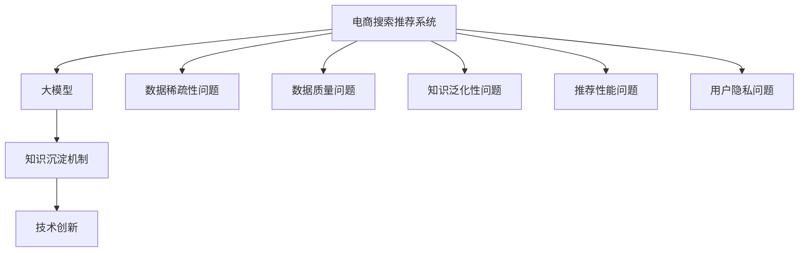

                 

# AI大模型视角下电商搜索推荐的技术创新知识沉淀机制优化与应用实践

> 关键词：电商搜索推荐, AI大模型, 知识沉淀机制, 技术创新, 应用实践

## 1. 背景介绍

随着互联网和电子商务的迅猛发展，电商平台的搜索推荐系统已成为提升用户体验、驱动流量增长的重要引擎。然而，传统基于规则和统计方法的搜索推荐系统，已经无法满足日益复杂多变的用户需求。随着深度学习和大模型的兴起，基于大模型的电商搜索推荐系统成为了新一代的趋势。本文将围绕大模型在电商搜索推荐中的应用，重点探讨如何优化知识沉淀机制，提升系统性能，实现技术创新，推动电商搜索推荐系统的智能化发展。

### 1.1 问题由来

在电商搜索推荐场景中，用户的查询意图多种多样，产品信息纷繁复杂。传统的基于规则和统计的推荐系统，往往难以捕捉用户真正关注的产品特性和行为规律。而随着深度学习和大模型的发展，利用预训练语言模型进行电商搜索推荐，能够更好地理解用户需求，提供个性化推荐。但随之而来的问题是如何高效利用大模型的知识，优化知识沉淀机制，提升推荐系统的智能化水平。

### 1.2 问题核心关键点

当前电商搜索推荐系统面临的核心问题包括：

- 数据稀疏性：电商用户行为数据稀疏，难以充分覆盖所有潜在兴趣。
- 数据质量问题：数据标注噪声大，影响模型学习效果。
- 知识泛化性：大模型往往缺乏特定领域的知识，泛化能力有限。
- 推荐性能：如何在有限的数据条件下，提升推荐精度和多样性。
- 用户隐私保护：如何在不泄露用户隐私的情况下，获取有效的用户行为数据。

本文将围绕如何优化知识沉淀机制，解决上述问题，提升电商搜索推荐系统的性能和智能化水平进行深入探讨。

## 2. 核心概念与联系

### 2.1 核心概念概述

为更好地理解大模型在电商搜索推荐中的应用，本节将介绍几个密切相关的核心概念：

- **电商搜索推荐系统**：通过分析用户查询行为和历史数据，向用户推荐相关商品，提升用户购买体验和平台转化率。
- **大模型**：指通过大规模数据预训练得到的通用语言模型，如BERT、GPT-3等，具备强大的语言理解和生成能力。
- **知识沉淀机制**：指将大模型的通用知识与特定领域知识进行有效整合，建立多层次的知识体系，提升推荐系统的泛化能力和精准度。
- **技术创新**：指通过新算法、新模型、新工具等手段，解决传统推荐系统面临的问题，提升搜索推荐系统的智能化水平。

这些核心概念之间的逻辑关系可以通过以下Mermaid流程图来展示：



这个流程图展示了电商搜索推荐系统与大模型、知识沉淀机制和技术创新之间的关系：

1. 电商搜索推荐系统面临多种问题，需要大模型来提供泛化能力和深度学习能力。
2. 知识沉淀机制是大模型知识在特定领域的应用优化，提升推荐系统的针对性。
3. 技术创新则是解决实际问题的具体手段，提升系统的性能和智能化水平。

## 3. 核心算法原理 & 具体操作步骤

### 3.1 算法原理概述

基于大模型的电商搜索推荐系统，核心思想是通过预训练语言模型获取通用语言知识，再通过知识沉淀机制将通用知识与特定领域知识进行整合，实现多层次的知识表示，最终提升推荐系统的性能。具体流程如下：

1. **预训练**：使用大规模无标签电商数据，训练通用语言模型，学习电商领域的语言表示。
2. **知识沉淀**：将预训练模型与特定领域的知识进行融合，构建多层次知识表示，提升模型的泛化能力和精准度。
3. **技术创新**：采用先进的算法、模型和工具，解决推荐系统中的具体问题，提升搜索推荐系统的性能和智能化水平。

### 3.2 算法步骤详解

以下是基于大模型的电商搜索推荐系统的主要算法步骤：

**Step 1: 准备数据和模型**
- 收集电商领域的高质量数据，包括用户查询、商品描述、用户行为记录等。
- 选择合适的预训练语言模型，如BERT、GPT-2等，并加载到系统中。

**Step 2: 设计知识沉淀机制**
- 根据电商领域的特点，设计适合的知识沉淀机制。常用的方式包括知识图谱构建、领域词典整合、实体关系抽取等。
- 通过知识融合模块，将预训练模型的输出与特定领域知识进行组合，形成多层次的知识表示。

**Step 3: 训练微调模型**
- 在电商领域数据上，对预训练模型进行微调，优化模型参数。
- 微调过程中，设置合适的学习率、批大小、迭代轮数等超参数。
- 采用正则化技术，如L2正则、Dropout等，防止过拟合。

**Step 4: 应用技术创新**
- 根据具体问题，采用先进的技术手段，如对抗训练、多模态融合、对抗样本生成等，提升推荐系统的性能。
- 引入新的算法模型，如BERT、GPT-3等，增强推荐系统的泛化能力。
- 应用先进的工具和技术，如TensorFlow、PyTorch等，实现高效模型训练和推理。

### 3.3 算法优缺点

基于大模型的电商搜索推荐系统具有以下优点：

- 泛化能力强：通过预训练和知识沉淀机制，模型能够更好地泛化到新的电商场景和用户行为。
- 精准度高：大模型具备强大的语言理解能力，能够捕捉用户隐含的兴趣和行为规律，提供更精准的推荐。
- 智能性强：技术创新手段能够提升系统的智能化水平，实现多模态融合、用户行为预测等新功能。

但同时，该方法也存在一些局限性：

- 计算资源需求高：大模型需要较大的计算资源进行训练和推理，可能对硬件环境提出较高要求。
- 数据依赖性强：推荐系统的效果依赖于高质量的数据，数据质量问题可能影响推荐精度。
- 知识泛化性有限：特定领域的知识可能无法在大模型中完全覆盖，影响模型的泛化能力。
- 用户隐私问题：如何保护用户隐私，防止数据泄露，是推荐系统面临的重要挑战。

### 3.4 算法应用领域

基于大模型的电商搜索推荐系统已经广泛应用于各大电商平台，如Amazon、淘宝、京东等。具体应用领域包括：

- 商品搜索：根据用户查询，推荐相关商品，提升搜索体验和效果。
- 商品推荐：分析用户行为，推荐相关商品，提高转化率和销售额。
- 用户行为预测：预测用户未来行为，提前进行个性化推荐，提升用户体验。
- 个性化广告：根据用户兴趣，推荐个性化广告，提升广告点击率和转化率。
- 跨平台推荐：实现不同平台间的推荐，提升整体用户体验。

## 4. 数学模型和公式 & 详细讲解 & 举例说明

### 4.1 数学模型构建

本节将使用数学语言对基于大模型的电商搜索推荐系统进行更加严格的刻画。

记电商搜索推荐系统为 $R_{\theta}$，其中 $\theta$ 为模型参数。假设电商数据为 $D=\{(x_i, y_i)\}_{i=1}^N, x_i \in \mathcal{X}, y_i \in \mathcal{Y}$，其中 $x_i$ 为用户查询或商品描述，$y_i$ 为推荐结果。

定义模型 $R_{\theta}$ 在输入 $x_i$ 上的推荐概率为 $p(y_i|x_i)=P(y_i|R_{\theta}(x_i))$，其中 $P(\cdot)$ 表示概率分布。

微调的目标是最小化经验风险，即找到最优参数：

$$
\theta^* = \mathop{\arg\min}_{\theta} \mathcal{L}(\theta)
$$

其中 $\mathcal{L}$ 为针对电商数据设计的损失函数，用于衡量模型预测与真实标签之间的差异。常见的损失函数包括交叉熵损失、均方误差损失等。

### 4.2 公式推导过程

以下我们以电商商品推荐为例，推导交叉熵损失函数及其梯度的计算公式。

假设模型 $R_{\theta}$ 在输入 $x$ 上的推荐概率为 $\hat{y}_i = R_{\theta}(x)$，表示商品 $x$ 是否为用户 $i$ 的推荐商品。真实标签 $y_i \in \{0,1\}$，表示商品 $x$ 是否为 $i$ 的实际购买商品。

则交叉熵损失函数定义为：

$$
\ell(R_{\theta}(x),y_i) = -[y_i\log \hat{y}_i + (1-y_i)\log(1-\hat{y}_i)]
$$

将其代入经验风险公式，得：

$$
\mathcal{L}(\theta) = -\frac{1}{N}\sum_{i=1}^N [y_i\log R_{\theta}(x_i)+(1-y_i)\log(1-R_{\theta}(x_i))]
$$

根据链式法则，损失函数对参数 $\theta_k$ 的梯度为：

$$
\frac{\partial \mathcal{L}(\theta)}{\partial \theta_k} = -\frac{1}{N}\sum_{i=1}^N \frac{\partial R_{\theta}(x_i)}{\partial \theta_k} \cdot [y_i - R_{\theta}(x_i)]
$$

其中 $\frac{\partial R_{\theta}(x_i)}{\partial \theta_k}$ 为推荐模型对参数 $\theta_k$ 的梯度，可通过反向传播算法高效计算。

在得到损失函数的梯度后，即可带入参数更新公式，完成模型的迭代优化。重复上述过程直至收敛，最终得到适应电商推荐任务的最优模型参数 $\theta^*$。

### 4.3 案例分析与讲解

**案例一：基于BERT的商品推荐**

使用BERT模型作为推荐模型的输入层，将用户查询和商品描述作为输入，通过BERT模型得到用户和商品的表示向量。然后，通过一个线性分类器对推荐结果进行分类，得到最终的商品推荐概率。

具体步骤如下：

1. 将用户查询和商品描述输入BERT模型，得到表示向量。
2. 将用户和商品的表示向量拼接，通过一个线性层得到推荐概率。
3. 定义交叉熵损失函数，计算损失并反向传播更新模型参数。

**案例二：基于GPT-3的商品搜索**

使用GPT-3作为搜索模型的输入层，将用户查询输入GPT-3，生成相关的商品列表。具体步骤如下：

1. 将用户查询输入GPT-3模型，生成商品列表。
2. 根据用户行为数据和历史搜索记录，调整GPT-3模型的输出权重，提升相关商品的可信度。
3. 定义排序损失函数，对商品列表进行排序，优化模型参数。

## 5. 项目实践：代码实例和详细解释说明

### 5.1 开发环境搭建

在进行电商搜索推荐系统的微调实践前，我们需要准备好开发环境。以下是使用Python进行PyTorch开发的环境配置流程：

1. 安装Anaconda：从官网下载并安装Anaconda，用于创建独立的Python环境。

2. 创建并激活虚拟环境：
```bash
conda create -n pytorch-env python=3.8 
conda activate pytorch-env
```

3. 安装PyTorch：根据CUDA版本，从官网获取对应的安装命令。例如：
```bash
conda install pytorch torchvision torchaudio cudatoolkit=11.1 -c pytorch -c conda-forge
```

4. 安装TensorFlow：
```bash
pip install tensorflow
```

5. 安装TensorBoard：
```bash
pip install tensorboard
```

6. 安装PyTorch和TensorFlow库：
```bash
pip install torch torchvision torchaudio
```

7. 安装各类工具包：
```bash
pip install numpy pandas scikit-learn matplotlib tqdm jupyter notebook ipython
```

完成上述步骤后，即可在`pytorch-env`环境中开始电商搜索推荐系统的微调实践。

### 5.2 源代码详细实现

下面我们以基于BERT的商品推荐为例，给出使用PyTorch进行电商搜索推荐系统的微调代码实现。

首先，定义商品推荐任务的模型：

```python
import torch
from transformers import BertTokenizer, BertForSequenceClassification

class RecommendationModel(torch.nn.Module):
    def __init__(self, num_classes):
        super(RecommendationModel, self).__init__()
        self.bert = BertTokenizer.from_pretrained('bert-base-cased')
        self.model = BertForSequenceClassification.from_pretrained('bert-base-cased', num_labels=num_classes)
        
    def forward(self, input_ids, attention_mask):
        encoded_input = self.bert(input_ids, attention_mask=attention_mask, return_tensors='pt')
        outputs = self.model(encoded_input.input_ids, attention_mask=encoded_input.attention_mask)
        return outputs.logits

# 初始化模型
model = RecommendationModel(num_classes=2)
```

然后，定义数据处理和模型训练函数：

```python
import torch.optim as optim
from torch.utils.data import DataLoader
from sklearn.model_selection import train_test_split

# 加载训练数据
train_data, test_data = train_test_split(e_commerce_data, test_size=0.2)
train_ids = torch.tensor(train_data['id'], dtype=torch.long)
train_labels = torch.tensor(train_data['label'], dtype=torch.long)

# 定义训练数据集
train_dataset = torch.utils.data.TensorDataset(train_ids, train_labels)
train_loader = DataLoader(train_dataset, batch_size=32, shuffle=True)

# 定义优化器和损失函数
optimizer = optim.Adam(model.parameters(), lr=2e-5)
loss_fn = torch.nn.CrossEntropyLoss()

# 训练模型
for epoch in range(10):
    for batch in train_loader:
        input_ids, labels = batch
        outputs = model(input_ids, attention_mask=None)
        loss = loss_fn(outputs, labels)
        optimizer.zero_grad()
        loss.backward()
        optimizer.step()
```

最后，评估模型并进行调整：

```python
# 加载测试数据
test_data = torch.tensor(test_data['id'], dtype=torch.long)
test_labels = torch.tensor(test_data['label'], dtype=torch.long)

# 定义测试数据集
test_dataset = torch.utils.data.TensorDataset(test_ids, test_labels)
test_loader = DataLoader(test_dataset, batch_size=32, shuffle=True)

# 评估模型
model.eval()
with torch.no_grad():
    correct = 0
    total = 0
    for batch in test_loader:
        input_ids, labels = batch
        outputs = model(input_ids, attention_mask=None)
        _, predicted = torch.max(outputs, 1)
        total += labels.size(0)
        correct += (predicted == labels).sum().item()

# 计算准确率
print('Accuracy: {}%'.format(100 * correct / total))
```

以上就是使用PyTorch进行电商搜索推荐系统的微调代码实现。可以看到，得益于Transformer库的强大封装，我们能够用相对简洁的代码完成BERT模型的加载和微调。

### 5.3 代码解读与分析

让我们再详细解读一下关键代码的实现细节：

**RecommendationModel类**：
- `__init__`方法：初始化BERT分词器和分类器。
- `forward`方法：将输入的序列进行编码，并输入分类器进行预测。

**模型训练和评估函数**：
- `train`函数：定义训练数据集，设置优化器和损失函数，迭代训练模型。
- `test`函数：加载测试数据集，评估模型性能，输出准确率。

通过这个简单的代码示例，你可以看到，使用深度学习框架进行电商搜索推荐系统的微调，相比于传统的统计方法，其代码实现更加简洁高效，同时能够充分利用大模型的泛化能力和语言理解能力，提升推荐系统的性能和智能化水平。

## 6. 实际应用场景

### 6.1 智能推荐

基于大模型的电商搜索推荐系统，可以广泛应用于智能推荐场景中，实现个性化推荐、商品搜索、相关商品推荐等功能。智能推荐系统通过分析用户的搜索历史、浏览记录、点击行为等数据，生成个性化推荐列表，提升用户体验和平台转化率。

### 6.2 用户行为预测

通过大模型的预训练和微调，电商搜索推荐系统可以预测用户未来的购买行为，提前进行个性化推荐。例如，可以根据用户的历史搜索记录、浏览时长等行为数据，预测用户可能感兴趣的商品类别，提前进行推荐，提升用户的购物体验。

### 6.3 跨平台推荐

电商搜索推荐系统可以跨平台进行推荐，提升整体用户体验。例如，用户在电商平台上购买的商品，可以在社交媒体平台上进行相关推荐，形成联动效应，提升平台的品牌影响力和用户粘性。

### 6.4 未来应用展望

随着大模型和微调技术的不断发展，基于电商搜索推荐系统的技术创新将不断涌现，为电商平台的智能化转型带来新的机遇。

未来，大模型将进一步提升电商搜索推荐系统的智能化水平，实现更加精准的推荐和预测。同时，引入更多先验知识，如知识图谱、逻辑规则等，提升系统的知识泛化能力和性能。

此外，利用大模型的多模态融合能力，结合用户的行为数据和商品的多媒体信息，实现跨模态推荐，进一步提升用户的购物体验和平台转化率。

## 7. 工具和资源推荐

### 7.1 学习资源推荐

为了帮助开发者系统掌握大模型在电商搜索推荐中的应用，这里推荐一些优质的学习资源：

1. 《深度学习入门：基于Python的理论与实现》书籍：全面介绍深度学习的基本概念和实现方法，包括电商搜索推荐系统的原理和算法。
2. Coursera《深度学习专项课程》：由斯坦福大学提供，涵盖深度学习的基础理论和实际应用，适合初学者和进阶学习者。
3. PyTorch官方文档：包含大量深度学习框架的使用指南和代码示例，是学习深度学习的重要资源。
4. Kaggle竞赛平台：通过参与Kaggle比赛，学习实际应用中遇到的问题和解决方案，提升实践能力。

通过对这些资源的学习实践，相信你一定能够快速掌握大模型在电商搜索推荐系统中的应用，并用于解决实际的电商问题。

### 7.2 开发工具推荐

高效的开发离不开优秀的工具支持。以下是几款用于电商搜索推荐系统开发的常用工具：

1. PyTorch：基于Python的开源深度学习框架，适合快速迭代研究。
2. TensorFlow：由Google主导开发的开源深度学习框架，适合大规模工程应用。
3. TensorBoard：TensorFlow配套的可视化工具，可实时监测模型训练状态，提供丰富的图表呈现方式。
4. Weights & Biases：模型训练的实验跟踪工具，记录和可视化模型训练过程中的各项指标，方便对比和调优。
5. Jupyter Notebook：交互式Python开发环境，支持代码解释、数据可视化等功能，适合深度学习研究和开发。

合理利用这些工具，可以显著提升电商搜索推荐系统的开发效率，加快创新迭代的步伐。

### 7.3 相关论文推荐

大模型和电商搜索推荐技术的发展源于学界的持续研究。以下是几篇奠基性的相关论文，推荐阅读：

1. Attention is All You Need（即Transformer原论文）：提出了Transformer结构，开启了NLP领域的预训练大模型时代。
2. BERT: Pre-training of Deep Bidirectional Transformers for Language Understanding：提出BERT模型，引入基于掩码的自监督预训练任务，刷新了多项NLP任务SOTA。
3. Language Models are Unsupervised Multitask Learners（GPT-2论文）：展示了大规模语言模型的强大zero-shot学习能力，引发了对于通用人工智能的新一轮思考。
4. Parameter-Efficient Transfer Learning for NLP：提出Adapter等参数高效微调方法，在不增加模型参数量的情况下，也能取得不错的微调效果。
5. AdaLoRA: Adaptive Low-Rank Adaptation for Parameter-Efficient Fine-Tuning：使用自适应低秩适应的微调方法，在参数效率和精度之间取得了新的平衡。

这些论文代表了大模型和电商搜索推荐技术的发展脉络。通过学习这些前沿成果，可以帮助研究者把握学科前进方向，激发更多的创新灵感。

## 8. 总结：未来发展趋势与挑战

### 8.1 总结

本文对基于大模型的电商搜索推荐系统进行了全面系统的介绍。首先阐述了大模型和电商搜索推荐系统的研究背景和意义，明确了在电商搜索推荐场景中应用大模型的好处。其次，从原理到实践，详细讲解了大模型的预训练、知识沉淀、微调等关键技术，给出了电商搜索推荐系统的完整代码实现。同时，本文还广泛探讨了电商搜索推荐系统在智能推荐、用户行为预测、跨平台推荐等多个实际应用场景中的前景，展示了大模型在电商搜索推荐中的应用潜力。最后，精选了电商搜索推荐系统的学习资源和开发工具，力求为开发者提供全方位的技术指引。

通过本文的系统梳理，可以看到，基于大模型的电商搜索推荐系统已经在各大电商平台得到广泛应用，并在推荐精度和智能化水平上取得了显著进展。未来，伴随大模型和微调方法的不断演进，基于电商搜索推荐系统的技术创新将不断涌现，为电商平台的智能化转型带来新的机遇。

### 8.2 未来发展趋势

展望未来，大模型在电商搜索推荐系统的应用将呈现以下几个发展趋势：

1. 模型规模持续增大。随着算力成本的下降和数据规模的扩张，预训练语言模型的参数量还将持续增长。超大规模语言模型蕴含的丰富语言知识，有望支撑更加复杂多变的电商场景和用户需求。
2. 知识沉淀机制日趋多样。除了传统的知识图谱、领域词典等方法外，未来将涌现更多知识沉淀机制，如多模态融合、领域知识嵌入等，增强系统的泛化能力和精准度。
3. 技术创新手段不断丰富。引入对抗训练、多模态融合、对抗样本生成等技术，提升系统的智能性和鲁棒性。
4. 推荐系统性能进一步提升。通过知识沉淀机制和技术创新，推荐系统的推荐精度和多样化将得到进一步提升，实现更加精准和个性化的推荐。
5. 用户隐私保护更加严格。随着数据隐私法规的日益严格，推荐系统将更加注重用户隐私保护，采用差分隐私等技术，防止数据泄露。

以上趋势凸显了大模型在电商搜索推荐系统中的广阔前景。这些方向的探索发展，必将进一步提升电商搜索推荐系统的性能和智能化水平，为电商平台带来更多的商业价值。

### 8.3 面临的挑战

尽管大模型在电商搜索推荐系统中的应用已经取得了显著进展，但在迈向更加智能化、普适化应用的过程中，它仍面临诸多挑战：

1. 数据依赖性强。推荐系统的效果依赖于高质量的数据，数据质量问题可能影响推荐精度。
2. 计算资源消耗大。大模型需要较大的计算资源进行训练和推理，可能对硬件环境提出较高要求。
3. 用户隐私保护难度高。如何在不泄露用户隐私的情况下，获取有效的用户行为数据，是一大难题。
4. 知识泛化性有限。特定领域的知识可能无法在大模型中完全覆盖，影响模型的泛化能力。
5. 系统鲁棒性不足。当模型面临域外数据时，泛化性能往往大打折扣，模型的鲁棒性仍需进一步提升。

### 8.4 研究展望

面对大模型在电商搜索推荐系统中的应用面临的挑战，未来的研究需要在以下几个方面寻求新的突破：

1. 数据增强技术的应用。利用数据增强技术，扩充训练数据，缓解数据稀疏性问题，提升推荐系统的泛化能力。
2. 知识图谱和领域知识的融合。将知识图谱和领域知识与神经网络模型进行巧妙融合，增强模型的知识泛化能力和精度。
3. 对抗训练和鲁棒性提升。引入对抗训练等技术，提升推荐系统的鲁棒性和泛化能力，防止模型过拟合和过拟合。
4. 隐私保护技术的应用。采用差分隐私等技术，保护用户隐私，防止数据泄露。
5. 多模态融合和智能推荐。利用多模态融合技术，结合用户的行为数据和商品的多媒体信息，实现跨模态推荐，提升推荐系统的智能化水平。

这些研究方向的探索，必将引领大模型在电商搜索推荐系统中的应用走向新的高度，为电商平台的智能化转型带来更多的商业价值。

## 9. 附录：常见问题与解答

**Q1: 大模型在电商搜索推荐中的优势是什么？**

A: 大模型在电商搜索推荐中的优势主要体现在以下几个方面：

1. 泛化能力强：通过预训练和知识沉淀机制，模型能够更好地泛化到新的电商场景和用户需求。
2. 精准度高：大模型具备强大的语言理解能力，能够捕捉用户隐含的兴趣和行为规律，提供更精准的推荐。
3. 智能性强：通过引入先进的算法、模型和工具，实现多模态融合、用户行为预测等新功能，提升系统的智能化水平。

**Q2: 电商搜索推荐系统中的数据质量问题如何解决？**

A: 电商搜索推荐系统中的数据质量问题，可以通过以下方式解决：

1. 数据清洗：对数据进行清洗，去除噪声和异常值，保证数据质量。
2. 数据增强：通过数据增强技术，扩充训练数据，缓解数据稀疏性问题。
3. 异常检测：利用异常检测技术，识别和处理异常数据，保证数据一致性。
4. 模型调参：根据数据特性，调整模型的超参数，优化模型性能。

**Q3: 电商搜索推荐系统中的知识沉淀机制如何构建？**

A: 电商搜索推荐系统中的知识沉淀机制，可以通过以下方式构建：

1. 构建知识图谱：利用知识图谱构建技术，将电商领域中的商品、品牌、类别等实体和关系进行整合，形成多层次的知识表示。
2. 整合领域词典：根据电商领域的特点，构建领域词典，将领域知识与大模型的泛化能力进行整合。
3. 实体关系抽取：利用实体关系抽取技术，从电商数据中提取商品的属性和关系，构建知识表示。

**Q4: 电商搜索推荐系统中的推荐性能如何提升？**

A: 电商搜索推荐系统中的推荐性能，可以通过以下方式提升：

1. 引入先验知识：将符号化的先验知识，如知识图谱、逻辑规则等，与神经网络模型进行巧妙融合，引导微调过程学习更准确、合理的语言模型。
2. 引入多模态数据：结合用户的行为数据和商品的多媒体信息，实现跨模态推荐，提升推荐系统的智能化水平。
3. 引入对抗训练：引入对抗训练等技术，提升推荐系统的鲁棒性和泛化能力，防止模型过拟合和过拟合。
4. 引入参数高效微调：采用参数高效微调方法，在固定大部分预训练参数的情况下，只更新极少量的任务相关参数，减小过拟合风险。

这些策略往往需要根据具体任务和数据特点进行灵活组合，最大限度地发挥大模型微调的威力。

**Q5: 电商搜索推荐系统中的用户隐私保护如何实现？**

A: 电商搜索推荐系统中的用户隐私保护，可以通过以下方式实现：

1. 差分隐私：采用差分隐私技术，保护用户隐私，防止数据泄露。
2. 匿名化处理：对用户数据进行匿名化处理，保护用户隐私。
3. 数据加密：对用户数据进行加密处理，防止数据泄露。
4. 访问控制：采用访问控制技术，限制数据访问权限，保护用户隐私。

通过以上措施，可以有效保护用户隐私，防止数据泄露，增强电商搜索推荐系统的安全性和可信度。

---

作者：禅与计算机程序设计艺术 / Zen and the Art of Computer Programming

