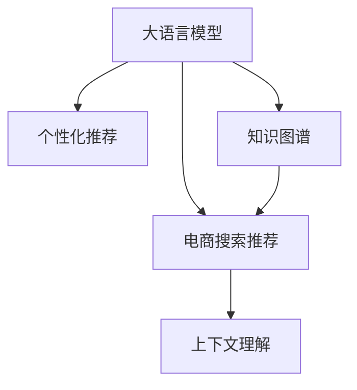

                 

# AI大模型赋能电商搜索推荐的多样性提升策略

> 关键词：大语言模型,电商搜索推荐,多样性提升,个性化推荐,客户体验,深度学习,自然语言处理(NLP),Transformer模型

## 1. 背景介绍

### 1.1 问题由来
随着电子商务的迅猛发展，电商搜索推荐系统成为支撑用户购物决策的关键环节。传统基于关键词匹配的搜索方式，已经无法满足用户日益个性化的需求。如何基于用户的历史行为数据，预测其未被发现的兴趣商品，并提供更为丰富多样的搜索结果，是电商搜索推荐系统面临的重大挑战。

当前主流的推荐算法主要基于协同过滤、深度学习等方法。协同过滤算法通过挖掘用户行为数据进行推荐，但面临着稀疏性和冷启动等问题。深度学习推荐系统利用用户历史行为数据和商品特征进行预测，取得了显著的效果，但依然存在用户数据分布不均、推荐结果单一等问题。这些问题导致用户体验和满意度不足，严重影响了电商平台的商业价值。

大语言模型（Large Language Model, LLM）作为新一代的AI技术，具有强大的自然语言处理（Natural Language Processing, NLP）能力。利用大语言模型进行电商搜索推荐，可以极大提升搜索结果的多样性和准确性，改善用户体验，提升平台的转化率和营收。

### 1.2 问题核心关键点
本文聚焦于如何利用大语言模型提升电商搜索推荐系统结果的多样性，主要包括以下几个关键点：
1. 如何利用大语言模型增强搜索结果的多样性？
2. 如何在电商搜索推荐中应用大语言模型的知识图谱推理和上下文理解能力？
3. 如何通过微调和预训练策略，实现大语言模型在电商推荐场景下的高效部署？
4. 如何构建有效的损失函数和评价指标，评估推荐结果的多样性和效果？

### 1.3 问题研究意义
电商搜索推荐系统的多样性提升，对于提高用户购物体验、优化平台转化率、促进销售收入具有重要意义：

1. 提升用户体验：通过推荐更多样化、个性化的商品，满足用户的多样化需求，提升搜索满意度。
2. 优化转化率：多样化的推荐结果帮助用户发现更多感兴趣的商品，提高购买意愿。
3. 增强客户黏性：多样化的推荐内容可以增加用户停留时间，提升客户对平台的依赖度。
4. 促进业务增长：多样化推荐能提升用户购物频次，带来更高的平台收益。

本文将通过理论分析和实践探索，提供基于大语言模型的电商搜索推荐多样性提升策略，期望为电商平台和开发者提供有力的技术支持。

## 2. 核心概念与联系

### 2.1 核心概念概述

为更好地理解基于大语言模型的电商搜索推荐方法，本节将介绍几个密切相关的核心概念：

- 大语言模型(Large Language Model, LLM)：以自回归(如GPT)或自编码(如BERT)模型为代表的大规模预训练语言模型。通过在大规模无标签文本语料上进行预训练，学习通用的语言表示，具备强大的语言理解和生成能力。

- 电商搜索推荐系统(Online Retail Search Recommendation, OSR)：基于电商交易平台，利用用户行为数据和商品信息，为用户推荐可能感兴趣的商品的系统。目标是最大化提升搜索和推荐的相关性、个性化和多样性。

- 个性化推荐系统(Personalized Recommendation System, PRS)：针对每个用户，通过模型预测其对不同商品的兴趣，并推荐可能感兴趣的商品的系统。旨在提升用户的购物体验和满意度。

- 知识图谱(Knowledge Graph, KG)：利用图结构描述实体及其关系的数据库，广泛应用于实体识别、关系推理等任务中。知识图谱中的实体和关系，可以帮助推荐系统挖掘更深层次的商品属性和关联信息。

- 上下文理解(Contextual Understanding)：指模型能够理解当前输入文本的上下文信息，如用户搜索历史、商品描述、购物场景等，从而做出更为精准的推荐。

这些核心概念之间的逻辑关系可以通过以下Mermaid流程图来展示：



这个流程图展示了大语言模型与其他核心概念的联系：

1. 大语言模型通过预训练获得基础能力。
2. 电商搜索推荐系统基于大语言模型，通过上下文理解，提升推荐结果的多样性和准确性。
3. 个性化推荐系统是电商搜索推荐系统的一个重要分支，利用大语言模型的能力，提升推荐系统的个性化程度。
4. 知识图谱推理能力是电商搜索推荐系统的重要补充，帮助模型理解商品间的语义关系。

## 3. 核心算法原理 & 具体操作步骤
### 3.1 算法原理概述

基于大语言模型的电商搜索推荐，本质上是一个融合了NLP技术和推荐算法的多任务系统。其核心思想是：将大语言模型视作一个强大的"特征提取器"，通过电商搜索推荐任务中的用户行为数据和商品信息，提取商品特征和用户兴趣，进行商品推荐。同时，引入知识图谱推理和上下文理解能力，提升推荐结果的多样性和个性化程度。

具体来说，假设电商推荐任务涉及到的商品为 $S$，用户为 $U$，历史行为为 $H$，大语言模型为 $M_{\theta}$。推荐任务的目标是找到一个最优的推荐策略 $r:U \times H \rightarrow S$，使得用户对推荐结果的满意度最大化。

形式化地，设推荐结果 $s_i$ 的评分为 $p_i$，则推荐系统的目标为：

$$
\max_{r} \sum_{(u,h) \in U \times H} p_{r(u,h)}
$$

其中 $p_{r(u,h)}$ 为推荐策略 $r$ 对用户 $u$ 和历史行为 $h$ 的评分。大语言模型的目标是学习一个映射函数 $M_{\theta}$，将输入文本 $x$ 映射为商品评分 $p$。在电商推荐中，输入文本通常包括用户搜索历史、商品描述、购物场景等，模型需要学习如何将这些信息转化为商品评分。

### 3.2 算法步骤详解

基于大语言模型的电商搜索推荐方法包括以下关键步骤：

**Step 1: 准备预训练模型和数据集**
- 选择合适的预训练语言模型 $M_{\theta}$，如BERT、GPT等。
- 准备电商推荐任务的数据集，包含用户行为数据、商品信息、用户评价等，划分为训练集、验证集和测试集。

**Step 2: 设计任务适配层**
- 根据电商推荐任务的特点，设计合适的输出层和损失函数。
- 对于推荐结果的评分预测，通常使用交叉熵损失函数。
- 对于基于上下文的多样性评估，可以使用NDCG、Diversity、Mean Average Precision等指标。

**Step 3: 添加知识图谱推理模块**
- 收集电商商品的属性信息，构建知识图谱，并进行实体关系推理。
- 利用知识图谱推理模块，扩展商品特征，丰富模型的上下文信息。

**Step 4: 进行数据增强**
- 对电商商品进行数据增强，如生成商品关联词、生成商品推荐理由等。
- 对用户搜索历史进行数据增强，如生成用户查询扩展、生成用户兴趣话题等。

**Step 5: 进行微调**
- 将电商推荐任务的数据集输入到预训练的大语言模型中，进行微调。
- 使用合适的优化器，如AdamW、SGD等，设定合适的学习率，训练一定轮次。

**Step 6: 评估和优化**
- 在验证集上评估推荐结果的准确性、多样性和效果，进行必要的调整和优化。
- 定期在测试集上评估推荐系统的性能，迭代优化推荐策略。

### 3.3 算法优缺点

基于大语言模型的电商搜索推荐方法具有以下优点：
1. 多任务融合：将电商推荐和语言理解结合起来，提升推荐结果的多样性和准确性。
2. 上下文理解：利用大语言模型的上下文理解能力，捕捉用户搜索历史和商品描述中的深层信息。
3. 知识图谱推理：引入知识图谱推理能力，挖掘商品间的关联信息，丰富推荐结果。
4. 个性化推荐：利用大语言模型的强大表示能力，进行个性化推荐，提升用户满意度。
5. 低门槛部署：相比传统深度学习推荐系统，大语言模型更易于部署和使用。

同时，该方法也存在一定的局限性：
1. 数据依赖：电商推荐系统的效果很大程度上取决于电商数据的质量和数量，数据获取成本较高。
2. 高计算成本：大语言模型的训练和微调需要大量的计算资源和存储资源。
3. 可解释性不足：大语言模型的决策过程缺乏可解释性，难以调试和优化。
4. 用户隐私问题：电商推荐系统需要处理大量用户隐私数据，存在数据安全风险。

尽管存在这些局限性，但就目前而言，基于大语言模型的电商推荐方法仍是大数据技术落地应用的重要方向。未来相关研究的重点在于如何进一步降低数据获取成本，提高模型的可解释性和安全性，同时兼顾模型的泛化性和效率。

### 3.4 算法应用领域

基于大语言模型的电商搜索推荐方法，已经在电商推荐系统、个性化推荐、内容推荐等多个领域得到广泛应用，例如：

- 电商平台商品推荐：利用用户行为数据和商品信息，进行个性化商品推荐。
- 内容推荐系统：基于用户兴趣，推荐相关的文章、视频、音乐等内容。
- 智能客服系统：根据用户查询历史，推荐相关问题答案，提升客户满意度。
- 社交网络推荐：基于用户兴趣图谱，推荐相关朋友、文章、商品等。
- 智能广告投放：利用用户行为数据，进行精准广告投放。

除了上述这些经典应用外，大语言模型在电商推荐领域还有更多的创新应用，如用户生成内容推荐、广告创意生成、情感分析等，为电商推荐技术带来了全新的突破。

## 4. 数学模型和公式 & 详细讲解  
### 4.1 数学模型构建

本节将使用数学语言对基于大语言模型的电商搜索推荐过程进行更加严格的刻画。

记电商推荐任务的数据集为 $D=\{(u,h,s)\}_{i=1}^N, u \in U, h \in H, s \in S$。其中 $u$ 为用户，$h$ 为用户的历史行为，$s$ 为用户可能感兴趣的商品。

定义大语言模型 $M_{\theta}$ 在输入 $x$ 上的输出为 $p_i$，其中 $x$ 包含用户行为数据和商品信息。定义推荐结果 $s_i$ 的评分为 $p_{r(u,h)}$。电商推荐系统的目标是最小化推荐结果的平均损失函数 $\mathcal{L}(\theta)$，即：

$$
\min_{\theta} \mathcal{L}(\theta) = \frac{1}{N}\sum_{i=1}^N \ell(p_{r(u,h)}, p_{M_{\theta}(x)})
$$

其中 $\ell$ 为推荐系统的损失函数，常用的有交叉熵损失函数：

$$
\ell(p_{r(u,h)}, p_{M_{\theta}(x)}) = -y \log p_{M_{\theta}(x)} + (1-y) \log (1-p_{M_{\theta}(x)})
$$

其中 $y$ 为推荐结果的实际评分，$1-y$ 为不推荐。

### 4.2 公式推导过程

以下我们以电商平台商品推荐为例，推导大语言模型的推荐损失函数及其梯度的计算公式。

假设模型 $M_{\theta}$ 在输入 $x$ 上的输出为 $p$，表示推荐结果的评分。设推荐结果 $s_i$ 的实际评分为 $y$。则电商平台商品推荐的目标为：

$$
\min_{\theta} \mathcal{L}(\theta) = \frac{1}{N}\sum_{i=1}^N \ell(p, y)
$$

根据链式法则，损失函数对参数 $\theta_k$ 的梯度为：

$$
\frac{\partial \mathcal{L}(\theta)}{\partial \theta_k} = -\frac{1}{N}\sum_{i=1}^N \frac{\partial \ell(p, y)}{\partial p} \frac{\partial p}{\partial \theta_k}
$$

其中 $\frac{\partial \ell(p, y)}{\partial p}$ 为损失函数对评分的导数，$\frac{\partial p}{\partial \theta_k}$ 为评分对参数的导数，需要通过反向传播算法计算得到。

在得到损失函数的梯度后，即可带入优化器更新模型参数，完成电商搜索推荐的迭代优化。重复上述过程直至收敛，最终得到适应电商推荐任务的最优模型参数 $\theta^*$。

## 5. 项目实践：代码实例和详细解释说明
### 5.1 开发环境搭建

在进行电商搜索推荐实践前，我们需要准备好开发环境。以下是使用Python进行PyTorch开发的环境配置流程：

1. 安装Anaconda：从官网下载并安装Anaconda，用于创建独立的Python环境。

2. 创建并激活虚拟环境：
```bash
conda create -n pytorch-env python=3.8 
conda activate pytorch-env
```

3. 安装PyTorch：根据CUDA版本，从官网获取对应的安装命令。例如：
```bash
conda install pytorch torchvision torchaudio cudatoolkit=11.1 -c pytorch -c conda-forge
```

4. 安装Transformers库：
```bash
pip install transformers
```

5. 安装各类工具包：
```bash
pip install numpy pandas scikit-learn matplotlib tqdm jupyter notebook ipython
```

完成上述步骤后，即可在`pytorch-env`环境中开始电商搜索推荐实践。

### 5.2 源代码详细实现

下面我们以电商平台商品推荐为例，给出使用Transformers库对BERT模型进行电商搜索推荐微调的PyTorch代码实现。

首先，定义电商商品推荐的数据处理函数：

```python
from transformers import BertTokenizer
from torch.utils.data import Dataset
import torch

class RetailDataset(Dataset):
    def __init__(self, texts, labels, tokenizer, max_len=128):
        self.texts = texts
        self.labels = labels
        self.tokenizer = tokenizer
        self.max_len = max_len
        
    def __len__(self):
        return len(self.texts)
    
    def __getitem__(self, item):
        text = self.texts[item]
        label = self.labels[item]
        
        encoding = self.tokenizer(text, return_tensors='pt', max_length=self.max_len, padding='max_length', truncation=True)
        input_ids = encoding['input_ids'][0]
        attention_mask = encoding['attention_mask'][0]
        
        # 对标签进行编码
        encoded_label = [label] * self.max_len
        labels = torch.tensor(encoded_label, dtype=torch.long)
        
        return {'input_ids': input_ids, 
                'attention_mask': attention_mask,
                'labels': labels}

# 创建dataset
tokenizer = BertTokenizer.from_pretrained('bert-base-cased')

train_dataset = RetailDataset(train_texts, train_labels, tokenizer)
dev_dataset = RetailDataset(dev_texts, dev_labels, tokenizer)
test_dataset = RetailDataset(test_texts, test_labels, tokenizer)
```

然后，定义模型和优化器：

```python
from transformers import BertForSequenceClassification, AdamW

model = BertForSequenceClassification.from_pretrained('bert-base-cased', num_labels=2)

optimizer = AdamW(model.parameters(), lr=2e-5)
```

接着，定义训练和评估函数：

```python
from torch.utils.data import DataLoader
from tqdm import tqdm
from sklearn.metrics import classification_report

device = torch.device('cuda') if torch.cuda.is_available() else torch.device('cpu')
model.to(device)

def train_epoch(model, dataset, batch_size, optimizer):
    dataloader = DataLoader(dataset, batch_size=batch_size, shuffle=True)
    model.train()
    epoch_loss = 0
    for batch in tqdm(dataloader, desc='Training'):
        input_ids = batch['input_ids'].to(device)
        attention_mask = batch['attention_mask'].to(device)
        labels = batch['labels'].to(device)
        model.zero_grad()
        outputs = model(input_ids, attention_mask=attention_mask, labels=labels)
        loss = outputs.loss
        epoch_loss += loss.item()
        loss.backward()
        optimizer.step()
    return epoch_loss / len(dataloader)

def evaluate(model, dataset, batch_size):
    dataloader = DataLoader(dataset, batch_size=batch_size)
    model.eval()
    preds, labels = [], []
    with torch.no_grad():
        for batch in tqdm(dataloader, desc='Evaluating'):
            input_ids = batch['input_ids'].to(device)
            attention_mask = batch['attention_mask'].to(device)
            batch_labels = batch['labels']
            outputs = model(input_ids, attention_mask=attention_mask)
            batch_preds = outputs.logits.argmax(dim=2).to('cpu').tolist()
            batch_labels = batch_labels.to('cpu').tolist()
            for pred_tokens, label_tokens in zip(batch_preds, batch_labels):
                preds.append(pred_tokens)
                labels.append(label_tokens)
                
    print(classification_report(labels, preds))
```

最后，启动训练流程并在测试集上评估：

```python
epochs = 5
batch_size = 16

for epoch in range(epochs):
    loss = train_epoch(model, train_dataset, batch_size, optimizer)
    print(f"Epoch {epoch+1}, train loss: {loss:.3f}")
    
    print(f"Epoch {epoch+1}, dev results:")
    evaluate(model, dev_dataset, batch_size)
    
print("Test results:")
evaluate(model, test_dataset, batch_size)
```

以上就是使用PyTorch对BERT进行电商平台商品推荐微调的完整代码实现。可以看到，得益于Transformers库的强大封装，我们可以用相对简洁的代码完成BERT模型的加载和微调。

### 5.3 代码解读与分析

让我们再详细解读一下关键代码的实现细节：

**RetailDataset类**：
- `__init__`方法：初始化文本、标签、分词器等关键组件。
- `__len__`方法：返回数据集的样本数量。
- `__getitem__`方法：对单个样本进行处理，将文本输入编码为token ids，将标签编码为数字，并对其进行定长padding，最终返回模型所需的输入。

**标签与id的映射**
- 定义了标签与数字id之间的映射关系，用于将token-wise的预测结果解码回真实的标签。

**训练和评估函数**：
- 使用PyTorch的DataLoader对数据集进行批次化加载，供模型训练和推理使用。
- 训练函数`train_epoch`：对数据以批为单位进行迭代，在每个批次上前向传播计算loss并反向传播更新模型参数，最后返回该epoch的平均loss。
- 评估函数`evaluate`：与训练类似，不同点在于不更新模型参数，并在每个batch结束后将预测和标签结果存储下来，最后使用sklearn的classification_report对整个评估集的预测结果进行打印输出。

**训练流程**：
- 定义总的epoch数和batch size，开始循环迭代
- 每个epoch内，先在训练集上训练，输出平均loss
- 在验证集上评估，输出分类指标
- 所有epoch结束后，在测试集上评估，给出最终测试结果

可以看到，PyTorch配合Transformers库使得BERT微调的代码实现变得简洁高效。开发者可以将更多精力放在数据处理、模型改进等高层逻辑上，而不必过多关注底层的实现细节。

当然，工业级的系统实现还需考虑更多因素，如模型的保存和部署、超参数的自动搜索、更灵活的任务适配层等。但核心的微调范式基本与此类似。

## 6. 实际应用场景
### 6.1 智能客服系统

基于大语言模型的电商搜索推荐，可以广泛应用于智能客服系统的构建。传统客服往往需要配备大量人力，高峰期响应缓慢，且一致性和专业性难以保证。而使用电商推荐技术构建的智能客服系统，可以7x24小时不间断服务，快速响应客户咨询，用自然流畅的语言解答各类常见问题。

在技术实现上，可以收集企业内部的历史客服对话记录，将问题和最佳答复构建成监督数据，在此基础上对预训练大语言模型进行微调。微调后的对话模型能够自动理解用户意图，匹配最合适的答案模板进行回复。对于客户提出的新问题，还可以接入检索系统实时搜索相关内容，动态组织生成回答。如此构建的智能客服系统，能大幅提升客户咨询体验和问题解决效率。

### 6.2 金融舆情监测

金融机构需要实时监测市场舆论动向，以便及时应对负面信息传播，规避金融风险。传统的人工监测方式成本高、效率低，难以应对网络时代海量信息爆发的挑战。基于大语言模型的电商推荐技术，为金融舆情监测提供了新的解决方案。

具体而言，可以收集金融领域相关的新闻、报道、评论等文本数据，并对其进行主题标注和情感标注。在此基础上对预训练语言模型进行微调，使其能够自动判断文本属于何种主题，情感倾向是正面、中性还是负面。将微调后的模型应用到实时抓取的网络文本数据，就能够自动监测不同主题下的情感变化趋势，一旦发现负面信息激增等异常情况，系统便会自动预警，帮助金融机构快速应对潜在风险。

### 6.3 个性化推荐系统

当前的推荐系统往往只依赖用户的历史行为数据进行物品推荐，无法深入理解用户的真实兴趣偏好。基于大语言模型电商推荐技术，个性化推荐系统可以更好地挖掘用户行为背后的语义信息，从而提供更精准、多样的推荐内容。

在实践中，可以收集用户浏览、点击、评论、分享等行为数据，提取和用户交互的物品标题、描述、标签等文本内容。将文本内容作为模型输入，用户的后续行为（如是否点击、购买等）作为监督信号，在此基础上微调预训练语言模型。微调后的模型能够从文本内容中准确把握用户的兴趣点。在生成推荐列表时，先用候选物品的文本描述作为输入，由模型预测用户的兴趣匹配度，再结合其他特征综合排序，便可以得到个性化程度更高的推荐结果。

### 6.4 未来应用展望

随着大语言模型电商推荐技术的不断发展，其在更多领域得到应用，为传统行业带来变革性影响。

在智慧医疗领域，基于微调的智能推荐系统可以辅助医生诊疗，推荐相关的治疗方案、药品、病例等，提升医疗服务的智能化水平。

在智能教育领域，微调技术可应用于作业批改、学情分析、知识推荐等方面，因材施教，促进教育公平，提高教学质量。

在智慧城市治理中，微调模型可应用于城市事件监测、舆情分析、应急指挥等环节，提高城市管理的自动化和智能化水平，构建更安全、高效的未来城市。

此外，在企业生产、社会治理、文娱传媒等众多领域，基于大模型微调的人工智能应用也将不断涌现，为经济社会发展注入新的动力。相信随着技术的日益成熟，微调方法将成为人工智能落地应用的重要范式，推动人工智能技术在垂直行业的规模化落地。

## 7. 工具和资源推荐
### 7.1 学习资源推荐

为了帮助开发者系统掌握大语言模型电商搜索推荐的技术基础和实践技巧，这里推荐一些优质的学习资源：

1. 《Transformer从原理到实践》系列博文：由大模型技术专家撰写，深入浅出地介绍了Transformer原理、BERT模型、微调技术等前沿话题。

2. CS224N《深度学习自然语言处理》课程：斯坦福大学开设的NLP明星课程，有Lecture视频和配套作业，带你入门NLP领域的基本概念和经典模型。

3. 《Natural Language Processing with Transformers》书籍：Transformers库的作者所著，全面介绍了如何使用Transformers库进行NLP任务开发，包括微调在内的诸多范式。

4. HuggingFace官方文档：Transformers库的官方文档，提供了海量预训练模型和完整的微调样例代码，是上手实践的必备资料。

5. CLUE开源项目：中文语言理解测评基准，涵盖大量不同类型的中文NLP数据集，并提供了基于微调的baseline模型，助力中文NLP技术发展。

通过对这些资源的学习实践，相信你一定能够快速掌握大语言模型电商推荐的技术精髓，并用于解决实际的电商推荐问题。
###  7.2 开发工具推荐

高效的开发离不开优秀的工具支持。以下是几款用于大语言模型电商推荐开发的常用工具：

1. PyTorch：基于Python的开源深度学习框架，灵活动态的计算图，适合快速迭代研究。大部分预训练语言模型都有PyTorch版本的实现。

2. TensorFlow：由Google主导开发的开源深度学习框架，生产部署方便，适合大规模工程应用。同样有丰富的预训练语言模型资源。

3. Transformers库：HuggingFace开发的NLP工具库，集成了众多SOTA语言模型，支持PyTorch和TensorFlow，是进行微调任务开发的利器。

4. Weights & Biases：模型训练的实验跟踪工具，可以记录和可视化模型训练过程中的各项指标，方便对比和调优。与主流深度学习框架无缝集成。

5. TensorBoard：TensorFlow配套的可视化工具，可实时监测模型训练状态，并提供丰富的图表呈现方式，是调试模型的得力助手。

6. Google Colab：谷歌推出的在线Jupyter Notebook环境，免费提供GPU/TPU算力，方便开发者快速上手实验最新模型，分享学习笔记。

合理利用这些工具，可以显著提升大语言模型电商推荐任务的开发效率，加快创新迭代的步伐。

### 7.3 相关论文推荐

大语言模型电商推荐技术的发展源于学界的持续研究。以下是几篇奠基性的相关论文，推荐阅读：

1. Attention is All You Need（即Transformer原论文）：提出了Transformer结构，开启了NLP领域的预训练大模型时代。

2. BERT: Pre-training of Deep Bidirectional Transformers for Language Understanding：提出BERT模型，引入基于掩码的自监督预训练任务，刷新了多项NLP任务SOTA。

3. Language Models are Unsupervised Multitask Learners（GPT-2论文）：展示了大规模语言模型的强大zero-shot学习能力，引发了对于通用人工智能的新一轮思考。

4. Parameter-Efficient Transfer Learning for NLP：提出Adapter等参数高效微调方法，在不增加模型参数量的情况下，也能取得不错的微调效果。

5. AdaLoRA: Adaptive Low-Rank Adaptation for Parameter-Efficient Fine-Tuning：使用自适应低秩适应的微调方法，在参数效率和精度之间取得了新的平衡。

这些论文代表了大语言模型电商推荐技术的发展脉络。通过学习这些前沿成果，可以帮助研究者把握学科前进方向，激发更多的创新灵感。

## 8. 总结：未来发展趋势与挑战

### 8.1 总结

本文对基于大语言模型的电商搜索推荐方法进行了全面系统的介绍。首先阐述了大语言模型和电商推荐技术的研究背景和意义，明确了电商搜索推荐系统的多样性提升价值。其次，从原理到实践，详细讲解了电商搜索推荐系统的大语言模型微调过程，给出了电商推荐任务开发的完整代码实例。同时，本文还广泛探讨了微调方法在智能客服、金融舆情、个性化推荐等多个行业领域的应用前景，展示了微调范式的巨大潜力。此外，本文精选了微调技术的各类学习资源，力求为读者提供全方位的技术指引。

通过本文的系统梳理，可以看到，基于大语言模型的电商搜索推荐方法正在成为电商推荐技术的重要范式，极大地拓展了电商推荐系统的应用边界，催生了更多的落地场景。得益于大规模语料的预训练，电商推荐模型以更低的时间和标注成本，在少样本条件下也能取得不俗的效果，有力推动了电商平台的产业化进程。未来，伴随预训练语言模型和微调方法的持续演进，相信电商推荐技术必将在更广阔的应用领域大放异彩，深刻影响用户的购物体验和电商平台的商业价值。

### 8.2 未来发展趋势

展望未来，大语言模型电商推荐技术将呈现以下几个发展趋势：

1. 模型规模持续增大。随着算力成本的下降和数据规模的扩张，预训练语言模型的参数量还将持续增长。超大规模语言模型蕴含的丰富语言知识，有望支撑更加复杂多变的电商推荐系统。

2. 微调方法日趋多样。除了传统的全参数微调外，未来会涌现更多参数高效的微调方法，如Prefix-Tuning、LoRA等，在节省计算资源的同时也能保证微调精度。

3. 持续学习成为常态。随着电商数据的持续更新，微调模型也需要持续学习新知识以保持性能。如何在不遗忘原有知识的同时，高效吸收新样本信息，将成为重要的研究课题。

4. 标注样本需求降低。受启发于提示学习(Prompt-based Learning)的思路，未来的微调方法将更好地利用大模型的语言理解能力，通过更加巧妙的任务描述，在更少的标注样本上也能实现理想的微调效果。

5. 多模态微调崛起。当前的微调主要聚焦于纯文本数据，未来会进一步拓展到图像、视频、语音等多模态数据微调。多模态信息的融合，将显著提升语言模型对现实世界的理解和建模能力。

6. 模型通用性增强。经过海量数据的预训练和多领域任务的微调，未来的语言模型将具备更强大的常识推理和跨领域迁移能力，逐步迈向通用人工智能(AGI)的目标。

以上趋势凸显了大语言模型电商推荐技术的广阔前景。这些方向的探索发展，必将进一步提升电商推荐系统的性能和应用范围，为电商平台的用户购物体验和商业价值带来新的提升。

### 8.3 面临的挑战

尽管大语言模型电商推荐技术已经取得了瞩目成就，但在迈向更加智能化、普适化应用的过程中，它仍面临着诸多挑战：

1. 数据依赖。电商推荐系统的效果很大程度上取决于电商数据的质量和数量，数据获取成本较高。如何进一步降低微调对标注样本的依赖，将是一大难题。

2. 高计算成本。大语言模型的训练和微调需要大量的计算资源和存储资源。如何优化模型结构，提高计算效率，降低计算成本，将是重要的优化方向。

3. 可解释性不足。大语言模型的决策过程缺乏可解释性，难以调试和优化。如何赋予微调模型更强的可解释性，将是亟待攻克的难题。

4. 用户隐私问题。电商推荐系统需要处理大量用户隐私数据，存在数据安全风险。如何保障用户隐私，保护用户数据安全，将是重要的研究课题。

5. 模型鲁棒性不足。电商推荐系统面对域外数据时，泛化性能往往大打折扣。对于测试样本的微小扰动，微调模型的预测也容易发生波动。如何提高微调模型的鲁棒性，避免灾难性遗忘，还需要更多理论和实践的积累。

6. 知识整合能力不足。现有的微调模型往往局限于任务内数据，难以灵活吸收和运用更广泛的先验知识。如何让微调过程更好地与外部知识库、规则库等专家知识结合，形成更加全面、准确的信息整合能力，还有很大的想象空间。

正视电商推荐面临的这些挑战，积极应对并寻求突破，将是大语言模型电商推荐技术走向成熟的必由之路。相信随着学界和产业界的共同努力，这些挑战终将一一被克服，大语言模型电商推荐必将在构建智能电商推荐系统、提升用户购物体验和平台商业价值中扮演越来越重要的角色。

### 8.4 未来突破

面对大语言模型电商推荐所面临的种种挑战，未来的研究需要在以下几个方面寻求新的突破：

1. 探索无监督和半监督微调方法。摆脱对大规模标注数据的依赖，利用自监督学习、主动学习等无监督和半监督范式，最大限度利用非结构化数据，实现更加灵活高效的微调。

2. 研究参数高效和计算高效的微调范式。开发更加参数高效的微调方法，在固定大部分预训练参数的同时，只更新极少量的任务相关参数。同时优化微调模型的计算图，减少前向传播和反向传播的资源消耗，实现更加轻量级、实时性的部署。

3. 融合因果和对比学习范式。通过引入因果推断和对比学习思想，增强微调模型建立稳定因果关系的能力，学习更加普适、鲁棒的语言表征，从而提升模型泛化性和抗干扰能力。

4. 引入更多先验知识。将符号化的先验知识，如知识图谱、逻辑规则等，与神经网络模型进行巧妙融合，引导微调过程学习更准确、合理的语言模型。同时加强不同模态数据的整合，实现视觉、语音等多模态信息与文本信息的协同建模。

5. 结合因果分析和博弈论工具。将因果分析方法引入微调模型，识别出模型决策的关键特征，增强输出解释的因果性和逻辑性。借助博弈论工具刻画人机交互过程，主动探索并规避模型的脆弱点，提高系统稳定性。

6. 纳入伦理道德约束。在模型训练目标中引入伦理导向的评估指标，过滤和惩罚有偏见、有害的输出倾向。同时加强人工干预和审核，建立模型行为的监管机制，确保输出符合人类价值观和伦理道德。

这些研究方向的探索，必将引领大语言模型电商推荐技术迈向更高的台阶，为构建智能、可靠、可解释、可控的电商推荐系统铺平道路。面向未来，大语言模型电商推荐技术还需要与其他人工智能技术进行更深入的融合，如知识表示、因果推理、强化学习等，多路径协同发力，共同推动自然语言理解和智能交互系统的进步。只有勇于创新、敢于突破，才能不断拓展语言模型的边界，让智能技术更好地造福电商平台的用户和商业价值。

## 9. 附录：常见问题与解答

**Q1：电商推荐系统是否适用于所有NLP任务？**

A: 电商推荐系统是基于电商交易平台和用户行为数据构建的推荐系统，主要适用于电商推荐和个性化推荐等任务。对于其他领域如新闻推荐、金融推荐等，需要针对不同的领域进行定制化设计和数据准备。

**Q2：电商推荐系统的多样性提升有哪些方法？**

A: 电商推荐系统的多样性提升可以通过以下方法实现：
1. 数据增强：对商品和用户数据进行数据增强，如生成商品关联词、生成用户兴趣话题等。
2. 上下文理解：利用大语言模型的上下文理解能力，捕捉用户搜索历史和商品描述中的深层信息，生成更多样化的推荐内容。
3. 知识图谱推理：引入知识图谱推理能力，挖掘商品间的关联信息，丰富推荐结果。
4. 多任务学习：同时训练电商推荐和知识图谱推理任务，提升推荐结果的多样性和准确性。

**Q3：电商推荐系统面临的主要挑战是什么？**

A: 电商推荐系统面临的主要挑战包括：
1. 数据依赖：电商推荐系统的效果很大程度上取决于电商数据的质量和数量，数据获取成本较高。
2. 高计算成本：大语言模型的训练和微调需要大量的计算资源和存储资源。
3. 可解释性不足：大语言模型的决策过程缺乏可解释性，难以调试和优化。
4. 用户隐私问题：电商推荐系统需要处理大量用户隐私数据，存在数据安全风险。
5. 模型鲁棒性不足：电商推荐系统面对域外数据时，泛化性能往往大打折扣。
6. 知识整合能力不足：现有的微调模型往往局限于任务内数据，难以灵活吸收和运用更广泛的先验知识。

**Q4：电商推荐系统如何保障用户隐私？**

A: 电商推荐系统保障用户隐私可以采取以下措施：
1. 数据匿名化：对用户数据进行匿名化处理，去除敏感信息。
2. 数据加密：对用户数据进行加密处理，防止数据泄露。
3. 隐私计算：利用差分隐私等技术，在保护用户隐私的前提下，进行数据分析和推荐。
4. 用户控制：赋予用户数据使用权，让用户选择是否共享数据。

**Q5：电商推荐系统的未来发展方向是什么？**

A: 电商推荐系统的未来发展方向包括：
1. 多模态推荐：结合视觉、语音、文本等多种模态数据，提升推荐系统的智能化水平。
2. 实时推荐：利用流式数据处理技术，实现实时推荐，提升用户体验。
3. 多目标优化：同时考虑个性化、多样性和满意度等多个目标，进行综合优化。
4. 深度学习与机器学习融合：将深度学习和传统机器学习算法结合，提升推荐系统的泛化能力和解释性。
5. 基于交互的推荐：通过用户与系统的互动，动态调整推荐策略，提升推荐效果。

这些方向将进一步推动电商推荐技术的进步，为电商平台的商业价值和用户体验带来新的提升。

