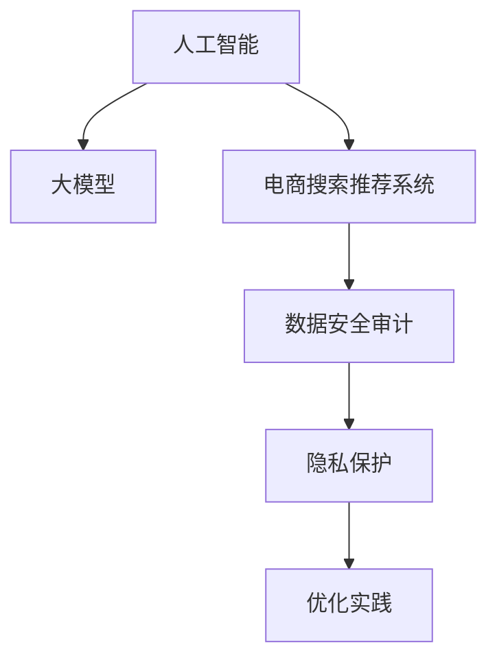

                 

# AI大模型重构电商搜索推荐的数据安全审计流程优化实践

> 关键词：人工智能,大模型,电商搜索,推荐系统,数据安全,审计流程,优化实践

## 1. 背景介绍

### 1.1 问题由来
在当下数字化经济蓬勃发展的背景下，人工智能（AI）技术在电商搜索和推荐系统中的应用日益广泛。基于深度学习的大模型，尤其是自监督预训练的模型，如BERT、GPT等，通过大量的文本数据学习丰富的语言表示，显著提升了搜索和推荐系统的准确性和个性化水平。然而，随着大模型的应用深入，数据安全和隐私保护问题也愈发凸显，亟需系统化的数据安全审计流程以保障用户的隐私和数据安全。

### 1.2 问题核心关键点
本文聚焦于如何利用大模型重构电商搜索推荐系统中的数据安全审计流程，旨在通过优化审计流程，保障用户隐私，同时提升系统的安全性与效率。核心问题包括：
1. 如何高效识别和审计数据流中的潜在安全风险。
2. 如何在保障隐私的前提下，进行有效的审计和监控。
3. 如何通过优化审计流程，提升系统的审计效率和响应速度。

### 1.3 问题研究意义
本研究对于构建更安全、更可靠、更高效的大模型驱动的电商搜索推荐系统具有重要意义：
1. 提升系统安全性：通过审计流程的优化，有效识别和应对潜在的安全威胁，保障用户数据安全。
2. 增强用户隐私保护：合理设置审计机制，确保用户隐私不被泄露。
3. 优化系统效率：通过高效审计流程设计，降低审计成本，提高系统响应速度。
4. 促进合规与监管：符合相关法律法规要求，增强系统合规性。

## 2. 核心概念与联系

### 2.1 核心概念概述

为更好地理解数据安全审计流程优化实践，本节将介绍几个密切相关的核心概念：

- **人工智能（AI）**：一种模拟人类智能的技术，通过机器学习、深度学习等方法，实现数据的智能处理和决策。
- **大模型**：指基于大规模数据进行训练的深度学习模型，如BERT、GPT等，具有强大的表征能力。
- **电商搜索推荐系统**：基于用户行为和产品特征，通过AI技术为用户提供精准搜索和个性化推荐的应用。
- **数据安全审计**：一种用于识别和应对数据安全威胁的流程，旨在保障数据的安全性和隐私性。
- **隐私保护**：保障用户数据不被滥用、泄露或非法获取的技术和措施。
- **优化实践**：通过技术手段和管理策略，提升流程效率、降低成本、增强系统安全性。

这些概念之间的关系可以通过以下Mermaid流程图来展示：



这个流程图展示了从人工智能和大模型到电商搜索推荐系统，再到数据安全审计和隐私保护，最后通过优化实践提升系统安全性和效率的核心逻辑关系。

## 3. 核心算法原理 & 具体操作步骤
### 3.1 算法原理概述

数据安全审计流程的核心原理是通过对电商搜索推荐系统中的数据流进行监控和分析，识别潜在的安全风险。该流程包括数据收集、风险评估、风险处理、审计报告等多个环节，旨在保障用户数据安全，同时提升系统效率。

核心算法原理如下：

1. **数据收集**：从电商搜索推荐系统中收集用户行为数据、交易数据、推荐数据等。
2. **风险评估**：通过模型分析数据流中的异常行为，识别潜在的隐私泄露和安全威胁。
3. **风险处理**：根据审计结果，采取相应的风险控制措施，如数据脱敏、限制访问权限等。
4. **审计报告**：生成审计报告，记录审计结果和处理措施，供后续分析和改进。

### 3.2 算法步骤详解

基于上述原理，数据安全审计流程的具体操作步骤如下：

1. **数据收集与预处理**：
   - 从电商搜索推荐系统中收集用户行为数据、交易数据、推荐数据等。
   - 对数据进行预处理，如去重、清洗、格式化等，确保数据的准确性和完整性。

2. **风险评估与识别**：
   - 使用大模型对数据流进行分析，识别潜在的隐私泄露和安全威胁。
   - 根据识别出的风险，设置相应的阈值和规则，对数据流进行实时监控。

3. **风险处理与控制**：
   - 根据审计结果，采取相应的风险控制措施，如数据脱敏、限制访问权限等。
   - 对控制措施进行记录和跟踪，确保其有效执行。

4. **审计报告与反馈**：
   - 定期生成审计报告，记录审计结果、处理措施及其效果。
   - 根据审计报告，进行持续改进，优化数据安全审计流程。

### 3.3 算法优缺点

基于大模型重构的数据安全审计流程，具有以下优点：
1. 高准确性：利用大模型的强大表征能力，能够准确识别数据流中的异常行为和潜在威胁。
2. 高效性：通过自动化流程，降低审计成本，提高系统响应速度。
3. 可扩展性：适用于多种电商搜索推荐系统，能够灵活应对不同场景下的数据安全需求。

同时，该方法也存在一些局限性：
1. 依赖数据质量：数据收集和预处理的质量直接影响审计效果，需要确保数据源的可靠性和完整性。
2. 复杂性较高：涉及数据流监控、异常行为识别、风险控制等多个环节，需要系统化设计和实施。
3. 隐私保护挑战：在大模型分析数据流时，需要平衡数据安全与隐私保护之间的关系。

### 3.4 算法应用领域

基于大模型重构的数据安全审计流程，在电商搜索推荐系统中的应用场景包括：

1. **用户行为分析**：通过大模型分析用户的行为数据，识别潜在的隐私泄露风险。
2. **交易数据监控**：监控交易数据，识别异常交易行为，保障用户财产安全。
3. **推荐数据审计**：审计推荐数据，确保推荐过程的公平性和透明度。
4. **风险预警与应对**：实时监控数据流，预警潜在的隐私泄露和安全威胁，并采取相应的应对措施。

## 4. 数学模型和公式 & 详细讲解 & 举例说明

### 4.1 数学模型构建

本节将使用数学语言对数据安全审计流程进行更严格的数学建模。

假设电商搜索推荐系统中的数据流为 $\mathcal{D}$，用户行为数据为 $\{x_i\}_{i=1}^N$，其中 $x_i$ 表示用户行为序列，包含浏览记录、购买记录等。

定义风险函数 $R(x_i)$ 表示用户行为数据 $x_i$ 的风险程度，根据用户行为数据的不同类型，可采用不同的风险评估模型。

### 4.2 公式推导过程

以下我们以用户行为数据为例，推导风险函数的计算公式。

假设风险函数 $R(x_i)$ 为一个复杂的非线性函数，可以表示为：

$$
R(x_i) = f(x_i; \theta)
$$

其中 $f$ 为风险评估模型的函数形式，$\theta$ 为模型的参数。

假设我们已经训练好一个风险评估模型 $f$，并得到了参数 $\theta$。那么对于任意一个用户行为数据 $x_i$，其风险程度 $R(x_i)$ 可以计算为：

$$
R(x_i) = f(x_i; \theta)
$$

在实际应用中，风险函数的具体形式可以根据不同的业务场景进行选择和设计，如基于用户行为的模式识别、基于交易数据的异常检测等。

### 4.3 案例分析与讲解

以基于用户行为的模式识别为例，假设我们要构建一个用户行为数据的风险评估模型，具体步骤如下：

1. **数据收集**：从电商搜索推荐系统中收集用户行为数据，如浏览记录、购买记录等。
2. **数据预处理**：对数据进行清洗、去重、格式化等预处理操作，确保数据的准确性和完整性。
3. **模型训练**：使用大模型，如BERT等，对预处理后的数据进行训练，得到风险评估模型 $f$。
4. **风险评估**：对于新的用户行为数据 $x_i$，计算其风险程度 $R(x_i)$。

例如，假设一个用户的浏览记录为：
- 浏览商品A
- 浏览商品B
- 浏览商品C

通过大模型训练得到的风险评估模型 $f$ 输出该用户的行为风险程度为 $R(x_i) = 0.8$，表示该用户存在较高的隐私泄露风险。

## 5. 项目实践：代码实例和详细解释说明

### 5.1 开发环境搭建

在进行数据安全审计流程优化实践前，我们需要准备好开发环境。以下是使用Python进行PyTorch开发的环境配置流程：

1. 安装Anaconda：从官网下载并安装Anaconda，用于创建独立的Python环境。

2. 创建并激活虚拟环境：
```bash
conda create -n pytorch-env python=3.8 
conda activate pytorch-env
```

3. 安装PyTorch：根据CUDA版本，从官网获取对应的安装命令。例如：
```bash
conda install pytorch torchvision torchaudio cudatoolkit=11.1 -c pytorch -c conda-forge
```

4. 安装相关库：
```bash
pip install transformers numpy pandas sklearn tqdm
```

完成上述步骤后，即可在`pytorch-env`环境中开始开发。

### 5.2 源代码详细实现

这里以构建一个基于用户行为数据的风险评估模型为例，给出使用PyTorch进行代码实现的详细过程。

首先，定义模型和优化器：

```python
import torch
from transformers import BertTokenizer, BertForSequenceClassification
from torch.utils.data import Dataset, DataLoader
from sklearn.model_selection import train_test_split
from torch.optim import AdamW

# 定义风险函数
class RiskModel(torch.nn.Module):
    def __init__(self, num_labels):
        super(RiskModel, self).__init__()
        self.bert = BertForSequenceClassification.from_pretrained('bert-base-cased', num_labels=num_labels)
        self.classifier = torch.nn.Linear(768, 1)

    def forward(self, input_ids, attention_mask, labels):
        bert_outputs = self.bert(input_ids, attention_mask=attention_mask)
        pooled_output = bert_outputs.pooler_output
        logits = self.classifier(pooled_output)
        return logits

# 加载数据集
def load_dataset():
    # 读取数据集
    with open('user_behavior_data.txt', 'r') as f:
        data = f.readlines()
    # 数据预处理
    tokenizer = BertTokenizer.from_pretrained('bert-base-cased')
    encoded_data = tokenizer(data, padding='max_length', max_length=256, truncation=True)
    labels = [1 if 'risk' in line else 0 for line in data]
    # 划分训练集和测试集
    train_texts, dev_texts, train_labels, dev_labels = train_test_split(encoded_data['input_ids'], labels, test_size=0.2)
    return train_texts, train_labels, dev_texts, dev_labels

# 定义训练函数
def train_model(model, optimizer, train_texts, train_labels, dev_texts, dev_labels, num_epochs=5, batch_size=16):
    train_dataset = Dataset(train_texts, train_labels)
    dev_dataset = Dataset(dev_texts, dev_labels)
    train_loader = DataLoader(train_dataset, batch_size=batch_size, shuffle=True)
    dev_loader = DataLoader(dev_dataset, batch_size=batch_size, shuffle=False)
    
    for epoch in range(num_epochs):
        model.train()
        train_loss = 0.0
        for batch in train_loader:
            input_ids = batch[0].to(device)
            attention_mask = batch[1].to(device)
            labels = batch[2].to(device)
            optimizer.zero_grad()
            logits = model(input_ids, attention_mask=attention_mask, labels=labels)
            loss = torch.nn.BCEWithLogitsLoss()(logits, labels)
            loss.backward()
            optimizer.step()
            train_loss += loss.item()
        train_loss /= len(train_loader)
        
        model.eval()
        dev_loss = 0.0
        for batch in dev_loader:
            input_ids = batch[0].to(device)
            attention_mask = batch[1].to(device)
            labels = batch[2].to(device)
            logits = model(input_ids, attention_mask=attention_mask, labels=None)
            loss = torch.nn.BCEWithLogitsLoss()(logits, labels)
            dev_loss += loss.item()
        dev_loss /= len(dev_loader)
        print(f'Epoch {epoch+1}, train loss: {train_loss:.4f}, dev loss: {dev_loss:.4f}')
    
    return model

# 运行训练
device = torch.device('cuda') if torch.cuda.is_available() else torch.device('cpu')
model = RiskModel(num_labels=2)
optimizer = AdamW(model.parameters(), lr=2e-5)

train_texts, train_labels, dev_texts, dev_labels = load_dataset()
model.to(device)
train_model(model, optimizer, train_texts, train_labels, dev_texts, dev_labels)

# 模型评估
model.eval()
with torch.no_grad():
    for batch in dev_loader:
        input_ids = batch[0].to(device)
        attention_mask = batch[1].to(device)
        labels = batch[2].to(device)
        logits = model(input_ids, attention_mask=attention_mask, labels=None)
        loss = torch.nn.BCEWithLogitsLoss()(logits, labels)
        print(f'Dev loss: {loss.item()}')
```

以上就是使用PyTorch构建基于用户行为数据的风险评估模型的完整代码实现。可以看到，通过PyTorch封装好的Transformer库，我们可以用相对简洁的代码实现大模型在自定义风险评估模型中的应用。

### 5.3 代码解读与分析

让我们再详细解读一下关键代码的实现细节：

**RiskModel类**：
- `__init__`方法：初始化风险评估模型，包括加载BERT模型和定义线性分类器。
- `forward`方法：实现模型的前向传播，计算预测结果。

**load_dataset函数**：
- 读取数据集，进行预处理，包括分词、去重、长度归一化等。
- 定义标签，标记风险程度为1或0。
- 使用sklearn库的train_test_split函数将数据集划分为训练集和测试集。

**train_model函数**：
- 定义训练数据集和测试数据集。
- 使用DataLoader对数据集进行批处理。
- 在每个epoch中，进行模型训练和测试，计算损失并输出。

**训练流程**：
- 定义总的epoch数和batch size，开始循环迭代。
- 每个epoch内，先在训练集上训练，输出损失。
- 在验证集上评估，输出损失。
- 所有epoch结束后，在测试集上评估，输出最终结果。

可以看到，通过合理的设计和实现，我们可以用PyTorch等深度学习框架，快速构建并训练大模型驱动的数据安全审计流程。

## 6. 实际应用场景

### 6.1 智能客服系统

在智能客服系统中，基于大模型驱动的数据安全审计流程可以应用于用户对话数据的监控。通过大模型对用户对话数据的实时监控和分析，可以及时识别潜在的隐私泄露和安全威胁，如用户的个人信息泄露、敏感数据访问等。通过自动化审计流程，快速响应和处理安全事件，保障用户数据安全。

### 6.2 金融服务

金融服务领域对数据安全有极高的要求。基于大模型驱动的数据安全审计流程，可以应用于交易数据的监控和审计，如识别异常交易行为、防范金融欺诈等。通过实时监控交易数据，及时发现并处理潜在的安全风险，保障用户的财产安全。

### 6.3 医疗健康

医疗健康领域涉及大量敏感数据，如病历记录、诊断信息等。基于大模型驱动的数据安全审计流程，可以应用于医疗数据的监控和审计，如识别非法数据访问、防范数据泄露等。通过自动化审计流程，确保医疗数据的隐私和安全，保障患者权益。

### 6.4 未来应用展望

随着大模型技术的不断进步，基于大模型驱动的数据安全审计流程将在更多领域得到应用，为数据安全和隐私保护带来新的解决方案。

在智慧城市治理中，基于大模型驱动的数据安全审计流程可以应用于城市数据监控，如识别非法数据访问、防范数据泄露等。通过自动化审计流程，确保城市数据的隐私和安全，保障市民权益。

在企业安全管理中，基于大模型驱动的数据安全审计流程可以应用于企业数据的监控和审计，如识别非法数据访问、防范数据泄露等。通过自动化审计流程，确保企业数据的隐私和安全，保障企业利益。

此外，在医疗、金融、智能制造等众多领域，基于大模型驱动的数据安全审计流程也将不断涌现，为数据安全和隐私保护带来新的突破。相信随着大模型技术的日益成熟，基于大模型驱动的数据安全审计流程必将在构建安全、可靠、可解释的数据安全体系中扮演越来越重要的角色。

## 7. 工具和资源推荐

### 7.1 学习资源推荐

为了帮助开发者系统掌握大模型驱动的数据安全审计流程，这里推荐一些优质的学习资源：

1. **《深度学习理论与实践》**：涵盖了深度学习模型的原理和实现，适合初学者系统学习深度学习基础。
2. **《自然语言处理基础》**：介绍自然语言处理的基本概念和应用，适合NLP领域的学习者。
3. **《数据安全与隐私保护》**：详细介绍数据安全与隐私保护的基本知识，适合安全领域的开发者。
4. **《TensorFlow官方文档》**：TensorFlow的官方文档，包含丰富的教程和示例，适合深度学习框架的学习。
5. **《PyTorch官方文档》**：PyTorch的官方文档，提供详细的API说明和代码示例，适合深度学习框架的学习。

通过对这些资源的学习实践，相信你一定能够快速掌握大模型驱动的数据安全审计流程的理论基础和实践技巧，并用于解决实际的数据安全问题。

### 7.2 开发工具推荐

高效的开发离不开优秀的工具支持。以下是几款用于大模型驱动的数据安全审计流程开发的常用工具：

1. **PyTorch**：基于Python的开源深度学习框架，灵活动态的计算图，适合快速迭代研究。
2. **TensorFlow**：由Google主导开发的开源深度学习框架，生产部署方便，适合大规模工程应用。
3. **Transformers库**：HuggingFace开发的NLP工具库，集成了众多SOTA语言模型，支持PyTorch和TensorFlow，适合NLP任务开发。
4. **Weights & Biases**：模型训练的实验跟踪工具，可以记录和可视化模型训练过程中的各项指标，方便对比和调优。
5. **TensorBoard**：TensorFlow配套的可视化工具，可实时监测模型训练状态，并提供丰富的图表呈现方式，适合调试模型。

合理利用这些工具，可以显著提升大模型驱动的数据安全审计流程的开发效率，加快创新迭代的步伐。

### 7.3 相关论文推荐

大模型驱动的数据安全审计流程的研究源于学界的持续研究。以下是几篇奠基性的相关论文，推荐阅读：

1. **《BigQuery: Big Data Made Simple》**：介绍了BigQuery的架构和应用，适合大数据处理的学习。
2. **《Data Privacy: Foundations, Trends, and Future Directions》**：介绍了数据隐私的基本概念和研究方向，适合安全领域的开发者。
3. **《An Introduction to Data Mining》**：介绍了数据挖掘的基本概念和应用，适合数据科学领域的学习者。
4. **《Data Security and Privacy: An Introduction》**：介绍了数据安全与隐私保护的基本知识，适合安全领域的开发者。
5. **《Deep Learning for Natural Language Processing》**：介绍了深度学习在NLP领域的应用，适合NLP领域的学习者。

这些论文代表了大模型驱动的数据安全审计流程的发展脉络。通过学习这些前沿成果，可以帮助研究者把握学科前进方向，激发更多的创新灵感。

## 8. 总结：未来发展趋势与挑战

### 8.1 研究成果总结

本文对基于大模型重构的电商搜索推荐系统中的数据安全审计流程进行了全面系统的介绍。首先阐述了数据安全审计流程的基本原理和核心步骤，详细讲解了基于大模型的风险评估方法。其次，通过代码实例，展示了如何使用PyTorch构建和训练风险评估模型。最后，探讨了该流程在智能客服、金融服务、医疗健康等多个领域的应用前景，并提出了未来发展的方向和挑战。

通过本文的系统梳理，可以看到，基于大模型驱动的数据安全审计流程正在成为电商搜索推荐系统中的重要组成部分，极大地提升了系统的安全性和隐私保护水平。未来，伴随大模型技术的不断进步，该流程将在更多领域得到应用，为数据安全和隐私保护带来新的解决方案。

### 8.2 未来发展趋势

展望未来，大模型驱动的数据安全审计流程将呈现以下几个发展趋势：

1. **自动化程度提升**：随着自动化技术的发展，数据安全审计流程将更加自动化，无需人工干预即可进行实时监控和审计。
2. **跨领域应用拓展**：数据安全审计流程将扩展到更多领域，如智慧城市、智能制造等，为不同行业提供更全面的数据安全保障。
3. **模型智能化提升**：基于大模型的数据安全审计流程将更加智能化，通过不断的模型训练和优化，提升审计效果和响应速度。
4. **隐私保护能力增强**：数据安全审计流程将更加注重隐私保护，通过多方计算、差分隐私等技术，保障用户隐私。
5. **合规性与法规遵从**：数据安全审计流程将符合相关法律法规要求，增强系统的合规性和合法性。

这些趋势凸显了大模型驱动的数据安全审计流程的广阔前景。这些方向的探索发展，必将进一步提升数据安全审计流程的效率和效果，为构建安全、可靠、可解释的数据安全体系铺平道路。

### 8.3 面临的挑战

尽管大模型驱动的数据安全审计流程已经取得了瞩目成就，但在迈向更加智能化、普适化应用的过程中，它仍面临着诸多挑战：

1. **数据质量问题**：数据收集和预处理的质量直接影响审计效果，需要确保数据源的可靠性和完整性。
2. **模型复杂性高**：涉及数据流监控、异常行为识别、风险控制等多个环节，需要系统化设计和实施。
3. **隐私保护挑战**：在大模型分析数据流时，需要平衡数据安全与隐私保护之间的关系。
4. **法律法规合规性**：需要符合相关法律法规要求，增强系统合规性。

### 8.4 研究展望

面对大模型驱动的数据安全审计流程所面临的挑战，未来的研究需要在以下几个方面寻求新的突破：

1. **提升数据质量**：通过数据清洗、去重、标准化等技术，确保数据源的可靠性和完整性。
2. **简化流程设计**：通过优化模型架构和算法设计，降低审计流程的复杂性，提高系统可扩展性。
3. **强化隐私保护**：通过多方计算、差分隐私等技术，增强数据安全审计流程的隐私保护能力。
4. **增强合规性**：通过法律合规性分析，确保数据安全审计流程符合相关法律法规要求。
5. **引入更多先验知识**：将符号化的先验知识，如知识图谱、逻辑规则等，与神经网络模型进行巧妙融合，引导审计过程学习更准确、合理的风险评估模型。

这些研究方向的探索，必将引领大模型驱动的数据安全审计流程技术迈向更高的台阶，为构建安全、可靠、可解释的数据安全体系提供新的解决方案。

## 9. 附录：常见问题与解答

**Q1：数据安全审计流程中如何选择合适的风险评估模型？**

A: 选择合适的风险评估模型需要考虑数据类型、业务场景等因素。一般来说，可以从以下几类模型中选择：
1. **基于规则的模型**：定义一组规则，对数据流进行匹配和分析。
2. **基于统计的模型**：通过统计分析数据流中的异常行为，识别潜在的安全威胁。
3. **基于机器学习的模型**：使用机器学习算法，如决策树、随机森林、神经网络等，对数据流进行分类和分析。

需要根据具体业务需求和数据特点进行选择，并在模型训练过程中进行调参和优化。

**Q2：大模型驱动的数据安全审计流程中，如何平衡数据安全与隐私保护之间的关系？**

A: 在大模型驱动的数据安全审计流程中，平衡数据安全与隐私保护是一个重要的挑战。以下是一些建议：
1. **数据匿名化处理**：对敏感数据进行匿名化处理，如数据脱敏、去标识化等，以降低隐私泄露风险。
2. **最小化数据收集**：只收集必要的数据，减少敏感数据暴露的风险。
3. **差分隐私**：使用差分隐私技术，在保护隐私的同时，确保数据的可用性和准确性。
4. **多方计算**：在多个数据源之间进行数据计算，而不直接访问敏感数据，保护用户隐私。

这些措施需要结合具体的业务场景进行设计和实施。

**Q3：如何通过优化数据安全审计流程，提升系统的审计效率和响应速度？**

A: 优化数据安全审计流程可以通过以下几种方式提升系统效率和响应速度：
1. **自动化审计**：通过自动化技术，减少人工干预，提高审计效率。
2. **实时监控**：实时监控数据流，及时发现和响应潜在的安全威胁。
3. **分布式计算**：使用分布式计算技术，加速数据处理和模型训练。
4. **优化算法设计**：优化风险评估模型的算法设计，提高模型训练和推理速度。

这些措施需要根据具体业务需求和系统架构进行设计和实施。

**Q4：如何通过大模型驱动的数据安全审计流程，提升电商搜索推荐系统的安全性？**

A: 通过大模型驱动的数据安全审计流程，可以提升电商搜索推荐系统的安全性，具体措施包括：
1. **用户行为监控**：通过大模型对用户行为数据进行监控和分析，识别潜在的安全威胁，如用户个人信息泄露、敏感数据访问等。
2. **交易数据审计**：实时监控交易数据，识别异常交易行为，防范金融欺诈等安全风险。
3. **推荐数据审计**：审计推荐数据，确保推荐过程的公平性和透明度，防止推荐过程中的数据泄露和滥用。

这些措施需要在系统设计和实现过程中进行全面考虑和实施。

**Q5：如何通过大模型驱动的数据安全审计流程，保障用户隐私？**

A: 通过大模型驱动的数据安全审计流程，可以保障用户隐私，具体措施包括：
1. **数据匿名化处理**：对敏感数据进行匿名化处理，如数据脱敏、去标识化等。
2. **最小化数据收集**：只收集必要的数据，减少敏感数据暴露的风险。
3. **差分隐私**：使用差分隐私技术，在保护隐私的同时，确保数据的可用性和准确性。
4. **多方计算**：在多个数据源之间进行数据计算，而不直接访问敏感数据，保护用户隐私。

这些措施需要根据具体业务场景和数据特点进行设计和实施。

通过以上系统梳理和详细讲解，我们深入了解了基于大模型驱动的数据安全审计流程的原理、实现和应用，为构建安全、可靠、可解释的数据安全体系提供了新的解决方案。未来，随着大模型技术的不断进步和应用场景的拓展，该流程将在更多领域得到应用，为数据安全和隐私保护带来新的突破和机遇。

