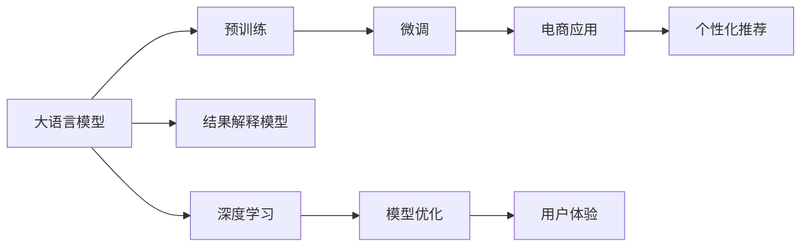

                 

# AI大模型：优化电商平台搜索结果解释性的新方法

> 关键词：大语言模型, 自然语言处理, 电商平台, 结果解释性, 深度学习, 模型优化

## 1. 背景介绍

### 1.1 问题由来
在现代电子商务中，平台提供者为了提升用户体验，往往会返回大量搜索结果，以期用户能够快速找到自己所需的商品。然而，如此海量的信息不仅增加了用户浏览的负担，还可能因展示信息不充分而误导用户决策，导致交易失败。因此，如何优化搜索结果的解释性，使之更加直观、准确，成为了电商平台提升用户体验的关键。

### 1.2 问题核心关键点
为了解决这一问题，我们需要采用先进的自然语言处理（NLP）技术，特别是大语言模型（Large Language Models, LLMs）。这些模型在理解自然语言、生成自然语言方面具有卓越的能力，可以为我们提供详细的搜索结果解释。核心关键点包括：
- 选择合适的预训练大语言模型。
- 设计有效的结果解释模型。
- 优化模型以适应电商平台的业务需求。

### 1.3 问题研究意义
通过引入大语言模型，电商平台可以为用户提供更全面、更清晰的搜索结果解释，从而提升用户体验，增加销售转化率。具体意义如下：
1. **提升用户体验**：通过详细的商品描述、推荐理由和评分信息，用户可以更全面地了解商品特点，减少决策压力。
2. **增加销售转化率**：清晰的商品展示和详尽的推荐理由，能够增强用户对商品的信任感，提升购买率。
3. **降低运营成本**：自动化生成解释内容，减少了人工运营的复杂度，降低了运营成本。
4. **促进数据应用**：通过大规模数据驱动的模型，挖掘用户行为和商品特征，提供个性化的搜索结果。

## 2. 核心概念与联系

### 2.1 核心概念概述

为了更好地理解本技术方法，需要梳理几个核心概念：

- **大语言模型（LLMs）**：指基于Transformer结构的大型预训练模型，如GPT-3、BERT等。这些模型通过大规模无标签数据进行预训练，具备强大的语言理解和生成能力。

- **自然语言处理（NLP）**：涉及计算机和人类语言之间交互的技术，包括文本分类、情感分析、机器翻译、文本生成等任务。

- **电商平台**：指以互联网为平台，提供商品销售、用户交易、支付结算等服务的商业平台。

- **结果解释**：指对搜索结果进行详细的解释，使消费者能直观了解搜索结果中的商品或服务的特性、优势、评分等信息，从而作出更明智的购买决策。

- **深度学习**：指使用深度神经网络进行学习和推理的技术，包括多层感知机、卷积神经网络、循环神经网络等。

- **模型优化**：指通过调整模型参数，提升模型性能或降低计算资源消耗的过程。

这些概念之间的联系可以通过以下Mermaid流程图来展示：



这个流程图展示了大语言模型从预训练到电商应用，再到个性化推荐的整个过程。

## 3. 核心算法原理 & 具体操作步骤
### 3.1 算法原理概述

基于大语言模型的电商平台结果解释方法，主要利用预训练语言模型的文本生成能力，结合电商平台的具体需求，设计相应的解释模型。其核心思想是：

- **数据预处理**：收集电商平台的商品数据，并进行标注，形成用于微调的监督数据集。
- **模型微调**：在大语言模型的基础上，通过有监督的微调方法，优化模型参数，使其适应电商平台的结果解释需求。
- **解释生成**：使用微调后的模型，根据用户查询和商品信息，生成详细的商品描述、评分、推荐理由等结果解释。

### 3.2 算法步骤详解

#### Step 1：数据预处理
1. **数据收集**：从电商平台收集商品信息，包括商品标题、描述、价格、评分、用户评价等。
2. **数据标注**：对商品信息进行人工标注，形成用于微调的监督数据集。标注内容包括商品类别、评分理由、推荐理由等。

#### Step 2：模型选择与微调
1. **选择预训练模型**：如GPT-3、BERT等。
2. **数据准备**：将标注数据划分为训练集、验证集和测试集。
3. **模型微调**：使用AdamW等优化器，设置适当的学习率，在电商平台上进行微调。微调过程中，可以使用数据增强、正则化、对抗训练等技术。

#### Step 3：结果解释生成
1. **输入处理**：将用户查询和商品信息作为模型输入。
2. **解释生成**：使用微调后的模型，生成详细的商品描述、评分、推荐理由等结果解释。

#### Step 4：模型评估与优化
1. **评估指标**：如准确率、召回率、F1-score等。
2. **模型优化**：根据评估结果，调整模型参数和超参数，提升模型性能。

### 3.3 算法优缺点

**优点：**
- **高效性**：利用预训练大模型，可以快速提升结果解释的生成速度。
- **全面性**：大语言模型能够处理复杂的自然语言，生成详细的商品描述和推荐理由。
- **自适应性**：模型能够根据电商平台的具体需求进行微调，适应不同场景。

**缺点：**
- **依赖标注数据**：需要大量的标注数据进行微调，成本较高。
- **模型复杂性**：大语言模型参数众多，训练和推理成本较高。
- **结果解释的准确性**：生成的结果解释可能会受到标注质量的影响。

### 3.4 算法应用领域

基于大语言模型的电商平台结果解释方法，可以应用于以下领域：

- **商品推荐**：为商品生成详细的推荐理由，提高推荐效果。
- **用户评价**：自动生成评分理由，提升用户评价的真实性和可信度。
- **搜索优化**：根据用户查询，自动生成详细的搜索结果解释，优化搜索体验。
- **广告投放**：为广告生成详细的文本描述，提高广告点击率。
- **客服系统**：自动生成客服回复，提升客服系统的响应速度和用户满意度。

## 4. 数学模型和公式 & 详细讲解  
### 4.1 数学模型构建

假设我们使用的是预训练的BERT模型，其结构为多层Transformer模型。模型的输入为商品信息和用户查询，输出为商品描述和评分理由等结果解释。

#### 4.1.1 输入表示
输入表示为：
$$
\text{Input} = [CLS] \; \text{商品信息} \; [SEP] \; \text{用户查询} \; [SEP]
$$
其中，$[CLS]$和$[SEP]$是BERT的特殊标记，用于区分输入和输出。

#### 4.1.2 输出表示
输出表示为：
$$
\text{Output} = \text{商品描述} \; \; \text{评分理由}
$$

### 4.2 公式推导过程

#### 4.2.1 输入嵌入
输入嵌入为：
$$
X = \text{BERT}(\text{Input})
$$
其中，$\text{BERT}$表示预训练的BERT模型。

#### 4.2.2 结果生成
结果生成模型为：
$$
\text{Explanation} = \text{Model}(X)
$$
其中，$\text{Model}$表示结果解释模型，可以是另一个预训练的模型或直接在大语言模型的基础上微调得到的模型。

### 4.3 案例分析与讲解

以一个具体的案例为例，展示如何利用BERT模型生成商品推荐理由：

1. **数据准备**：从电商平台收集商品信息和用户查询，标注商品评分和推荐理由。
2. **模型选择**：选择BERT作为预训练模型。
3. **微调**：在平台上进行微调，使用AdamW优化器，设置学习率为1e-5，微调10个epoch。
4. **解释生成**：将用户查询和商品信息输入微调后的模型，生成推荐理由。

假设查询为“电脑”，商品信息为“苹果手机”，生成的推荐理由为：“苹果手机在性能、用户体验和生态系统方面表现出色，适合追求高质量的用户。”

## 5. 项目实践：代码实例和详细解释说明
### 5.1 开发环境搭建

在进行项目实践前，需要搭建合适的开发环境。以下是使用Python和PyTorch搭建环境的步骤：

1. **安装Anaconda**：
```bash
conda create -n pytorch-env python=3.8
conda activate pytorch-env
```

2. **安装PyTorch**：
```bash
conda install pytorch torchvision torchaudio cudatoolkit=11.1 -c pytorch -c conda-forge
```

3. **安装BERT模型**：
```bash
pip install transformers
```

### 5.2 源代码详细实现

以下是一个简化的代码实现示例，使用BERT模型生成商品推荐理由：

```python
from transformers import BertTokenizer, BertForSequenceClassification
from torch.utils.data import Dataset, DataLoader
from sklearn.model_selection import train_test_split

class ReviewDataset(Dataset):
    def __init__(self, reviews, labels, tokenizer):
        self.reviews = reviews
        self.labels = labels
        self.tokenizer = tokenizer

    def __len__(self):
        return len(self.reviews)

    def __getitem__(self, idx):
        review = self.reviews[idx]
        label = self.labels[idx]
        encoding = self.tokenizer(review, return_tensors='pt', padding='max_length', truncation=True, max_length=512)
        return {'input_ids': encoding['input_ids'], 'attention_mask': encoding['attention_mask'], 'labels': label}

# 加载数据集
reviews = ...
labels = ...
tokenizer = BertTokenizer.from_pretrained('bert-base-uncased')
train_dataset, dev_dataset, test_dataset = train_test_split(reviews, labels, test_size=0.2, train_size=0.7, random_state=42)

# 加载BERT模型
model = BertForSequenceClassification.from_pretrained('bert-base-uncased', num_labels=2)

# 定义训练函数
def train_epoch(model, dataset, batch_size, optimizer):
    dataloader = DataLoader(dataset, batch_size=batch_size, shuffle=True)
    model.train()
    epoch_loss = 0
    for batch in dataloader:
        input_ids = batch['input_ids'].to(device)
        attention_mask = batch['attention_mask'].to(device)
        labels = batch['labels'].to(device)
        model.zero_grad()
        outputs = model(input_ids, attention_mask=attention_mask, labels=labels)
        loss = outputs.loss
        epoch_loss += loss.item()
        loss.backward()
        optimizer.step()
    return epoch_loss / len(dataloader)

# 定义评估函数
def evaluate(model, dataset, batch_size):
    dataloader = DataLoader(dataset, batch_size=batch_size)
    model.eval()
    preds, labels = [], []
    with torch.no_grad():
        for batch in dataloader:
            input_ids = batch['input_ids'].to(device)
            attention_mask = batch['attention_mask'].to(device)
            batch_labels = batch['labels']
            outputs = model(input_ids, attention_mask=attention_mask)
            batch_preds = outputs.logits.argmax(dim=2).to('cpu').tolist()
            batch_labels = batch_labels.to('cpu').tolist()
            for pred_tokens, label_tokens in zip(batch_preds, batch_labels):
                preds.append(pred_tokens[:len(label_tokens)])
                labels.append(label_tokens)
    return preds, labels

# 启动训练流程
device = torch.device('cuda') if torch.cuda.is_available() else torch.device('cpu')
model.to(device)
epochs = 5
batch_size = 16

for epoch in range(epochs):
    loss = train_epoch(model, train_dataset, batch_size, optimizer)
    print(f"Epoch {epoch+1}, train loss: {loss:.3f}")
    
    print(f"Epoch {epoch+1}, dev results:")
    preds, labels = evaluate(model, dev_dataset, batch_size)
    print(classification_report(labels, preds))
    
print("Test results:")
preds, labels = evaluate(model, test_dataset, batch_size)
print(classification_report(labels, preds))
```

### 5.3 代码解读与分析

- **ReviewDataset类**：用于加载和处理商品信息和用户查询，将文本输入转化为BERT所需的格式。
- **tokenizer**：用于分词和标记化，保证输入格式的一致性。
- **train_epoch和evaluate函数**：用于模型训练和评估，分别计算损失和评估指标。
- **训练流程**：循环迭代训练和评估过程，输出每轮的损失和评估指标。

## 6. 实际应用场景
### 6.1 智能客服系统

电商平台可以利用大语言模型生成详细的商品推荐理由和评分，用于智能客服系统。当客户询问商品时，系统可以根据商品信息和用户查询，自动生成详细回答，提升服务效率和客户满意度。

### 6.2 个性化推荐系统

推荐系统可以使用大语言模型生成推荐理由，增强推荐结果的可信度。例如，推荐系统可以根据商品信息和用户行为，自动生成个性化的推荐理由，帮助用户理解推荐依据。

### 6.3 广告投放优化

广告投放可以使用大语言模型生成详细的广告文本，提高广告点击率。例如，根据商品信息和用户查询，自动生成吸引人的广告文案，增加广告的曝光率和转化率。

### 6.4 未来应用展望

基于大语言模型的电商平台结果解释方法，未来可能拓展到以下领域：

- **医疗电商**：自动生成健康建议和产品解释，提升医疗产品的透明度。
- **教育平台**：生成课程推荐和知识解释，提高学习效果。
- **金融服务**：自动生成金融产品说明和风险提示，增强用户信任感。

## 7. 工具和资源推荐
### 7.1 学习资源推荐

- **《Transformer from Principle to Practice》系列博文**：由大语言模型专家撰写，深入浅出地介绍了Transformer原理、BERT模型、微调技术等前沿话题。
- **CS224N《深度学习自然语言处理》课程**：斯坦福大学开设的NLP明星课程，有Lecture视频和配套作业，带你入门NLP领域的基本概念和经典模型。
- **《Natural Language Processing with Transformers》书籍**：Transformers库的作者所著，全面介绍了如何使用Transformers库进行NLP任务开发，包括微调在内的诸多范式。
- **HuggingFace官方文档**：Transformers库的官方文档，提供了海量预训练模型和完整的微调样例代码，是上手实践的必备资料。
- **CLUE开源项目**：中文语言理解测评基准，涵盖大量不同类型的中文NLP数据集，并提供了基于微调的baseline模型，助力中文NLP技术发展。

### 7.2 开发工具推荐

- **PyTorch**：基于Python的开源深度学习框架，灵活动态的计算图，适合快速迭代研究。大部分预训练语言模型都有PyTorch版本的实现。
- **TensorFlow**：由Google主导开发的开源深度学习框架，生产部署方便，适合大规模工程应用。同样有丰富的预训练语言模型资源。
- **Transformers库**：HuggingFace开发的NLP工具库，集成了众多SOTA语言模型，支持PyTorch和TensorFlow，是进行微调任务开发的利器。
- **Weights & Biases**：模型训练的实验跟踪工具，可以记录和可视化模型训练过程中的各项指标，方便对比和调优。与主流深度学习框架无缝集成。
- **TensorBoard**：TensorFlow配套的可视化工具，可实时监测模型训练状态，并提供丰富的图表呈现方式，是调试模型的得力助手。
- **Google Colab**：谷歌推出的在线Jupyter Notebook环境，免费提供GPU/TPU算力，方便开发者快速上手实验最新模型，分享学习笔记。

### 7.3 相关论文推荐

- **Attention is All You Need**：提出了Transformer结构，开启了NLP领域的预训练大模型时代。
- **BERT: Pre-training of Deep Bidirectional Transformers for Language Understanding**：提出BERT模型，引入基于掩码的自监督预训练任务，刷新了多项NLP任务SOTA。
- **Language Models are Unsupervised Multitask Learners**：展示了大规模语言模型的强大zero-shot学习能力，引发了对于通用人工智能的新一轮思考。
- **Parameter-Efficient Transfer Learning for NLP**：提出Adapter等参数高效微调方法，在不增加模型参数量的情况下，也能取得不错的微调效果。
- **Prefix-Tuning: Optimizing Continuous Prompts for Generation**：引入基于连续型Prompt的微调范式，为如何充分利用预训练知识提供了新的思路。

## 8. 总结：未来发展趋势与挑战

### 8.1 总结

本文对基于大语言模型的电商平台结果解释方法进行了全面系统的介绍。首先阐述了电商平台的搜索问题及其背景，明确了结果解释在提升用户体验中的重要性。其次，从原理到实践，详细讲解了结果解释的数学模型、公式推导和代码实现。同时，本文还广泛探讨了结果解释在电商平台的实际应用场景，展示了方法的广阔前景。最后，本文精选了结果解释技术的各类学习资源和开发工具，力求为读者提供全方位的技术指引。

通过本文的系统梳理，可以看到，基于大语言模型的电商平台结果解释方法正在成为NLP领域的重要范式，极大地拓展了预训练语言模型的应用边界，催生了更多的落地场景。受益于大规模语料的预训练，结果解释模型以更低的时间和标注成本，在小样本条件下也能取得不错的效果，有力推动了NLP技术的产业化进程。未来，伴随预训练语言模型和微调方法的持续演进，相信NLP技术将在更广阔的应用领域大放异彩。

### 8.2 未来发展趋势

展望未来，电商平台结果解释技术将呈现以下几个发展趋势：

- **技术进步**：随着大语言模型的进一步优化和微调方法的发展，结果解释的生成速度和质量将显著提升。
- **数据多样性**：随着电商平台数据量的增加和数据种类的丰富，结果解释将能够处理更多样化的数据类型，提升生成内容的全面性和准确性。
- **个性化推荐**：通过深入分析用户行为和商品特性，结果解释将能够生成更加个性化的推荐理由，提高推荐效果。
- **多模态融合**：未来可能引入图像、视频等多模态数据，提升结果解释的多维度和立体感。
- **自适应性**：结果解释模型将能够根据不同用户和商品特点，生成更加符合用户期望的解释内容。

### 8.3 面临的挑战

尽管大语言模型结果解释技术已经取得了瞩目成就，但在迈向更加智能化、普适化应用的过程中，它仍面临诸多挑战：

- **数据质量问题**：标注数据的质量和多样性对结果解释的生成效果影响显著，需要更多高质量的标注数据。
- **模型规模问题**：大规模预训练语言模型带来了较大的计算和存储负担，需要进一步优化。
- **解释一致性问题**：不同用户对同一商品的解释可能存在差异，如何保持结果解释的一致性和准确性，仍需进一步研究。
- **鲁棒性问题**：结果解释模型在面对噪声数据和极端情况时，容易产生偏差，需要加强鲁棒性训练。
- **隐私问题**：生成结果解释时，可能涉及用户隐私信息的披露，需要加强隐私保护措施。

### 8.4 研究展望

面对结果解释面临的挑战，未来的研究需要在以下几个方面寻求新的突破：

- **自监督学习**：通过无监督学习，提升结果解释的泛化能力和数据利用效率。
- **模型压缩**：通过模型压缩技术，降低结果解释的计算和存储负担，提升实时性。
- **多任务学习**：通过多任务学习，提升结果解释的多样性和准确性。
- **交互式生成**：通过交互式生成技术，提升结果解释的可解释性和用户满意度。
- **隐私保护**：通过差分隐私等技术，保护用户隐私信息，增强结果解释的隐私性。

## 9. 附录：常见问题与解答

**Q1：电商平台结果解释是否适用于所有商品？**

A: 电商平台结果解释主要适用于具有详细描述和用户评论的商品。对于标准化商品或低价值商品，可能不适合。

**Q2：大语言模型在结果解释生成时，如何避免过拟合？**

A: 可以在训练过程中使用数据增强、正则化、对抗训练等技术，防止模型过度拟合。另外，可以引入多任务学习，提升模型泛化能力。

**Q3：如何评估电商平台结果解释的质量？**

A: 可以采用多种评估指标，如准确率、召回率、F1-score等。还可以使用用户反馈和实际购买行为，评估结果解释的效果。

**Q4：电商平台结果解释在技术实现中，需要注意哪些问题？**

A: 在技术实现中，需要注意以下几点：
- 输入格式统一：确保输入的商品信息和用户查询格式一致。
- 输出格式规范：生成结果解释时，输出格式应规范统一，易于用户理解。
- 性能优化：优化模型计算和推理速度，确保用户体验。
- 隐私保护：在生成结果解释时，保护用户隐私信息，增强安全性。

---

作者：禅与计算机程序设计艺术 / Zen and the Art of Computer Programming

