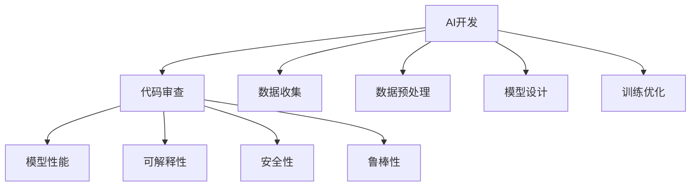

                 

# AI开发的代码审查：Lepton AI的质量控制

## 1. 背景介绍

### 1.1 问题由来
随着人工智能（AI）技术的快速发展和广泛应用，AI开发项目变得越来越复杂，涉及多个团队和大量代码。如何保证代码的质量和可维护性，成为了项目管理中的重要议题。AI代码的审查不只关注传统的代码逻辑和结构问题，还涉及模型的性能、解释性、安全性等方面。

在AI开发中，代码审查不仅是保证代码质量的重要环节，还是提升团队协作效率、确保项目顺利进行的关键。但传统的代码审查方法往往难以兼顾AI的独特特性，无法全面覆盖AI代码的各个方面。

### 1.2 问题核心关键点
AI代码审查的核心在于其多层次、多维度的质量控制需求。除了常见的代码质量、可维护性、可扩展性等指标外，还需要特别关注模型的性能、可解释性、安全性、鲁棒性等方面。

具体来说，AI代码审查的目标包括：
1. 保证模型的准确性和鲁棒性，避免模型在实际应用中出现错误。
2. 提升模型的可解释性，使开发者和用户能够理解模型的决策过程。
3. 确保模型的安全性，避免模型被恶意利用。
4. 维护代码的简洁性和可读性，方便后续的维护和扩展。

## 2. 核心概念与联系

### 2.1 核心概念概述

为更好地理解AI代码审查的方法，本节将介绍几个密切相关的核心概念：

- **AI开发**：指通过算法和模型训练，实现特定任务的人工智能应用过程。AI开发包括数据收集、数据预处理、模型设计、训练优化等多个环节。
- **代码审查**：指对代码进行检查和评估的过程，确保代码符合预定的质量标准和规范。代码审查可以发现代码中的错误、提高代码质量、促进团队协作。
- **模型性能**：指模型在特定任务上的预测精度、推理速度等指标。模型性能是AI应用的核心评价指标之一。
- **可解释性**：指模型决策过程的透明度和可理解性。高可解释性的模型有助于开发者和用户对模型的理解和信任。
- **安全性**：指模型在实际应用中的安全性，包括对抗攻击、隐私保护等方面。安全性是AI应用中不可忽视的重要因素。
- **鲁棒性**：指模型在不同场景下的稳定性和适应性，避免模型在特定条件下失效或出现异常行为。

这些核心概念之间的逻辑关系可以通过以下Mermaid流程图来展示：



这个流程图展示了大语言模型的核心概念及其之间的关系：

1. AI开发通过数据收集、数据预处理、模型设计、训练优化等步骤，最终得到可用的AI应用。
2. 代码审查在AI开发的各个环节中，对代码进行质量评估，确保最终产品的稳定性和可靠性。
3. 代码审查不仅关注代码本身，还关注模型的多个性能指标，确保模型在实际应用中的表现。
4. 可解释性、安全性、鲁棒性是模型性能的重要组成部分，需要与代码审查一同进行评估。

这些概念共同构成了AI开发的全面质量控制体系，确保AI应用能够安全、可靠地服务于用户。

## 3. 核心算法原理 & 具体操作步骤

### 3.1 算法原理概述

AI代码审查的核心算法原理是结合代码质量和模型性能的双重考量。通过对代码进行静态分析和动态测试，结合模型在特定任务上的表现，进行全面的质量评估。

具体来说，AI代码审查的算法原理包括：
1. **静态分析**：通过分析代码的语法、结构、风格等方面，发现潜在的问题和改进点。
2. **动态测试**：在模型训练和推理过程中，通过模拟各种测试场景，评估模型的性能和鲁棒性。
3. **模型验证**：对模型在特定任务上的表现进行验证，确保模型的准确性和泛化能力。
4. **代码审查**：结合静态分析和动态测试的结果，对代码进行综合评估，确保代码符合质量标准。

### 3.2 算法步骤详解

AI代码审查的算法步骤一般包括以下几个关键步骤：

**Step 1: 数据收集与预处理**
- 收集AI开发项目的源代码、模型参数、训练日志、测试数据等，确保审查有足够的依据。
- 对数据进行清洗、标注和预处理，以便后续的分析和评估。

**Step 2: 代码静态分析**
- 使用代码审查工具，如CodeQL、SonarQube等，对代码进行语法检查、风格检查、代码重构、复杂度分析等。
- 识别代码中的潜在问题和改进点，如内存泄漏、死循环、函数重复等。

**Step 3: 模型动态测试**
- 设计各种测试场景，模拟实际应用中的数据分布和任务类型。
- 对模型进行前向推理和后向传播，评估模型的推理速度、精度、鲁棒性等性能指标。
- 使用对抗样本测试模型的鲁棒性，确保模型在不同条件下都能保持稳定。

**Step 4: 模型验证**
- 使用交叉验证、独立测试集等方法，对模型在特定任务上的性能进行验证。
- 评估模型的泛化能力，确保模型在不同数据集上都能保持较高的准确性。
- 分析模型的预测误差和偏差，发现模型中的潜在问题。

**Step 5: 代码审查**
- 结合静态分析和动态测试的结果，对代码进行全面的审查。
- 检查代码中的逻辑错误、不合理的数据处理、不规范的编码习惯等。
- 对模型代码进行质量评估，确保模型代码的可读性、可维护性和可扩展性。

**Step 6: 提出改进建议**
- 根据审查结果，提出改进建议，如代码优化、模型改进、安全加固等。
- 确保所有改进建议都得到了实施，并进行了后续的验证和测试。

### 3.3 算法优缺点

AI代码审查方法具有以下优点：
1. **全面覆盖**：结合代码质量和模型性能的审查，能够全面覆盖AI应用的各个方面，确保代码和模型的质量。
2. **提前发现问题**：在开发早期进行审查，能够提前发现和修复潜在问题，避免在后期修复带来的额外成本。
3. **提升团队协作**：代码审查促进了团队之间的交流和协作，帮助团队成员理解彼此的工作，提高协作效率。
4. **标准化流程**：通过规范化的审查流程，能够提高项目的标准化程度，确保项目的顺利进行。

但该方法也存在一定的局限性：
1. **成本高**：代码审查和模型验证需要耗费大量时间和资源，增加了项目的开发成本。
2. **依赖人力**：代码审查的效果依赖于审查人员的经验和专业水平，不同的人对同一代码的审查结果可能不同。
3. **复杂度高**：AI代码审查涉及多层次、多维度的质量评估，审查复杂度较高，对审查人员的要求也较高。
4. **工具限制**：现有的代码审查工具和模型验证工具可能无法全面覆盖AI代码的所有方面，需要结合人工审查进行补充。

尽管存在这些局限性，但AI代码审查仍然是一种行之有效的质量控制方法，在AI开发项目中得到了广泛应用。

### 3.4 算法应用领域

AI代码审查方法在AI开发项目的各个环节都有应用，主要包括：

1. **项目启动阶段**：在项目启动阶段进行代码审查，确保项目初期代码的质量和规范性，为后续开发奠定基础。
2. **模型设计阶段**：在设计阶段进行代码审查，确保模型设计的合理性和可行性。
3. **模型训练阶段**：在模型训练阶段进行代码审查，确保模型的训练过程符合规范，避免潜在的错误。
4. **模型评估阶段**：在模型评估阶段进行代码审查，确保模型的性能和鲁棒性符合要求。
5. **模型部署阶段**：在模型部署阶段进行代码审查，确保模型的部署过程符合规范，避免部署错误。

## 4. 数学模型和公式 & 详细讲解  
### 4.1 数学模型构建

本节将使用数学语言对AI代码审查的算法原理进行更加严格的刻画。

假设AI开发项目的代码库为 $C$，模型参数空间为 $W$，训练数据集为 $D$。定义代码审查的损失函数为 $\ell(C, W, D)$，用于衡量代码和模型在数据集 $D$ 上的综合表现。

在实践中，代码审查的损失函数可以分解为代码质量损失 $\ell_C(C)$ 和模型性能损失 $\ell_W(W, D)$ 两部分：

$$
\ell(C, W, D) = \alpha \ell_C(C) + (1-\alpha) \ell_W(W, D)
$$

其中 $\alpha$ 为代码质量权重，通常取值在 $0.5$ 到 $0.7$ 之间，确保模型性能和代码质量在审查中的平衡。

**代码质量损失** $\ell_C(C)$ 可以进一步分解为语法检查损失 $\ell_{Grammar}(C)$、风格检查损失 $\ell_{Style}(C)$、复杂度分析损失 $\ell_{Complexity}(C)$ 等：

$$
\ell_C(C) = \ell_{Grammar}(C) + \ell_{Style}(C) + \ell_{Complexity}(C) + \ldots
$$

**模型性能损失** $\ell_W(W, D)$ 可以进一步分解为模型精度损失 $\ell_{Accuracy}(W, D)$、推理速度损失 $\ell_{Speed}(W)$、对抗样本损失 $\ell_{Adversarial}(W)$ 等：

$$
\ell_W(W, D) = \ell_{Accuracy}(W, D) + \ell_{Speed}(W) + \ell_{Adversarial}(W) + \ldots
$$

通过上述分解，我们可以更加清晰地理解AI代码审查的数学模型构建过程。

### 4.2 公式推导过程

以代码质量损失中的语法检查损失为例，推导其具体形式。

假设代码库 $C$ 中的代码 $c$ 包含 $n$ 个代码片段，每个代码片段 $c_i$ 的长度为 $l_i$，语法检查工具检测到 $n_i$ 个语法错误，每个错误的严重程度为 $s_i$。语法检查损失可以表示为：

$$
\ell_{Grammar}(C) = \frac{1}{n} \sum_{i=1}^n \log \left(1 + \frac{1}{s_i}\right) \cdot n_i
$$

其中 $\log$ 为自然对数。该公式通过加权求和的方式，对代码库中的语法错误进行评估，对严重错误给予更高的权重。

### 4.3 案例分析与讲解

以AI代码审查中的模型性能损失为例，展示其计算过程。

假设模型参数为 $W$，训练数据集为 $D$，模型在数据集 $D$ 上的精度为 $P(W, D)$，推理速度为 $V(W)$，对抗样本防御能力为 $A(W)$。模型性能损失可以表示为：

$$
\ell_{Accuracy}(W, D) = (1-P(W, D))
$$

$$
\ell_{Speed}(W) = \frac{V(W)}{V_{max}}
$$

$$
\ell_{Adversarial}(W) = 1-A(W)
$$

其中 $P(W, D)$ 为模型在数据集 $D$ 上的精度，$V(W)$ 为模型推理速度，$V_{max}$ 为推理速度上限，$A(W)$ 为模型对抗样本防御能力。通过上述公式，可以全面评估模型的性能和鲁棒性。

## 5. 项目实践：代码实例和详细解释说明

### 5.1 开发环境搭建

在进行AI代码审查的实践前，我们需要准备好开发环境。以下是使用Python进行PyTorch开发的环境配置流程：

1. 安装Anaconda：从官网下载并安装Anaconda，用于创建独立的Python环境。

2. 创建并激活虚拟环境：
```bash
conda create -n pytorch-env python=3.8 
conda activate pytorch-env
```

3. 安装PyTorch：根据CUDA版本，从官网获取对应的安装命令。例如：
```bash
conda install pytorch torchvision torchaudio cudatoolkit=11.1 -c pytorch -c conda-forge
```

4. 安装TensorFlow：
```bash
conda install tensorflow -c tensorflow
```

5. 安装TensorBoard：
```bash
pip install tensorboard
```

6. 安装nvidia-docker：
```bash
curl -L https://nvidia.github.io/nvidia-docker/gpgkey | apt-key add -
curl -L https://nvidia.github.io/nvidia-docker/ubuntu17.04/x86_64/nvidia-docker.list | sudo tee /etc/apt/sources.list.d/nvidia-docker.list
sudo apt-get update
sudo apt-get install -y nvidia-docker2
```

完成上述步骤后，即可在`pytorch-env`环境中开始AI代码审查的实践。

### 5.2 源代码详细实现

下面我们以代码静态分析中的语法检查为例，给出使用Grammarly进行Python代码语法检查的PyTorch代码实现。

首先，安装并配置Grammarly：

```bash
pip install grammarly
grammarly update
```

然后，定义Python代码审查函数：

```python
import grammarly

def check_code(code):
    grammar = grammarly.load()
    errors = grammar.check(code)
    
    total_errors = sum([error['severity'] == 'Error' for error in errors])
    error_list = [error['message'] for error in errors if error['severity'] == 'Error']
    
    return total_errors, error_list
```

最后，测试语法检查函数：

```python
code = """
def multiply(x, y):
    result = x * y
    return result
"""

errors, error_list = check_code(code)
print(f"Total errors: {errors}")
for error in error_list:
    print(f"Error: {error}")
```

这段代码实现了使用Grammarly进行Python代码语法检查的功能，可以检查代码中的语法错误，并返回错误数量和具体错误信息。

### 5.3 代码解读与分析

让我们再详细解读一下关键代码的实现细节：

**check_code函数**：
- 首先，通过`grammarly.load()`方法加载Grammarly检查器。
- 然后，通过`grammar.check(code)`方法检查代码，返回错误列表。
- 接着，遍历错误列表，统计严重为"Error"的错误数量，并将错误信息存储到`error_list`中。
- 最后，返回错误数量和错误信息列表。

**Python代码**：
- 定义了一个简单的Python函数`multiply`，用于计算两个数的乘积。
- 在测试代码中，定义了一段Python代码，并调用`check_code`函数进行语法检查。
- 输出错误数量和具体的错误信息。

可以看出，使用Grammarly进行Python代码语法检查，能够自动化地发现代码中的语法错误，极大地提高了代码审查的效率和准确性。

## 6. 实际应用场景

### 6.1 智能客服系统

在智能客服系统中，代码审查对于确保系统的稳定性和安全性至关重要。智能客服系统需要处理大量的用户请求，并及时给出准确的回复。代码审查可以确保系统代码的健壮性和正确性，避免因为代码错误导致的系统崩溃或安全漏洞。

通过代码审查，能够发现并修复系统中可能存在的逻辑错误、内存泄漏、异常处理不当等问题，确保系统的稳定运行。同时，代码审查还能够发现系统中可能存在的安全漏洞，如SQL注入、跨站脚本攻击等，确保系统的安全性。

### 6.2 金融交易系统

在金融交易系统中，代码审查对于系统的正确性和可靠性要求极高。金融交易系统涉及到大量的资金交易，任何一个小的错误都可能导致严重的财务损失。

通过代码审查，能够确保系统代码的正确性，避免因为代码错误导致的交易异常。同时，代码审查还能够发现系统中可能存在的安全漏洞，如跨站请求伪造、敏感信息泄露等，确保系统的安全性。

### 6.3 医疗诊断系统

在医疗诊断系统中，代码审查对于系统的可靠性和可解释性要求极高。医疗诊断系统涉及到患者的生命健康，任何一个小的错误都可能导致严重的医疗事故。

通过代码审查，能够确保系统代码的健壮性和正确性，避免因为代码错误导致的诊断错误。同时，代码审查还能够发现系统中可能存在的安全漏洞，如敏感信息泄露、用户认证漏洞等，确保系统的安全性。

### 6.4 未来应用展望

随着AI技术的不断发展和应用，AI代码审查的需求将越来越迫切。未来，AI代码审查将在以下几个方面得到广泛应用：

1. **自动化代码审查**：结合机器学习和自然语言处理技术，自动化进行代码审查，提高审查效率和准确性。
2. **模型性能评估**：结合模型验证技术，全面评估AI模型的性能和鲁棒性，确保模型的可靠性。
3. **安全漏洞检测**：结合安全漏洞扫描技术，及时发现和修复系统中的安全漏洞，确保系统的安全性。
4. **代码质量提升**：通过代码优化和重构，提升代码的可读性和可维护性，提高开发效率。

## 7. 工具和资源推荐

### 7.1 学习资源推荐

为了帮助开发者系统掌握AI代码审查的理论基础和实践技巧，这里推荐一些优质的学习资源：

1. **《Python代码审查与测试》书籍**：详细介绍了Python代码审查和测试的方法和工具，是掌握代码审查技巧的重要参考。
2. **《机器学习实战》课程**：由斯坦福大学提供，系统讲解了机器学习模型的构建和验证方法，是了解模型性能评估的基础。
3. **Grammarly官方文档**：Grammarly的官方文档，提供了详细的语法检查方法和API接口，是进行代码审查的必备资源。
4. **SonarQube官方文档**：SonarQube的官方文档，提供了全面的代码审查和质量管理工具，是进行代码审查的重要参考。

通过这些资源的学习实践，相信你一定能够快速掌握AI代码审查的精髓，并用于解决实际的AI开发问题。

### 7.2 开发工具推荐

高效的开发离不开优秀的工具支持。以下是几款用于AI代码审查开发的常用工具：

1. **Grammarly**：提供语法检查、风格检查、代码质量分析等功能，适用于Python代码的语法检查。
2. **SonarQube**：提供全面的代码审查和质量管理功能，适用于多种编程语言和框架的代码审查。
3. **Coverity**：提供代码审查、漏洞检测、测试覆盖率分析等功能，适用于大型企业的代码质量管理。
4. **TensorBoard**：提供模型训练和性能评估的可视化功能，适用于模型验证和性能评估。
5. **JIRA**：提供项目管理和代码审查的集成功能，适用于敏捷开发环境下的代码审查。

合理利用这些工具，可以显著提升AI代码审查的开发效率，加快创新迭代的步伐。

### 7.3 相关论文推荐

AI代码审查技术的发展源于学界的持续研究。以下是几篇奠基性的相关论文，推荐阅读：

1. **《基于模型的代码审查方法》**：提出了一种基于模型的代码审查方法，利用机器学习模型预测代码质量，提高了代码审查的效率和准确性。
2. **《一种自动化代码审查系统》**：介绍了一种自动化代码审查系统，结合静态分析和动态测试，全面评估代码质量。
3. **《一种基于对抗样本的代码审查方法》**：提出了一种基于对抗样本的代码审查方法，提高了代码审查的鲁棒性和安全性。
4. **《代码审查中的可解释性研究》**：讨论了代码审查中的可解释性问题，提出了一种基于因果图的方法，提升了代码审查的可解释性。

这些论文代表了大语言模型微调技术的发展脉络。通过学习这些前沿成果，可以帮助研究者把握学科前进方向，激发更多的创新灵感。

## 8. 总结：未来发展趋势与挑战

### 8.1 总结

本文对AI代码审查方法进行了全面系统的介绍。首先阐述了AI代码审查的背景和意义，明确了代码审查在保证代码质量、提升团队协作、确保项目顺利进行等方面的重要性。其次，从原理到实践，详细讲解了AI代码审查的数学模型构建、算法步骤详解，给出了代码审查任务开发的完整代码实例。同时，本文还广泛探讨了AI代码审查在智能客服、金融交易、医疗诊断等多个行业领域的应用前景，展示了代码审查范式的巨大潜力。此外，本文精选了代码审查技术的各类学习资源，力求为读者提供全方位的技术指引。

通过本文的系统梳理，可以看到，AI代码审查技术正在成为AI开发项目的重要范式，极大地提高了AI应用的稳定性和可靠性。未来，伴随代码审查方法的不断演进，相信AI开发项目将更加高效、可靠，AI应用也将更加普及和深入。

### 8.2 未来发展趋势

展望未来，AI代码审查技术将呈现以下几个发展趋势：

1. **自动化程度提升**：结合机器学习和自然语言处理技术，自动化进行代码审查，提高审查效率和准确性。
2. **深度融合**：与模型验证、安全漏洞检测、代码优化等技术深度融合，形成全面的质量控制体系。
3. **模型性能评估**：结合模型验证技术，全面评估AI模型的性能和鲁棒性，确保模型的可靠性。
4. **可解释性增强**：引入可解释性方法，提升代码审查的可解释性，增强开发者的理解和信任。
5. **多模态审查**：结合视觉、音频等多模态数据，进行全面的质量评估。

这些趋势凸显了AI代码审查技术的广阔前景，将进一步提升AI应用的稳定性和可靠性。

### 8.3 面临的挑战

尽管AI代码审查技术已经取得了显著进展，但在实际应用中仍面临一些挑战：

1. **资源消耗大**：AI代码审查需要耗费大量时间和资源，增加了项目的开发成本。
2. **审查难度高**：AI代码审查涉及多层次、多维度的质量评估，审查复杂度较高。
3. **工具局限性**：现有的代码审查工具和模型验证工具可能无法全面覆盖AI代码的所有方面。
4. **可解释性不足**：现有的代码审查方法缺乏可解释性，难以理解和调试代码审查结果。
5. **安全问题复杂**：AI代码审查中的安全问题复杂，难以通过自动化工具完全解决。

尽管存在这些挑战，但通过技术创新和持续改进，相信AI代码审查技术能够克服这些障碍，更好地服务于AI开发项目。

### 8.4 研究展望

面对AI代码审查所面临的挑战，未来的研究需要在以下几个方面寻求新的突破：

1. **结合机器学习**：结合机器学习技术，自动化进行代码审查，提高审查效率和准确性。
2. **深度融合安全**：结合安全漏洞检测技术，及时发现和修复系统中的安全漏洞。
3. **提升可解释性**：引入可解释性方法，提升代码审查的可解释性，增强开发者的理解和信任。
4. **引入多模态数据**：结合视觉、音频等多模态数据，进行全面的质量评估。

这些研究方向的探索，必将引领AI代码审查技术迈向更高的台阶，为构建稳定、可靠、可解释、可控的智能系统铺平道路。面向未来，AI代码审查技术还需要与其他人工智能技术进行更深入的融合，如知识表示、因果推理、强化学习等，多路径协同发力，共同推动自然语言理解和智能交互系统的进步。只有勇于创新、敢于突破，才能不断拓展AI代码审查的边界，让智能技术更好地造福人类社会。

## 9. 附录：常见问题与解答

**Q1：AI代码审查是否适用于所有AI开发项目？**

A: AI代码审查在大多数AI开发项目中都能取得不错的效果，特别是对于数据量较小的项目。但对于一些特定领域的项目，如医疗、法律等，仅仅依靠通用语料预训练的模型可能难以很好地适应。此时需要在特定领域语料上进一步预训练，再进行微调，才能获得理想效果。此外，对于一些需要时效性、个性化很强的项目，如对话、推荐等，微调方法也需要针对性的改进优化。

**Q2：如何选择合适的代码审查工具？**

A: 选择合适的代码审查工具需要考虑多个因素，包括开发语言、项目规模、审查需求等。对于Python代码，可以使用Grammarly、Pylint等工具进行语法检查和风格检查。对于Java代码，可以使用SonarQube、Checkstyle等工具进行静态分析和代码质量评估。对于大型项目，可以使用Coverity、JIRA等工具进行全面的代码审查和项目管理。

**Q3：如何进行代码审查的质量评估？**

A: 代码审查的质量评估通常包括以下几个方面：
1. **语法检查**：检查代码中的语法错误、拼写错误等。
2. **风格检查**：检查代码的风格和规范性，如缩进、命名规范等。
3. **复杂度分析**：检查代码的复杂度，避免代码过于复杂和难以维护。
4. **代码质量**：检查代码的可读性、可维护性、可扩展性等。
5. **性能评估**：检查代码的性能，如推理速度、模型精度等。
6. **安全漏洞**：检查代码的安全性，避免代码中的安全漏洞。

**Q4：如何进行代码审查的自动化？**

A: 代码审查的自动化可以通过以下几个步骤实现：
1. **静态分析**：使用静态分析工具，如Grammarly、SonarQube等，对代码进行语法检查、风格检查、复杂度分析等。
2. **动态测试**：使用动态测试工具，如TensorBoard、PyTorch等，对模型进行前向推理和后向传播，评估模型的性能和鲁棒性。
3. **模型验证**：使用模型验证工具，如Keras、TensorFlow等，对模型进行交叉验证、独立测试集验证等，确保模型的准确性和泛化能力。
4. **代码质量评估**：结合静态分析和动态测试的结果，使用可解释性方法，提升代码审查的可解释性，增强开发者的理解和信任。

这些步骤可以结合使用，形成完整的自动化代码审查流程，提高审查效率和准确性。

**Q5：如何进行代码审查的安全加固？**

A: 代码审查中的安全加固可以通过以下几个步骤实现：
1. **代码审计**：通过代码审计工具，如Grammarly、SonarQube等，发现和修复代码中的安全漏洞。
2. **漏洞扫描**：使用漏洞扫描工具，如Coverity、Nessus等，对代码进行全面的安全扫描，发现潜在的漏洞。
3. **安全加固**：根据审计和扫描结果，对代码进行安全加固，修复安全漏洞。
4. **安全测试**：使用安全测试工具，如OWASP ZAP、Burp Suite等，对代码进行安全测试，确保代码的安全性。

这些步骤可以结合使用，形成完整的安全加固流程，确保代码的安全性。

---

作者：禅与计算机程序设计艺术 / Zen and the Art of Computer Programming

