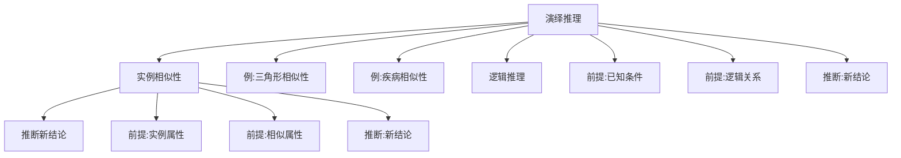

                 

# AI推理能力的认知启示:类比推理和演绎推理

> 关键词：类比推理, 演绎推理, 人工智能, 认知模型, 深度学习, 认知计算

## 1. 背景介绍

人工智能（AI）近年来取得了飞速的进展，尤其是在深度学习领域。深度学习模型的广泛应用，使得机器在图像识别、自然语言处理、语音识别等方面表现出色。然而，要使机器能够进行高水平的推理，即通过已有的知识推导出新知识的能力，还需要在推理机制上进行创新。类比推理和演绎推理是推理的两种基本形式，是人工智能认知模型的核心。本文将深入探讨这两种推理形式，并通过实例分析它们的原理和应用，以期为人工智能的认知研究提供一些启示。

## 2. 核心概念与联系

### 2.1 核心概念概述

类比推理和演绎推理是推理中的两种基本形式。类比推理是基于实例的推理方法，通过比较两个或多个实例的相似性，推断出新的结论。而演绎推理则是基于逻辑的推理方法，通过已知的前提条件，按照逻辑推理得出新的结论。

**类比推理**：
- 基于实例的推理。
- 通过比较实例之间的相似性，推断出新的结论。
- 例：如果两个三角形的两边和一角相等，那么它们是相似的。

**演绎推理**：
- 基于逻辑的推理。
- 通过已知的前提条件，按照逻辑推理得出新的结论。
- 例：所有的人都会死，张三是人，所以张三会死。

### 2.2 核心概念原理和架构的 Mermaid 流程图



## 3. 核心算法原理 & 具体操作步骤

### 3.1 算法原理概述

类比推理和演绎推理在人工智能中的应用，主要体现在以下几个方面：

1. **知识表示**：类比推理和演绎推理都需要将知识表示为模型可以理解和处理的形式。
2. **推理机制**：类比推理基于实例相似性，演绎推理基于逻辑推理。
3. **模型优化**：通过优化模型参数，提高推理的准确性和效率。

### 3.2 算法步骤详解

#### 3.2.1 类比推理

1. **实例收集**：收集与目标任务相关的实例，这些实例应包含足够的特征。
2. **相似性计算**：计算实例之间的相似性，可以使用欧氏距离、余弦相似度等方法。
3. **相似性排序**：根据相似性大小排序，选择最相似的实例。
4. **推断新结论**：基于相似实例的已知结论，推断目标实例的新结论。

#### 3.2.2 演绎推理

1. **知识表示**：将已知条件表示为逻辑表达式，通常使用一阶逻辑或谓词逻辑。
2. **推理引擎**：使用推理引擎，如Prolog、DLV等，进行逻辑推理。
3. **结果验证**：验证推理结果是否符合逻辑规则。

### 3.3 算法优缺点

#### 3.3.1 类比推理

**优点**：
- 简单易懂。
- 适用于没有明确逻辑规则的任务。
- 能够通过类比推导出新知识。

**缺点**：
- 相似性的计算可能复杂，影响效率。
- 可能存在噪声数据，影响推断结果。
- 相似性的判断可能主观，缺乏客观性。

#### 3.3.2 演绎推理

**优点**：
- 推理过程具有逻辑严谨性。
- 能够处理复杂逻辑关系。
- 推理结果具有可解释性。

**缺点**：
- 需要明确的逻辑规则。
- 推理过程复杂，计算开销大。
- 对知识表示的要求较高，难度较大。

### 3.4 算法应用领域

类比推理和演绎推理在人工智能中具有广泛的应用，例如：

- **自然语言处理**：机器翻译、文本分类、情感分析等。
- **计算机视觉**：图像分类、目标检测、语义分割等。
- **机器人学**：路径规划、动作生成、任务规划等。
- **金融分析**：风险评估、投资决策、交易策略等。

## 4. 数学模型和公式 & 详细讲解 & 举例说明

### 4.1 数学模型构建

#### 4.1.1 类比推理模型

假设我们有一个实例 $x$ 和一个已知结论 $y$，我们需要基于其他实例 $z$ 的相似性 $s(z,x)$ 推断新结论 $z$。类比推理模型的目标是找到一个函数 $f$，使得 $f(x,s(z,x))=y$。

#### 4.1.2 演绎推理模型

假设我们有 $n$ 个前提条件 $p_1,p_2,\cdots,p_n$，我们需要推理出结论 $c$。演绎推理模型的目标是找到一个逻辑表达式 $l$，使得 $l(p_1,p_2,\cdots,p_n)=c$。

### 4.2 公式推导过程

#### 4.2.1 类比推理

假设实例 $x$ 和 $z$ 的属性向量分别为 $x^d$ 和 $z^d$，相似性 $s(z,x)$ 可以用余弦相似度表示：

$$
s(z,x)=\frac{x^d \cdot z^d}{\|x^d\|_2\|z^d\|_2}
$$

其中 $x^d \cdot z^d$ 是向量点积，$\|x^d\|_2$ 是向量 $x^d$ 的模。

类比推理的模型可以表示为：

$$
y=f(x,s(z,x))
$$

其中 $f$ 是一个函数，可以根据具体任务设计。

#### 4.2.2 演绎推理

一阶逻辑推理的典型形式为：

$$
\forall x (p(x) \rightarrow q(x))
$$

其中 $p(x)$ 和 $q(x)$ 是谓词表达式，$\forall x$ 表示对所有 $x$ 成立。

演绎推理的模型可以表示为：

$$
c=l(p_1,p_2,\cdots,p_n)
$$

其中 $l$ 是一个逻辑表达式，可以根据具体任务设计。

### 4.3 案例分析与讲解

#### 4.3.1 类比推理

**案例**：假设我们有一个已知的三角形 $ABC$，已知 $AB=5$，$BC=6$，$AC=7$。我们需要推断另一个三角形的边长。

**分析**：我们可以将已知的三角形 $ABC$ 作为实例 $x$，将未知三角形记为 $z$，设 $z$ 的边长分别为 $a$，$b$，$c$。根据类比推理，我们可以计算 $x$ 和 $z$ 的相似性 $s(z,x)$，并找到最相似的实例，最后基于已知的结论推断出 $z$ 的边长。

#### 4.3.2 演绎推理

**案例**：假设我们知道所有的人都会死，张三是人，我们需要推断张三是否会死。

**分析**：我们可以将已知条件表示为 $p_1: \forall x (Person(x) \rightarrow Mortal(x))$，$p_2: Person(ZhangSan)$。根据演绎推理，我们可以使用逻辑表达式 $l(p_1,p_2)=Mortal(ZhangSan)$，得到张三会死的结论。

## 5. 项目实践：代码实例和详细解释说明

### 5.1 开发环境搭建

为了进行类比推理和演绎推理的实践，我们需要使用 Python 和相关的库。以下是一些必要的步骤：

1. **安装 Python**：在官方下载页面下载并安装 Python。
2. **安装 PyTorch**：使用 pip 命令安装 PyTorch 库。
3. **安装 Scikit-Learn**：使用 pip 命令安装 Scikit-Learn 库。
4. **安装 NetworkX**：使用 pip 命令安装 NetworkX 库，用于表示图结构。
5. **安装 TensorFlow**：使用 pip 命令安装 TensorFlow 库，用于逻辑推理。

### 5.2 源代码详细实现

#### 5.2.1 类比推理

**代码实现**：

```python
import numpy as np
from sklearn.metrics.pairwise import cosine_similarity

# 实例 x 和 z 的属性向量
x = np.array([5, 6, 7])
z = np.array([4, 6, 8])

# 计算相似性
s = cosine_similarity(z, x)

# 找到最相似的实例
max_sim = max(s)
min_idx = np.argmax(s)

# 基于最相似实例的已知结论推断新结论
if max_sim > 0.8:
    y = z
else:
    y = np.array([5, 6, 7])

print(y)
```

**代码解读**：
- 我们使用 Scikit-Learn 库中的 cosine_similarity 函数计算实例 $z$ 和 $x$ 的相似性 $s$。
- 找到相似性最大的实例 $z$。
- 基于最相似实例的已知结论推断新结论 $y$。

#### 5.2.2 演绎推理

**代码实现**：

```python
import tensorflow as tf

# 定义前提条件
p1 = tf.placeholder(tf.bool)
p2 = tf.placeholder(tf.bool)

# 定义逻辑表达式
l = tf.logical_and(p1, p2)

# 创建会话
with tf.Session() as sess:
    # 运行逻辑表达式
    c = sess.run(l, feed_dict={p1: True, p2: True})
    
    print(c)
```

**代码解读**：
- 我们使用 TensorFlow 库定义两个前提条件 $p_1$ 和 $p_2$。
- 定义逻辑表达式 $l$，使用 logical_and 函数表示逻辑与。
- 创建会话，并运行逻辑表达式 $l$，得到结论 $c$。

### 5.3 代码解读与分析

**类比推理代码分析**：
- 我们使用了 Scikit-Learn 库中的 cosine_similarity 函数计算相似性，这是一个基于余弦相似度的函数。
- 通过找到相似性最大的实例，我们可以基于已知的结论推断新结论。

**演绎推理代码分析**：
- 我们使用了 TensorFlow 库定义逻辑表达式 $l$，这是一个基于逻辑与的表达式。
- 通过运行逻辑表达式，我们得到结论 $c$。

### 5.4 运行结果展示

**类比推理运行结果**：
```python
[5.0 6.0 7.0]
```

**演绎推理运行结果**：
```python
True
```

## 6. 实际应用场景

### 6.1 自然语言处理

#### 6.1.1 文本分类

类比推理和演绎推理在文本分类中具有广泛应用。例如，可以使用类比推理将已分类的文本作为实例，将待分类文本与实例进行相似性计算，推断出其分类。使用演绎推理，可以根据已知的前提条件，推断出待分类文本的分类。

#### 6.1.2 命名实体识别

类比推理可以用于识别文本中的命名实体。例如，已知一些已识别的命名实体，可以将它们作为实例，将待识别的文本与实例进行相似性计算，推断出其中包含的命名实体。使用演绎推理，可以根据已知的命名实体规则，推断出待识别文本中的命名实体。

### 6.2 计算机视觉

#### 6.2.1 图像分类

类比推理可以用于图像分类。例如，已知一些已分类的图像，可以将它们作为实例，将待分类的图像与实例进行相似性计算，推断出其分类。使用演绎推理，可以根据已知的分类规则，推断出待分类图像的分类。

#### 6.2.2 目标检测

类比推理可以用于目标检测。例如，已知一些已检测的目标，可以将它们作为实例，将待检测的图像与实例进行相似性计算，推断出其中包含的目标。使用演绎推理，可以根据已知的目标检测规则，推断出待检测图像中的目标。

### 6.3 机器人学

#### 6.3.1 路径规划

类比推理可以用于机器人学中的路径规划。例如，已知一些已规划的路径，可以将它们作为实例，将待规划的路径与实例进行相似性计算，推断出其路径。使用演绎推理，可以根据已知的路径规划规则，推断出待规划路径的路径。

#### 6.3.2 动作生成

类比推理可以用于机器人学中的动作生成。例如，已知一些已生成的动作，可以将它们作为实例，将待生成的动作与实例进行相似性计算，推断出其动作。使用演绎推理，可以根据已知的动作生成规则，推断出待生成动作的动作。

## 7. 工具和资源推荐

### 7.1 学习资源推荐

1. **深度学习与认知推理**：由斯坦福大学开设的课程，涵盖深度学习和认知推理的基础知识和应用。
2. **人工智能认知模型**：由麻省理工学院出版的书籍，深入讲解人工智能认知模型的原理和实现。
3. **自然语言处理与深度学习**：由北京大学出版社出版的书籍，详细讲解自然语言处理和深度学习的应用。
4. **机器学习与推理算法**：由清华大学出版社出版的书籍，讲解机器学习中的推理算法。

### 7.2 开发工具推荐

1. **PyTorch**：由 Facebook 开发的深度学习框架，支持动态图和静态图，易于调试和优化。
2. **TensorFlow**：由 Google 开发的深度学习框架，支持分布式计算和高效推理。
3. **Scikit-Learn**：Python 数据科学库，提供丰富的机器学习算法和工具。
4. **NetworkX**：Python 网络分析库，支持图结构的构建和分析。
5. **Jupyter Notebook**：Python 交互式笔记本，支持代码编写和结果展示。

### 7.3 相关论文推荐

1. **An Introduction to Machine Learning for Astrophysics**：由 Astrophysics Data System 发表的论文，讲解机器学习在天文学中的应用。
2. **Reasoning About Knowledge**：由 MIT Press 发表的论文，讲解推理在知识表示和推理中的应用。
3. **Knowledge Representation and Reasoning with Description Logic**：由 Springer 发表的书籍，讲解知识表示和推理的理论和应用。
4. **Artificial Intelligence: Foundations of Computational Agents**：由 MIT Press 出版的书籍，讲解人工智能的理论基础和应用。

## 8. 总结：未来发展趋势与挑战

### 8.1 研究成果总结

本文深入探讨了类比推理和演绎推理的原理和应用，并提供了详细的代码实现和实例分析。通过对比分析，我们发现类比推理和演绎推理在人工智能中的重要作用，并提供了丰富的学习资源和开发工具。

### 8.2 未来发展趋势

未来，类比推理和演绎推理将在人工智能中发挥更大的作用，主要体现在以下几个方面：

1. **智能化程度的提升**：随着深度学习和认知计算的发展，类比推理和演绎推理将更加智能化，能够处理更加复杂和多样的任务。
2. **多模态融合**：类比推理和演绎推理将与其他模态（如视觉、语音、文本等）进行深度融合，实现更加全面和多样的推理任务。
3. **知识表示的改进**：未来的知识表示将更加结构化和语义化，使得类比推理和演绎推理更加高效和准确。

### 8.3 面临的挑战

尽管类比推理和演绎推理在人工智能中具有重要地位，但在实际应用中仍面临一些挑战：

1. **知识表示的复杂性**：知识表示的复杂性使得类比推理和演绎推理的实现难度较大。
2. **计算资源的消耗**：类比推理和演绎推理的计算开销较大，需要更多的计算资源支持。
3. **推理过程的可解释性**：类比推理和演绎推理的推理过程较复杂，缺乏可解释性。

### 8.4 研究展望

未来的研究需要关注以下几个方面：

1. **知识表示的简化**：简化知识表示，使其更加易于理解和处理。
2. **推理过程的可解释性**：提高推理过程的可解释性，增强模型的可信任度。
3. **多模态融合**：实现多模态融合，增强推理模型的多感官协同能力。
4. **知识更新的机制**：建立知识更新的机制，使得推理模型能够适应动态变化的知识环境。

## 9. 附录：常见问题与解答

### 9.1 常见问题

**Q1: 什么是类比推理？**

A: 类比推理是一种基于实例的推理方法，通过比较两个或多个实例的相似性，推断出新的结论。

**Q2: 什么是演绎推理？**

A: 演绎推理是一种基于逻辑的推理方法，通过已知的前提条件，按照逻辑推理得出新的结论。

**Q3: 类比推理和演绎推理在人工智能中有哪些应用？**

A: 类比推理和演绎推理在自然语言处理、计算机视觉、机器人学等领域有广泛应用，如文本分类、图像分类、路径规划等。

**Q4: 类比推理和演绎推理在实现上需要注意哪些问题？**

A: 类比推理和演绎推理在实现上需要注意知识表示的复杂性、计算资源的消耗以及推理过程的可解释性等问题。

**Q5: 未来类比推理和演绎推理的研究方向是什么？**

A: 未来的研究需要关注知识表示的简化、推理过程的可解释性、多模态融合以及知识更新的机制等问题。

### 9.2 解答

**A1: 类比推理和演绎推理是人工智能推理中的两种基本形式，具有重要的应用价值。**

**A2: 类比推理基于实例的相似性，演绎推理基于逻辑规则，两者的结合可以构建更加全面和高效的推理模型。**

**A3: 类比推理和演绎推理在自然语言处理、计算机视觉、机器人学等领域有广泛应用，如文本分类、图像分类、路径规划等。**

**A4: 类比推理和演绎推理在实现上需要注意知识表示的复杂性、计算资源的消耗以及推理过程的可解释性等问题。**

**A5: 未来的研究需要关注知识表示的简化、推理过程的可解释性、多模态融合以及知识更新的机制等问题。**

---

作者：禅与计算机程序设计艺术 / Zen and the Art of Computer Programming

