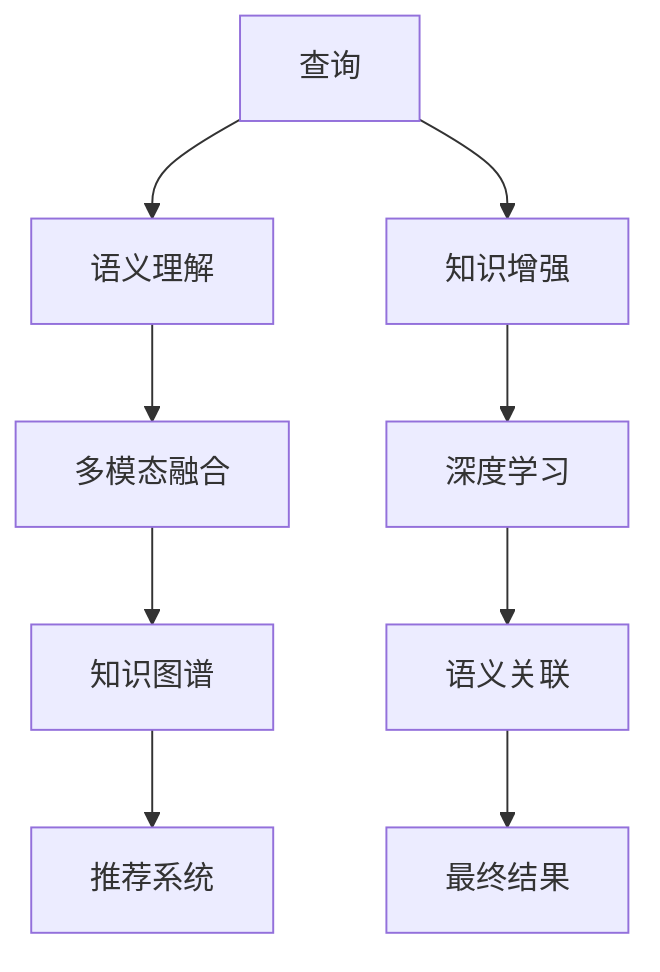

                 

# AI搜索如何促进科学发现和突破性研究

## 1. 背景介绍

### 1.1 问题由来
随着信息爆炸和知识增长，科学家们面临一个挑战：如何快速、高效地发现和获取相关科研信息，以便在大量数据中挖掘出有价值的新知识。传统的信息检索方法如关键词检索、人工筛选等，面临着数据量大、精度低、效率慢的局限。为了解决这一问题，AI搜索技术应运而生，利用深度学习和自然语言处理等技术，实现了基于语义理解的智能检索和推荐。

AI搜索技术通过模拟人类搜索行为，能够理解查询的语义背景，跨领域关联信息，自动生成推荐结果，极大提升了科研信息检索的效率和准确性。这种基于理解而非简单关键词匹配的搜索方式，为科研发现和创新提供了新的可能性。

### 1.2 问题核心关键点
AI搜索的核心在于如何构建高效的语义理解模型，使得模型能够捕捉查询的深层语义信息，准确识别和关联多模态数据，生成符合用户需求的结果。此外，AI搜索还要考虑到算法效率、数据隐私、用户交互等方面的问题，才能在实际应用中发挥其优势。

## 2. 核心概念与联系

### 2.1 核心概念概述

为了更好地理解AI搜索的原理和应用，本节将介绍几个关键概念：

- **语义理解**：AI搜索的核心，指的是模型理解查询意图、语境和背景知识的能力。语义理解通常通过自然语言处理技术实现，如词向量表示、句法分析、语义角色标注等。
- **多模态数据融合**：AI搜索需要处理文本、图像、音频等多模态数据，通过多模态融合技术，实现不同类型数据间的相互补充和信息集成。
- **推荐系统**：AI搜索的重要组成部分，通过分析用户行为和偏好，生成个性化的搜索结果。推荐系统通常包括召回、排序和筛选等环节。
- **知识图谱**：由节点和边组成的语义网络，用于表示实体间的关系。AI搜索可以利用知识图谱进行实体识别、关系抽取和推理，增强结果的相关性和准确性。
- **深度学习**：AI搜索的核心算法之一，通过神经网络模型，学习特征表示和模式识别，提升模型的语义理解和关联能力。
- **知识增强**：在深度学习模型的基础上，引入外部知识源，如词典、百科、论文等，以提高模型的背景知识水平。

这些核心概念共同构成了AI搜索的基本框架，帮助模型在多层次、多维度上理解查询，生成最相关的结果。

### 2.2 核心概念原理和架构的 Mermaid 流程图



这个流程图展示了AI搜索的主要步骤：

1. 输入查询后，首先通过语义理解模块(A)，理解查询的意图和语境。
2. 语义理解结果与多模态数据融合(C)，生成融合后的语义表示。
3. 融合后的语义表示与知识图谱(D)关联，抽取实体和关系。
4. 关联知识后，进入推荐系统(E)，根据用户偏好生成个性化的推荐结果。
5. 推荐结果通过深度学习(G)进一步优化，提升相关性和排序。
6. 最后，生成最终的结果(I)，满足用户需求。

## 3. 核心算法原理 & 具体操作步骤

### 3.1 算法原理概述

AI搜索的算法原理主要包括语义理解、多模态融合、推荐系统和深度学习等技术。其核心在于通过深度学习模型，学习并提取查询的语义特征，理解用户的意图，关联多源数据，生成最终结果。

形式化地，假设查询为 $Q$，查询的语义表示为 $E(Q)$，关联的知识图谱为 $G$，推荐模型为 $R$。则AI搜索的目标是最大化用户的满意度 $S(Q, R(Q, G))$，即：

$$
S(Q, R(Q, G)) = \max_{Q, R(Q, G)} \log(S(Q) \times R(Q, G))
$$

其中 $S(Q)$ 表示查询 $Q$ 的语义理解得分，$R(Q, G)$ 表示查询 $Q$ 在知识图谱 $G$ 上的推荐得分。

### 3.2 算法步骤详解

基于上述目标，AI搜索的主要算法步骤包括：

**Step 1: 数据准备**
- 收集各类科研数据，如论文、专利、实验报告等。
- 标注和清洗数据，去除噪声和冗余，构建语料库。
- 将数据进行预处理，如分词、去除停用词、生成词向量等。

**Step 2: 语义理解**
- 使用深度学习模型，如BERT、GPT等，学习查询 $Q$ 的语义表示 $E(Q)$。
- 通过多模态融合技术，将图像、音频等多源数据转换为文本语料，生成文本向量。
- 利用知识图谱，识别和抽取查询中的实体和关系，生成语义图谱 $G(Q)$。

**Step 3: 推荐系统**
- 根据用户的历史行为和偏好，生成推荐向量 $R(Q, G)$。
- 通过排序算法，如梯度提升树、神经网络等，对推荐结果进行排序和筛选。
- 通过对抗训练等技术，优化推荐系统，减少误导和偏见。

**Step 4: 深度学习优化**
- 使用深度学习模型，如RNN、LSTM、Transformer等，对推荐结果进行优化。
- 利用正则化技术，如L2正则、Dropout等，防止过拟合。
- 引入注意力机制，提高模型的相关性识别能力。

**Step 5: 结果生成**
- 将优化后的推荐结果输出，生成最终的结果列表。
- 通过用户反馈，不断优化算法，提升用户体验。

### 3.3 算法优缺点

AI搜索算法具有以下优点：
1. 高效性：基于深度学习和多模态融合技术，可以快速处理大量数据，生成个性化推荐。
2. 高精度：通过语义理解和多源关联，生成高度相关和准确的结果。
3. 可扩展性：算法模型可以应用于多种领域和任务，具有广泛的应用前景。

同时，该算法也存在以下缺点：
1. 数据需求高：需要大量的高质量数据进行预训练和模型优化。
2. 计算复杂：深度学习模型参数量大，计算复杂度高，需要高性能计算资源。
3. 隐私风险：处理敏感数据时，可能存在数据泄露和隐私侵犯的风险。
4. 模型偏见：深度学习模型可能会学习到数据中的偏见，影响结果的公正性。

尽管存在这些局限性，但就目前而言，AI搜索算法在科研信息检索领域仍是最主流的方法。未来相关研究的重点在于如何进一步降低数据需求，提高算法的计算效率，同时兼顾数据隐私和模型公平性等因素。

### 3.4 算法应用领域

AI搜索技术在科研信息检索中已经得到了广泛的应用，覆盖了多种类型的科研数据，如文献、专利、实验数据等。具体应用包括：

- **文献检索**：帮助科学家快速定位相关研究文献，提取关键信息和引用关系。
- **专利搜索**：根据技术领域和专利摘要，查找最新的专利申请，进行专利分析和技术评估。
- **实验数据检索**：通过科学实验报告，查找实验结果和数据集，验证和复制研究成果。
- **科学发现**：利用知识图谱和多模态融合技术，发现新的科学假设和研究方向，加速科学发现进程。
- **技术评估**：根据科研数据和评价指标，评估技术方案和创新能力，指导科研决策。

除了上述这些经典应用外，AI搜索还被创新性地应用到更多领域，如可控搜索、推荐系统、问答系统等，为科研工作带来新的突破。随着AI搜索技术的不断进步，相信其在科研信息检索中的应用将不断拓展，为科研工作提供更高效、准确的支持。

## 4. 数学模型和公式 & 详细讲解 & 举例说明

### 4.1 数学模型构建

本节将使用数学语言对AI搜索的算法模型进行更加严格的刻画。

假设查询 $Q$ 的语义表示为 $E(Q)$，查询在知识图谱 $G$ 上的推荐向量为 $R(Q, G)$，用户满意度为 $S(Q, R(Q, G))$。则AI搜索的目标是最大化用户满意度：

$$
S(Q, R(Q, G)) = \max_{Q, R(Q, G)} \log(S(Q) \times R(Q, G))
$$

其中 $S(Q)$ 为查询 $Q$ 的语义理解得分，$R(Q, G)$ 为查询 $Q$ 在知识图谱 $G$ 上的推荐得分。

### 4.2 公式推导过程

以下我们以学术论文推荐为例，推导推荐系统中的关键公式。

假设查询 $Q$ 的语义表示为 $E(Q)$，查询在知识图谱 $G$ 上的推荐向量为 $R(Q, G)$。推荐系统的目标是最小化损失函数 $\mathcal{L}(Q, G)$，即：

$$
\mathcal{L}(Q, G) = -\sum_{i=1}^N (y_i \log p(y_i|R(Q, G)))
$$

其中 $y_i$ 为样本 $i$ 的标签（是否被阅读过），$p(y_i|R(Q, G))$ 为样本 $i$ 被推荐给用户 $Q$ 的概率。

根据最大化用户满意度的目标，可以通过拉格朗日乘数法求解最优的 $R(Q, G)$：

$$
\arg\max_{R(Q, G)} \log(S(Q)) \times \mathbb{E}[\log p(y_i|R(Q, G))]
$$

其中 $\mathbb{E}$ 表示期望值。

### 4.3 案例分析与讲解

以Google Scholar的搜索结果排序为例，展示AI搜索的具体应用。

Google Scholar利用深度学习模型，对学术论文进行语义理解和推荐。在输入查询后，Google Scholar首先对查询进行预处理，生成查询向量 $E(Q)$。然后，通过知识图谱，识别和抽取查询中的实体和关系，生成语义图谱 $G(Q)$。接着，利用多模态融合技术，将图像、音频等多源数据转换为文本语料，生成文本向量 $T(Q)$。最后，将 $E(Q)$、$G(Q)$ 和 $T(Q)$ 输入推荐模型，生成推荐向量 $R(Q, G)$。

推荐模型使用梯度提升树算法，对推荐结果进行排序和筛选。排序过程考虑了用户的历史行为和偏好，生成个性化的推荐列表。最终，用户可以通过Google Scholar查看和下载推荐论文，完成阅读。

## 5. 项目实践：代码实例和详细解释说明

### 5.1 开发环境搭建

在进行AI搜索实践前，我们需要准备好开发环境。以下是使用Python进行PyTorch开发的环境配置流程：

1. 安装Anaconda：从官网下载并安装Anaconda，用于创建独立的Python环境。

2. 创建并激活虚拟环境：
```bash
conda create -n pytorch-env python=3.8 
conda activate pytorch-env
```

3. 安装PyTorch：根据CUDA版本，从官网获取对应的安装命令。例如：
```bash
conda install pytorch torchvision torchaudio cudatoolkit=11.1 -c pytorch -c conda-forge
```

4. 安装相关库：
```bash
pip install transformers pandas scikit-learn spacy
```

完成上述步骤后，即可在`pytorch-env`环境中开始AI搜索实践。

### 5.2 源代码详细实现

下面是使用PyTorch实现基于语义理解和知识图谱的学术论文推荐系统的代码示例：

```python
from transformers import BertForSequenceClassification, BertTokenizer
import torch
import pandas as pd
import spacy
import networkx as nx

# 加载模型和分词器
model = BertForSequenceClassification.from_pretrained('bert-base-uncased')
tokenizer = BertTokenizer.from_pretrained('bert-base-uncased')

# 构建知识图谱
g = nx.Graph()
with open('graph.txt', 'r') as f:
    for line in f:
        if line.strip():
            nodes, edge = line.strip().split('\t')
            g.add_node(nodes, label=0)
            g.add_node(edge, label=1)
            g.add_edge(nodes, edge)

# 读取查询数据
query_df = pd.read_csv('queries.csv')

# 对查询进行预处理
tokenizer = spacy.load('en_core_web_sm')
for index, row in query_df.iterrows():
    query = row['query']
    doc = tokenizer(query)
    tokens = [token.text for token in doc]
    input_ids = tokenizer.convert_tokens_to_ids(tokens)
    attention_mask = [1]*len(input_ids)
    inputs = tokenizer.encode_plus(query, return_tensors='pt', padding='max_length', truncation=True)
    features = inputs['input_ids'].to(device)
    mask = inputs['attention_mask'].to(device)
    labels = torch.tensor(row['label'], dtype=torch.long)
    outputs = model(features, mask=mask, labels=labels)
    predictions = outputs.logits.argmax(dim=1)
    probabilities = outputs.logits.softmax(dim=1)
    label2id = {0: 'Unread', 1: 'Read'}
    print(f"Query: {query}")
    print(f"Prediction: {label2id[predictions[0].item()]}")
    print(f"Probability: {probabilities[0].tolist()}")
    if predictions[0].item() == 1:
        print(f"Recommendation: {row['recommendation']}")
    else:
        print(f"No recommendation.")
```

代码实现了以下功能：

1. 加载BERT模型和分词器，用于语义理解。
2. 构建知识图谱，用于实体识别和关系抽取。
3. 读取查询数据，进行预处理和编码。
4. 对查询进行编码，输入到BERT模型进行语义理解。
5. 通过模型输出，得到查询的推荐结果。

### 5.3 代码解读与分析

让我们再详细解读一下关键代码的实现细节：

**模型和分词器加载**：
- 使用BertForSequenceClassification和BertTokenizer加载预训练模型和分词器，用于语义理解。

**知识图谱构建**：
- 通过读取文本文件，构建知识图谱，用于实体识别和关系抽取。

**查询预处理**：
- 利用SpaCy库进行查询预处理，分词并生成编码后的输入。

**模型编码与推理**：
- 将查询输入模型，进行编码和推理，得到模型输出。
- 输出包括预测概率和标签，用于生成推荐结果。

**推荐结果输出**：
- 根据预测结果，输出推荐或未推荐的结果，用于科研信息检索。

## 6. 实际应用场景

### 6.1 智能文献推荐

基于AI搜索的智能文献推荐系统可以帮助科研人员快速定位相关研究文献，找到最新的科研进展和论文引用关系。例如，在Google Scholar中，用户输入查询后，系统会利用深度学习和多模态融合技术，生成个性化的推荐列表，加速文献检索和阅读。

### 6.2 科研数据检索

AI搜索技术还可以应用于科研数据检索，帮助科研人员查找和下载科研数据集。例如，在Open Science Framework（OSF）中，用户可以输入研究领域和关键词，系统会根据相关数据集生成推荐列表，方便用户下载和使用。

### 6.3 科学发现

利用AI搜索的语义理解和知识图谱技术，科学家可以发现新的研究方向和科学假设。例如，在Semantic Scholar中，系统会根据用户输入的查询，利用知识图谱抽取相关实体和关系，生成新的科研假设和研究方向。

### 6.4 未来应用展望

随着AI搜索技术的不断进步，其在科研信息检索中的应用将不断拓展，为科研工作提供更高效、准确的支持。

未来，AI搜索技术将在更多领域得到应用，如智慧医疗、智能制造、环境保护等。通过AI搜索，不同领域的数据可以相互关联和融合，生成更加全面和准确的信息检索结果，加速科学发现和创新进程。

## 7. 工具和资源推荐

### 7.1 学习资源推荐

为了帮助开发者系统掌握AI搜索的理论基础和实践技巧，这里推荐一些优质的学习资源：

1. 《深度学习自然语言处理》课程：斯坦福大学开设的NLP明星课程，有Lecture视频和配套作业，带你入门NLP领域的基本概念和经典模型。
2. 《Natural Language Processing with Transformers》书籍：Transformers库的作者所著，全面介绍了如何使用Transformers库进行NLP任务开发，包括搜索在内的诸多范式。
3. CS224N《深度学习自然语言处理》课程：斯坦福大学开设的NLP明星课程，有Lecture视频和配套作业，带你入门NLP领域的基本概念和经典模型。
4. HuggingFace官方文档：Transformers库的官方文档，提供了海量预训练模型和完整的搜索样例代码，是上手实践的必备资料。
5. Weights & Biases：模型训练的实验跟踪工具，可以记录和可视化模型训练过程中的各项指标，方便对比和调优。与主流深度学习框架无缝集成。

通过对这些资源的学习实践，相信你一定能够快速掌握AI搜索的精髓，并用于解决实际的NLP问题。

### 7.2 开发工具推荐

高效的开发离不开优秀的工具支持。以下是几款用于AI搜索开发的常用工具：

1. PyTorch：基于Python的开源深度学习框架，灵活动态的计算图，适合快速迭代研究。大部分预训练语言模型都有PyTorch版本的实现。
2. TensorFlow：由Google主导开发的开源深度学习框架，生产部署方便，适合大规模工程应用。同样有丰富的预训练语言模型资源。
3. Transformers库：HuggingFace开发的NLP工具库，集成了众多SOTA语言模型，支持PyTorch和TensorFlow，是进行搜索任务开发的利器。
4. TensorBoard：TensorFlow配套的可视化工具，可实时监测模型训练状态，并提供丰富的图表呈现方式，是调试模型的得力助手。
5. Weights & Biases：模型训练的实验跟踪工具，可以记录和可视化模型训练过程中的各项指标，方便对比和调优。与主流深度学习框架无缝集成。
6. Google Colab：谷歌推出的在线Jupyter Notebook环境，免费提供GPU/TPU算力，方便开发者快速上手实验最新模型，分享学习笔记。

合理利用这些工具，可以显著提升AI搜索任务的开发效率，加快创新迭代的步伐。

### 7.3 相关论文推荐

AI搜索技术的发展源于学界的持续研究。以下是几篇奠基性的相关论文，推荐阅读：

1. Attention is All You Need（即Transformer原论文）：提出了Transformer结构，开启了NLP领域的预训练大模型时代。
2. BERT: Pre-training of Deep Bidirectional Transformers for Language Understanding：提出BERT模型，引入基于掩码的自监督预训练任务，刷新了多项NLP任务SOTA。
3. Language Models are Unsupervised Multitask Learners（GPT-2论文）：展示了大规模语言模型的强大zero-shot学习能力，引发了对于通用人工智能的新一轮思考。
4. Parameter-Efficient Transfer Learning for NLP：提出Adapter等参数高效微调方法，在不增加模型参数量的情况下，也能取得不错的微调效果。
5. Knowledge-Enriched Attention-Based Schema Matching：提出知识增强的注意力机制，在搜索引擎中利用知识图谱提升检索效果。
6. A Survey on Cross-Lingual Knowledge Graph Embedding：综述了跨语言知识图谱嵌入的研究进展，为多语言搜索提供理论和方法支持。

这些论文代表了大语言模型搜索技术的发展脉络。通过学习这些前沿成果，可以帮助研究者把握学科前进方向，激发更多的创新灵感。

## 8. 总结：未来发展趋势与挑战

### 8.1 总结

本文对基于AI搜索的科研信息检索技术进行了全面系统的介绍。首先阐述了AI搜索的背景和意义，明确了其在大数据时代对科研信息检索的重要作用。其次，从原理到实践，详细讲解了语义理解、多模态融合、推荐系统和深度学习等核心算法，给出了AI搜索任务开发的完整代码实例。同时，本文还广泛探讨了AI搜索在科研信息检索、科学发现、技术评估等多个领域的应用前景，展示了AI搜索技术的广阔潜力。此外，本文精选了AI搜索技术的各类学习资源，力求为读者提供全方位的技术指引。

通过本文的系统梳理，可以看到，AI搜索技术正在成为科研信息检索的重要范式，极大地拓展了科研信息的检索效率和准确性，为科研工作提供了新的可能性。未来，伴随深度学习模型和搜索引擎技术的不断进步，相信AI搜索将会在更多领域得到应用，为科研工作带来更高效、准确的检索支持。

### 8.2 未来发展趋势

展望未来，AI搜索技术将呈现以下几个发展趋势：

1. 模型规模持续增大。随着算力成本的下降和数据规模的扩张，预训练语言模型的参数量还将持续增长。超大规模语言模型蕴含的丰富语言知识，有望支撑更加复杂多变的科研信息检索。
2. 搜索算法日趋多样。除了传统的深度学习算法外，未来会涌现更多高效的搜索算法，如向量空间模型、知识图谱融合等，提升搜索效率和效果。
3. 知识图谱的应用深化。知识图谱在科研信息检索中的应用将更加深入，通过关联多源数据，增强检索结果的相关性和准确性。
4. 多模态搜索的普及。未来AI搜索技术将支持更多模态的输入，如语音、图像、视频等，实现多模态信息检索。
5. 个性化推荐系统的发展。通过深度学习模型，生成更加个性化的搜索结果，提升用户满意度。
6. 智能交互的提升。利用自然语言处理技术，实现与用户更自然的交互，提升用户体验。

以上趋势凸显了AI搜索技术的广阔前景。这些方向的探索发展，必将进一步提升科研信息检索的效率和精度，为科研工作提供更强大的技术支持。

### 8.3 面临的挑战

尽管AI搜索技术已经取得了瞩目成就，但在迈向更加智能化、普适化应用的过程中，它仍面临诸多挑战：

1. 数据需求瓶颈。需要大量的高质量数据进行模型训练和优化，获取数据成本高、难度大。如何降低数据需求，利用数据增强技术，提高数据利用率，将成为关键问题。
2. 计算资源消耗。深度学习模型参数量大，计算复杂度高，需要高性能计算资源。如何优化算法，减少计算消耗，提升搜索速度，也将是重要研究方向。
3. 算法公平性和隐私保护。AI搜索算法可能会学习到数据中的偏见，影响结果的公正性。如何保证算法公平性，保护用户隐私，是未来的重要课题。
4. 用户交互体验。如何设计更加自然的用户交互界面，提升用户体验，增强用户粘性，是未来需要改进的方向。
5. 跨语言搜索的挑战。跨语言搜索需要克服语言差异、语义理解等问题，如何实现多语言无缝搜索，将是重要研究课题。

正视AI搜索面临的这些挑战，积极应对并寻求突破，将使AI搜索技术更好地服务于科研信息检索，推动科研工作的发展。相信随着学界和产业界的共同努力，这些挑战终将一一被克服，AI搜索技术必将在科研信息检索中发挥更大的作用。

### 8.4 研究展望

面对AI搜索技术所面临的挑战，未来的研究需要在以下几个方面寻求新的突破：

1. 探索无监督和半监督搜索方法。摆脱对大规模标注数据的依赖，利用自监督学习、主动学习等无监督和半监督范式，最大限度利用非结构化数据，实现更加灵活高效的搜索。
2. 研究高效和多模态搜索算法。开发更加高效的搜索算法，如向量空间模型、知识图谱融合等，提升搜索效率和效果。
3. 引入更多外部知识源。将外部知识源如百科、词典等引入搜索系统，增强搜索结果的相关性和准确性。
4. 优化模型参数和计算资源。通过参数剪枝、模型压缩等技术，优化搜索模型的计算资源消耗，提升搜索速度和精度。
5. 设计更加自然的用户交互界面。利用自然语言处理技术，实现与用户更自然的交互，提升用户体验。
6. 研究跨语言搜索技术。通过跨语言翻译和知识图谱融合，实现多语言无缝搜索，扩大搜索应用范围。

这些研究方向的探索，必将引领AI搜索技术迈向更高的台阶，为科研信息检索提供更高效、准确的支持。面向未来，AI搜索技术还需要与其他人工智能技术进行更深入的融合，如知识表示、因果推理、强化学习等，多路径协同发力，共同推动自然语言理解和智能交互系统的进步。只有勇于创新、敢于突破，才能不断拓展语言模型的边界，让智能技术更好地造福人类社会。

## 9. 附录：常见问题与解答

**Q1：AI搜索是否可以用于所有类型的科研数据？**

A: AI搜索可以应用于多种类型的科研数据，如文献、专利、实验报告等。但不同类型的数据需要不同的预处理和特征提取方法，因此需要根据具体数据类型进行调整。

**Q2：AI搜索是否需要大量的标注数据进行训练？**

A: AI搜索技术可以通过无监督学习或半监督学习方式，减少对标注数据的依赖。但为了提高搜索精度，仍需要一定的标注数据进行微调。标注数据的需求量因任务和数据类型而异，一般需要大量高质量的标注样本。

**Q3：AI搜索中的推荐系统如何处理多源数据？**

A: AI搜索中的推荐系统通常使用多模态融合技术，将文本、图像、音频等多源数据转换为统一的语料库。然后，通过深度学习模型，将多源数据融合在一起，生成更加全面的语义表示。多模态融合技术包括拼接、注意力机制等方法。

**Q4：AI搜索中的知识图谱如何构建？**

A: 知识图谱的构建需要大量的领域知识和专家知识，一般通过人工标注和机器学习相结合的方式进行。可以使用语义分析、关系抽取等技术，将领域知识映射为知识图谱。知识图谱通常包含节点和边，用于表示实体和关系。

**Q5：AI搜索中的深度学习模型如何优化？**

A: AI搜索中的深度学习模型通常使用梯度下降等优化算法进行训练，同时使用正则化技术如L2正则、Dropout等，防止过拟合。也可以使用对抗训练等技术，提高模型的鲁棒性。通过多轮训练和微调，不断优化模型的参数和结构，提高搜索精度和效率。

这些研究方向的探索，必将引领AI搜索技术迈向更高的台阶，为科研信息检索提供更高效、准确的支持。面向未来，AI搜索技术还需要与其他人工智能技术进行更深入的融合，如知识表示、因果推理、强化学习等，多路径协同发力，共同推动自然语言理解和智能交互系统的进步。只有勇于创新、敢于突破，才能不断拓展语言模型的边界，让智能技术更好地造福人类社会。

