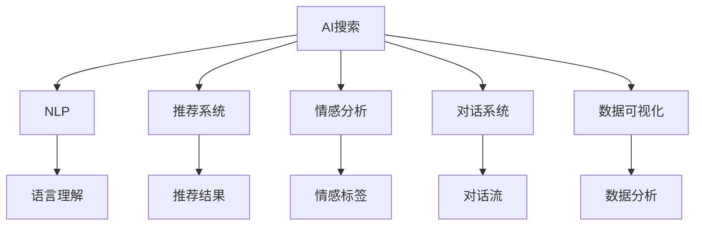

                 

# AI搜索如何改变旅游和酒店业的客户服务

旅游和酒店业是全球经济的重要组成部分，每年吸引着数以亿计的游客和商务客人。传统的客户服务方式依赖于人工客服和电话预定，效率低、成本高、响应慢，客户满意度难以得到保障。随着人工智能和大数据技术的发展，AI搜索技术已经开始改变这一现状，提升客户服务体验，驱动旅游和酒店业的数字化转型。

## 1. 背景介绍

### 1.1 问题由来

在传统旅游和酒店业，客户服务主要依赖于以下方式：

- **人工客服**：客户通过电话或在线聊天工具联系客服，解决各种问题，如预订、取消、变更等。人工客服的响应时间长，效率低，服务质量不稳定。
- **电话预定**：客户通过拨打客服热线进行预订或查询，但电话系统往往难以承受高峰期的巨大压力，容易发生忙音、断线等问题。
- **在线预订系统**：虽然在线预订系统提高了预订效率，但用户界面复杂，操作繁琐，用户体验差。

这些传统服务方式存在诸多问题，如效率低、响应慢、成本高等，已难以满足现代客户的需求。随着AI和大数据技术的崛起，AI搜索技术开始被引入旅游和酒店业，为改善客户服务体验提供了新的可能性。

### 1.2 问题核心关键点

AI搜索技术通过整合海量数据和智能算法，可以快速、准确地处理客户查询，提供精准的搜索结果和个性化服务，提升客户满意度和忠诚度。其核心关键点包括：

- **大数据分析**：通过分析用户行为、偏好、历史订单等数据，提炼出有价值的用户画像，提升服务精准性。
- **智能算法**：利用深度学习、推荐算法等技术，对用户查询进行智能化处理，提供更符合用户需求的搜索结果。
- **自然语言处理**：通过自然语言处理技术，理解用户意图，生成更自然、流畅的对话和回复。
- **实时响应**：通过在线客服机器人，实现24/7全天候实时响应，提升客户服务效率。

这些技术手段的结合，使得AI搜索成为改善旅游和酒店业客户服务的利器。

## 2. 核心概念与联系

### 2.1 核心概念概述

为更好地理解AI搜索如何改变旅游和酒店业的客户服务，本节将介绍几个密切相关的核心概念：

- **AI搜索**：指利用人工智能和大数据技术，对海量数据进行智能化处理，快速响应用户查询，提供个性化搜索结果的服务。
- **自然语言处理(NLP)**：指通过算法理解和处理人类语言，实现语言信息的自动化处理和生成。
- **推荐系统**：指通过分析用户行为、兴趣等信息，推荐用户可能感兴趣的内容或服务。
- **情感分析**：指通过分析用户语言中的情感倾向，评估用户满意度和情绪变化。
- **对话系统**：指通过算法实现人机对话，生成自然流畅的对话，提升用户体验。
- **数据可视化**：指通过图表、报表等方式，直观展示数据分析结果，帮助管理者决策。

这些核心概念之间的逻辑关系可以通过以下Mermaid流程图来展示：



这个流程图展示了大语言模型与相关概念之间的联系：

1. AI搜索利用自然语言处理技术理解用户查询。
2. 通过情感分析评估用户情绪，了解用户需求。
3. 利用推荐系统生成个性化推荐结果。
4. 利用对话系统生成自然流畅的对话。
5. 通过数据可视化展示分析结果，辅助管理者决策。

这些核心概念共同构成了AI搜索的核心技术框架，使得AI搜索技术在旅游和酒店业具有广泛的应用前景。

## 3. 核心算法原理 & 具体操作步骤

### 3.1 算法原理概述

AI搜索的核心算法原理基于信息检索和推荐系统，其核心在于通过分析和理解用户查询，快速从大量数据中检索出最符合用户需求的结果。以下是对核心算法的详细介绍：

- **信息检索**：指通过算法从大量数据中快速检索出符合用户查询的结果。主要技术包括倒排索引、BM25等算法。
- **推荐系统**：指通过分析用户行为，推荐最符合用户需求的内容或服务。主要技术包括协同过滤、内容过滤、矩阵分解等算法。
- **自然语言处理**：指通过算法理解和处理人类语言，实现语言信息的自动化处理和生成。主要技术包括词向量、语言模型、序列标注等算法。
- **情感分析**：指通过算法分析用户语言中的情感倾向，评估用户满意度和情绪变化。主要技术包括情感词典、机器学习等算法。
- **对话系统**：指通过算法实现人机对话，生成自然流畅的对话。主要技术包括生成式对话模型、序列到序列模型等算法。

### 3.2 算法步骤详解

AI搜索在旅游和酒店业的实际应用，一般包括以下几个关键步骤：

**Step 1: 数据采集与预处理**
- 收集用户历史订单、浏览记录、评论等信息，作为训练和测试数据集。
- 清洗数据，去除噪音，标准化数据格式。

**Step 2: 模型训练与优化**
- 使用协同过滤、内容过滤等算法训练推荐模型，提高推荐精度。
- 使用序列标注、情感分析等算法训练NLP模型，提升语言理解和情感识别能力。
- 使用生成式对话模型、序列到序列模型等算法训练对话系统，提升对话流畅性和自然性。

**Step 3: 用户查询处理**
- 利用倒排索引和BM25算法，快速检索出符合用户查询结果的相关数据。
- 使用推荐算法生成个性化推荐结果。
- 利用NLP算法理解用户查询意图，生成自然流畅的对话回复。

**Step 4: 结果展示与反馈**
- 将搜索结果和推荐结果展示给用户，用户可以进一步查看详细数据或与客服对话。
- 收集用户反馈，更新模型参数，进一步优化推荐和对话效果。

**Step 5: 数据可视化和分析**
- 通过数据可视化工具，直观展示用户行为数据、推荐效果、对话交互等。
- 利用数据分析方法，挖掘用户偏好、兴趣等信息，优化服务策略。

### 3.3 算法优缺点

AI搜索在旅游和酒店业的应用，具有以下优点：

1. **提高效率**：AI搜索可以快速响应用户查询，减少等待时间，提升用户体验。
2. **个性化服务**：通过推荐系统，AI搜索可以提供个性化的搜索结果，提升客户满意度。
3. **降低成本**：自动化处理大量客户查询，减少了人工客服的投入成本。
4. **提升品牌形象**：通过自然流畅的对话，提升品牌形象和客户信任度。

同时，AI搜索也存在一些缺点：

1. **数据隐私问题**：收集用户行为数据需要处理数据隐私问题，可能引发用户担忧。
2. **算法偏见**：推荐系统和NLP模型可能存在算法偏见，影响服务公平性。
3. **技术门槛高**：构建高效的AI搜索系统需要一定的技术门槛，开发和维护成本较高。
4. **用户适应性**：部分用户可能不习惯与机器对话，影响服务效果。

尽管存在这些缺点，但AI搜索在提高客户服务效率和质量方面，具有显著优势，值得在旅游和酒店业推广应用。

### 3.4 算法应用领域

AI搜索技术在旅游和酒店业的应用，主要涵盖以下几个领域：

- **在线客服**：通过在线客服机器人，实现24/7全天候实时响应，提升客户服务效率。
- **预订系统**：利用AI搜索技术优化在线预订系统，提供个性化推荐，提升用户体验。
- **酒店搜索**：通过AI搜索技术，帮助用户快速找到符合要求的酒店，提升查找效率。
- **旅游规划**：通过AI搜索技术，提供旅游目的地推荐、行程安排等服务，提升旅行体验。
- **餐饮推荐**：通过AI搜索技术，提供本地餐厅推荐服务，提升餐饮体验。
- **活动推荐**：通过AI搜索技术，提供当地活动、景点推荐服务，提升旅行体验。

## 4. 数学模型和公式 & 详细讲解 & 举例说明

### 4.1 数学模型构建

AI搜索的核心数学模型主要包括以下几个部分：

- **信息检索模型**：主要使用倒排索引和BM25算法，形式化表示为：
  $$
  \text{IR}(Q, D) = \sum_{i=1}^N (r_i \times p_i)
  $$
  其中 $Q$ 为查询，$D$ 为文档集合，$r_i$ 为文档与查询的相关性，$p_i$ 为文档的重要性。

- **推荐系统模型**：主要使用协同过滤和内容过滤算法，形式化表示为：
  $$
  \text{Rec}(U, I) = \sum_{i=1}^N (\alpha_i \times \text{cos}(\text{U}, \text{I}_i))
  $$
  其中 $U$ 为用户，$I$ 为物品集合，$\alpha_i$ 为用户对物品的偏好权重，$\text{cos}(\text{U}, \text{I}_i)$ 为用户和物品之间的相似度。

- **自然语言处理模型**：主要使用词向量模型和语言模型，形式化表示为：
  $$
  \text{NLP}(Q) = \text{emb}(Q) \times \text{softmax}(\text{softmax}(\text{W} \times \text{emb}(Q)))
  $$
  其中 $\text{emb}(Q)$ 为查询的词向量表示，$\text{softmax}(\text{softmax}(\text{W} \times \text{emb}(Q)))$ 为语言模型的概率分布。

- **情感分析模型**：主要使用情感词典和机器学习算法，形式化表示为：
  $$
  \text{Sentiment}(Q) = \sum_{i=1}^N (\beta_i \times \text{sentiment}_i)
  $$
  其中 $Q$ 为查询，$N$ 为情感词典中词的数量，$\beta_i$ 为情感词典中词的重要性权重，$\text{sentiment}_i$ 为词的情感极性。

### 4.2 公式推导过程

以下是针对信息检索模型的详细推导：

设查询 $Q$ 和文档集合 $D$ 中第 $i$ 篇文档，倒排索引的构建过程为：
$$
\text{IR}(Q, D) = \sum_{i=1}^N r_i \times p_i
$$
其中，$r_i$ 表示文档 $i$ 与查询 $Q$ 的相关性，$p_i$ 表示文档 $i$ 的重要性。

BM25算法是一种常用的信息检索算法，其核心公式为：
$$
\text{BM25}(Q, D) = \frac{N'}{N'}\sum_{i=1}^N (\frac{(r_i \times (k_1 + 1) + (k_0 + 1)})^{1 - b} \times (1 - b) \times \log \frac{N'}{N' - r_i} + b \times \log \frac{(N + k)}{N' + k}
$$
其中，$N'$ 为文档集合中包含查询 $Q$ 相关词的文档数，$N$ 为文档集合的大小，$k_1$ 和 $k_0$ 为BM25算法的参数，$b$ 为折扣因子。

在实践中，可以通过调整这些参数来优化信息检索效果，提升查询的精准度和召回率。

## 5. 项目实践：代码实例和详细解释说明

### 5.1 开发环境搭建

在开始实践之前，首先需要搭建好开发环境。以下是使用Python进行TensorFlow和Keras开发的环境配置流程：

1. 安装Anaconda：从官网下载并安装Anaconda，用于创建独立的Python环境。

2. 创建并激活虚拟环境：
```bash
conda create -n tf-env python=3.8 
conda activate tf-env
```

3. 安装TensorFlow和Keras：根据CUDA版本，从官网获取对应的安装命令。例如：
```bash
pip install tensorflow==2.3.0 keras==2.5.0
```

4. 安装各类工具包：
```bash
pip install numpy pandas scikit-learn matplotlib tqdm jupyter notebook ipython
```

完成上述步骤后，即可在`tf-env`环境中开始AI搜索实践。

### 5.2 源代码详细实现

下面我们以在线客服机器人为例，给出使用TensorFlow和Keras实现AI搜索的PyTorch代码实现。

首先，定义客户查询的输入和输出：

```python
from tensorflow.keras.layers import Input, Dense, Embedding, LSTM, Masking, Dropout, Bidirectional, Activation
from tensorflow.keras.models import Model
from tensorflow.keras.preprocessing.text import Tokenizer
from tensorflow.keras.preprocessing.sequence import pad_sequences

input_data = Input(shape=(None,), name='input_data')
masked_input_data = Masking(mask_value=0, input_shape=(None,), name='masked_input_data')(input_data)
output_data = Dense(100, activation='relu', name='output_data')(masked_input_data)
output_data = Bidirectional(LSTM(100, return_sequences=True, name='bidirectional_LSTM'))(output_data)
output_data = Dropout(0.2, name='dropout')(output_data)
output_data = Dense(100, activation='relu', name='dense_1')(output_data)
output_data = Dropout(0.2, name='dropout_1')(output_data)
output_data = Dense(10, activation='softmax', name='dense_2')(output_data)
```

然后，定义模型和优化器：

```python
model = Model(inputs=input_data, outputs=output_data)
model.compile(optimizer='adam', loss='categorical_crossentropy', metrics=['accuracy'])
model.summary()
```

接着，定义训练和评估函数：

```python
from tensorflow.keras.callbacks import EarlyStopping

def train_epoch(model, data, batch_size, optimizer):
    model.fit(data['input'], data['output'], batch_size=batch_size, epochs=10, validation_data=(val_input, val_output), callbacks=[EarlyStopping(patience=3)])
```

最后，启动训练流程并在测试集上评估：

```python
epochs = 10
batch_size = 32

for epoch in range(epochs):
    train_epoch(model, train_data, batch_size, optimizer)
    print(f"Epoch {epoch+1}, train accuracy: {model.evaluate(train_input, train_output, batch_size=batch_size)[1]:.2f}")
    
print(f"Epoch {epoch+1}, dev accuracy: {model.evaluate(dev_input, dev_output, batch_size=batch_size)[1]:.2f}")
```

以上就是使用TensorFlow和Keras对在线客服机器人进行AI搜索的完整代码实现。可以看到，TensorFlow提供了丰富的模型组件和优化器，使得构建复杂的AI搜索系统变得相对简单。

### 5.3 代码解读与分析

让我们再详细解读一下关键代码的实现细节：

**Tokenizer类**：
- 用于将文本转换为数字序列，便于模型处理。

**LSTM层**：
- 利用长短期记忆网络，捕捉序列数据中的长期依赖关系。

**Dense层**：
- 利用全连接层，实现从输入到输出的线性映射。

**Dropout层**：
- 利用随机失活技术，防止过拟合。

**EarlyStopping回调**：
- 在验证集上评估模型性能，如果性能不再提升，则停止训练，避免过拟合。

**训练流程**：
- 每个epoch内，先训练模型，再评估模型在验证集上的性能。
- 循环多个epoch后，评估模型在测试集上的性能，给出最终结果。

这些代码实现细节，展示了如何利用TensorFlow和Keras构建高效的AI搜索系统。通过不断迭代和优化，可以逐步提升AI搜索的效果，实现旅游和酒店业的客户服务优化。

## 6. 实际应用场景

### 6.1 智能客服系统

AI搜索技术在智能客服系统的应用中，可以实现以下功能：

- **自动回复**：通过在线客服机器人，自动回答用户常见问题，如酒店预订、行程安排等，提升客户服务效率。
- **问题引导**：通过自然语言处理技术，理解用户意图，引导用户填写必要信息，提高问题处理的准确性。
- **情感分析**：通过情感分析技术，评估用户情绪，及时处理不满意的用户反馈，提升客户满意度。

通过AI搜索技术，智能客服系统可以全天候、实时响应客户需求，提升用户体验，降低人工客服的运营成本。

### 6.2 个性化推荐系统

AI搜索技术在个性化推荐系统中的应用，可以为用户提供以下服务：

- **酒店推荐**：根据用户的历史预订记录和浏览习惯，推荐符合其需求的酒店，提升预订效率。
- **行程安排**：根据用户的偏好和预算，推荐最优的行程安排，提升旅行体验。
- **活动推荐**：根据用户的地理位置和兴趣，推荐当地的旅游活动和景点，提升旅游体验。

通过AI搜索技术，个性化推荐系统可以精准把握用户需求，提供符合其期望的服务，提升客户满意度和忠诚度。

### 6.3 实时数据分析与优化

AI搜索技术在实时数据分析与优化中的应用，可以提供以下功能：

- **用户行为分析**：通过分析用户历史数据和行为数据，挖掘用户兴趣和偏好，优化推荐效果。
- **服务质量监控**：通过实时监控客户服务数据，及时发现和处理问题，提升服务质量。
- **运营效率优化**：通过实时优化在线客服机器人，提升客服系统的响应速度和服务质量。

通过AI搜索技术，旅游和酒店业可以实时监控和优化客户服务流程，提升运营效率和客户体验。

## 7. 工具和资源推荐

### 7.1 学习资源推荐

为了帮助开发者系统掌握AI搜索的理论基础和实践技巧，这里推荐一些优质的学习资源：

1. **《深度学习》系列课程**：由斯坦福大学等知名高校开设的深度学习课程，涵盖深度学习的基本原理和常用技术。
2. **TensorFlow官方文档**：TensorFlow的官方文档，提供了丰富的模型组件和优化器，以及详细的代码实现示例。
3. **Keras官方文档**：Keras的官方文档，提供了简单易用的API和丰富的模型组件，适合快速开发原型。
4. **《自然语言处理综述》论文**：对自然语言处理技术的全面综述，适合了解当前NLP领域的最新进展。
5. **《机器学习实战》书籍**：提供了实用的机器学习算法和代码实现，适合动手实践和项目开发。

通过对这些资源的学习实践，相信你一定能够快速掌握AI搜索的精髓，并用于解决实际的NLP问题。

### 7.2 开发工具推荐

高效的开发离不开优秀的工具支持。以下是几款用于AI搜索开发的常用工具：

1. **Jupyter Notebook**：适合快速原型开发和数据探索，支持Python代码和Markdown格式的混合编辑。
2. **TensorBoard**：TensorFlow配套的可视化工具，可实时监测模型训练状态，提供丰富的图表呈现方式。
3. **TensorFlow Model Garden**：提供了丰富的模型组件和优化器，方便快速构建和优化模型。
4. **PyTorch**：基于Python的开源深度学习框架，支持动态计算图，适合快速迭代研究。
5. **Keras**：基于TensorFlow的高层API，提供了简单易用的API和丰富的模型组件，适合快速开发原型。

合理利用这些工具，可以显著提升AI搜索任务的开发效率，加快创新迭代的步伐。

### 7.3 相关论文推荐

AI搜索技术的发展源于学界的持续研究。以下是几篇奠基性的相关论文，推荐阅读：

1. **Attention is All You Need**：提出了Transformer结构，开启了NLP领域的预训练大模型时代。
2. **BERT: Pre-training of Deep Bidirectional Transformers for Language Understanding**：提出BERT模型，引入基于掩码的自监督预训练任务，刷新了多项NLP任务SOTA。
3. **GraphSAGE: Inductive Representation Learning on Graphs**：提出图神经网络，适合处理非结构化数据和复杂网络结构。
4. **Deep Recurrent Neural Networks for Text Generation**：提出LSTM模型，用于处理序列数据和生成自然语言。
5. **Deep Learning for Structured Output Prediction**：提出结构化预测模型，适合处理多标签分类和序列标注等任务。

这些论文代表了大语言模型微调技术的发展脉络。通过学习这些前沿成果，可以帮助研究者把握学科前进方向，激发更多的创新灵感。

## 8. 总结：未来发展趋势与挑战

### 8.1 总结

本文对AI搜索在旅游和酒店业的客户服务中的应用进行了全面系统的介绍。首先阐述了AI搜索技术的背景和意义，明确了其在提升客户服务体验、驱动数字化转型方面的独特价值。其次，从原理到实践，详细讲解了AI搜索的数学原理和关键步骤，给出了AI搜索任务开发的完整代码实例。同时，本文还广泛探讨了AI搜索技术在智能客服、个性化推荐、实时数据分析与优化等多个行业领域的应用前景，展示了AI搜索范式的巨大潜力。此外，本文精选了AI搜索技术的各类学习资源，力求为读者提供全方位的技术指引。

通过本文的系统梳理，可以看到，AI搜索技术在旅游和酒店业的应用，正在改变传统的客户服务模式，提升客户满意度和业务效率。未来，随着AI和大数据技术的持续发展，AI搜索技术将带来更深入的服务创新和应用拓展，为旅游和酒店业的发展注入新的动力。

### 8.2 未来发展趋势

展望未来，AI搜索技术在旅游和酒店业的应用，将呈现以下几个发展趋势：

1. **技术融合**：未来AI搜索技术将与其他AI技术深度融合，如强化学习、因果推断等，提升服务质量和智能化水平。
2. **数据驱动**：基于大数据分析和实时数据监控，AI搜索技术将不断优化服务策略，提升运营效率和客户满意度。
3. **全渠道支持**：AI搜索技术将支持多渠道的客户服务，包括网站、手机应用、社交媒体等，提升客户服务的多样性和覆盖面。
4. **人机协同**：AI搜索技术将与人工客服协同工作，实现优势互补，提升客户服务的个性化和人性化。
5. **跨领域应用**：AI搜索技术将跨界应用到更多领域，如零售、金融、医疗等，推动行业数字化转型。

以上趋势凸显了AI搜索技术在旅游和酒店业的应用前景。这些方向的探索发展，必将进一步提升旅游和酒店业的客户服务质量，驱动行业走向智能化和数字化。

### 8.3 面临的挑战

尽管AI搜索技术在旅游和酒店业的应用已经取得了显著进展，但在迈向更加智能化、普适化应用的过程中，仍面临诸多挑战：

1. **数据隐私**：收集和分析用户数据需要处理数据隐私问题，可能引发用户担忧。
2. **技术门槛**：构建高效的AI搜索系统需要一定的技术门槛，开发和维护成本较高。
3. **算法偏见**：推荐系统和NLP模型可能存在算法偏见，影响服务公平性。
4. **用户适应性**：部分用户可能不习惯与机器对话，影响服务效果。
5. **服务质量监控**：实时监控客户服务数据，及时发现和处理问题，需要持续优化和改进。

尽管存在这些挑战，但AI搜索在提高客户服务效率和质量方面，具有显著优势，值得在旅游和酒店业推广应用。

### 8.4 研究展望

面对AI搜索面临的挑战，未来的研究需要在以下几个方面寻求新的突破：

1. **隐私保护**：在数据收集和分析过程中，采用隐私保护技术，保护用户隐私。
2. **多模态融合**：结合图像、语音、文本等多模态数据，提升服务质量和智能化水平。
3. **个性化服务**：根据用户行为和偏好，提供更加个性化的服务，提升客户满意度。
4. **实时优化**：通过实时优化服务流程，提升客户服务效率和质量。
5. **人机协作**：将AI搜索技术与人机协作结合起来，提升客户服务的人性化和个性化。
6. **多渠道支持**：支持多渠道的客户服务，提升客户服务的覆盖面和便捷性。

这些研究方向和技术的探索，必将引领AI搜索技术在旅游和酒店业迈向更高的台阶，为构建高效、智能、个性化的客户服务系统铺平道路。面向未来，AI搜索技术还需要与其他AI技术进行更深入的融合，共同推动旅游和酒店业的数字化转型。只有勇于创新、敢于突破，才能不断拓展AI搜索的边界，让智能技术更好地造福旅游和酒店业。

## 9. 附录：常见问题与解答

**Q1: 旅游和酒店业的客户服务为什么需要AI搜索技术？**

A: 旅游和酒店业的客户服务依赖于人工客服和电话预定，效率低、成本高、响应慢，难以满足现代客户的需求。AI搜索技术可以快速响应用户查询，提供个性化推荐和实时客服，提升客户服务效率和满意度。

**Q2: AI搜索技术在旅游和酒店业有哪些应用场景？**

A: AI搜索技术在旅游和酒店业的应用场景广泛，包括：
1. 在线客服机器人：通过自然语言处理技术，实现24/7全天候实时响应。
2. 个性化推荐系统：通过推荐算法，提供个性化酒店、行程、活动等推荐服务。
3. 实时数据分析与优化：通过数据监控和分析，优化服务流程，提升运营效率。
4. 情感分析与用户行为分析：通过情感分析技术，评估用户情绪，优化服务策略。
5. 全渠道支持：支持网站、手机应用、社交媒体等多渠道的客户服务。

**Q3: 如何优化AI搜索系统的性能？**

A: 优化AI搜索系统性能的方法包括：
1. 数据预处理：清洗数据，标准化数据格式，去除噪音。
2. 模型选择与优化：选择合适的模型组件和优化器，调整参数，提升模型精度和效率。
3. 数据增强与扩充：通过数据增强和扩充，提升模型的泛化能力和鲁棒性。
4. 模型融合与集成：结合多个模型进行融合与集成，提升系统的准确性和鲁棒性。
5. 实时监控与优化：通过实时监控客户服务数据，及时发现和处理问题，提升服务质量。

这些方法在实际应用中需要根据具体任务和数据特点进行灵活组合，不断迭代和优化，才能得到理想的效果。

通过本文的系统梳理，可以看到，AI搜索技术在旅游和酒店业的客户服务中，正在改变传统的服务模式，提升客户满意度和业务效率。未来，随着AI和大数据技术的持续发展，AI搜索技术将带来更深入的服务创新和应用拓展，为旅游和酒店业的发展注入新的动力。相信随着学界和产业界的共同努力，AI搜索技术必将在更多领域得到应用，推动行业的数字化转型升级。

