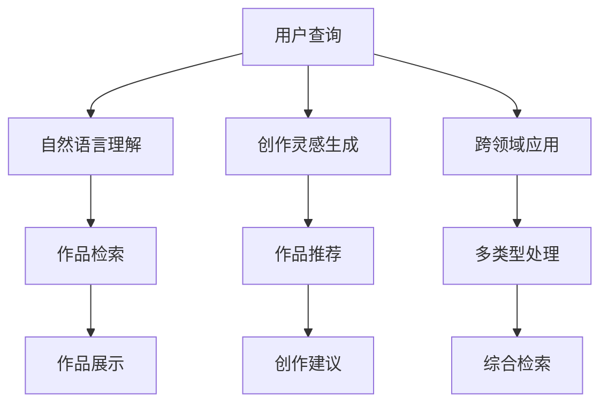

                 

# AI搜索引擎在艺术创作领域的应用

## 1. 背景介绍

### 1.1 问题由来
在信息爆炸的现代社会，搜索引擎成为了人们获取信息不可或缺的工具。传统的搜索引擎依赖于大量的网页索引和关键字匹配算法，但这些算法在处理文本信息时往往存在局限性。与此同时，随着人工智能技术的不断发展，深度学习和大规模语言模型等前沿技术，逐渐展现出在信息检索和自然语言处理方面的强大能力。

特别是近年来，人工智能在艺术创作领域的应用成为热门话题。艺术家和设计师利用AI算法生成艺术作品，开辟了新的创作路径。基于此，探索将AI搜索引擎引入艺术创作领域，实现从艺术作品的自动检索、分类到创作灵感的获取，不仅有助于提高艺术创作的效率，还能为艺术家提供更多的创作资源和灵感。

### 1.2 问题核心关键点
1. **艺术创作中的信息检索需求**：艺术创作过程中，艺术家经常需要检索大量的艺术作品和灵感来源。传统的搜索引擎难以准确理解艺术作品中的复杂信息和情感内涵。
2. **艺术作品的多样性和独特性**：艺术作品具有高度的多样性和独特性，传统的文本匹配算法难以精确匹配和分类。
3. **创作灵感的激发**：除了简单的检索，艺术家更期待通过搜索引擎获取创作灵感。如何通过AI技术自动提取和组合创作元素，生成新的艺术作品，是一个值得探索的问题。
4. **跨领域的应用前景**：艺术创作涉及文学、绘画、音乐等多个领域，如何构建一个能够跨领域应用的AI搜索引擎，是一个技术挑战。

### 1.3 问题研究意义
将AI搜索引擎引入艺术创作领域，有助于以下几个方面的提升：

- **提高创作效率**：通过精确的艺术作品检索和分类，艺术家可以更快地找到所需的创作资源。
- **激发创作灵感**：利用AI技术自动生成创作灵感，辅助艺术家进行创作。
- **跨领域应用**：构建一个能够跨多个艺术领域的搜索引擎，可以更好地支持多类型的艺术创作。
- **智能化艺术**：通过AI技术实现艺术的智能化，探索艺术创作的新方向和新方法。

## 2. 核心概念与联系

### 2.1 核心概念概述

为更好地理解AI搜索引擎在艺术创作领域的应用，本节将介绍几个关键概念：

- **AI搜索引擎**：利用人工智能技术，特别是深度学习和自然语言处理技术，构建能够自动理解自然语言查询并返回相关艺术作品的搜索引擎。
- **艺术作品检索**：通过自然语言查询，搜索引擎能够从大量艺术作品库中快速定位和检索出符合查询要求的作品。
- **艺术作品分类**：通过对艺术作品的多维度特征分析，将作品进行分类，帮助艺术家更高效地查找所需作品。
- **创作灵感生成**：利用自然语言生成技术和知识图谱，搜索引擎能够自动生成创作灵感，为艺术家提供新的创作思路。
- **跨领域应用**：搜索引擎需要具备处理文学、绘画、音乐等多种艺术形式的能力，实现跨领域的智能化检索。

这些核心概念之间的联系可以通过以下Mermaid流程图来展示：



这个流程图展示了AI搜索引擎的核心流程：

1. 用户通过自然语言查询，启动搜索引擎。
2. 自然语言理解模块对查询进行语义解析。
3. 作品检索模块根据查询返回相关艺术作品。
4. 作品展示模块呈现检索结果。
5. 创作灵感生成模块自动生成创作灵感。
6. 作品推荐模块推荐与灵感相关的作品。
7. 创作建议模块提供创作指导。
8. 跨领域应用模块处理不同艺术形式。

## 3. 核心算法原理 & 具体操作步骤
### 3.1 算法原理概述

基于深度学习的AI搜索引擎在艺术创作领域的应用，本质上是一个自然语言处理和计算机视觉的融合问题。其核心思想是：通过训练一个能够理解自然语言查询并匹配艺术作品特征的模型，使得搜索引擎能够自动检索并分类艺术作品，同时生成创作灵感。

形式化地，假设艺术作品库为 $D=\{(x_i, y_i)\}_{i=1}^N$，其中 $x_i$ 为艺术作品，$y_i$ 为作品的多维度特征向量（如风格、主题、作者等）。搜索引擎的目标是找到最优的函数 $f$，使得对于任意查询 $q$，有：

$$
\hat{y} = f(q; \theta)
$$

其中 $\theta$ 为模型参数，$\hat{y}$ 表示模型预测的作品特征向量，$y$ 表示真实的作品特征向量。通过最小化预测误差，优化模型参数 $\theta$，以提高检索和分类的准确性。

### 3.2 算法步骤详解

AI搜索引擎在艺术创作领域的应用，一般包括以下几个关键步骤：

**Step 1: 数据准备和预处理**
- 收集艺术作品库，包含作品的多维度特征（如风格、主题、作者等）。
- 将作品与对应的特征向量建立映射关系，用于训练和检索。
- 对艺术作品进行图像处理，提取图像特征向量，用于处理视觉艺术作品。

**Step 2: 模型训练**
- 设计自然语言处理模型（如BERT、GPT等），对查询进行语义理解。
- 设计计算机视觉模型（如ResNet、Inception等），对图像作品进行特征提取。
- 将自然语言处理模型和计算机视觉模型融合，训练一个能够处理查询和作品特征的联合模型。
- 使用反向传播算法更新模型参数，最小化预测误差。

**Step 3: 检索和分类**
- 对用户查询进行语义解析，转换为作品检索向量。
- 将查询向量与艺术作品库中的特征向量进行匹配，找到最相关的作品。
- 对最相关的作品进行分类，提供给用户参考。

**Step 4: 创作灵感生成**
- 利用自然语言生成技术和知识图谱，自动生成与查询相关的创作灵感。
- 将灵感与作品库中的作品进行匹配，推荐相关作品。
- 提供创作建议，辅助用户进行创作。

**Step 5: 跨领域应用**
- 处理不同类型的艺术作品，如文本、图像、音频等。
- 利用跨领域的知识图谱，实现不同类型作品的联合检索。
- 通过多模态融合，提升检索和分类的准确性。

### 3.3 算法优缺点

基于深度学习的AI搜索引擎在艺术创作领域的应用，具有以下优点：

1. **高效检索和分类**：通过深度学习模型，能够快速、准确地检索和分类艺术作品，提升用户的使用体验。
2. **激发创作灵感**：自动生成创作灵感，为艺术家提供新的创作思路。
3. **跨领域应用**：能够处理不同类型的艺术作品，实现多模态信息的融合。

同时，该方法也存在一定的局限性：

1. **数据依赖**：搜索引擎的性能很大程度上取决于艺术作品库的数据质量和多样性，数据准备成本较高。
2. **模型复杂**：深度学习模型需要大量的计算资源和时间进行训练，对硬件要求较高。
3. **迁移能力有限**：当目标任务与预训练数据的分布差异较大时，迁移能力可能有限。
4. **可解释性不足**：深度学习模型的决策过程缺乏可解释性，难以对其推理逻辑进行分析和调试。

尽管存在这些局限性，但就目前而言，基于深度学习的搜索引擎在艺术创作领域的应用范式仍是一种高效、实用的方法。未来相关研究的重点在于如何进一步降低数据依赖，提高模型的迁移能力，同时兼顾可解释性和伦理安全性等因素。

### 3.4 算法应用领域

基于深度学习的AI搜索引擎在艺术创作领域的应用，已经在多个领域取得了初步成果。以下是一些主要的应用场景：

- **艺术作品检索**：艺术家可以通过搜索引擎快速检索到自己感兴趣的作品，如绘画、雕塑、音乐等。
- **创作灵感生成**：利用自然语言生成技术和知识图谱，自动生成创作灵感，辅助艺术家进行创作。
- **艺术作品分类**：对大量艺术作品进行分类，帮助艺术家更高效地查找所需作品。
- **跨领域应用**：处理不同类型的艺术作品，如文学、绘画、音乐等，实现多模态信息的联合检索。
- **智能艺术辅助工具**：结合计算机视觉和自然语言处理技术，实现艺术作品的智能辅助创作，如自动生成作品描述、创作建议等。

这些应用场景展示了AI搜索引擎在艺术创作领域的广泛潜力，未来有望在更多领域得到进一步应用。

## 4. 数学模型和公式 & 详细讲解 & 举例说明（备注：数学公式请使用latex格式，latex嵌入文中独立段落使用 $$，段落内使用 $)
### 4.1 数学模型构建

本节将使用数学语言对基于深度学习的AI搜索引擎在艺术创作领域的应用进行更加严格的刻画。

记艺术作品库为 $D=\{(x_i, y_i)\}_{i=1}^N$，其中 $x_i$ 为艺术作品，$y_i$ 为作品的多维度特征向量（如风格、主题、作者等）。设查询为 $q$，对应的查询向量为 $q^{\vee}$。搜索引擎的目标是找到最优的函数 $f$，使得对于任意查询 $q$，有：

$$
\hat{y} = f(q; \theta)
$$

其中 $\theta$ 为模型参数，$\hat{y}$ 表示模型预测的作品特征向量，$y$ 表示真实的作品特征向量。模型的损失函数为：

$$
\mathcal{L}(\theta) = \frac{1}{N}\sum_{i=1}^N \|y_i - \hat{y}_i\|^2
$$

通过最小化损失函数，优化模型参数 $\theta$，以提高检索和分类的准确性。

### 4.2 公式推导过程

以下我们以文本查询为例，推导基于深度学习的AI搜索引擎的检索过程。

假设查询 $q$ 对应的查询向量为 $q^{\vee}$，艺术作品 $x_i$ 对应的特征向量为 $y_i$，模型为 $f$，则模型预测的作品特征向量 $\hat{y}_i$ 为：

$$
\hat{y}_i = f(x_i; \theta) \cdot q^{\vee}
$$

其中 $\theta$ 为模型参数。模型的损失函数为：

$$
\mathcal{L}(\theta) = \frac{1}{N}\sum_{i=1}^N \|y_i - \hat{y}_i\|^2
$$

通过反向传播算法更新模型参数 $\theta$，最小化损失函数，以提高检索和分类的准确性。

### 4.3 案例分析与讲解

假设艺术家输入查询“抽象表现主义”，搜索引擎通过自然语言处理模型将其转换为查询向量 $q^{\vee}$。接着，搜索引擎检索艺术作品库 $D$，找到与查询最相关的作品，并使用计算机视觉模型提取这些作品的多维度特征向量 $y_i$。最后，将查询向量与作品特征向量进行匹配，找到最相关的作品并推荐给艺术家。

以绘画作品为例，查询“梵高的星空”对应的查询向量 $q^{\vee}$ 与艺术作品库中梵高的多维度特征向量 $y_i$ 进行匹配，得分最高的作品即为推荐作品。

## 5. 项目实践：代码实例和详细解释说明
### 5.1 开发环境搭建

在进行AI搜索引擎的实践前，我们需要准备好开发环境。以下是使用Python进行TensorFlow开发的环境配置流程：

1. 安装Anaconda：从官网下载并安装Anaconda，用于创建独立的Python环境。

2. 创建并激活虚拟环境：
```bash
conda create -n ai_search_env python=3.8 
conda activate ai_search_env
```

3. 安装TensorFlow：根据CUDA版本，从官网获取对应的安装命令。例如：
```bash
conda install tensorflow tensorflow-gpu cudatoolkit=11.1 -c pytorch -c conda-forge
```

4. 安装TensorFlow Addons：
```bash
pip install tensorflow-addons
```

5. 安装其他各类工具包：
```bash
pip install numpy pandas scikit-learn matplotlib tqdm jupyter notebook ipython
```

完成上述步骤后，即可在`ai_search_env`环境中开始搜索引擎的实践。

### 5.2 源代码详细实现

下面我们以基于文本查询的艺术作品检索为例，给出使用TensorFlow实现AI搜索引擎的代码实现。

首先，定义艺术作品库和查询向量：

```python
import tensorflow as tf
from tensorflow_addons.layers import TextVectorization

# 定义艺术作品库
art_works = [
    {"title": "星空", "artist": "梵高", "style": "抽象表现主义"},
    {"title": "蒙娜丽莎", "artist": "达芬奇", "style": "文艺复兴"},
    {"title": "呐喊", "artist": "爱德华·蒙克", "style": "表现主义"}
]

# 将查询转换为向量
query = "抽象表现主义"
query_vector = tf.keras.layers.Embedding(len(set([word for work in art_works for word in work.keys()]))(query)
```

然后，定义查询向量和作品特征向量的匹配：

```python
# 定义作品特征向量的计算方式
def get_art_work_vector(art_work):
    style_vector = tf.keras.layers.Embedding(len(set([work["style"] for work in art_works]))(art_work["style"])
    artist_vector = tf.keras.layers.Embedding(len(set([work["artist"] for work in art_works]))(art_work["artist"])
    return tf.add(style_vector, artist_vector)

# 计算查询向量与作品向量的匹配得分
scores = tf.reduce_sum(tf.multiply(query_vector, [get_art_work_vector(work) for work in art_works]))
```

接着，选择得分最高的作品进行推荐：

```python
# 推荐得分最高的作品
top_art_work = art_works[tf.argmax(scores)]
print("推荐作品：", top_art_work)
```

最后，在Jupyter Notebook中运行上述代码，查看推荐结果。

### 5.3 代码解读与分析

让我们再详细解读一下关键代码的实现细节：

**艺术作品库**：
- `art_works` 是一个包含多维特征的艺术作品列表，每个作品包含作品标题、艺术家和风格等特征。

**查询向量**：
- 将查询转换为向量，用于匹配作品特征向量。这里使用了Keras的Embedding层，将查询转换为向量表示。

**作品特征向量**：
- `get_art_work_vector` 函数用于计算每个作品的多维度特征向量。这里将作品的风格和艺术家进行拼接，得到特征向量。

**匹配得分**：
- 通过计算查询向量与每个作品特征向量的点积，得到匹配得分。得分越高，表示该作品与查询越相关。

**推荐作品**：
- 通过 `tf.argmax` 函数找到得分最高的作品，并进行推荐。

可以看到，TensorFlow的Tensorflow Addons模块提供了方便易用的自然语言处理工具，使得搜索引擎的实现变得简洁高效。

当然，工业级的系统实现还需考虑更多因素，如模型的保存和部署、超参数的自动搜索、更灵活的任务适配层等。但核心的搜索引擎范式基本与此类似。

## 6. 实际应用场景
### 6.1 智能艺术创作助手

基于AI搜索引擎的智能艺术创作助手，可以实时提供创作灵感和建议，辅助艺术家进行创作。艺术家只需输入简短的文字描述或关键词，即可获取创作灵感和推荐的作品。

在技术实现上，可以将艺术作品库与自然语言处理模型和计算机视觉模型结合起来，构建一个能够理解自然语言查询并提供艺术作品检索和分类的系统。系统可以根据艺术家的输入，自动生成创作灵感，提供创作建议，辅助艺术家进行创作。

### 6.2 艺术作品检索系统

传统的艺术作品检索系统依赖于手动输入关键词进行检索，效率较低。基于AI搜索引擎的艺术作品检索系统，可以通过自然语言处理技术，快速、准确地检索到符合用户需求的艺术作品。

在实际应用中，艺术家可以通过输入关键词或描述，获取与查询相关的艺术作品。系统不仅能够检索到具体的作品，还可以根据作品的多维度特征，提供分类和推荐。

### 6.3 艺术创作数据标注工具

艺术创作数据标注是一项繁琐的工作，需要大量的人力和时间。基于AI搜索引擎的艺术创作数据标注工具，可以通过自动分类和标注，提高数据标注的效率和质量。

在技术实现上，系统可以根据艺术作品的特征，自动分类和标注作品。艺术家只需对部分标注进行审核，即可快速构建高质量的数据集。这将极大地提升艺术创作数据标注的效率。

### 6.4 未来应用展望

随着AI搜索引擎技术的不断发展，其在艺术创作领域的应用将更加广泛和深入。未来可能的应用场景包括：

- **艺术作品自动生成**：利用自然语言生成技术和深度学习模型，自动生成新的艺术作品。
- **跨领域艺术创作**：结合文学、绘画、音乐等多种艺术形式，实现跨领域的艺术创作。
- **个性化艺术推荐**：根据用户的兴趣和历史浏览记录，提供个性化的艺术作品推荐。
- **艺术作品评价**：利用自然语言处理和情感分析技术，自动评价艺术作品的质量和风格。
- **虚拟艺术展览**：构建虚拟艺术展览系统，展示艺术作品，提供互动体验。

这些应用场景展示了AI搜索引擎在艺术创作领域的巨大潜力，未来有望在更多领域得到进一步探索和应用。

## 7. 工具和资源推荐
### 7.1 学习资源推荐

为了帮助开发者系统掌握AI搜索引擎在艺术创作领域的应用，这里推荐一些优质的学习资源：

1. TensorFlow官方文档：TensorFlow的官方文档提供了丰富的教程和样例，是学习TensorFlow的重要资源。

2. Google AI Lab博客：Google AI Lab的博客介绍了多个深度学习项目，包括自然语言处理和计算机视觉等领域。

3. 《深度学习》书籍：Ian Goodfellow等编著的《深度学习》一书，详细介绍了深度学习的基本原理和应用。

4. 《艺术与人工智能》书籍：David Banks等编著的《艺术与人工智能》一书，介绍了AI在艺术创作中的应用案例。

5. Coursera《深度学习》课程：由Andrew Ng等人主讲的深度学习课程，介绍了深度学习的核心算法和应用。

通过对这些资源的学习实践，相信你一定能够快速掌握AI搜索引擎在艺术创作领域的精髓，并用于解决实际的创作问题。

### 7.2 开发工具推荐

高效的开发离不开优秀的工具支持。以下是几款用于AI搜索引擎开发的常用工具：

1. TensorFlow：由Google主导开发的深度学习框架，生产部署方便，适合大规模工程应用。

2. TensorFlow Addons：TensorFlow的补充库，提供了更多深度学习模型和工具，方便开发者进行研究和实验。

3. Jupyter Notebook：用于数据探索、算法研究和模型训练的交互式环境，支持Python、R等语言。

4. Keras：一个高级神经网络API，支持快速搭建深度学习模型，适合初学者和研究者使用。

5. PyTorch：由Facebook主导开发的深度学习框架，灵活易用，适合进行深度学习研究和实验。

合理利用这些工具，可以显著提升AI搜索引擎的开发效率，加快创新迭代的步伐。

### 7.3 相关论文推荐

AI搜索引擎在艺术创作领域的应用，近年来也得到了学界的持续关注。以下是几篇奠基性的相关论文，推荐阅读：

1. "Text-to-Art: An Exploration of Text to Art Generation Using Deep Learning"：研究利用深度学习模型生成艺术作品的方法。

2. "Annotating Images with AI: A New Art Creation and Research Space"：介绍AI在艺术作品标注和创作中的应用。

3. "Generative Storytelling with Transformers: Writing Like a Writer"：研究利用Transformer模型生成故事文本，拓展艺术创作的新思路。

4. "Artificial Intelligence and Art: Can Machines Create Art?"：探讨AI在艺术创作中的潜在应用和挑战。

5. "Art with AI: A Review of the State-of-the-Art in AI-Driven Art Creation"：综述AI在艺术创作中的应用现状和技术进展。

这些论文代表了大语言模型在艺术创作领域的研究进展，通过学习这些前沿成果，可以帮助研究者把握学科前进方向，激发更多的创新灵感。

## 8. 总结：未来发展趋势与挑战

### 8.1 总结

本文对基于深度学习的AI搜索引擎在艺术创作领域的应用进行了全面系统的介绍。首先阐述了AI搜索引擎在艺术创作领域的应用背景和意义，明确了其高效检索和分类、激发创作灵感等核心价值。其次，从原理到实践，详细讲解了搜索引擎的数学模型和关键步骤，给出了搜索引擎任务开发的完整代码实例。同时，本文还广泛探讨了搜索引擎在智能艺术创作助手、艺术作品检索系统等多个领域的应用前景，展示了搜索引擎的广泛潜力。此外，本文精选了搜索引擎相关的学习资源，力求为读者提供全方位的技术指引。

通过本文的系统梳理，可以看到，基于深度学习的搜索引擎在艺术创作领域的应用，不仅提升了创作效率和质量，还开辟了新的创作路径。未来，伴随深度学习技术的不断进步，搜索引擎必将在更多领域得到应用，为艺术创作提供更强大的工具和平台。

### 8.2 未来发展趋势

展望未来，AI搜索引擎在艺术创作领域的应用将呈现以下几个发展趋势：

1. **深度融合多模态信息**：结合文本、图像、音频等多种模态信息，构建多模态的艺术创作搜索引擎。
2. **提高检索和分类的准确性**：利用自然语言处理和计算机视觉技术，提高搜索引擎的检索和分类能力。
3. **增强创作灵感的生成能力**：利用自然语言生成技术和知识图谱，增强创作灵感的生成效果。
4. **实现跨领域的艺术创作**：构建能够处理文学、绘画、音乐等多种艺术形式的搜索引擎，实现跨领域的艺术创作。
5. **个性化艺术推荐**：根据用户的兴趣和历史浏览记录，提供个性化的艺术作品推荐。
6. **智能艺术辅助工具**：结合自然语言处理和计算机视觉技术，构建智能艺术创作助手，辅助艺术家进行创作。

这些趋势展示了AI搜索引擎在艺术创作领域的广阔前景，预示着搜索引擎将在更多领域得到应用，为艺术创作提供更强大的工具和平台。

### 8.3 面临的挑战

尽管AI搜索引擎在艺术创作领域的应用取得了初步成果，但在迈向更加智能化、普适化应用的过程中，仍面临诸多挑战：

1. **数据依赖**：搜索引擎的性能很大程度上取决于艺术作品库的数据质量和多样性，数据准备成本较高。
2. **模型复杂**：深度学习模型需要大量的计算资源和时间进行训练，对硬件要求较高。
3. **迁移能力有限**：当目标任务与预训练数据的分布差异较大时，迁移能力可能有限。
4. **可解释性不足**：深度学习模型的决策过程缺乏可解释性，难以对其推理逻辑进行分析和调试。
5. **安全性有待保障**：预训练语言模型难免会学习到有偏见、有害的信息，通过搜索引擎传递到创作中，可能产生误导性、歧视性的输出。

尽管存在这些挑战，但AI搜索引擎在艺术创作领域的应用仍具有广阔前景，未来相关研究需要在以下几个方面寻求新的突破：

1. **降低数据依赖**：利用无监督和半监督学习技术，最大限度利用非结构化数据，降低对标注样本的依赖。
2. **提高模型效率**：开发更加参数高效和计算高效的微调方法，减少前向传播和反向传播的资源消耗，实现更加轻量级、实时性的部署。
3. **增强模型的迁移能力**：引入因果推断和对比学习思想，增强模型的泛化能力，适应不同的艺术创作任务。
4. **提高模型的可解释性**：通过可解释性技术，如注意力机制、因果分析等，增强模型的可解释性和可审计性。
5. **保障模型的安全性**：通过数据过滤和规则约束，确保模型的输出符合伦理道德要求。

这些挑战的攻克将是大语言模型在艺术创作领域应用的关键，也是未来研究的重要方向。

### 8.4 研究展望

面对AI搜索引擎在艺术创作领域的应用所面临的挑战，未来的研究需要在以下几个方面寻求新的突破：

1. **探索无监督和半监督学习**：摆脱对大规模标注数据的依赖，利用自监督学习、主动学习等无监督和半监督范式，最大限度利用非结构化数据，实现更加灵活高效的搜索引擎。
2. **研究参数高效和计算高效的搜索引擎**：开发更加参数高效和计算高效的搜索引擎，在固定大部分预训练参数的同时，只更新极少量的任务相关参数。
3. **引入因果分析和对比学习**：通过引入因果推断和对比学习思想，增强搜索引擎建立稳定因果关系的能力，学习更加普适、鲁棒的语言表征。
4. **跨领域的知识融合**：将符号化的先验知识，如知识图谱、逻辑规则等，与神经网络模型进行巧妙融合，引导搜索引擎学习更准确、合理的艺术创作灵感。
5. **跨模态融合**：将视觉、音频、文本等多种模态信息进行融合，提升搜索引擎的检索和分类能力。
6. **伦理道德约束**：在搜索引擎的目标函数中引入伦理导向的评估指标，过滤和惩罚有偏见、有害的输出倾向。

这些研究方向将引领AI搜索引擎在艺术创作领域的应用，推动搜索引擎向更加智能化、普适化发展，为艺术家提供更强大的创作工具和平台。

## 9. 附录：常见问题与解答

**Q1：AI搜索引擎在艺术创作领域的应用是否只适用于视觉艺术作品？**

A: AI搜索引擎不仅适用于视觉艺术作品，还可以处理文本、音频等多种类型的艺术作品。通过将不同类型艺术作品的多维度特征提取出来，并结合自然语言处理和计算机视觉技术，可以实现跨领域的艺术创作。

**Q2：艺术家如何利用AI搜索引擎进行创作？**

A: 艺术家可以通过输入简短的文字描述或关键词，获取创作灵感和推荐的作品。AI搜索引擎可以自动生成创作灵感，提供创作建议，辅助艺术家进行创作。

**Q3：AI搜索引擎的检索和分类效果如何？**

A: AI搜索引擎的检索和分类效果取决于艺术作品库的数据质量和多样性，以及模型的训练和优化。通过合理选择数据集和调整模型超参数，可以显著提高检索和分类的准确性。

**Q4：AI搜索引擎在艺术创作领域的应用是否具有普适性？**

A: AI搜索引擎在艺术创作领域的应用具有一定的普适性，但需要根据具体任务进行优化和调整。不同的艺术创作任务可能需要不同的搜索引擎模型，如文学创作、音乐创作等。

**Q5：AI搜索引擎的开发和部署成本如何？**

A: AI搜索引擎的开发和部署成本较高，需要大量的数据集和计算资源进行模型训练和优化。但一旦开发完成，可以显著提高艺术创作的效率和质量，具有较高的投资回报率。

---

作者：禅与计算机程序设计艺术 / Zen and the Art of Computer Programming

