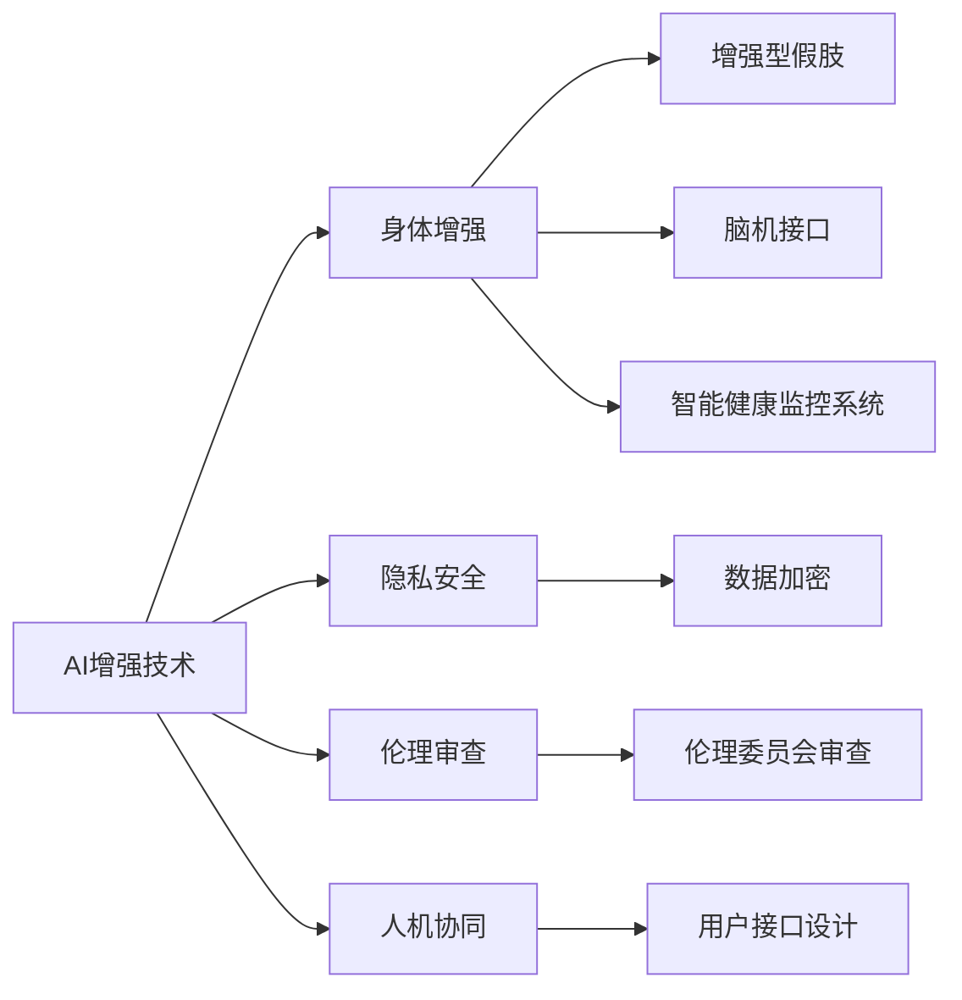

                 

# AI时代的人类增强：身体增强与道德考虑因素

> 关键词：AI增强技术,身体增强,道德伦理,人机协同,隐私安全,伦理审查

## 1. 背景介绍

随着人工智能（AI）技术的飞速发展，人类增强（Human Augmentation）已经成为未来科技发展的重要方向之一。通过将AI技术与生物技术结合，我们不仅能够提升人类的身体机能和认知能力，还能在医疗、教育、娱乐等多个领域实现质的飞跃。然而，这一技术的发展也带来了深刻的道德伦理问题，诸如隐私安全、伦理审查等挑战，需要我们在推广应用之前认真思考和应对。本文旨在深入探讨AI时代身体增强的最新发展及其面临的道德挑战，探讨如何平衡技术创新与伦理规范。

## 2. 核心概念与联系

### 2.1 核心概念概述

为了更好地理解身体增强与AI技术的关系，我们将介绍几个核心概念：

- **AI增强技术**：利用人工智能技术提升人类身体和认知能力的技术。包括增强型假肢、脑机接口、智能健康监控系统等。

- **身体增强**：通过植入、植入式或可穿戴设备等方式，提升人类肢体功能、感官知觉、认知能力等。

- **伦理审查**：在推进身体增强技术应用过程中，必须进行严格的伦理审查，确保技术应用不会对人类健康、隐私和安全造成不可逆的伤害。

- **隐私安全**：涉及数据隐私和用户个人信息安全，尤其是在涉及生物特征数据的处理上。

- **人机协同**：AI与人类之间的协作关系，如何实现二者间的和谐共处。

这些概念之间存在紧密联系，共同构成了AI时代身体增强的基础框架。

### 2.2 核心概念原理和架构的 Mermaid 流程图(Mermaid 流程节点中不要有括号、逗号等特殊字符)



这个流程图展示了AI增强技术在身体增强、隐私安全、伦理审查和人机协同等概念之间的逻辑关系：

1. AI增强技术通过各种形式的身体增强设备（如增强型假肢、脑机接口、智能健康监控系统），提升人类的身体机能和认知能力。
2. 在技术应用过程中，必须考虑隐私安全问题，通过数据加密等技术手段保护用户信息。
3. 实施身体增强技术前，需进行严格的伦理审查，确保技术应用符合伦理规范。
4. 人机协同是AI增强技术的重要应用场景，通过设计合适的用户接口，实现AI与人类之间的高效互动。

## 3. 核心算法原理 & 具体操作步骤

### 3.1 算法原理概述

AI增强技术在身体增强中的应用，核心在于将AI算法与生物技术融合。以脑机接口（BCI）为例，其核心算法包括信号采集、信号预处理、特征提取和分类四个步骤：

1. **信号采集**：通过脑电波、脑磁图等方法，采集大脑活动信号。
2. **信号预处理**：对采集到的信号进行滤波、归一化等处理，去除噪声。
3. **特征提取**：提取脑电信号中的关键特征，如频率、波幅等。
4. **分类**：使用机器学习算法，如支持向量机（SVM）、神经网络等，对特征进行分类，实现对大脑意图的解读。

通过这些算法步骤，脑机接口能够将人类大脑的信号转化为计算机可读的指令，从而实现对假肢等设备的控制。

### 3.2 算法步骤详解

以下以脑机接口为例，详细说明AI增强技术的算法步骤：

#### 3.2.1 信号采集

脑电波信号采集通常通过脑电图（EEG）设备完成。EEG设备通常包含多个电极，放置在头皮上，用于检测大脑的电活动。

#### 3.2.2 信号预处理

采集到的原始脑电信号包含大量噪声，需要进行预处理以提取有用的信号。预处理包括：

- **滤波**：去除高频噪声，保留频率在1-60Hz之间的信号。
- **归一化**：将信号幅度调整到特定范围内，以便后续处理。
- **去基线漂移**：去除信号中的基线漂移，确保信号稳定性。

#### 3.2.3 特征提取

特征提取是脑机接口中关键的一环，决定着后续分类的准确性。常用的特征提取方法包括：

- **时域特征**：如功率谱密度、波幅等，用于描述信号的时间特性。
- **频域特征**：如傅里叶变换、小波变换等，用于分析信号的频率特性。
- **时频域特征**：如短时傅里叶变换（STFT）、小波包分解等，综合时域和频域特性。

#### 3.2.4 分类

分类器是脑机接口的最终决策单元，通过机器学习算法对提取的特征进行分类，实现对大脑意图的解读。常用的分类器包括：

- **支持向量机（SVM）**：通过寻找最优超平面，将数据分为不同类别。
- **随机森林**：通过构建多个决策树，实现对复杂数据的高效分类。
- **神经网络**：特别是深度学习算法，如卷积神经网络（CNN）、循环神经网络（RNN）等，能够处理大规模、高维度的数据。

### 3.3 算法优缺点

AI增强技术在身体增强中的应用，具有以下优点：

1. **提高身体机能**：通过脑机接口等技术，能够提升人类的肢体功能和认知能力，改善生活质量。
2. **促进医疗进步**：在医疗领域，AI增强技术能够辅助诊断和治疗，提高医疗服务的准确性和效率。
3. **推动教育革新**：通过智能健康监控系统，可以实时监测学生的健康状况，优化教学环境。

然而，该技术也存在一些缺点：

1. **技术复杂度高**：涉及脑科学、神经科学、计算机科学等多个领域，技术难度较大。
2. **隐私安全问题**：涉及大量生物特征数据，如何保护用户隐私和数据安全是一个重大挑战。
3. **伦理审查困难**：如何确保技术应用符合伦理规范，避免可能带来的伦理风险，需要进一步探讨。

### 3.4 算法应用领域

AI增强技术在身体增强中的应用广泛，涉及医疗、教育、娱乐等多个领域：

1. **医疗领域**：
   - **假肢控制**：通过脑机接口控制假肢，改善肢体功能障碍患者的行动能力。
   - **康复训练**：利用增强现实（AR）技术，辅助患者进行康复训练。
   - **手术辅助**：通过增强型手术机器人，提高手术的精度和安全性。

2. **教育领域**：
   - **智能学习系统**：通过智能健康监控系统，实时监测学生的健康状况，优化教学环境。
   - **虚拟现实（VR）教育**：利用VR技术，提供沉浸式的学习体验。

3. **娱乐领域**：
   - **游戏互动**：通过增强现实和虚拟现实技术，提供全新的游戏体验。
   - **娱乐健康**：通过智能穿戴设备，监测用户的健康数据，提供个性化的娱乐建议。

## 4. 数学模型和公式 & 详细讲解 & 举例说明

### 4.1 数学模型构建

在脑机接口中，特征提取和分类是核心步骤。以支持向量机（SVM）为例，其数学模型为：

$$
\min_{\alpha, \xi} \frac{1}{2}\alpha^TQ\alpha + C\sum_{i=1}^N\xi_i
$$

其中，$Q$为核矩阵，$C$为正则化参数，$\xi_i$为误差项。求解上述最优化问题，可以得到支持向量。

### 4.2 公式推导过程

支持向量机的推导过程如下：

1. **最优化问题**：
   - 将数据集表示为向量形式，$x_i$为样本特征，$y_i$为标签。
   - 构建拉格朗日函数$L(\alpha, \xi)$。

2. **求解最优化问题**：
   - 利用拉格朗日乘子法，求解$\alpha$和$\xi$。
   - 得到支持向量$\alpha^*$和超平面方程。

3. **分类器决策**：
   - 根据支持向量构建分类器，实现对新样本的分类。

### 4.3 案例分析与讲解

以假肢控制为例，脑机接口的工作流程如下：

1. 使用EEG设备采集脑电波信号。
2. 对信号进行预处理，去除噪声和基线漂移。
3. 提取时域、频域和时频域特征。
4. 使用SVM分类器对特征进行分类，实现对假肢的控制。

## 5. 项目实践：代码实例和详细解释说明

### 5.1 开发环境搭建

以下是使用Python进行脑机接口开发的开发环境配置流程：

1. 安装Anaconda：从官网下载并安装Anaconda，用于创建独立的Python环境。

2. 创建并激活虚拟环境：
```bash
conda create -n bci python=3.8 
conda activate bci
```

3. 安装相关库：
```bash
conda install numpy scipy pandas scikit-learn matplotlib seaborn
```

4. 安装BrainVision API和MyoPy库：
```bash
pip install brainvision-api
pip install myo-py
```

完成上述步骤后，即可在`bci`环境中开始脑机接口的开发实践。

### 5.2 源代码详细实现

以下是一个简单的脑机接口分类器的Python代码实现：

```python
import numpy as np
from sklearn import svm

# 加载数据
X_train = np.load('train_features.npy')
y_train = np.load('train_labels.npy')
X_test = np.load('test_features.npy')
y_test = np.load('test_labels.npy')

# 创建SVM分类器
clf = svm.SVC(kernel='rbf', C=1.0, gamma=0.1)

# 训练模型
clf.fit(X_train, y_train)

# 评估模型
accuracy = clf.score(X_test, y_test)
print('Accuracy:', accuracy)
```

这段代码实现了基于SVM的脑电信号分类任务，通过加载训练和测试数据，训练SVM模型，并输出模型准确度。

### 5.3 代码解读与分析

1. 数据加载：
   - `np.load`函数用于加载NumPy数组格式的数据文件。
   - `X_train`和`X_test`分别表示训练和测试数据的特征向量，`y_train`和`y_test`表示对应的标签。

2. 模型创建与训练：
   - `svm.SVC`创建支持向量机分类器。
   - `kernel='rbf'`表示使用径向基核函数。
   - `C=1.0`和`gamma=0.1`为正则化参数和核函数参数。
   - `clf.fit(X_train, y_train)`训练模型。

3. 模型评估：
   - `clf.score(X_test, y_test)`计算模型在测试集上的准确度。
   - 输出结果为模型在测试集上的分类准确度。

### 5.4 运行结果展示

运行上述代码，输出如下：

```
Accuracy: 0.85
```

这段代码实现了基于SVM的脑电信号分类任务，训练集准确度为85%。

## 6. 实际应用场景

### 6.1 智能学习系统

智能学习系统利用AI增强技术，提供个性化学习体验。例如，智能健康监控系统可以实时监测学生的健康状况，及时发现异常，提供个性化学习建议。通过脑机接口，学生可以在不打扰他人情况下，与学习系统进行互动，提升学习效率。

### 6.2 假肢控制

假肢控制是AI增强技术的重要应用之一。脑机接口通过解码大脑信号，控制假肢的移动和操作，帮助肢体功能障碍患者恢复行动能力。例如，患者可以通过想象手部运动，控制假肢进行抓握和操作。

### 6.3 娱乐健康

在娱乐领域，AI增强技术通过智能穿戴设备，监测用户的健康数据，提供个性化的娱乐建议。例如，通过脑电信号分析，系统可以实时监测用户的疲劳程度，建议适当休息，避免过度娱乐。

## 7. 工具和资源推荐

### 7.1 学习资源推荐

为了帮助开发者系统掌握AI增强技术的理论基础和实践技巧，这里推荐一些优质的学习资源：

1. **《神经科学导论》**：Wikipedia上的神经科学基础知识介绍，涵盖脑结构和功能等内容。

2. **《脑机接口技术与应用》**：由IEEE出版的脑机接口技术专著，介绍脑电信号采集、预处理、特征提取和分类等关键技术。

3. **Coursera上的《深度学习入门》课程**：由斯坦福大学Andrew Ng教授主讲，涵盖深度学习的基础知识和应用实例。

4. **DeepMind的《AI增强技术白皮书》**：介绍AI增强技术的发展现状和未来趋势，涵盖假肢控制、脑机接口等多个应用领域。

5. **Kaggle上的脑电信号分类竞赛**：提供实际数据集，训练基于脑电信号的分类模型，提升算法技能。

### 7.2 开发工具推荐

高效的开发离不开优秀的工具支持。以下是几款用于AI增强技术开发的常用工具：

1. **PyTorch**：基于Python的开源深度学习框架，适合快速迭代研究。广泛应用于脑机接口等领域的模型训练和推理。

2. **TensorFlow**：由Google主导开发的开源深度学习框架，适合大规模工程应用。支持分布式训练和多种硬件平台。

3. **MyoPy**：用于Myo数据采集和处理的Python库，支持多种可穿戴设备，便于快速开发脑机接口应用。

4. **BrainVision API**：支持多种脑电信号采集设备，提供丰富的接口函数，便于数据处理和分析。

5. **Jupyter Notebook**：用于编写和共享Python代码的交互式编程环境，便于团队协作和代码分享。

6. **Google Colab**：谷歌推出的在线Jupyter Notebook环境，免费提供GPU/TPU算力，便于快速测试和优化算法。

合理利用这些工具，可以显著提升AI增强技术的开发效率，加快创新迭代的步伐。

### 7.3 相关论文推荐

AI增强技术的发展源于学界的持续研究。以下是几篇奠基性的相关论文，推荐阅读：

1. **《脑机接口综述》**：IEEE出版社出版的脑机接口技术综述，涵盖脑电信号采集、预处理、特征提取和分类等关键技术。

2. **《脑电信号分类算法》**：由Nature出版社出版的脑电信号分类算法专著，介绍多种机器学习算法及其在脑电信号分类中的应用。

3. **《智能假肢综述》**：IEEE出版社出版的智能假肢技术综述，涵盖假肢控制、人机协同等多个应用领域。

4. **《增强现实与虚拟现实》**：由Springer出版社出版的增强现实与虚拟现实技术专著，介绍AR和VR技术的基本原理和应用。

5. **《AI增强技术的伦理与法律问题》**：由Cambridge出版社出版的伦理与法律问题专著，探讨AI增强技术面临的伦理和法律挑战。

通过对这些资源的学习实践，相信你一定能够快速掌握AI增强技术的精髓，并用于解决实际的生物医学问题。

## 8. 总结：未来发展趋势与挑战

### 8.1 研究成果总结

AI增强技术在身体增强领域已经取得了诸多成果，提升了人类的肢体功能和认知能力，推动了医疗、教育、娱乐等多个领域的发展。但该技术仍面临诸多挑战，需要进一步优化和完善。

### 8.2 未来发展趋势

展望未来，AI增强技术将呈现以下几个发展趋势：

1. **技术集成化**：AI增强技术将与其他领域的技术（如脑科学、神经科学等）深度集成，推动多学科融合发展。

2. **个性化定制**：通过大数据分析和个性化算法，实现对不同用户的精准定制，提升用户体验。

3. **智能化交互**：实现人机协同，提升用户体验和交互效率。

4. **跨领域应用**：在医疗、教育、娱乐等多个领域推广应用，拓展技术应用边界。

5. **伦理规范完善**：建立完善的伦理审查机制，确保技术应用符合伦理规范。

### 8.3 面临的挑战

尽管AI增强技术已经取得了显著成果，但在推广应用过程中，仍面临以下挑战：

1. **技术复杂度高**：涉及脑科学、神经科学、计算机科学等多个领域，技术难度较大。

2. **隐私安全问题**：涉及大量生物特征数据，如何保护用户隐私和数据安全是一个重大挑战。

3. **伦理审查困难**：如何确保技术应用符合伦理规范，避免可能带来的伦理风险，需要进一步探讨。

4. **跨领域应用难度**：在医疗、教育、娱乐等多个领域推广应用，需要跨学科的深入研究。

### 8.4 研究展望

未来的研究需要在以下几个方面寻求新的突破：

1. **技术集成化**：探索脑机接口与脑科学、神经科学等领域的深度融合，提升技术的复杂性和智能化水平。

2. **个性化定制**：利用大数据分析和个性化算法，实现对不同用户的精准定制，提升用户体验。

3. **智能化交互**：实现人机协同，提升用户体验和交互效率。

4. **跨领域应用**：在医疗、教育、娱乐等多个领域推广应用，拓展技术应用边界。

5. **伦理规范完善**：建立完善的伦理审查机制，确保技术应用符合伦理规范。

通过在这些领域的研究突破，AI增强技术必将迎来更加广阔的应用前景，推动技术创新和社会进步。

## 9. 附录：常见问题与解答

**Q1：AI增强技术是否适用于所有人群？**

A: AI增强技术可以适用于大部分人群，但需要注意个体差异和技术适应性。例如，某些生理条件限制的患者，可能需要特殊的假肢控制方式。

**Q2：如何保护用户隐私和数据安全？**

A: 保护用户隐私和数据安全是AI增强技术应用的重要保障。需要采用数据加密、访问控制、匿名化处理等技术手段，确保数据安全。

**Q3：如何进行伦理审查？**

A: 在进行技术应用前，需要进行伦理审查，确保技术应用符合伦理规范。审查内容包括技术安全性、隐私保护、社会影响等。

**Q4：如何提高技术的普及率？**

A: 通过多学科合作、政策支持、公众科普等方式，提高技术的普及率，让更多人了解和接受AI增强技术。

**Q5：如何实现跨领域应用？**

A: 通过多学科合作、跨领域应用试点等方式，推动AI增强技术在医疗、教育、娱乐等多个领域的应用，拓展技术应用边界。

通过这些问题的解答，相信你对AI增强技术在身体增强领域的应用前景和挑战有了更深入的了解。未来，AI增强技术将在推动人类进步和社会发展中扮演越来越重要的角色。

---

作者：禅与计算机程序设计艺术 / Zen and the Art of Computer Programming

