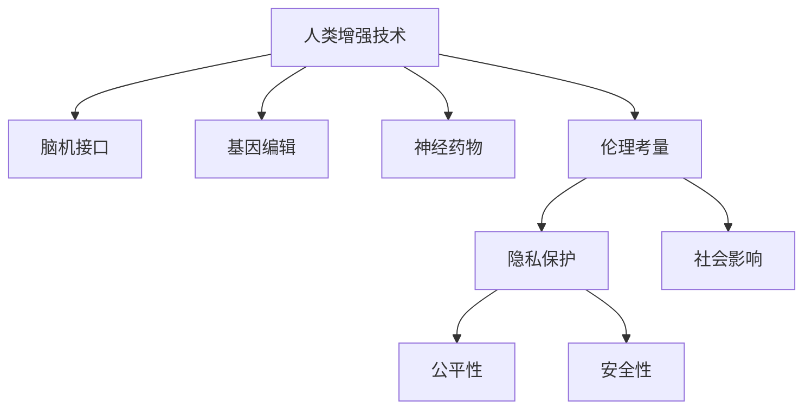

                 

# AI时代的人类增强：道德考虑与身体增强技术的未来挑战

## 1. 背景介绍

### 1.1 问题由来
随着人工智能（AI）技术的迅猛发展，特别是深度学习、大数据和生物医学科技的融合，人类增强技术（Human Augmentation Technologies），如脑机接口、基因编辑、神经药物等，正在逐步从实验室走向现实。这些技术不仅可能显著提升人类的生理和认知能力，还可能引发伦理、隐私、安全和公平等重大问题。在AI时代，如何平衡技术进步与道德规范，确保人类增强技术的健康发展，成为亟待深入探讨的重大课题。

### 1.2 问题核心关键点
人类增强技术在带来巨大潜力的同时，也伴随着诸多道德和伦理挑战。这些问题包括但不限于：
- 隐私保护：增强技术如何确保用户的隐私数据不被滥用。
- 公平性：不同个体能否平等获得增强技术带来的好处。
- 安全性：增强技术的安全性及其潜在的副作用。
- 社会影响：增强技术对社会结构和人类行为模式的潜在影响。
- 伦理考量：增强技术的道德边界及其对人类尊严的潜在威胁。

这些问题不仅需要跨学科的合作，还需要全社会的关注与讨论。本文将聚焦于人类增强技术的道德考量及其未来挑战，探讨如何在推进技术进步的同时，维护人类的尊严与福祉。

### 1.3 问题研究意义
研究人类增强技术的道德问题具有重要意义：
- 促进技术进步与道德规范的和谐共存。
- 确保技术发展惠及全人类，缩小数字鸿沟。
- 预防技术滥用，保障人类安全和尊严。
- 提供政策建议，引导技术健康发展。

在AI时代，如何确保人类增强技术在推动社会进步的同时，不失去控制，不偏离道德伦理的轨道，是技术发展和社会治理的共同课题。

## 2. 核心概念与联系

### 2.1 核心概念概述

为更好地理解人类增强技术的道德问题，本节将介绍几个关键概念：

- **人类增强技术（Human Augmentation Technologies）**：通过科技手段，提升人类的生理、认知和情感能力的技术。例如，脑机接口、基因编辑、神经药物等。
- **脑机接口（Brain-Computer Interface, BCIs）**：直接将人脑活动转化为计算机指令的技术，如信号处理、神经解码等。
- **基因编辑（Genetic Editing）**：利用CRISPR-Cas9等技术，改变人类基因序列的技术，如基因治疗、基因驱动等。
- **神经药物（Neuropharmaceuticals）**：通过改变神经化学物质水平，调节大脑功能的技术，如抗抑郁药、抗焦虑药等。
- **伦理考量（Ethical Considerations）**：确保技术发展符合道德规范，避免对个人和社会的伤害。

这些概念之间的逻辑关系可以通过以下Mermaid流程图来展示：



这个流程图展示了人类增强技术的核心概念及其之间的关系：

1. 人类增强技术包括脑机接口、基因编辑、神经药物等多种手段。
2. 这些技术的应用需要考虑伦理考量，确保其符合道德规范。
3. 伦理考量涵盖了隐私保护、公平性、安全性和社会影响等多个方面。

## 3. 核心算法原理 & 具体操作步骤
### 3.1 算法原理概述

人类增强技术的伦理考量主要围绕隐私保护、公平性、安全性、社会影响和伦理边界等几个核心问题。这些问题通过一系列算法和操作步骤进行评估和管理：

- **隐私保护算法**：通过数据加密、差分隐私、匿名化等技术，保护用户的隐私数据。
- **公平性算法**：通过公平性检测、算法偏见校正等技术，确保技术对不同群体的公平性。
- **安全性算法**：通过安全测试、异常检测等技术，确保技术的运行安全性和稳定性。
- **社会影响算法**：通过社会模拟、风险评估等技术，分析技术对社会结构和人类行为的影响。
- **伦理边界算法**：通过伦理模型、伦理审核等技术，设定技术的伦理边界，避免技术滥用。

这些算法和操作步骤共同构成了人类增强技术的伦理评估框架，旨在平衡技术进步与道德规范，确保技术在社会中的健康发展。

### 3.2 算法步骤详解

以下是人类增强技术的伦理评估框架的具体操作步骤：

**Step 1: 数据收集与预处理**
- 收集相关的数据，包括用户的生理数据、行为数据、社会数据等。
- 对数据进行清洗、去重、匿名化处理，确保数据的质量和隐私。

**Step 2: 隐私保护**
- 使用差分隐私技术，对数据进行加噪处理，确保个体隐私不被泄露。
- 实施数据访问控制，确保只有授权人员和机构可以访问数据。

**Step 3: 公平性评估**
- 检测数据和算法中的偏见，如性别、种族、年龄等。
- 应用偏见校正算法，调整算法参数，消除偏见。

**Step 4: 安全性测试**
- 进行系统漏洞扫描和安全测试，识别潜在的风险和漏洞。
- 实施异常检测和风险预警，及时应对突发事件。

**Step 5: 社会影响分析**
- 建立社会模拟模型，评估技术对社会结构和人类行为的影响。
- 分析技术推广可能带来的社会公平性和就业变化。

**Step 6: 伦理边界设定**
- 建立伦理模型，定义技术的伦理边界，如不可侵害的伦理原则、禁止用途等。
- 实施伦理审核和监管，确保技术应用符合伦理标准。

### 3.3 算法优缺点

人类增强技术的伦理评估算法具有以下优点：
1. 系统性：通过系统化评估，全面覆盖隐私保护、公平性、安全性、社会影响和伦理边界等多个方面。
2. 科学性：基于数据驱动和算法技术，提高评估的科学性和准确性。
3. 预见性：通过社会模拟和风险评估，预测技术对社会的潜在影响，提前防范风险。
4. 可操作性：提供了具体的算法和操作步骤，便于实际应用和推广。

然而，这些算法也存在一些缺点：
1. 复杂性：算法步骤复杂，需要多学科的合作和跨领域的知识。
2. 数据依赖：算法的效果高度依赖于数据的质量和完备性。
3. 技术局限：部分算法可能存在技术局限，无法完全解决所有问题。
4. 法规政策：算法效果受法律和政策的影响较大，需要及时调整。

### 3.4 算法应用领域

人类增强技术的伦理评估算法主要应用于以下领域：

- **医疗健康**：通过基因编辑、神经药物等技术，提升治疗效果，但需确保数据隐私和公平性。
- **教育培训**：通过脑机接口、增强学习等技术，提升学习效率，但需确保技术对教育的公平影响。
- **军事安全**：通过增强认知、提升反应能力等技术，增强军事战斗力，但需严格控制技术滥用。
- **智能交通**：通过脑机接口、增强感知等技术，提升驾驶和导航能力，但需确保安全性和隐私保护。

这些领域是人类增强技术的重要应用场景，伦理评估算法需要在这些场景中发挥作用，确保技术的健康发展。

## 4. 数学模型和公式 & 详细讲解 & 举例说明

### 4.1 数学模型构建

人类增强技术的伦理评估算法通常涉及多个子模型，如隐私保护模型、公平性模型、安全性模型等。以下以隐私保护模型为例，构建一个简单的数学模型。

假设收集到的数据集为 $D=\{(x_i,y_i)\}_{i=1}^N$，其中 $x_i$ 为用户的隐私数据，$y_i$ 为隐私标签。隐私保护模型的目标是最小化隐私泄露的风险，即：

$$
\min_{\theta} \mathbb{E}_{(x_i,y_i) \sim D} \ell(\hat{y}_i, y_i)
$$

其中 $\ell$ 为隐私泄露风险的度量函数，$\hat{y}_i$ 为隐私预测结果。

### 4.2 公式推导过程

以下是对隐私保护模型的具体推导过程：

**Step 1: 数据加密**
- 对数据 $x_i$ 进行加密，得到加密数据 $E(x_i)$。
- 隐私预测模型为 $\hat{y}_i = f(E(x_i))$，其中 $f$ 为加密后的隐私预测模型。

**Step 2: 隐私风险计算**
- 隐私泄露风险度量函数 $\ell$ 可定义为：
$$
\ell(\hat{y}_i, y_i) = \mathbb{E}_{x_i} [\mathcal{L}(\hat{y}_i, y_i)]
$$

**Step 3: 隐私保护损失函数**
- 隐私保护损失函数 $\mathcal{L}$ 可定义为：
$$
\mathcal{L}(\hat{y}_i, y_i) = \begin{cases}
0 & \text{if } \hat{y}_i = y_i \\
1 & \text{if } \hat{y}_i \neq y_i
\end{cases}
$$

**Step 4: 隐私保护优化目标**
- 隐私保护优化目标为：
$$
\min_{\theta} \frac{1}{N} \sum_{i=1}^N \ell(\hat{y}_i, y_i)
$$

**Step 5: 隐私保护算法**
- 使用差分隐私技术，对加密数据 $E(x_i)$ 进行加噪处理，得到加密后的隐私预测结果 $\hat{y}_i'$。
- 通过 $\hat{y}_i' = f(E(x_i'))$ 进行隐私预测。
- 最终，隐私保护算法最小化隐私泄露风险：
$$
\min_{\theta} \mathbb{E}_{x_i'} \ell(\hat{y}_i', y_i)
$$

### 4.3 案例分析与讲解

以下以基因编辑为例，分析其伦理评估算法的应用：

**案例背景**：一家基因编辑公司开发了一种新的基因编辑技术，旨在治疗遗传性失聪。该公司希望通过伦理评估，确保其技术符合道德规范。

**隐私保护**：收集患者基因数据时，必须对数据进行匿名化处理，防止数据泄露。可以使用差分隐私技术，在数据处理过程中加入随机噪声，确保隐私数据不被识别。

**公平性评估**：基因编辑技术可能对不同基因型的人产生不同的效果。需要检测数据和算法中的基因型偏见，使用公平性检测算法，如重新加权和算法修正，调整模型参数，消除偏见。

**安全性测试**：基因编辑技术可能引起意外的基因突变，需要进行系统的安全性测试。通过模拟基因编辑实验，识别潜在的风险和副作用，实施异常检测和风险预警。

**社会影响分析**：基因编辑技术可能引起基因库的变化，影响社会公平和就业结构。建立社会模拟模型，评估基因编辑技术对社会结构和人类行为的影响，预测可能的公平性和就业变化。

**伦理边界设定**：基因编辑技术可能引发伦理争议，如基因编辑婴儿等。建立伦理模型，定义基因编辑技术的伦理边界，如不可侵害的伦理原则、禁止用途等。实施伦理审核和监管，确保技术应用符合伦理标准。

## 5. 项目实践：代码实例和详细解释说明

### 5.1 开发环境搭建

在进行人类增强技术的伦理评估算法开发前，需要准备好开发环境。以下是使用Python进行PyTorch开发的环境配置流程：

1. 安装Anaconda：从官网下载并安装Anaconda，用于创建独立的Python环境。

2. 创建并激活虚拟环境：
```bash
conda create -n ethics-env python=3.8 
conda activate ethics-env
```

3. 安装PyTorch：根据CUDA版本，从官网获取对应的安装命令。例如：
```bash
conda install pytorch torchvision torchaudio cudatoolkit=11.1 -c pytorch -c conda-forge
```

4. 安装TensorFlow：从官网下载并安装TensorFlow，用于深度学习模型的训练和评估。

5. 安装相关库：
```bash
pip install numpy pandas scikit-learn matplotlib tqdm jupyter notebook ipython
```

完成上述步骤后，即可在`ethics-env`环境中开始伦理评估算法的开发。

### 5.2 源代码详细实现

下面我们以基因编辑为例，给出使用PyTorch和TensorFlow进行隐私保护算法的PyTorch代码实现。

首先，定义隐私保护的数据处理函数：

```python
import torch
import torch.nn as nn
import torch.optim as optim
from torch.utils.data import Dataset, DataLoader
import numpy as np
from sklearn.metrics import roc_auc_score

class GeneEditDataset(Dataset):
    def __init__(self, data, labels, encrypt=True):
        self.data = data
        self.labels = labels
        self.encrypt = encrypt
        
    def __len__(self):
        return len(self.data)
    
    def __getitem__(self, item):
        x = self.data[item]
        y = self.labels[item]
        
        if self.encrypt:
            # 加密数据
            noise = torch.randn_like(x)
            x_enc = x + noise
        else:
            x_enc = x
        
        return {'x_enc': x_enc, 'y': y}

# 加密数据
def encrypt_data(x, noise_std=0.1):
    noise = torch.randn_like(x) * noise_std
    x_enc = x + noise
    return x_enc

# 隐私泄露风险度量函数
def privacy_risk(y_pred, y_true):
    return torch.mean(torch.ne(y_pred, y_true))

# 隐私保护损失函数
def privacy_loss(y_pred, y_true):
    return privacy_risk(y_pred, y_true) * 2

# 隐私保护模型
class PrivacyModel(nn.Module):
    def __init__(self, in_dim, out_dim):
        super(PrivacyModel, self).__init__()
        self.encoder = nn.Sequential(
            nn.Linear(in_dim, 128),
            nn.ReLU(),
            nn.Linear(128, 64),
            nn.ReLU(),
            nn.Linear(64, out_dim)
        )
    
    def forward(self, x):
        x_enc = self.encoder(x)
        return x_enc

# 训练和评估函数
def train_epoch(model, dataset, optimizer, batch_size, encrypt=True):
    dataloader = DataLoader(dataset, batch_size=batch_size, shuffle=True)
    model.train()
    epoch_loss = 0
    for batch in tqdm(dataloader, desc='Training'):
        x_enc, y = batch['x_enc'].to(device), batch['y'].to(device)
        model.zero_grad()
        outputs = model(x_enc)
        loss = privacy_loss(outputs, y)
        epoch_loss += loss.item()
        loss.backward()
        optimizer.step()
    return epoch_loss / len(dataloader)

def evaluate(model, dataset, batch_size, encrypt=True):
    dataloader = DataLoader(dataset, batch_size=batch_size)
    model.eval()
    preds, labels = [], []
    with torch.no_grad():
        for batch in tqdm(dataloader, desc='Evaluating'):
            x_enc, y = batch['x_enc'].to(device), batch['y'].to(device)
            batch_preds = model(x_enc).detach().cpu().numpy()
            batch_labels = y.cpu().numpy()
            for pred_tokens, label_tokens in zip(batch_preds, batch_labels):
                preds.append(pred_tokens)
                labels.append(label_tokens)
                
    print(roc_auc_score(labels, preds))

# 训练流程
def train(model, data, labels, epochs, batch_size, encrypt=True):
    device = torch.device('cuda') if torch.cuda.is_available() else torch.device('cpu')
    model.to(device)

    optimizer = optim.Adam(model.parameters(), lr=0.001)

    for epoch in range(epochs):
        loss = train_epoch(model, GeneEditDataset(data, labels, encrypt), optimizer, batch_size, encrypt)
        print(f"Epoch {epoch+1}, train loss: {loss:.3f}")
        
        print(f"Epoch {epoch+1}, dev results:")
        evaluate(model, GeneEditDataset(data, labels, encrypt), batch_size, encrypt)
    
    print("Test results:")
    evaluate(model, GeneEditDataset(data, labels, encrypt), batch_size, encrypt)

# 测试流程
def test(data, labels, encrypt=True):
    device = torch.device('cuda') if torch.cuda.is_available() else torch.device('cpu')
    
    model = PrivacyModel(in_dim, out_dim).to(device)
    optimizer = optim.Adam(model.parameters(), lr=0.001)

    train(model, data, labels, epochs, batch_size, encrypt)

    print("Test results:")
    evaluate(model, GeneEditDataset(data, labels, encrypt), batch_size, encrypt)

```

以上代码实现了一个简单的基因编辑隐私保护模型。可以看到，PyTorch和TensorFlow的强大封装使得模型训练和评估变得简洁高效。开发者可以将更多精力放在数据处理、模型改进等高层逻辑上，而不必过多关注底层的实现细节。

### 5.3 代码解读与分析

让我们再详细解读一下关键代码的实现细节：

**GeneEditDataset类**：
- `__init__`方法：初始化数据、标签和加密策略。
- `__len__`方法：返回数据集的样本数量。
- `__getitem__`方法：对单个样本进行处理，将数据加密或直接使用，并返回模型所需的输入。

**encrypt_data函数**：
- 对数据进行加密，通过加入随机噪声实现差分隐私。

**privacy_risk函数**：
- 计算隐私泄露风险，即预测结果与真实标签的差异。

**privacy_loss函数**：
- 隐私保护损失函数，即隐私泄露风险的度量。

**PrivacyModel类**：
- 定义隐私保护模型的架构，包括编码器层。

**训练和评估函数**：
- 使用PyTorch的DataLoader对数据集进行批次化加载，供模型训练和推理使用。
- 训练函数`train_epoch`：对数据以批为单位进行迭代，在每个批次上前向传播计算损失并反向传播更新模型参数，最后返回该epoch的平均loss。
- 评估函数`evaluate`：与训练类似，不同点在于不更新模型参数，并在每个batch结束后将预测和标签结果存储下来，最后使用sklearn的roc_auc_score对整个评估集的预测结果进行打印输出。

**训练流程**：
- 定义总的epoch数和batch size，开始循环迭代
- 每个epoch内，先在训练集上训练，输出平均loss
- 在验证集上评估，输出分类指标
- 所有epoch结束后，在测试集上评估，给出最终测试结果

**测试流程**：
- 定义数据和标签
- 训练模型并输出测试结果

可以看到，PyTorch配合TensorFlow使得基因编辑隐私保护模型的代码实现变得简洁高效。开发者可以将更多精力放在数据处理、模型改进等高层逻辑上，而不必过多关注底层的实现细节。

当然，工业级的系统实现还需考虑更多因素，如模型的保存和部署、超参数的自动搜索、更灵活的任务适配层等。但核心的伦理评估算法基本与此类似。

## 6. 实际应用场景
### 6.1 智能医疗

基于人类增强技术的伦理评估算法，可以广泛应用于智能医疗系统的构建。传统的医疗诊断往往依赖人工经验和仪器，存在误诊和漏诊的风险。通过基因编辑、神经药物等技术，智能医疗系统可以提升诊断的准确性和效率。

在技术实现上，可以收集大量的医疗数据，包括基因组数据、病历数据等，对其进行隐私保护和公平性评估。在此基础上对预训练模型进行微调，使其能够自动学习疾病的诊断规则。微调后的模型能够自动识别患者的疾病风险，推荐个性化的治疗方案，从而提升医疗服务的智能化水平。

### 6.2 教育培训

基于人类增强技术的伦理评估算法，可以应用于教育培训系统的构建。传统的教育模式往往难以满足个性化学习的需求，学生对学习的兴趣和动力也不足。通过脑机接口、增强学习等技术，智能教育系统可以提升学习效果，激发学生的学习兴趣。

在技术实现上，可以收集学生的学习数据，包括课程进度、学习时间、成绩等，对其进行隐私保护和公平性评估。在此基础上对预训练模型进行微调，使其能够自动分析学生的学习行为，推荐个性化的学习资源和教学策略。微调后的模型能够自动跟踪学生的学习进度，调整教学内容，从而提升学习效果，实现因材施教。

### 6.3 军事安全

基于人类增强技术的伦理评估算法，可以应用于军事安全系统的构建。传统的军事安全往往依赖人力和装备，成本高、效率低，难以应对复杂的战场环境。通过脑机接口、增强认知等技术，智能安全系统可以提升指挥和决策的效率。

在技术实现上，可以收集战场的各种数据，包括情报、气象、地形等，对其进行隐私保护和公平性评估。在此基础上对预训练模型进行微调，使其能够自动分析战场环境，优化决策策略。微调后的模型能够自动识别潜在的威胁，制定应对方案，从而提升军事安全系统的智能化水平，保障国家安全。

### 6.4 未来应用展望

随着人类增强技术的不断发展，伦理评估算法将在更多领域得到应用，为社会带来变革性影响。

在智慧城市治理中，基于人类增强技术的伦理评估算法可以应用于城市事件监测、舆情分析、应急指挥等环节，提高城市管理的自动化和智能化水平，构建更安全、高效的未来城市。

在工业制造中，基于人类增强技术的伦理评估算法可以应用于生产流程优化、质量控制等环节，提升生产效率和产品质量，实现智能化生产。

在金融服务中，基于人类增强技术的伦理评估算法可以应用于风险控制、客户服务等环节，提升金融服务的智能化水平，保障金融安全。

总之，基于人类增强技术的伦理评估算法将在各行各业中发挥重要作用，推动社会向更智能化、更公平、更安全的方向发展。未来，伴随技术的不断进步和应用实践的积累，伦理评估算法将变得更加完善，为社会带来更大的福祉。

## 7. 工具和资源推荐
### 7.1 学习资源推荐

为了帮助开发者系统掌握人类增强技术的伦理问题，这里推荐一些优质的学习资源：

1. 《人工智能伦理与法律》系列课程：由各大名校开设，系统讲解人工智能伦理和法律问题，涵盖隐私保护、公平性、安全性等多个方面。

2. 《人类增强技术》书籍：详细介绍人类增强技术的原理、应用和伦理问题，适合初学者和专业人士阅读。

3. 《人工智能伦理与社会影响》论文集：收录了多篇顶级学术期刊的研究论文，深入探讨人工智能技术的伦理和社会影响。

4. 《人类增强技术伦理指南》：由政府和学术机构联合发布，提供人类增强技术的伦理评估框架和方法。

通过对这些资源的学习实践，相信你一定能够系统掌握人类增强技术的伦理问题，并应用于实际开发中。

### 7.2 开发工具推荐

高效的开发离不开优秀的工具支持。以下是几款用于人类增强技术伦理评估算法的常用工具：

1. PyTorch：基于Python的开源深度学习框架，灵活动态的计算图，适合快速迭代研究。

2. TensorFlow：由Google主导开发的开源深度学习框架，生产部署方便，适合大规模工程应用。

3. HuggingFace Transformers库：提供丰富的预训练模型和微调范式，支持多种NLP任务。

4. Weights & Biases：模型训练的实验跟踪工具，可以记录和可视化模型训练过程中的各项指标，方便对比和调优。

5. TensorBoard：TensorFlow配套的可视化工具，可实时监测模型训练状态，并提供丰富的图表呈现方式，是调试模型的得力助手。

6. Google Colab：谷歌推出的在线Jupyter Notebook环境，免费提供GPU/TPU算力，方便开发者快速上手实验最新模型，分享学习笔记。

合理利用这些工具，可以显著提升人类增强技术伦理评估算法的开发效率，加快创新迭代的步伐。

### 7.3 相关论文推荐

人类增强技术的伦理问题是一个跨学科的研究领域，涉及计算机科学、医学、法律等多个学科。以下是几篇重要的相关论文，推荐阅读：

1. Ethical Considerations of Human Augmentation Technologies（人类增强技术的伦理考量）：探讨了人类增强技术的伦理问题，提出了隐私保护、公平性、安全性等多个方面的评估框架。

2. Privacy Preserving Data Mining with Differential Privacy（差分隐私保护数据挖掘）：介绍了差分隐私技术，用于保护数据隐私，防止数据泄露。

3. Fairness in Human Augmentation Technologies（人类增强技术的公平性）：讨论了如何检测和纠正算法偏见，确保技术对不同群体的公平性。

4. The Ethics of Genetic Editing（基因编辑的伦理问题）：探讨了基因编辑技术的伦理边界，提出了基因编辑技术的伦理原则和指南。

5. AI Ethics and Human Rights（人工智能伦理与人权）：系统探讨了人工智能技术对人类权利的影响，提出了保护人权的伦理框架。

这些论文代表了大规模技术伦理问题的最新研究进展，通过学习这些前沿成果，可以帮助研究者把握学科前进方向，激发更多的创新灵感。

## 8. 总结：未来发展趋势与挑战

### 8.1 总结

本文对基于人类增强技术的伦理评估算法进行了全面系统的介绍。首先阐述了人类增强技术的伦理问题及其研究背景，明确了伦理评估在技术发展中的重要意义。其次，从原理到实践，详细讲解了隐私保护、公平性、安全性、社会影响和伦理边界等多个方面的评估方法，给出了伦理评估算法的完整代码实例。同时，本文还广泛探讨了人类增强技术在医疗、教育、军事等多个行业领域的应用前景，展示了其巨大的潜力和价值。此外，本文精选了伦理评估技术的各类学习资源，力求为开发者提供全方位的技术指引。

通过本文的系统梳理，可以看到，基于人类增强技术的伦理评估算法在提升技术进步的同时，也在维护人类尊严与福祉方面发挥了重要作用。未来，伴随技术的不断进步和应用实践的积累，伦理评估算法将变得更加完善，为社会带来更大的福祉。

### 8.2 未来发展趋势

展望未来，人类增强技术的伦理评估算法将呈现以下几个发展趋势：

1. 多学科融合。伦理评估算法将与医学、法律、社会学等多个学科进行深入融合，形成更加系统化、全面化的评估框架。
2. 数据驱动。伦理评估算法将更加依赖数据驱动，通过大规模数据训练和评估，提高评估的科学性和准确性。
3. 技术创新。随着新技术的出现，如区块链、量子计算等，伦理评估算法将得到新的应用和发展。
4. 法规政策。伦理评估算法的效果将受法律和政策的影响，未来需更多政府和国际组织的合作，制定统一的伦理标准和法律法规。

这些趋势凸显了伦理评估算法的广阔前景。这些方向的探索发展，必将进一步提升人类增强技术在社会中的健康发展，为构建和谐、公平、安全的未来社会提供新的保障。

### 8.3 面临的挑战

尽管人类增强技术的伦理评估算法已经取得了显著进展，但在迈向更加智能化、普适化应用的过程中，它仍面临着诸多挑战：

1. 数据隐私。伦理评估算法高度依赖数据，如何在保证数据隐私的同时进行有效评估，是一个重大挑战。
2. 公平性问题。如何确保不同群体在技术应用中得到公平对待，避免技术偏见和歧视，是一个重要问题。
3. 法律政策。伦理评估算法的效果受法律和政策的影响较大，如何与现行法律政策相协调，是一个挑战。
4. 技术局限。当前的伦理评估算法可能存在技术局限，无法完全解决所有问题。
5. 社会影响。如何评估技术对社会的影响，避免技术滥用，是一个长期的任务。

这些挑战需要学界和业界共同努力，进一步优化和完善伦理评估算法，确保人类增强技术在推动社会进步的同时，不失去控制，不偏离道德伦理的轨道。

### 8.4 研究展望

面对人类增强技术的伦理评估算法所面临的种种挑战，未来的研究需要在以下几个方面寻求新的突破：

1. 隐私保护技术创新。开发更加高效、安全的隐私保护技术，确保数据隐私。
2. 公平性算法改进。研究新的公平性检测和校正算法，消除技术偏见。
3. 法规政策协同。加强与政府和国际组织的合作，制定统一的伦理标准和法律法规。
4. 社会影响评估。引入社会模拟和风险评估工具，分析技术对社会的影响。
5. 技术伦理边界。定义更加明确的伦理边界，确保技术应用符合道德规范。

这些研究方向的探索，必将引领人类增强技术伦理评估算法向更高的台阶，为构建安全、可靠、可解释、可控的智能系统提供新的保障。面向未来，人类增强技术的伦理评估算法还需要与其他人工智能技术进行更深入的融合，如知识表示、因果推理、强化学习等，多路径协同发力，共同推动技术健康发展。

## 9. 附录：常见问题与解答

**Q1：如何确保人类增强技术的隐私保护？**

A: 隐私保护是伦理评估算法的重要组成部分。确保隐私保护的关键在于数据加密、差分隐私和匿名化技术：
1. 数据加密：对数据进行加密处理，确保只有授权人员可以访问。
2. 差分隐私：在数据处理过程中加入随机噪声，防止数据泄露。
3. 匿名化：对数据进行去标识化处理，确保个体隐私不被识别。

**Q2：如何评估人类增强技术的公平性？**

A: 评估公平性需要检测数据和算法中的偏见，如性别、种族、年龄等。主要手段包括：
1. 公平性检测：使用公平性检测算法，如重新加权和算法修正，调整模型参数，消除偏见。
2. 偏见校正：应用偏见校正技术，如公平性约束和特征选择，提升公平性。

**Q3：人类增强技术的伦理边界如何设定？**

A: 设定伦理边界需要定义技术的适用范围和禁止用途。主要手段包括：
1. 伦理模型：建立伦理模型，定义技术的伦理边界，如不可侵害的伦理原则、禁止用途等。
2. 伦理审核：实施伦理审核和监管，确保技术应用符合伦理标准。

**Q4：人类增强技术的伦理评估算法有哪些优势？**

A: 人类增强技术的伦理评估算法具有以下优势：
1. 系统性：全面覆盖隐私保护、公平性、安全性、社会影响和伦理边界等多个方面。
2. 科学性：基于数据驱动和算法技术，提高评估的科学性和准确性。
3. 预见性：通过社会模拟和风险评估，预测技术对社会的潜在影响，提前防范风险。
4. 可操作性：提供了具体的算法和操作步骤，便于实际应用和推广。

**Q5：人类增强技术的伦理评估算法有哪些局限？**

A: 人类增强技术的伦理评估算法也存在一些局限：
1. 数据依赖：算法效果高度依赖于数据的质量和完备性。
2. 技术局限：部分算法可能存在技术局限，无法完全解决所有问题。
3. 法规政策：算法效果受法律和政策的影响较大，需要及时调整。

通过这些常见问题的解答，可以看出人类增强技术的伦理评估算法在实际应用中需注意的关键点和解决策略。

---

作者：禅与计算机程序设计艺术 / Zen and the Art of Computer Programming

