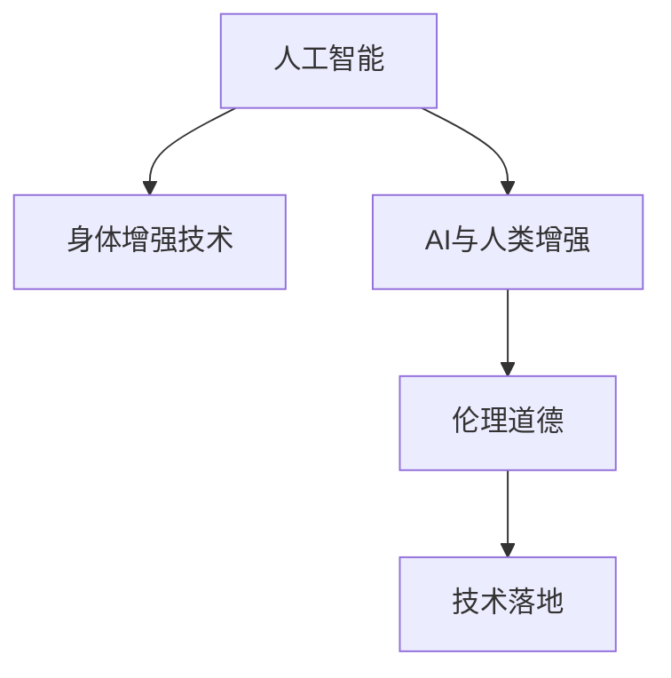

                 

# AI时代的人类增强：道德考虑与身体增强技术的融合

## 1. 背景介绍

随着人工智能技术的飞速发展，AI时代已悄然到来。人类在享受着AI带来的便利的同时，也开始面临各种新的挑战和伦理道德问题。其中，人类增强技术便是近年来备受关注的一个话题。通过科技手段提升人类在身体、认知和情感等方面的能力，可以为人类社会带来革命性的变化。然而，在追求技术进步的过程中，我们不得不面对一些无法回避的道德难题。

## 2. 核心概念与联系

### 2.1 核心概念概述

**人工智能**：一种通过模拟人类智能行为，使机器具备问题解决能力的科技。它涵盖了计算机视觉、自然语言处理、机器学习、深度学习等众多子领域。

**身体增强技术**：通过生物技术、材料科学和工程学等手段，提高人类身体能力的技术，如基因编辑、义肢、脑机接口等。

**AI与人类增强**：将人工智能技术与身体增强技术相结合，使人类在认知、情感和行动能力上得到提升。

**伦理道德**：在利用AI技术提升人类能力时，必须遵守的一系列道德规范和准则，如隐私保护、自主性、公平性等。

这些概念之间的逻辑关系可以通过以下Mermaid流程图来展示：



## 3. 核心算法原理 & 具体操作步骤
### 3.1 算法原理概述

AI与人类增强的核心在于利用人工智能技术提升身体能力，而这种提升的实现涉及到多方面的技术和伦理问题。本文主要聚焦于以下几个关键问题：

**问题一：如何使用AI进行身体增强？**

答案：AI可以通过模拟感知、决策和控制等过程，来提升人类在身体和认知方面的能力。例如，通过计算机视觉技术，AI可以帮助失明人士“看到”世界；通过语音识别技术，AI可以帮助听障人士“听到”声音；通过自然语言处理技术，AI可以帮助自闭症患者更好地进行语言交流。

**问题二：在提升身体能力的过程中，如何保证伦理道德？**

答案：伦理道德的考虑至关重要。在开发和使用AI身体增强技术时，需要充分考虑隐私保护、自主性、公平性和安全性等问题。例如，在使用基因编辑技术时，需要保证基因编辑的准确性和安全性，避免出现伦理道德上的争议。

### 3.2 算法步骤详解

以下是开发和使用AI身体增强技术的基本步骤：

**Step 1：需求分析**

1. 明确需要解决的问题，如视觉障碍、听障、自闭症等。
2. 确定AI技术的种类和应用场景，如计算机视觉、语音识别、自然语言处理等。
3. 进行伦理道德分析，评估技术应用的潜在风险和影响。

**Step 2：技术选型**

1. 选择适合的AI技术，如卷积神经网络(CNN)、循环神经网络(RNN)、生成对抗网络(GAN)等。
2. 选择合适的硬件平台，如GPU、FPGA、ASIC等。
3. 评估技术的可行性、成熟度和成本效益。

**Step 3：模型训练与优化**

1. 收集和准备数据集，如图像、音频、文本等。
2. 设计和训练AI模型，如CNN用于图像处理、RNN用于语音识别、GAN用于图像生成等。
3. 对模型进行优化和调整，以提高准确率和鲁棒性。

**Step 4：系统集成**

1. 将训练好的AI模型集成到增强设备中，如义肢、助听器、助听眼镜等。
2. 对增强设备进行测试和验证，确保其稳定性和安全性。
3. 对用户进行培训和指导，帮助其熟练使用增强设备。

**Step 5：伦理审查与监管**

1. 对增强技术进行伦理审查，评估其对社会和个人的影响。
2. 制定和遵守相关的法律和道德规范，如隐私保护法、医疗伦理准则等。
3. 建立监管机制，确保技术的公平性和安全性。

### 3.3 算法优缺点

**优点：**

1. 提高人类能力。AI身体增强技术可以为人类提供更加高效、准确和便捷的能力提升。
2. 推动科技进步。AI技术的发展和应用，可以带动相关产业的创新和进步。
3. 提升生活质量。AI身体增强技术可以帮助残疾人更好地融入社会，提高生活质量。

**缺点：**

1. 伦理道德风险。AI技术的应用可能带来隐私、安全、自主性等方面的问题。
2. 技术依赖性。过度依赖AI技术，可能导致人类自身的思考和决策能力退化。
3. 技术成本高。AI技术开发和应用成本较高，可能难以普及。

### 3.4 算法应用领域

AI与人类增强技术在多个领域都有广泛的应用：

- **医疗健康**：AI技术可以辅助诊断疾病、制定治疗方案、监控健康状况等。
- **教育培训**：AI技术可以帮助学生学习、评估学习效果、提供个性化教育等。
- **工业生产**：AI技术可以提高生产效率、减少成本、保障安全等。
- **娱乐休闲**：AI技术可以提供更好的娱乐体验、增强虚拟现实体验等。

## 4. 数学模型和公式 & 详细讲解 & 举例说明

### 4.1 数学模型构建

在AI身体增强技术中，数学模型用于描述和计算AI系统和增强设备之间的互动关系。例如，在计算机视觉中，可以使用卷积神经网络(CNN)模型来处理图像数据。

### 4.2 公式推导过程

以计算机视觉为例，CNN模型的基本公式如下：

$$
y = f(Wx + b)
$$

其中，$y$表示输出结果，$x$表示输入数据，$W$表示卷积核，$b$表示偏置项，$f$表示激活函数。

### 4.3 案例分析与讲解

以图像识别为例，CNN模型可以通过多层卷积、池化和全连接层，逐步提取图像特征并进行分类。在训练过程中，通过反向传播算法，调整卷积核和偏置项，优化模型性能。

## 5. 项目实践：代码实例和详细解释说明

### 5.1 开发环境搭建

以下是使用Python和TensorFlow进行计算机视觉项目开发的开发环境搭建流程：

1. 安装Anaconda：从官网下载并安装Anaconda，用于创建独立的Python环境。
2. 创建并激活虚拟环境：
```bash
conda create -n cv_env python=3.8 
conda activate cv_env
```

3. 安装必要的依赖库：
```bash
pip install tensorflow numpy matplotlib
```

4. 下载并解压数据集，如MNIST手写数字数据集：
```bash
wget http://yann.lecun.com/exdb/mnist/
tar -xvzf mnist-new.tar.gz
```

### 5.2 源代码详细实现

以下是使用TensorFlow实现CNN模型进行图像识别的PyTorch代码实现。

```python
import tensorflow as tf
from tensorflow.keras import layers, models

# 构建CNN模型
model = models.Sequential()
model.add(layers.Conv2D(32, (3,3), activation='relu', input_shape=(28,28,1)))
model.add(layers.MaxPooling2D((2,2)))
model.add(layers.Conv2D(64, (3,3), activation='relu'))
model.add(layers.MaxPooling2D((2,2)))
model.add(layers.Flatten())
model.add(layers.Dense(10, activation='softmax'))

# 编译模型
model.compile(optimizer='adam',
              loss='sparse_categorical_crossentropy',
              metrics=['accuracy'])

# 加载数据集
(x_train, y_train), (x_test, y_test) = tf.keras.datasets.mnist.load_data()

# 数据预处理
x_train = x_train.reshape(-1, 28, 28, 1) / 255.0
x_test = x_test.reshape(-1, 28, 28, 1) / 255.0
y_train = y_train.astype('float32')
y_test = y_test.astype('float32')

# 训练模型
model.fit(x_train, y_train, epochs=5, batch_size=32, validation_data=(x_test, y_test))
```

### 5.3 代码解读与分析

以下是代码的详细解读：

**Sequential模型**：使用Sequential模型构建一个顺序化的神经网络结构。

**Conv2D层**：使用卷积层提取图像特征。

**MaxPooling2D层**：使用池化层减少特征数量，保留重要信息。

**Flatten层**：将多维特征展平，输入到全连接层。

**Dense层**：使用全连接层进行分类。

**softmax激活函数**：对输出进行归一化，表示概率分布。

**adam优化器**：使用Adam优化器进行梯度下降优化。

**损失函数**：使用交叉熵损失函数。

**准确率指标**：使用准确率作为模型评估指标。

**数据预处理**：将数据进行归一化处理，确保模型稳定训练。

**模型训练**：使用fit方法进行模型训练，设置训练轮数、批大小和验证数据集。

## 6. 实际应用场景

### 6.1 医疗健康

AI技术在医疗健康领域的应用，可以帮助医生进行疾病诊断、制定治疗方案和监控健康状况。例如，使用计算机视觉技术，AI可以辅助医生分析医学影像，识别疾病；使用自然语言处理技术，AI可以解析电子病历，提供医学知识支持。

### 6.2 教育培训

AI技术可以提供个性化教育、智能评估和辅助教学。例如，使用语音识别技术，AI可以提供语言学习反馈和个性化辅导；使用自然语言处理技术，AI可以分析学生的学习习惯和知识水平，制定个性化学习计划。

### 6.3 工业生产

AI技术可以提高生产效率、减少成本和保障安全。例如，使用计算机视觉技术，AI可以检测产品缺陷、优化生产流程；使用机器学习技术，AI可以预测设备故障、优化供应链管理。

### 6.4 娱乐休闲

AI技术可以提供更好的娱乐体验和增强虚拟现实体验。例如，使用自然语言处理技术，AI可以提供智能聊天机器人，增强用户体验；使用增强现实技术，AI可以提供互动游戏和虚拟现实体验。

## 7. 工具和资源推荐

### 7.1 学习资源推荐

以下是几本推荐的学习资源，可以帮助读者深入理解AI身体增强技术：

1. 《深度学习》：Ian Goodfellow、Yoshua Bengio和Aaron Courville合著的深度学习经典教材。
2. 《人工智能：一种现代方法》：Stuart Russell和Peter Norvig合著的AI入门教材。
3. 《计算机视觉：算法与应用》：Richard Szeliski合著的计算机视觉教材。
4. 《自然语言处理综论》：Daniel Jurafsky和James H. Martin合著的自然语言处理教材。
5. 《Python机器学习》：Sebastian Raschka和Vahid Mirjalili合著的机器学习教材。

### 7.2 开发工具推荐

以下是几个推荐的使用工具，可以帮助开发者快速开发AI身体增强技术：

1. TensorFlow：由Google主导开发的开源深度学习框架，生产部署方便，适合大规模工程应用。
2. PyTorch：基于Python的开源深度学习框架，灵活动态的计算图，适合快速迭代研究。
3. OpenCV：开源计算机视觉库，提供了丰富的图像处理算法和工具。
4. ROS：开源机器人操作系统，提供了强大的机器人编程和仿真工具。
5. Intel Realsense：开源深度感知相机，可以提供高质量的深度信息和图像数据。

### 7.3 相关论文推荐

以下是几篇推荐的相关论文，可以帮助读者了解AI身体增强技术的研究现状和发展方向：

1. "Enhancing Human Sensory Capabilities with AI"：探讨使用AI技术提升人类感知能力的最新进展。
2. "Deep Learning for Medical Image Analysis"：介绍使用深度学习技术进行医学影像分析的研究成果。
3. "Human-Robot Interaction using AI"：研究使用AI技术实现人机交互的最新进展。
4. "Natural Language Processing for Personalized Education"：介绍使用自然语言处理技术进行个性化教育的最新成果。
5. "Robust AI for Autonomous Vehicles"：探讨使用AI技术提升自动驾驶系统性能的研究方向。

## 8. 总结：未来发展趋势与挑战

### 8.1 研究成果总结

AI与人类增强技术的研究已经取得了很多成果，特别是在计算机视觉、自然语言处理和机器人领域。这些技术的发展，正在改变人类社会的各个方面，包括医疗、教育、娱乐等。

### 8.2 未来发展趋势

未来，AI与人类增强技术的发展趋势主要包括以下几个方向：

1. 融合更多技术。未来的AI身体增强技术将与更多技术相结合，如生物医学、材料科学、脑科学等。
2. 提升人类能力。未来的AI技术将进一步提升人类的认知、情感和行动能力，使其在更广泛领域发挥作用。
3. 普惠化发展。未来的AI技术将更加普惠，惠及更多普通人群，提升社会公平和福祉。
4. 提高安全性。未来的AI技术将更加注重安全性，保障数据和用户隐私。

### 8.3 面临的挑战

尽管AI与人类增强技术的发展前景广阔，但也面临着许多挑战：

1. 伦理道德问题。在AI技术应用过程中，如何平衡技术进步与伦理道德，是一个重要的挑战。
2. 技术风险。AI技术的应用可能带来隐私、安全和自主性等方面的问题。
3. 技术成本。开发和使用AI技术需要大量的资源和资金投入，可能导致技术普及难度增加。
4. 技术瓶颈。当前的AI技术在处理复杂任务时，可能仍存在一些瓶颈和限制。

### 8.4 研究展望

未来的研究需要在以下几个方面进行进一步探索：

1. 加强伦理道德研究。加强对AI技术应用伦理道德的研究，制定合理的法律和规范。
2. 开发更加高效的技术。开发更加高效、安全的AI技术，提升人类能力。
3. 推动技术普惠化。推动AI技术的普惠化发展，让更多人受益。
4. 开展跨学科研究。开展跨学科研究，促进AI技术与更多学科的融合。

## 9. 附录：常见问题与解答

**Q1：AI技术如何提升人类能力？**

A: AI技术可以通过模拟感知、决策和控制等过程，提升人类在认知、情感和行动能力方面。例如，使用计算机视觉技术，AI可以帮助失明人士“看到”世界；使用语音识别技术，AI可以帮助听障人士“听到”声音；使用自然语言处理技术，AI可以帮助自闭症患者更好地进行语言交流。

**Q2：在提升人类能力的过程中，如何保证伦理道德？**

A: 在开发和使用AI技术时，需要充分考虑隐私保护、自主性、公平性和安全性等问题。例如，在使用基因编辑技术时，需要保证基因编辑的准确性和安全性，避免出现伦理道德上的争议。

**Q3：开发AI身体增强技术时，需要考虑哪些因素？**

A: 开发AI身体增强技术时，需要考虑以下几个因素：
1. 明确需求。需要明确需要解决的问题和应用场景。
2. 技术选型。需要选择适合的AI技术，如计算机视觉、语音识别、自然语言处理等。
3. 伦理道德。需要进行伦理道德分析，评估技术应用的潜在风险和影响。
4. 安全性。需要确保技术的稳定性和安全性。

**Q4：AI技术在医疗健康领域有哪些应用？**

A: AI技术在医疗健康领域的应用包括：
1. 辅助诊断。AI可以帮助医生分析医学影像，识别疾病。
2. 制定治疗方案。AI可以解析电子病历，提供医学知识支持。
3. 监控健康状况。AI可以实时监控患者的健康数据，及时发现问题。

**Q5：如何提高AI技术的安全性？**

A: 提高AI技术的安全性需要考虑以下几个方面：
1. 数据隐私保护。需要对数据进行加密和匿名化处理，确保数据安全。
2. 模型鲁棒性。需要保证模型的鲁棒性，避免模型过拟合或存在漏洞。
3. 系统监控。需要建立系统监控机制，及时发现和修复漏洞。

---

作者：禅与计算机程序设计艺术 / Zen and the Art of Computer Programming

