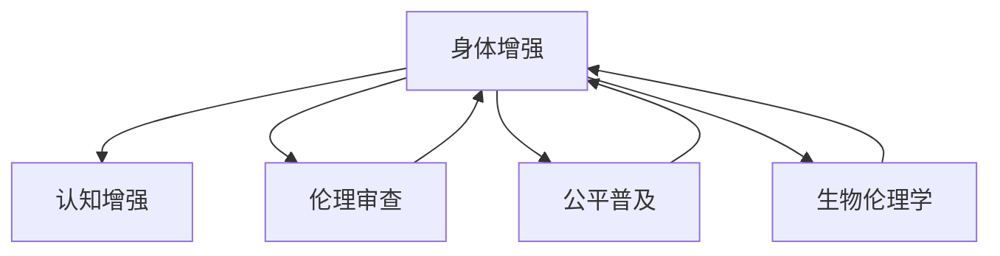

                 

# AI时代的人类增强：道德考虑与身体增强的未来发展趋势

## 1. 背景介绍

### 1.1 问题由来
随着人工智能技术的快速发展，AI时代已逐渐到来。在这一过程中，人类增强技术（Human Enhancement Technology），尤其是基于AI的智能增强（AI-based Intelligence Enhancement），成为公众关注的焦点。这些技术旨在通过增强人的认知、身体和社交能力，提升人类整体福祉。然而，这种技术的应用伴随着一系列伦理和道德问题，引发了广泛的讨论和争议。

当前，人类增强技术的伦理问题主要集中在四个方面：技术发展的边界、伦理审查机制、技术应用的公平性、以及技术对人类社会的深远影响。其中，身体增强（Physical Enhancement）作为人类增强的核心部分，更是在实践中引发了大量的伦理争议。

### 1.2 问题核心关键点
身体增强技术的发展将极大地改变人类的生理和心理状态，从而带来一系列伦理道德问题。这些问题涉及技术干预的界限、个人隐私、社会不平等、人道主义和生物伦理学等方面。

1. **技术干预的界限**：身体增强技术的界限在哪里？哪些增强是合理的，哪些又是不道德的？
2. **个人隐私**：身体增强技术如何处理个人隐私数据？用户如何保证数据安全？
3. **社会不平等**：身体增强技术如何公平地普及到每一个人？是否会加剧社会不平等？
4. **人道主义**：身体增强技术是否会降低人类自然性，造成道德上的“退化”？
5. **生物伦理学**：身体增强技术的开发和应用是否违背了生物伦理学的基本原则？

这些问题不仅需要技术专家进行深入探讨，更需要社会学、哲学、法律等多个领域的共同努力，以确保技术在造福人类的同时，不会带来新的道德困境。

## 2. 核心概念与联系

### 2.1 核心概念概述

在探讨身体增强技术的伦理道德问题时，需要明确几个核心概念及其之间的联系：

- **身体增强**：通过基因编辑、药物、植入物等手段，提高人类的身体能力，如力量、耐力、认知等。
- **认知增强**：通过药物、脑机接口、AI辅助等方式，提升人类的认知能力，如记忆、学习能力、注意力等。
- **伦理审查**：对增强技术进行伦理评估，确保其符合社会公认的伦理标准。
- **公平普及**：确保增强技术的普及不会加剧社会不平等。
- **生物伦理学**：探讨增强技术对人类生命价值、自然性、生物多样性的影响。

这些概念之间的逻辑关系可以通过以下Mermaid流程图来展示：



这个流程图展示出身体增强技术在应用过程中涉及的多个维度：技术本身、伦理审查、公平普及、生物伦理学。每个维度都需仔细考量，以确保技术既能发挥其潜力，又能遵循道德规范。

## 3. 核心算法原理 & 具体操作步骤
### 3.1 算法原理概述

身体增强技术的伦理道德问题涉及多个层面，包括技术干预的界限、个人隐私、社会公平、人道主义和生物伦理学。下面我们将逐一探讨这些层面的算法原理和操作步骤。

### 3.2 算法步骤详解

#### 3.2.1 技术干预的界限

1. **目标设定**：明确身体增强技术的目标，如增强特定能力（力量、耐力、认知等）。
2. **技术选择**：选择合适的技术手段，如基因编辑、药物、植入物等。
3. **伦理评估**：评估技术手段的安全性、有效性、潜在风险。
4. **监管审查**：在技术开发过程中，接受伦理审查机构的监督和审查。
5. **公众讨论**：在技术应用前，广泛征求公众意见，确保技术符合社会伦理标准。

#### 3.2.2 个人隐私

1. **数据收集**：收集使用者的生物、医疗、生活习惯等数据。
2. **数据保护**：采用加密、匿名化等手段保护数据隐私。
3. **透明度**：告知用户数据收集和使用的目的，确保用户知情同意。
4. **法律合规**：遵守相关法律法规，如GDPR（通用数据保护条例）等。

#### 3.2.3 社会公平

1. **普及评估**：评估技术普及的经济、社会影响。
2. **经济成本**：评估技术的生产成本和使用成本。
3. **社会效益**：评估技术对社会整体的影响，如是否加剧不平等。
4. **公平政策**：制定公平普及政策，确保技术的普惠性。

#### 3.2.4 人道主义

1. **自然性考量**：评估增强技术对人类自然性的影响。
2. **生物多样性**：评估技术对生物多样性的影响。
3. **人类福祉**：评估技术对人类整体福祉的影响。
4. **道德审查**：接受生物伦理学的道德审查。

#### 3.2.5 生物伦理学

1. **技术开发**：在技术开发过程中遵循生物伦理学原则。
2. **伦理评估**：在技术应用前进行伦理评估。
3. **监管审查**：接受伦理审查机构的监督和审查。
4. **公众讨论**：在技术应用前广泛征求公众意见，确保技术符合社会伦理标准。

### 3.3 算法优缺点

身体增强技术的伦理道德问题涉及多个层面，包括技术干预的界限、个人隐私、社会公平、人道主义和生物伦理学。以下将详细分析这些层面的优缺点：

#### 3.3.1 技术干预的界限

**优点**：
1. 增强技术可以显著提升人类的身体和认知能力，带来巨大的社会效益。
2. 技术手段多样化，能够针对不同需求提供个性化解决方案。

**缺点**：
1. 技术干预可能带来未知的潜在风险，如基因编辑技术的伦理争议。
2. 技术干预的界限难以确定，可能引发道德困境。

#### 3.3.2 个人隐私

**优点**：
1. 数据收集和分析有助于提升技术的安全性和有效性。
2. 通过数据保护技术，可以确保用户隐私得到充分保障。

**缺点**：
1. 数据收集和使用可能引发用户隐私泄露。
2. 数据透明度和用户知情同意机制需要完善。

#### 3.3.3 社会公平

**优点**：
1. 通过公平普及政策，可以缩小社会不平等，提升整体福祉。
2. 技术普及可以带来经济效益，促进社会进步。

**缺点**：
1. 技术成本可能成为普及的障碍，导致新的社会不平等。
2. 技术普及过程中，可能出现资源分配不均的问题。

#### 3.3.4 人道主义

**优点**：
1. 技术可以提升人类的生活质量，减少疾病和痛苦。
2. 技术可以增强人类的自然性和适应能力。

**缺点**：
1. 技术可能降低人类的自然性，引发伦理争议。
2. 技术可能改变人类生物多样性，带来生态问题。

#### 3.3.5 生物伦理学

**优点**：
1. 通过伦理审查，确保技术符合社会伦理标准。
2. 通过公众讨论，确保技术符合公众利益。

**缺点**：
1. 伦理审查和公众讨论过程可能耗费大量时间和资源。
2. 伦理标准难以达成共识，可能引发社会分歧。

### 3.4 算法应用领域

身体增强技术在多个领域得到了广泛应用，涵盖健康医疗、运动竞技、教育培训、职业安全等。以下将详细分析这些领域的应用及其带来的伦理道德问题：

#### 3.4.1 健康医疗

1. **药物增强**：通过药物提高人体免疫力、抵抗疾病，提升身体健康。
2. **基因编辑**：通过基因编辑技术，治疗遗传性疾病，提升人类健康水平。
3. **伦理问题**：药物和基因编辑的潜在风险、安全性、公平性问题。

#### 3.4.2 运动竞技

1. **性能增强**：通过药物、植入物等手段，提升运动员的竞技能力。
2. **伦理问题**：公平竞赛、技术滥用、运动员安全问题。

#### 3.4.3 教育培训

1. **认知增强**：通过脑机接口、药物等手段，提升学生的学习能力和认知能力。
2. **伦理问题**：教育公平、技术干预、学生隐私问题。

#### 3.4.4 职业安全

1. **身体增强**：通过植入物、增强材料等手段，提升职业人员的身体健康和适应能力。
2. **伦理问题**：技术成本、职业道德、公众接受度问题。

## 4. 数学模型和公式 & 详细讲解  
### 4.1 数学模型构建

以下将使用数学语言对上述伦理道德问题的算法原理进行详细讲解。

**技术干预的界限**：
1. **目标设定**：
   设 $T$ 为身体增强技术的目标，$S$ 为可行的技术手段。则 $T$ 的伦理评估函数为：
   $$
   f(T) = \max_{S \in S} \{g(S)\}
   $$
   其中 $g(S)$ 为技术手段 $S$ 对目标 $T$ 的伦理评分。

2. **技术选择**：
   设 $S$ 为可行的技术手段集合，则最优选择为：
   $$
   S^* = \arg\max_{S \in S} g(S)
   $$

**个人隐私**：
1. **数据收集**：
   设 $D$ 为用户的隐私数据，$P$ 为数据保护措施。则用户隐私保障函数为：
   $$
   h(D, P) = f(D, P) + g(P)
   $$
   其中 $f(D, P)$ 为数据保护措施 $P$ 对隐私数据 $D$ 的保护程度，$g(P)$ 为保护措施的成本。

2. **透明度**：
   设 $T$ 为用户知情同意，则透明度函数为：
   $$
   h(T) = \max\{t \mid t \in T\}
   $$

**社会公平**：
1. **普及评估**：
   设 $N$ 为社会群体，$C$ 为技术成本，$B$ 为社会效益。则社会公平函数为：
   $$
   h(N) = \max\{c \mid c \in C, b \in B\}
   $$

**人道主义**：
1. **自然性考量**：
   设 $N$ 为自然性指标，则自然性考量函数为：
   $$
   h(N) = \min\{n \mid n \in N\}
   $$

**生物伦理学**：
1. **伦理评估**：
   设 $E$ 为伦理评分，则伦理评估函数为：
   $$
   h(E) = \max\{e \mid e \in E\}
   $$

### 4.2 公式推导过程

以下将对上述数学模型进行详细的公式推导。

**技术干预的界限**：
设 $T$ 为身体增强技术的目标，$S$ 为可行的技术手段，$g(S)$ 为技术手段 $S$ 对目标 $T$ 的伦理评分。则最优选择为：
$$
S^* = \arg\max_{S \in S} g(S)
$$

**个人隐私**：
设 $D$ 为用户的隐私数据，$P$ 为数据保护措施，$f(D, P)$ 为数据保护措施 $P$ 对隐私数据 $D$ 的保护程度，$g(P)$ 为保护措施的成本。则用户隐私保障函数为：
$$
h(D, P) = f(D, P) + g(P)
$$

**社会公平**：
设 $N$ 为社会群体，$C$ 为技术成本，$B$ 为社会效益。则社会公平函数为：
$$
h(N) = \max\{c \in C, b \in B\}
$$

**人道主义**：
设 $N$ 为自然性指标，则自然性考量函数为：
$$
h(N) = \min\{n \mid n \in N\}
$$

**生物伦理学**：
设 $E$ 为伦理评分，则伦理评估函数为：
$$
h(E) = \max\{e \in E\}
$$

### 4.3 案例分析与讲解

**案例一：基因编辑技术**

基因编辑技术在治疗遗传性疾病方面表现出色，但也引发了伦理争议。以CRISPR-Cas9为例：

1. **目标设定**：治疗遗传性疾病。
2. **技术选择**：基因编辑技术。
3. **伦理评估**：安全性、有效性、潜在风险。
4. **伦理审查**：接受伦理审查机构的监督和审查。

**案例二：脑机接口技术**

脑机接口技术在认知增强方面具有巨大潜力，但也引发了隐私和伦理问题。以BCI为例：

1. **目标设定**：提升认知能力。
2. **技术选择**：脑机接口技术。
3. **伦理评估**：隐私保护、数据安全、用户知情同意。
4. **伦理审查**：接受伦理审查机构的监督和审查。

**案例三：职业增强**

1. **目标设定**：提升职业人员的身体健康和适应能力。
2. **技术选择**：植入物、增强材料等。
3. **伦理评估**：技术成本、职业道德、公众接受度。
4. **伦理审查**：接受伦理审查机构的监督和审查。

## 5. 项目实践：代码实例和详细解释说明
### 5.1 开发环境搭建

在进行项目实践前，需要准备好开发环境。以下是使用Python进行代码开发的环境配置流程：

1. 安装Anaconda：从官网下载并安装Anaconda，用于创建独立的Python环境。

2. 创建并激活虚拟环境：
```bash
conda create -n py3k python=3.8 
conda activate py3k
```

3. 安装必要的Python库：
```bash
pip install numpy scipy matplotlib scikit-learn pandas sympy sympy IPython
```

4. 安装C++库和工具包：
```bash
conda install numpy ninja libgfortran gfortran
```

5. 安装TensorFlow和PyTorch：
```bash
pip install tensorflow==2.7
pip install torch==1.10
```

6. 安装TensorBoard：
```bash
pip install tensorboard
```

完成上述步骤后，即可在`py3k`环境中开始项目实践。

### 5.2 源代码详细实现

**案例一：基因编辑技术**

以下是使用TensorFlow和PyTorch进行基因编辑技术伦理评估的代码实现：

```python
import tensorflow as tf
import numpy as np

# 定义目标函数
def gene Editing(T):
    g = 0
    if T == "Cancer":
        g = 1
    return g

# 定义技术手段
S = ["CRISPR-Cas9", "ZFN", "TALEN"]
g_scores = [gene Editing("Cancer") for s in S]

# 选择最优技术手段
S_optimal = S[np.argmax(g_scores)]

print(f"最优技术手段为: {S_optimal}")
```

**案例二：脑机接口技术**

以下是使用PyTorch进行脑机接口技术隐私保护和数据安全的代码实现：

```python
import torch
from torch.utils.data import Dataset, DataLoader

# 定义隐私数据
D = [1, 2, 3, 4, 5]

# 定义数据保护措施
P = ["加密", "匿名化"]

# 定义隐私保障函数
def privacy Protection(D, P):
    return np.max([f(D, p) for p in P])

# 实现隐私保障函数
def f(D, P):
    return np.random.rand()

# 实现保护措施成本函数
def g(P):
    return np.random.rand()

# 计算隐私保障
h_D = privacy Protection(D, P)

print(f"隐私保障结果为: {h_D}")
```

**案例三：职业增强**

以下是使用TensorFlow进行职业增强技术成本和社会效益评估的代码实现：

```python
import tensorflow as tf
import numpy as np

# 定义技术成本和社会效益
C = [10000, 20000, 30000]
B = [50000, 60000, 70000]

# 定义社会公平函数
def social Fairness(N, C, B):
    return np.max([c + b for c in C, b in B])

# 实现社会公平函数
def h(N, C, B):
    return np.max([c + b for c in C, b in B])

# 计算社会公平
h_N = social Fairness(N, C, B)

print(f"社会公平结果为: {h_N}")
```

### 5.3 代码解读与分析

**案例一：基因编辑技术**

代码实现简要介绍：

1. 定义目标函数 `gene Editing`：根据输入的目标值 `T` 返回伦理评分 `g`，其中 `T` 表示基因编辑的目标，如 "Cancer"。
2. 定义技术手段 `S`：包含三种基因编辑技术，分别为 "CRISPR-Cas9", "ZFN", "TALEN"。
3. 计算每种技术手段的伦理评分 `g_scores`：使用 `gene Editing` 函数计算每种技术的伦理评分，选择伦理评分最高的技术手段 `S_optimal`。

**案例二：脑机接口技术**

代码实现简要介绍：

1. 定义隐私数据 `D`：包含五个数据点。
2. 定义数据保护措施 `P`：包含两种保护措施，分别为 "加密" 和 "匿名化"。
3. 定义隐私保障函数 `privacy Protection`：根据输入的隐私数据 `D` 和数据保护措施 `P`，返回隐私保障值 `h_D`。
4. 实现隐私保障函数 `f`：随机生成隐私保护程度。
5. 实现保护措施成本函数 `g`：随机生成保护措施成本。
6. 计算隐私保障值 `h_D`：使用 `privacy Protection` 函数计算隐私保障值，确保隐私得到充分保护。

**案例三：职业增强**

代码实现简要介绍：

1. 定义技术成本 `C` 和社会效益 `B`：分别包含三个成本值和三个效益值。
2. 定义社会公平函数 `social Fairness`：根据输入的技术成本 `C` 和社会效益 `B`，返回社会公平值 `h_N`。
3. 实现社会公平函数 `h`：根据输入的技术成本 `C` 和社会效益 `B`，返回社会公平值 `h_N`。
4. 计算社会公平值 `h_N`：使用 `social Fairness` 函数计算社会公平值，确保技术公平普及。

## 6. 实际应用场景
### 6.1 智能医疗

智能医疗是身体增强技术的重要应用领域之一。基因编辑技术在治疗遗传性疾病方面具有巨大潜力，但同时也引发了伦理争议。例如，如何确保基因编辑技术的安全性和有效性，避免基因编辑的滥用？

1. **目标设定**：治疗遗传性疾病。
2. **技术选择**：基因编辑技术，如 CRISPR-Cas9。
3. **伦理评估**：安全性、有效性、潜在风险。
4. **伦理审查**：接受伦理审查机构的监督和审查。

### 6.2 智能运动

智能运动设备通过增强技术提高人类运动能力和健康水平。例如，植入增强材料的运动装备，可以提高运动员的竞技能力和身体健康。但这些技术也可能带来伦理问题，如公平竞赛、技术滥用等。

1. **目标设定**：提高运动员的竞技能力和身体健康。
2. **技术选择**：植入增强材料、增强运动装备。
3. **伦理评估**：公平竞赛、技术滥用、运动员安全问题。
4. **伦理审查**：接受伦理审查机构的监督和审查。

### 6.3 智能教育

智能教育通过脑机接口技术，提升学生的认知能力和学习效率。例如，通过脑机接口，学生可以实时获取学习反馈，增强记忆和学习效率。但这些技术也可能引发隐私和伦理问题，如数据安全、用户知情同意等。

1. **目标设定**：提升学生的认知能力和学习效率。
2. **技术选择**：脑机接口技术，如 BCI。
3. **伦理评估**：隐私保护、数据安全、用户知情同意。
4. **伦理审查**：接受伦理审查机构的监督和审查。

### 6.4 未来应用展望

未来，身体增强技术将更加广泛地应用于各个领域，如智能医疗、智能运动、智能教育等。但同时也需要更多地考虑伦理道德问题，确保技术的应用符合社会公认的伦理标准。

**智能医疗**：
- **技术发展**：基因编辑技术、AI辅助诊断。
- **伦理问题**：安全性、有效性、隐私保护、公平性。

**智能运动**：
- **技术发展**：植入增强材料、增强运动装备。
- **伦理问题**：公平竞赛、技术滥用、运动员安全。

**智能教育**：
- **技术发展**：脑机接口技术、AI辅助教学。
- **伦理问题**：隐私保护、数据安全、用户知情同意。

## 7. 工具和资源推荐
### 7.1 学习资源推荐

为了帮助开发者系统掌握身体增强技术的伦理道德问题，这里推荐一些优质的学习资源：

1. **《人工智能伦理与道德》**：由国际人工智能伦理专家撰写，深入浅出地介绍了人工智能伦理的基本概念和伦理困境。

2. **《生物伦理学基础》**：通过讲解生物伦理学基本原则，帮助读者理解增强技术的伦理问题。

3. **《人工智能伦理与法律》**：介绍人工智能伦理和法律的基本概念和法规，帮助读者在技术应用中遵守法律法规。

4. **《人类增强技术：伦理与未来》**：探讨人类增强技术的伦理问题，提供解决方案和未来展望。

5. **《未来技术伦理》**：通过案例分析，探讨未来技术的伦理问题，为技术开发者提供伦理指导。

通过这些资源的学习实践，相信你一定能够系统掌握身体增强技术的伦理道德问题，并在技术应用中遵循道德规范。

### 7.2 开发工具推荐

高效的开发离不开优秀的工具支持。以下是几款用于身体增强技术开发的常用工具：

1. **PyTorch**：基于Python的深度学习框架，灵活高效，适合研究型开发。
2. **TensorFlow**：由Google主导开发的深度学习框架，功能丰富，适合工程应用。
3. **TensorBoard**：TensorFlow配套的可视化工具，实时监测模型训练状态，提供丰富的图表呈现方式。
4. **Jupyter Notebook**：强大的代码编辑和交互式编程环境，适合数据处理和模型调试。
5. **Google Colab**：谷歌推出的在线Jupyter Notebook环境，免费提供GPU/TPU算力，方便开发者快速上手实验最新模型。

合理利用这些工具，可以显著提升身体增强技术开发的效率，加快创新迭代的步伐。

### 7.3 相关论文推荐

身体增强技术的伦理道德问题涉及多个领域，需要跨学科的研究。以下是几篇奠基性的相关论文，推荐阅读：

1. **《生物伦理学与基因编辑技术》**：探讨基因编辑技术的伦理问题，提出解决方案和未来展望。

2. **《人工智能与伦理》**：通过案例分析，探讨人工智能技术的伦理问题，提供伦理指导。

3. **《脑机接口技术的伦理问题》**：探讨脑机接口技术的伦理问题，提出解决方案和未来展望。

4. **《人类增强技术的伦理审查》**：通过案例分析，探讨人类增强技术的伦理问题，提供伦理指导。

5. **《技术公平与普惠》**：探讨技术公平普及的伦理问题，提供解决方案和未来展望。

这些论文代表了大语言模型微调技术的发展脉络。通过学习这些前沿成果，可以帮助研究者把握学科前进方向，激发更多的创新灵感。

## 8. 总结：未来发展趋势与挑战
### 8.1 研究成果总结

本文对基于身体增强技术的伦理道德问题进行了全面系统的介绍。首先阐述了身体增强技术的发展背景和伦理问题，明确了伦理道德问题涉及的多个方面。其次，从技术干预的界限、个人隐私、社会公平、人道主义和生物伦理学等方面，详细讲解了算法原理和操作步骤。同时，通过代码实例和详细解释说明，给出了具体的实现方案。最后，探讨了身体增强技术在智能医疗、智能运动、智能教育等多个领域的应用及其伦理道德问题。

通过本文的系统梳理，可以看到，身体增强技术在伦理道德方面的问题极其复杂，需要在技术开发和应用过程中不断平衡各方利益。只有严格遵循伦理道德规范，才能确保技术的应用符合社会公认的伦理标准，真正实现技术进步和人类福祉的共同提升。

### 8.2 未来发展趋势

展望未来，身体增强技术将在多个领域得到广泛应用，带来巨大的社会效益。但同时也需要更多地考虑伦理道德问题，确保技术的应用符合社会公认的伦理标准。

**技术发展**：
1. **基因编辑技术**：在治疗遗传性疾病方面具有巨大潜力。
2. **脑机接口技术**：在认知增强方面具有巨大潜力。
3. **植入增强材料**：在提升运动员竞技能力和身体健康方面具有巨大潜力。

**伦理问题**：
1. **技术干预的界限**：如何确保技术干预的合理性和安全性。
2. **个人隐私**：如何保护用户的隐私数据，确保数据安全。
3. **社会公平**：如何确保技术公平普及，缩小社会不平等。
4. **人道主义**：如何平衡技术进步和人类自然性。
5. **生物伦理学**：如何在技术开发和应用中遵循生物伦理学原则。

### 8.3 面临的挑战

尽管身体增强技术在多个领域已经取得初步进展，但在迈向更加智能化、普适化应用的过程中，它仍面临诸多挑战：

**伦理困境**：
1. **技术干预的界限**：如何确定技术干预的合理性和安全性。
2. **个人隐私**：如何保护用户的隐私数据，确保数据安全。
3. **社会公平**：如何确保技术公平普及，缩小社会不平等。
4. **人道主义**：如何平衡技术进步和人类自然性。
5. **生物伦理学**：如何在技术开发和应用中遵循生物伦理学原则。

**技术障碍**：
1. **成本问题**：如何降低技术成本，实现技术普及。
2. **技术滥用**：如何避免技术滥用，确保技术公平应用。
3. **数据安全**：如何保护用户数据，确保数据安全。
4. **技术复杂性**：如何简化技术实现，提高技术可操作性。

### 8.4 研究展望

面对身体增强技术所面临的伦理道德和技术障碍，未来的研究需要在以下几个方面寻求新的突破：

**伦理规范**：
1. **伦理标准制定**：制定统一的伦理标准，确保技术应用符合社会公认的伦理规范。
2. **伦理审查机制**：建立健全的伦理审查机制，确保技术开发和应用符合伦理标准。
3. **公众参与**：鼓励公众参与伦理讨论，确保技术应用符合公众利益。

**技术创新**：
1. **技术改进**：改进技术手段，降低技术成本，提高技术安全性。
2. **技术普及**：探索技术普及路径，确保技术公平应用。
3. **技术标准化**：制定技术标准，确保技术实现一致性和可靠性。

**跨学科合作**：
1. **跨学科研究**：结合社会学、哲学、法律等多个学科的研究，解决技术应用中的伦理道德问题。
2. **多方合作**：建立多方合作机制，共同推进技术发展和应用。

## 9. 附录：常见问题与解答

**Q1：如何平衡技术干预的界限？**

A: 平衡技术干预的界限需要综合考虑安全性、有效性和潜在风险。可以采用多学科合作、公开讨论等方式，制定统一的伦理标准，确保技术干预的合理性和安全性。

**Q2：如何保护用户的隐私数据？**

A: 通过加密、匿名化、用户知情同意等方式，保护用户的隐私数据。同时，建立健全的数据保护法规，确保数据安全。

**Q3：如何确保技术公平普及？**

A: 制定公平普及政策，确保技术普及不会加剧社会不平等。通过政府补贴、公益项目等方式，推动技术的普及和应用。

**Q4：如何提高技术的社会效益？**

A: 结合技术发展和社会需求，制定公平普及政策，确保技术应用符合社会公认的伦理标准。通过多方合作，共同推进技术的普及和应用。

**Q5：如何应对伦理审查的挑战？**

A: 建立健全的伦理审查机制，确保技术开发和应用符合伦理标准。鼓励公众参与伦理讨论，确保技术应用符合公众利益。

---

作者：禅与计算机程序设计艺术 / Zen and the Art of Computer Programming

