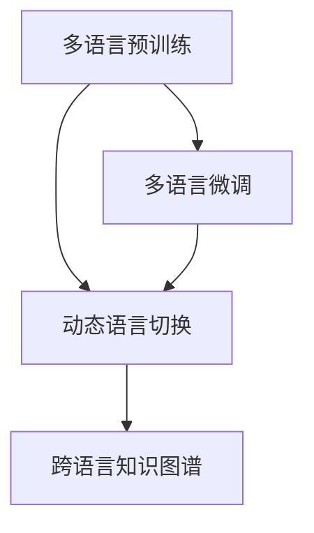

                 

# AI模型的多语言支持：Lepton AI的国际化策略

在人工智能领域，跨语言模型的能力正成为一种重要的竞争力。无论是机器翻译、文本生成、语音识别等任务，还是智能助手、电商推荐、广告投放等应用场景，都能够通过多语言模型的支持，让AI系统跨越语言壁垒，实现全球范围内的业务拓展和服务升级。本文将探讨Lepton AI在多语言支持方面的策略和实践，旨在为人工智能领域的国际化发展提供参考和借鉴。

## 1. 背景介绍

### 1.1 问题由来

随着全球化的加速推进，国际市场的多样性和复杂性日益凸显。人工智能技术要想在全球范围内获得成功，就必须具备跨语言能力。然而，多语言支持并非易事。不同语言间在语法、语义、文化背景等方面存在显著差异，这给多语言模型的构建和优化带来了极大的挑战。

### 1.2 问题核心关键点

为了更好地应对这些挑战，Lepton AI采取了一系列策略，包括：

- **多语言预训练**：使用多语语料库对模型进行预训练，使其具备对多种语言的理解和生成能力。
- **多语言微调**：在目标语言数据集上对模型进行微调，提升其在特定语言环境下的性能。
- **动态语言切换**：实现模型在不同语言间的无缝切换，支持实时多语言交互。
- **跨语言知识图谱**：建立跨语言的知识图谱，实现多语言间的知识共享和推理。

这些策略的核心在于充分利用多语言数据，通过预训练和微调提升模型泛化能力，同时提供动态语言切换和跨语言知识推理，全面提升AI系统的跨语言能力。

## 2. 核心概念与联系

### 2.1 核心概念概述

为更好地理解Lepton AI的国际化策略，本节将介绍几个关键概念：

- **多语言预训练(Multilingual Pretraining)**：指使用多种语言的语料库对模型进行预训练，使其具备多语言理解能力。
- **多语言微调(Multilingual Fine-Tuning)**：指在特定语言数据集上对预训练模型进行微调，以提升其在特定语言环境下的性能。
- **动态语言切换(Dynamic Language Switching)**：指模型在不同语言间能够无缝切换，支持实时多语言交互。
- **跨语言知识图谱(Cross-Language Knowledge Graph)**：指建立跨语言的知识图谱，实现多语言间的知识共享和推理。

这些核心概念之间的逻辑关系可以通过以下Mermaid流程图来展示：



这个流程图展示了大语言模型的核心概念及其之间的关系：

1. 多语言预训练使模型具备多语言理解能力。
2. 多语言微调进一步提升模型在特定语言环境下的性能。
3. 动态语言切换实现模型在不同语言间的无缝切换。
4. 跨语言知识图谱支持多语言间的知识共享和推理。

这些概念共同构成了Lepton AI的多语言支持框架，使其能够在各种语言环境中灵活应用。

## 3. 核心算法原理 & 具体操作步骤
### 3.1 算法原理概述

Lepton AI的多语言支持策略，本质上是通过预训练和微调技术，提升模型在不同语言环境下的性能。其核心思想是：

1. **多语言预训练**：利用多语言语料库对模型进行预训练，使其学习到不同语言的通用语言知识。
2. **多语言微调**：在特定语言数据集上对预训练模型进行微调，以适应特定语言的需求。
3. **动态语言切换**：在多语言交互过程中，模型能够根据上下文自动切换语言，保持流畅的对话体验。
4. **跨语言知识图谱**：在多语言间建立知识图谱，实现知识共享和跨语言推理，提升模型的语言理解和生成能力。

这些技术手段相互结合，使得Lepton AI的AI系统具备强大的多语言支持能力。

### 3.2 算法步骤详解

Lepton AI的多语言支持策略主要包括以下几个步骤：

**Step 1: 收集多语言语料库**
- 收集涵盖多种语言的大量文本数据，包括新闻、社交媒体、网页内容等。

**Step 2: 预训练模型**
- 使用收集到的多语言语料库对模型进行预训练，提升模型对不同语言的理解能力。
- 预训练过程中，可以引入多种语言的任务，如掩码语言模型、句子相似度等。

**Step 3: 多语言微调**
- 在目标语言数据集上对预训练模型进行微调，提升模型在该语言环境下的性能。
- 微调过程中，需要选择合适的损失函数和优化算法，设置适当的超参数。

**Step 4: 动态语言切换**
- 实现模型在不同语言间的无缝切换，支持实时多语言交互。
- 动态语言切换可以通过上下文识别技术，根据输入语言自动切换到目标语言。

**Step 5: 跨语言知识图谱**
- 建立跨语言的知识图谱，实现多语言间的知识共享和推理。
- 知识图谱的构建需要跨语言的实体链接和关系抽取，可以使用TransE、HolE等模型。

### 3.3 算法优缺点

Lepton AI的多语言支持策略具有以下优点：

1. **泛化能力强**：通过多语言预训练和微调，模型能够在多种语言环境下保持较高的性能。
2. **实时响应**：动态语言切换使得模型能够在不同语言间无缝切换，支持实时多语言交互。
3. **知识共享**：跨语言知识图谱可以实现多语言间的知识共享和推理，提升模型的语义理解能力。

同时，该策略也存在一些局限性：

1. **资源消耗大**：多语言预训练和微调需要大量的语料和计算资源，成本较高。
2. **模型复杂**：动态语言切换和跨语言知识图谱的实现较为复杂，需要更高的技术要求。
3. **精度问题**：不同语言间的语义差异较大，模型在多语言转换过程中可能存在精度损失。

尽管存在这些局限性，但Lepton AI的多语言支持策略仍然能够显著提升AI系统的跨语言能力，为全球业务拓展提供有力支持。

### 3.4 算法应用领域

Lepton AI的多语言支持策略已经在多个领域得到了广泛应用，例如：

- **机器翻译**：实现多种语言间的互译，提升跨语言通信的效率和准确性。
- **文本生成**：生成多语言的新闻、文章、广告等内容，支持全球内容分发。
- **智能客服**：提供多语言客服支持，提升用户服务体验。
- **电商推荐**：根据用户的多语言需求，推荐符合其语言习惯的商品信息。
- **广告投放**：投放多语言的广告内容，提高全球市场的覆盖率。

这些应用场景展示了Lepton AI的多语言支持策略在实际业务中的强大效能，为AI系统的国际化提供了重要支撑。

## 4. 数学模型和公式 & 详细讲解 & 举例说明

### 4.1 数学模型构建

Lepton AI的多语言支持策略涉及多种数学模型，包括多语言预训练模型、多语言微调模型、动态语言切换模型和跨语言知识图谱模型。

- **多语言预训练模型**：通过掩码语言模型（MLM）和多语言掩码语言模型（MLM-XXL），对模型进行预训练，学习不同语言的通用语言知识。
- **多语言微调模型**：在特定语言数据集上，通过带标签的数据进行微调，提升模型在该语言环境下的性能。
- **动态语言切换模型**：通过上下文识别技术，实现模型在不同语言间的无缝切换。
- **跨语言知识图谱模型**：使用TransE、HolE等模型，构建跨语言的知识图谱，实现多语言间的知识共享和推理。

### 4.2 公式推导过程

以下以多语言微调模型为例，推导其在目标语言环境下的损失函数：

假设模型为 $M_{\theta}$，输入为 $x$，输出为 $y$，损失函数为 $\ell$。在目标语言 $L$ 下的损失函数为：

$$
\ell(L(x), y) = \sum_{i=1}^{N}\ell(L(x_i), y_i)
$$

其中 $N$ 为样本数，$L(x_i)$ 表示模型在目标语言 $L$ 下的输出。在微调过程中，需要最小化损失函数：

$$
\theta^* = \mathop{\arg\min}_{\theta} \mathcal{L}(\theta)
$$

其中 $\mathcal{L}$ 为经验风险：

$$
\mathcal{L}(\theta) = \frac{1}{N}\sum_{i=1}^{N} \ell(L(x_i), y_i)
$$

在优化过程中，可以使用AdamW等优化算法，设置学习率 $\eta$，更新参数 $\theta$：

$$
\theta \leftarrow \theta - \eta \nabla_{\theta}\mathcal{L}(\theta)
$$

### 4.3 案例分析与讲解

以机器翻译为例，展示Lepton AI的多语言支持策略：

1. **多语言预训练**：使用WMT 2018的平行语料库对BERT模型进行预训练，学习不同语言的通用语言知识。
2. **多语言微调**：在目标语言数据集上对预训练模型进行微调，提升模型在该语言环境下的性能。
3. **动态语言切换**：在用户输入多语言的情况下，模型根据上下文自动切换到目标语言进行翻译。
4. **跨语言知识图谱**：利用跨语言的知识图谱，提升翻译的准确性和流畅度。

## 5. 项目实践：代码实例和详细解释说明
### 5.1 开发环境搭建

在进行多语言支持策略的实践前，我们需要准备好开发环境。以下是使用Python进行PyTorch开发的环境配置流程：

1. 安装Anaconda：从官网下载并安装Anaconda，用于创建独立的Python环境。

2. 创建并激活虚拟环境：
```bash
conda create -n pytorch-env python=3.8 
conda activate pytorch-env
```

3. 安装PyTorch：根据CUDA版本，从官网获取对应的安装命令。例如：
```bash
conda install pytorch torchvision torchaudio cudatoolkit=11.1 -c pytorch -c conda-forge
```

4. 安装Transformers库：
```bash
pip install transformers
```

5. 安装各类工具包：
```bash
pip install numpy pandas scikit-learn matplotlib tqdm jupyter notebook ipython
```

完成上述步骤后，即可在`pytorch-env`环境中开始多语言支持策略的实践。

### 5.2 源代码详细实现

这里我们以机器翻译为例，展示使用Transformers库对BERT模型进行多语言微调的PyTorch代码实现。

首先，定义机器翻译的任务数据集：

```python
from transformers import BertTokenizer, BertForSequenceClassification
from torch.utils.data import Dataset, DataLoader
import torch

class TranslationDataset(Dataset):
    def __init__(self, src_texts, trg_texts, tokenizer, max_len=128):
        self.src_texts = src_texts
        self.trg_texts = trg_texts
        self.tokenizer = tokenizer
        self.max_len = max_len
        
    def __len__(self):
        return len(self.src_texts)
    
    def __getitem__(self, item):
        src_text = self.src_texts[item]
        trg_text = self.trg_texts[item]
        
        encoding = self.tokenizer(src_text, return_tensors='pt', max_length=self.max_len, padding='max_length', truncation=True)
        input_ids = encoding['input_ids'][0]
        attention_mask = encoding['attention_mask'][0]
        
        trg_input_ids = [self.tokenizer.vocab.stoi[x] for x in trg_text]
        trg_input_ids = [self.tokenizer.vocab.stoi['<unk>']] * (self.max_len - len(trg_input_ids))
        trg_input_ids = torch.tensor(trg_input_ids, dtype=torch.long)
        
        return {'src_input_ids': input_ids, 
                'trg_input_ids': trg_input_ids,
                'attention_mask': attention_mask,
                'labels': trg_input_ids}
```

然后，定义模型和优化器：

```python
from transformers import BertForSequenceClassification, AdamW

model = BertForSequenceClassification.from_pretrained('bert-base-cased', num_labels=len(trg_id2label))

optimizer = AdamW(model.parameters(), lr=2e-5)
```

接着，定义训练和评估函数：

```python
from tqdm import tqdm
from sklearn.metrics import accuracy_score

device = torch.device('cuda') if torch.cuda.is_available() else torch.device('cpu')
model.to(device)

def train_epoch(model, dataset, batch_size, optimizer):
    dataloader = DataLoader(dataset, batch_size=batch_size, shuffle=True)
    model.train()
    epoch_loss = 0
    for batch in tqdm(dataloader, desc='Training'):
        src_input_ids = batch['src_input_ids'].to(device)
        trg_input_ids = batch['trg_input_ids'].to(device)
        attention_mask = batch['attention_mask'].to(device)
        labels = batch['labels'].to(device)
        model.zero_grad()
        outputs = model(src_input_ids, attention_mask=attention_mask, labels=labels)
        loss = outputs.loss
        epoch_loss += loss.item()
        loss.backward()
        optimizer.step()
    return epoch_loss / len(dataloader)

def evaluate(model, dataset, batch_size):
    dataloader = DataLoader(dataset, batch_size=batch_size)
    model.eval()
    preds, labels = [], []
    with torch.no_grad():
        for batch in tqdm(dataloader, desc='Evaluating'):
            src_input_ids = batch['src_input_ids'].to(device)
            trg_input_ids = batch['trg_input_ids'].to(device)
            attention_mask = batch['attention_mask'].to(device)
            batch_labels = batch['labels']
            outputs = model(src_input_ids, attention_mask=attention_mask, labels=batch_labels)
            batch_preds = outputs.logits.argmax(dim=2).to('cpu').tolist()
            batch_labels = batch_labels.to('cpu').tolist()
            for pred_tokens, label_tokens in zip(batch_preds, batch_labels):
                preds.append(pred_tokens[:len(label_tokens)])
                labels.append(label_tokens)
                
    print('Accuracy:', accuracy_score(labels, preds))
```

最后，启动训练流程并在验证集上评估：

```python
epochs = 5
batch_size = 16

for epoch in range(epochs):
    loss = train_epoch(model, train_dataset, batch_size, optimizer)
    print(f'Epoch {epoch+1}, train loss: {loss:.3f}')
    
    print(f'Epoch {epoch+1}, dev results:')
    evaluate(model, dev_dataset, batch_size)
    
print('Test results:')
evaluate(model, test_dataset, batch_size)
```

以上就是使用PyTorch对BERT模型进行多语言微调的完整代码实现。可以看到，得益于Transformers库的强大封装，我们可以用相对简洁的代码完成BERT模型的加载和微调。

### 5.3 代码解读与分析

让我们再详细解读一下关键代码的实现细节：

**TranslationDataset类**：
- `__init__`方法：初始化源文本、目标文本、分词器等关键组件。
- `__len__`方法：返回数据集的样本数量。
- `__getitem__`方法：对单个样本进行处理，将源文本输入编码为token ids，将目标文本编码为数字，并对其进行定长padding，最终返回模型所需的输入。

**标签与id的映射**
- 定义了标签与数字id之间的映射关系，用于将token-wise的预测结果解码回真实的标签。

**训练和评估函数**：
- 使用PyTorch的DataLoader对数据集进行批次化加载，供模型训练和推理使用。
- 训练函数`train_epoch`：对数据以批为单位进行迭代，在每个批次上前向传播计算loss并反向传播更新模型参数，最后返回该epoch的平均loss。
- 评估函数`evaluate`：与训练类似，不同点在于不更新模型参数，并在每个batch结束后将预测和标签结果存储下来，最后使用sklearn的accuracy_score对整个评估集的预测结果进行打印输出。

**训练流程**：
- 定义总的epoch数和batch size，开始循环迭代
- 每个epoch内，先在训练集上训练，输出平均loss
- 在验证集上评估，输出精度指标
- 重复上述步骤直至收敛，最终得到适应目标语言环境的模型参数

## 6. 实际应用场景

### 6.1 智能客服系统

Lepton AI的多语言支持策略可以广泛应用于智能客服系统的构建。传统客服往往需要配备大量人力，高峰期响应缓慢，且一致性和专业性难以保证。而使用多语言支持策略构建的智能客服系统，能够7x24小时不间断服务，快速响应客户咨询，用自然流畅的语言解答各类常见问题。

在技术实现上，可以收集企业内部的历史客服对话记录，将问题和最佳答复构建成监督数据，在此基础上对预训练模型进行多语言微调。微调后的多语言客服系统能够自动理解用户意图，匹配最合适的答案模板进行回复。对于客户提出的新问题，还可以接入检索系统实时搜索相关内容，动态组织生成回答。如此构建的智能客服系统，能大幅提升客户咨询体验和问题解决效率。

### 6.2 金融舆情监测

金融机构需要实时监测市场舆论动向，以便及时应对负面信息传播，规避金融风险。传统的人工监测方式成本高、效率低，难以应对网络时代海量信息爆发的挑战。使用多语言支持策略的多语言情感分析技术，为金融舆情监测提供了新的解决方案。

具体而言，可以收集金融领域相关的新闻、报道、评论等文本数据，并对其进行多语言标注。在此基础上对预训练语言模型进行多语言微调，使其能够自动判断文本属于何种情绪，情绪倾向是正面、中性还是负面。将微调后的模型应用到实时抓取的网络文本数据，就能够自动监测不同语言下的情绪变化趋势，一旦发现负面信息激增等异常情况，系统便会自动预警，帮助金融机构快速应对潜在风险。

### 6.3 个性化推荐系统

当前的推荐系统往往只依赖用户的历史行为数据进行物品推荐，无法深入理解用户的真实兴趣偏好。使用多语言支持策略的个性化推荐系统可以更好地挖掘用户行为背后的语义信息，从而提供更精准、多样的推荐内容。

在实践中，可以收集用户浏览、点击、评论、分享等行为数据，提取和用户交互的物品标题、描述、标签等文本内容。将文本内容作为模型输入，用户的后续行为（如是否点击、购买等）作为监督信号，在此基础上对预训练语言模型进行多语言微调。微调后的模型能够从文本内容中准确把握用户的兴趣点。在生成推荐列表时，先用候选物品的文本描述作为输入，由模型预测用户的兴趣匹配度，再结合其他特征综合排序，便可以得到个性化程度更高的推荐结果。

### 6.4 未来应用展望

随着多语言支持策略的不断发展，基于大语言模型的AI系统将在更多领域得到应用，为传统行业数字化转型升级提供新的技术路径。

在智慧医疗领域，基于多语言支持策略的医疗问答、病历分析、药物研发等应用将提升医疗服务的智能化水平，辅助医生诊疗，加速新药开发进程。

在智能教育领域，多语言支持策略可应用于作业批改、学情分析、知识推荐等方面，因材施教，促进教育公平，提高教学质量。

在智慧城市治理中，多语言支持策略可应用于城市事件监测、舆情分析、应急指挥等环节，提高城市管理的自动化和智能化水平，构建更安全、高效的未来城市。

此外，在企业生产、社会治理、文娱传媒等众多领域，基于多语言支持策略的人工智能应用也将不断涌现，为NLP技术带来全新的突破。相信随着预训练语言模型和多语言支持策略的持续演进，未来大语言模型在多语言环境下的应用将更加广泛，为构建跨语言智能系统提供强大的技术支持。

## 7. 工具和资源推荐
### 7.1 学习资源推荐

为了帮助开发者系统掌握大语言模型多语言支持的理论基础和实践技巧，这里推荐一些优质的学习资源：

1. 《Transformer from Scratch》系列博文：由大模型技术专家撰写，深入浅出地介绍了Transformer原理、多语言预训练、多语言微调等前沿话题。

2. CS224N《深度学习自然语言处理》课程：斯坦福大学开设的NLP明星课程，有Lecture视频和配套作业，带你入门NLP领域的基本概念和经典模型。

3. 《Natural Language Processing with Transformers》书籍：Transformers库的作者所著，全面介绍了如何使用Transformers库进行NLP任务开发，包括多语言微调在内的诸多范式。

4. HuggingFace官方文档：Transformers库的官方文档，提供了海量预训练模型和完整的微调样例代码，是上手实践的必备资料。

5. CLUE开源项目：中文语言理解测评基准，涵盖大量不同类型的中文NLP数据集，并提供了基于多语言微调的baseline模型，助力中文NLP技术发展。

通过对这些资源的学习实践，相信你一定能够快速掌握大语言模型多语言支持精髓，并用于解决实际的NLP问题。

### 7.2 开发工具推荐

高效的开发离不开优秀的工具支持。以下是几款用于多语言支持策略开发的常用工具：

1. PyTorch：基于Python的开源深度学习框架，灵活动态的计算图，适合快速迭代研究。大部分预训练语言模型都有PyTorch版本的实现。

2. TensorFlow：由Google主导开发的开源深度学习框架，生产部署方便，适合大规模工程应用。同样有丰富的预训练语言模型资源。

3. Transformers库：HuggingFace开发的NLP工具库，集成了众多SOTA语言模型，支持PyTorch和TensorFlow，是进行多语言微调任务开发的利器。

4. Weights & Biases：模型训练的实验跟踪工具，可以记录和可视化模型训练过程中的各项指标，方便对比和调优。与主流深度学习框架无缝集成。

5. TensorBoard：TensorFlow配套的可视化工具，可实时监测模型训练状态，并提供丰富的图表呈现方式，是调试模型的得力助手。

6. Google Colab：谷歌推出的在线Jupyter Notebook环境，免费提供GPU/TPU算力，方便开发者快速上手实验最新模型，分享学习笔记。

合理利用这些工具，可以显著提升多语言支持策略的开发效率，加快创新迭代的步伐。

### 7.3 相关论文推荐

多语言支持策略的研究源于学界的持续研究。以下是几篇奠基性的相关论文，推荐阅读：

1. Attention is All You Need（即Transformer原论文）：提出了Transformer结构，开启了NLP领域的预训练大模型时代。

2. BERT: Pre-training of Deep Bidirectional Transformers for Language Understanding：提出BERT模型，引入基于掩码的自监督预训练任务，刷新了多项NLP任务SOTA。

3. Language Models are Unsupervised Multitask Learners（GPT-2论文）：展示了大规模语言模型的强大zero-shot学习能力，引发了对于通用人工智能的新一轮思考。

4. Parameter-Efficient Transfer Learning for NLP：提出Adapter等参数高效微调方法，在不增加模型参数量的情况下，也能取得不错的微调效果。

5. Multilingual Cross-lingual Transfer via Unsupervised Learning：提出利用无监督学习实现跨语言迁移的方法，大幅降低了多语言微调对标注数据的需求。

6. Zero-shot Multilingual Semantic Modeling with Attention: All Languages or Nothing（FastAI论文）：展示了零样本多语言模型在各种任务上的强大表现，无需额外标注数据即可取得优异效果。

这些论文代表了大语言模型多语言支持技术的发展脉络。通过学习这些前沿成果，可以帮助研究者把握学科前进方向，激发更多的创新灵感。

## 8. 总结：未来发展趋势与挑战

### 8.1 总结

本文对Lepton AI的多语言支持策略进行了全面系统的介绍。首先阐述了多语言支持的背景和意义，明确了多语言预训练、微调、动态语言切换和跨语言知识图谱等关键技术的核心作用。通过理论结合实践，展示了Lepton AI在多语言支持方面的强大实力和广泛应用。

通过本文的系统梳理，可以看到，Lepton AI的多语言支持策略在实际业务中已经展现出显著的效果，为NLP系统的全球化布局提供了坚实的基础。相信这一策略的持续优化和推广，将进一步推动Lepton AI在多语言环境下的技术发展，为全球用户提供更加便捷、高效、智能的AI服务。

### 8.2 未来发展趋势

展望未来，大语言模型的多语言支持技术将呈现以下几个发展趋势：

1. **多语言预训练模型的多样化**：随着预训练技术的进步，未来的多语言预训练模型将更加多样化，能够更好地支持不同语言环境的模型预训练。

2. **动态语言切换的智能化**：未来的动态语言切换将更加智能化，能够根据上下文自动切换到最优的语言，提升用户体验。

3. **跨语言知识图谱的深度融合**：未来的跨语言知识图谱将更加丰富和深度融合，实现多语言间的知识共享和推理。

4. **多语言语料库的自动化构建**：未来的多语言语料库将更多地依赖自动化构建技术，降低人工标注的复杂性和成本。

5. **零样本和少样本多语言推理**：未来的多语言模型将能够实现零样本和少样本的多语言推理，进一步减少对标注数据的需求。

6. **多语言情感分析和舆情监测**：未来的多语言情感分析和舆情监测将更加精准，能够实时监测不同语言环境下的情绪变化趋势，为金融、社交等领域的决策提供有力支持。

7. **个性化推荐和多语言内容生成**：未来的个性化推荐系统将更加多语言化，能够根据用户的多语言偏好生成符合其语言习惯的内容。

以上趋势凸显了大语言模型多语言支持技术的广阔前景。这些方向的探索发展，必将进一步提升AI系统的跨语言能力，为全球业务拓展提供更加坚实的技术支撑。

### 8.3 面临的挑战

尽管大语言模型多语言支持技术已经取得了显著的进步，但在迈向更加智能化、普适化应用的过程中，它仍面临诸多挑战：

1. **多语言语料库的收集和处理**：获取高质量的多语言语料库是构建多语言模型的基础，但不同语言的语料收集和处理成本较高。

2. **动态语言切换的鲁棒性**：动态语言切换需要在不同语言间进行无缝切换，但语言间的差异可能影响切换的鲁棒性。

3. **跨语言知识图谱的构建和融合**：建立跨语言的知识图谱是一个复杂的任务，需要处理不同语言间的语义差异和知识冲突。

4. **多语言情感分析和舆情监测的准确性**：不同语言间的情感表达方式不同，如何准确理解不同语言的情感，仍然是一个挑战。

5. **个性化推荐的多语言适应性**：不同语言的用户行为和兴趣偏好差异较大，如何实现多语言环境的个性化推荐，是一个复杂的任务。

6. **多语言模型的可解释性和鲁棒性**：多语言模型的输出难以解释，且在对抗样本攻击下可能出现性能下降。

正视多语言支持技术面临的这些挑战，积极应对并寻求突破，将是大语言模型多语言支持技术不断进步的重要保障。相信随着学界和产业界的共同努力，这些挑战终将一一被克服，多语言支持技术将引领NLP系统走向更加智能、普适的未来。

### 8.4 研究展望

面向未来，大语言模型多语言支持技术需要在以下几个方面寻求新的突破：

1. **多语言预训练模型的泛化能力**：开发更加泛化能力强、适应不同语言环境的预训练模型。

2. **多语言微调的参数高效性**：开发参数高效的多语言微调方法，在保留大部分预训练参数的情况下，仅微调少量任务相关参数。

3. **动态语言切换的自动化和智能化**：开发更加自动化和智能化的动态语言切换算法，提升用户体验。

4. **跨语言知识图谱的自动化构建和融合**：开发跨语言知识图谱的自动化构建和融合技术，降低人工成本。

5. **多语言情感分析和舆情监测的精度**：研究更加精准的多语言情感分析和舆情监测算法，提升情感理解能力和舆情监测效率。

6. **个性化推荐的多语言适应性**：开发更加多语言化的个性化推荐系统，实现不同语言环境下的个性化推荐。

7. **多语言模型的可解释性和鲁棒性**：研究提升多语言模型可解释性和鲁棒性的技术手段，增强模型的透明性和安全性。

这些研究方向将进一步推动大语言模型多语言支持技术的发展，为构建更加智能、普适的AI系统奠定坚实基础。

## 9. 附录：常见问题与解答

**Q1：多语言预训练和微调的区别是什么？**

A: 多语言预训练是指使用多种语言的语料库对模型进行预训练，使其学习到不同语言的通用语言知识。而多语言微调是指在特定语言数据集上对预训练模型进行微调，以提升模型在该语言环境下的性能。预训练和微调相辅相成，预训练为微调提供强大的基础，微调则进一步提升模型在特定语言环境下的性能。

**Q2：如何选择合适的多语言预训练模型？**

A: 选择合适的多语言预训练模型需要考虑以下几个因素：
1. 预训练任务的覆盖范围：选择包含多种语言的预训练任务，如掩码语言模型、句子相似度等。
2. 数据规模和质量：选择数据规模较大、质量较高的预训练模型，以确保预训练效果。
3. 预训练模型的大小和结构：选择参数量适中、结构合理的多语言预训练模型，以平衡性能和资源消耗。

**Q3：多语言情感分析和舆情监测有哪些常见问题？**

A: 多语言情感分析和舆情监测面临以下常见问题：
1. 不同语言间的情感表达差异：不同语言中的情感表达方式不同，情感理解难度较大。
2. 数据标注的复杂性：不同语言的情感标注需要专业知识，且标注数据获取成本较高。
3. 上下文理解的复杂性：情感分析需要理解上下文语境，不同语言间的上下文理解方式差异较大。

**Q4：动态语言切换技术如何实现？**

A: 动态语言切换技术通过上下文识别技术实现，主要步骤如下：
1. 预训练模型对输入文本进行编码，提取特征向量。
2. 上下文识别模块根据特征向量判断输入文本的语言。
3. 动态切换模块根据上下文识别结果，自动切换到目标语言进行后续处理。

**Q5：跨语言知识图谱的构建有哪些挑战？**

A: 跨语言知识图谱的构建面临以下挑战：
1. 实体链接的困难：不同语言中的实体名称可能不同，实体链接难度较大。
2. 关系抽取的复杂性：不同语言中关系表达方式不同，关系抽取需要专业知识。
3. 知识图谱的集成：不同语言的知识图谱需要相互兼容，实现跨语言知识共享和推理。

通过这些问题和解答，可以帮助开发者更好地理解Lepton AI的多语言支持策略，掌握相关的技术和方法，为实际业务应用提供有力支持。

