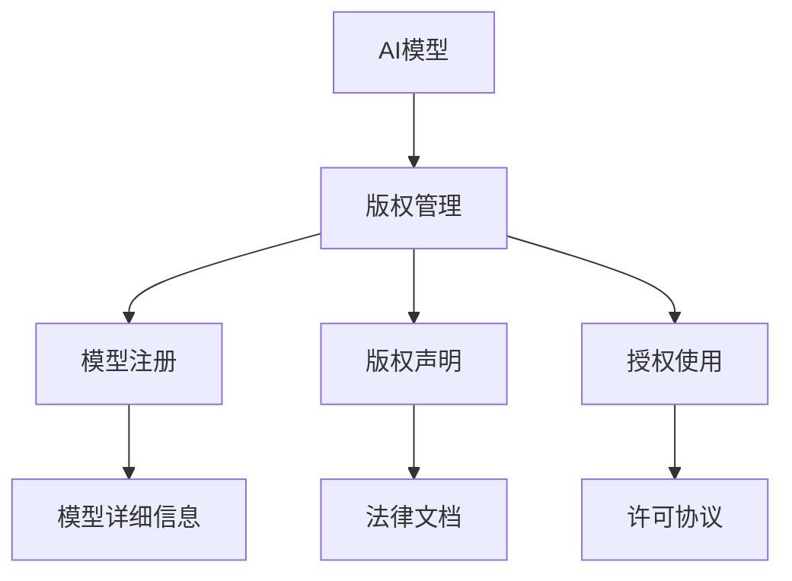

                 

# AI模型的版权管理：Lepton AI的知识产权战略

## 1. 背景介绍

随着人工智能技术的飞速发展，AI模型在各个领域的应用越来越广泛，从自然语言处理、图像识别到智能推荐，AI模型已经成为企业和科研机构不可或缺的重要工具。然而，随着AI模型应用的深入，其版权管理问题也逐渐凸显，成为制约模型共享和创新的一大障碍。本文将探讨AI模型的版权管理，尤其是Lepton AI在这一领域的知识产权战略，为企业和开发者提供有益的参考。

## 2. 核心概念与联系

### 2.1 核心概念概述

#### 2.1.1 AI模型
AI模型通常指通过深度学习等技术训练得到的用于特定任务或场景的算法模型，如图像识别、自然语言处理等领域的模型。AI模型通常包含大量的参数和复杂的网络结构，具有高度的智能和自动化能力。

#### 2.1.2 版权管理
版权管理是指保护和规范AI模型版权的法律、技术和管理措施，旨在确保模型开发者和所有者的权益，促进模型共享和创新。

#### 2.1.3 Lepton AI
Lepton AI是一家专注于AI模型版权管理的科技公司，提供包括模型注册、版权声明、授权使用等在内的全面知识产权解决方案，帮助开发者和企业更好地管理和保护他们的AI模型。

### 2.2 核心概念原理和架构的 Mermaid 流程图(Mermaid 流程节点中不要有括号、逗号等特殊字符)



## 3. 核心算法原理 & 具体操作步骤

### 3.1 算法原理概述

Lepton AI的知识产权战略基于以下几个核心原理：

- **数字指纹技术**：利用数字指纹技术对AI模型进行唯一标识，确保每个模型都可以被独立识别和管理。
- **区块链技术**：利用区块链技术记录AI模型的版权信息，确保版权信息的不可篡改性和透明性。
- **智能合约技术**：利用智能合约技术自动执行授权协议，确保模型授权的规范性和效率性。

### 3.2 算法步骤详解

1. **模型注册**：开发者或企业将AI模型上传到Lepton AI平台，并填写模型的基本信息，如名称、描述、版本等。

2. **版权声明**：开发者或企业声明模型的版权，包括版权所有者、授权使用条件等。

3. **授权使用**：开发者或企业设定模型的授权使用范围和条件，如非商业用途、特定场景等。

4. **数字指纹生成**：Lepton AI平台自动为模型生成唯一的数字指纹，用于标识和管理。

5. **区块链记录**：Lepton AI平台将模型的版权信息、数字指纹等记录到区块链上，确保信息透明、不可篡改。

6. **智能合约执行**：当其他开发者或企业希望使用该模型时，智能合约自动验证使用条件，并执行授权协议。

### 3.3 算法优缺点

**优点**：

- 提供了全面、透明、安全的AI模型版权管理解决方案。
- 通过区块链和智能合约技术，确保版权信息不可篡改，授权过程规范高效。

**缺点**：

- 需要依赖Lepton AI平台，可能存在平台依赖和成本问题。
- 对于小型企业和个人开发者，可能存在较高的使用门槛和成本。

### 3.4 算法应用领域

Lepton AI的知识产权战略适用于所有需要管理和保护AI模型版权的场景，包括但不限于：

- 企业内部的AI模型管理
- 科研机构的模型共享
- 开源社区的模型贡献
- 商业应用的模型授权

## 4. 数学模型和公式 & 详细讲解 & 举例说明

### 4.1 数学模型构建

Lepton AI的版权管理模型主要基于区块链和智能合约技术，其核心数学模型包括：

- **数字指纹生成模型**：使用哈希函数将模型参数和结构等信息转换为唯一的数字指纹。
- **版权信息记录模型**：将版权信息、数字指纹等记录在区块链上，确保信息不可篡改。
- **智能合约执行模型**：基于规则引擎，自动验证和使用条件，执行授权协议。

### 4.2 公式推导过程

以数字指纹生成为例，设AI模型的参数为 $w$，结构为 $f(w)$，则数字指纹 $F$ 可以表示为：

$$
F = \text{hash}(w, f(w))
$$

其中 $\text{hash}$ 为哈希函数，如SHA-256。

### 4.3 案例分析与讲解

假设某企业开发了一个图像识别模型，并希望将其发布到开源社区。该企业首先通过Lepton AI平台进行模型注册，并声明版权信息。Lepton AI平台自动为该模型生成数字指纹，并将版权信息记录到区块链上。其他开发者希望使用该模型时，只需通过智能合约验证授权条件，即可自动获取模型使用权。

## 5. 项目实践：代码实例和详细解释说明

### 5.1 开发环境搭建

以下是使用Python和Lepton AI SDK搭建模型版权管理环境的步骤：

1. 安装Python和Lepton AI SDK。
2. 创建Lepton AI账号并登录。
3. 上传模型到Lepton AI平台。

### 5.2 源代码详细实现

```python
from leptonai import LeptonAI, DigitalFingerprint, CopyrightDeclaration, SmartContract

# 登录LeptonAI平台
lepton = LeptonAI('YOUR_ACCOUNT_KEY', 'YOUR_API_SECRET')

# 创建AI模型并上传
model = LeptonAI.create_model('YOUR_MODEL_NAME')
model.upload_file('path/to/model')

# 生成数字指纹
fingerprint = DigitalFingerprint(model)
fingerprint.save('path/to/fingerprint.json')

# 声明版权信息
copyright = CopyrightDeclaration(model)
copyright.save('path/to/copyright.json')

# 创建智能合约
contract = SmartContract(model, copyright)
contract.save('path/to/contract.json')
```

### 5.3 代码解读与分析

该代码段主要完成了以下任务：

- 登录LeptonAI平台。
- 创建AI模型并上传。
- 生成数字指纹并保存。
- 声明版权信息并保存。
- 创建智能合约并保存。

### 5.4 运行结果展示

运行上述代码后，开发者将在本地生成模型信息、数字指纹、版权信息和智能合约等文件，这些文件记录了模型的基本信息、版权声明和授权条件，为后续的使用和管理提供了保障。

## 6. 实际应用场景

### 6.1 智能制造

在智能制造领域，企业内部使用的各种AI模型需要通过版权管理来保护商业机密和技术优势。Lepton AI的知识产权战略可以为制造企业提供模型授权和共享机制，确保模型的安全和合规使用。

### 6.2 医疗健康

医疗领域对AI模型的版权管理尤为重要，涉及患者隐私和医疗数据的安全。Lepton AI的版权管理解决方案可以确保AI模型的授权使用规范透明，符合法律法规和伦理要求。

### 6.3 教育培训

在教育培训领域，AI模型通常用于辅助教学和评估。通过版权管理，教育机构可以确保模型的安全和合规使用，避免模型的盗用和滥用。

### 6.4 未来应用展望

未来，随着AI技术的进一步普及和应用，AI模型的版权管理将变得更加重要。Lepton AI的知识产权战略将提供更全面、高效的版权管理服务，帮助企业和开发者更好地管理和保护他们的AI模型。

## 7. 工具和资源推荐

### 7.1 学习资源推荐

- 《区块链原理与实践》
- 《智能合约技术指南》
- 《数字指纹技术入门》

### 7.2 开发工具推荐

- Lepton AI SDK
- Python开发环境

### 7.3 相关论文推荐

- 《数字指纹技术在AI模型版权保护中的应用》
- 《基于区块链的AI模型版权管理机制》
- 《智能合约在AI模型授权中的应用》

## 8. 总结：未来发展趋势与挑战

### 8.1 研究成果总结

Lepton AI的知识产权战略在AI模型版权管理领域取得了显著成果，通过数字指纹、区块链和智能合约技术，为模型开发者和企业提供了全面、透明、安全的版权管理解决方案。

### 8.2 未来发展趋势

未来，AI模型版权管理将进一步融合区块链和智能合约技术，实现模型授权和使用过程的自动化和透明化。同时，随着AI技术的应用拓展，版权管理的范围和内容也将不断扩展。

### 8.3 面临的挑战

尽管Lepton AI的知识产权战略已经取得一定进展，但仍面临以下挑战：

- 平台依赖和成本问题。
- 小型企业和个人开发者的使用门槛和成本。
- 模型授权和使用条件的规范性问题。

### 8.4 研究展望

未来的研究方向包括：

- 开发更加高效、便捷的版权管理工具。
- 优化智能合约的执行机制，确保授权过程的公平透明。
- 拓展版权管理的应用范围，涵盖更多场景和领域。

## 9. 附录：常见问题与解答

**Q1：如何使用Lepton AI的模型版权管理平台？**

A: 首先创建Lepton AI账号并登录平台，上传AI模型并声明版权信息。然后生成数字指纹和智能合约，确保模型的安全和合规使用。

**Q2：AI模型的版权信息应包括哪些内容？**

A: AI模型的版权信息应包括版权所有者、授权使用条件、数据来源、开发时间、模型版本等，确保信息的全面性和透明性。

**Q3：AI模型的授权条件有哪些？**

A: AI模型的授权条件可以包括使用场景、授权期限、授权对象、授权方式等，确保模型使用的规范性和安全性。

**Q4：AI模型在使用过程中需要注意哪些问题？**

A: AI模型在使用过程中需要注意版权合法性、数据隐私保护、模型性能和鲁棒性等问题，确保使用的合规性和安全性。

**Q5：AI模型的版权管理对开发者和企业有哪些好处？**

A: AI模型的版权管理对开发者和企业有以下好处：

- 确保模型的版权安全，避免盗用和滥用。
- 规范模型的授权使用，确保合规性和透明性。
- 提高模型的共享和合作效率，促进技术创新。

---

作者：禅与计算机程序设计艺术 / Zen and the Art of Computer Programming

