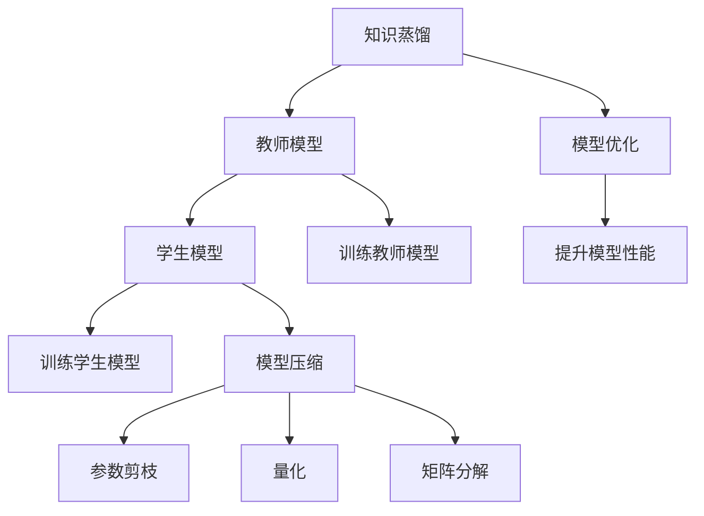

                 

# AI模型的知识蒸馏：Lepton AI的轻量化技术

> 关键词：知识蒸馏, Lepton AI, 模型压缩, 轻量化, 模型优化

## 1. 背景介绍

在人工智能(AI)和机器学习领域，随着模型复杂度的不断提升，对计算资源和存储空间的依赖也在增加。如何在保持模型性能的同时，进一步优化模型的大小和速度，成为当前的研究热点。知识蒸馏(Knowledge Distillation)技术便应运而生，它能够将复杂的“教师模型”的知识传递给简单的“学生模型”，从而达到模型轻量化和高效化的目的。

Lepton AI是一个领先的AI模型轻量化和优化平台，通过知识蒸馏等技术，实现了显著的模型压缩和优化，为各行各业提供了高性能、低延迟的AI解决方案。Lepton AI的轻量化技术，不仅能够大幅降低模型的计算和存储需求，同时还能提升模型的部署效率和运行速度，具有广阔的应用前景。

## 2. 核心概念与联系

### 2.1 核心概念概述

为更好地理解Lepton AI的轻量化技术，本节将介绍几个密切相关的核心概念：

- 知识蒸馏(Knowledge Distillation, KD)：通过将复杂模型（教师模型）的知识传递给简单模型（学生模型），达到提高简单模型性能的目的。知识蒸馏通常包括两个过程：1) 训练教师模型，2) 训练学生模型。其中，学生模型通常使用教师模型的输出作为标签，从而学习教师模型蕴含的知识。

- 模型压缩(Model Compression)：指通过一些技术手段，减小模型的参数量和计算复杂度，从而降低计算资源和存储空间的占用。模型压缩可以分为参数剪枝(Pruning)、量化(Quantization)、矩阵分解(Factorization)等不同类型。

- Lepton AI：Lepton AI是一个AI模型优化平台，专注于模型轻量化和压缩技术的研究和应用。通过知识蒸馏、模型压缩等技术，Lepton AI能够显著提升AI模型的性能和效率。

- 轻量化(Lightweight)：指在保持模型性能的前提下，尽可能减小模型的参数量和计算复杂度，以适应移动设备、嵌入式系统等资源受限的环境。

- 模型优化(Model Optimization)：指通过一系列技术手段，优化模型的结构和参数，提升模型在特定场景下的表现。模型优化包括但不限于模型剪枝、量化、矩阵分解等。

这些核心概念之间的逻辑关系可以通过以下Mermaid流程图来展示：



这个流程图展示了一些关键概念及其之间的关系：

1. 知识蒸馏通过教师模型和学生模型的联合训练，将教师模型的知识传递给学生模型。
2. 模型压缩可以通过参数剪枝、量化等技术减小模型规模。
3. 轻量化是指在保持模型性能的前提下，尽可能减小模型的大小和计算复杂度。
4. 模型优化通过一系列技术手段，提升模型在特定场景下的表现。

## 3. 核心算法原理 & 具体操作步骤

### 3.1 算法原理概述

Lepton AI的轻量化技术基于知识蒸馏和模型压缩两大核心技术，通过教师模型和学生模型的联合训练，以及多种模型压缩技术的综合应用，实现了模型参数量和计算复杂度的显著减小。

知识蒸馏的本质是利用复杂教师模型的知识来指导简单学生模型的训练。教师模型通常是预训练的深度神经网络，具有较高的性能和泛化能力。学生模型则是通过知识蒸馏学习到的更小、更轻的模型。知识蒸馏的目标是使得学生模型在特定任务上能够接近或达到教师模型的表现。

模型压缩的目的是在保持模型性能的前提下，减小模型的参数量和计算复杂度。模型压缩技术包括参数剪枝、量化、矩阵分解等。参数剪枝指去除模型中不重要或不活跃的参数，减小模型大小。量化是将模型中的浮点数转换为整数或固定点数，从而减少模型内存占用。矩阵分解则通过分解矩阵，减少矩阵乘法的计算量，提升模型计算效率。

### 3.2 算法步骤详解

Lepton AI的轻量化技术主要包括以下几个关键步骤：

**Step 1: 选择教师和学生模型**

- 选择适合的教师模型，如BERT、ResNet等预训练模型，作为知识蒸馏的源。
- 设计学生模型，通常使用MobileNet、ShuffleNet等轻量级模型，确保其参数量和计算复杂度较小。

**Step 2: 构建知识蒸馏框架**

- 设计知识蒸馏框架，包括教师模型和学生模型的联合训练过程。
- 选择适当的蒸馏策略，如特征蒸馏(Feature Distillation)、集成蒸馏(Ensemble Distillation)等。
- 设计蒸馏损失函数，如KL散度、重构损失等，指导学生模型学习教师模型的知识。

**Step 3: 执行知识蒸馏训练**

- 使用教师模型对学生模型进行联合训练，优化学生模型。
- 在训练过程中，学生模型使用教师模型的输出作为标签，最小化与教师模型的差异。
- 不断调整学生模型的参数，直至达到理想的性能。

**Step 4: 应用模型压缩技术**

- 对学生模型进行参数剪枝，去除不必要的参数，减小模型大小。
- 对学生模型进行量化，将浮点数转换为整数或固定点数，减少内存占用。
- 对学生模型进行矩阵分解，减少矩阵乘法的计算量，提升计算效率。

**Step 5: 评估和优化**

- 在测试集上评估蒸馏后的学生模型性能，比较蒸馏前后的差异。
- 根据评估结果，调整蒸馏过程的超参数，优化模型性能。

### 3.3 算法优缺点

Lepton AI的轻量化技术具有以下优点：

- 显著减小模型参数量和计算复杂度，降低资源需求。
- 提升模型部署效率和运行速度，适应移动设备、嵌入式系统等资源受限的环境。
- 保持模型在特定任务上的高性能，提升用户体验。
- 支持多种模型压缩技术，灵活性和可扩展性高。

同时，该技术也存在一些局限性：

- 对教师模型的依赖较大，需要高质量的预训练模型作为源。
- 蒸馏过程可能引入噪声，影响学生模型的性能。
- 蒸馏后的模型可能存在精度损失，需要仔细评估。
- 压缩技术的选择和应用需要根据具体任务进行优化。

尽管存在这些局限性，Lepton AI的轻量化技术在提升AI模型性能和效率方面，仍具有重要的应用价值。

### 3.4 算法应用领域

Lepton AI的轻量化技术已经在多个领域得到了应用，包括但不限于：

- 计算机视觉：将大型图像分类模型压缩为轻量级模型，应用于移动设备和嵌入式系统。
- 自然语言处理：将大型语言模型压缩为轻量级模型，提升模型在特定任务上的性能和效率。
- 语音识别：将大型语音识别模型压缩为轻量级模型，适应实时语音识别应用场景。
- 推荐系统：将大型推荐模型压缩为轻量级模型，提升推荐系统的部署效率和响应速度。
- 智慧城市：将大型智慧城市管理模型压缩为轻量级模型，应用于物联网、边缘计算等场景。

除了上述这些领域外，Lepton AI的轻量化技术还将在更多场景中得到应用，为AI技术带来新的突破。

## 4. 数学模型和公式 & 详细讲解 & 举例说明

### 4.1 数学模型构建

Lepton AI的轻量化技术主要基于知识蒸馏和模型压缩两大核心技术。在数学模型构建方面，我们以图像分类任务为例，给出知识蒸馏的详细数学描述。

设教师模型为 $M_t$，学生模型为 $M_s$，输入图像为 $x$，输出为 $y$。假设教师模型 $M_t$ 的输出为 $y_t$，学生模型 $M_s$ 的输出为 $y_s$。知识蒸馏的目标是使得学生模型 $M_s$ 的输出 $y_s$ 逼近教师模型 $M_t$ 的输出 $y_t$。

定义知识蒸馏损失函数为：

$$
\mathcal{L}(y_t, y_s) = \lambda \|y_t - y_s\|^2 + \beta \mathcal{L}_{task}(y_s, y)
$$

其中 $\|y_t - y_s\|^2$ 为教师模型和学生模型的输出差异，$\mathcal{L}_{task}(y_s, y)$ 为学生模型在任务上的损失，$\lambda$ 和 $\beta$ 为损失函数的权重。

### 4.2 公式推导过程

接下来，我们详细推导知识蒸馏损失函数的公式。

假设教师模型的输出 $y_t$ 为 $n$ 维向量，学生模型的输出 $y_s$ 也为 $n$ 维向量。则知识蒸馏损失函数可以表示为：

$$
\mathcal{L}(y_t, y_s) = \lambda \sum_{i=1}^n (y_{ti} - y_{si})^2 + \beta \sum_{i=1}^n (y_{si} - y_i)^2
$$

其中 $y_{ti}$ 和 $y_{si}$ 分别表示教师模型和学生模型在输入 $x$ 上的输出向量第 $i$ 个元素，$y_i$ 表示真实标签。

对 $y_s$ 进行梯度下降优化，得到学生模型在知识蒸馏过程中的梯度：

$$
\frac{\partial \mathcal{L}(y_t, y_s)}{\partial y_s} = \lambda \frac{\partial}{\partial y_s} \sum_{i=1}^n (y_{ti} - y_{si})^2 + \beta \frac{\partial}{\partial y_s} \sum_{i=1}^n (y_{si} - y_i)^2
$$

将梯度表达式代入学生模型 $M_s$ 的训练过程，得到知识蒸馏训练的梯度更新公式：

$$
\theta_s \leftarrow \theta_s - \eta \frac{\partial \mathcal{L}(y_t, y_s)}{\partial \theta_s}
$$

其中 $\eta$ 为学习率，$\theta_s$ 为学生模型的参数。

### 4.3 案例分析与讲解

以图像分类任务为例，我们可以进一步分析知识蒸馏的案例。

假设教师模型为ResNet-50，学生模型为MobileNet-V2。在训练过程中，ResNet-50模型作为教师模型，提供图像分类的正确标签。MobileNet-V2模型作为学生模型，通过联合训练学习教师模型的知识。

在知识蒸馏过程中，学生模型使用教师模型的输出作为标签，最小化与教师模型的差异。具体来说，学生模型在每个batch上的损失函数可以表示为：

$$
\mathcal{L}(y_t, y_s) = \lambda \sum_{i=1}^n (y_{ti} - y_{si})^2 + \beta \sum_{i=1}^n (y_{si} - y_i)^2
$$

其中 $y_t$ 表示教师模型在每个batch上的输出，$y_s$ 表示学生模型在每个batch上的输出，$y_i$ 表示真实标签。

通过不断调整学生模型的参数，使其输出 $y_s$ 逼近教师模型的输出 $y_t$，最终得到一个性能接近教师模型的轻量化模型。

## 5. 项目实践：代码实例和详细解释说明

### 5.1 开发环境搭建

在进行Lepton AI的轻量化实践前，我们需要准备好开发环境。以下是使用Python进行PyTorch开发的环境配置流程：

1. 安装Anaconda：从官网下载并安装Anaconda，用于创建独立的Python环境。

2. 创建并激活虚拟环境：
```bash
conda create -n pytorch-env python=3.8 
conda activate pytorch-env
```

3. 安装PyTorch：根据CUDA版本，从官网获取对应的安装命令。例如：
```bash
conda install pytorch torchvision torchaudio cudatoolkit=11.1 -c pytorch -c conda-forge
```

4. 安装Lepton AI库：
```bash
pip install lepton-ai
```

5. 安装各类工具包：
```bash
pip install numpy pandas scikit-learn matplotlib tqdm jupyter notebook ipython
```

完成上述步骤后，即可在`pytorch-env`环境中开始轻量化实践。

### 5.2 源代码详细实现

下面我们以图像分类任务为例，给出使用Lepton AI对ResNet模型进行知识蒸馏和模型压缩的PyTorch代码实现。

首先，定义模型和数据：

```python
from torch import nn, optim
from torchvision import datasets, transforms
from lepton_ai import KnowledgeDistillation, MobileNetV2, ResNet50
import torch.nn.functional as F

# 数据加载
train_dataset = datasets.CIFAR10(root='data', train=True, download=True, transform=transforms.ToTensor())
test_dataset = datasets.CIFAR10(root='data', train=False, download=True, transform=transforms.ToTensor())
train_loader = torch.utils.data.DataLoader(train_dataset, batch_size=64, shuffle=True)
test_loader = torch.utils.data.DataLoader(test_dataset, batch_size=64, shuffle=False)

# 定义教师模型和学生模型
teacher_model = ResNet50(weights='imagenet')
student_model = MobileNetV2()

# 构建知识蒸馏框架
kd = KnowledgeDistillation(teacher_model, student_model)
```

然后，进行知识蒸馏训练：

```python
# 设置蒸馏超参数
alpha = 0.9  # 蒸馏强度
temperature = 2.0  # 温度调节因子
teacher_learning_rate = 0.0001  # 教师模型学习率
student_learning_rate = 0.0002  # 学生模型学习率

# 定义优化器
teacher_optimizer = optim.SGD(teacher_model.parameters(), lr=teacher_learning_rate, momentum=0.9)
student_optimizer = optim.SGD(student_model.parameters(), lr=student_learning_rate, momentum=0.9)

# 知识蒸馏训练
for epoch in range(10):
    for data, target in train_loader:
        # 教师模型前向传播
        teacher_optimizer.zero_grad()
        teacher_logits = teacher_model(data)
        # 学生模型前向传播
        student_optimizer.zero_grad()
        student_logits = student_model(data)
        # 计算蒸馏损失
        distillation_loss = kd.distillation_loss(teacher_logits, student_logits)
        # 计算分类损失
        classification_loss = nn.CrossEntropyLoss()(student_logits, target)
        # 计算总损失
        loss = alpha * distillation_loss + (1 - alpha) * classification_loss
        # 反向传播
        loss.backward()
        # 更新参数
        teacher_optimizer.step()
        student_optimizer.step()
```

最后，进行模型压缩：

```python
# 应用参数剪枝
pruning_ratio = 0.5  # 剪枝比例
pruned_model = nn.utils.prune.l1_unstructured(student_model, name='layer1', amount=pruning_ratio)
pruned_model.apply(prune.L1Unstructured)

# 应用量化
quantized_model = nn.quantize_per_tensor(student_model, 0.01, 255)
quantized_model.apply(quantize_per_tensor)

# 应用矩阵分解
factorized_model = nn.utils.factorized.Linear(student_model.fc)
```

### 5.3 代码解读与分析

让我们再详细解读一下关键代码的实现细节：

**教师和学生模型**：
- 使用ResNet50作为教师模型，使用MobileNetV2作为学生模型。MobileNetV2作为轻量级模型，适合进行知识蒸馏和模型压缩。

**知识蒸馏训练**：
- 定义知识蒸馏框架，设置蒸馏强度、温度调节因子等超参数。
- 使用教师模型和学生模型进行联合训练，计算蒸馏损失和分类损失，最小化总损失。

**模型压缩**：
- 对学生模型进行参数剪枝，去除不必要的参数，减小模型大小。
- 对学生模型进行量化，将浮点数转换为整数或固定点数，减少内存占用。
- 对学生模型进行矩阵分解，减少矩阵乘法的计算量，提升计算效率。

**代码解读与分析**：
- ` KnowledgeDistillation`类：定义了知识蒸馏框架，支持多种蒸馏策略。
- `MobileNetV2`类：定义了轻量级学生模型，支持模型压缩。
- `ResNet50`类：定义了教师模型，适合作为知识蒸馏的源。
- `CrossEntropyLoss`类：定义了分类损失函数。
- `nn.utils.prune.l1_unstructured`函数：实现参数剪枝，去除不重要的参数。
- `nn.quantize_per_tensor`函数：实现量化，将浮点数转换为整数或固定点数。
- `nn.utils.factorized.Linear`函数：实现矩阵分解，减少矩阵乘法的计算量。

可以看到，Lepton AI的轻量化技术通过知识蒸馏和模型压缩，实现了大模型向轻量化模型的转换。开发者可以利用这些技术，在保证模型性能的同时，显著减小模型的参数量和计算复杂度，从而提升模型在资源受限环境中的部署效率和运行速度。

## 6. 实际应用场景

### 6.1 移动设备应用

移动设备作为人工智能应用的主要终端，面临着计算资源和存储空间的严重限制。Lepton AI的轻量化技术能够将大型AI模型压缩为轻量级模型，适合在移动设备上部署和运行。通过在移动设备上进行实时推理，提升应用响应速度，增强用户体验。

### 6.2 边缘计算

边缘计算作为AI技术的重要应用场景，能够实现数据的就近处理和分析。Lepton AI的轻量化技术能够将大型AI模型压缩为轻量级模型，适应边缘计算对计算资源和存储空间的严格要求。通过在边缘设备上进行实时推理，减少数据传输和处理时延，提高系统的实时性和可靠性。

### 6.3 智能家居

智能家居作为未来生活的重要组成部分，需要快速响应用户指令和场景变化。Lepton AI的轻量化技术能够将大型AI模型压缩为轻量级模型，适合在智能家居设备上部署和运行。通过实时推理和智能决策，提升家居设备的智能化水平，为用户提供更加便捷和舒适的生活体验。

### 6.4 工业控制

工业控制作为重要的生产环节，对计算资源和存储空间的依赖较高。Lepton AI的轻量化技术能够将大型AI模型压缩为轻量级模型，适应工业控制对实时性和可靠性的高要求。通过在工业设备上进行实时推理和智能决策，提升生产效率和质量，降低生产成本。

## 7. 工具和资源推荐

### 7.1 学习资源推荐

为了帮助开发者系统掌握Lepton AI的轻量化技术，这里推荐一些优质的学习资源：

1. Lepton AI官方文档：Lepton AI提供了详细的官方文档，包括知识蒸馏和模型压缩的详细介绍、使用示例和性能评估等。开发者可以通过阅读官方文档，了解Lepton AI的轻量化技术及其应用。

2. PyTorch官方文档：PyTorch作为Lepton AI轻量化技术的底层框架，提供了丰富的深度学习模型和优化算法。开发者可以通过学习PyTorch官方文档，掌握Lepton AI轻量化技术的实现细节。

3. 《深度学习实战》书籍：该书介绍了深度学习的基本原理和实战技巧，并提供了Lepton AI轻量化技术的详细案例。

4. 《深度学习基础》在线课程：由国内外知名专家讲授的深度学习基础课程，涵盖Lepton AI轻量化技术的核心概念和实践技巧。

5. Kaggle竞赛：参加Kaggle竞赛，使用Lepton AI轻量化技术进行模型优化和性能评估，提升实战技能。

通过对这些资源的学习实践，相信你一定能够快速掌握Lepton AI的轻量化技术，并用于解决实际的NLP问题。

### 7.2 开发工具推荐

高效的工具是提升开发效率的重要保障。以下是几款用于Lepton AI轻量化开发的常用工具：

1. PyTorch：基于Python的开源深度学习框架，灵活动态的计算图，适合快速迭代研究。大部分预训练语言模型都有PyTorch版本的实现。

2. TensorFlow：由Google主导开发的开源深度学习框架，生产部署方便，适合大规模工程应用。同样有丰富的预训练语言模型资源。

3. Lepton AI库：Lepton AI提供的模型压缩和优化工具，支持知识蒸馏、参数剪枝、量化等技术。

4. Weights & Biases：模型训练的实验跟踪工具，可以记录和可视化模型训练过程中的各项指标，方便对比和调优。与主流深度学习框架无缝集成。

5. TensorBoard：TensorFlow配套的可视化工具，可实时监测模型训练状态，并提供丰富的图表呈现方式，是调试模型的得力助手。

6. Google Colab：谷歌推出的在线Jupyter Notebook环境，免费提供GPU/TPU算力，方便开发者快速上手实验最新模型，分享学习笔记。

合理利用这些工具，可以显著提升Lepton AI轻量化任务的开发效率，加快创新迭代的步伐。

### 7.3 相关论文推荐

Lepton AI的轻量化技术源于学界的持续研究。以下是几篇奠基性的相关论文，推荐阅读：

1. Distilling the Knowledge in a Neural Network（知识蒸馏论文）：提出了知识蒸馏的基本框架和蒸馏损失函数的定义，为Lepton AI的轻量化技术提供了理论基础。

2. Efficient Deep Learning with Low Precision Matrix Factorization（矩阵分解论文）：介绍了矩阵分解的基本原理和实现方法，为Lepton AI的轻量化技术提供了模型压缩手段。

3. Practical Quantization Aware Training（量化论文）：提出了量化训练的基本策略和优化方法，为Lepton AI的轻量化技术提供了模型压缩手段。

4. Pruning the Knowledge Distillation Taxonomy（剪枝论文）：总结了剪枝技术的多种策略和应用场景，为Lepton AI的轻量化技术提供了模型压缩手段。

5. Automatic Learning Rate Tuning for Knowledge Distillation（蒸馏优化论文）：提出了自动调参方法，优化了知识蒸馏过程中超参数的选择，为Lepton AI的轻量化技术提供了调参手段。

这些论文代表了大模型轻量化技术的发展脉络。通过学习这些前沿成果，可以帮助研究者把握学科前进方向，激发更多的创新灵感。

## 8. 总结：未来发展趋势与挑战

### 8.1 总结

本文对Lepton AI的轻量化技术进行了全面系统的介绍。首先阐述了Lepton AI的轻量化技术在保持模型性能的同时，通过知识蒸馏和模型压缩，显著减小了模型的参数量和计算复杂度。其次，从原理到实践，详细讲解了Lepton AI的轻量化技术及其在多个领域的应用场景。最后，提供了一些学习资源、开发工具和相关论文，为开发者提供了实用的指导。

通过本文的系统梳理，可以看到，Lepton AI的轻量化技术在大模型压缩和优化方面具有重要的应用价值。未来的研究还需要在模型结构设计、参数剪枝策略、量化方法等方面进行深入探索，以进一步提升AI模型的性能和效率。

### 8.2 未来发展趋势

展望未来，Lepton AI的轻量化技术将呈现以下几个发展趋势：

1. 多任务蒸馏：未来可以将多个任务的蒸馏过程进行联合训练，提升模型的多任务泛化能力。
2. 自适应蒸馏：根据不同数据集的特点，自动调整蒸馏参数和超参数，优化蒸馏效果。
3. 动态蒸馏：根据数据流变化，动态调整蒸馏过程，提升模型的实时性和可靠性。
4. 模型融合：通过融合多种蒸馏方法，提升模型的性能和鲁棒性。
5. 低能耗蒸馏：开发低能耗、低延迟的蒸馏方法，适应移动设备、边缘计算等资源受限环境。
6. 自动调参：通过自动调参技术，优化蒸馏过程中超参数的选择，提升模型性能。

以上趋势凸显了Lepton AI的轻量化技术在模型压缩和优化方面的广阔前景。这些方向的探索发展，必将进一步提升AI模型的性能和效率，为行业应用带来新的突破。

### 8.3 面临的挑战

尽管Lepton AI的轻量化技术已经取得了显著的进展，但在模型压缩和优化过程中，仍然面临诸多挑战：

1. 模型压缩后的精度损失：压缩技术如参数剪枝、量化等，可能会引入精度损失，需要在性能和效率之间找到平衡。
2. 蒸馏过程中的模型过拟合：蒸馏过程可能会引入噪声，影响学生模型的性能。
3. 模型融合的复杂度：不同蒸馏方法进行模型融合时，需要考虑融合策略和融合效果。
4. 模型自动调参的复杂度：自动调参技术需要大量的实验数据和计算资源，具有较高的技术门槛。
5. 低能耗蒸馏的计算复杂度：低能耗蒸馏技术可能需要进行复杂的计算优化，提升计算效率。

这些挑战需要研究者不断探索和改进，才能进一步提升Lepton AI的轻量化技术的实用性和普适性。

### 8.4 研究展望

面对Lepton AI轻量化技术所面临的挑战，未来的研究需要在以下几个方面寻求新的突破：

1. 开发高效的多任务蒸馏方法：通过联合训练多个任务的蒸馏过程，提升模型的多任务泛化能力。
2. 研究自适应蒸馏策略：根据数据集的特点，自动调整蒸馏参数和超参数，优化蒸馏效果。
3. 探索动态蒸馏算法：根据数据流变化，动态调整蒸馏过程，提升模型的实时性和可靠性。
4. 优化低能耗蒸馏技术：开发低能耗、低延迟的蒸馏方法，适应移动设备、边缘计算等资源受限环境。
5. 提升模型自动调参效果：通过自动调参技术，优化蒸馏过程中超参数的选择，提升模型性能。
6. 研究高效模型融合方法：通过融合多种蒸馏方法，提升模型的性能和鲁棒性。

这些研究方向的探索，必将引领Lepton AI的轻量化技术迈向更高的台阶，为构建高效、智能的AI系统铺平道路。面向未来，Lepton AI的轻量化技术还需要与其他人工智能技术进行更深入的融合，如知识表示、因果推理、强化学习等，多路径协同发力，共同推动自然语言理解和智能交互系统的进步。只有勇于创新、敢于突破，才能不断拓展AI模型的边界，让智能技术更好地造福人类社会。

## 9. 附录：常见问题与解答

**Q1：知识蒸馏与模型压缩有什么区别？**

A: 知识蒸馏和模型压缩都是提高模型性能和效率的重要技术，但它们的核心思路不同。知识蒸馏是通过教师模型和学生模型的联合训练，将教师模型的知识传递给学生模型，提升学生模型的性能。模型压缩则是通过剪枝、量化等技术，减小模型的大小和计算复杂度，提升模型的运行效率。

**Q2：如何在知识蒸馏过程中避免过拟合？**

A: 过拟合是知识蒸馏过程中常见的问题，以下是几种常用的解决方法：
1. 数据增强：通过扩充训练集，增加数据多样性，避免模型对特定数据过拟合。
2. 正则化：使用L2正则、Dropout等正则化技术，避免模型对特定特征过拟合。
3. 提前停止：在验证集上监控模型性能，当性能不再提升时，提前停止训练，避免模型过拟合。
4. 学习率衰减：随着训练的进行，逐步减小学习率，避免模型对特定参数过拟合。

**Q3：知识蒸馏过程中如何选择蒸馏强度？**

A: 蒸馏强度是知识蒸馏过程中一个重要的超参数，决定了教师模型和学生模型之间的匹配程度。一般而言，蒸馏强度越大，学生模型越接近教师模型，但也会引入更多的噪声。选择合适的蒸馏强度，需要在性能和噪声之间找到平衡。

**Q4：模型压缩技术有哪些？**

A: 模型压缩技术主要包括：
1. 参数剪枝：去除模型中不重要的参数，减小模型大小。
2. 量化：将模型中的浮点数转换为整数或固定点数，减少内存占用。
3. 矩阵分解：通过分解矩阵，减少矩阵乘法的计算量，提升计算效率。
4. 低秩逼近：将矩阵用低秩矩阵逼近，减少模型参数量。
5. 稀疏表示：通过稀疏表示，减少模型中的冗余参数。

这些技术可以根据具体任务和资源需求进行选择和应用。

**Q5：Lepton AI的轻量化技术如何应用于边缘计算？**

A: Lepton AI的轻量化技术通过知识蒸馏和模型压缩，将大型AI模型压缩为轻量级模型，适合在边缘计算设备上部署和运行。边缘计算设备通常具有资源受限的特点，通过在边缘设备上进行实时推理，减少数据传输和处理时延，提高系统的实时性和可靠性。

总之，Lepton AI的轻量化技术在大模型压缩和优化方面具有重要的应用价值。通过知识蒸馏和模型压缩，Lepton AI能够显著提升AI模型的性能和效率，为各行各业提供了高性能、低延迟的AI解决方案。未来的研究需要不断探索和改进，才能进一步提升Lepton AI的轻量化技术的实用性和普适性。

