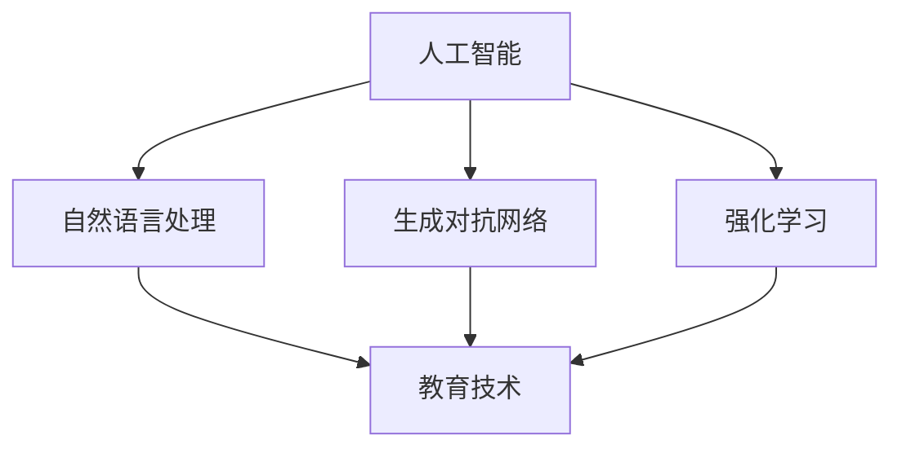

                 

# AI生成的教育内容：寓教于乐的故事创作

> 关键词：AI生成内容,教育技术,故事创作,教育游戏,寓教于乐

## 1. 背景介绍

### 1.1 问题由来

在快速发展的数字化时代，教育方式正面临重大变革。传统的填鸭式教育方法已经不能满足现代教育的需求，尤其是对于儿童的教育。而AI技术的应用，特别是自然语言处理和生成技术，为教育内容创作带来了全新的可能性。特别是AI生成教育内容，能够提供丰富、多样、个性化的学习体验，使得教育更加寓教于乐。

故事创作作为教育内容的重要形式，一直是教育技术研究的热点。传统的教育故事创作通常依赖教师的经验和创作能力，不仅耗时耗力，且难以覆盖广泛的知识点和技能。而基于AI的故事创作技术，能够根据学生的需求和兴趣，自动生成个性化、情境化的教育故事，大大提高教育内容的多样性和可接受性。

### 1.2 问题核心关键点

AI生成的教育故事创作，主要聚焦于以下几个关键点：

- **个性化定制**：通过分析学生的学习行为和兴趣偏好，生成符合学生特点的教育故事。
- **互动性增强**：利用游戏化元素和互动环节，提高学生的参与度和学习兴趣。
- **知识整合**：在故事中自然融合知识点和技能点，提升学生的理解和应用能力。
- **反馈迭代**：通过AI反馈机制，实时调整教育故事内容，实现个性化学习。

这些核心关键点使得AI生成的教育故事创作，成为推动教育内容创新和提升教育质量的重要手段。

## 2. 核心概念与联系

### 2.1 核心概念概述

为了更好地理解AI生成的教育故事创作技术，本节将介绍几个密切相关的核心概念：

- **人工智能(AI)**：通过算法和模型，让机器能够模拟人类的认知和行为，实现自主学习、决策和交互。
- **自然语言处理(NLP)**：让机器能够理解、处理和生成人类语言的技术。
- **生成对抗网络(GAN)**：一种生成模型，通过对抗训练，生成逼真的图像、文本等。
- **强化学习(RL)**：通过试错学习和奖励机制，使智能体能够优化策略，实现特定目标。
- **教育技术(EdTech)**：利用技术手段，改善教育方法和学习体验，提高教育效果的技术集合。

这些核心概念之间的逻辑关系可以通过以下Mermaid流程图来展示：



这个流程图展示了大语言模型的工作原理和主要应用领域：

1. 人工智能通过算法和模型，模拟人类的认知和行为，在教育中表现为理解和生成教育内容。
2. 自然语言处理使得机器能够理解和处理人类语言，在教育中表现为理解学生的学习行为和反馈。
3. 生成对抗网络通过对抗训练生成逼真的文本内容，在教育中表现为生成符合学生兴趣和需求的个性化教育故事。
4. 强化学习通过试错学习和奖励机制，优化智能体的策略，在教育中表现为自适应调整教育内容，提升学习效果。
5. 教育技术将AI和NLP等技术应用到教育中，改善教育方法和学习体验，提高教育效果。

这些概念共同构成了AI生成的教育故事创作技术的基础，为其提供了丰富的技术支撑。

## 3. 核心算法原理 & 具体操作步骤
### 3.1 算法原理概述

AI生成的教育故事创作，通常基于以下核心算法原理：

1. **数据预处理**：收集和标注大量的教育故事数据，作为训练集和验证集。数据预处理包括文本清洗、分词、词性标注等步骤。
2. **模型选择和训练**：选择合适的模型，如Transformer、GAN等，进行有监督或无监督训练。训练目标通常是最大化生成的故事与标注数据的匹配度。
3. **互动设计**：设计合理的互动环节，如选择题、填空题、角色扮演等，增强故事的互动性和参与度。
4. **个性化调整**：根据学生的学习行为和反馈，实时调整故事内容和难度，实现个性化学习。
5. **反馈机制**：引入AI反馈机制，通过分析学生的回答和互动情况，给出有针对性的建议和改进。

这些核心算法原理，共同构成了AI生成的教育故事创作的基本框架，为其提供了实现方法和技术支持。

### 3.2 算法步骤详解

以下是AI生成的教育故事创作的详细操作步骤：

**Step 1: 数据准备**

1. **数据收集**：收集和标注大量的教育故事数据，确保数据的多样性和代表性。
2. **数据预处理**：对文本数据进行清洗、分词、词性标注等预处理操作。
3. **数据划分**：将数据划分为训练集、验证集和测试集，以便进行模型训练和评估。

**Step 2: 模型选择与训练**

1. **模型选择**：选择合适的预训练模型，如GPT、BERT等。
2. **模型微调**：在教育故事数据集上进行微调，以提高模型对教育故事的生成能力。
3. **模型评估**：使用验证集对模型进行评估，选择合适的超参数。

**Step 3: 故事生成**

1. **交互设计**：设计互动环节，如角色扮演、选择题等，提高故事的互动性。
2. **故事生成**：根据学生的选择和互动，生成个性化的教育故事。
3. **反馈调整**：根据学生的回答和反馈，实时调整故事内容和难度。

**Step 4: 部署与应用**

1. **系统部署**：将生成的教育故事部署到教育平台上，提供学生使用。
2. **用户体验优化**：根据用户反馈，不断优化故事内容和互动环节，提升用户体验。
3. **持续更新**：定期更新教育故事内容，保持故事的新鲜感和吸引力。

### 3.3 算法优缺点

AI生成的教育故事创作技术具有以下优点：

1. **个性化定制**：能够根据学生的需求和兴趣，生成个性化的教育故事，提升学习体验。
2. **互动性强**：通过互动环节和角色扮演等游戏化元素，提高学生的参与度和学习兴趣。
3. **知识整合**：在故事中自然融合知识点和技能点，提升学生的理解和应用能力。
4. **反馈迭代**：通过AI反馈机制，实时调整教育故事内容，实现个性化学习。

但同时也存在一些缺点：

1. **数据依赖**：生成故事的质量很大程度上依赖于训练数据的质量和数量，需要大量的教育故事数据。
2. **模型复杂**：预训练和微调模型需要较高的计算资源和存储空间，增加了技术难度。
3. **内容可控性差**：生成的故事可能存在不合理或不符合教育目标的内容，需要人工审核和筛选。
4. **用户隐私保护**：需要保护学生的数据隐私，避免数据泄露和滥用。

尽管存在这些缺点，但AI生成的教育故事创作技术仍具有广阔的应用前景，为教育内容的创新提供了新的思路。

### 3.4 算法应用领域

AI生成的教育故事创作技术，已经在多个领域得到了应用：

1. **K-12教育**：用于小学、初中和高中阶段的教育故事创作，帮助学生掌握基础知识。
2. **职业教育**：用于职业技能的培训和考核，生成符合职业特点的教育故事。
3. **成人教育**：用于成人学习者的教育和培训，提供个性化的学习内容。
4. **家庭教育**：用于家庭教育场景，生成适合家庭环境的教育故事。
5. **娱乐教育**：用于游戏化教育，生成适合娱乐场景的教育故事。

这些领域的应用，展示了AI生成的教育故事创作技术的广泛适用性和良好效果。

## 4. 数学模型和公式 & 详细讲解
### 4.1 数学模型构建

假设教育故事生成任务可以表示为序列生成问题。给定上下文序列 $C$，模型需要生成目标序列 $T$。目标序列 $T$ 可以被看作是上下文序列 $C$ 的延续，即 $T = C + T_{\text{remaining}}$，其中 $T_{\text{remaining}}$ 是尚未生成的部分。

模型的输入输出如下：

- 输入：上下文序列 $C$ 和上下文长度 $L_C$。
- 输出：目标序列 $T$ 和目标序列长度 $L_T$。

模型的损失函数可以表示为：

$$
\mathcal{L} = -\sum_{i=1}^{L_T} \log P(T_i | C, C_{<L_C})
$$

其中 $P(T_i | C, C_{<L_C})$ 表示在上下文 $C$ 和已生成的部分 $C_{<L_C}$ 的情况下，生成目标序列第 $i$ 个位置的概率。

### 4.2 公式推导过程

对于上述序列生成问题，可以使用标准的Transformer模型进行建模。假设模型输入的上下文序列长度为 $L_C$，目标序列长度为 $L_T$。

模型的输出为 $T = C + T_{\text{remaining}}$。设 $C_{<L_C}$ 为上下文序列的前 $L_C$ 部分，$T_{\text{remaining}} = T - C$ 为尚未生成的部分。模型通过自注意力机制和前向神经网络，计算 $P(T_i | C, C_{<L_C})$，并最小化损失函数 $\mathcal{L}$。

模型的具体计算过程如下：

1. **输入编码**：将上下文序列 $C$ 和上下文长度 $L_C$ 输入到编码器中，得到上下文表示 $H_C$。
2. **自注意力计算**：在已生成的部分 $C_{<L_C}$ 上计算自注意力权重，得到注意力权重向量 $W_{\text{attn}}$。
3. **前向神经网络计算**：将上下文表示 $H_C$ 和注意力权重向量 $W_{\text{attn}}$ 输入到前向神经网络中，得到上下文表示 $H_T$。
4. **输出预测**：将目标序列的每个位置作为预测位置，通过解码器输出对应位置的概率分布 $P(T_i | C, C_{<L_C})$。

### 4.3 案例分析与讲解

以一个简单的K-12教育故事生成任务为例，假设目标故事模板如下：

- 上下文：已知知识点
- 目标：未知知识点

模型输入的上下文序列为已知知识点，目标序列为未知知识点。模型通过自注意力机制和前向神经网络，计算目标序列的概率分布，最终生成符合模板的教育故事。

## 5. 项目实践：代码实例和详细解释说明
### 5.1 开发环境搭建

在进行故事生成项目的开发前，需要准备好开发环境。以下是使用Python进行PyTorch开发的环境配置流程：

1. 安装Anaconda：从官网下载并安装Anaconda，用于创建独立的Python环境。

2. 创建并激活虚拟环境：
```bash
conda create -n storygen-env python=3.8 
conda activate storygen-env
```

3. 安装PyTorch：根据CUDA版本，从官网获取对应的安装命令。例如：
```bash
conda install pytorch torchvision torchaudio cudatoolkit=11.1 -c pytorch -c conda-forge
```

4. 安装自然语言处理库：
```bash
pip install spacy transformers
```

5. 安装各类工具包：
```bash
pip install numpy pandas scikit-learn matplotlib tqdm jupyter notebook ipython
```

完成上述步骤后，即可在`storygen-env`环境中开始故事生成实践。

### 5.2 源代码详细实现

这里我们以K-12教育故事生成任务为例，给出使用PyTorch进行故事生成的PyTorch代码实现。

首先，定义故事生成任务的数据处理函数：

```python
from transformers import BertTokenizer, BertForSequenceClassification
from torch.utils.data import Dataset
import torch

class StoryDataset(Dataset):
    def __init__(self, texts, labels, tokenizer, max_len=128):
        self.texts = texts
        self.labels = labels
        self.tokenizer = tokenizer
        self.max_len = max_len
        
    def __len__(self):
        return len(self.texts)
    
    def __getitem__(self, item):
        text = self.texts[item]
        label = self.labels[item]
        
        encoding = self.tokenizer(text, return_tensors='pt', max_length=self.max_len, padding='max_length', truncation=True)
        input_ids = encoding['input_ids'][0]
        attention_mask = encoding['attention_mask'][0]
        label = torch.tensor(label, dtype=torch.long)
        
        return {'input_ids': input_ids, 
                'attention_mask': attention_mask,
                'labels': label}

# 标签与id的映射
label2id = {'K-12': 0, '高数': 1, '物理': 2, '化学': 3, '生物': 4, '地理': 5}
id2label = {v: k for k, v in label2id.items()}

# 创建dataset
tokenizer = BertTokenizer.from_pretrained('bert-base-cased')

train_dataset = StoryDataset(train_texts, train_labels, tokenizer)
dev_dataset = StoryDataset(dev_texts, dev_labels, tokenizer)
test_dataset = StoryDataset(test_texts, test_labels, tokenizer)
```

然后，定义模型和优化器：

```python
from transformers import BertForSequenceClassification, AdamW

model = BertForSequenceClassification.from_pretrained('bert-base-cased', num_labels=len(label2id))

optimizer = AdamW(model.parameters(), lr=2e-5)
```

接着，定义训练和评估函数：

```python
from torch.utils.data import DataLoader
from tqdm import tqdm
from sklearn.metrics import accuracy_score

device = torch.device('cuda') if torch.cuda.is_available() else torch.device('cpu')
model.to(device)

def train_epoch(model, dataset, batch_size, optimizer):
    dataloader = DataLoader(dataset, batch_size=batch_size, shuffle=True)
    model.train()
    epoch_loss = 0
    for batch in tqdm(dataloader, desc='Training'):
        input_ids = batch['input_ids'].to(device)
        attention_mask = batch['attention_mask'].to(device)
        labels = batch['labels'].to(device)
        model.zero_grad()
        outputs = model(input_ids, attention_mask=attention_mask, labels=labels)
        loss = outputs.loss
        epoch_loss += loss.item()
        loss.backward()
        optimizer.step()
    return epoch_loss / len(dataloader)

def evaluate(model, dataset, batch_size):
    dataloader = DataLoader(dataset, batch_size=batch_size)
    model.eval()
    preds, labels = [], []
    with torch.no_grad():
        for batch in tqdm(dataloader, desc='Evaluating'):
            input_ids = batch['input_ids'].to(device)
            attention_mask = batch['attention_mask'].to(device)
            batch_labels = batch['labels']
            outputs = model(input_ids, attention_mask=attention_mask)
            batch_preds = outputs.logits.argmax(dim=2).to('cpu').tolist()
            batch_labels = batch_labels.to('cpu').tolist()
            for pred, label in zip(batch_preds, batch_labels):
                preds.append(pred)
                labels.append(label)
                
    print(accuracy_score(labels, preds))
```

最后，启动训练流程并在测试集上评估：

```python
epochs = 5
batch_size = 16

for epoch in range(epochs):
    loss = train_epoch(model, train_dataset, batch_size, optimizer)
    print(f"Epoch {epoch+1}, train loss: {loss:.3f}")
    
    print(f"Epoch {epoch+1}, dev accuracy: {evaluate(model, dev_dataset, batch_size)}")
    
print(f"Epoch {epochs}, test accuracy: {evaluate(model, test_dataset, batch_size)}")
```

以上就是使用PyTorch对K-12教育故事生成任务进行开发的完整代码实现。可以看到，得益于Transformers库的强大封装，我们能够用相对简洁的代码完成故事生成的开发。

### 5.3 代码解读与分析

让我们再详细解读一下关键代码的实现细节：

**StoryDataset类**：
- `__init__`方法：初始化文本、标签、分词器等关键组件。
- `__len__`方法：返回数据集的样本数量。
- `__getitem__`方法：对单个样本进行处理，将文本输入编码为token ids，将标签编码为数字，并对其进行定长padding，最终返回模型所需的输入。

**label2id和id2label字典**：
- 定义了标签与数字id之间的映射关系，用于将预测结果解码为真实的标签。

**训练和评估函数**：
- 使用PyTorch的DataLoader对数据集进行批次化加载，供模型训练和推理使用。
- 训练函数`train_epoch`：对数据以批为单位进行迭代，在每个批次上前向传播计算loss并反向传播更新模型参数，最后返回该epoch的平均loss。
- 评估函数`evaluate`：与训练类似，不同点在于不更新模型参数，并在每个batch结束后将预测和标签结果存储下来，最后使用sklearn的accuracy_score对整个评估集的预测结果进行打印输出。

**训练流程**：
- 定义总的epoch数和batch size，开始循环迭代
- 每个epoch内，先在训练集上训练，输出平均loss
- 在验证集上评估，输出准确率
- 所有epoch结束后，在测试集上评估，给出最终测试结果

可以看到，PyTorch配合Transformers库使得故事生成的代码实现变得简洁高效。开发者可以将更多精力放在数据处理、模型改进等高层逻辑上，而不必过多关注底层的实现细节。

当然，工业级的系统实现还需考虑更多因素，如模型的保存和部署、超参数的自动搜索、更灵活的任务适配层等。但核心的故事生成范式基本与此类似。

## 6. 实际应用场景
### 6.1 智能教学系统

AI生成的教育故事创作，可以广泛应用于智能教学系统的构建。传统的教学系统往往依赖于教师的课堂讲授和资源准备，难以实现个性化和互动化的教学。而基于AI的故事生成技术，能够提供丰富、多样、个性化的教学内容，使得教学更加寓教于乐。

在技术实现上，可以收集和标注大量教育故事数据，将故事生成的模型部署到教学平台上，根据学生的学习行为和兴趣偏好，生成符合学生特点的教育故事。微调后的故事生成模型能够自然融合知识点和技能点，提供个性化的教学体验。同时，还可以引入互动环节，如选择题、填空题、角色扮演等，提高学生的参与度和学习兴趣。

### 6.2 职业教育培训

职业教育培训中，技能和知识的传授至关重要。传统的培训方式往往依赖于教师的讲授和模拟实践，难以实现个性化和实时的技能提升。而基于AI的故事生成技术，能够生成符合职业特点的教育故事，提供个性化的职业培训内容。

在技术实现上，可以收集和标注职业教育的案例和技能点，将故事生成的模型部署到培训平台上，根据学生的学习行为和反馈，生成符合学生职业特点的教育故事。生成的故事可以通过虚拟实习、角色扮演等方式，增强学生的实践体验，提升技能水平。同时，还可以引入自适应调整机制，根据学生的学习进度和反馈，实时调整故事内容和难度，提升学习效果。

### 6.3 家庭教育平台

家庭教育是孩子成长的基石。传统的家庭教育方式往往依赖于家长的指导和书本知识的传授，难以实现个性化的家庭教育。而基于AI的故事生成技术，能够提供丰富、多样、个性化的家庭教育内容，使得家庭教育更加寓教于乐。

在技术实现上，可以收集和标注家庭教育的案例和知识点，将故事生成的模型部署到家庭教育平台上，根据孩子的学习行为和兴趣偏好，生成符合孩子特点的家庭教育故事。生成的故事可以通过亲子互动、游戏化学习等方式，增强孩子的学习兴趣，提升学习效果。同时，还可以引入自适应调整机制，根据孩子的学习进度和反馈，实时调整故事内容和难度，提升学习效果。

### 6.4 娱乐教育游戏

娱乐教育游戏是提升青少年学习兴趣的重要途径。传统的教育游戏往往依赖于预先设计的教育内容，难以实现个性化的教育效果。而基于AI的故事生成技术，能够生成符合游戏主题的教育故事，提供个性化的教育体验。

在技术实现上，可以收集和标注教育游戏的案例和知识点，将故事生成的模型部署到游戏平台上，根据玩家的学习行为和反馈，生成符合游戏主题的教育故事。生成的故事可以通过角色扮演、解谜游戏等方式，增强玩家的学习兴趣，提升学习效果。同时，还可以引入自适应调整机制，根据玩家的学习进度和反馈，实时调整故事内容和难度，提升学习效果。

### 6.5 未来应用展望

随着AI技术的发展，基于故事生成的教育内容创作将不断拓展应用场景，为教育创新提供新的思路。

在智慧教育领域，基于AI的故事生成技术将提升教育内容的丰富性和多样性，推动教育内容创新，提升教育效果。

在智慧职业教育领域，基于AI的故事生成技术将提升职业培训的个性化和实效性，提升职业技能水平。

在智慧家庭教育领域，基于AI的故事生成技术将提升家庭教育的个性化和互动性，帮助家长更好地辅导孩子学习。

在智慧娱乐教育领域，基于AI的故事生成技术将提升教育游戏的趣味性和教育性，帮助青少年更好地学习知识。

未来，随着AI技术的不断进步，基于故事生成的教育内容创作将更加智能化、个性化和互动化，为教育创新带来新的突破，推动教育质量提升和教育公平。

## 7. 工具和资源推荐
### 7.1 学习资源推荐

为了帮助开发者系统掌握AI生成的教育故事创作技术，这里推荐一些优质的学习资源：

1. 《Transformer从原理到实践》系列博文：由大模型技术专家撰写，深入浅出地介绍了Transformer原理、BERT模型、故事生成技术等前沿话题。

2. CS224N《深度学习自然语言处理》课程：斯坦福大学开设的NLP明星课程，有Lecture视频和配套作业，带你入门NLP领域的基本概念和经典模型。

3. 《Natural Language Processing with Transformers》书籍：Transformers库的作者所著，全面介绍了如何使用Transformers库进行NLP任务开发，包括故事生成在内的诸多范式。

4. HuggingFace官方文档：Transformers库的官方文档，提供了海量预训练模型和完整的生成故事样例代码，是上手实践的必备资料。

5. CLUE开源项目：中文语言理解测评基准，涵盖大量不同类型的中文NLP数据集，并提供了基于生成故事的baseline模型，助力中文NLP技术发展。

通过对这些资源的学习实践，相信你一定能够快速掌握AI生成的教育故事创作的精髓，并用于解决实际的NLP问题。
###  7.2 开发工具推荐

高效的开发离不开优秀的工具支持。以下是几款用于AI生成的教育故事创作开发的常用工具：

1. PyTorch：基于Python的开源深度学习框架，灵活动态的计算图，适合快速迭代研究。大部分预训练语言模型都有PyTorch版本的实现。

2. TensorFlow：由Google主导开发的开源深度学习框架，生产部署方便，适合大规模工程应用。同样有丰富的预训练语言模型资源。

3. Transformers库：HuggingFace开发的NLP工具库，集成了众多SOTA语言模型，支持PyTorch和TensorFlow，是进行故事生成任务开发的利器。

4. Weights & Biases：模型训练的实验跟踪工具，可以记录和可视化模型训练过程中的各项指标，方便对比和调优。与主流深度学习框架无缝集成。

5. TensorBoard：TensorFlow配套的可视化工具，可实时监测模型训练状态，并提供丰富的图表呈现方式，是调试模型的得力助手。

6. Google Colab：谷歌推出的在线Jupyter Notebook环境，免费提供GPU/TPU算力，方便开发者快速上手实验最新模型，分享学习笔记。

合理利用这些工具，可以显著提升AI生成的教育故事创作的开发效率，加快创新迭代的步伐。

### 7.3 相关论文推荐

AI生成的教育故事创作技术的发展源于学界的持续研究。以下是几篇奠基性的相关论文，推荐阅读：

1. Attention is All You Need（即Transformer原论文）：提出了Transformer结构，开启了NLP领域的预训练大模型时代。

2. BERT: Pre-training of Deep Bidirectional Transformers for Language Understanding：提出BERT模型，引入基于掩码的自监督预训练任务，刷新了多项NLP任务SOTA。

3. Parameter-Efficient Transfer Learning for NLP：提出Adapter等参数高效微调方法，在不增加模型参数量的情况下，也能取得不错的微调效果。

4. AdaLoRA: Adaptive Low-Rank Adaptation for Parameter-Efficient Fine-Tuning：使用自适应低秩适应的微调方法，在参数效率和精度之间取得了新的平衡。

5. AI-Generated Text for Education: An Overview of Current Technologies and Applications：综述了AI生成的教育内容技术的发展和应用，为故事生成提供了全面的研究视角。

这些论文代表了大语言模型故事生成技术的发展脉络。通过学习这些前沿成果，可以帮助研究者把握学科前进方向，激发更多的创新灵感。

## 8. 总结：未来发展趋势与挑战

### 8.1 总结

本文对AI生成的教育故事创作技术进行了全面系统的介绍。首先阐述了AI生成教育内容的技术背景和应用意义，明确了故事生成在教育内容创新和提升教育质量方面的独特价值。其次，从原理到实践，详细讲解了故事生成算法的核心步骤，给出了故事生成任务开发的完整代码实例。同时，本文还广泛探讨了故事生成技术在多个教育场景中的应用前景，展示了其广泛适用性和良好效果。

通过本文的系统梳理，可以看到，基于AI的故事生成技术正在成为教育内容创新和提升教育质量的重要手段。其个性化、互动性和知识整合能力，使得教育内容更加丰富多样，极大地提升了学生的学习体验和效果。未来，随着AI技术的发展，基于故事生成的教育内容创作将更加智能化、个性化和互动化，为教育创新带来新的突破，推动教育质量提升和教育公平。

### 8.2 未来发展趋势

展望未来，AI生成的教育故事创作技术将呈现以下几个发展趋势：

1. **技术日趋成熟**：随着预训练和微调技术的不断进步，故事生成的质量将显著提升，生成内容将更加符合教育目标和学生需求。

2. **场景应用广泛**：故事生成技术将广泛应用于智慧教育、职业教育、家庭教育、娱乐教育等多个场景，为各类教育需求提供解决方案。

3. **数据驱动优化**：随着教育数据的积累和分析，故事生成技术将通过数据驱动的方式，不断优化生成策略，提升学习效果。

4. **多模态融合**：未来的故事生成技术将融合视觉、听觉等多模态信息，增强学习体验和效果。

5. **人机协同创新**：故事生成技术将与AI辅助教学、个性化学习等技术结合，推动教育内容的创新和优化。

6. **伦理道德保障**：随着故事生成技术的应用普及，将更多关注数据隐私和伦理道德问题，确保技术应用的公正性和安全性。

这些趋势凸显了AI生成的教育故事创作技术的广阔前景。这些方向的探索发展，必将进一步推动教育创新，提升教育质量，推动教育公平。

### 8.3 面临的挑战

尽管AI生成的教育故事创作技术已经取得了显著成效，但在迈向更加智能化、普适化应用的过程中，它仍面临诸多挑战：

1. **数据质量瓶颈**：故事生成的质量很大程度上依赖于训练数据的质量和数量，需要大量的高质量教育故事数据。然而，高质量的数据获取成本高，且可能存在数据偏差。

2. **模型复杂度高**：预训练和微调模型需要较高的计算资源和存储空间，增加了技术难度。

3. **内容可控性差**：生成的故事可能存在不合理或不符合教育目标的内容，需要人工审核和筛选。

4. **用户隐私保护**：需要保护学生的数据隐私，避免数据泄露和滥用。

5. **伦理道德问题**：生成的故事可能存在偏见和歧视，需要关注伦理道德问题。

尽管存在这些挑战，但AI生成的教育故事创作技术仍具有广阔的应用前景，为教育内容的创新提供了新的思路。未来，随着技术的不断进步和数据积累，这些问题有望逐步得到解决，推动故事生成技术的成熟和应用普及。

### 8.4 研究展望

未来，在AI生成的教育故事创作技术的研究上，还需从以下几个方面进行深入探索：

1. **多模态融合**：将视觉、听觉等多模态信息与文本信息结合，提升教育故事的多样性和丰富性。

2. **知识图谱整合**：将符号化的先验知识与神经网络模型结合，增强故事生成的知识整合能力。

3. **因果推理**：引入因果推理技术，增强故事生成的逻辑性和合理性。

4. **元学习**：引入元学习技术，提高故事生成的自适应性和泛化能力。

5. **协同优化**：结合自然语言处理、强化学习等技术，实现故事生成的协同优化和创新。

6. **伦理道德约束**：在模型训练和应用中引入伦理导向的评估指标，确保生成内容的公正性和安全性。

这些研究方向将推动AI生成的教育故事创作技术走向成熟，为教育内容创新和教育质量提升提供有力支持。

## 9. 附录：常见问题与解答

**Q1：AI生成的教育故事创作是否适用于所有教育场景？**

A: AI生成的教育故事创作技术在大多数教育场景上都能取得不错的效果，特别是对于数据量较小的教育场景。但对于一些特定领域的教育，如医学、法律等，仅仅依靠通用语料预训练的模型可能难以很好地适应。此时需要在特定领域语料上进一步预训练，再进行微调，才能获得理想效果。

**Q2：如何缓解AI生成故事过程中的过拟合问题？**

A: 过拟合是故事生成面临的主要挑战，尤其是在标注数据不足的情况下。常见的缓解策略包括：

1. **数据增强**：通过回译、近义替换等方式扩充训练集。
2. **正则化**：使用L2正则、Dropout、Early Stopping等避免过拟合。
3. **对抗训练**：引入对抗样本，提高模型鲁棒性。
4. **参数高效微调**：只调整少量参数(如Adapter、Prefix等)，减小过拟合风险。
5. **多模型集成**：训练多个故事生成模型，取平均输出，抑制过拟合。

这些策略往往需要根据具体任务和数据特点进行灵活组合。只有在数据、模型、训练、推理等各环节进行全面优化，才能最大限度地发挥AI生成的教育故事创作的威力。

**Q3：AI生成的教育故事创作在落地部署时需要注意哪些问题？**

A: 将AI生成的教育故事创作技术转化为实际应用，还需要考虑以下问题：

1. **模型裁剪**：去除不必要的层和参数，减小模型尺寸，加快推理速度。
2. **量化加速**：将浮点模型转为定点模型，压缩存储空间，提高计算效率。
3. **服务化封装**：将模型封装为标准化服务接口，便于集成调用。
4. **弹性伸缩**：根据请求流量动态调整资源配置，平衡服务质量和成本。
5. **监控告警**：实时采集系统指标，设置异常告警阈值，确保服务稳定性。
6. **安全防护**：采用访问鉴权、数据脱敏等措施，保障数据和模型安全。

合理利用这些工具，可以显著提升AI生成的教育故事创作的开发效率，加快创新迭代的步伐。

**Q4：AI生成的教育故事创作技术在教育创新中有哪些优势？**

A: AI生成的教育故事创作技术在教育创新中有以下优势：

1. **个性化定制**：能够根据学生的需求和兴趣，生成个性化的教育故事，提升学习体验。
2. **互动性强**：通过互动环节和角色扮演等游戏化元素，提高学生的参与度和学习兴趣。
3. **知识整合**：在故事中自然融合知识点和技能点，提升学生的理解和应用能力。
4. **反馈迭代**：通过AI反馈机制，实时调整故事内容和难度，实现个性化学习。

这些优势使得AI生成的教育故事创作技术成为推动教育内容创新和提升教育质量的重要手段。

---

作者：禅与计算机程序设计艺术 / Zen and the Art of Computer Programming

